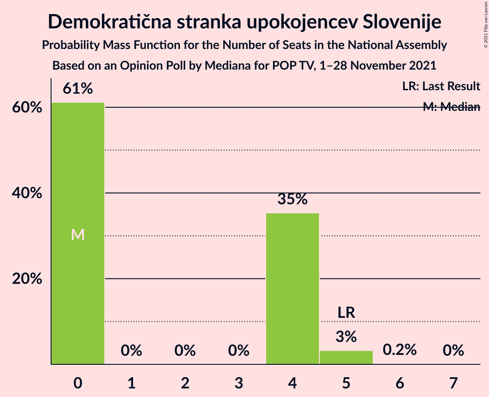

# Opinion Poll by Mediana for POP TV, 1–28 November 2021

<a href="#voting-intentions">Voting Intentions</a> | <a href="#seats">Seats</a> | <a href="#coalitions">Coalitions</a> | <a href="#technical-information">Technical Information</a>

## Voting Intentions

### Confidence Intervals

| Party | Last Result | Poll Result | 80% Confidence Interval | 90% Confidence Interval | 95% Confidence Interval | 99% Confidence Interval |
|:-----:|:-----------:|:-----------:|:-----------------------:|:-----------------------:|:-----------------------:|:-----------------------:|
| Slovenska demokratska stranka | 24.9% | 26.1% | 24.0–28.3% |23.5–28.9% |23.0–29.4% |22.0–30.5% |
| Socialni demokrati | 9.9% | 17.9% | 16.1–19.8% |15.7–20.4% |15.2–20.9% |14.4–21.9% |
| Levica | 9.3% | 12.3% | 10.8–14.0% |10.4–14.4% |10.0–14.9% |9.4–15.7% |
| Lista Marjana Šarca | 12.6% | 8.6% | 7.4–10.1% |7.0–10.5% |6.7–10.9% |6.2–11.6% |
| Nova Slovenija–Krščanski demokrati | 7.2% | 7.7% | 6.6–9.2% |6.3–9.6% |6.0–10.0% |5.5–10.7% |
| Stranka Alenke Bratušek | 5.1% | 7.0% | 5.9–8.4% |5.6–8.8% |5.4–9.2% |4.9–9.9% |
| Piratska stranka Slovenije | 2.2% | 4.5% | 3.6–5.7% |3.4–6.0% |3.2–6.3% |2.8–6.9% |
| Demokratična stranka upokojencev Slovenije | 4.9% | 3.2% | 2.5–4.3% |2.3–4.6% |2.2–4.8% |1.9–5.4% |
| Andrej Čuš in Zeleni Slovenije | 1.1% | 3.0% | 2.3–3.9% |2.1–4.2% |1.9–4.5% |1.7–5.0% |
| Slovenska nacionalna stranka | 4.2% | 1.5% | 1.1–2.3% |1.0–2.6% |0.9–2.8% |0.7–3.2% |
| Slovenska ljudska stranka | 2.6% | 1.5% | 1.1–2.3% |1.0–2.6% |0.9–2.8% |0.7–3.2% |
| Dobra država | 1.5% | 1.5% | 1.1–2.3% |1.0–2.6% |0.9–2.8% |0.7–3.2% |
| Stranka modernega centra | 9.7% | 1.1% | 0.8–1.8% |0.7–2.0% |0.6–2.2% |0.4–2.6% |

*Note:* The poll result column reflects the actual value used in the calculations. Published results may vary slightly, and in addition be rounded to fewer digits.

## Seats

### Confidence Intervals

| Party | Last Result | Median | 80% Confidence Interval | 90% Confidence Interval | 95% Confidence Interval | 99% Confidence Interval |
|:-----:|:-----------:|:------:|:-----------------------:|:-----------------------:|:-----------------------:|:-----------------------:|
| <a href="#slovenska-demokratska-stranka">Slovenska demokratska stranka</a> | 25 | 28 | 26–30 |25–30 |25–30 |23–31 |
| <a href="#socialni-demokrati">Socialni demokrati</a> | 10 | 18 | 16–20 |16–22 |15–22 |15–22 |
| <a href="#levica">Levica</a> | 9 | 13 | 11–14 |10–15 |10–15 |9–17 |
| <a href="#lista-marjana-šarca">Lista Marjana Šarca</a> | 13 | 8 | 7–10 |7–11 |7–11 |6–12 |
| <a href="#nova-slovenija–krščanski-demokrati">Nova Slovenija–Krščanski demokrati</a> | 7 | 7 | 6–10 |6–10 |6–10 |5–11 |
| <a href="#stranka-alenke-bratušek">Stranka Alenke Bratušek</a> | 5 | 7 | 6–8 |5–8 |5–8 |4–10 |
| <a href="#piratska-stranka-slovenije">Piratska stranka Slovenije</a> | 0 | 4 | 0–6 |0–6 |0–6 |0–7 |
| <a href="#demokratična-stranka-upokojencev-slovenije">Demokratična stranka upokojencev Slovenije</a> | 5 | 0 | 0–4 |0–4 |0–5 |0–5 |
| <a href="#andrej-čuš-in-zeleni-slovenije">Andrej Čuš in Zeleni Slovenije</a> | 0 | 0 | 0 |0–4 |0–4 |0–4 |
| <a href="#slovenska-nacionalna-stranka">Slovenska nacionalna stranka</a> | 4 | 0 | 0 |0 |0 |0 |
| <a href="#slovenska-ljudska-stranka">Slovenska ljudska stranka</a> | 0 | 0 | 0 |0 |0 |0 |
| <a href="#dobra-država">Dobra država</a> | 0 | 0 | 0 |0 |0 |0 |
| <a href="#stranka-modernega-centra">Stranka modernega centra</a> | 10 | 0 | 0 |0 |0 |0 |

### Slovenska demokratska stranka

*For a full overview of the results for this party, see the [Slovenska demokratska stranka](party-slovenskademokratskastranka.html) page.*

| Number of Seats | Probability | Accumulated | Special Marks |
|:---------------:|:-----------:|:-----------:|:-------------:|
| 21 | 0.1% | 100% |  |
| 22 | 0.3% | 99.9% |  |
| 23 | 1.2% | 99.6% |  |
| 24 | 0.8% | 98% |  |
| 25 | 4% | 98% | Last Result |
| 26 | 12% | 93% |  |
| 27 | 8% | 82% |  |
| 28 | 56% | 73% | Median |
| 29 | 7% | 17% |  |
| 30 | 8% | 10% |  |
| 31 | 1.3% | 2% |  |
| 32 | 0.1% | 0.4% |  |
| 33 | 0.1% | 0.3% |  |
| 34 | 0% | 0.2% |  |
| 35 | 0.2% | 0.2% |  |
| 36 | 0% | 0% |  |

### Socialni demokrati

*For a full overview of the results for this party, see the [Socialni demokrati](party-socialnidemokrati.html) page.*

| Number of Seats | Probability | Accumulated | Special Marks |
|:---------------:|:-----------:|:-----------:|:-------------:|
| 10 | 0% | 100% | Last Result |
| 11 | 0% | 100% |  |
| 12 | 0% | 100% |  |
| 13 | 0.1% | 100% |  |
| 14 | 0.2% | 99.9% |  |
| 15 | 3% | 99.8% |  |
| 16 | 10% | 97% |  |
| 17 | 33% | 87% |  |
| 18 | 11% | 54% | Median |
| 19 | 32% | 43% |  |
| 20 | 3% | 11% |  |
| 21 | 1.2% | 7% |  |
| 22 | 6% | 6% |  |
| 23 | 0.1% | 0.2% |  |
| 24 | 0.1% | 0.1% |  |
| 25 | 0% | 0% |  |

### Levica

*For a full overview of the results for this party, see the [Levica](party-levica.html) page.*

| Number of Seats | Probability | Accumulated | Special Marks |
|:---------------:|:-----------:|:-----------:|:-------------:|
| 8 | 0.1% | 100% |  |
| 9 | 1.0% | 99.9% | Last Result |
| 10 | 8% | 98.9% |  |
| 11 | 15% | 90% |  |
| 12 | 10% | 75% |  |
| 13 | 38% | 65% | Median |
| 14 | 22% | 27% |  |
| 15 | 3% | 5% |  |
| 16 | 0.5% | 2% |  |
| 17 | 1.1% | 1.2% |  |
| 18 | 0.1% | 0.1% |  |
| 19 | 0% | 0% |  |

### Lista Marjana Šarca

*For a full overview of the results for this party, see the [Lista Marjana Šarca](party-listamarjanašarca.html) page.*

| Number of Seats | Probability | Accumulated | Special Marks |
|:---------------:|:-----------:|:-----------:|:-------------:|
| 6 | 1.4% | 100% |  |
| 7 | 11% | 98.5% |  |
| 8 | 43% | 88% | Median |
| 9 | 21% | 45% |  |
| 10 | 15% | 24% |  |
| 11 | 8% | 9% |  |
| 12 | 0.7% | 0.7% |  |
| 13 | 0.1% | 0.1% | Last Result |
| 14 | 0% | 0% |  |

### Nova Slovenija–Krščanski demokrati

*For a full overview of the results for this party, see the [Nova Slovenija–Krščanski demokrati](party-novaslovenija–krščanskidemokrati.html) page.*

| Number of Seats | Probability | Accumulated | Special Marks |
|:---------------:|:-----------:|:-----------:|:-------------:|
| 5 | 0.7% | 100% |  |
| 6 | 33% | 99.3% |  |
| 7 | 22% | 67% | Last Result, Median |
| 8 | 15% | 44% |  |
| 9 | 11% | 29% |  |
| 10 | 18% | 18% |  |
| 11 | 0.5% | 0.6% |  |
| 12 | 0% | 0.1% |  |
| 13 | 0% | 0% |  |

### Stranka Alenke Bratušek

*For a full overview of the results for this party, see the [Stranka Alenke Bratušek](party-strankaalenkebratušek.html) page.*

| Number of Seats | Probability | Accumulated | Special Marks |
|:---------------:|:-----------:|:-----------:|:-------------:|
| 4 | 0.8% | 100% |  |
| 5 | 5% | 99.2% | Last Result |
| 6 | 33% | 94% |  |
| 7 | 42% | 62% | Median |
| 8 | 18% | 20% |  |
| 9 | 1.1% | 2% |  |
| 10 | 1.2% | 1.3% |  |
| 11 | 0.1% | 0.1% |  |
| 12 | 0% | 0% |  |

### Piratska stranka Slovenije

*For a full overview of the results for this party, see the [Piratska stranka Slovenije](party-piratskastrankaslovenije.html) page.*

| Number of Seats | Probability | Accumulated | Special Marks |
|:---------------:|:-----------:|:-----------:|:-------------:|
| 0 | 20% | 100% | Last Result |
| 1 | 0% | 80% |  |
| 2 | 0% | 80% |  |
| 3 | 0% | 80% |  |
| 4 | 47% | 80% | Median |
| 5 | 20% | 32% |  |
| 6 | 12% | 13% |  |
| 7 | 0.4% | 0.5% |  |
| 8 | 0.1% | 0.1% |  |
| 9 | 0% | 0% |  |

### Demokratična stranka upokojencev Slovenije

*For a full overview of the results for this party, see the [Demokratična stranka upokojencev Slovenije](party-demokratičnastrankaupokojencevslovenije.html) page.*

| Number of Seats | Probability | Accumulated | Special Marks |
|:---------------:|:-----------:|:-----------:|:-------------:|
| 0 | 61% | 100% | Median |
| 1 | 0% | 39% |  |
| 2 | 0% | 39% |  |
| 3 | 0% | 39% |  |
| 4 | 35% | 39% |  |
| 5 | 3% | 3% | Last Result |
| 6 | 0.2% | 0.2% |  |
| 7 | 0% | 0% |  |

### Andrej Čuš in Zeleni Slovenije

*For a full overview of the results for this party, see the [Andrej Čuš in Zeleni Slovenije](party-andrejčušinzelenislovenije.html) page.*

| Number of Seats | Probability | Accumulated | Special Marks |
|:---------------:|:-----------:|:-----------:|:-------------:|
| 0 | 91% | 100% | Last Result, Median |
| 1 | 0% | 9% |  |
| 2 | 0% | 9% |  |
| 3 | 0% | 9% |  |
| 4 | 8% | 9% |  |
| 5 | 0.3% | 0.4% |  |
| 6 | 0% | 0% |  |

### Slovenska nacionalna stranka

*For a full overview of the results for this party, see the [Slovenska nacionalna stranka](party-slovenskanacionalnastranka.html) page.*

| Number of Seats | Probability | Accumulated | Special Marks |
|:---------------:|:-----------:|:-----------:|:-------------:|
| 0 | 100% | 100% | Median |
| 1 | 0% | 0% |  |
| 2 | 0% | 0% |  |
| 3 | 0% | 0% |  |
| 4 | 0% | 0% | Last Result |

### Slovenska ljudska stranka

*For a full overview of the results for this party, see the [Slovenska ljudska stranka](party-slovenskaljudskastranka.html) page.*

| Number of Seats | Probability | Accumulated | Special Marks |
|:---------------:|:-----------:|:-----------:|:-------------:|
| 0 | 100% | 100% | Last Result, Median |

### Dobra država

*For a full overview of the results for this party, see the [Dobra država](party-dobradržava.html) page.*

| Number of Seats | Probability | Accumulated | Special Marks |
|:---------------:|:-----------:|:-----------:|:-------------:|
| 0 | 100% | 100% | Last Result, Median |

### Stranka modernega centra

*For a full overview of the results for this party, see the [Stranka modernega centra](party-strankamodernegacentra.html) page.*

| Number of Seats | Probability | Accumulated | Special Marks |
|:---------------:|:-----------:|:-----------:|:-------------:|
| 0 | 100% | 100% | Median |
| 1 | 0% | 0% |  |
| 2 | 0% | 0% |  |
| 3 | 0% | 0% |  |
| 4 | 0% | 0% |  |
| 5 | 0% | 0% |  |
| 6 | 0% | 0% |  |
| 7 | 0% | 0% |  |
| 8 | 0% | 0% |  |
| 9 | 0% | 0% |  |
| 10 | 0% | 0% | Last Result |

## Coalitions

### Confidence Intervals

| Coalition | Last Result | Median | Majority? | 80% Confidence Interval | 90% Confidence Interval | 95% Confidence Interval | 99% Confidence Interval |
|:---------:|:-----------:|:------:|:---------:|:-----------------------:|:-----------------------:|:-----------------------:|:-----------------------:|
| Socialni demokrati – Lista Marjana Šarca – Nova Slovenija–Krščanski demokrati – Stranka Alenke Bratušek – Demokratična stranka upokojencev Slovenije – Stranka modernega centra | 50 | 43 | 14% | 39–46 | 39–47 | 38–48 | 37–49 |
| Slovenska demokratska stranka – Lista Marjana Šarca – Demokratična stranka upokojencev Slovenije | 43 | 39 | 0% | 35–40 | 34–40 | 33–42 | 31–43 |
| Slovenska demokratska stranka – Lista Marjana Šarca | 38 | 36 | 0% | 35–39 | 34–39 | 33–40 | 31–41 |
| Socialni demokrati – Lista Marjana Šarca – Nova Slovenija–Krščanski demokrati – Demokratična stranka upokojencev Slovenije | 35 | 35 | 0% | 33–39 | 32–40 | 32–40 | 30–41 |
| Socialni demokrati – Lista Marjana Šarca – Nova Slovenija–Krščanski demokrati – Demokratična stranka upokojencev Slovenije – Stranka modernega centra | 45 | 35 | 0% | 33–39 | 32–40 | 32–40 | 30–41 |
| Socialni demokrati – Lista Marjana Šarca – Stranka Alenke Bratušek – Demokratična stranka upokojencev Slovenije – Stranka modernega centra | 43 | 36 | 0% | 32–38 | 31–40 | 30–40 | 29–40 |
| Socialni demokrati – Lista Marjana Šarca – Nova Slovenija–Krščanski demokrati | 30 | 35 | 0% | 32–37 | 31–39 | 31–39 | 30–40 |
| Socialni demokrati – Lista Marjana Šarca – Nova Slovenija–Krščanski demokrati – Stranka modernega centra | 40 | 35 | 0% | 32–37 | 31–39 | 31–39 | 30–40 |
| Socialni demokrati – Lista Marjana Šarca – Demokratična stranka upokojencev Slovenije | 28 | 28 | 0% | 25–31 | 24–32 | 23–33 | 22–33 |
| Socialni demokrati – Lista Marjana Šarca – Demokratična stranka upokojencev Slovenije – Stranka modernega centra | 38 | 28 | 0% | 25–31 | 24–32 | 23–33 | 22–33 |
| Socialni demokrati – Lista Marjana Šarca | 23 | 27 | 0% | 24–29 | 24–31 | 23–31 | 22–32 |
| Socialni demokrati – Lista Marjana Šarca – Stranka modernega centra | 33 | 27 | 0% | 24–29 | 24–31 | 23–31 | 22–32 |
| Socialni demokrati – Demokratična stranka upokojencev Slovenije – Stranka modernega centra | 25 | 19 | 0% | 16–23 | 16–23 | 15–24 | 15–24 |

### Socialni demokrati – Lista Marjana Šarca – Nova Slovenija–Krščanski demokrati – Stranka Alenke Bratušek – Demokratična stranka upokojencev Slovenije – Stranka modernega centra

| Number of Seats | Probability | Accumulated | Special Marks |
|:---------------:|:-----------:|:-----------:|:-------------:|
| 36 | 0.2% | 100% |  |
| 37 | 1.3% | 99.8% |  |
| 38 | 3% | 98.5% |  |
| 39 | 7% | 95% |  |
| 40 | 5% | 88% | Median |
| 41 | 2% | 83% |  |
| 42 | 25% | 82% |  |
| 43 | 35% | 56% |  |
| 44 | 6% | 22% |  |
| 45 | 2% | 15% |  |
| 46 | 6% | 14% | Majority |
| 47 | 3% | 7% |  |
| 48 | 3% | 4% |  |
| 49 | 0.4% | 0.7% |  |
| 50 | 0.2% | 0.2% | Last Result |
| 51 | 0% | 0% |  |

### Slovenska demokratska stranka – Lista Marjana Šarca – Demokratična stranka upokojencev Slovenije

| Number of Seats | Probability | Accumulated | Special Marks |
|:---------------:|:-----------:|:-----------:|:-------------:|
| 30 | 0.1% | 100% |  |
| 31 | 0.4% | 99.9% |  |
| 32 | 0.7% | 99.5% |  |
| 33 | 2% | 98.8% |  |
| 34 | 3% | 97% |  |
| 35 | 7% | 94% |  |
| 36 | 21% | 86% | Median |
| 37 | 4% | 65% |  |
| 38 | 6% | 61% |  |
| 39 | 23% | 55% |  |
| 40 | 29% | 33% |  |
| 41 | 0.8% | 4% |  |
| 42 | 2% | 3% |  |
| 43 | 0.5% | 0.8% | Last Result |
| 44 | 0% | 0.2% |  |
| 45 | 0.2% | 0.2% |  |
| 46 | 0% | 0% | Majority |

### Slovenska demokratska stranka – Lista Marjana Šarca

| Number of Seats | Probability | Accumulated | Special Marks |
|:---------------:|:-----------:|:-----------:|:-------------:|
| 29 | 0.1% | 100% |  |
| 30 | 0.3% | 99.9% |  |
| 31 | 0.5% | 99.6% |  |
| 32 | 1.2% | 99.1% |  |
| 33 | 3% | 98% |  |
| 34 | 5% | 95% |  |
| 35 | 14% | 90% |  |
| 36 | 46% | 76% | Median |
| 37 | 6% | 30% |  |
| 38 | 4% | 24% | Last Result |
| 39 | 16% | 20% |  |
| 40 | 4% | 5% |  |
| 41 | 0.5% | 0.9% |  |
| 42 | 0.1% | 0.4% |  |
| 43 | 0.2% | 0.2% |  |
| 44 | 0% | 0% |  |

### Socialni demokrati – Lista Marjana Šarca – Nova Slovenija–Krščanski demokrati – Demokratična stranka upokojencev Slovenije

| Number of Seats | Probability | Accumulated | Special Marks |
|:---------------:|:-----------:|:-----------:|:-------------:|
| 28 | 0% | 100% |  |
| 29 | 0.1% | 99.9% |  |
| 30 | 0.7% | 99.8% |  |
| 31 | 0.7% | 99.1% |  |
| 32 | 4% | 98% |  |
| 33 | 9% | 94% | Median |
| 34 | 2% | 85% |  |
| 35 | 34% | 83% | Last Result |
| 36 | 6% | 49% |  |
| 37 | 27% | 42% |  |
| 38 | 2% | 16% |  |
| 39 | 6% | 13% |  |
| 40 | 6% | 7% |  |
| 41 | 0.3% | 0.7% |  |
| 42 | 0.4% | 0.4% |  |
| 43 | 0% | 0.1% |  |
| 44 | 0% | 0.1% |  |
| 45 | 0% | 0% |  |

### Socialni demokrati – Lista Marjana Šarca – Nova Slovenija–Krščanski demokrati – Demokratična stranka upokojencev Slovenije – Stranka modernega centra

| Number of Seats | Probability | Accumulated | Special Marks |
|:---------------:|:-----------:|:-----------:|:-------------:|
| 28 | 0% | 100% |  |
| 29 | 0.1% | 99.9% |  |
| 30 | 0.7% | 99.8% |  |
| 31 | 0.7% | 99.1% |  |
| 32 | 4% | 98% |  |
| 33 | 9% | 94% | Median |
| 34 | 2% | 85% |  |
| 35 | 34% | 83% |  |
| 36 | 6% | 49% |  |
| 37 | 27% | 42% |  |
| 38 | 2% | 16% |  |
| 39 | 6% | 13% |  |
| 40 | 6% | 7% |  |
| 41 | 0.3% | 0.7% |  |
| 42 | 0.4% | 0.4% |  |
| 43 | 0% | 0.1% |  |
| 44 | 0% | 0.1% |  |
| 45 | 0% | 0% | Last Result |

### Socialni demokrati – Lista Marjana Šarca – Stranka Alenke Bratušek – Demokratična stranka upokojencev Slovenije – Stranka modernega centra

| Number of Seats | Probability | Accumulated | Special Marks |
|:---------------:|:-----------:|:-----------:|:-------------:|
| 29 | 1.0% | 100% |  |
| 30 | 4% | 99.0% |  |
| 31 | 2% | 95% |  |
| 32 | 22% | 94% |  |
| 33 | 5% | 71% | Median |
| 34 | 5% | 66% |  |
| 35 | 6% | 62% |  |
| 36 | 18% | 56% |  |
| 37 | 24% | 37% |  |
| 38 | 7% | 14% |  |
| 39 | 0.5% | 7% |  |
| 40 | 6% | 6% |  |
| 41 | 0.1% | 0.5% |  |
| 42 | 0.2% | 0.3% |  |
| 43 | 0.1% | 0.2% | Last Result |
| 44 | 0% | 0% |  |

### Socialni demokrati – Lista Marjana Šarca – Nova Slovenija–Krščanski demokrati

| Number of Seats | Probability | Accumulated | Special Marks |
|:---------------:|:-----------:|:-----------:|:-------------:|
| 28 | 0.2% | 100% |  |
| 29 | 0.2% | 99.8% |  |
| 30 | 0.9% | 99.6% | Last Result |
| 31 | 8% | 98.7% |  |
| 32 | 5% | 91% |  |
| 33 | 33% | 86% | Median |
| 34 | 2% | 54% |  |
| 35 | 30% | 51% |  |
| 36 | 10% | 21% |  |
| 37 | 3% | 12% |  |
| 38 | 2% | 8% |  |
| 39 | 6% | 6% |  |
| 40 | 0.6% | 0.7% |  |
| 41 | 0% | 0.1% |  |
| 42 | 0% | 0% |  |

### Socialni demokrati – Lista Marjana Šarca – Nova Slovenija–Krščanski demokrati – Stranka modernega centra

| Number of Seats | Probability | Accumulated | Special Marks |
|:---------------:|:-----------:|:-----------:|:-------------:|
| 28 | 0.2% | 100% |  |
| 29 | 0.2% | 99.8% |  |
| 30 | 0.9% | 99.6% |  |
| 31 | 8% | 98.7% |  |
| 32 | 5% | 91% |  |
| 33 | 33% | 86% | Median |
| 34 | 2% | 54% |  |
| 35 | 30% | 51% |  |
| 36 | 10% | 21% |  |
| 37 | 3% | 12% |  |
| 38 | 2% | 8% |  |
| 39 | 6% | 6% |  |
| 40 | 0.6% | 0.7% | Last Result |
| 41 | 0% | 0.1% |  |
| 42 | 0% | 0% |  |

### Socialni demokrati – Lista Marjana Šarca – Demokratična stranka upokojencev Slovenije

| Number of Seats | Probability | Accumulated | Special Marks |
|:---------------:|:-----------:|:-----------:|:-------------:|
| 21 | 0% | 100% |  |
| 22 | 0.7% | 99.9% |  |
| 23 | 2% | 99.3% |  |
| 24 | 2% | 97% |  |
| 25 | 17% | 95% |  |
| 26 | 10% | 77% | Median |
| 27 | 8% | 67% |  |
| 28 | 10% | 60% | Last Result |
| 29 | 11% | 50% |  |
| 30 | 4% | 38% |  |
| 31 | 27% | 35% |  |
| 32 | 4% | 7% |  |
| 33 | 3% | 3% |  |
| 34 | 0.1% | 0.2% |  |
| 35 | 0.1% | 0.2% |  |
| 36 | 0% | 0% |  |

### Socialni demokrati – Lista Marjana Šarca – Demokratična stranka upokojencev Slovenije – Stranka modernega centra

| Number of Seats | Probability | Accumulated | Special Marks |
|:---------------:|:-----------:|:-----------:|:-------------:|
| 21 | 0% | 100% |  |
| 22 | 0.7% | 99.9% |  |
| 23 | 2% | 99.3% |  |
| 24 | 2% | 97% |  |
| 25 | 17% | 95% |  |
| 26 | 10% | 77% | Median |
| 27 | 8% | 67% |  |
| 28 | 10% | 60% |  |
| 29 | 11% | 50% |  |
| 30 | 4% | 38% |  |
| 31 | 27% | 35% |  |
| 32 | 4% | 7% |  |
| 33 | 3% | 3% |  |
| 34 | 0.1% | 0.2% |  |
| 35 | 0.1% | 0.2% |  |
| 36 | 0% | 0% |  |
| 37 | 0% | 0% |  |
| 38 | 0% | 0% | Last Result |

### Socialni demokrati – Lista Marjana Šarca

| Number of Seats | Probability | Accumulated | Special Marks |
|:---------------:|:-----------:|:-----------:|:-------------:|
| 21 | 0.1% | 100% |  |
| 22 | 0.8% | 99.9% |  |
| 23 | 2% | 99.1% | Last Result |
| 24 | 9% | 97% |  |
| 25 | 19% | 88% |  |
| 26 | 12% | 69% | Median |
| 27 | 29% | 57% |  |
| 28 | 10% | 28% |  |
| 29 | 10% | 18% |  |
| 30 | 1.4% | 8% |  |
| 31 | 6% | 7% |  |
| 32 | 0.4% | 0.5% |  |
| 33 | 0.1% | 0.1% |  |
| 34 | 0% | 0% |  |

### Socialni demokrati – Lista Marjana Šarca – Stranka modernega centra

| Number of Seats | Probability | Accumulated | Special Marks |
|:---------------:|:-----------:|:-----------:|:-------------:|
| 21 | 0.1% | 100% |  |
| 22 | 0.8% | 99.9% |  |
| 23 | 2% | 99.1% |  |
| 24 | 9% | 97% |  |
| 25 | 19% | 88% |  |
| 26 | 12% | 69% | Median |
| 27 | 29% | 57% |  |
| 28 | 10% | 28% |  |
| 29 | 10% | 18% |  |
| 30 | 1.4% | 8% |  |
| 31 | 6% | 7% |  |
| 32 | 0.4% | 0.5% |  |
| 33 | 0.1% | 0.1% | Last Result |
| 34 | 0% | 0% |  |

### Socialni demokrati – Demokratična stranka upokojencev Slovenije – Stranka modernega centra

| Number of Seats | Probability | Accumulated | Special Marks |
|:---------------:|:-----------:|:-----------:|:-------------:|
| 14 | 0.2% | 100% |  |
| 15 | 3% | 99.8% |  |
| 16 | 9% | 97% |  |
| 17 | 24% | 89% |  |
| 18 | 10% | 65% | Median |
| 19 | 5% | 54% |  |
| 20 | 4% | 49% |  |
| 21 | 10% | 45% |  |
| 22 | 7% | 35% |  |
| 23 | 25% | 28% |  |
| 24 | 3% | 3% |  |
| 25 | 0.3% | 0.3% | Last Result |
| 26 | 0% | 0% |  |

## Technical Information

### Opinion Poll

+ **Polling firm:** Mediana
+ **Commissioner(s):** POP TV
+ **Fieldwork period:** 1–28 November 2021

### Calculations

+ **Sample size:** 710
+ **Simulations done:** 1,048,576
+ **Error estimate:** 3.05%

