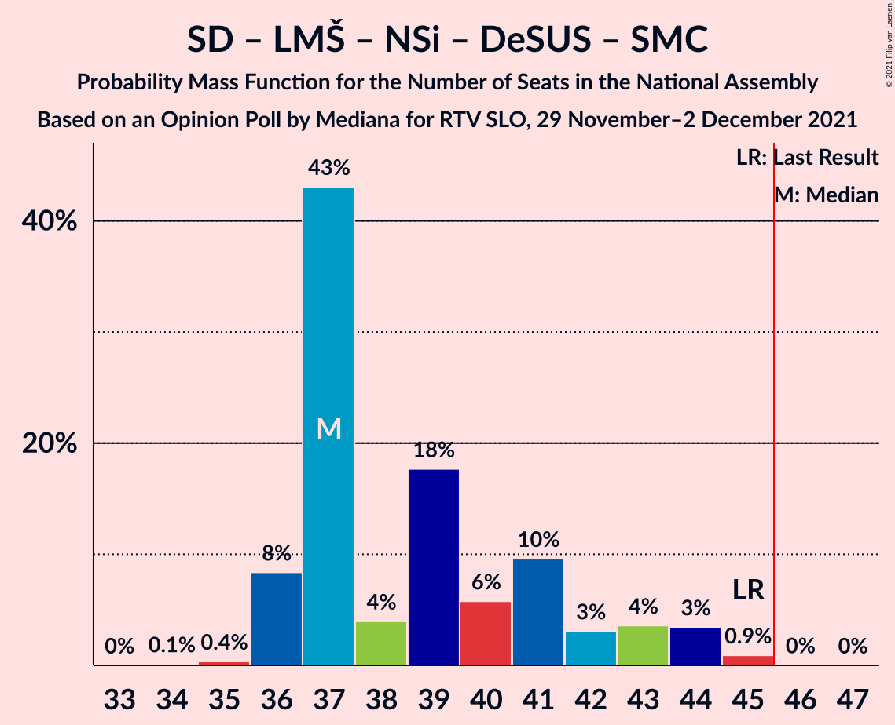
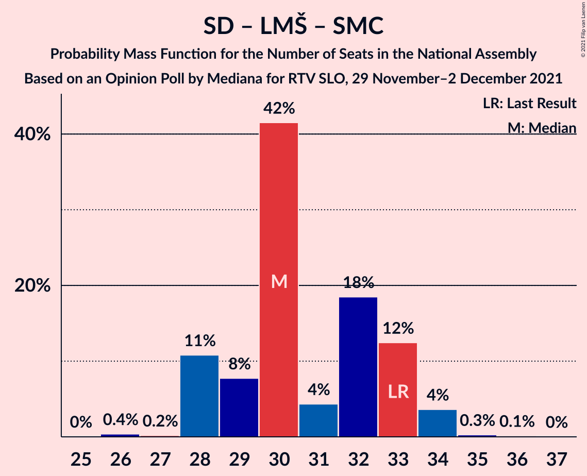

# Opinion Poll by Mediana for RTV SLO, 29 November–2 December 2021

<a href="#voting-intentions">Voting Intentions</a> | <a href="#seats">Seats</a> | <a href="#coalitions">Coalitions</a> | <a href="#technical-information">Technical Information</a>

## Voting Intentions

### Confidence Intervals

| Party | Last Result | Poll Result | 80% Confidence Interval | 90% Confidence Interval | 95% Confidence Interval | 99% Confidence Interval |
|:-----:|:-----------:|:-----------:|:-----------------------:|:-----------------------:|:-----------------------:|:-----------------------:|
| Slovenska demokratska stranka | 24.9% | 23.7% | 22.1–25.5% |21.6–26.0% |21.2–26.4% |20.4–27.3% |
| Socialni demokrati | 9.9% | 17.1% | 15.7–18.7% |15.3–19.2% |15.0–19.6% |14.3–20.4% |
| Levica | 9.3% | 12.1% | 10.9–13.5% |10.6–13.9% |10.3–14.3% |9.7–15.0% |
| Lista Marjana Šarca | 12.6% | 12.0% | 10.8–13.4% |10.5–13.8% |10.2–14.2% |9.6–14.9% |
| Nova Slovenija–Krščanski demokrati | 7.2% | 8.6% | 7.6–9.8% |7.3–10.2% |7.0–10.5% |6.6–11.1% |
| Stranka Alenke Bratušek | 5.1% | 6.3% | 5.4–7.4% |5.1–7.7% |4.9–7.9% |4.5–8.5% |
| Andrej Čuš in Zeleni Slovenije | 1.1% | 3.1% | 2.5–4.0% |2.4–4.2% |2.2–4.4% |2.0–4.8% |
| Piratska stranka Slovenije | 2.2% | 2.9% | 2.4–3.7% |2.2–4.0% |2.1–4.2% |1.8–4.6% |
| Slovenska ljudska stranka | 2.6% | 2.4% | 1.9–3.2% |1.8–3.4% |1.7–3.6% |1.4–4.0% |
| Slovenska nacionalna stranka | 4.2% | 2.3% | 1.8–3.0% |1.6–3.2% |1.5–3.4% |1.3–3.7% |
| Dobra država | 1.5% | 2.2% | 1.7–2.9% |1.5–3.1% |1.4–3.2% |1.2–3.6% |
| Demokratična stranka upokojencev Slovenije | 4.9% | 2.0% | 1.5–2.6% |1.4–2.8% |1.3–3.0% |1.1–3.4% |
| Stranka modernega centra | 9.7% | 1.2% | 0.8–1.7% |0.7–1.9% |0.7–2.0% |0.5–2.4% |

*Note:* The poll result column reflects the actual value used in the calculations. Published results may vary slightly, and in addition be rounded to fewer digits.

## Seats

### Confidence Intervals

| Party | Last Result | Median | 80% Confidence Interval | 90% Confidence Interval | 95% Confidence Interval | 99% Confidence Interval |
|:-----:|:-----------:|:------:|:-----------------------:|:-----------------------:|:-----------------------:|:-----------------------:|
| <a href="#slovenska-demokratska-stranka">Slovenska demokratska stranka</a> | 25 | 26 | 24–28 |23–28 |22–29 |22–30 |
| <a href="#socialni-demokrati">Socialni demokrati</a> | 10 | 18 | 16–20 |16–21 |16–21 |15–21 |
| <a href="#levica">Levica</a> | 9 | 14 | 12–15 |11–15 |11–15 |10–16 |
| <a href="#lista-marjana-šarca">Lista Marjana Šarca</a> | 13 | 12 | 12–14 |11–15 |11–15 |10–15 |
| <a href="#nova-slovenija–krščanski-demokrati">Nova Slovenija–Krščanski demokrati</a> | 7 | 7 | 7–10 |7–11 |7–11 |7–12 |
| <a href="#stranka-alenke-bratušek">Stranka Alenke Bratušek</a> | 5 | 7 | 6–7 |5–8 |5–9 |5–9 |
| <a href="#andrej-čuš-in-zeleni-slovenije">Andrej Čuš in Zeleni Slovenije</a> | 0 | 0 | 0 |0–4 |0–5 |0–5 |
| <a href="#piratska-stranka-slovenije">Piratska stranka Slovenije</a> | 0 | 0 | 0 |0 |0 |0–4 |
| <a href="#slovenska-ljudska-stranka">Slovenska ljudska stranka</a> | 0 | 0 | 0 |0 |0 |0–4 |
| <a href="#slovenska-nacionalna-stranka">Slovenska nacionalna stranka</a> | 4 | 0 | 0 |0 |0 |0 |
| <a href="#dobra-država">Dobra država</a> | 0 | 0 | 0 |0 |0 |0 |
| <a href="#demokratična-stranka-upokojencev-slovenije">Demokratična stranka upokojencev Slovenije</a> | 5 | 0 | 0 |0 |0 |0 |
| <a href="#stranka-modernega-centra">Stranka modernega centra</a> | 10 | 0 | 0 |0 |0 |0 |

### Slovenska demokratska stranka

*For a full overview of the results for this party, see the [Slovenska demokratska stranka](party-slovenskademokratskastranka.html) page.*

| Number of Seats | Probability | Accumulated | Special Marks |
|:---------------:|:-----------:|:-----------:|:-------------:|
| 21 | 0.3% | 100% |  |
| 22 | 2% | 99.7% |  |
| 23 | 5% | 97% |  |
| 24 | 3% | 92% |  |
| 25 | 13% | 89% | Last Result |
| 26 | 58% | 77% | Median |
| 27 | 4% | 19% |  |
| 28 | 12% | 15% |  |
| 29 | 2% | 3% |  |
| 30 | 1.1% | 1.2% |  |
| 31 | 0.1% | 0.1% |  |
| 32 | 0% | 0% |  |

### Socialni demokrati

*For a full overview of the results for this party, see the [Socialni demokrati](party-socialnidemokrati.html) page.*

| Number of Seats | Probability | Accumulated | Special Marks |
|:---------------:|:-----------:|:-----------:|:-------------:|
| 10 | 0% | 100% | Last Result |
| 11 | 0% | 100% |  |
| 12 | 0% | 100% |  |
| 13 | 0% | 100% |  |
| 14 | 0.1% | 100% |  |
| 15 | 0.6% | 99.9% |  |
| 16 | 12% | 99.3% |  |
| 17 | 7% | 87% |  |
| 18 | 63% | 80% | Median |
| 19 | 5% | 17% |  |
| 20 | 2% | 12% |  |
| 21 | 10% | 10% |  |
| 22 | 0.2% | 0.3% |  |
| 23 | 0% | 0% |  |

### Levica

*For a full overview of the results for this party, see the [Levica](party-levica.html) page.*

| Number of Seats | Probability | Accumulated | Special Marks |
|:---------------:|:-----------:|:-----------:|:-------------:|
| 9 | 0.1% | 100% | Last Result |
| 10 | 2% | 99.9% |  |
| 11 | 7% | 98% |  |
| 12 | 15% | 91% |  |
| 13 | 24% | 77% |  |
| 14 | 41% | 53% | Median |
| 15 | 11% | 12% |  |
| 16 | 0.4% | 0.6% |  |
| 17 | 0.1% | 0.2% |  |
| 18 | 0% | 0% |  |

### Lista Marjana Šarca

*For a full overview of the results for this party, see the [Lista Marjana Šarca](party-listamarjanašarca.html) page.*

| Number of Seats | Probability | Accumulated | Special Marks |
|:---------------:|:-----------:|:-----------:|:-------------:|
| 9 | 0.2% | 100% |  |
| 10 | 0.8% | 99.8% |  |
| 11 | 7% | 99.0% |  |
| 12 | 60% | 92% | Median |
| 13 | 6% | 32% | Last Result |
| 14 | 19% | 26% |  |
| 15 | 7% | 7% |  |
| 16 | 0.2% | 0.2% |  |
| 17 | 0% | 0% |  |

### Nova Slovenija–Krščanski demokrati

*For a full overview of the results for this party, see the [Nova Slovenija–Krščanski demokrati](party-novaslovenija–krščanskidemokrati.html) page.*

| Number of Seats | Probability | Accumulated | Special Marks |
|:---------------:|:-----------:|:-----------:|:-------------:|
| 6 | 0.1% | 100% |  |
| 7 | 52% | 99.9% | Last Result, Median |
| 8 | 24% | 48% |  |
| 9 | 12% | 24% |  |
| 10 | 6% | 12% |  |
| 11 | 6% | 6% |  |
| 12 | 0.5% | 0.5% |  |
| 13 | 0% | 0% |  |

### Stranka Alenke Bratušek

*For a full overview of the results for this party, see the [Stranka Alenke Bratušek](party-strankaalenkebratušek.html) page.*

| Number of Seats | Probability | Accumulated | Special Marks |
|:---------------:|:-----------:|:-----------:|:-------------:|
| 4 | 0.3% | 100% |  |
| 5 | 9% | 99.7% | Last Result |
| 6 | 27% | 91% |  |
| 7 | 57% | 64% | Median |
| 8 | 2% | 7% |  |
| 9 | 4% | 4% |  |
| 10 | 0% | 0% |  |

### Andrej Čuš in Zeleni Slovenije

*For a full overview of the results for this party, see the [Andrej Čuš in Zeleni Slovenije](party-andrejčušinzelenislovenije.html) page.*

| Number of Seats | Probability | Accumulated | Special Marks |
|:---------------:|:-----------:|:-----------:|:-------------:|
| 0 | 92% | 100% | Last Result, Median |
| 1 | 0% | 8% |  |
| 2 | 0% | 8% |  |
| 3 | 0% | 8% |  |
| 4 | 4% | 8% |  |
| 5 | 4% | 4% |  |
| 6 | 0% | 0% |  |

### Piratska stranka Slovenije

*For a full overview of the results for this party, see the [Piratska stranka Slovenije](party-piratskastrankaslovenije.html) page.*

| Number of Seats | Probability | Accumulated | Special Marks |
|:---------------:|:-----------:|:-----------:|:-------------:|
| 0 | 99.3% | 100% | Last Result, Median |
| 1 | 0% | 0.7% |  |
| 2 | 0% | 0.7% |  |
| 3 | 0% | 0.7% |  |
| 4 | 0.5% | 0.7% |  |
| 5 | 0.2% | 0.2% |  |
| 6 | 0% | 0% |  |

### Slovenska ljudska stranka

*For a full overview of the results for this party, see the [Slovenska ljudska stranka](party-slovenskaljudskastranka.html) page.*

| Number of Seats | Probability | Accumulated | Special Marks |
|:---------------:|:-----------:|:-----------:|:-------------:|
| 0 | 99.5% | 100% | Last Result, Median |
| 1 | 0% | 0.5% |  |
| 2 | 0% | 0.5% |  |
| 3 | 0% | 0.5% |  |
| 4 | 0.5% | 0.5% |  |
| 5 | 0% | 0% |  |

### Slovenska nacionalna stranka

*For a full overview of the results for this party, see the [Slovenska nacionalna stranka](party-slovenskanacionalnastranka.html) page.*

| Number of Seats | Probability | Accumulated | Special Marks |
|:---------------:|:-----------:|:-----------:|:-------------:|
| 0 | 99.9% | 100% | Median |
| 1 | 0% | 0.1% |  |
| 2 | 0% | 0.1% |  |
| 3 | 0% | 0.1% |  |
| 4 | 0.1% | 0.1% | Last Result |
| 5 | 0% | 0% |  |

### Dobra država

*For a full overview of the results for this party, see the [Dobra država](party-dobradržava.html) page.*

| Number of Seats | Probability | Accumulated | Special Marks |
|:---------------:|:-----------:|:-----------:|:-------------:|
| 0 | 99.9% | 100% | Last Result, Median |
| 1 | 0% | 0.1% |  |
| 2 | 0% | 0.1% |  |
| 3 | 0% | 0.1% |  |
| 4 | 0.1% | 0.1% |  |
| 5 | 0% | 0% |  |

### Demokratična stranka upokojencev Slovenije

*For a full overview of the results for this party, see the [Demokratična stranka upokojencev Slovenije](party-demokratičnastrankaupokojencevslovenije.html) page.*

| Number of Seats | Probability | Accumulated | Special Marks |
|:---------------:|:-----------:|:-----------:|:-------------:|
| 0 | 100% | 100% | Median |
| 1 | 0% | 0% |  |
| 2 | 0% | 0% |  |
| 3 | 0% | 0% |  |
| 4 | 0% | 0% |  |
| 5 | 0% | 0% | Last Result |

### Stranka modernega centra

*For a full overview of the results for this party, see the [Stranka modernega centra](party-strankamodernegacentra.html) page.*

| Number of Seats | Probability | Accumulated | Special Marks |
|:---------------:|:-----------:|:-----------:|:-------------:|
| 0 | 100% | 100% | Median |
| 1 | 0% | 0% |  |
| 2 | 0% | 0% |  |
| 3 | 0% | 0% |  |
| 4 | 0% | 0% |  |
| 5 | 0% | 0% |  |
| 6 | 0% | 0% |  |
| 7 | 0% | 0% |  |
| 8 | 0% | 0% |  |
| 9 | 0% | 0% |  |
| 10 | 0% | 0% | Last Result |

## Coalitions

### Confidence Intervals

| Coalition | Last Result | Median | Majority? | 80% Confidence Interval | 90% Confidence Interval | 95% Confidence Interval | 99% Confidence Interval |
|:---------:|:-----------:|:------:|:---------:|:-----------------------:|:-----------------------:|:-----------------------:|:-----------------------:|
| Socialni demokrati – Lista Marjana Šarca – Nova Slovenija–Krščanski demokrati – Stranka Alenke Bratušek – Demokratična stranka upokojencev Slovenije – Stranka modernega centra | 50 | 44 | 29% | 43–48 | 43–50 | 42–51 | 41–52 |
| Socialni demokrati – Lista Marjana Šarca – Nova Slovenija–Krščanski demokrati – Demokratična stranka upokojencev Slovenije | 35 | 37 | 0.1% | 37–42 | 36–43 | 36–44 | 36–45 |
| Socialni demokrati – Lista Marjana Šarca – Nova Slovenija–Krščanski demokrati – Demokratična stranka upokojencev Slovenije – Stranka modernega centra | 45 | 37 | 0.1% | 37–42 | 36–43 | 36–44 | 36–45 |
| Socialni demokrati – Lista Marjana Šarca – Nova Slovenija–Krščanski demokrati | 30 | 37 | 0.1% | 37–42 | 36–43 | 36–44 | 36–45 |
| Socialni demokrati – Lista Marjana Šarca – Nova Slovenija–Krščanski demokrati – Stranka modernega centra | 40 | 37 | 0.1% | 37–42 | 36–43 | 36–44 | 36–45 |
| Slovenska demokratska stranka – Lista Marjana Šarca – Demokratična stranka upokojencev Slovenije | 43 | 38 | 0% | 37–40 | 35–41 | 34–41 | 34–43 |
| Socialni demokrati – Lista Marjana Šarca – Stranka Alenke Bratušek – Demokratična stranka upokojencev Slovenije – Stranka modernega centra | 43 | 37 | 0% | 35–40 | 34–40 | 34–41 | 33–43 |
| Slovenska demokratska stranka – Lista Marjana Šarca | 38 | 38 | 0% | 37–40 | 35–41 | 34–41 | 34–43 |
| Socialni demokrati – Lista Marjana Šarca – Demokratična stranka upokojencev Slovenije | 28 | 30 | 0% | 28–33 | 28–33 | 28–34 | 27–34 |
| Socialni demokrati – Lista Marjana Šarca – Demokratična stranka upokojencev Slovenije – Stranka modernega centra | 38 | 30 | 0% | 28–33 | 28–33 | 28–34 | 27–34 |
| Socialni demokrati – Lista Marjana Šarca | 23 | 30 | 0% | 28–33 | 28–33 | 28–34 | 27–34 |
| Socialni demokrati – Lista Marjana Šarca – Stranka modernega centra | 33 | 30 | 0% | 28–33 | 28–33 | 28–34 | 27–34 |
| Socialni demokrati – Demokratična stranka upokojencev Slovenije – Stranka modernega centra | 25 | 18 | 0% | 16–20 | 16–21 | 16–21 | 15–21 |

### Socialni demokrati – Lista Marjana Šarca – Nova Slovenija–Krščanski demokrati – Stranka Alenke Bratušek – Demokratična stranka upokojencev Slovenije – Stranka modernega centra

| Number of Seats | Probability | Accumulated | Special Marks |
|:---------------:|:-----------:|:-----------:|:-------------:|
| 40 | 0.1% | 100% |  |
| 41 | 0.4% | 99.9% |  |
| 42 | 4% | 99.5% |  |
| 43 | 12% | 95% |  |
| 44 | 36% | 84% | Median |
| 45 | 19% | 48% |  |
| 46 | 5% | 29% | Majority |
| 47 | 3% | 24% |  |
| 48 | 11% | 20% |  |
| 49 | 3% | 9% |  |
| 50 | 2% | 5% | Last Result |
| 51 | 1.2% | 3% |  |
| 52 | 2% | 2% |  |
| 53 | 0% | 0% |  |

### Socialni demokrati – Lista Marjana Šarca – Nova Slovenija–Krščanski demokrati – Demokratična stranka upokojencev Slovenije

| Number of Seats | Probability | Accumulated | Special Marks |
|:---------------:|:-----------:|:-----------:|:-------------:|
| 34 | 0.1% | 100% |  |
| 35 | 0.4% | 99.9% | Last Result |
| 36 | 8% | 99.5% |  |
| 37 | 43% | 91% | Median |
| 38 | 4% | 48% |  |
| 39 | 18% | 44% |  |
| 40 | 6% | 26% |  |
| 41 | 10% | 21% |  |
| 42 | 3% | 11% |  |
| 43 | 4% | 8% |  |
| 44 | 3% | 4% |  |
| 45 | 0.9% | 1.0% |  |
| 46 | 0% | 0.1% | Majority |
| 47 | 0% | 0% |  |

### Socialni demokrati – Lista Marjana Šarca – Nova Slovenija–Krščanski demokrati – Demokratična stranka upokojencev Slovenije – Stranka modernega centra

| Number of Seats | Probability | Accumulated | Special Marks |
|:---------------:|:-----------:|:-----------:|:-------------:|
| 34 | 0.1% | 100% |  |
| 35 | 0.4% | 99.9% |  |
| 36 | 8% | 99.5% |  |
| 37 | 43% | 91% | Median |
| 38 | 4% | 48% |  |
| 39 | 18% | 44% |  |
| 40 | 6% | 26% |  |
| 41 | 10% | 21% |  |
| 42 | 3% | 11% |  |
| 43 | 4% | 8% |  |
| 44 | 3% | 4% |  |
| 45 | 0.9% | 1.0% | Last Result |
| 46 | 0% | 0.1% | Majority |
| 47 | 0% | 0% |  |

### Socialni demokrati – Lista Marjana Šarca – Nova Slovenija–Krščanski demokrati

| Number of Seats | Probability | Accumulated | Special Marks |
|:---------------:|:-----------:|:-----------:|:-------------:|
| 30 | 0% | 100% | Last Result |
| 31 | 0% | 100% |  |
| 32 | 0% | 100% |  |
| 33 | 0% | 100% |  |
| 34 | 0.1% | 100% |  |
| 35 | 0.4% | 99.9% |  |
| 36 | 8% | 99.5% |  |
| 37 | 43% | 91% | Median |
| 38 | 4% | 48% |  |
| 39 | 18% | 44% |  |
| 40 | 6% | 26% |  |
| 41 | 10% | 21% |  |
| 42 | 3% | 11% |  |
| 43 | 4% | 8% |  |
| 44 | 3% | 4% |  |
| 45 | 0.9% | 1.0% |  |
| 46 | 0% | 0.1% | Majority |
| 47 | 0% | 0% |  |

### Socialni demokrati – Lista Marjana Šarca – Nova Slovenija–Krščanski demokrati – Stranka modernega centra

| Number of Seats | Probability | Accumulated | Special Marks |
|:---------------:|:-----------:|:-----------:|:-------------:|
| 34 | 0.1% | 100% |  |
| 35 | 0.4% | 99.9% |  |
| 36 | 8% | 99.5% |  |
| 37 | 43% | 91% | Median |
| 38 | 4% | 48% |  |
| 39 | 18% | 44% |  |
| 40 | 6% | 26% | Last Result |
| 41 | 10% | 21% |  |
| 42 | 3% | 11% |  |
| 43 | 4% | 8% |  |
| 44 | 3% | 4% |  |
| 45 | 0.9% | 1.0% |  |
| 46 | 0% | 0.1% | Majority |
| 47 | 0% | 0% |  |

### Slovenska demokratska stranka – Lista Marjana Šarca – Demokratična stranka upokojencev Slovenije

| Number of Seats | Probability | Accumulated | Special Marks |
|:---------------:|:-----------:|:-----------:|:-------------:|
| 32 | 0.1% | 100% |  |
| 33 | 0.2% | 99.9% |  |
| 34 | 3% | 99.7% |  |
| 35 | 3% | 97% |  |
| 36 | 4% | 94% |  |
| 37 | 10% | 91% |  |
| 38 | 41% | 81% | Median |
| 39 | 6% | 40% |  |
| 40 | 26% | 35% |  |
| 41 | 7% | 9% |  |
| 42 | 1.0% | 2% |  |
| 43 | 1.0% | 1.2% | Last Result |
| 44 | 0.1% | 0.2% |  |
| 45 | 0% | 0% |  |

### Socialni demokrati – Lista Marjana Šarca – Stranka Alenke Bratušek – Demokratična stranka upokojencev Slovenije – Stranka modernega centra

| Number of Seats | Probability | Accumulated | Special Marks |
|:---------------:|:-----------:|:-----------:|:-------------:|
| 31 | 0.1% | 100% |  |
| 32 | 0.3% | 99.9% |  |
| 33 | 0.4% | 99.7% |  |
| 34 | 5% | 99.3% |  |
| 35 | 10% | 94% |  |
| 36 | 8% | 84% |  |
| 37 | 40% | 76% | Median |
| 38 | 19% | 37% |  |
| 39 | 4% | 18% |  |
| 40 | 11% | 14% |  |
| 41 | 0.6% | 3% |  |
| 42 | 0.4% | 2% |  |
| 43 | 2% | 2% | Last Result |
| 44 | 0% | 0% |  |

### Slovenska demokratska stranka – Lista Marjana Šarca

| Number of Seats | Probability | Accumulated | Special Marks |
|:---------------:|:-----------:|:-----------:|:-------------:|
| 32 | 0.1% | 100% |  |
| 33 | 0.2% | 99.9% |  |
| 34 | 3% | 99.7% |  |
| 35 | 3% | 97% |  |
| 36 | 4% | 94% |  |
| 37 | 10% | 91% |  |
| 38 | 41% | 81% | Last Result, Median |
| 39 | 6% | 40% |  |
| 40 | 26% | 35% |  |
| 41 | 7% | 9% |  |
| 42 | 1.0% | 2% |  |
| 43 | 1.0% | 1.2% |  |
| 44 | 0.1% | 0.2% |  |
| 45 | 0% | 0% |  |

### Socialni demokrati – Lista Marjana Šarca – Demokratična stranka upokojencev Slovenije

| Number of Seats | Probability | Accumulated | Special Marks |
|:---------------:|:-----------:|:-----------:|:-------------:|
| 25 | 0% | 100% |  |
| 26 | 0.4% | 99.9% |  |
| 27 | 0.2% | 99.6% |  |
| 28 | 11% | 99.4% | Last Result |
| 29 | 8% | 89% |  |
| 30 | 42% | 81% | Median |
| 31 | 4% | 39% |  |
| 32 | 18% | 35% |  |
| 33 | 12% | 17% |  |
| 34 | 4% | 4% |  |
| 35 | 0.3% | 0.4% |  |
| 36 | 0.1% | 0.2% |  |
| 37 | 0% | 0% |  |

### Socialni demokrati – Lista Marjana Šarca – Demokratična stranka upokojencev Slovenije – Stranka modernega centra

| Number of Seats | Probability | Accumulated | Special Marks |
|:---------------:|:-----------:|:-----------:|:-------------:|
| 25 | 0% | 100% |  |
| 26 | 0.4% | 99.9% |  |
| 27 | 0.2% | 99.6% |  |
| 28 | 11% | 99.4% |  |
| 29 | 8% | 89% |  |
| 30 | 42% | 81% | Median |
| 31 | 4% | 39% |  |
| 32 | 18% | 35% |  |
| 33 | 12% | 17% |  |
| 34 | 4% | 4% |  |
| 35 | 0.3% | 0.4% |  |
| 36 | 0.1% | 0.2% |  |
| 37 | 0% | 0% |  |
| 38 | 0% | 0% | Last Result |

### Socialni demokrati – Lista Marjana Šarca

| Number of Seats | Probability | Accumulated | Special Marks |
|:---------------:|:-----------:|:-----------:|:-------------:|
| 23 | 0% | 100% | Last Result |
| 24 | 0% | 100% |  |
| 25 | 0% | 100% |  |
| 26 | 0.4% | 99.9% |  |
| 27 | 0.2% | 99.6% |  |
| 28 | 11% | 99.4% |  |
| 29 | 8% | 89% |  |
| 30 | 42% | 81% | Median |
| 31 | 4% | 39% |  |
| 32 | 18% | 35% |  |
| 33 | 12% | 17% |  |
| 34 | 4% | 4% |  |
| 35 | 0.3% | 0.4% |  |
| 36 | 0.1% | 0.2% |  |
| 37 | 0% | 0% |  |

### Socialni demokrati – Lista Marjana Šarca – Stranka modernega centra

| Number of Seats | Probability | Accumulated | Special Marks |
|:---------------:|:-----------:|:-----------:|:-------------:|
| 25 | 0% | 100% |  |
| 26 | 0.4% | 99.9% |  |
| 27 | 0.2% | 99.6% |  |
| 28 | 11% | 99.4% |  |
| 29 | 8% | 89% |  |
| 30 | 42% | 81% | Median |
| 31 | 4% | 39% |  |
| 32 | 18% | 35% |  |
| 33 | 12% | 17% | Last Result |
| 34 | 4% | 4% |  |
| 35 | 0.3% | 0.4% |  |
| 36 | 0.1% | 0.2% |  |
| 37 | 0% | 0% |  |

### Socialni demokrati – Demokratična stranka upokojencev Slovenije – Stranka modernega centra

| Number of Seats | Probability | Accumulated | Special Marks |
|:---------------:|:-----------:|:-----------:|:-------------:|
| 14 | 0.1% | 100% |  |
| 15 | 0.6% | 99.9% |  |
| 16 | 12% | 99.3% |  |
| 17 | 7% | 87% |  |
| 18 | 63% | 80% | Median |
| 19 | 5% | 17% |  |
| 20 | 2% | 12% |  |
| 21 | 10% | 10% |  |
| 22 | 0.2% | 0.3% |  |
| 23 | 0% | 0% |  |
| 24 | 0% | 0% |  |
| 25 | 0% | 0% | Last Result |

## Technical Information

### Opinion Poll

+ **Polling firm:** Mediana
+ **Commissioner(s):** RTV SLO
+ **Fieldwork period:** 29 November–2 December 2021

### Calculations

+ **Sample size:** 1021
+ **Simulations done:** 1,048,576
+ **Error estimate:** 2.26%

