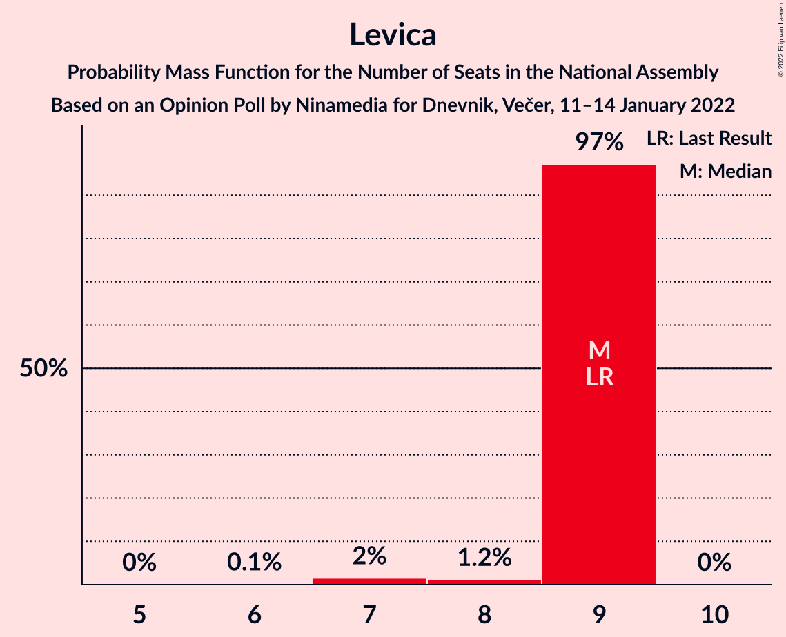
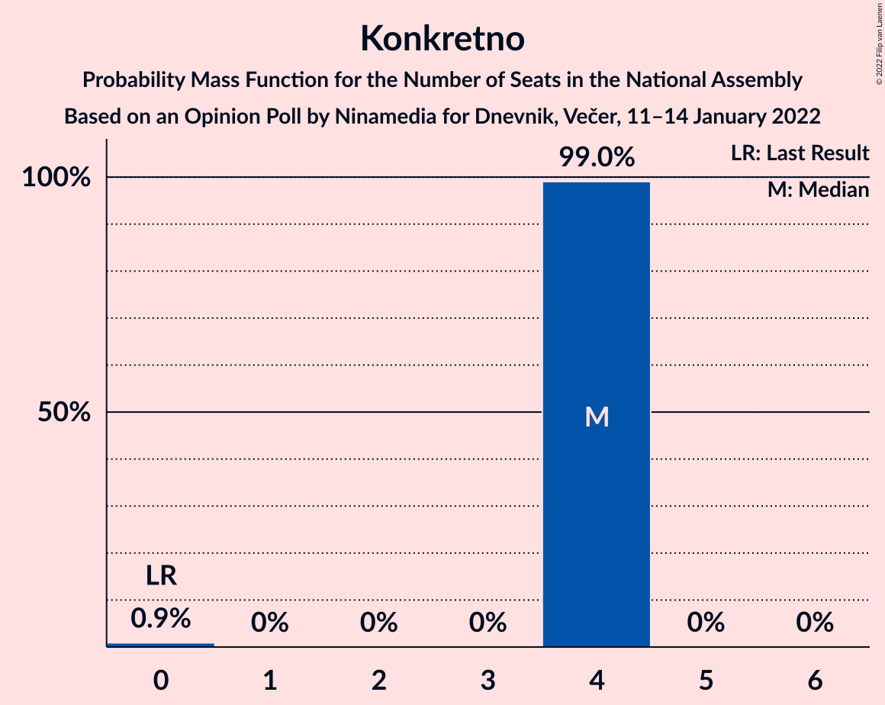

# Opinion Poll by Ninamedia for Dnevnik, Večer, 11–14 January 2022

<a href="#voting-intentions">Voting Intentions</a> | <a href="#seats">Seats</a> | <a href="#coalitions">Coalitions</a> | <a href="#technical-information">Technical Information</a>

## Voting Intentions

### Confidence Intervals

| Party | Last Result | Poll Result | 80% Confidence Interval | 90% Confidence Interval | 95% Confidence Interval | 99% Confidence Interval |
|:-----:|:-----------:|:-----------:|:-----------------------:|:-----------------------:|:-----------------------:|:-----------------------:|
| Slovenska demokratska stranka | 24.9% | 20.6% | 19.0–22.2% |18.6–22.7% |18.2–23.1% |17.5–23.9% |
| Lista Roberta Goloba | 0.0% | 20.3% | 18.8–21.9% |18.3–22.4% |18.0–22.8% |17.3–23.6% |
| Socialni demokrati | 9.9% | 13.7% | 12.4–15.2% |12.1–15.6% |11.8–15.9% |11.2–16.7% |
| Levica | 9.3% | 7.8% | 6.8–9.0% |6.6–9.3% |6.3–9.6% |5.9–10.2% |
| Nova Slovenija–Krščanski demokrati | 7.2% | 6.0% | 5.2–7.1% |4.9–7.3% |4.7–7.6% |4.3–8.1% |
| Lista Marjana Šarca | 12.6% | 5.7% | 4.9–6.8% |4.7–7.0% |4.5–7.3% |4.1–7.8% |
| Stranka Alenke Bratušek | 5.1% | 4.1% | 3.4–5.0% |3.2–5.3% |3.0–5.5% |2.8–5.9% |
| Naša dežela | 0.0% | 3.8% | 3.1–4.7% |3.0–4.9% |2.8–5.2% |2.5–5.6% |
| Konkretno | 0.0% | 3.7% | 3.1–4.6% |2.9–4.8% |2.7–5.0% |2.4–5.5% |
| Andrej Čuš in Zeleni Slovenije | 1.1% | 2.1% | 1.6–2.8% |1.5–3.0% |1.4–3.2% |1.2–3.5% |
| Dobra država | 1.5% | 1.5% | 1.1–2.1% |1.0–2.3% |0.9–2.5% |0.8–2.8% |
| Slovenska ljudska stranka | 2.6% | 1.3% | 1.0–1.9% |0.9–2.1% |0.8–2.2% |0.7–2.5% |
| Demokratična stranka upokojencev Slovenije | 4.9% | 1.2% | 0.9–1.8% |0.8–2.0% |0.7–2.1% |0.6–2.4% |
| Slovenska nacionalna stranka | 4.2% | 0.9% | 0.6–1.4% |0.5–1.5% |0.5–1.6% |0.4–1.9% |
| Piratska stranka Slovenije | 2.2% | 0.9% | 0.6–1.4% |0.5–1.5% |0.5–1.6% |0.4–1.9% |

*Note:* The poll result column reflects the actual value used in the calculations. Published results may vary slightly, and in addition be rounded to fewer digits.

## Seats

### Confidence Intervals

| Party | Last Result | Median | 80% Confidence Interval | 90% Confidence Interval | 95% Confidence Interval | 99% Confidence Interval |
|:-----:|:-----------:|:------:|:-----------------------:|:-----------------------:|:-----------------------:|:-----------------------:|
| <a href="#slovenska-demokratska-stranka">Slovenska demokratska stranka</a> | 25 | 23 | 23 |23 |21–23 |18–23 |
| <a href="#lista-roberta-goloba">Lista Roberta Goloba</a> | 0 | 23 | 23 |23 |21–23 |19–23 |
| <a href="#socialni-demokrati">Socialni demokrati</a> | 10 | 13 | 13 |13 |13 |12–14 |
| <a href="#levica">Levica</a> | 9 | 9 | 9 |9 |8–9 |7–9 |
| <a href="#nova-slovenija–krščanski-demokrati">Nova Slovenija–Krščanski demokrati</a> | 7 | 5 | 5 |5 |5–6 |5–7 |
| <a href="#lista-marjana-šarca">Lista Marjana Šarca</a> | 13 | 5 | 5 |5 |5 |5–6 |
| <a href="#stranka-alenke-bratušek">Stranka Alenke Bratušek</a> | 5 | 0 | 0 |0 |0–4 |0–5 |
| <a href="#naša-dežela">Naša dežela</a> | 0 | 0 | 0 |0 |0–4 |0–4 |
| <a href="#konkretno">Konkretno</a> | 0 | 4 | 4 |4 |4 |0–4 |
| <a href="#andrej-čuš-in-zeleni-slovenije">Andrej Čuš in Zeleni Slovenije</a> | 0 | 0 | 0 |0 |0 |0 |
| <a href="#dobra-država">Dobra država</a> | 0 | 0 | 0 |0 |0 |0 |
| <a href="#slovenska-ljudska-stranka">Slovenska ljudska stranka</a> | 0 | 0 | 0 |0 |0 |0 |
| <a href="#demokratična-stranka-upokojencev-slovenije">Demokratična stranka upokojencev Slovenije</a> | 5 | 0 | 0 |0 |0 |0 |
| <a href="#slovenska-nacionalna-stranka">Slovenska nacionalna stranka</a> | 4 | 0 | 0 |0 |0 |0 |
| <a href="#piratska-stranka-slovenije">Piratska stranka Slovenije</a> | 0 | 0 | 0 |0 |0 |0 |

### Slovenska demokratska stranka

*For a full overview of the results for this party, see the [Slovenska demokratska stranka](party-slovenskademokratskastranka.html) page.*

| Number of Seats | Probability | Accumulated | Special Marks |
|:---------------:|:-----------:|:-----------:|:-------------:|
| 17 | 0.5% | 100% |  |
| 18 | 0.2% | 99.5% |  |
| 19 | 1.4% | 99.3% |  |
| 20 | 0.4% | 98% |  |
| 21 | 0.2% | 98% |  |
| 22 | 0.1% | 97% |  |
| 23 | 97% | 97% | Median |
| 24 | 0% | 0.2% |  |
| 25 | 0.1% | 0.1% | Last Result |
| 26 | 0% | 0% |  |

### Lista Roberta Goloba

*For a full overview of the results for this party, see the [Lista Roberta Goloba](party-listarobertagoloba.html) page.*

| Number of Seats | Probability | Accumulated | Special Marks |
|:---------------:|:-----------:|:-----------:|:-------------:|
| 0 | 0% | 100% | Last Result |
| 1 | 0% | 100% |  |
| 2 | 0% | 100% |  |
| 3 | 0% | 100% |  |
| 4 | 0% | 100% |  |
| 5 | 0% | 100% |  |
| 6 | 0% | 100% |  |
| 7 | 0% | 100% |  |
| 8 | 0% | 100% |  |
| 9 | 0% | 100% |  |
| 10 | 0% | 100% |  |
| 11 | 0% | 100% |  |
| 12 | 0% | 100% |  |
| 13 | 0% | 100% |  |
| 14 | 0% | 100% |  |
| 15 | 0% | 100% |  |
| 16 | 0% | 100% |  |
| 17 | 0% | 100% |  |
| 18 | 0% | 100% |  |
| 19 | 2% | 99.9% |  |
| 20 | 0.6% | 98% |  |
| 21 | 0.3% | 98% |  |
| 22 | 0% | 97% |  |
| 23 | 97% | 97% | Median |
| 24 | 0% | 0% |  |

### Socialni demokrati

*For a full overview of the results for this party, see the [Socialni demokrati](party-socialnidemokrati.html) page.*

| Number of Seats | Probability | Accumulated | Special Marks |
|:---------------:|:-----------:|:-----------:|:-------------:|
| 10 | 0% | 100% | Last Result |
| 11 | 0% | 100% |  |
| 12 | 2% | 100% |  |
| 13 | 97% | 98% | Median |
| 14 | 0.6% | 0.9% |  |
| 15 | 0.1% | 0.3% |  |
| 16 | 0.2% | 0.2% |  |
| 17 | 0% | 0% |  |

### Levica

*For a full overview of the results for this party, see the [Levica](party-levica.html) page.*

| Number of Seats | Probability | Accumulated | Special Marks |
|:---------------:|:-----------:|:-----------:|:-------------:|
| 6 | 0.1% | 100% |  |
| 7 | 2% | 99.9% |  |
| 8 | 1.2% | 98% |  |
| 9 | 97% | 97% | Last Result, Median |
| 10 | 0% | 0% |  |

### Nova Slovenija–Krščanski demokrati

*For a full overview of the results for this party, see the [Nova Slovenija–Krščanski demokrati](party-novaslovenija–krščanskidemokrati.html) page.*

| Number of Seats | Probability | Accumulated | Special Marks |
|:---------------:|:-----------:|:-----------:|:-------------:|
| 4 | 0.2% | 100% |  |
| 5 | 97% | 99.8% | Median |
| 6 | 0.8% | 3% |  |
| 7 | 2% | 2% | Last Result |
| 8 | 0% | 0% |  |

### Lista Marjana Šarca

*For a full overview of the results for this party, see the [Lista Marjana Šarca](party-listamarjanašarca.html) page.*

| Number of Seats | Probability | Accumulated | Special Marks |
|:---------------:|:-----------:|:-----------:|:-------------:|
| 4 | 0.2% | 100% |  |
| 5 | 98% | 99.8% | Median |
| 6 | 2% | 2% |  |
| 7 | 0% | 0% |  |
| 8 | 0% | 0% |  |
| 9 | 0% | 0% |  |
| 10 | 0% | 0% |  |
| 11 | 0% | 0% |  |
| 12 | 0% | 0% |  |
| 13 | 0% | 0% | Last Result |

### Stranka Alenke Bratušek

*For a full overview of the results for this party, see the [Stranka Alenke Bratušek](party-strankaalenkebratušek.html) page.*

| Number of Seats | Probability | Accumulated | Special Marks |
|:---------------:|:-----------:|:-----------:|:-------------:|
| 0 | 97% | 100% | Median |
| 1 | 0% | 3% |  |
| 2 | 0% | 3% |  |
| 3 | 0% | 3% |  |
| 4 | 1.2% | 3% |  |
| 5 | 1.4% | 1.4% | Last Result |
| 6 | 0% | 0% |  |

### Naša dežela

*For a full overview of the results for this party, see the [Naša dežela](party-našadežela.html) page.*

| Number of Seats | Probability | Accumulated | Special Marks |
|:---------------:|:-----------:|:-----------:|:-------------:|
| 0 | 97% | 100% | Last Result, Median |
| 1 | 0% | 3% |  |
| 2 | 0% | 3% |  |
| 3 | 0% | 3% |  |
| 4 | 2% | 3% |  |
| 5 | 0.4% | 0.4% |  |
| 6 | 0% | 0% |  |

### Konkretno

*For a full overview of the results for this party, see the [Konkretno](party-konkretno.html) page.*

| Number of Seats | Probability | Accumulated | Special Marks |
|:---------------:|:-----------:|:-----------:|:-------------:|
| 0 | 0.9% | 100% | Last Result |
| 1 | 0% | 99.1% |  |
| 2 | 0% | 99.1% |  |
| 3 | 0% | 99.1% |  |
| 4 | 99.0% | 99.1% | Median |
| 5 | 0% | 0.1% |  |
| 6 | 0% | 0% |  |

### Andrej Čuš in Zeleni Slovenije

*For a full overview of the results for this party, see the [Andrej Čuš in Zeleni Slovenije](party-andrejčušinzelenislovenije.html) page.*

| Number of Seats | Probability | Accumulated | Special Marks |
|:---------------:|:-----------:|:-----------:|:-------------:|
| 0 | 100% | 100% | Last Result, Median |

### Dobra država

*For a full overview of the results for this party, see the [Dobra država](party-dobradržava.html) page.*

| Number of Seats | Probability | Accumulated | Special Marks |
|:---------------:|:-----------:|:-----------:|:-------------:|
| 0 | 100% | 100% | Last Result, Median |

### Slovenska ljudska stranka

*For a full overview of the results for this party, see the [Slovenska ljudska stranka](party-slovenskaljudskastranka.html) page.*

| Number of Seats | Probability | Accumulated | Special Marks |
|:---------------:|:-----------:|:-----------:|:-------------:|
| 0 | 100% | 100% | Last Result, Median |

### Demokratična stranka upokojencev Slovenije

*For a full overview of the results for this party, see the [Demokratična stranka upokojencev Slovenije](party-demokratičnastrankaupokojencevslovenije.html) page.*

| Number of Seats | Probability | Accumulated | Special Marks |
|:---------------:|:-----------:|:-----------:|:-------------:|
| 0 | 100% | 100% | Median |
| 1 | 0% | 0% |  |
| 2 | 0% | 0% |  |
| 3 | 0% | 0% |  |
| 4 | 0% | 0% |  |
| 5 | 0% | 0% | Last Result |

### Slovenska nacionalna stranka

*For a full overview of the results for this party, see the [Slovenska nacionalna stranka](party-slovenskanacionalnastranka.html) page.*

| Number of Seats | Probability | Accumulated | Special Marks |
|:---------------:|:-----------:|:-----------:|:-------------:|
| 0 | 100% | 100% | Median |
| 1 | 0% | 0% |  |
| 2 | 0% | 0% |  |
| 3 | 0% | 0% |  |
| 4 | 0% | 0% | Last Result |

### Piratska stranka Slovenije

*For a full overview of the results for this party, see the [Piratska stranka Slovenije](party-piratskastrankaslovenije.html) page.*

| Number of Seats | Probability | Accumulated | Special Marks |
|:---------------:|:-----------:|:-----------:|:-------------:|
| 0 | 100% | 100% | Last Result, Median |

## Coalitions

### Confidence Intervals

| Coalition | Last Result | Median | Majority? | 80% Confidence Interval | 90% Confidence Interval | 95% Confidence Interval | 99% Confidence Interval |
|:---------:|:-----------:|:------:|:---------:|:-----------------------:|:-----------------------:|:-----------------------:|:-----------------------:|
| Slovenska demokratska stranka – Lista Marjana Šarca – Demokratična stranka upokojencev Slovenije | 43 | 28 | 0% | 28 | 28 | 27–28 | 23–28 |
| Slovenska demokratska stranka – Lista Marjana Šarca | 38 | 28 | 0% | 28 | 28 | 27–28 | 23–28 |
| Socialni demokrati – Nova Slovenija–Krščanski demokrati – Lista Marjana Šarca – Demokratična stranka upokojencev Slovenije | 35 | 23 | 0% | 23 | 23 | 23 | 23–27 |
| Socialni demokrati – Nova Slovenija–Krščanski demokrati – Lista Marjana Šarca | 30 | 23 | 0% | 23 | 23 | 23 | 23–27 |
| Socialni demokrati – Lista Marjana Šarca – Demokratična stranka upokojencev Slovenije | 28 | 18 | 0% | 18 | 18 | 18 | 17–20 |
| Socialni demokrati – Lista Marjana Šarca | 23 | 18 | 0% | 18 | 18 | 18 | 17–20 |

### Slovenska demokratska stranka – Lista Marjana Šarca – Demokratična stranka upokojencev Slovenije

| Number of Seats | Probability | Accumulated | Special Marks |
|:---------------:|:-----------:|:-----------:|:-------------:|
| 22 | 0.5% | 100% |  |
| 23 | 0.4% | 99.5% |  |
| 24 | 0% | 99.1% |  |
| 25 | 1.2% | 99.1% |  |
| 26 | 0.4% | 98% |  |
| 27 | 0.3% | 98% |  |
| 28 | 97% | 97% | Median |
| 29 | 0.1% | 0.2% |  |
| 30 | 0% | 0.1% |  |
| 31 | 0.1% | 0.1% |  |
| 32 | 0% | 0% |  |
| 33 | 0% | 0% |  |
| 34 | 0% | 0% |  |
| 35 | 0% | 0% |  |
| 36 | 0% | 0% |  |
| 37 | 0% | 0% |  |
| 38 | 0% | 0% |  |
| 39 | 0% | 0% |  |
| 40 | 0% | 0% |  |
| 41 | 0% | 0% |  |
| 42 | 0% | 0% |  |
| 43 | 0% | 0% | Last Result |

### Slovenska demokratska stranka – Lista Marjana Šarca

| Number of Seats | Probability | Accumulated | Special Marks |
|:---------------:|:-----------:|:-----------:|:-------------:|
| 22 | 0.5% | 100% |  |
| 23 | 0.4% | 99.5% |  |
| 24 | 0% | 99.1% |  |
| 25 | 1.2% | 99.1% |  |
| 26 | 0.4% | 98% |  |
| 27 | 0.3% | 98% |  |
| 28 | 97% | 97% | Median |
| 29 | 0.1% | 0.2% |  |
| 30 | 0% | 0.1% |  |
| 31 | 0.1% | 0.1% |  |
| 32 | 0% | 0% |  |
| 33 | 0% | 0% |  |
| 34 | 0% | 0% |  |
| 35 | 0% | 0% |  |
| 36 | 0% | 0% |  |
| 37 | 0% | 0% |  |
| 38 | 0% | 0% | Last Result |

### Socialni demokrati – Nova Slovenija–Krščanski demokrati – Lista Marjana Šarca – Demokratična stranka upokojencev Slovenije

| Number of Seats | Probability | Accumulated | Special Marks |
|:---------------:|:-----------:|:-----------:|:-------------:|
| 23 | 98% | 100% | Median |
| 24 | 0.2% | 2% |  |
| 25 | 1.4% | 2% |  |
| 26 | 0.2% | 0.7% |  |
| 27 | 0.4% | 0.5% |  |
| 28 | 0% | 0.1% |  |
| 29 | 0% | 0% |  |
| 30 | 0% | 0% |  |
| 31 | 0% | 0% |  |
| 32 | 0% | 0% |  |
| 33 | 0% | 0% |  |
| 34 | 0% | 0% |  |
| 35 | 0% | 0% | Last Result |

### Socialni demokrati – Nova Slovenija–Krščanski demokrati – Lista Marjana Šarca

| Number of Seats | Probability | Accumulated | Special Marks |
|:---------------:|:-----------:|:-----------:|:-------------:|
| 23 | 98% | 100% | Median |
| 24 | 0.2% | 2% |  |
| 25 | 1.4% | 2% |  |
| 26 | 0.2% | 0.7% |  |
| 27 | 0.4% | 0.5% |  |
| 28 | 0% | 0.1% |  |
| 29 | 0% | 0% |  |
| 30 | 0% | 0% | Last Result |

### Socialni demokrati – Lista Marjana Šarca – Demokratična stranka upokojencev Slovenije

| Number of Seats | Probability | Accumulated | Special Marks |
|:---------------:|:-----------:|:-----------:|:-------------:|
| 17 | 0.5% | 100% |  |
| 18 | 98.7% | 99.5% | Median |
| 19 | 0% | 0.8% |  |
| 20 | 0.4% | 0.7% |  |
| 21 | 0.1% | 0.3% |  |
| 22 | 0.2% | 0.2% |  |
| 23 | 0% | 0% |  |
| 24 | 0% | 0% |  |
| 25 | 0% | 0% |  |
| 26 | 0% | 0% |  |
| 27 | 0% | 0% |  |
| 28 | 0% | 0% | Last Result |

### Socialni demokrati – Lista Marjana Šarca

| Number of Seats | Probability | Accumulated | Special Marks |
|:---------------:|:-----------:|:-----------:|:-------------:|
| 17 | 0.5% | 100% |  |
| 18 | 98.7% | 99.5% | Median |
| 19 | 0% | 0.8% |  |
| 20 | 0.4% | 0.7% |  |
| 21 | 0.1% | 0.3% |  |
| 22 | 0.2% | 0.2% |  |
| 23 | 0% | 0% | Last Result |

## Technical Information

### Opinion Poll

+ **Polling firm:** Ninamedia
+ **Commissioner(s):** Dnevnik, Večer
+ **Fieldwork period:** 11–14 January 2022

### Calculations

+ **Sample size:** 1050
+ **Simulations done:** 262,144
+ **Error estimate:** 3.93%

