# Opinion Poll by Mediana for POP TV, 17–19 January 2022

<a href="#voting-intentions">Voting Intentions</a> | <a href="#seats">Seats</a> | <a href="#coalitions">Coalitions</a> | <a href="#technical-information">Technical Information</a>

## Voting Intentions

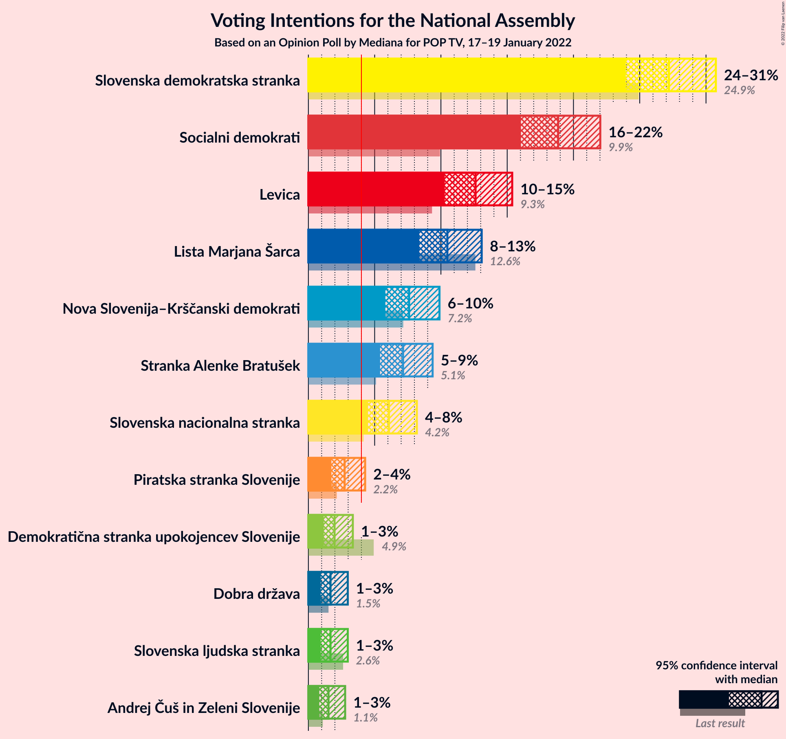

### Confidence Intervals

| Party | Last Result | Poll Result | 80% Confidence Interval | 90% Confidence Interval | 95% Confidence Interval | 99% Confidence Interval |
|:-----:|:-----------:|:-----------:|:-----------------------:|:-----------------------:|:-----------------------:|:-----------------------:|
| Slovenska demokratska stranka | 24.9% | 27.2% | 25.1–29.5% |24.5–30.2% |23.9–30.7% |22.9–31.9% |
| Socialni demokrati | 9.9% | 18.8% | 17.0–20.9% |16.5–21.5% |16.0–22.0% |15.2–23.0% |
| Levica | 9.3% | 12.6% | 11.1–14.4% |10.7–14.9% |10.3–15.4% |9.6–16.3% |
| Lista Marjana Šarca | 12.6% | 10.5% | 9.1–12.2% |8.7–12.7% |8.4–13.1% |7.7–13.9% |
| Nova Slovenija–Krščanski demokrati | 7.2% | 7.6% | 6.4–9.1% |6.1–9.5% |5.8–9.9% |5.3–10.6% |
| Stranka Alenke Bratušek | 5.1% | 7.1% | 6.0–8.6% |5.7–9.0% |5.4–9.4% |4.9–10.1% |
| Slovenska nacionalna stranka | 4.2% | 6.1% | 5.0–7.5% |4.7–7.8% |4.5–8.2% |4.0–8.9% |
| Piratska stranka Slovenije | 2.2% | 2.7% | 2.1–3.7% |1.9–4.0% |1.7–4.3% |1.5–4.8% |
| Demokratična stranka upokojencev Slovenije | 4.9% | 2.0% | 1.4–2.9% |1.3–3.1% |1.2–3.4% |0.9–3.8% |
| Slovenska ljudska stranka | 2.6% | 1.7% | 1.2–2.5% |1.1–2.8% |0.9–3.0% |0.7–3.4% |
| Dobra država | 1.5% | 1.7% | 1.2–2.5% |1.1–2.8% |0.9–3.0% |0.7–3.4% |
| Andrej Čuš in Zeleni Slovenije | 1.1% | 1.5% | 1.1–2.3% |0.9–2.6% |0.8–2.8% |0.7–3.2% |

*Note:* The poll result column reflects the actual value used in the calculations. Published results may vary slightly, and in addition be rounded to fewer digits.

## Seats

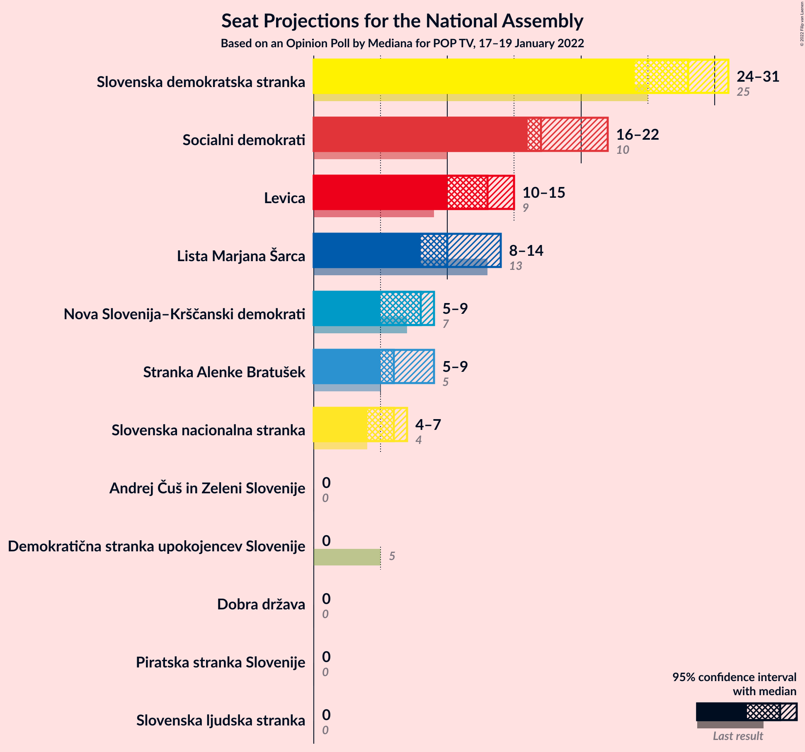

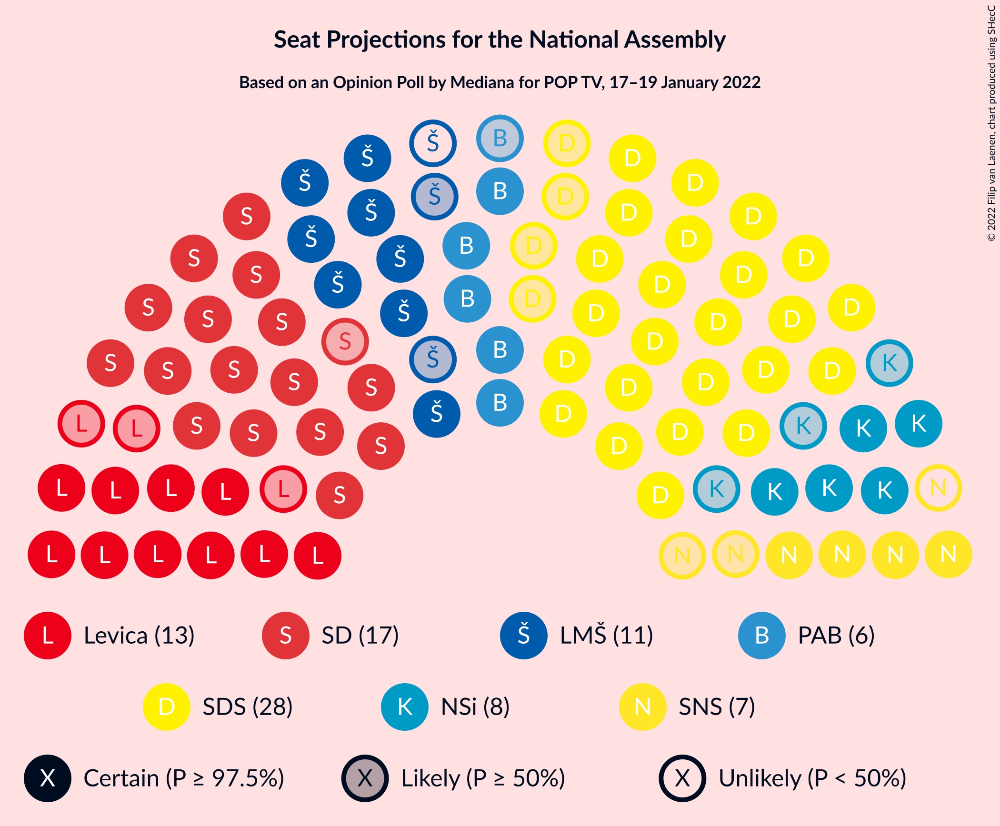

### Confidence Intervals

| Party | Last Result | Median | 80% Confidence Interval | 90% Confidence Interval | 95% Confidence Interval | 99% Confidence Interval |
|:-----:|:-----------:|:------:|:-----------------------:|:-----------------------:|:-----------------------:|:-----------------------:|
| <a href="#slovenska-demokratska-stranka">Slovenska demokratska stranka</a> | 25 | 28 | 26–29 |25–30 |24–31 |23–31 |
| <a href="#socialni-demokrati">Socialni demokrati</a> | 10 | 17 | 16–20 |16–21 |16–22 |14–22 |
| <a href="#levica">Levica</a> | 9 | 13 | 11–14 |11–14 |10–15 |10–15 |
| <a href="#lista-marjana-šarca">Lista Marjana Šarca</a> | 13 | 10 | 9–12 |9–14 |8–14 |7–14 |
| <a href="#nova-slovenija–krščanski-demokrati">Nova Slovenija–Krščanski demokrati</a> | 7 | 8 | 6–9 |6–9 |5–9 |5–10 |
| <a href="#stranka-alenke-bratušek">Stranka Alenke Bratušek</a> | 5 | 6 | 5–8 |5–8 |5–9 |5–10 |
| <a href="#slovenska-nacionalna-stranka">Slovenska nacionalna stranka</a> | 4 | 6 | 5–7 |5–7 |4–7 |4–8 |
| <a href="#piratska-stranka-slovenije">Piratska stranka Slovenije</a> | 0 | 0 | 0 |0 |0 |0–4 |
| <a href="#demokratična-stranka-upokojencev-slovenije">Demokratična stranka upokojencev Slovenije</a> | 5 | 0 | 0 |0 |0 |0 |
| <a href="#slovenska-ljudska-stranka">Slovenska ljudska stranka</a> | 0 | 0 | 0 |0 |0 |0 |
| <a href="#dobra-država">Dobra država</a> | 0 | 0 | 0 |0 |0 |0 |
| <a href="#andrej-čuš-in-zeleni-slovenije">Andrej Čuš in Zeleni Slovenije</a> | 0 | 0 | 0 |0 |0 |0 |

### Slovenska demokratska stranka

*For a full overview of the results for this party, see the [Slovenska demokratska stranka](party-slovenskademokratskastranka.html) page.*

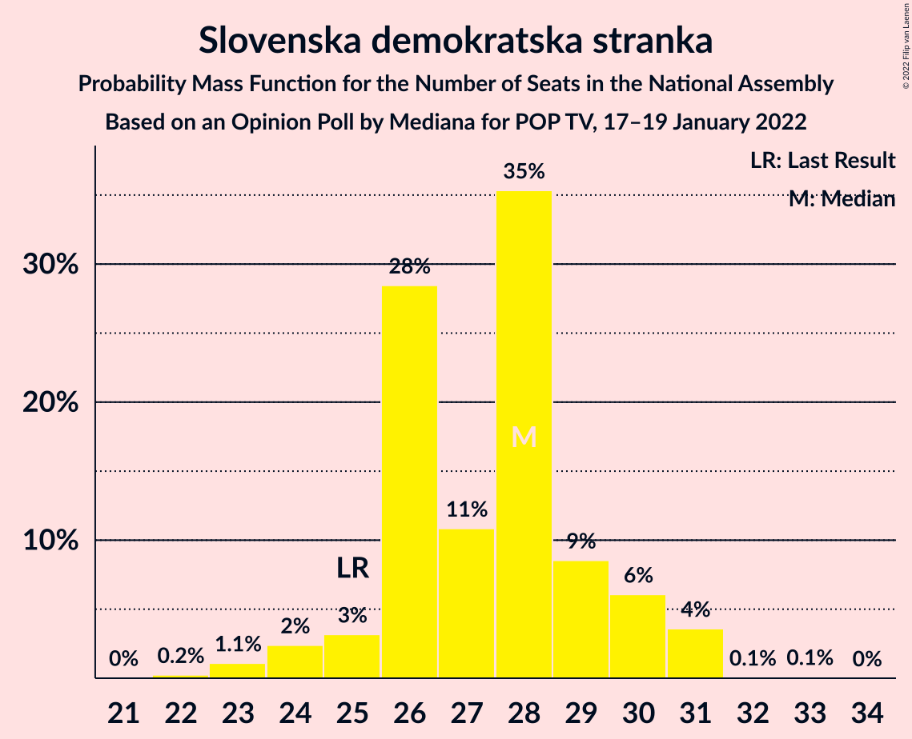

| Number of Seats | Probability | Accumulated | Special Marks |
|:---------------:|:-----------:|:-----------:|:-------------:|
| 21 | 0% | 100% |  |
| 22 | 0.2% | 99.9% |  |
| 23 | 1.1% | 99.7% |  |
| 24 | 2% | 98.6% |  |
| 25 | 3% | 96% | Last Result |
| 26 | 28% | 93% |  |
| 27 | 11% | 65% |  |
| 28 | 35% | 54% | Median |
| 29 | 9% | 18% |  |
| 30 | 6% | 10% |  |
| 31 | 4% | 4% |  |
| 32 | 0.1% | 0.2% |  |
| 33 | 0.1% | 0.1% |  |
| 34 | 0% | 0% |  |

### Socialni demokrati

*For a full overview of the results for this party, see the [Socialni demokrati](party-socialnidemokrati.html) page.*

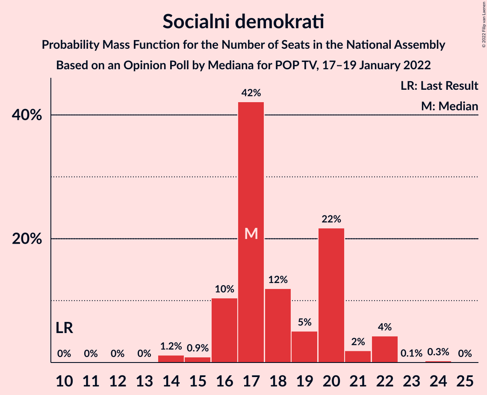

| Number of Seats | Probability | Accumulated | Special Marks |
|:---------------:|:-----------:|:-----------:|:-------------:|
| 10 | 0% | 100% | Last Result |
| 11 | 0% | 100% |  |
| 12 | 0% | 100% |  |
| 13 | 0% | 100% |  |
| 14 | 1.2% | 100% |  |
| 15 | 0.9% | 98.8% |  |
| 16 | 10% | 98% |  |
| 17 | 42% | 87% | Median |
| 18 | 12% | 45% |  |
| 19 | 5% | 33% |  |
| 20 | 22% | 28% |  |
| 21 | 2% | 7% |  |
| 22 | 4% | 5% |  |
| 23 | 0.1% | 0.3% |  |
| 24 | 0.3% | 0.3% |  |
| 25 | 0% | 0% |  |

### Levica

*For a full overview of the results for this party, see the [Levica](party-levica.html) page.*

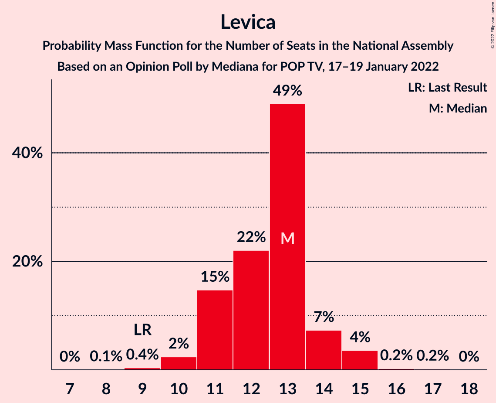

| Number of Seats | Probability | Accumulated | Special Marks |
|:---------------:|:-----------:|:-----------:|:-------------:|
| 8 | 0.1% | 100% |  |
| 9 | 0.4% | 99.9% | Last Result |
| 10 | 2% | 99.6% |  |
| 11 | 15% | 97% |  |
| 12 | 22% | 82% |  |
| 13 | 49% | 60% | Median |
| 14 | 7% | 11% |  |
| 15 | 4% | 4% |  |
| 16 | 0.2% | 0.4% |  |
| 17 | 0.2% | 0.2% |  |
| 18 | 0% | 0% |  |

### Lista Marjana Šarca

*For a full overview of the results for this party, see the [Lista Marjana Šarca](party-listamarjanašarca.html) page.*

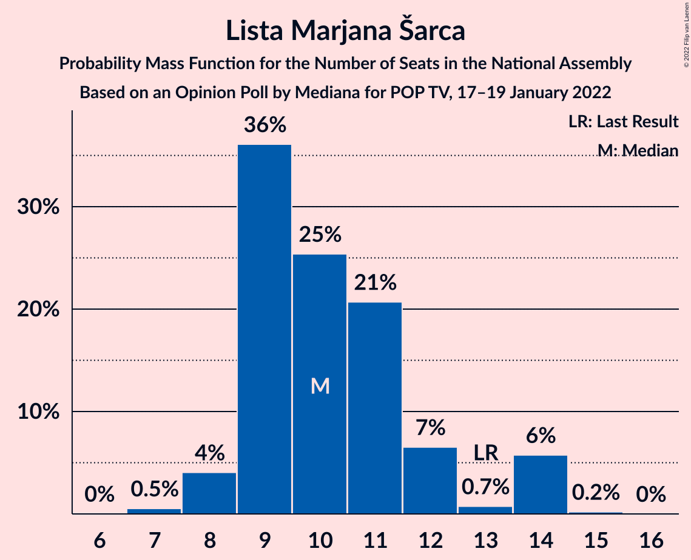

| Number of Seats | Probability | Accumulated | Special Marks |
|:---------------:|:-----------:|:-----------:|:-------------:|
| 7 | 0.5% | 100% |  |
| 8 | 4% | 99.5% |  |
| 9 | 36% | 95% |  |
| 10 | 25% | 59% | Median |
| 11 | 21% | 34% |  |
| 12 | 7% | 13% |  |
| 13 | 0.7% | 7% | Last Result |
| 14 | 6% | 6% |  |
| 15 | 0.2% | 0.2% |  |
| 16 | 0% | 0% |  |

### Nova Slovenija–Krščanski demokrati

*For a full overview of the results for this party, see the [Nova Slovenija–Krščanski demokrati](party-novaslovenija–krščanskidemokrati.html) page.*

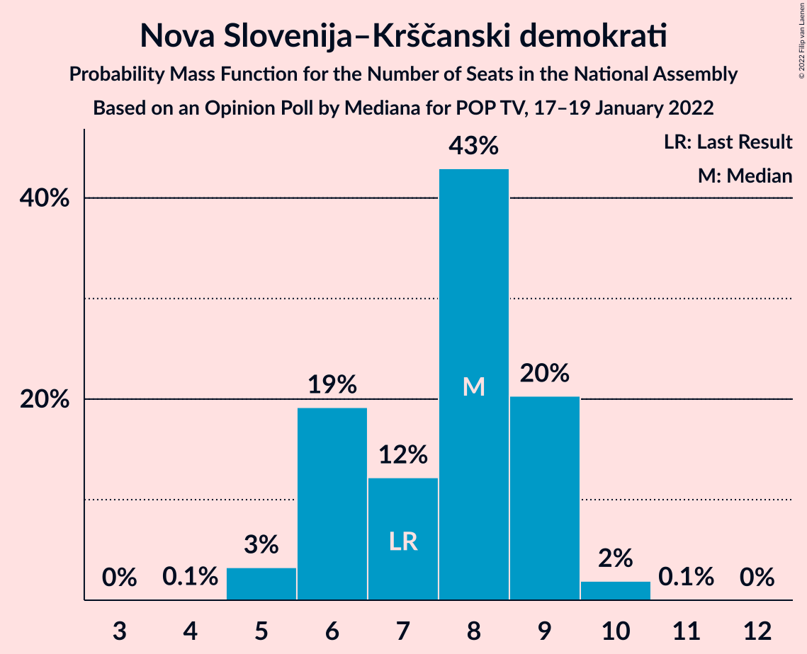

| Number of Seats | Probability | Accumulated | Special Marks |
|:---------------:|:-----------:|:-----------:|:-------------:|
| 4 | 0.1% | 100% |  |
| 5 | 3% | 99.9% |  |
| 6 | 19% | 97% |  |
| 7 | 12% | 77% | Last Result |
| 8 | 43% | 65% | Median |
| 9 | 20% | 22% |  |
| 10 | 2% | 2% |  |
| 11 | 0.1% | 0.1% |  |
| 12 | 0% | 0% |  |

### Stranka Alenke Bratušek

*For a full overview of the results for this party, see the [Stranka Alenke Bratušek](party-strankaalenkebratušek.html) page.*

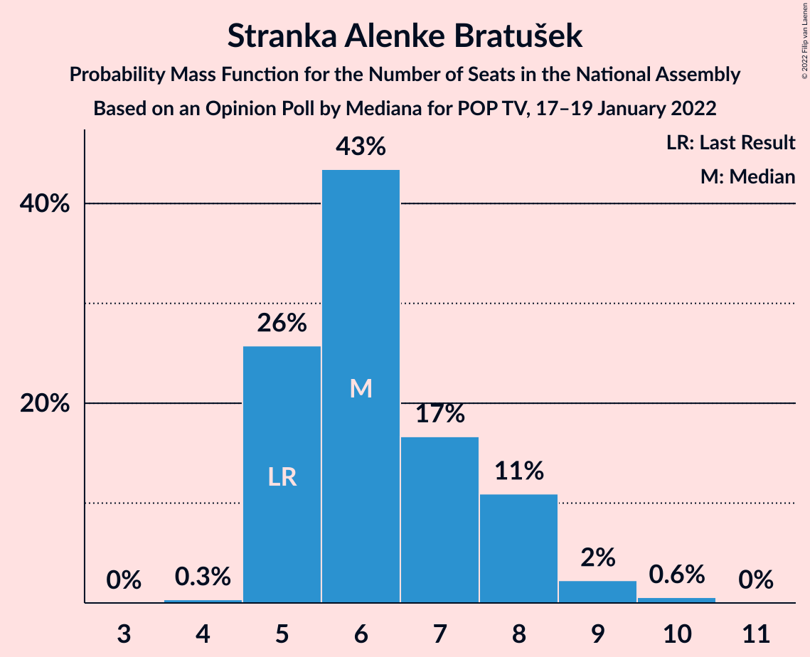

| Number of Seats | Probability | Accumulated | Special Marks |
|:---------------:|:-----------:|:-----------:|:-------------:|
| 4 | 0.3% | 100% |  |
| 5 | 26% | 99.7% | Last Result |
| 6 | 43% | 74% | Median |
| 7 | 17% | 30% |  |
| 8 | 11% | 14% |  |
| 9 | 2% | 3% |  |
| 10 | 0.6% | 0.6% |  |
| 11 | 0% | 0% |  |

### Slovenska nacionalna stranka

*For a full overview of the results for this party, see the [Slovenska nacionalna stranka](party-slovenskanacionalnastranka.html) page.*

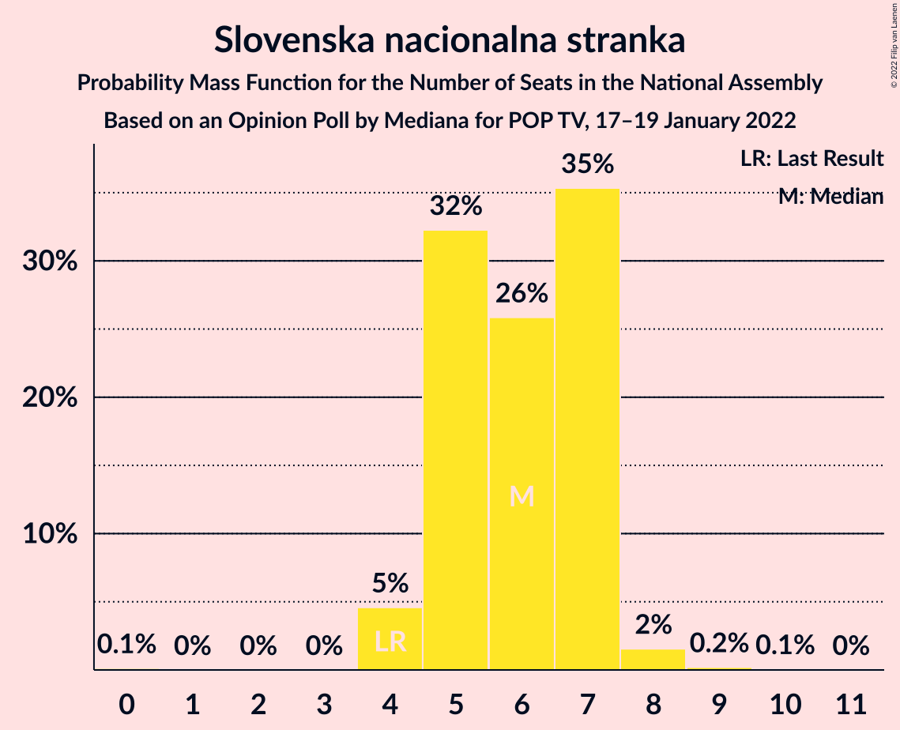

| Number of Seats | Probability | Accumulated | Special Marks |
|:---------------:|:-----------:|:-----------:|:-------------:|
| 0 | 0.1% | 100% |  |
| 1 | 0% | 99.9% |  |
| 2 | 0% | 99.9% |  |
| 3 | 0% | 99.9% |  |
| 4 | 5% | 99.9% | Last Result |
| 5 | 32% | 95% |  |
| 6 | 26% | 63% | Median |
| 7 | 35% | 37% |  |
| 8 | 2% | 2% |  |
| 9 | 0.2% | 0.3% |  |
| 10 | 0.1% | 0.1% |  |
| 11 | 0% | 0% |  |

### Piratska stranka Slovenije

*For a full overview of the results for this party, see the [Piratska stranka Slovenije](party-piratskastrankaslovenije.html) page.*

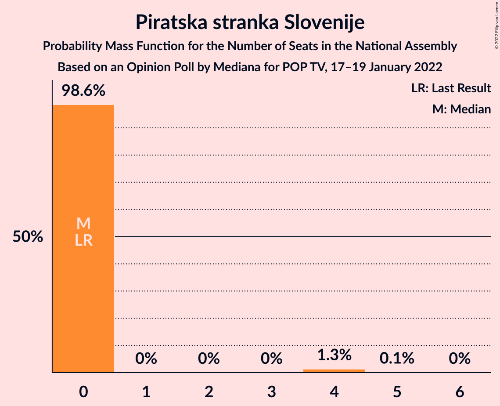

| Number of Seats | Probability | Accumulated | Special Marks |
|:---------------:|:-----------:|:-----------:|:-------------:|
| 0 | 98.6% | 100% | Last Result, Median |
| 1 | 0% | 1.4% |  |
| 2 | 0% | 1.4% |  |
| 3 | 0% | 1.4% |  |
| 4 | 1.3% | 1.4% |  |
| 5 | 0.1% | 0.1% |  |
| 6 | 0% | 0% |  |

### Demokratična stranka upokojencev Slovenije

*For a full overview of the results for this party, see the [Demokratična stranka upokojencev Slovenije](party-demokratičnastrankaupokojencevslovenije.html) page.*

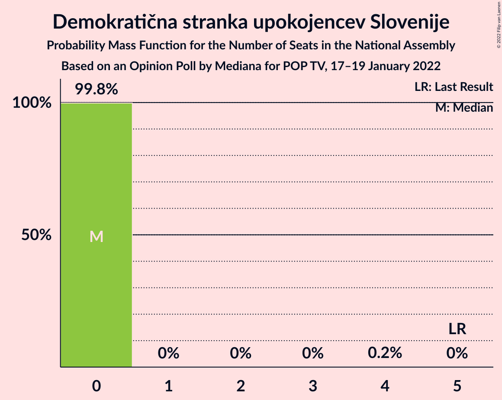

| Number of Seats | Probability | Accumulated | Special Marks |
|:---------------:|:-----------:|:-----------:|:-------------:|
| 0 | 99.8% | 100% | Median |
| 1 | 0% | 0.2% |  |
| 2 | 0% | 0.2% |  |
| 3 | 0% | 0.2% |  |
| 4 | 0.2% | 0.2% |  |
| 5 | 0% | 0% | Last Result |

### Slovenska ljudska stranka

*For a full overview of the results for this party, see the [Slovenska ljudska stranka](party-slovenskaljudskastranka.html) page.*

| Number of Seats | Probability | Accumulated | Special Marks |
|:---------------:|:-----------:|:-----------:|:-------------:|
| 0 | 99.8% | 100% | Last Result, Median |
| 1 | 0% | 0.2% |  |
| 2 | 0% | 0.2% |  |
| 3 | 0% | 0.2% |  |
| 4 | 0.2% | 0.2% |  |
| 5 | 0% | 0% |  |

### Dobra država

*For a full overview of the results for this party, see the [Dobra država](party-dobradržava.html) page.*

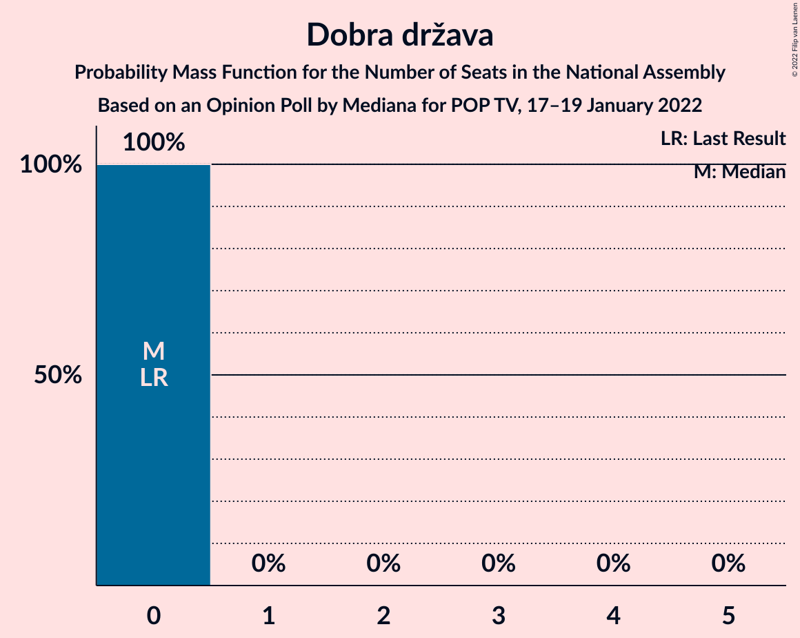

| Number of Seats | Probability | Accumulated | Special Marks |
|:---------------:|:-----------:|:-----------:|:-------------:|
| 0 | 100% | 100% | Last Result, Median |

### Andrej Čuš in Zeleni Slovenije

*For a full overview of the results for this party, see the [Andrej Čuš in Zeleni Slovenije](party-andrejčušinzelenislovenije.html) page.*

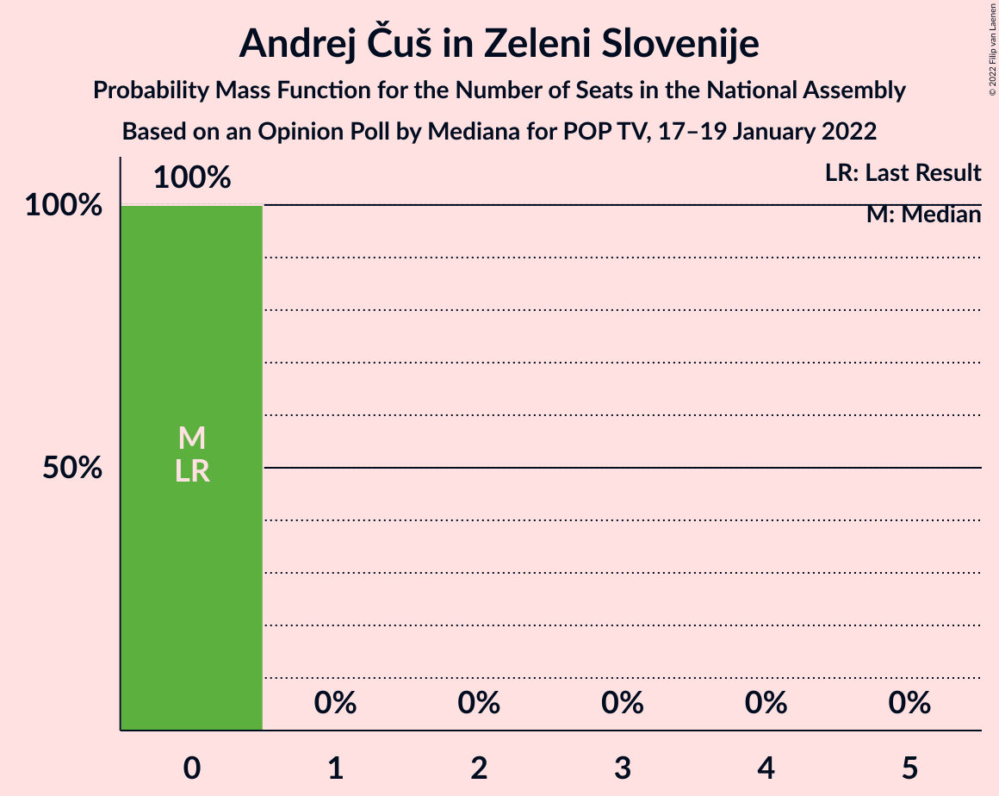

| Number of Seats | Probability | Accumulated | Special Marks |
|:---------------:|:-----------:|:-----------:|:-------------:|
| 0 | 100% | 100% | Last Result, Median |

## Coalitions

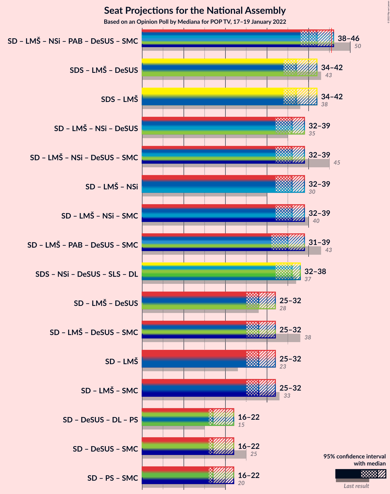

### Confidence Intervals

| Coalition | Last Result | Median | Majority? | 80% Confidence Interval | 90% Confidence Interval | 95% Confidence Interval | 99% Confidence Interval |
|:---------:|:-----------:|:------:|:---------:|:-----------------------:|:-----------------------:|:-----------------------:|:-----------------------:|
| Slovenska demokratska stranka – Lista Marjana Šarca – Demokratična stranka upokojencev Slovenije | 43 | 37 | 0% | 35–41 | 34–42 | 34–42 | 32–42 |
| Slovenska demokratska stranka – Lista Marjana Šarca | 38 | 37 | 0% | 35–41 | 34–42 | 34–42 | 32–42 |
| Socialni demokrati – Lista Marjana Šarca – Nova Slovenija–Krščanski demokrati – Demokratična stranka upokojencev Slovenije | 35 | 36 | 0% | 34–39 | 33–39 | 32–39 | 32–40 |
| Socialni demokrati – Lista Marjana Šarca – Nova Slovenija–Krščanski demokrati | 30 | 36 | 0% | 34–39 | 33–39 | 32–39 | 32–40 |
| Socialni demokrati – Lista Marjana Šarca – Demokratična stranka upokojencev Slovenije | 28 | 28 | 0% | 26–31 | 26–32 | 25–32 | 24–34 |
| Socialni demokrati – Lista Marjana Šarca | 23 | 28 | 0% | 26–31 | 26–32 | 25–32 | 24–34 |

### Slovenska demokratska stranka – Lista Marjana Šarca – Demokratična stranka upokojencev Slovenije

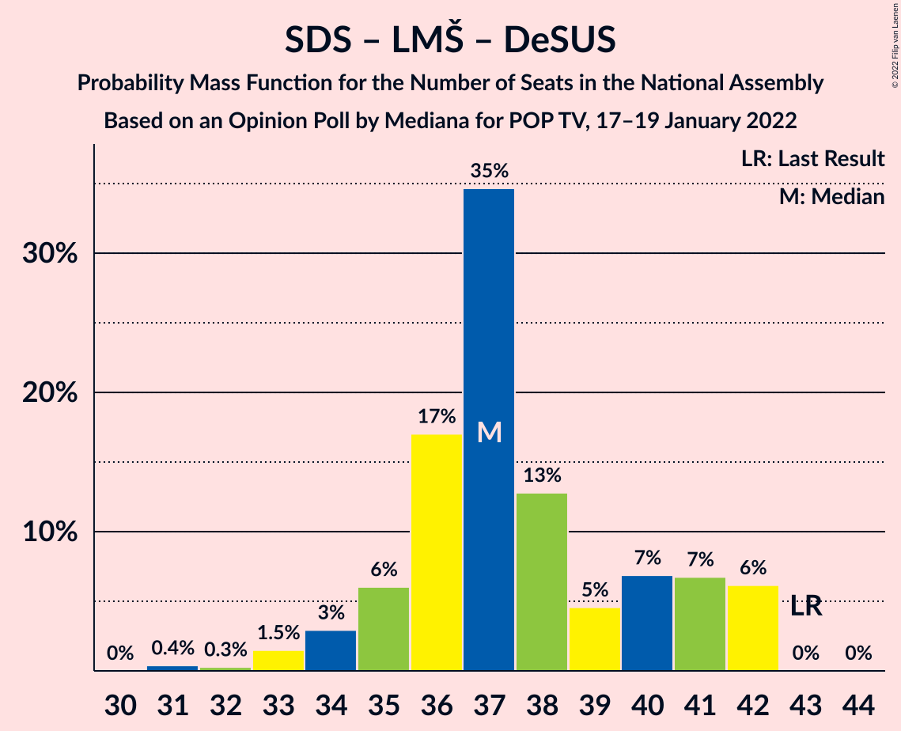

| Number of Seats | Probability | Accumulated | Special Marks |
|:---------------:|:-----------:|:-----------:|:-------------:|
| 31 | 0.4% | 100% |  |
| 32 | 0.3% | 99.6% |  |
| 33 | 1.5% | 99.3% |  |
| 34 | 3% | 98% |  |
| 35 | 6% | 95% |  |
| 36 | 17% | 89% |  |
| 37 | 35% | 72% |  |
| 38 | 13% | 37% | Median |
| 39 | 5% | 24% |  |
| 40 | 7% | 20% |  |
| 41 | 7% | 13% |  |
| 42 | 6% | 6% |  |
| 43 | 0% | 0.1% | Last Result |
| 44 | 0% | 0% |  |

### Slovenska demokratska stranka – Lista Marjana Šarca

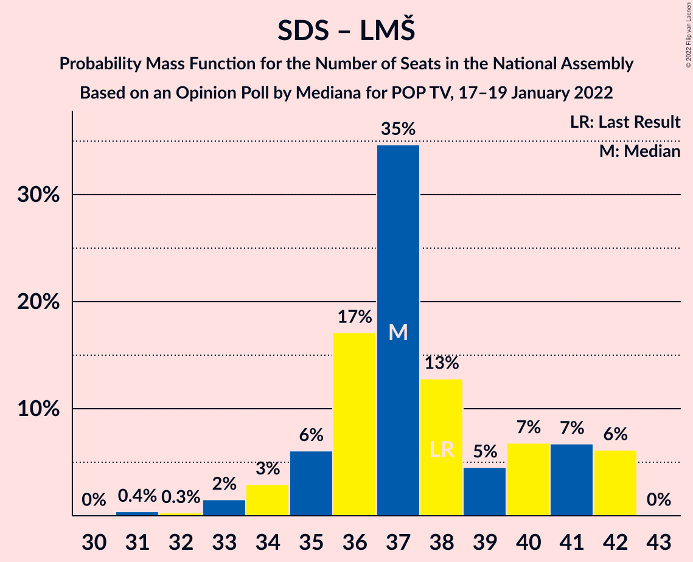

| Number of Seats | Probability | Accumulated | Special Marks |
|:---------------:|:-----------:|:-----------:|:-------------:|
| 31 | 0.4% | 100% |  |
| 32 | 0.3% | 99.6% |  |
| 33 | 2% | 99.3% |  |
| 34 | 3% | 98% |  |
| 35 | 6% | 95% |  |
| 36 | 17% | 89% |  |
| 37 | 35% | 72% |  |
| 38 | 13% | 37% | Last Result, Median |
| 39 | 5% | 24% |  |
| 40 | 7% | 20% |  |
| 41 | 7% | 13% |  |
| 42 | 6% | 6% |  |
| 43 | 0% | 0% |  |

### Socialni demokrati – Lista Marjana Šarca – Nova Slovenija–Krščanski demokrati – Demokratična stranka upokojencev Slovenije

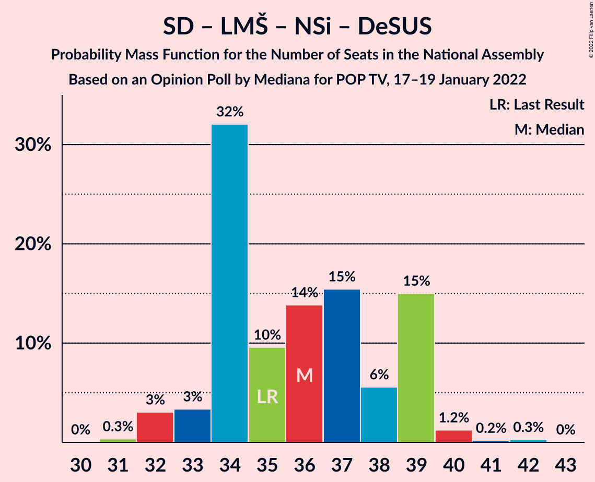

| Number of Seats | Probability | Accumulated | Special Marks |
|:---------------:|:-----------:|:-----------:|:-------------:|
| 31 | 0.3% | 100% |  |
| 32 | 3% | 99.6% |  |
| 33 | 3% | 97% |  |
| 34 | 32% | 93% |  |
| 35 | 10% | 61% | Last Result, Median |
| 36 | 14% | 52% |  |
| 37 | 15% | 38% |  |
| 38 | 6% | 22% |  |
| 39 | 15% | 17% |  |
| 40 | 1.2% | 2% |  |
| 41 | 0.2% | 0.5% |  |
| 42 | 0.3% | 0.3% |  |
| 43 | 0% | 0% |  |

### Socialni demokrati – Lista Marjana Šarca – Nova Slovenija–Krščanski demokrati

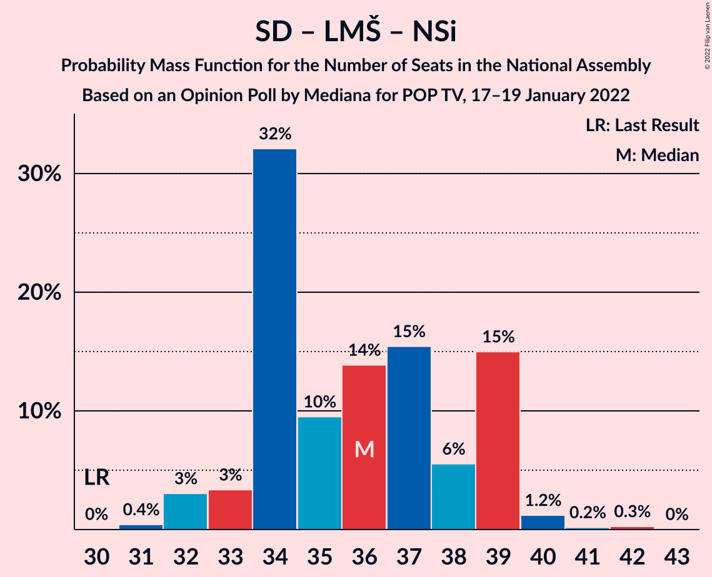

| Number of Seats | Probability | Accumulated | Special Marks |
|:---------------:|:-----------:|:-----------:|:-------------:|
| 30 | 0% | 100% | Last Result |
| 31 | 0.4% | 99.9% |  |
| 32 | 3% | 99.5% |  |
| 33 | 3% | 96% |  |
| 34 | 32% | 93% |  |
| 35 | 10% | 61% | Median |
| 36 | 14% | 52% |  |
| 37 | 15% | 38% |  |
| 38 | 6% | 22% |  |
| 39 | 15% | 17% |  |
| 40 | 1.2% | 2% |  |
| 41 | 0.2% | 0.5% |  |
| 42 | 0.3% | 0.3% |  |
| 43 | 0% | 0% |  |

### Socialni demokrati – Lista Marjana Šarca – Demokratična stranka upokojencev Slovenije

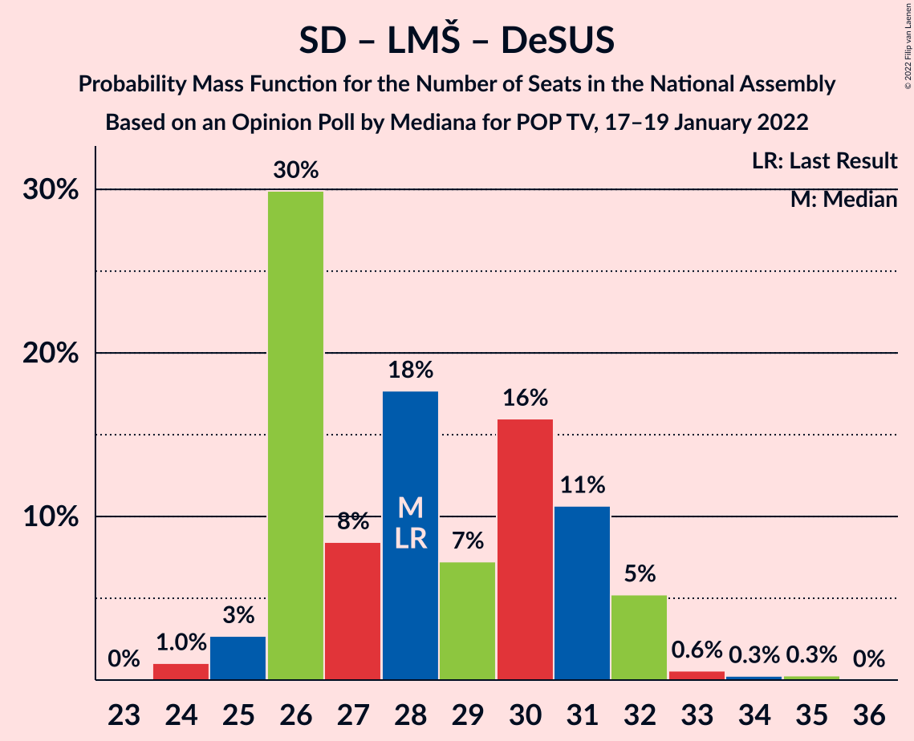

| Number of Seats | Probability | Accumulated | Special Marks |
|:---------------:|:-----------:|:-----------:|:-------------:|
| 24 | 1.0% | 100% |  |
| 25 | 3% | 98.9% |  |
| 26 | 30% | 96% |  |
| 27 | 8% | 66% | Median |
| 28 | 18% | 58% | Last Result |
| 29 | 7% | 40% |  |
| 30 | 16% | 33% |  |
| 31 | 11% | 17% |  |
| 32 | 5% | 6% |  |
| 33 | 0.6% | 1.1% |  |
| 34 | 0.3% | 0.5% |  |
| 35 | 0.3% | 0.3% |  |
| 36 | 0% | 0% |  |

### Socialni demokrati – Lista Marjana Šarca

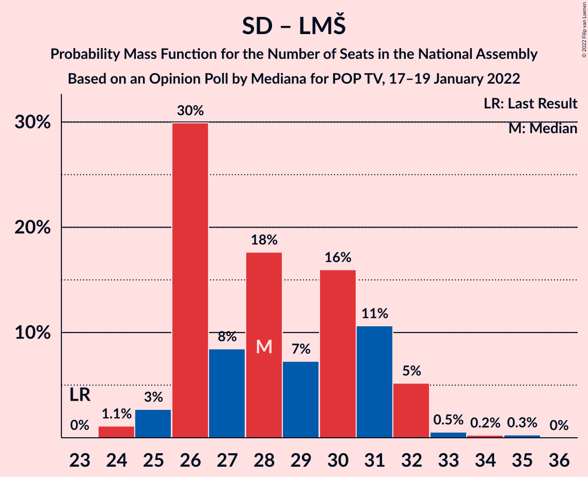

| Number of Seats | Probability | Accumulated | Special Marks |
|:---------------:|:-----------:|:-----------:|:-------------:|
| 23 | 0% | 100% | Last Result |
| 24 | 1.1% | 100% |  |
| 25 | 3% | 98.8% |  |
| 26 | 30% | 96% |  |
| 27 | 8% | 66% | Median |
| 28 | 18% | 58% |  |
| 29 | 7% | 40% |  |
| 30 | 16% | 33% |  |
| 31 | 11% | 17% |  |
| 32 | 5% | 6% |  |
| 33 | 0.5% | 1.1% |  |
| 34 | 0.2% | 0.5% |  |
| 35 | 0.3% | 0.3% |  |
| 36 | 0% | 0% |  |

## Technical Information

### Opinion Poll

+ **Polling firm:** Mediana
+ **Commissioner(s):** POP TV
+ **Fieldwork period:** 17–19 January 2022

### Calculations

+ **Sample size:** 658
+ **Simulations done:** 1,048,576
+ **Error estimate:** 2.04%

