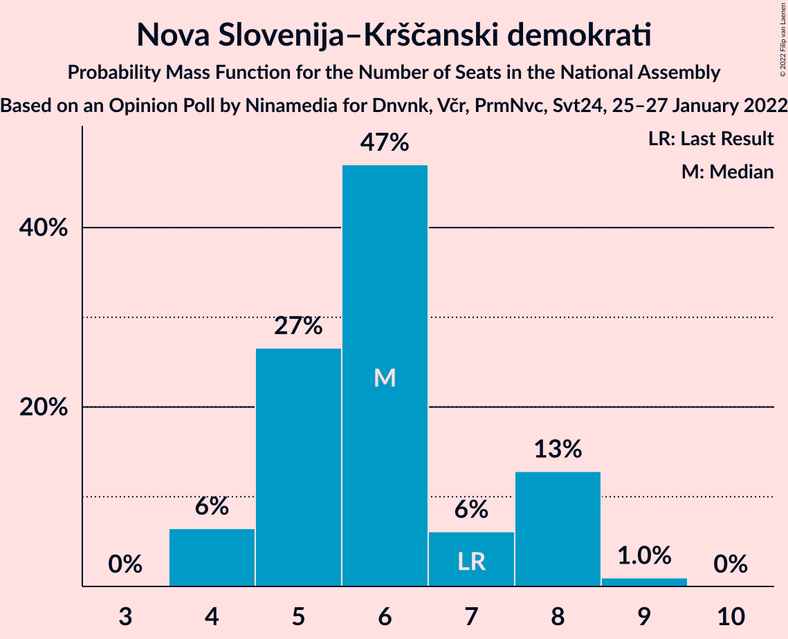

# Opinion Poll by Ninamedia for Dnvnk, Včr, PrmNvc, Svt24, 25–27 January 2022

<a href="#voting-intentions">Voting Intentions</a> | <a href="#seats">Seats</a> | <a href="#coalitions">Coalitions</a> | <a href="#technical-information">Technical Information</a>

## Voting Intentions

### Confidence Intervals

| Party | Last Result | Poll Result | 80% Confidence Interval | 90% Confidence Interval | 95% Confidence Interval | 99% Confidence Interval |
|:-----:|:-----------:|:-----------:|:-----------------------:|:-----------------------:|:-----------------------:|:-----------------------:|
| Slovenska demokratska stranka | 24.9% | 25.9% | 24.2–27.7% |23.7–28.2% |23.3–28.7% |22.6–29.5% |
| Lista Roberta Goloba | 0.0% | 22.8% | 21.2–24.5% |20.7–25.0% |20.3–25.4% |19.6–26.2% |
| Socialni demokrati | 9.9% | 13.9% | 12.6–15.4% |12.3–15.8% |11.9–16.1% |11.3–16.9% |
| Levica | 9.3% | 8.6% | 7.5–9.8% |7.3–10.1% |7.0–10.4% |6.6–11.0% |
| Nova Slovenija–Krščanski demokrati | 7.2% | 6.3% | 5.4–7.4% |5.2–7.7% |5.0–7.9% |4.6–8.5% |
| Lista Marjana Šarca | 12.6% | 5.5% | 4.7–6.5% |4.5–6.8% |4.3–7.1% |3.9–7.6% |
| Stranka Alenke Bratušek | 5.1% | 4.5% | 3.7–5.4% |3.6–5.7% |3.4–5.9% |3.1–6.4% |
| Povežimo Slovenijo | 0.0% | 3.7% | 3.1–4.6% |2.9–4.8% |2.7–5.0% |2.4–5.5% |
| Naša dežela | 0.0% | 2.7% | 2.1–3.4% |2.0–3.6% |1.8–3.8% |1.6–4.2% |
| Demokratična stranka upokojencev Slovenije | 4.9% | 1.5% | 1.1–2.1% |1.0–2.3% |0.9–2.5% |0.8–2.8% |
| Piratska stranka Slovenije | 2.2% | 0.7% | 0.4–1.1% |0.4–1.2% |0.3–1.4% |0.2–1.6% |
| Slovenska nacionalna stranka | 4.2% | 0.3% | 0.2–0.6% |0.1–0.7% |0.1–0.8% |0.1–1.1% |
| Dobra država | 1.5% | 0.3% | 0.2–0.6% |0.1–0.7% |0.1–0.8% |0.1–1.1% |

*Note:* The poll result column reflects the actual value used in the calculations. Published results may vary slightly, and in addition be rounded to fewer digits.

## Seats

### Confidence Intervals

| Party | Last Result | Median | 80% Confidence Interval | 90% Confidence Interval | 95% Confidence Interval | 99% Confidence Interval |
|:-----:|:-----------:|:------:|:-----------------------:|:-----------------------:|:-----------------------:|:-----------------------:|
| <a href="#slovenska-demokratska-stranka">Slovenska demokratska stranka</a> | 25 | 26 | 23–27 |23–28 |23–28 |22–29 |
| <a href="#lista-roberta-goloba">Lista Roberta Goloba</a> | 0 | 22 | 21–24 |21–25 |20–25 |19–26 |
| <a href="#socialni-demokrati">Socialni demokrati</a> | 10 | 14 | 12–17 |12–17 |11–17 |11–17 |
| <a href="#levica">Levica</a> | 9 | 8 | 7–9 |7–10 |7–10 |6–10 |
| <a href="#nova-slovenija–krščanski-demokrati">Nova Slovenija–Krščanski demokrati</a> | 7 | 6 | 5–8 |4–8 |4–8 |4–9 |
| <a href="#lista-marjana-šarca">Lista Marjana Šarca</a> | 13 | 6 | 4–6 |4–6 |4–6 |4–7 |
| <a href="#stranka-alenke-bratušek">Stranka Alenke Bratušek</a> | 5 | 4 | 0–5 |0–5 |0–6 |0–6 |
| <a href="#povežimo-slovenijo">Povežimo Slovenijo</a> | 0 | 4 | 0–4 |0–4 |0–5 |0–5 |
| <a href="#naša-dežela">Naša dežela</a> | 0 | 0 | 0 |0 |0 |0 |
| <a href="#demokratična-stranka-upokojencev-slovenije">Demokratična stranka upokojencev Slovenije</a> | 5 | 0 | 0 |0 |0 |0 |
| <a href="#piratska-stranka-slovenije">Piratska stranka Slovenije</a> | 0 | 0 | 0 |0 |0 |0 |
| <a href="#slovenska-nacionalna-stranka">Slovenska nacionalna stranka</a> | 4 | 0 | 0 |0 |0 |0 |
| <a href="#dobra-država">Dobra država</a> | 0 | 0 | 0 |0 |0 |0 |

### Slovenska demokratska stranka

*For a full overview of the results for this party, see the [Slovenska demokratska stranka](party-slovenskademokratskastranka.html) page.*

| Number of Seats | Probability | Accumulated | Special Marks |
|:---------------:|:-----------:|:-----------:|:-------------:|
| 21 | 0.3% | 100% |  |
| 22 | 0.6% | 99.7% |  |
| 23 | 9% | 99.1% |  |
| 24 | 12% | 90% |  |
| 25 | 13% | 78% | Last Result |
| 26 | 30% | 65% | Median |
| 27 | 27% | 35% |  |
| 28 | 6% | 8% |  |
| 29 | 2% | 2% |  |
| 30 | 0.3% | 0.4% |  |
| 31 | 0.1% | 0.1% |  |
| 32 | 0% | 0% |  |

### Lista Roberta Goloba

*For a full overview of the results for this party, see the [Lista Roberta Goloba](party-listarobertagoloba.html) page.*

| Number of Seats | Probability | Accumulated | Special Marks |
|:---------------:|:-----------:|:-----------:|:-------------:|
| 0 | 0% | 100% | Last Result |
| 1 | 0% | 100% |  |
| 2 | 0% | 100% |  |
| 3 | 0% | 100% |  |
| 4 | 0% | 100% |  |
| 5 | 0% | 100% |  |
| 6 | 0% | 100% |  |
| 7 | 0% | 100% |  |
| 8 | 0% | 100% |  |
| 9 | 0% | 100% |  |
| 10 | 0% | 100% |  |
| 11 | 0% | 100% |  |
| 12 | 0% | 100% |  |
| 13 | 0% | 100% |  |
| 14 | 0% | 100% |  |
| 15 | 0% | 100% |  |
| 16 | 0% | 100% |  |
| 17 | 0% | 100% |  |
| 18 | 0.3% | 100% |  |
| 19 | 0.8% | 99.7% |  |
| 20 | 3% | 98.9% |  |
| 21 | 10% | 96% |  |
| 22 | 43% | 85% | Median |
| 23 | 11% | 42% |  |
| 24 | 23% | 31% |  |
| 25 | 6% | 8% |  |
| 26 | 1.5% | 2% |  |
| 27 | 0.2% | 0.2% |  |
| 28 | 0% | 0% |  |

### Socialni demokrati

*For a full overview of the results for this party, see the [Socialni demokrati](party-socialnidemokrati.html) page.*

| Number of Seats | Probability | Accumulated | Special Marks |
|:---------------:|:-----------:|:-----------:|:-------------:|
| 10 | 0.1% | 100% | Last Result |
| 11 | 4% | 99.9% |  |
| 12 | 7% | 96% |  |
| 13 | 16% | 89% |  |
| 14 | 44% | 74% | Median |
| 15 | 4% | 29% |  |
| 16 | 8% | 25% |  |
| 17 | 17% | 17% |  |
| 18 | 0.2% | 0.2% |  |
| 19 | 0% | 0% |  |

### Levica

*For a full overview of the results for this party, see the [Levica](party-levica.html) page.*

| Number of Seats | Probability | Accumulated | Special Marks |
|:---------------:|:-----------:|:-----------:|:-------------:|
| 6 | 0.8% | 100% |  |
| 7 | 10% | 99.2% |  |
| 8 | 47% | 89% | Median |
| 9 | 36% | 42% | Last Result |
| 10 | 5% | 6% |  |
| 11 | 0.2% | 0.3% |  |
| 12 | 0.1% | 0.1% |  |
| 13 | 0% | 0% |  |

### Nova Slovenija–Krščanski demokrati

*For a full overview of the results for this party, see the [Nova Slovenija–Krščanski demokrati](party-novaslovenija–krščanskidemokrati.html) page.*

| Number of Seats | Probability | Accumulated | Special Marks |
|:---------------:|:-----------:|:-----------:|:-------------:|
| 4 | 6% | 100% |  |
| 5 | 27% | 94% |  |
| 6 | 47% | 67% | Median |
| 7 | 6% | 20% | Last Result |
| 8 | 13% | 14% |  |
| 9 | 1.0% | 1.0% |  |
| 10 | 0% | 0% |  |

### Lista Marjana Šarca

*For a full overview of the results for this party, see the [Lista Marjana Šarca](party-listamarjanašarca.html) page.*

| Number of Seats | Probability | Accumulated | Special Marks |
|:---------------:|:-----------:|:-----------:|:-------------:|
| 0 | 0.2% | 100% |  |
| 1 | 0% | 99.8% |  |
| 2 | 0% | 99.8% |  |
| 3 | 0% | 99.8% |  |
| 4 | 29% | 99.8% |  |
| 5 | 15% | 71% |  |
| 6 | 54% | 56% | Median |
| 7 | 1.3% | 1.5% |  |
| 8 | 0.2% | 0.2% |  |
| 9 | 0% | 0% |  |
| 10 | 0% | 0% |  |
| 11 | 0% | 0% |  |
| 12 | 0% | 0% |  |
| 13 | 0% | 0% | Last Result |

### Stranka Alenke Bratušek

*For a full overview of the results for this party, see the [Stranka Alenke Bratušek](party-strankaalenkebratušek.html) page.*

| Number of Seats | Probability | Accumulated | Special Marks |
|:---------------:|:-----------:|:-----------:|:-------------:|
| 0 | 36% | 100% |  |
| 1 | 0% | 64% |  |
| 2 | 0% | 64% |  |
| 3 | 0% | 64% |  |
| 4 | 36% | 64% | Median |
| 5 | 23% | 28% | Last Result |
| 6 | 4% | 4% |  |
| 7 | 0.1% | 0.1% |  |
| 8 | 0% | 0% |  |

### Povežimo Slovenijo

*For a full overview of the results for this party, see the [Povežimo Slovenijo](party-povežimoslovenijo.html) page.*

| Number of Seats | Probability | Accumulated | Special Marks |
|:---------------:|:-----------:|:-----------:|:-------------:|
| 0 | 45% | 100% | Last Result |
| 1 | 0% | 55% |  |
| 2 | 0% | 55% |  |
| 3 | 0.6% | 55% |  |
| 4 | 50% | 54% | Median |
| 5 | 4% | 4% |  |
| 6 | 0% | 0% |  |

### Naša dežela

*For a full overview of the results for this party, see the [Naša dežela](party-našadežela.html) page.*

| Number of Seats | Probability | Accumulated | Special Marks |
|:---------------:|:-----------:|:-----------:|:-------------:|
| 0 | 99.5% | 100% | Last Result, Median |
| 1 | 0% | 0.5% |  |
| 2 | 0% | 0.5% |  |
| 3 | 0% | 0.5% |  |
| 4 | 0.4% | 0.5% |  |
| 5 | 0% | 0% |  |

### Demokratična stranka upokojencev Slovenije

*For a full overview of the results for this party, see the [Demokratična stranka upokojencev Slovenije](party-demokratičnastrankaupokojencevslovenije.html) page.*

| Number of Seats | Probability | Accumulated | Special Marks |
|:---------------:|:-----------:|:-----------:|:-------------:|
| 0 | 100% | 100% | Median |
| 1 | 0% | 0% |  |
| 2 | 0% | 0% |  |
| 3 | 0% | 0% |  |
| 4 | 0% | 0% |  |
| 5 | 0% | 0% | Last Result |

### Piratska stranka Slovenije

*For a full overview of the results for this party, see the [Piratska stranka Slovenije](party-piratskastrankaslovenije.html) page.*

| Number of Seats | Probability | Accumulated | Special Marks |
|:---------------:|:-----------:|:-----------:|:-------------:|
| 0 | 100% | 100% | Last Result, Median |

### Slovenska nacionalna stranka

*For a full overview of the results for this party, see the [Slovenska nacionalna stranka](party-slovenskanacionalnastranka.html) page.*

| Number of Seats | Probability | Accumulated | Special Marks |
|:---------------:|:-----------:|:-----------:|:-------------:|
| 0 | 100% | 100% | Median |
| 1 | 0% | 0% |  |
| 2 | 0% | 0% |  |
| 3 | 0% | 0% |  |
| 4 | 0% | 0% | Last Result |

### Dobra država

*For a full overview of the results for this party, see the [Dobra država](party-dobradržava.html) page.*

| Number of Seats | Probability | Accumulated | Special Marks |
|:---------------:|:-----------:|:-----------:|:-------------:|
| 0 | 100% | 100% | Last Result, Median |

## Coalitions

### Confidence Intervals

| Coalition | Last Result | Median | Majority? | 80% Confidence Interval | 90% Confidence Interval | 95% Confidence Interval | 99% Confidence Interval |
|:---------:|:-----------:|:------:|:---------:|:-----------------------:|:-----------------------:|:-----------------------:|:-----------------------:|
| Slovenska demokratska stranka – Lista Marjana Šarca – Demokratična stranka upokojencev Slovenije | 43 | 30 | 0% | 29–33 | 29–34 | 28–34 | 27–35 |
| Slovenska demokratska stranka – Lista Marjana Šarca | 38 | 30 | 0% | 29–33 | 29–34 | 28–34 | 27–35 |
| Socialni demokrati – Nova Slovenija–Krščanski demokrati – Lista Marjana Šarca – Demokratična stranka upokojencev Slovenije | 35 | 25 | 0% | 23–28 | 23–30 | 22–30 | 21–30 |
| Socialni demokrati – Nova Slovenija–Krščanski demokrati – Lista Marjana Šarca | 30 | 25 | 0% | 23–28 | 23–30 | 22–30 | 21–30 |
| Socialni demokrati – Lista Marjana Šarca – Demokratična stranka upokojencev Slovenije | 28 | 19 | 0% | 18–23 | 17–23 | 17–23 | 16–24 |
| Socialni demokrati – Lista Marjana Šarca | 23 | 19 | 0% | 18–23 | 17–23 | 17–23 | 16–24 |

### Slovenska demokratska stranka – Lista Marjana Šarca – Demokratična stranka upokojencev Slovenije

| Number of Seats | Probability | Accumulated | Special Marks |
|:---------------:|:-----------:|:-----------:|:-------------:|
| 25 | 0.1% | 100% |  |
| 26 | 0.3% | 99.9% |  |
| 27 | 0.2% | 99.6% |  |
| 28 | 3% | 99.4% |  |
| 29 | 8% | 97% |  |
| 30 | 39% | 89% |  |
| 31 | 14% | 50% |  |
| 32 | 10% | 36% | Median |
| 33 | 17% | 26% |  |
| 34 | 8% | 9% |  |
| 35 | 0.4% | 0.7% |  |
| 36 | 0.2% | 0.2% |  |
| 37 | 0.1% | 0.1% |  |
| 38 | 0% | 0% |  |
| 39 | 0% | 0% |  |
| 40 | 0% | 0% |  |
| 41 | 0% | 0% |  |
| 42 | 0% | 0% |  |
| 43 | 0% | 0% | Last Result |

### Slovenska demokratska stranka – Lista Marjana Šarca

| Number of Seats | Probability | Accumulated | Special Marks |
|:---------------:|:-----------:|:-----------:|:-------------:|
| 25 | 0.1% | 100% |  |
| 26 | 0.3% | 99.9% |  |
| 27 | 0.2% | 99.6% |  |
| 28 | 3% | 99.4% |  |
| 29 | 8% | 97% |  |
| 30 | 39% | 89% |  |
| 31 | 14% | 50% |  |
| 32 | 10% | 36% | Median |
| 33 | 17% | 26% |  |
| 34 | 8% | 9% |  |
| 35 | 0.4% | 0.7% |  |
| 36 | 0.2% | 0.2% |  |
| 37 | 0.1% | 0.1% |  |
| 38 | 0% | 0% | Last Result |

### Socialni demokrati – Nova Slovenija–Krščanski demokrati – Lista Marjana Šarca – Demokratična stranka upokojencev Slovenije

| Number of Seats | Probability | Accumulated | Special Marks |
|:---------------:|:-----------:|:-----------:|:-------------:|
| 20 | 0.2% | 100% |  |
| 21 | 0.3% | 99.7% |  |
| 22 | 4% | 99.5% |  |
| 23 | 6% | 96% |  |
| 24 | 35% | 90% |  |
| 25 | 10% | 55% |  |
| 26 | 15% | 45% | Median |
| 27 | 3% | 30% |  |
| 28 | 18% | 26% |  |
| 29 | 1.3% | 8% |  |
| 30 | 6% | 7% |  |
| 31 | 0.1% | 0.2% |  |
| 32 | 0% | 0% |  |
| 33 | 0% | 0% |  |
| 34 | 0% | 0% |  |
| 35 | 0% | 0% | Last Result |

### Socialni demokrati – Nova Slovenija–Krščanski demokrati – Lista Marjana Šarca

| Number of Seats | Probability | Accumulated | Special Marks |
|:---------------:|:-----------:|:-----------:|:-------------:|
| 20 | 0.2% | 100% |  |
| 21 | 0.3% | 99.7% |  |
| 22 | 4% | 99.5% |  |
| 23 | 6% | 96% |  |
| 24 | 35% | 90% |  |
| 25 | 10% | 55% |  |
| 26 | 15% | 45% | Median |
| 27 | 3% | 30% |  |
| 28 | 18% | 26% |  |
| 29 | 1.3% | 8% |  |
| 30 | 6% | 7% | Last Result |
| 31 | 0.1% | 0.2% |  |
| 32 | 0% | 0% |  |

### Socialni demokrati – Lista Marjana Šarca – Demokratična stranka upokojencev Slovenije

| Number of Seats | Probability | Accumulated | Special Marks |
|:---------------:|:-----------:|:-----------:|:-------------:|
| 15 | 0.3% | 100% |  |
| 16 | 0.9% | 99.7% |  |
| 17 | 8% | 98.8% |  |
| 18 | 35% | 90% |  |
| 19 | 10% | 56% |  |
| 20 | 19% | 46% | Median |
| 21 | 2% | 26% |  |
| 22 | 7% | 24% |  |
| 23 | 17% | 17% |  |
| 24 | 0.8% | 0.8% |  |
| 25 | 0% | 0% |  |
| 26 | 0% | 0% |  |
| 27 | 0% | 0% |  |
| 28 | 0% | 0% | Last Result |

### Socialni demokrati – Lista Marjana Šarca

| Number of Seats | Probability | Accumulated | Special Marks |
|:---------------:|:-----------:|:-----------:|:-------------:|
| 15 | 0.3% | 100% |  |
| 16 | 0.9% | 99.7% |  |
| 17 | 8% | 98.8% |  |
| 18 | 35% | 90% |  |
| 19 | 10% | 56% |  |
| 20 | 19% | 46% | Median |
| 21 | 2% | 26% |  |
| 22 | 7% | 24% |  |
| 23 | 17% | 17% | Last Result |
| 24 | 0.8% | 0.8% |  |
| 25 | 0% | 0% |  |

## Technical Information

### Opinion Poll

+ **Polling firm:** Ninamedia
+ **Commissioner(s):** Dnvnk, Včr, PrmNvc, Svt24
+ **Fieldwork period:** 25–27 January 2022

### Calculations

+ **Sample size:** 1050
+ **Simulations done:** 1,048,576
+ **Error estimate:** 1.72%

