# Opinion Poll by Parsifal for Planet TV, 1–30 January 2022

<a href="#voting-intentions">Voting Intentions</a> | <a href="#seats">Seats</a> | <a href="#coalitions">Coalitions</a> | <a href="#technical-information">Technical Information</a>

## Voting Intentions

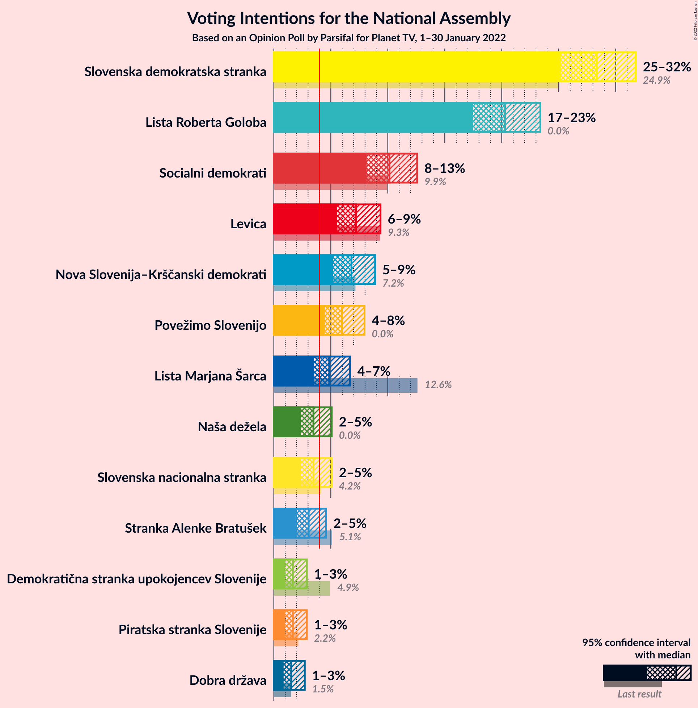

### Confidence Intervals

| Party | Last Result | Poll Result | 80% Confidence Interval | 90% Confidence Interval | 95% Confidence Interval | 99% Confidence Interval |
|:-----:|:-----------:|:-----------:|:-----------------------:|:-----------------------:|:-----------------------:|:-----------------------:|
| Slovenska demokratska stranka | 24.9% | 28.3% | 26.2–30.6% |25.7–31.2% |25.2–31.7% |24.2–32.8% |
| Lista Roberta Goloba | 0.0% | 20.3% | 18.5–22.3% |17.9–22.9% |17.5–23.4% |16.7–24.4% |
| Socialni demokrati | 9.9% | 10.1% | 8.8–11.7% |8.5–12.2% |8.1–12.6% |7.5–13.4% |
| Levica | 9.3% | 7.2% | 6.1–8.6% |5.8–9.0% |5.5–9.4% |5.1–10.1% |
| Nova Slovenija–Krščanski demokrati | 7.2% | 6.8% | 5.7–8.2% |5.4–8.6% |5.2–8.9% |4.7–9.6% |
| Povežimo Slovenijo | 0.0% | 6.0% | 5.0–7.3% |4.7–7.6% |4.5–8.0% |4.0–8.6% |
| Lista Marjana Šarca | 12.6% | 4.9% | 4.0–6.1% |3.7–6.4% |3.5–6.7% |3.1–7.3% |
| Slovenska nacionalna stranka | 4.2% | 3.5% | 2.7–4.5% |2.5–4.8% |2.4–5.1% |2.1–5.6% |
| Naša dežela | 0.0% | 3.5% | 2.7–4.5% |2.5–4.8% |2.4–5.1% |2.1–5.6% |
| Stranka Alenke Bratušek | 5.1% | 3.1% | 2.4–4.1% |2.2–4.3% |2.0–4.6% |1.7–5.1% |
| Demokratična stranka upokojencev Slovenije | 4.9% | 1.7% | 1.2–2.5% |1.1–2.7% |1.0–2.9% |0.8–3.3% |
| Piratska stranka Slovenije | 2.2% | 1.7% | 1.2–2.5% |1.1–2.7% |1.0–2.9% |0.8–3.3% |
| Dobra država | 1.5% | 1.5% | 1.1–2.3% |1.0–2.5% |0.9–2.7% |0.7–3.1% |

*Note:* The poll result column reflects the actual value used in the calculations. Published results may vary slightly, and in addition be rounded to fewer digits.

## Seats

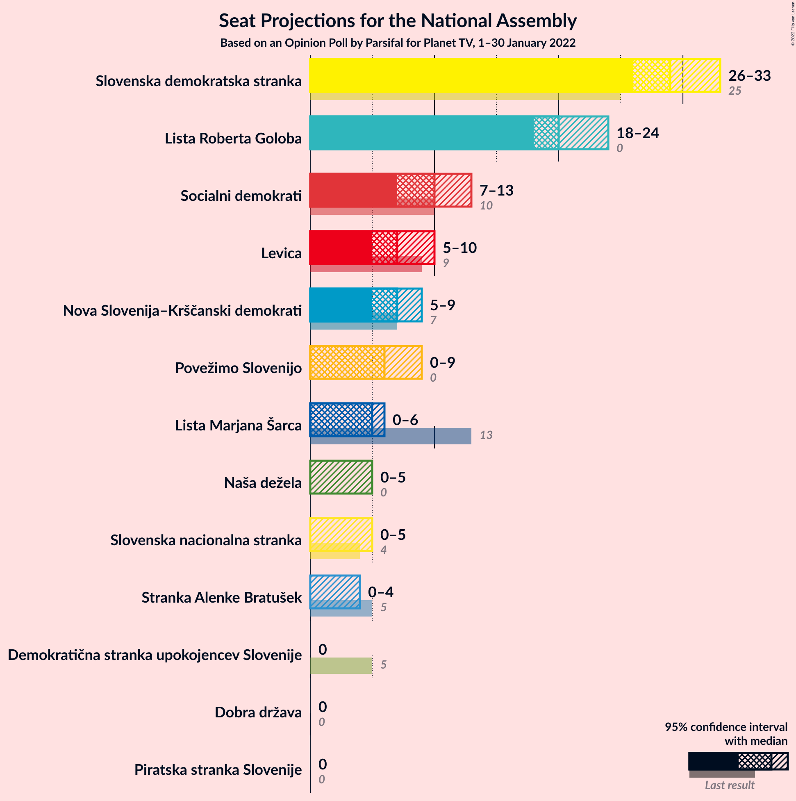

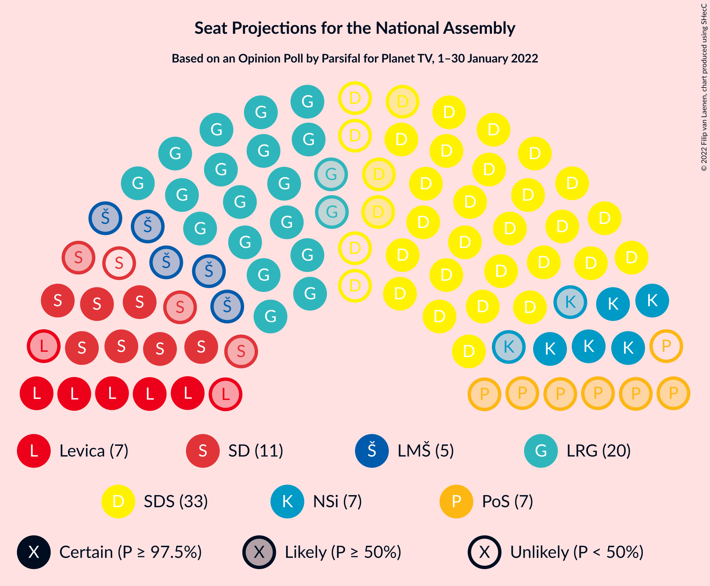

### Confidence Intervals

| Party | Last Result | Median | 80% Confidence Interval | 90% Confidence Interval | 95% Confidence Interval | 99% Confidence Interval |
|:-----:|:-----------:|:------:|:-----------------------:|:-----------------------:|:-----------------------:|:-----------------------:|
| <a href="#slovenska-demokratska-stranka">Slovenska demokratska stranka</a> | 25 | 29 | 27–33 |26–33 |26–33 |25–36 |
| <a href="#lista-roberta-goloba">Lista Roberta Goloba</a> | 0 | 20 | 19–23 |18–24 |18–24 |18–25 |
| <a href="#socialni-demokrati">Socialni demokrati</a> | 10 | 10 | 9–12 |8–12 |7–13 |7–13 |
| <a href="#levica">Levica</a> | 9 | 7 | 6–9 |5–9 |5–10 |5–10 |
| <a href="#nova-slovenija–krščanski-demokrati">Nova Slovenija–Krščanski demokrati</a> | 7 | 7 | 5–8 |5–8 |5–9 |4–10 |
| <a href="#povežimo-slovenijo">Povežimo Slovenijo</a> | 0 | 6 | 5–7 |4–9 |0–9 |0–9 |
| <a href="#lista-marjana-šarca">Lista Marjana Šarca</a> | 13 | 5 | 0–6 |0–6 |0–6 |0–7 |
| <a href="#slovenska-nacionalna-stranka">Slovenska nacionalna stranka</a> | 4 | 0 | 0–4 |0–5 |0–5 |0–5 |
| <a href="#naša-dežela">Naša dežela</a> | 0 | 0 | 0–4 |0–5 |0–5 |0–5 |
| <a href="#stranka-alenke-bratušek">Stranka Alenke Bratušek</a> | 5 | 0 | 0–4 |0–4 |0–4 |0–5 |
| <a href="#demokratična-stranka-upokojencev-slovenije">Demokratična stranka upokojencev Slovenije</a> | 5 | 0 | 0 |0 |0 |0 |
| <a href="#piratska-stranka-slovenije">Piratska stranka Slovenije</a> | 0 | 0 | 0 |0 |0 |0 |
| <a href="#dobra-država">Dobra država</a> | 0 | 0 | 0 |0 |0 |0 |

### Slovenska demokratska stranka

*For a full overview of the results for this party, see the [Slovenska demokratska stranka](party-slovenskademokratskastranka.html) page.*

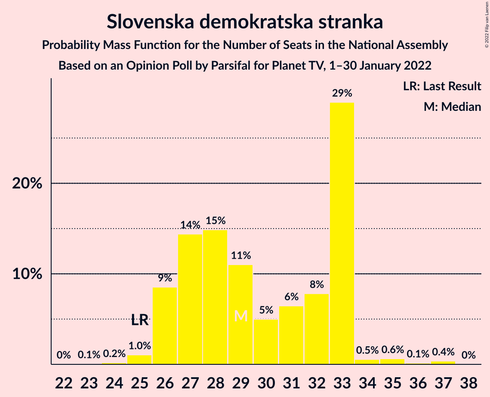

| Number of Seats | Probability | Accumulated | Special Marks |
|:---------------:|:-----------:|:-----------:|:-------------:|
| 23 | 0.1% | 100% |  |
| 24 | 0.2% | 99.9% |  |
| 25 | 1.0% | 99.7% | Last Result |
| 26 | 9% | 98.7% |  |
| 27 | 14% | 90% |  |
| 28 | 15% | 76% |  |
| 29 | 11% | 61% | Median |
| 30 | 5% | 50% |  |
| 31 | 6% | 45% |  |
| 32 | 8% | 38% |  |
| 33 | 29% | 31% |  |
| 34 | 0.5% | 2% |  |
| 35 | 0.6% | 1.1% |  |
| 36 | 0.1% | 0.5% |  |
| 37 | 0.4% | 0.4% |  |
| 38 | 0% | 0% |  |

### Lista Roberta Goloba

*For a full overview of the results for this party, see the [Lista Roberta Goloba](party-listarobertagoloba.html) page.*

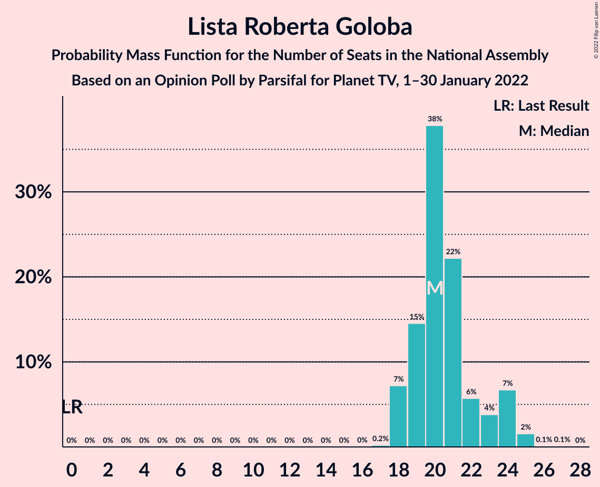

| Number of Seats | Probability | Accumulated | Special Marks |
|:---------------:|:-----------:|:-----------:|:-------------:|
| 0 | 0% | 100% | Last Result |
| 1 | 0% | 100% |  |
| 2 | 0% | 100% |  |
| 3 | 0% | 100% |  |
| 4 | 0% | 100% |  |
| 5 | 0% | 100% |  |
| 6 | 0% | 100% |  |
| 7 | 0% | 100% |  |
| 8 | 0% | 100% |  |
| 9 | 0% | 100% |  |
| 10 | 0% | 100% |  |
| 11 | 0% | 100% |  |
| 12 | 0% | 100% |  |
| 13 | 0% | 100% |  |
| 14 | 0% | 100% |  |
| 15 | 0% | 100% |  |
| 16 | 0% | 100% |  |
| 17 | 0.2% | 100% |  |
| 18 | 7% | 99.8% |  |
| 19 | 15% | 93% |  |
| 20 | 38% | 78% | Median |
| 21 | 22% | 40% |  |
| 22 | 6% | 18% |  |
| 23 | 4% | 12% |  |
| 24 | 7% | 8% |  |
| 25 | 2% | 2% |  |
| 26 | 0.1% | 0.2% |  |
| 27 | 0.1% | 0.1% |  |
| 28 | 0% | 0% |  |

### Socialni demokrati

*For a full overview of the results for this party, see the [Socialni demokrati](party-socialnidemokrati.html) page.*

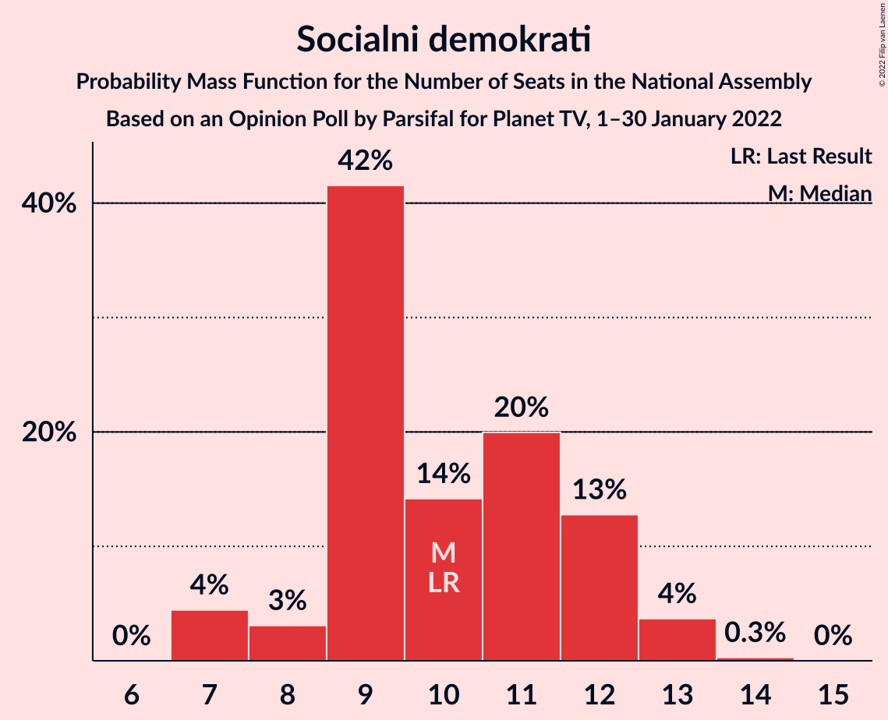

| Number of Seats | Probability | Accumulated | Special Marks |
|:---------------:|:-----------:|:-----------:|:-------------:|
| 7 | 4% | 100% |  |
| 8 | 3% | 96% |  |
| 9 | 42% | 92% |  |
| 10 | 14% | 51% | Last Result, Median |
| 11 | 20% | 37% |  |
| 12 | 13% | 17% |  |
| 13 | 4% | 4% |  |
| 14 | 0.3% | 0.3% |  |
| 15 | 0% | 0% |  |

### Levica

*For a full overview of the results for this party, see the [Levica](party-levica.html) page.*

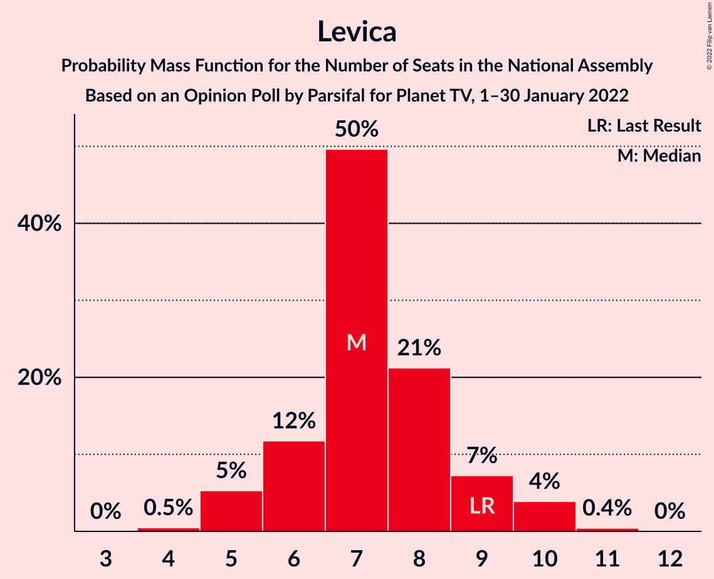

| Number of Seats | Probability | Accumulated | Special Marks |
|:---------------:|:-----------:|:-----------:|:-------------:|
| 4 | 0.5% | 100% |  |
| 5 | 5% | 99.5% |  |
| 6 | 12% | 94% |  |
| 7 | 50% | 82% | Median |
| 8 | 21% | 33% |  |
| 9 | 7% | 12% | Last Result |
| 10 | 4% | 4% |  |
| 11 | 0.4% | 0.4% |  |
| 12 | 0% | 0% |  |

### Nova Slovenija–Krščanski demokrati

*For a full overview of the results for this party, see the [Nova Slovenija–Krščanski demokrati](party-novaslovenija–krščanskidemokrati.html) page.*

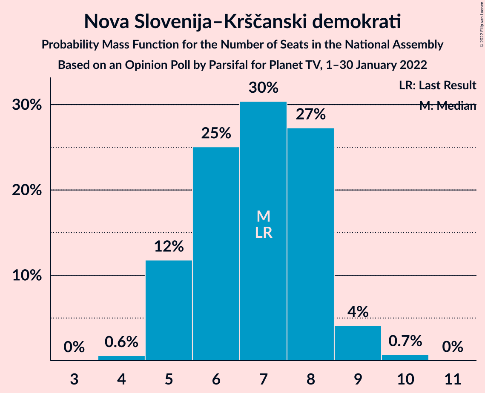

| Number of Seats | Probability | Accumulated | Special Marks |
|:---------------:|:-----------:|:-----------:|:-------------:|
| 4 | 0.6% | 100% |  |
| 5 | 12% | 99.4% |  |
| 6 | 25% | 88% |  |
| 7 | 30% | 63% | Last Result, Median |
| 8 | 27% | 32% |  |
| 9 | 4% | 5% |  |
| 10 | 0.7% | 0.7% |  |
| 11 | 0% | 0% |  |

### Povežimo Slovenijo

*For a full overview of the results for this party, see the [Povežimo Slovenijo](party-povežimoslovenijo.html) page.*

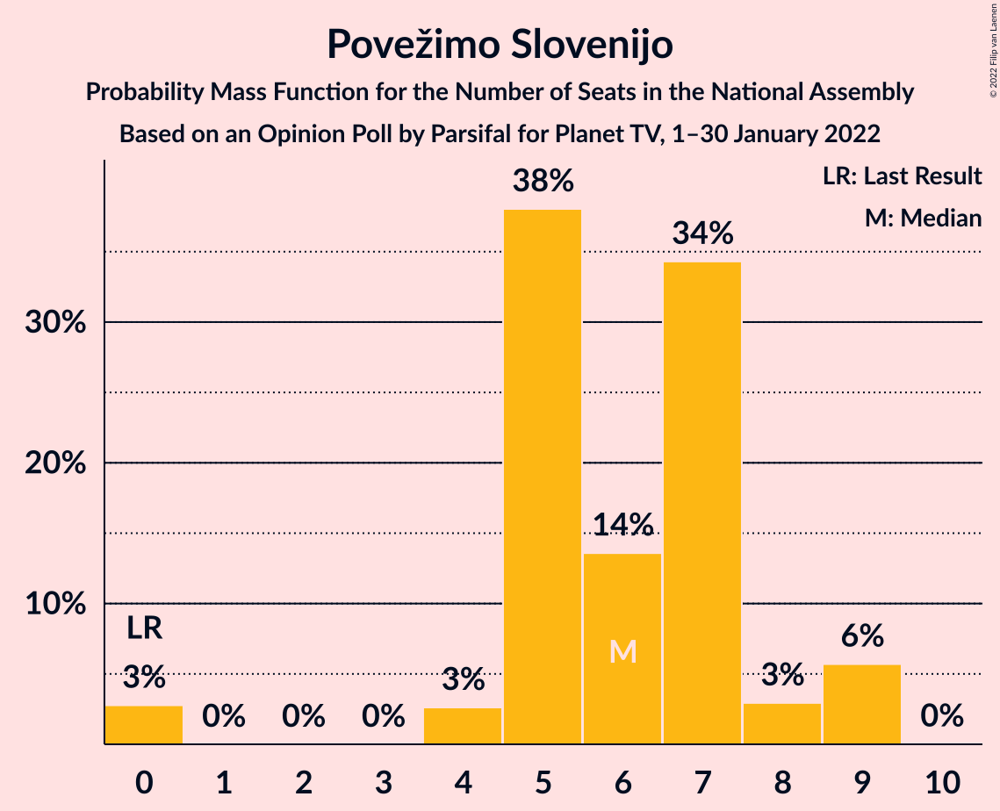

| Number of Seats | Probability | Accumulated | Special Marks |
|:---------------:|:-----------:|:-----------:|:-------------:|
| 0 | 3% | 100% | Last Result |
| 1 | 0% | 97% |  |
| 2 | 0% | 97% |  |
| 3 | 0% | 97% |  |
| 4 | 3% | 97% |  |
| 5 | 38% | 95% |  |
| 6 | 14% | 57% | Median |
| 7 | 34% | 43% |  |
| 8 | 3% | 9% |  |
| 9 | 6% | 6% |  |
| 10 | 0% | 0% |  |

### Lista Marjana Šarca

*For a full overview of the results for this party, see the [Lista Marjana Šarca](party-listamarjanašarca.html) page.*

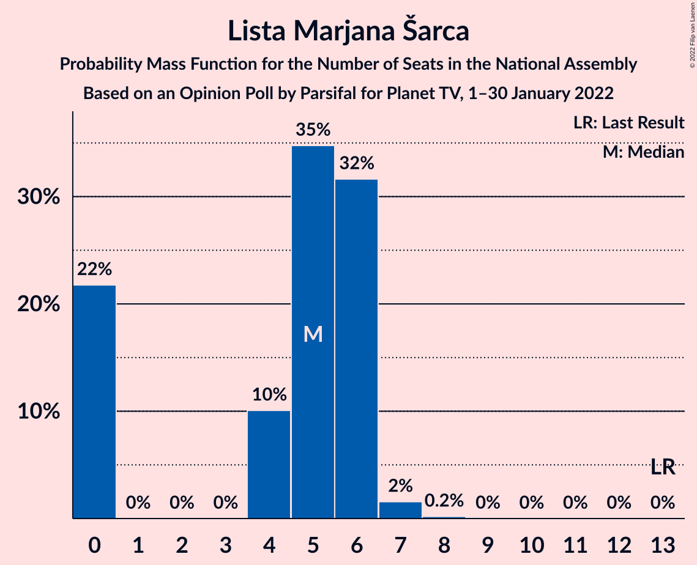

| Number of Seats | Probability | Accumulated | Special Marks |
|:---------------:|:-----------:|:-----------:|:-------------:|
| 0 | 22% | 100% |  |
| 1 | 0% | 78% |  |
| 2 | 0% | 78% |  |
| 3 | 0% | 78% |  |
| 4 | 10% | 78% |  |
| 5 | 35% | 68% | Median |
| 6 | 32% | 33% |  |
| 7 | 2% | 2% |  |
| 8 | 0.2% | 0.2% |  |
| 9 | 0% | 0% |  |
| 10 | 0% | 0% |  |
| 11 | 0% | 0% |  |
| 12 | 0% | 0% |  |
| 13 | 0% | 0% | Last Result |

### Slovenska nacionalna stranka

*For a full overview of the results for this party, see the [Slovenska nacionalna stranka](party-slovenskanacionalnastranka.html) page.*

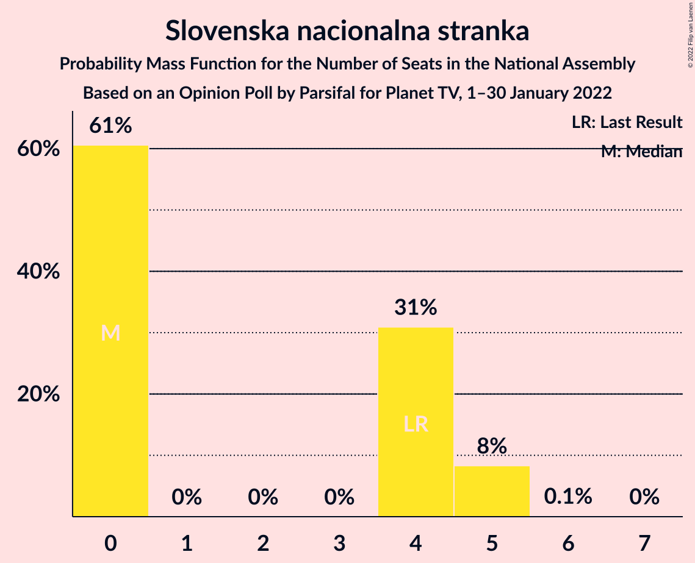

| Number of Seats | Probability | Accumulated | Special Marks |
|:---------------:|:-----------:|:-----------:|:-------------:|
| 0 | 61% | 100% | Median |
| 1 | 0% | 39% |  |
| 2 | 0% | 39% |  |
| 3 | 0% | 39% |  |
| 4 | 31% | 39% | Last Result |
| 5 | 8% | 8% |  |
| 6 | 0.1% | 0.2% |  |
| 7 | 0% | 0% |  |

### Naša dežela

*For a full overview of the results for this party, see the [Naša dežela](party-našadežela.html) page.*

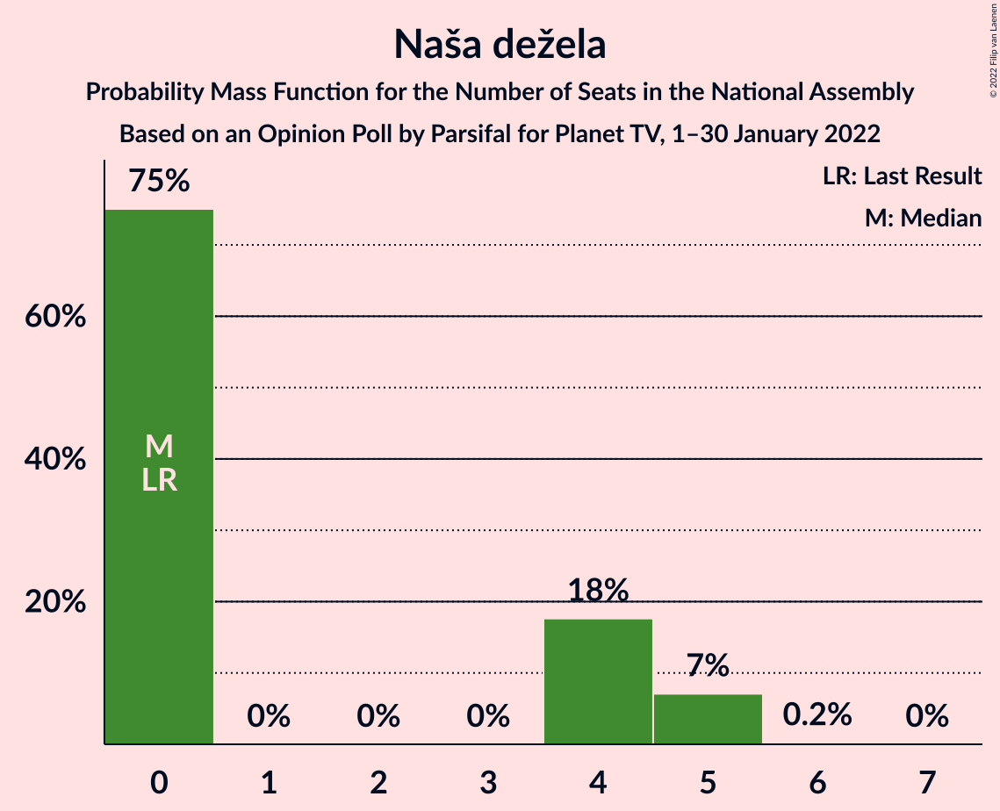

| Number of Seats | Probability | Accumulated | Special Marks |
|:---------------:|:-----------:|:-----------:|:-------------:|
| 0 | 75% | 100% | Last Result, Median |
| 1 | 0% | 25% |  |
| 2 | 0% | 25% |  |
| 3 | 0% | 25% |  |
| 4 | 18% | 25% |  |
| 5 | 7% | 7% |  |
| 6 | 0.2% | 0.2% |  |
| 7 | 0% | 0% |  |

### Stranka Alenke Bratušek

*For a full overview of the results for this party, see the [Stranka Alenke Bratušek](party-strankaalenkebratušek.html) page.*

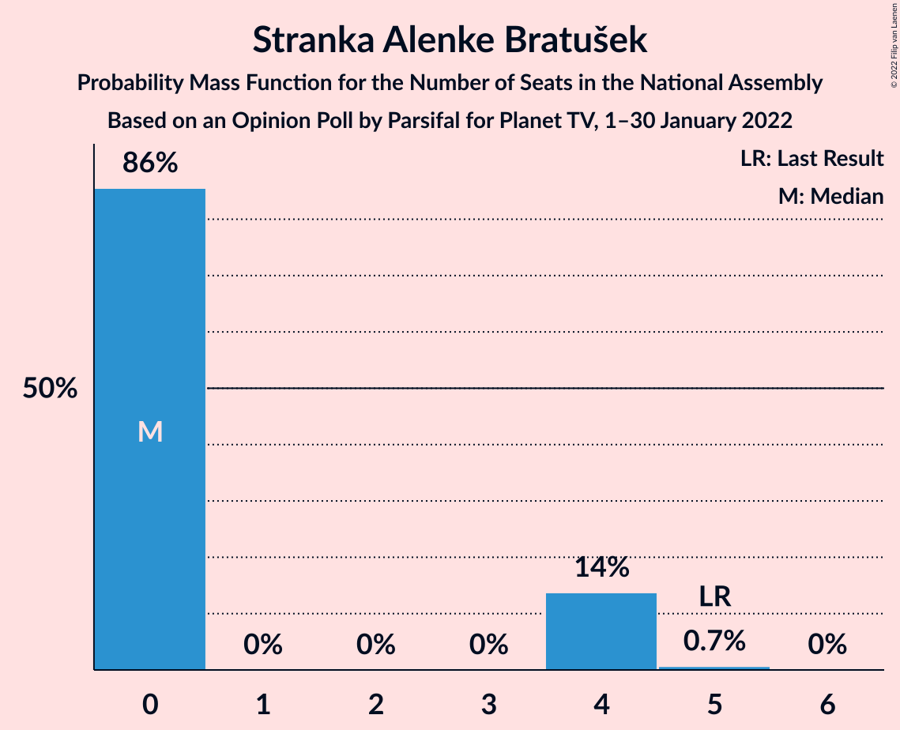

| Number of Seats | Probability | Accumulated | Special Marks |
|:---------------:|:-----------:|:-----------:|:-------------:|
| 0 | 86% | 100% | Median |
| 1 | 0% | 14% |  |
| 2 | 0% | 14% |  |
| 3 | 0% | 14% |  |
| 4 | 14% | 14% |  |
| 5 | 0.7% | 0.7% | Last Result |
| 6 | 0% | 0% |  |

### Demokratična stranka upokojencev Slovenije

*For a full overview of the results for this party, see the [Demokratična stranka upokojencev Slovenije](party-demokratičnastrankaupokojencevslovenije.html) page.*

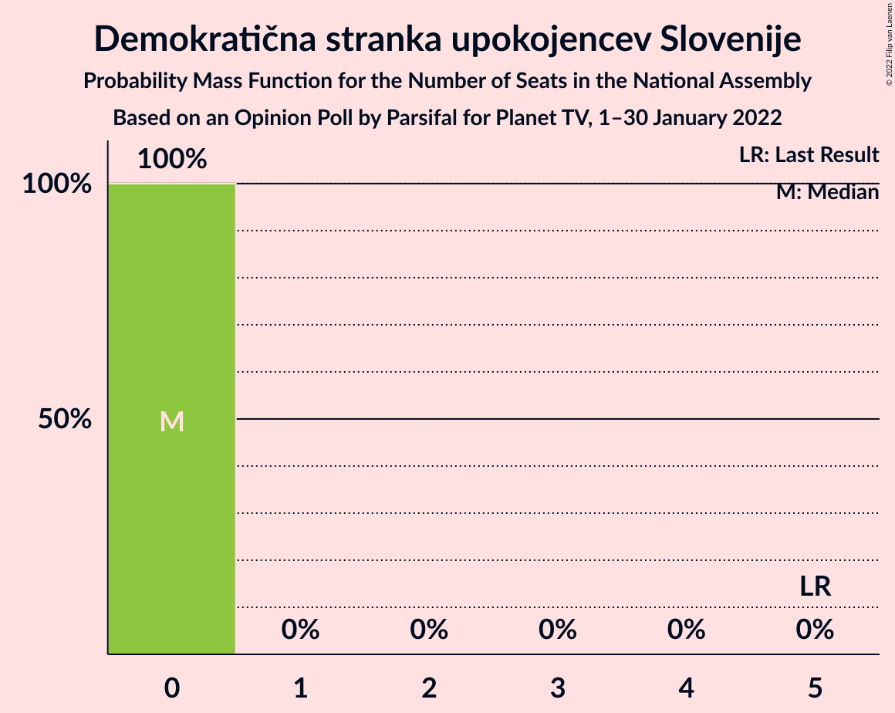

| Number of Seats | Probability | Accumulated | Special Marks |
|:---------------:|:-----------:|:-----------:|:-------------:|
| 0 | 100% | 100% | Median |
| 1 | 0% | 0% |  |
| 2 | 0% | 0% |  |
| 3 | 0% | 0% |  |
| 4 | 0% | 0% |  |
| 5 | 0% | 0% | Last Result |

### Piratska stranka Slovenije

*For a full overview of the results for this party, see the [Piratska stranka Slovenije](party-piratskastrankaslovenije.html) page.*

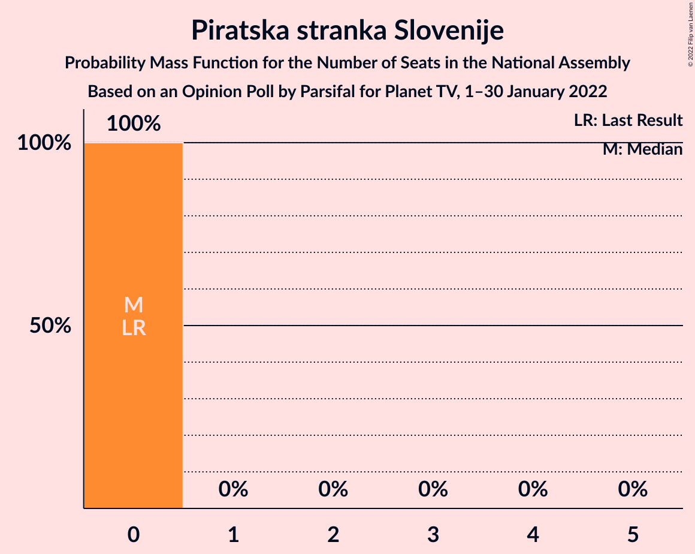

| Number of Seats | Probability | Accumulated | Special Marks |
|:---------------:|:-----------:|:-----------:|:-------------:|
| 0 | 100% | 100% | Last Result, Median |

### Dobra država

*For a full overview of the results for this party, see the [Dobra država](party-dobradržava.html) page.*

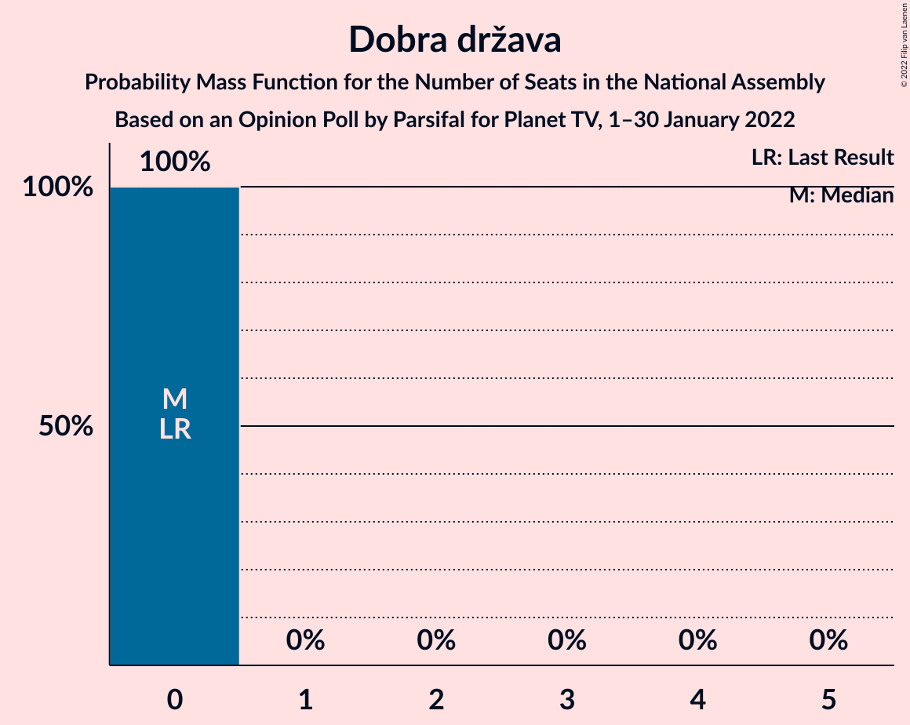

| Number of Seats | Probability | Accumulated | Special Marks |
|:---------------:|:-----------:|:-----------:|:-------------:|
| 0 | 100% | 100% | Last Result, Median |

## Coalitions

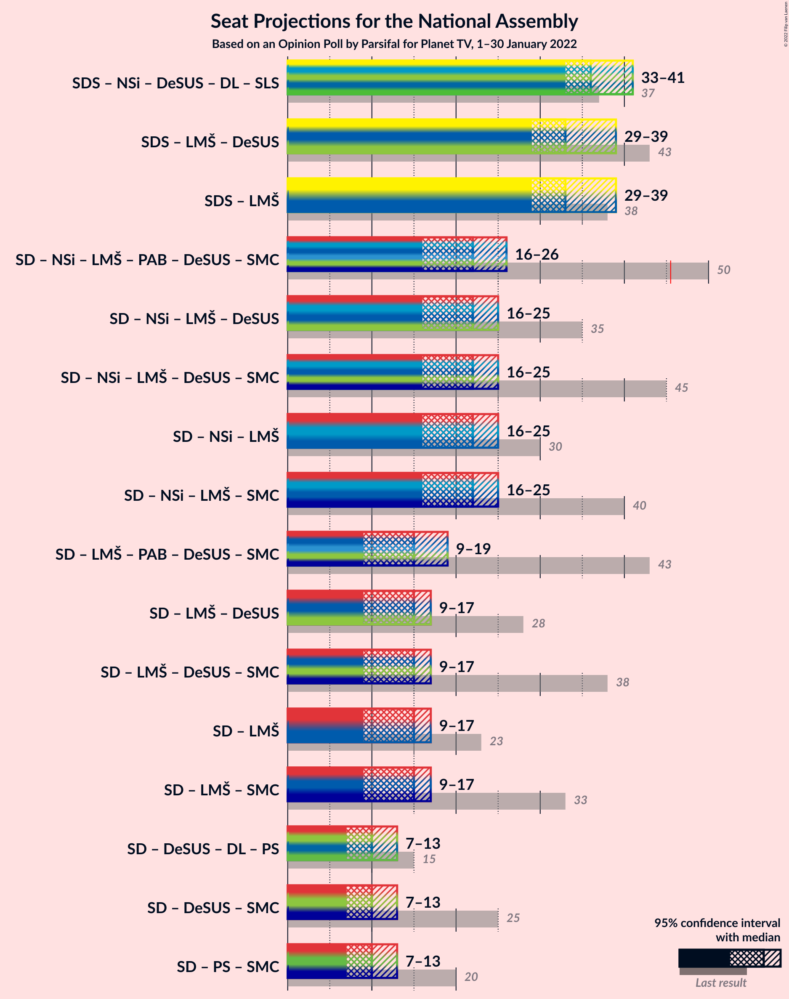

### Confidence Intervals

| Coalition | Last Result | Median | Majority? | 80% Confidence Interval | 90% Confidence Interval | 95% Confidence Interval | 99% Confidence Interval |
|:---------:|:-----------:|:------:|:---------:|:-----------------------:|:-----------------------:|:-----------------------:|:-----------------------:|
| Slovenska demokratska stranka – Lista Marjana Šarca – Demokratična stranka upokojencev Slovenije | 43 | 33 | 0% | 31–39 | 29–39 | 29–39 | 28–39 |
| Slovenska demokratska stranka – Lista Marjana Šarca | 38 | 33 | 0% | 31–39 | 29–39 | 29–39 | 28–39 |
| Socialni demokrati – Nova Slovenija–Krščanski demokrati – Lista Marjana Šarca – Demokratična stranka upokojencev Slovenije | 35 | 22 | 0% | 16–23 | 16–24 | 16–25 | 16–26 |
| Socialni demokrati – Nova Slovenija–Krščanski demokrati – Lista Marjana Šarca | 30 | 22 | 0% | 16–23 | 16–24 | 16–25 | 16–26 |
| Socialni demokrati – Lista Marjana Šarca – Demokratična stranka upokojencev Slovenije | 28 | 15 | 0% | 10–16 | 9–17 | 9–17 | 9–18 |
| Socialni demokrati – Lista Marjana Šarca | 23 | 15 | 0% | 10–16 | 9–17 | 9–17 | 9–18 |

### Slovenska demokratska stranka – Lista Marjana Šarca – Demokratična stranka upokojencev Slovenije

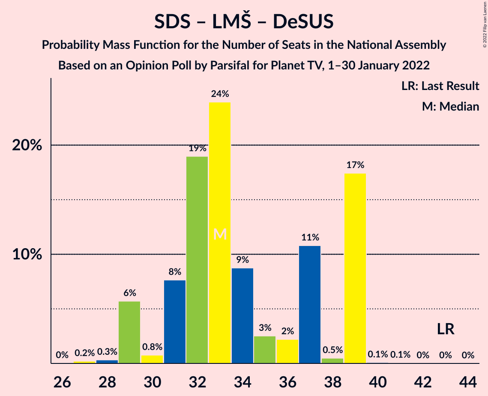

| Number of Seats | Probability | Accumulated | Special Marks |
|:---------------:|:-----------:|:-----------:|:-------------:|
| 27 | 0.2% | 100% |  |
| 28 | 0.3% | 99.7% |  |
| 29 | 6% | 99.4% |  |
| 30 | 0.8% | 94% |  |
| 31 | 8% | 93% |  |
| 32 | 19% | 85% |  |
| 33 | 24% | 66% |  |
| 34 | 9% | 42% | Median |
| 35 | 3% | 34% |  |
| 36 | 2% | 31% |  |
| 37 | 11% | 29% |  |
| 38 | 0.5% | 18% |  |
| 39 | 17% | 18% |  |
| 40 | 0.1% | 0.2% |  |
| 41 | 0.1% | 0.1% |  |
| 42 | 0% | 0% |  |
| 43 | 0% | 0% | Last Result |

### Slovenska demokratska stranka – Lista Marjana Šarca

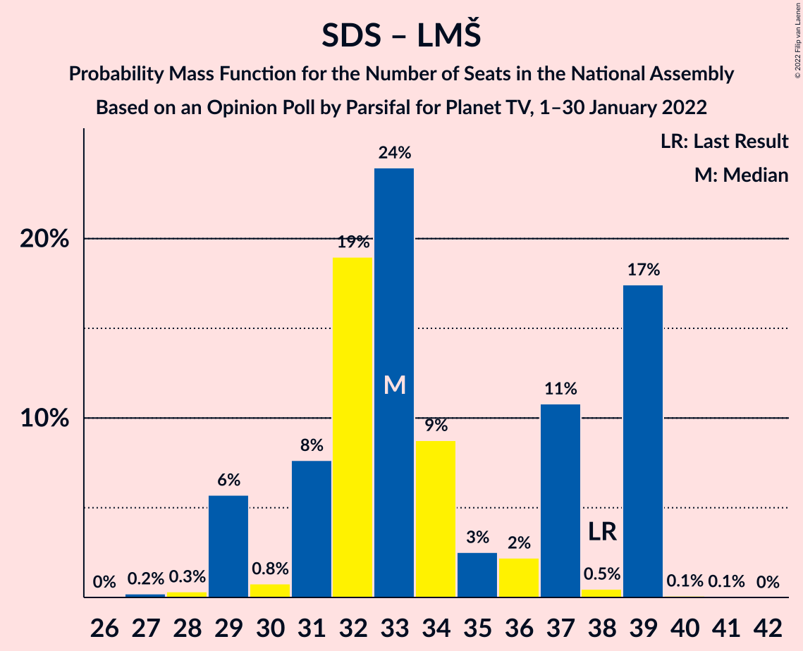

| Number of Seats | Probability | Accumulated | Special Marks |
|:---------------:|:-----------:|:-----------:|:-------------:|
| 27 | 0.2% | 100% |  |
| 28 | 0.3% | 99.7% |  |
| 29 | 6% | 99.4% |  |
| 30 | 0.8% | 94% |  |
| 31 | 8% | 93% |  |
| 32 | 19% | 85% |  |
| 33 | 24% | 66% |  |
| 34 | 9% | 42% | Median |
| 35 | 3% | 34% |  |
| 36 | 2% | 31% |  |
| 37 | 11% | 29% |  |
| 38 | 0.5% | 18% | Last Result |
| 39 | 17% | 18% |  |
| 40 | 0.1% | 0.2% |  |
| 41 | 0.1% | 0.1% |  |
| 42 | 0% | 0% |  |

### Socialni demokrati – Nova Slovenija–Krščanski demokrati – Lista Marjana Šarca – Demokratična stranka upokojencev Slovenije

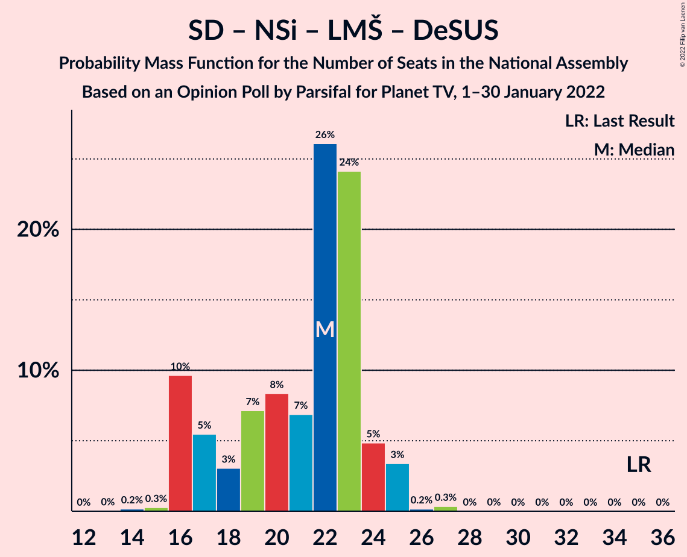

| Number of Seats | Probability | Accumulated | Special Marks |
|:---------------:|:-----------:|:-----------:|:-------------:|
| 14 | 0.2% | 100% |  |
| 15 | 0.3% | 99.8% |  |
| 16 | 10% | 99.5% |  |
| 17 | 5% | 90% |  |
| 18 | 3% | 84% |  |
| 19 | 7% | 81% |  |
| 20 | 8% | 74% |  |
| 21 | 7% | 66% |  |
| 22 | 26% | 59% | Median |
| 23 | 24% | 33% |  |
| 24 | 5% | 9% |  |
| 25 | 3% | 4% |  |
| 26 | 0.2% | 0.5% |  |
| 27 | 0.3% | 0.4% |  |
| 28 | 0% | 0% |  |
| 29 | 0% | 0% |  |
| 30 | 0% | 0% |  |
| 31 | 0% | 0% |  |
| 32 | 0% | 0% |  |
| 33 | 0% | 0% |  |
| 34 | 0% | 0% |  |
| 35 | 0% | 0% | Last Result |

### Socialni demokrati – Nova Slovenija–Krščanski demokrati – Lista Marjana Šarca

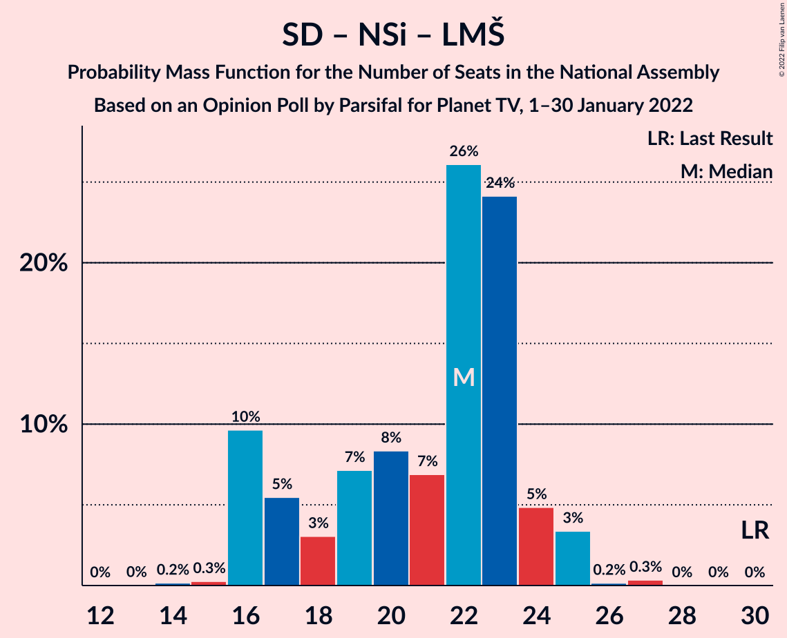

| Number of Seats | Probability | Accumulated | Special Marks |
|:---------------:|:-----------:|:-----------:|:-------------:|
| 14 | 0.2% | 100% |  |
| 15 | 0.3% | 99.8% |  |
| 16 | 10% | 99.5% |  |
| 17 | 5% | 90% |  |
| 18 | 3% | 84% |  |
| 19 | 7% | 81% |  |
| 20 | 8% | 74% |  |
| 21 | 7% | 66% |  |
| 22 | 26% | 59% | Median |
| 23 | 24% | 33% |  |
| 24 | 5% | 9% |  |
| 25 | 3% | 4% |  |
| 26 | 0.2% | 0.5% |  |
| 27 | 0.3% | 0.4% |  |
| 28 | 0% | 0% |  |
| 29 | 0% | 0% |  |
| 30 | 0% | 0% | Last Result |

### Socialni demokrati – Lista Marjana Šarca – Demokratična stranka upokojencev Slovenije

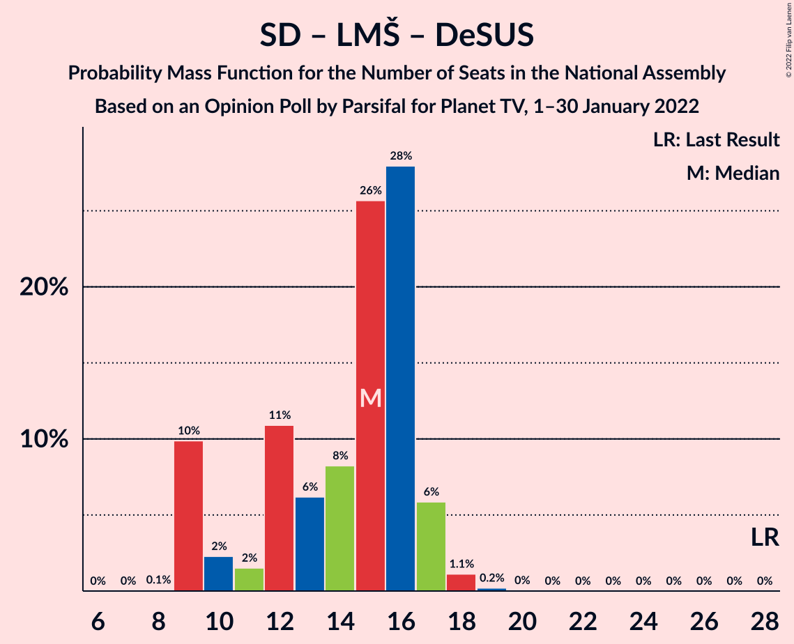

| Number of Seats | Probability | Accumulated | Special Marks |
|:---------------:|:-----------:|:-----------:|:-------------:|
| 8 | 0.1% | 100% |  |
| 9 | 10% | 99.9% |  |
| 10 | 2% | 90% |  |
| 11 | 2% | 88% |  |
| 12 | 11% | 86% |  |
| 13 | 6% | 75% |  |
| 14 | 8% | 69% |  |
| 15 | 26% | 61% | Median |
| 16 | 28% | 35% |  |
| 17 | 6% | 7% |  |
| 18 | 1.1% | 1.4% |  |
| 19 | 0.2% | 0.3% |  |
| 20 | 0% | 0.1% |  |
| 21 | 0% | 0% |  |
| 22 | 0% | 0% |  |
| 23 | 0% | 0% |  |
| 24 | 0% | 0% |  |
| 25 | 0% | 0% |  |
| 26 | 0% | 0% |  |
| 27 | 0% | 0% |  |
| 28 | 0% | 0% | Last Result |

### Socialni demokrati – Lista Marjana Šarca

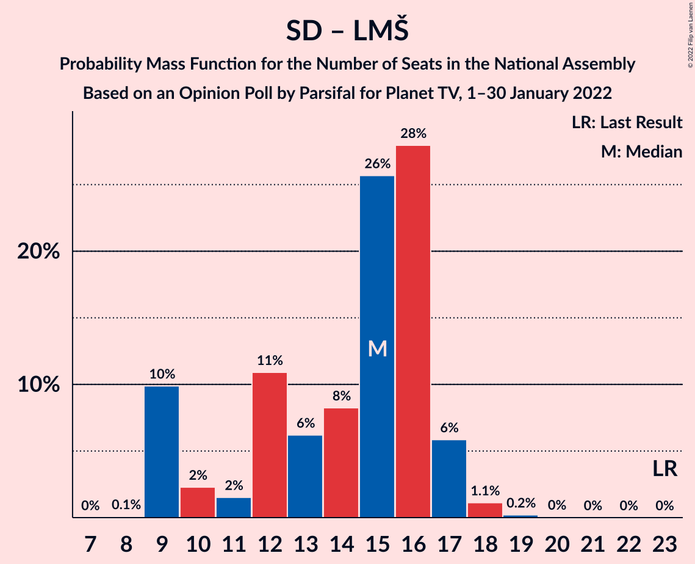

| Number of Seats | Probability | Accumulated | Special Marks |
|:---------------:|:-----------:|:-----------:|:-------------:|
| 8 | 0.1% | 100% |  |
| 9 | 10% | 99.9% |  |
| 10 | 2% | 90% |  |
| 11 | 2% | 88% |  |
| 12 | 11% | 86% |  |
| 13 | 6% | 75% |  |
| 14 | 8% | 69% |  |
| 15 | 26% | 61% | Median |
| 16 | 28% | 35% |  |
| 17 | 6% | 7% |  |
| 18 | 1.1% | 1.4% |  |
| 19 | 0.2% | 0.3% |  |
| 20 | 0% | 0% |  |
| 21 | 0% | 0% |  |
| 22 | 0% | 0% |  |
| 23 | 0% | 0% | Last Result |

## Technical Information

### Opinion Poll

+ **Polling firm:** Parsifal
+ **Commissioner(s):** Planet TV
+ **Fieldwork period:** 1–30 January 2022

### Calculations

+ **Sample size:** 720
+ **Simulations done:** 1,048,576
+ **Error estimate:** 2.45%

