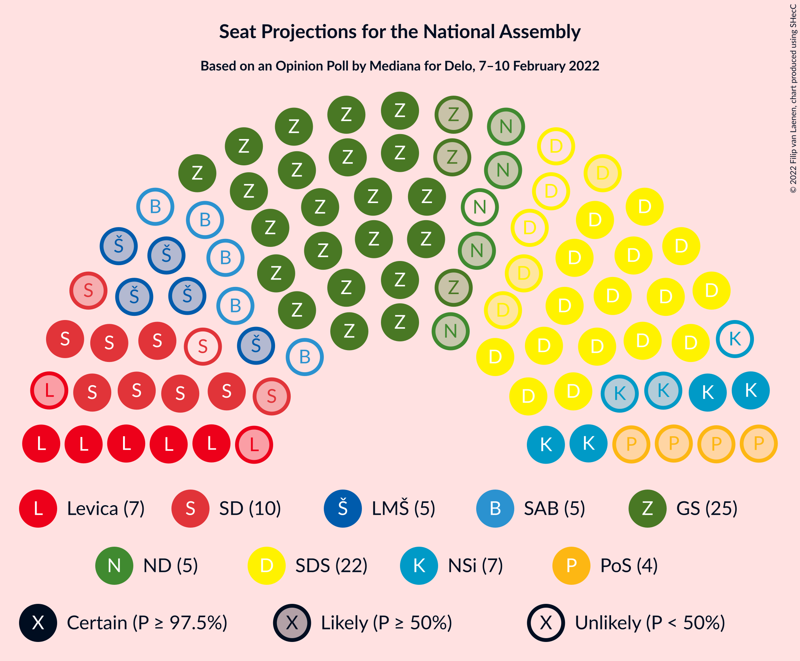

# Opinion Poll by Mediana for Delo, 7–10 February 2022

<a href="#voting-intentions">Voting Intentions</a> | <a href="#seats">Seats</a> | <a href="#coalitions">Coalitions</a> | <a href="#technical-information">Technical Information</a>

## Voting Intentions

### Confidence Intervals

| Party | Last Result | Poll Result | 80% Confidence Interval | 90% Confidence Interval | 95% Confidence Interval | 99% Confidence Interval |
|:-----:|:-----------:|:-----------:|:-----------------------:|:-----------------------:|:-----------------------:|:-----------------------:|
| Lista Roberta Goloba | 0.0% | 25.6% | 23.6–27.8% |23.0–28.4% |22.6–29.0% |21.6–30.0% |
| Slovenska demokratska stranka | 24.9% | 19.2% | 17.4–21.2% |16.9–21.7% |16.4–22.2% |15.6–23.2% |
| Socialni demokrati | 9.9% | 9.3% | 8.0–10.8% |7.7–11.3% |7.4–11.7% |6.8–12.4% |
| Levica | 9.3% | 7.0% | 5.9–8.4% |5.6–8.8% |5.4–9.2% |4.9–9.9% |
| Nova Slovenija–Krščanski demokrati | 7.2% | 6.8% | 5.7–8.1% |5.4–8.5% |5.1–8.9% |4.7–9.6% |
| Lista Marjana Šarca | 12.6% | 4.8% | 3.9–6.0% |3.7–6.3% |3.4–6.6% |3.1–7.2% |
| Povežimo Slovenijo | 0.0% | 4.8% | 3.9–6.0% |3.7–6.3% |3.4–6.6% |3.1–7.2% |
| Naša dežela | 0.0% | 4.5% | 3.6–5.7% |3.4–6.0% |3.2–6.3% |2.8–6.9% |
| Stranka Alenke Bratušek | 5.1% | 3.5% | 2.8–4.6% |2.6–4.9% |2.4–5.2% |2.1–5.7% |
| Piratska stranka Slovenije | 2.2% | 3.1% | 2.4–4.1% |2.2–4.4% |2.1–4.6% |1.8–5.2% |
| Slovenska nacionalna stranka | 4.2% | 2.4% | 1.8–3.3% |1.6–3.6% |1.5–3.8% |1.3–4.3% |
| Demokratična stranka upokojencev Slovenije | 4.9% | 1.3% | 0.9–2.0% |0.8–2.2% |0.7–2.4% |0.5–2.8% |
| Dobra država | 1.5% | 1.3% | 0.9–2.0% |0.8–2.2% |0.7–2.4% |0.5–2.8% |

*Note:* The poll result column reflects the actual value used in the calculations. Published results may vary slightly, and in addition be rounded to fewer digits.

## Seats

### Confidence Intervals

| Party | Last Result | Median | 80% Confidence Interval | 90% Confidence Interval | 95% Confidence Interval | 99% Confidence Interval |
|:-----:|:-----------:|:------:|:-----------------------:|:-----------------------:|:-----------------------:|:-----------------------:|
| <a href="#lista-roberta-goloba">Lista Roberta Goloba</a> | 0 | 25 | 23–30 |23–31 |22–31 |21–32 |
| <a href="#slovenska-demokratska-stranka">Slovenska demokratska stranka</a> | 25 | 19 | 16–23 |16–23 |16–24 |15–24 |
| <a href="#socialni-demokrati">Socialni demokrati</a> | 10 | 9 | 7–11 |7–12 |7–12 |6–13 |
| <a href="#levica">Levica</a> | 9 | 7 | 5–8 |5–9 |5–9 |5–10 |
| <a href="#nova-slovenija–krščanski-demokrati">Nova Slovenija–Krščanski demokrati</a> | 7 | 6 | 5–9 |5–9 |4–10 |4–10 |
| <a href="#lista-marjana-šarca">Lista Marjana Šarca</a> | 13 | 5 | 0–6 |0–6 |0–7 |0–7 |
| <a href="#povežimo-slovenijo">Povežimo Slovenijo</a> | 0 | 4 | 0–6 |0–6 |0–6 |0–7 |
| <a href="#naša-dežela">Naša dežela</a> | 0 | 4 | 0–6 |0–6 |0–6 |0–7 |
| <a href="#stranka-alenke-bratušek">Stranka Alenke Bratušek</a> | 5 | 0 | 0–5 |0–5 |0–5 |0–5 |
| <a href="#piratska-stranka-slovenije">Piratska stranka Slovenije</a> | 0 | 0 | 0–4 |0–4 |0–5 |0–5 |
| <a href="#slovenska-nacionalna-stranka">Slovenska nacionalna stranka</a> | 4 | 0 | 0 |0 |0 |0–4 |
| <a href="#demokratična-stranka-upokojencev-slovenije">Demokratična stranka upokojencev Slovenije</a> | 5 | 0 | 0 |0 |0 |0 |
| <a href="#dobra-država">Dobra država</a> | 0 | 0 | 0 |0 |0 |0 |

### Lista Roberta Goloba

*For a full overview of the results for this party, see the [Lista Roberta Goloba](party-listarobertagoloba.html) page.*

| Number of Seats | Probability | Accumulated | Special Marks |
|:---------------:|:-----------:|:-----------:|:-------------:|
| 0 | 0% | 100% | Last Result |
| 1 | 0% | 100% |  |
| 2 | 0% | 100% |  |
| 3 | 0% | 100% |  |
| 4 | 0% | 100% |  |
| 5 | 0% | 100% |  |
| 6 | 0% | 100% |  |
| 7 | 0% | 100% |  |
| 8 | 0% | 100% |  |
| 9 | 0% | 100% |  |
| 10 | 0% | 100% |  |
| 11 | 0% | 100% |  |
| 12 | 0% | 100% |  |
| 13 | 0% | 100% |  |
| 14 | 0% | 100% |  |
| 15 | 0% | 100% |  |
| 16 | 0% | 100% |  |
| 17 | 0% | 100% |  |
| 18 | 0% | 100% |  |
| 19 | 0% | 100% |  |
| 20 | 0.2% | 100% |  |
| 21 | 2% | 99.8% |  |
| 22 | 0.9% | 98% |  |
| 23 | 17% | 97% |  |
| 24 | 3% | 80% |  |
| 25 | 28% | 78% | Median |
| 26 | 14% | 50% |  |
| 27 | 7% | 36% |  |
| 28 | 7% | 29% |  |
| 29 | 12% | 22% |  |
| 30 | 3% | 10% |  |
| 31 | 6% | 7% |  |
| 32 | 0.4% | 0.7% |  |
| 33 | 0.3% | 0.3% |  |
| 34 | 0% | 0% |  |

### Slovenska demokratska stranka

*For a full overview of the results for this party, see the [Slovenska demokratska stranka](party-slovenskademokratskastranka.html) page.*

| Number of Seats | Probability | Accumulated | Special Marks |
|:---------------:|:-----------:|:-----------:|:-------------:|
| 14 | 0.1% | 100% |  |
| 15 | 0.5% | 99.9% |  |
| 16 | 19% | 99.4% |  |
| 17 | 11% | 81% |  |
| 18 | 14% | 70% |  |
| 19 | 9% | 56% | Median |
| 20 | 15% | 47% |  |
| 21 | 9% | 32% |  |
| 22 | 12% | 24% |  |
| 23 | 9% | 11% |  |
| 24 | 2% | 3% |  |
| 25 | 0.2% | 0.3% | Last Result |
| 26 | 0.1% | 0.1% |  |
| 27 | 0% | 0% |  |

### Socialni demokrati

*For a full overview of the results for this party, see the [Socialni demokrati](party-socialnidemokrati.html) page.*

| Number of Seats | Probability | Accumulated | Special Marks |
|:---------------:|:-----------:|:-----------:|:-------------:|
| 6 | 2% | 100% |  |
| 7 | 11% | 98% |  |
| 8 | 15% | 87% |  |
| 9 | 25% | 72% | Median |
| 10 | 34% | 47% | Last Result |
| 11 | 7% | 14% |  |
| 12 | 6% | 7% |  |
| 13 | 0.5% | 0.6% |  |
| 14 | 0.1% | 0.1% |  |
| 15 | 0% | 0% |  |

### Levica

*For a full overview of the results for this party, see the [Levica](party-levica.html) page.*

| Number of Seats | Probability | Accumulated | Special Marks |
|:---------------:|:-----------:|:-----------:|:-------------:|
| 4 | 0.3% | 100% |  |
| 5 | 14% | 99.7% |  |
| 6 | 17% | 86% |  |
| 7 | 46% | 69% | Median |
| 8 | 14% | 23% |  |
| 9 | 8% | 9% | Last Result |
| 10 | 0.9% | 1.1% |  |
| 11 | 0.1% | 0.2% |  |
| 12 | 0% | 0% |  |

### Nova Slovenija–Krščanski demokrati

*For a full overview of the results for this party, see the [Nova Slovenija–Krščanski demokrati](party-novaslovenija–krščanskidemokrati.html) page.*

| Number of Seats | Probability | Accumulated | Special Marks |
|:---------------:|:-----------:|:-----------:|:-------------:|
| 4 | 5% | 100% |  |
| 5 | 31% | 95% |  |
| 6 | 20% | 64% | Median |
| 7 | 19% | 44% | Last Result |
| 8 | 15% | 25% |  |
| 9 | 6% | 11% |  |
| 10 | 4% | 4% |  |
| 11 | 0% | 0% |  |

### Lista Marjana Šarca

*For a full overview of the results for this party, see the [Lista Marjana Šarca](party-listamarjanašarca.html) page.*

| Number of Seats | Probability | Accumulated | Special Marks |
|:---------------:|:-----------:|:-----------:|:-------------:|
| 0 | 14% | 100% |  |
| 1 | 0% | 86% |  |
| 2 | 0% | 86% |  |
| 3 | 0% | 86% |  |
| 4 | 24% | 86% |  |
| 5 | 42% | 62% | Median |
| 6 | 15% | 20% |  |
| 7 | 4% | 4% |  |
| 8 | 0.2% | 0.2% |  |
| 9 | 0% | 0% |  |
| 10 | 0% | 0% |  |
| 11 | 0% | 0% |  |
| 12 | 0% | 0% |  |
| 13 | 0% | 0% | Last Result |

### Povežimo Slovenijo

*For a full overview of the results for this party, see the [Povežimo Slovenijo](party-povežimoslovenijo.html) page.*

| Number of Seats | Probability | Accumulated | Special Marks |
|:---------------:|:-----------:|:-----------:|:-------------:|
| 0 | 16% | 100% | Last Result |
| 1 | 0% | 84% |  |
| 2 | 0% | 84% |  |
| 3 | 0% | 84% |  |
| 4 | 47% | 84% | Median |
| 5 | 21% | 38% |  |
| 6 | 15% | 17% |  |
| 7 | 1.5% | 2% |  |
| 8 | 0.1% | 0.1% |  |
| 9 | 0% | 0% |  |

### Naša dežela

*For a full overview of the results for this party, see the [Naša dežela](party-našadežela.html) page.*

| Number of Seats | Probability | Accumulated | Special Marks |
|:---------------:|:-----------:|:-----------:|:-------------:|
| 0 | 34% | 100% | Last Result |
| 1 | 0% | 66% |  |
| 2 | 0% | 66% |  |
| 3 | 0.4% | 66% |  |
| 4 | 29% | 66% | Median |
| 5 | 25% | 37% |  |
| 6 | 11% | 12% |  |
| 7 | 1.2% | 1.2% |  |
| 8 | 0% | 0% |  |

### Stranka Alenke Bratušek

*For a full overview of the results for this party, see the [Stranka Alenke Bratušek](party-strankaalenkebratušek.html) page.*

| Number of Seats | Probability | Accumulated | Special Marks |
|:---------------:|:-----------:|:-----------:|:-------------:|
| 0 | 59% | 100% | Median |
| 1 | 0% | 41% |  |
| 2 | 0% | 41% |  |
| 3 | 0% | 41% |  |
| 4 | 21% | 41% |  |
| 5 | 20% | 21% | Last Result |
| 6 | 0.3% | 0.3% |  |
| 7 | 0% | 0% |  |

### Piratska stranka Slovenije

*For a full overview of the results for this party, see the [Piratska stranka Slovenije](party-piratskastrankaslovenije.html) page.*

| Number of Seats | Probability | Accumulated | Special Marks |
|:---------------:|:-----------:|:-----------:|:-------------:|
| 0 | 89% | 100% | Last Result, Median |
| 1 | 0% | 11% |  |
| 2 | 0% | 11% |  |
| 3 | 0% | 11% |  |
| 4 | 9% | 11% |  |
| 5 | 3% | 3% |  |
| 6 | 0.1% | 0.1% |  |
| 7 | 0% | 0% |  |

### Slovenska nacionalna stranka

*For a full overview of the results for this party, see the [Slovenska nacionalna stranka](party-slovenskanacionalnastranka.html) page.*

| Number of Seats | Probability | Accumulated | Special Marks |
|:---------------:|:-----------:|:-----------:|:-------------:|
| 0 | 98.7% | 100% | Median |
| 1 | 0% | 1.3% |  |
| 2 | 0% | 1.3% |  |
| 3 | 0% | 1.3% |  |
| 4 | 1.2% | 1.3% | Last Result |
| 5 | 0% | 0% |  |

### Demokratična stranka upokojencev Slovenije

*For a full overview of the results for this party, see the [Demokratična stranka upokojencev Slovenije](party-demokratičnastrankaupokojencevslovenije.html) page.*

| Number of Seats | Probability | Accumulated | Special Marks |
|:---------------:|:-----------:|:-----------:|:-------------:|
| 0 | 100% | 100% | Median |
| 1 | 0% | 0% |  |
| 2 | 0% | 0% |  |
| 3 | 0% | 0% |  |
| 4 | 0% | 0% |  |
| 5 | 0% | 0% | Last Result |

### Dobra država

*For a full overview of the results for this party, see the [Dobra država](party-dobradržava.html) page.*

| Number of Seats | Probability | Accumulated | Special Marks |
|:---------------:|:-----------:|:-----------:|:-------------:|
| 0 | 100% | 100% | Last Result, Median |

## Coalitions

### Confidence Intervals

| Coalition | Last Result | Median | Majority? | 80% Confidence Interval | 90% Confidence Interval | 95% Confidence Interval | 99% Confidence Interval |
|:---------:|:-----------:|:------:|:---------:|:-----------------------:|:-----------------------:|:-----------------------:|:-----------------------:|
| Slovenska demokratska stranka – Lista Marjana Šarca – Demokratična stranka upokojencev Slovenije | 43 | 23 | 0% | 20–28 | 19–28 | 18–28 | 17–29 |
| Slovenska demokratska stranka – Lista Marjana Šarca | 38 | 23 | 0% | 20–28 | 19–28 | 18–28 | 17–29 |
| Socialni demokrati – Nova Slovenija–Krščanski demokrati – Lista Marjana Šarca – Demokratična stranka upokojencev Slovenije | 35 | 20 | 0% | 17–23 | 15–25 | 14–25 | 13–25 |
| Socialni demokrati – Nova Slovenija–Krščanski demokrati – Lista Marjana Šarca | 30 | 20 | 0% | 17–23 | 15–25 | 14–25 | 13–25 |
| Socialni demokrati – Lista Marjana Šarca – Demokratična stranka upokojencev Slovenije | 28 | 14 | 0% | 10–16 | 10–17 | 9–18 | 7–18 |
| Socialni demokrati – Lista Marjana Šarca | 23 | 14 | 0% | 10–16 | 10–17 | 9–18 | 7–18 |

### Slovenska demokratska stranka – Lista Marjana Šarca – Demokratična stranka upokojencev Slovenije

| Number of Seats | Probability | Accumulated | Special Marks |
|:---------------:|:-----------:|:-----------:|:-------------:|
| 15 | 0.1% | 100% |  |
| 16 | 0.2% | 99.9% |  |
| 17 | 0.2% | 99.7% |  |
| 18 | 3% | 99.5% |  |
| 19 | 1.2% | 96% |  |
| 20 | 8% | 95% |  |
| 21 | 19% | 87% |  |
| 22 | 12% | 68% |  |
| 23 | 9% | 56% |  |
| 24 | 9% | 47% | Median |
| 25 | 3% | 37% |  |
| 26 | 13% | 34% |  |
| 27 | 11% | 21% |  |
| 28 | 10% | 11% |  |
| 29 | 0.3% | 0.5% |  |
| 30 | 0.2% | 0.2% |  |
| 31 | 0% | 0.1% |  |
| 32 | 0% | 0% |  |
| 33 | 0% | 0% |  |
| 34 | 0% | 0% |  |
| 35 | 0% | 0% |  |
| 36 | 0% | 0% |  |
| 37 | 0% | 0% |  |
| 38 | 0% | 0% |  |
| 39 | 0% | 0% |  |
| 40 | 0% | 0% |  |
| 41 | 0% | 0% |  |
| 42 | 0% | 0% |  |
| 43 | 0% | 0% | Last Result |

### Slovenska demokratska stranka – Lista Marjana Šarca

| Number of Seats | Probability | Accumulated | Special Marks |
|:---------------:|:-----------:|:-----------:|:-------------:|
| 15 | 0.1% | 100% |  |
| 16 | 0.2% | 99.9% |  |
| 17 | 0.2% | 99.7% |  |
| 18 | 3% | 99.5% |  |
| 19 | 1.2% | 96% |  |
| 20 | 8% | 95% |  |
| 21 | 19% | 87% |  |
| 22 | 12% | 68% |  |
| 23 | 9% | 56% |  |
| 24 | 9% | 47% | Median |
| 25 | 3% | 37% |  |
| 26 | 13% | 34% |  |
| 27 | 11% | 21% |  |
| 28 | 10% | 11% |  |
| 29 | 0.3% | 0.5% |  |
| 30 | 0.2% | 0.2% |  |
| 31 | 0% | 0.1% |  |
| 32 | 0% | 0% |  |
| 33 | 0% | 0% |  |
| 34 | 0% | 0% |  |
| 35 | 0% | 0% |  |
| 36 | 0% | 0% |  |
| 37 | 0% | 0% |  |
| 38 | 0% | 0% | Last Result |

### Socialni demokrati – Nova Slovenija–Krščanski demokrati – Lista Marjana Šarca – Demokratična stranka upokojencev Slovenije

| Number of Seats | Probability | Accumulated | Special Marks |
|:---------------:|:-----------:|:-----------:|:-------------:|
| 12 | 0.1% | 100% |  |
| 13 | 0.5% | 99.9% |  |
| 14 | 3% | 99.5% |  |
| 15 | 3% | 96% |  |
| 16 | 3% | 94% |  |
| 17 | 4% | 91% |  |
| 18 | 10% | 87% |  |
| 19 | 12% | 78% |  |
| 20 | 30% | 66% | Median |
| 21 | 15% | 36% |  |
| 22 | 3% | 21% |  |
| 23 | 11% | 17% |  |
| 24 | 1.3% | 6% |  |
| 25 | 5% | 5% |  |
| 26 | 0.3% | 0.4% |  |
| 27 | 0.1% | 0.1% |  |
| 28 | 0% | 0% |  |
| 29 | 0% | 0% |  |
| 30 | 0% | 0% |  |
| 31 | 0% | 0% |  |
| 32 | 0% | 0% |  |
| 33 | 0% | 0% |  |
| 34 | 0% | 0% |  |
| 35 | 0% | 0% | Last Result |

### Socialni demokrati – Nova Slovenija–Krščanski demokrati – Lista Marjana Šarca

| Number of Seats | Probability | Accumulated | Special Marks |
|:---------------:|:-----------:|:-----------:|:-------------:|
| 12 | 0.1% | 100% |  |
| 13 | 0.5% | 99.9% |  |
| 14 | 3% | 99.5% |  |
| 15 | 3% | 96% |  |
| 16 | 3% | 94% |  |
| 17 | 4% | 91% |  |
| 18 | 10% | 87% |  |
| 19 | 12% | 78% |  |
| 20 | 30% | 66% | Median |
| 21 | 15% | 36% |  |
| 22 | 3% | 21% |  |
| 23 | 11% | 17% |  |
| 24 | 1.3% | 6% |  |
| 25 | 5% | 5% |  |
| 26 | 0.3% | 0.4% |  |
| 27 | 0.1% | 0.1% |  |
| 28 | 0% | 0% |  |
| 29 | 0% | 0% |  |
| 30 | 0% | 0% | Last Result |

### Socialni demokrati – Lista Marjana Šarca – Demokratična stranka upokojencev Slovenije

| Number of Seats | Probability | Accumulated | Special Marks |
|:---------------:|:-----------:|:-----------:|:-------------:|
| 6 | 0.2% | 100% |  |
| 7 | 0.3% | 99.8% |  |
| 8 | 0.8% | 99.5% |  |
| 9 | 4% | 98.7% |  |
| 10 | 9% | 95% |  |
| 11 | 3% | 86% |  |
| 12 | 9% | 84% |  |
| 13 | 22% | 75% |  |
| 14 | 14% | 52% | Median |
| 15 | 24% | 39% |  |
| 16 | 8% | 15% |  |
| 17 | 2% | 6% |  |
| 18 | 5% | 5% |  |
| 19 | 0.1% | 0.1% |  |
| 20 | 0% | 0% |  |
| 21 | 0% | 0% |  |
| 22 | 0% | 0% |  |
| 23 | 0% | 0% |  |
| 24 | 0% | 0% |  |
| 25 | 0% | 0% |  |
| 26 | 0% | 0% |  |
| 27 | 0% | 0% |  |
| 28 | 0% | 0% | Last Result |

### Socialni demokrati – Lista Marjana Šarca

| Number of Seats | Probability | Accumulated | Special Marks |
|:---------------:|:-----------:|:-----------:|:-------------:|
| 6 | 0.2% | 100% |  |
| 7 | 0.3% | 99.8% |  |
| 8 | 0.8% | 99.5% |  |
| 9 | 4% | 98.7% |  |
| 10 | 9% | 95% |  |
| 11 | 3% | 86% |  |
| 12 | 9% | 84% |  |
| 13 | 22% | 75% |  |
| 14 | 14% | 52% | Median |
| 15 | 24% | 39% |  |
| 16 | 8% | 15% |  |
| 17 | 2% | 6% |  |
| 18 | 5% | 5% |  |
| 19 | 0.1% | 0.1% |  |
| 20 | 0% | 0% |  |
| 21 | 0% | 0% |  |
| 22 | 0% | 0% |  |
| 23 | 0% | 0% | Last Result |

## Technical Information

### Opinion Poll

+ **Polling firm:** Mediana
+ **Commissioner(s):** Delo
+ **Fieldwork period:** 7–10 February 2022

### Calculations

+ **Sample size:** 710
+ **Simulations done:** 1,048,576
+ **Error estimate:** 4.08%

