# Opinion Poll by Ninamedia for Dnvnk, Včr, PrmNvc, Svt24, 7–10 February 2022

<a href="#voting-intentions">Voting Intentions</a> | <a href="#seats">Seats</a> | <a href="#coalitions">Coalitions</a> | <a href="#technical-information">Technical Information</a>

## Voting Intentions

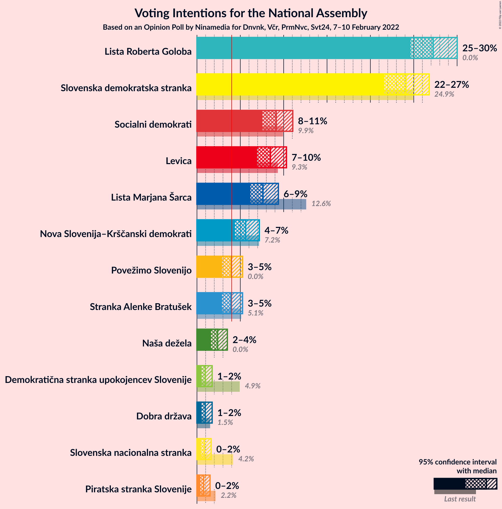

### Confidence Intervals

| Party | Last Result | Poll Result | 80% Confidence Interval | 90% Confidence Interval | 95% Confidence Interval | 99% Confidence Interval |
|:-----:|:-----------:|:-----------:|:-----------------------:|:-----------------------:|:-----------------------:|:-----------------------:|
| Lista Roberta Goloba | 0.0% | 27.2% | 25.5–29.1% |25.0–29.6% |24.6–30.0% |23.8–30.9% |
| Slovenska demokratska stranka | 24.9% | 24.1% | 22.5–25.8% |22.0–26.4% |21.6–26.8% |20.8–27.6% |
| Socialni demokrati | 9.9% | 9.1% | 8.1–10.4% |7.8–10.7% |7.5–11.1% |7.1–11.7% |
| Levica | 9.3% | 8.5% | 7.5–9.7% |7.2–10.0% |6.9–10.3% |6.5–10.9% |
| Lista Marjana Šarca | 12.6% | 7.6% | 6.7–8.8% |6.4–9.1% |6.2–9.4% |5.7–10.0% |
| Nova Slovenija–Krščanski demokrati | 7.2% | 5.6% | 4.8–6.6% |4.6–6.9% |4.4–7.2% |4.0–7.7% |
| Stranka Alenke Bratušek | 5.1% | 3.9% | 3.2–4.8% |3.0–5.0% |2.9–5.3% |2.6–5.7% |
| Povežimo Slovenijo | 0.0% | 3.9% | 3.2–4.8% |3.0–5.0% |2.9–5.3% |2.6–5.7% |
| Naša dežela | 0.0% | 2.4% | 1.9–3.1% |1.7–3.3% |1.6–3.5% |1.4–3.9% |
| Demokratična stranka upokojencev Slovenije | 4.9% | 1.0% | 0.7–1.5% |0.6–1.6% |0.5–1.8% |0.4–2.0% |
| Dobra država | 1.5% | 1.0% | 0.7–1.5% |0.6–1.6% |0.5–1.8% |0.4–2.0% |
| Slovenska nacionalna stranka | 4.2% | 0.9% | 0.6–1.4% |0.5–1.5% |0.5–1.6% |0.4–1.9% |
| Piratska stranka Slovenije | 2.2% | 0.8% | 0.5–1.2% |0.4–1.4% |0.4–1.5% |0.3–1.8% |

*Note:* The poll result column reflects the actual value used in the calculations. Published results may vary slightly, and in addition be rounded to fewer digits.

## Seats

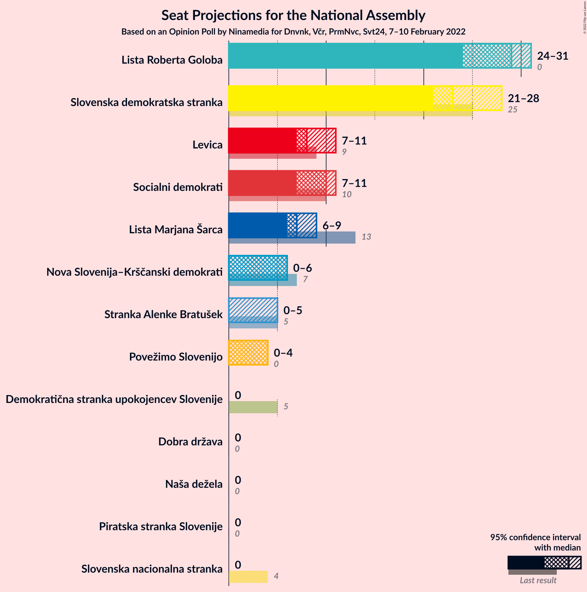

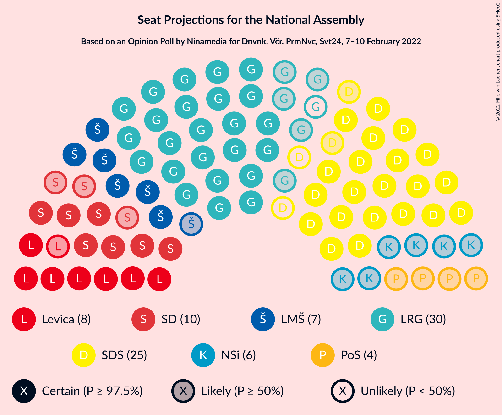

### Confidence Intervals

| Party | Last Result | Median | 80% Confidence Interval | 90% Confidence Interval | 95% Confidence Interval | 99% Confidence Interval |
|:-----:|:-----------:|:------:|:-----------------------:|:-----------------------:|:-----------------------:|:-----------------------:|
| <a href="#lista-roberta-goloba">Lista Roberta Goloba</a> | 0 | 29 | 27–30 |25–30 |24–31 |24–31 |
| <a href="#slovenska-demokratska-stranka">Slovenska demokratska stranka</a> | 25 | 23 | 23–28 |22–28 |21–28 |21–28 |
| <a href="#socialni-demokrati">Socialni demokrati</a> | 10 | 10 | 8–11 |8–11 |7–11 |7–11 |
| <a href="#levica">Levica</a> | 9 | 8 | 8–10 |8–11 |7–11 |6–11 |
| <a href="#lista-marjana-šarca">Lista Marjana Šarca</a> | 13 | 7 | 7–9 |6–9 |6–9 |5–11 |
| <a href="#nova-slovenija–krščanski-demokrati">Nova Slovenija–Krščanski demokrati</a> | 7 | 6 | 5–6 |4–6 |0–6 |0–7 |
| <a href="#stranka-alenke-bratušek">Stranka Alenke Bratušek</a> | 5 | 0 | 0–4 |0–4 |0–5 |0–5 |
| <a href="#povežimo-slovenijo">Povežimo Slovenijo</a> | 0 | 4 | 0–4 |0–4 |0–4 |0–5 |
| <a href="#naša-dežela">Naša dežela</a> | 0 | 0 | 0 |0 |0 |0–4 |
| <a href="#demokratična-stranka-upokojencev-slovenije">Demokratična stranka upokojencev Slovenije</a> | 5 | 0 | 0 |0 |0 |0 |
| <a href="#dobra-država">Dobra država</a> | 0 | 0 | 0 |0 |0 |0 |
| <a href="#slovenska-nacionalna-stranka">Slovenska nacionalna stranka</a> | 4 | 0 | 0 |0 |0 |0 |
| <a href="#piratska-stranka-slovenije">Piratska stranka Slovenije</a> | 0 | 0 | 0 |0 |0 |0 |

### Lista Roberta Goloba

*For a full overview of the results for this party, see the [Lista Roberta Goloba](party-listarobertagoloba.html) page.*

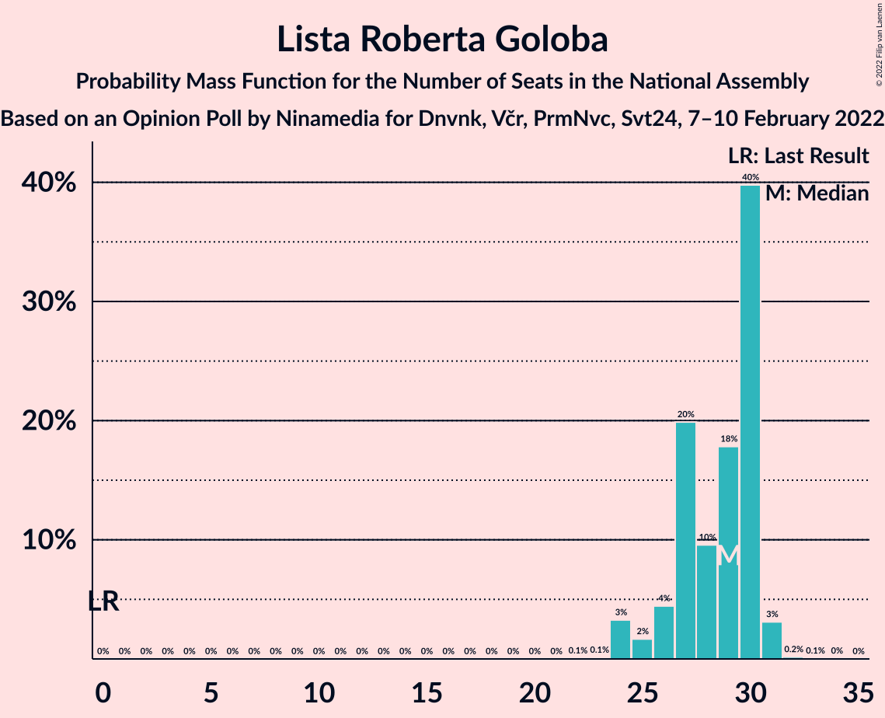

| Number of Seats | Probability | Accumulated | Special Marks |
|:---------------:|:-----------:|:-----------:|:-------------:|
| 0 | 0% | 100% | Last Result |
| 1 | 0% | 100% |  |
| 2 | 0% | 100% |  |
| 3 | 0% | 100% |  |
| 4 | 0% | 100% |  |
| 5 | 0% | 100% |  |
| 6 | 0% | 100% |  |
| 7 | 0% | 100% |  |
| 8 | 0% | 100% |  |
| 9 | 0% | 100% |  |
| 10 | 0% | 100% |  |
| 11 | 0% | 100% |  |
| 12 | 0% | 100% |  |
| 13 | 0% | 100% |  |
| 14 | 0% | 100% |  |
| 15 | 0% | 100% |  |
| 16 | 0% | 100% |  |
| 17 | 0% | 100% |  |
| 18 | 0% | 100% |  |
| 19 | 0% | 100% |  |
| 20 | 0% | 100% |  |
| 21 | 0% | 100% |  |
| 22 | 0.1% | 100% |  |
| 23 | 0.1% | 99.9% |  |
| 24 | 3% | 99.8% |  |
| 25 | 2% | 97% |  |
| 26 | 4% | 95% |  |
| 27 | 20% | 90% |  |
| 28 | 10% | 71% |  |
| 29 | 18% | 61% | Median |
| 30 | 40% | 43% |  |
| 31 | 3% | 3% |  |
| 32 | 0.2% | 0.3% |  |
| 33 | 0.1% | 0.1% |  |
| 34 | 0% | 0% |  |

### Slovenska demokratska stranka

*For a full overview of the results for this party, see the [Slovenska demokratska stranka](party-slovenskademokratskastranka.html) page.*

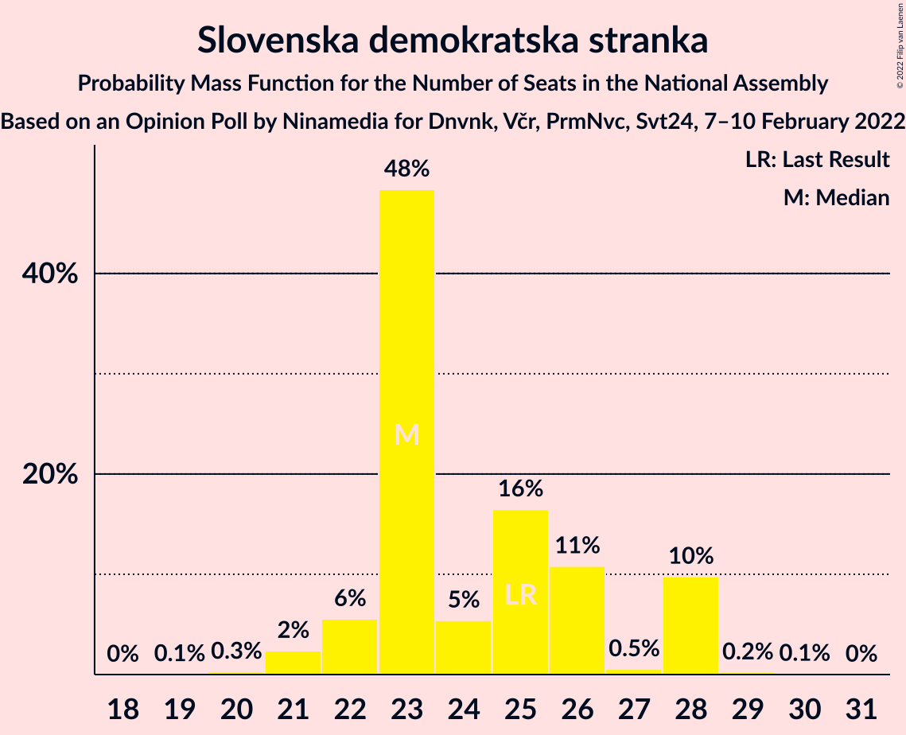

| Number of Seats | Probability | Accumulated | Special Marks |
|:---------------:|:-----------:|:-----------:|:-------------:|
| 19 | 0.1% | 100% |  |
| 20 | 0.3% | 99.9% |  |
| 21 | 2% | 99.6% |  |
| 22 | 6% | 97% |  |
| 23 | 48% | 92% | Median |
| 24 | 5% | 43% |  |
| 25 | 16% | 38% | Last Result |
| 26 | 11% | 21% |  |
| 27 | 0.5% | 11% |  |
| 28 | 10% | 10% |  |
| 29 | 0.2% | 0.3% |  |
| 30 | 0.1% | 0.1% |  |
| 31 | 0% | 0% |  |

### Socialni demokrati

*For a full overview of the results for this party, see the [Socialni demokrati](party-socialnidemokrati.html) page.*

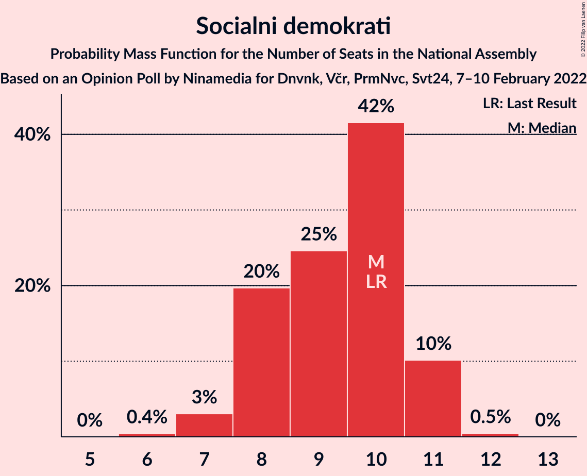

| Number of Seats | Probability | Accumulated | Special Marks |
|:---------------:|:-----------:|:-----------:|:-------------:|
| 6 | 0.4% | 100% |  |
| 7 | 3% | 99.6% |  |
| 8 | 20% | 97% |  |
| 9 | 25% | 77% |  |
| 10 | 42% | 52% | Last Result, Median |
| 11 | 10% | 11% |  |
| 12 | 0.5% | 0.5% |  |
| 13 | 0% | 0% |  |

### Levica

*For a full overview of the results for this party, see the [Levica](party-levica.html) page.*

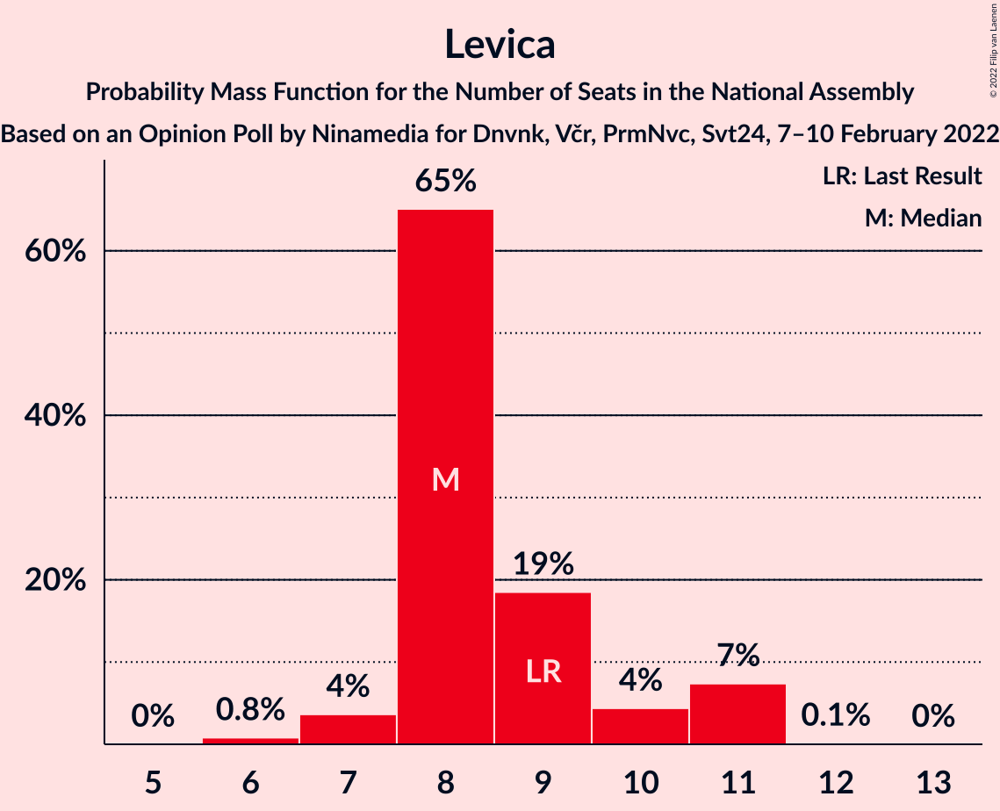

| Number of Seats | Probability | Accumulated | Special Marks |
|:---------------:|:-----------:|:-----------:|:-------------:|
| 6 | 0.8% | 100% |  |
| 7 | 4% | 99.2% |  |
| 8 | 65% | 96% | Median |
| 9 | 19% | 30% | Last Result |
| 10 | 4% | 12% |  |
| 11 | 7% | 8% |  |
| 12 | 0.1% | 0.1% |  |
| 13 | 0% | 0% |  |

### Lista Marjana Šarca

*For a full overview of the results for this party, see the [Lista Marjana Šarca](party-listamarjanašarca.html) page.*

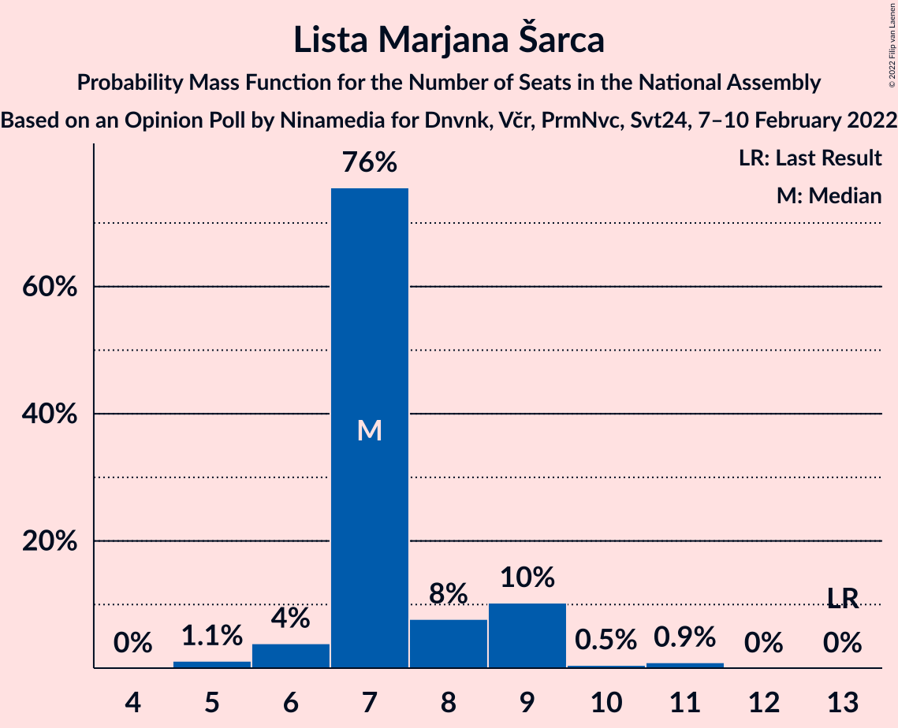

| Number of Seats | Probability | Accumulated | Special Marks |
|:---------------:|:-----------:|:-----------:|:-------------:|
| 5 | 1.1% | 100% |  |
| 6 | 4% | 98.9% |  |
| 7 | 76% | 95% | Median |
| 8 | 8% | 19% |  |
| 9 | 10% | 12% |  |
| 10 | 0.5% | 1.4% |  |
| 11 | 0.9% | 0.9% |  |
| 12 | 0% | 0% |  |
| 13 | 0% | 0% | Last Result |

### Nova Slovenija–Krščanski demokrati

*For a full overview of the results for this party, see the [Nova Slovenija–Krščanski demokrati](party-novaslovenija–krščanskidemokrati.html) page.*

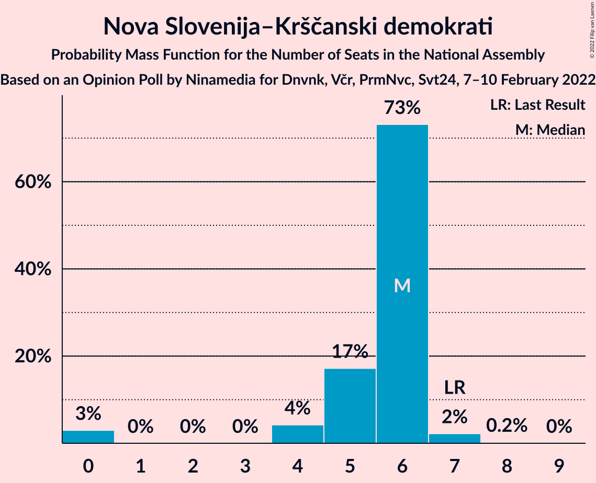

| Number of Seats | Probability | Accumulated | Special Marks |
|:---------------:|:-----------:|:-----------:|:-------------:|
| 0 | 3% | 100% |  |
| 1 | 0% | 97% |  |
| 2 | 0% | 97% |  |
| 3 | 0% | 97% |  |
| 4 | 4% | 97% |  |
| 5 | 17% | 93% |  |
| 6 | 73% | 76% | Median |
| 7 | 2% | 2% | Last Result |
| 8 | 0.2% | 0.2% |  |
| 9 | 0% | 0% |  |

### Stranka Alenke Bratušek

*For a full overview of the results for this party, see the [Stranka Alenke Bratušek](party-strankaalenkebratušek.html) page.*

| Number of Seats | Probability | Accumulated | Special Marks |
|:---------------:|:-----------:|:-----------:|:-------------:|
| 0 | 87% | 100% | Median |
| 1 | 0% | 13% |  |
| 2 | 0% | 13% |  |
| 3 | 0.1% | 13% |  |
| 4 | 10% | 12% |  |
| 5 | 3% | 3% | Last Result |
| 6 | 0.1% | 0.1% |  |
| 7 | 0% | 0% |  |

### Povežimo Slovenijo

*For a full overview of the results for this party, see the [Povežimo Slovenijo](party-povežimoslovenijo.html) page.*

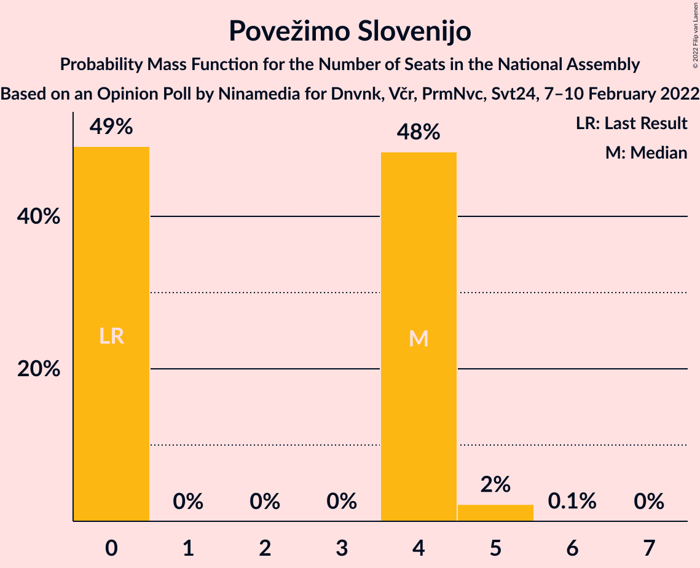

| Number of Seats | Probability | Accumulated | Special Marks |
|:---------------:|:-----------:|:-----------:|:-------------:|
| 0 | 49% | 100% | Last Result |
| 1 | 0% | 51% |  |
| 2 | 0% | 51% |  |
| 3 | 0% | 51% |  |
| 4 | 48% | 51% | Median |
| 5 | 2% | 2% |  |
| 6 | 0.1% | 0.1% |  |
| 7 | 0% | 0% |  |

### Naša dežela

*For a full overview of the results for this party, see the [Naša dežela](party-našadežela.html) page.*

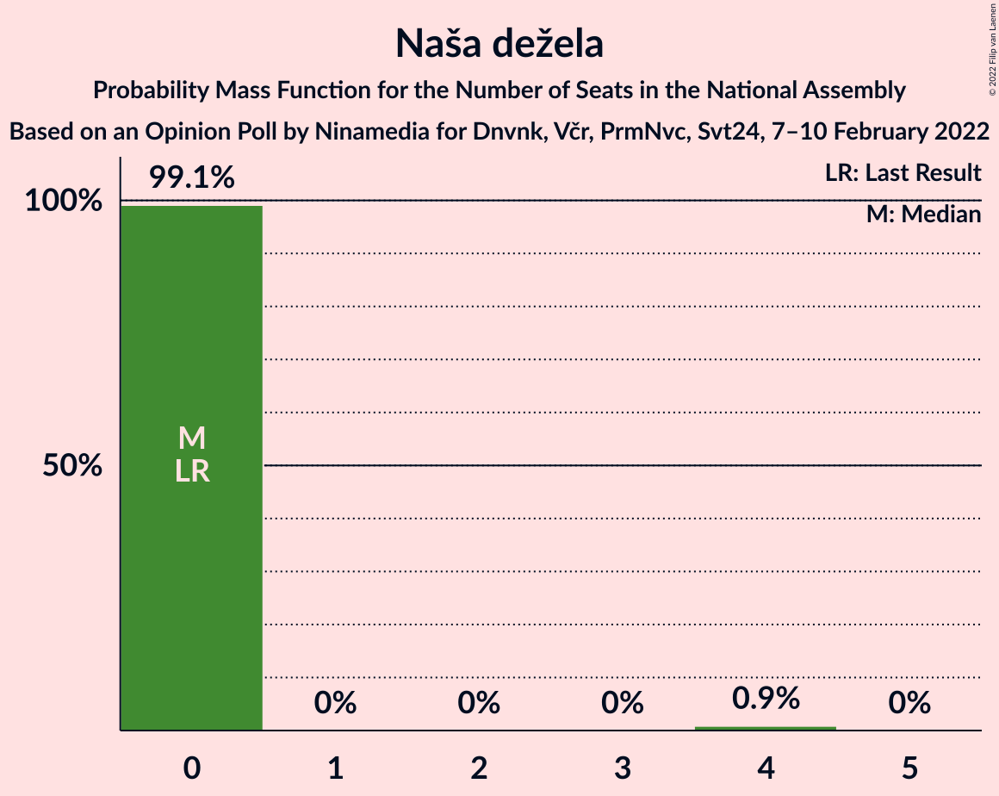

| Number of Seats | Probability | Accumulated | Special Marks |
|:---------------:|:-----------:|:-----------:|:-------------:|
| 0 | 99.1% | 100% | Last Result, Median |
| 1 | 0% | 0.9% |  |
| 2 | 0% | 0.9% |  |
| 3 | 0% | 0.9% |  |
| 4 | 0.9% | 0.9% |  |
| 5 | 0% | 0% |  |

### Demokratična stranka upokojencev Slovenije

*For a full overview of the results for this party, see the [Demokratična stranka upokojencev Slovenije](party-demokratičnastrankaupokojencevslovenije.html) page.*

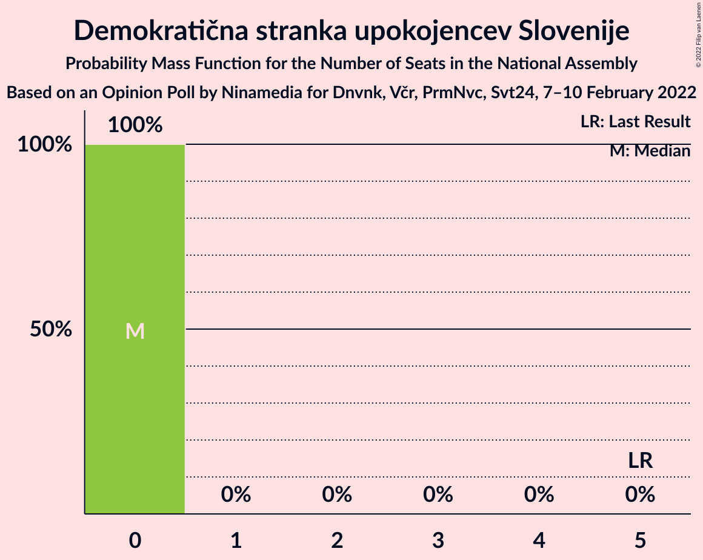

| Number of Seats | Probability | Accumulated | Special Marks |
|:---------------:|:-----------:|:-----------:|:-------------:|
| 0 | 100% | 100% | Median |
| 1 | 0% | 0% |  |
| 2 | 0% | 0% |  |
| 3 | 0% | 0% |  |
| 4 | 0% | 0% |  |
| 5 | 0% | 0% | Last Result |

### Dobra država

*For a full overview of the results for this party, see the [Dobra država](party-dobradržava.html) page.*

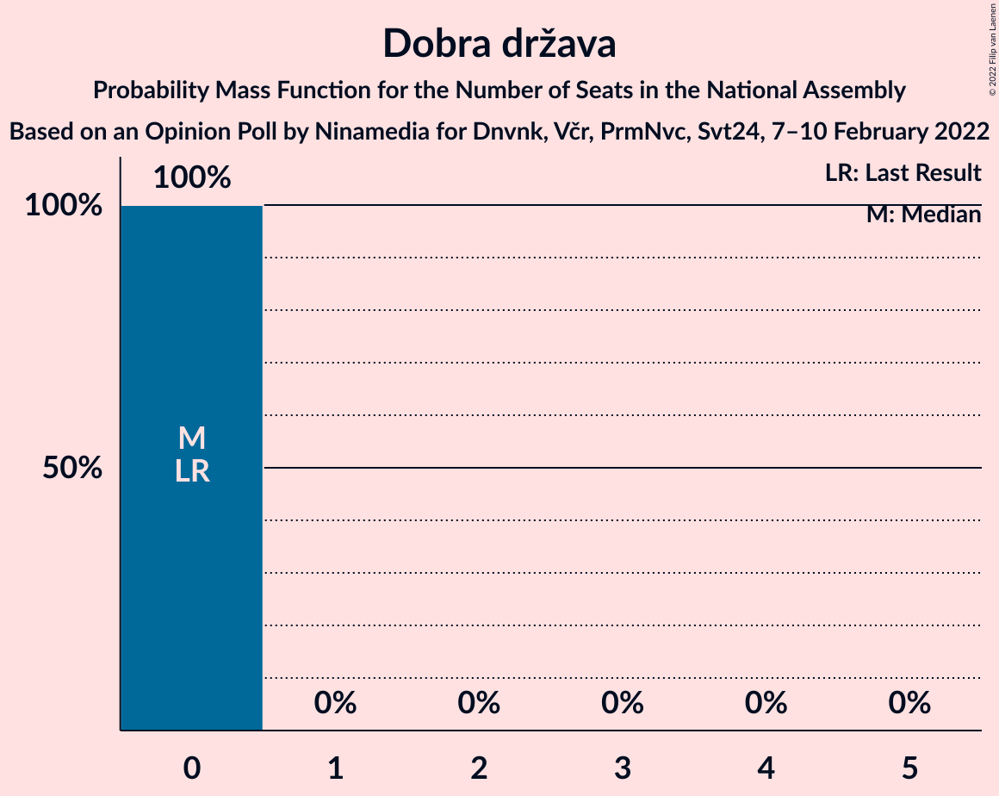

| Number of Seats | Probability | Accumulated | Special Marks |
|:---------------:|:-----------:|:-----------:|:-------------:|
| 0 | 100% | 100% | Last Result, Median |

### Slovenska nacionalna stranka

*For a full overview of the results for this party, see the [Slovenska nacionalna stranka](party-slovenskanacionalnastranka.html) page.*

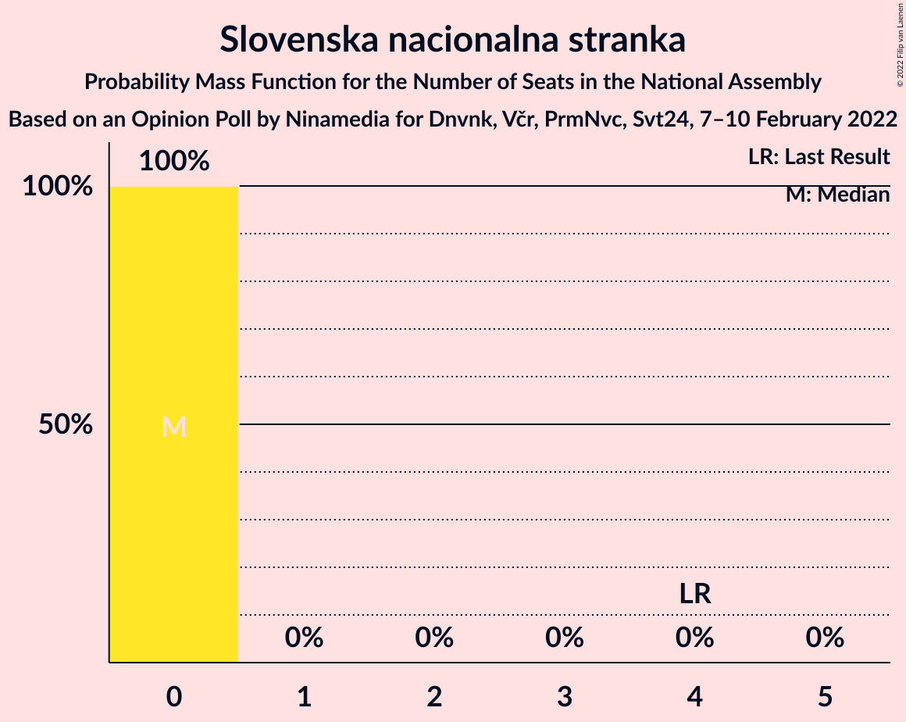

| Number of Seats | Probability | Accumulated | Special Marks |
|:---------------:|:-----------:|:-----------:|:-------------:|
| 0 | 100% | 100% | Median |
| 1 | 0% | 0% |  |
| 2 | 0% | 0% |  |
| 3 | 0% | 0% |  |
| 4 | 0% | 0% | Last Result |

### Piratska stranka Slovenije

*For a full overview of the results for this party, see the [Piratska stranka Slovenije](party-piratskastrankaslovenije.html) page.*

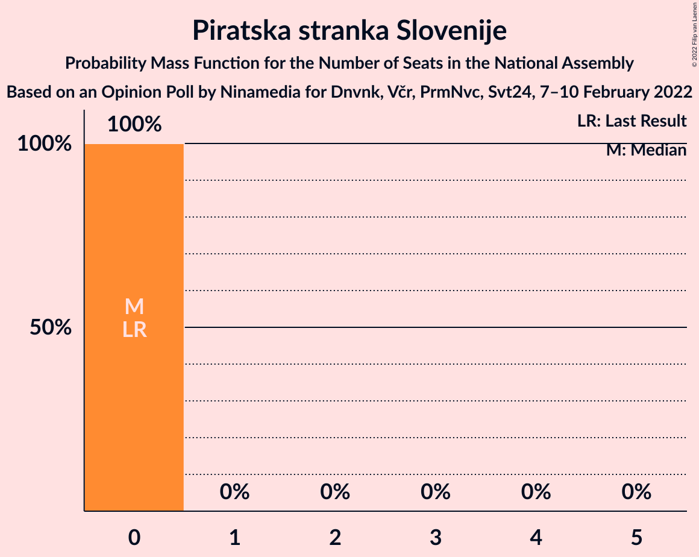

| Number of Seats | Probability | Accumulated | Special Marks |
|:---------------:|:-----------:|:-----------:|:-------------:|
| 0 | 100% | 100% | Last Result, Median |

## Coalitions

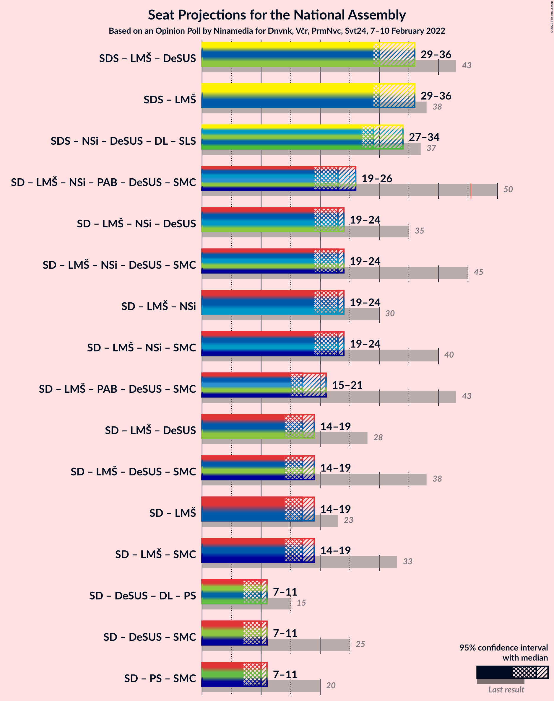

### Confidence Intervals

| Coalition | Last Result | Median | Majority? | 80% Confidence Interval | 90% Confidence Interval | 95% Confidence Interval | 99% Confidence Interval |
|:---------:|:-----------:|:------:|:---------:|:-----------------------:|:-----------------------:|:-----------------------:|:-----------------------:|
| Slovenska demokratska stranka – Lista Marjana Šarca – Demokratična stranka upokojencev Slovenije | 43 | 30 | 0% | 30–35 | 29–35 | 29–36 | 27–37 |
| Slovenska demokratska stranka – Lista Marjana Šarca | 38 | 30 | 0% | 30–35 | 29–35 | 29–36 | 27–37 |
| Socialni demokrati – Lista Marjana Šarca – Nova Slovenija–Krščanski demokrati – Demokratična stranka upokojencev Slovenije | 35 | 23 | 0% | 20–23 | 19–24 | 19–24 | 18–26 |
| Socialni demokrati – Lista Marjana Šarca – Nova Slovenija–Krščanski demokrati | 30 | 23 | 0% | 20–23 | 19–24 | 19–24 | 18–26 |
| Socialni demokrati – Lista Marjana Šarca – Demokratična stranka upokojencev Slovenije | 28 | 17 | 0% | 15–18 | 15–19 | 14–19 | 13–20 |
| Socialni demokrati – Lista Marjana Šarca | 23 | 17 | 0% | 15–18 | 15–19 | 14–19 | 13–20 |

### Slovenska demokratska stranka – Lista Marjana Šarca – Demokratična stranka upokojencev Slovenije

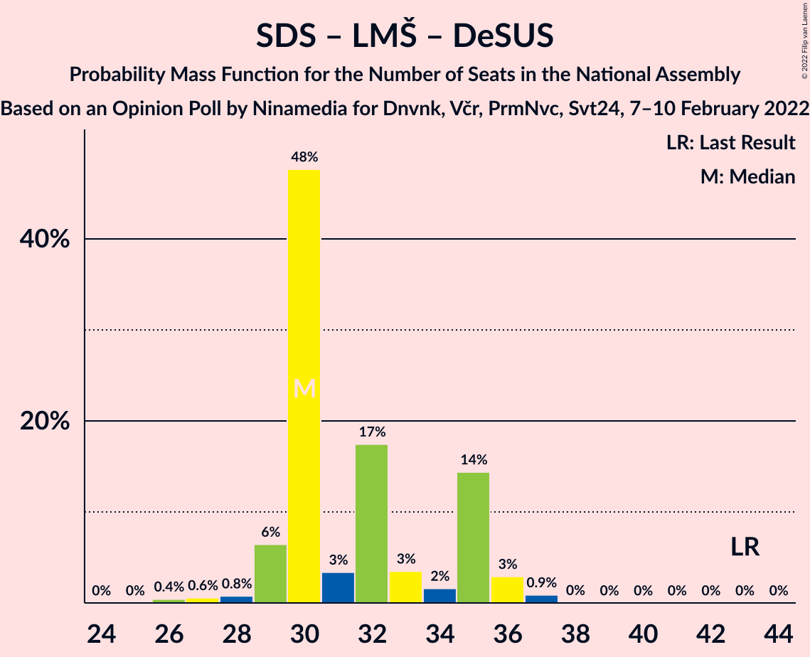

| Number of Seats | Probability | Accumulated | Special Marks |
|:---------------:|:-----------:|:-----------:|:-------------:|
| 26 | 0.4% | 100% |  |
| 27 | 0.6% | 99.6% |  |
| 28 | 0.8% | 99.0% |  |
| 29 | 6% | 98% |  |
| 30 | 48% | 92% | Median |
| 31 | 3% | 44% |  |
| 32 | 17% | 41% |  |
| 33 | 3% | 23% |  |
| 34 | 2% | 20% |  |
| 35 | 14% | 18% |  |
| 36 | 3% | 4% |  |
| 37 | 0.9% | 0.9% |  |
| 38 | 0% | 0% |  |
| 39 | 0% | 0% |  |
| 40 | 0% | 0% |  |
| 41 | 0% | 0% |  |
| 42 | 0% | 0% |  |
| 43 | 0% | 0% | Last Result |

### Slovenska demokratska stranka – Lista Marjana Šarca

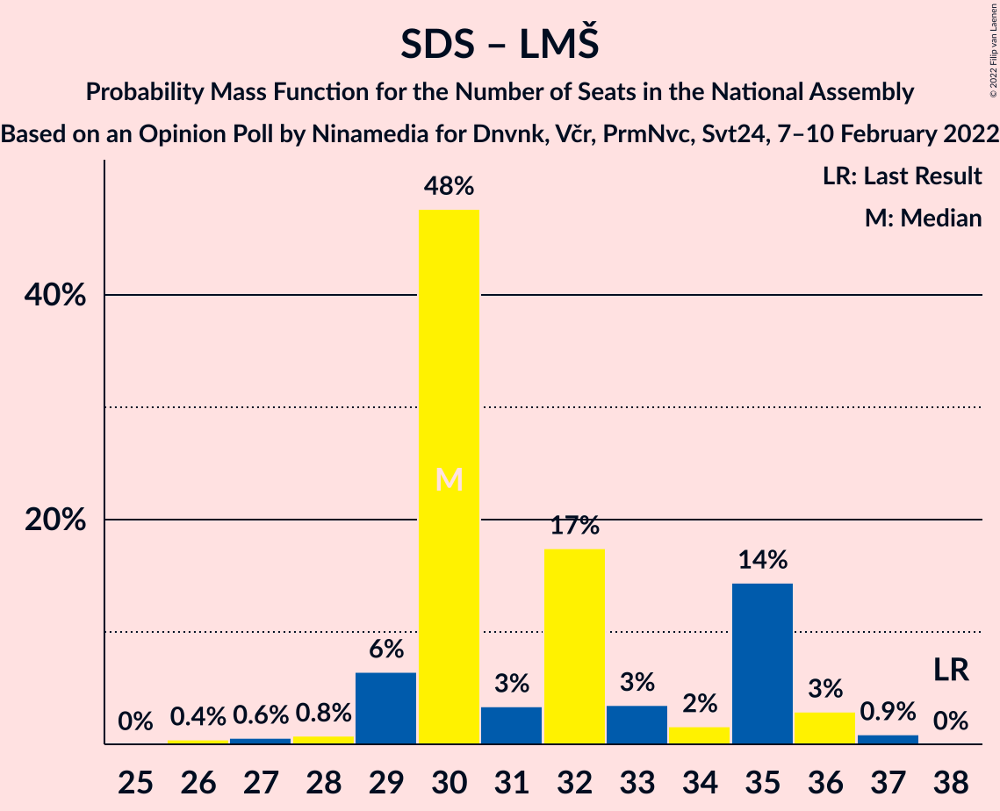

| Number of Seats | Probability | Accumulated | Special Marks |
|:---------------:|:-----------:|:-----------:|:-------------:|
| 26 | 0.4% | 100% |  |
| 27 | 0.6% | 99.6% |  |
| 28 | 0.8% | 99.0% |  |
| 29 | 6% | 98% |  |
| 30 | 48% | 92% | Median |
| 31 | 3% | 44% |  |
| 32 | 17% | 41% |  |
| 33 | 3% | 23% |  |
| 34 | 2% | 20% |  |
| 35 | 14% | 18% |  |
| 36 | 3% | 4% |  |
| 37 | 0.9% | 0.9% |  |
| 38 | 0% | 0% | Last Result |

### Socialni demokrati – Lista Marjana Šarca – Nova Slovenija–Krščanski demokrati – Demokratična stranka upokojencev Slovenije

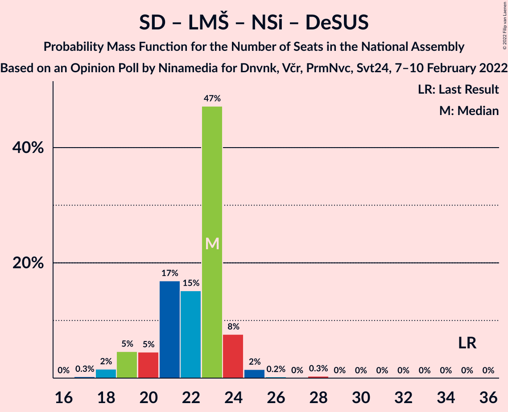

| Number of Seats | Probability | Accumulated | Special Marks |
|:---------------:|:-----------:|:-----------:|:-------------:|
| 17 | 0.3% | 100% |  |
| 18 | 2% | 99.7% |  |
| 19 | 5% | 98% |  |
| 20 | 5% | 94% |  |
| 21 | 17% | 89% |  |
| 22 | 15% | 72% |  |
| 23 | 47% | 57% | Median |
| 24 | 8% | 10% |  |
| 25 | 2% | 2% |  |
| 26 | 0.2% | 0.6% |  |
| 27 | 0% | 0.4% |  |
| 28 | 0.3% | 0.4% |  |
| 29 | 0% | 0% |  |
| 30 | 0% | 0% |  |
| 31 | 0% | 0% |  |
| 32 | 0% | 0% |  |
| 33 | 0% | 0% |  |
| 34 | 0% | 0% |  |
| 35 | 0% | 0% | Last Result |

### Socialni demokrati – Lista Marjana Šarca – Nova Slovenija–Krščanski demokrati

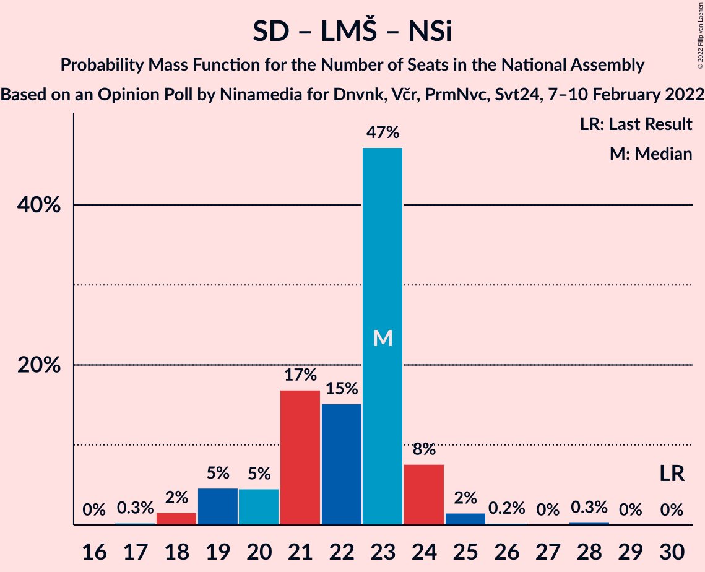

| Number of Seats | Probability | Accumulated | Special Marks |
|:---------------:|:-----------:|:-----------:|:-------------:|
| 17 | 0.3% | 100% |  |
| 18 | 2% | 99.7% |  |
| 19 | 5% | 98% |  |
| 20 | 5% | 94% |  |
| 21 | 17% | 89% |  |
| 22 | 15% | 72% |  |
| 23 | 47% | 57% | Median |
| 24 | 8% | 10% |  |
| 25 | 2% | 2% |  |
| 26 | 0.2% | 0.6% |  |
| 27 | 0% | 0.4% |  |
| 28 | 0.3% | 0.4% |  |
| 29 | 0% | 0% |  |
| 30 | 0% | 0% | Last Result |

### Socialni demokrati – Lista Marjana Šarca – Demokratična stranka upokojencev Slovenije

| Number of Seats | Probability | Accumulated | Special Marks |
|:---------------:|:-----------:|:-----------:|:-------------:|
| 13 | 2% | 100% |  |
| 14 | 2% | 98% |  |
| 15 | 19% | 97% |  |
| 16 | 13% | 77% |  |
| 17 | 44% | 64% | Median |
| 18 | 15% | 20% |  |
| 19 | 4% | 5% |  |
| 20 | 0.9% | 1.3% |  |
| 21 | 0.4% | 0.4% |  |
| 22 | 0% | 0% |  |
| 23 | 0% | 0% |  |
| 24 | 0% | 0% |  |
| 25 | 0% | 0% |  |
| 26 | 0% | 0% |  |
| 27 | 0% | 0% |  |
| 28 | 0% | 0% | Last Result |

### Socialni demokrati – Lista Marjana Šarca

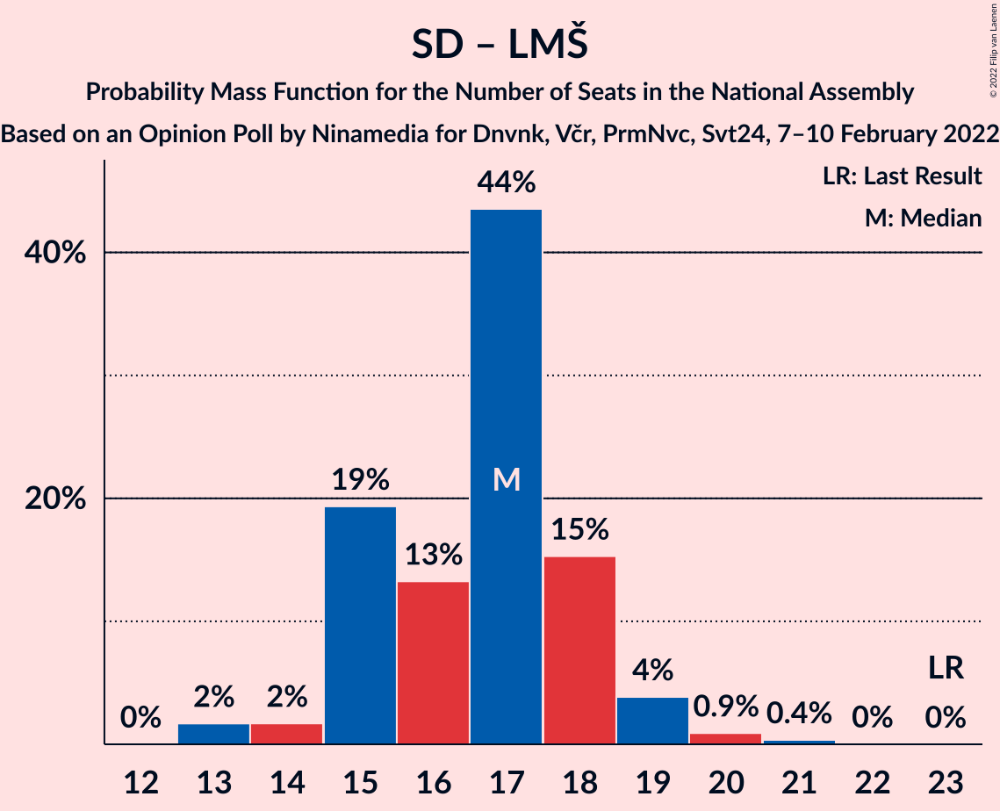

| Number of Seats | Probability | Accumulated | Special Marks |
|:---------------:|:-----------:|:-----------:|:-------------:|
| 13 | 2% | 100% |  |
| 14 | 2% | 98% |  |
| 15 | 19% | 97% |  |
| 16 | 13% | 77% |  |
| 17 | 44% | 64% | Median |
| 18 | 15% | 20% |  |
| 19 | 4% | 5% |  |
| 20 | 0.9% | 1.3% |  |
| 21 | 0.4% | 0.4% |  |
| 22 | 0% | 0% |  |
| 23 | 0% | 0% | Last Result |

## Technical Information

### Opinion Poll

+ **Polling firm:** Ninamedia
+ **Commissioner(s):** Dnvnk, Včr, PrmNvc, Svt24
+ **Fieldwork period:** 7–10 February 2022

### Calculations

+ **Sample size:** 1050
+ **Simulations done:** 1,048,576
+ **Error estimate:** 1.71%

