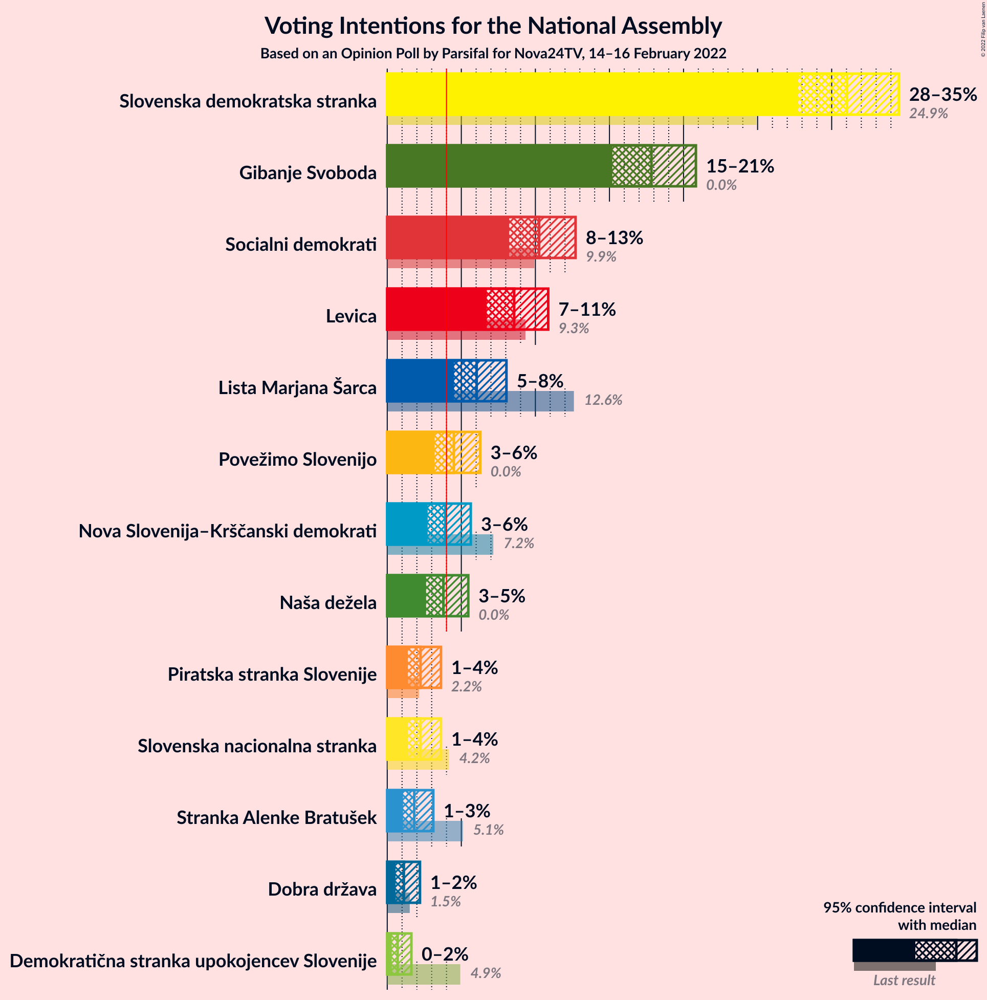
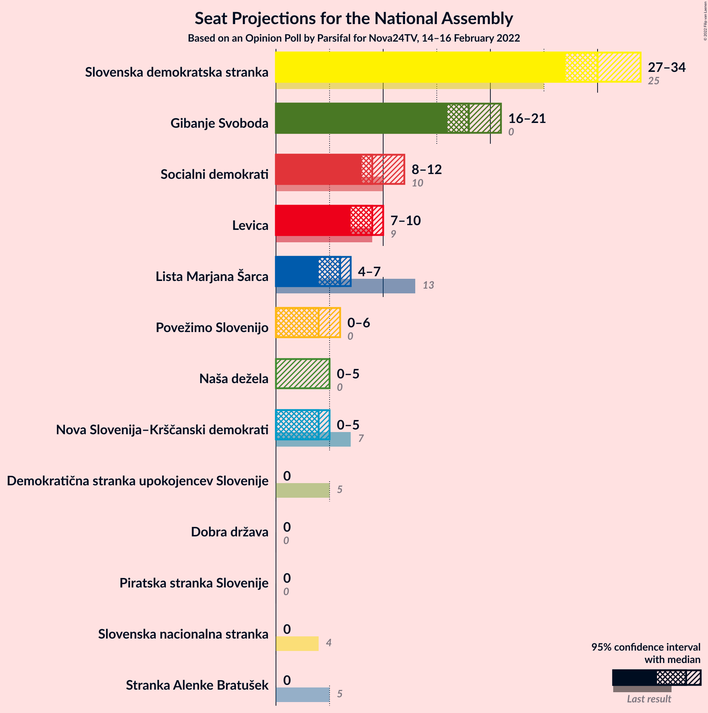
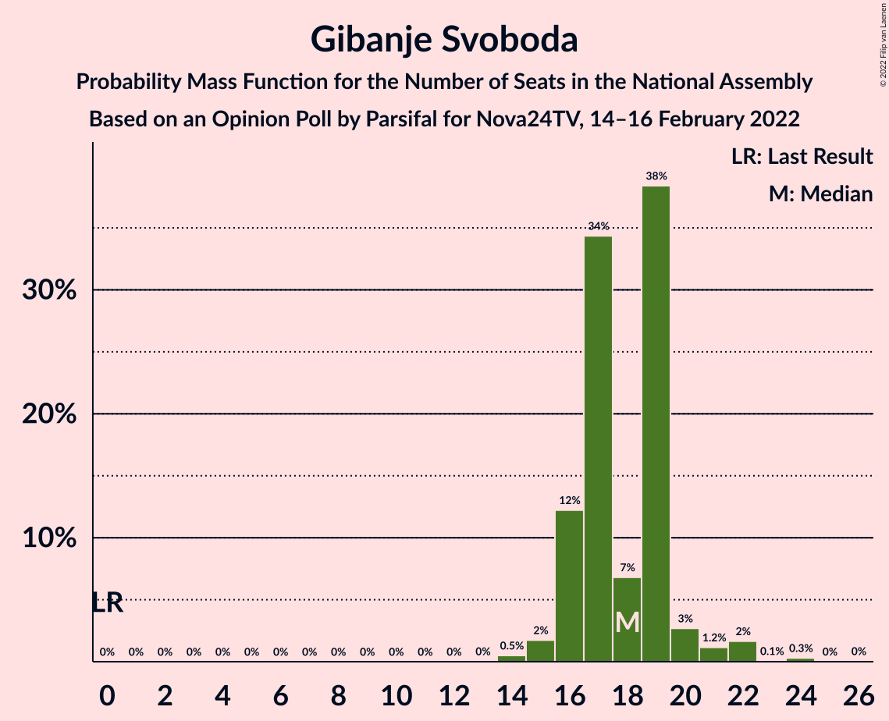
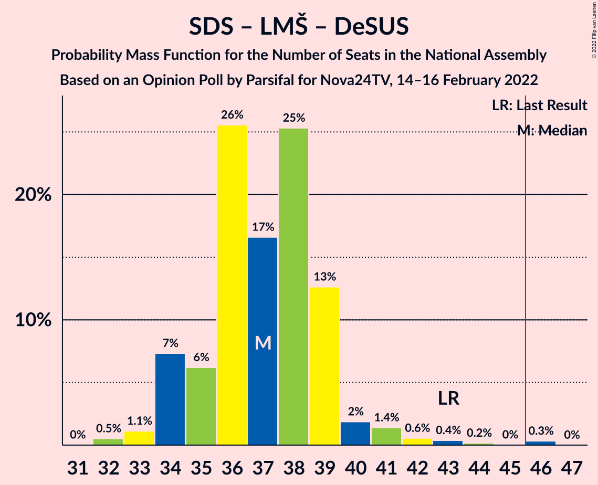

# Opinion Poll by Parsifal for Nova24TV, 14–16 February 2022

<a href="#voting-intentions">Voting Intentions</a> | <a href="#seats">Seats</a> | <a href="#coalitions">Coalitions</a> | <a href="#technical-information">Technical Information</a>

## Voting Intentions

### Confidence Intervals

| Party | Last Result | Poll Result | 80% Confidence Interval | 90% Confidence Interval | 95% Confidence Interval | 99% Confidence Interval |
|:-----:|:-----------:|:-----------:|:-----------------------:|:-----------------------:|:-----------------------:|:-----------------------:|
| Slovenska demokratska stranka | 24.9% | 31.0% | 28.9–33.3% |28.3–34.0% |27.7–34.5% |26.7–35.7% |
| Gibanje Svoboda | 0.0% | 17.8% | 16.1–19.8% |15.6–20.3% |15.2–20.8% |14.4–21.8% |
| Socialni demokrati | 9.9% | 10.3% | 8.9–11.9% |8.6–12.3% |8.2–12.7% |7.6–13.5% |
| Levica | 9.3% | 8.6% | 7.3–10.1% |7.0–10.5% |6.7–10.9% |6.2–11.6% |
| Lista Marjana Šarca | 12.6% | 6.0% | 5.0–7.3% |4.8–7.7% |4.5–8.0% |4.1–8.7% |
| Povežimo Slovenijo | 0.0% | 4.5% | 3.6–5.7% |3.4–6.0% |3.2–6.3% |2.8–6.9% |
| Nova Slovenija–Krščanski demokrati | 7.2% | 3.9% | 3.1–5.0% |2.9–5.3% |2.7–5.6% |2.4–6.2% |
| Naša dežela | 0.0% | 3.8% | 3.0–4.9% |2.8–5.2% |2.6–5.5% |2.3–6.0% |
| Slovenska nacionalna stranka | 4.2% | 2.2% | 1.7–3.1% |1.5–3.4% |1.4–3.6% |1.2–4.1% |
| Piratska stranka Slovenije | 2.2% | 2.2% | 1.7–3.1% |1.5–3.4% |1.4–3.6% |1.2–4.1% |
| Stranka Alenke Bratušek | 5.1% | 1.8% | 1.3–2.7% |1.2–2.9% |1.1–3.1% |0.9–3.6% |
| Dobra država | 1.5% | 1.1% | 0.8–1.8% |0.7–2.0% |0.6–2.2% |0.4–2.6% |
| Demokratična stranka upokojencev Slovenije | 4.9% | 0.7% | 0.4–1.3% |0.4–1.5% |0.3–1.6% |0.2–2.0% |

*Note:* The poll result column reflects the actual value used in the calculations. Published results may vary slightly, and in addition be rounded to fewer digits.

## Seats

### Confidence Intervals

| Party | Last Result | Median | 80% Confidence Interval | 90% Confidence Interval | 95% Confidence Interval | 99% Confidence Interval |
|:-----:|:-----------:|:------:|:-----------------------:|:-----------------------:|:-----------------------:|:-----------------------:|
| <a href="#slovenska-demokratska-stranka">Slovenska demokratska stranka</a> | 25 | 30 | 29–33 |28–34 |27–34 |27–38 |
| <a href="#gibanje-svoboda">Gibanje Svoboda</a> | 0 | 18 | 16–19 |16–20 |16–21 |14–22 |
| <a href="#socialni-demokrati">Socialni demokrati</a> | 10 | 9 | 9–11 |8–12 |8–12 |7–13 |
| <a href="#levica">Levica</a> | 9 | 9 | 7–10 |7–10 |7–10 |6–11 |
| <a href="#lista-marjana-šarca">Lista Marjana Šarca</a> | 13 | 6 | 5–7 |5–7 |4–7 |4–9 |
| <a href="#povežimo-slovenijo">Povežimo Slovenijo</a> | 0 | 4 | 0–6 |0–6 |0–6 |0–7 |
| <a href="#nova-slovenija–krščanski-demokrati">Nova Slovenija–Krščanski demokrati</a> | 7 | 4 | 0–5 |0–5 |0–5 |0–6 |
| <a href="#naša-dežela">Naša dežela</a> | 0 | 0 | 0–5 |0–5 |0–5 |0–5 |
| <a href="#slovenska-nacionalna-stranka">Slovenska nacionalna stranka</a> | 4 | 0 | 0 |0 |0 |0 |
| <a href="#piratska-stranka-slovenije">Piratska stranka Slovenije</a> | 0 | 0 | 0 |0 |0 |0 |
| <a href="#stranka-alenke-bratušek">Stranka Alenke Bratušek</a> | 5 | 0 | 0 |0 |0 |0 |
| <a href="#dobra-država">Dobra država</a> | 0 | 0 | 0 |0 |0 |0 |
| <a href="#demokratična-stranka-upokojencev-slovenije">Demokratična stranka upokojencev Slovenije</a> | 5 | 0 | 0 |0 |0 |0 |

### Slovenska demokratska stranka

*For a full overview of the results for this party, see the [Slovenska demokratska stranka](party-slovenskademokratskastranka.html) page.*

| Number of Seats | Probability | Accumulated | Special Marks |
|:---------------:|:-----------:|:-----------:|:-------------:|
| 25 | 0% | 100% | Last Result |
| 26 | 0.1% | 100% |  |
| 27 | 5% | 99.9% |  |
| 28 | 3% | 95% |  |
| 29 | 6% | 92% |  |
| 30 | 39% | 86% | Median |
| 31 | 7% | 47% |  |
| 32 | 6% | 39% |  |
| 33 | 28% | 33% |  |
| 34 | 3% | 6% |  |
| 35 | 1.2% | 2% |  |
| 36 | 0.3% | 1.3% |  |
| 37 | 0.2% | 1.0% |  |
| 38 | 0.3% | 0.8% |  |
| 39 | 0.5% | 0.5% |  |
| 40 | 0% | 0% |  |

### Gibanje Svoboda

*For a full overview of the results for this party, see the [Gibanje Svoboda](party-gibanjesvoboda.html) page.*

| Number of Seats | Probability | Accumulated | Special Marks |
|:---------------:|:-----------:|:-----------:|:-------------:|
| 0 | 0% | 100% | Last Result |
| 1 | 0% | 100% |  |
| 2 | 0% | 100% |  |
| 3 | 0% | 100% |  |
| 4 | 0% | 100% |  |
| 5 | 0% | 100% |  |
| 6 | 0% | 100% |  |
| 7 | 0% | 100% |  |
| 8 | 0% | 100% |  |
| 9 | 0% | 100% |  |
| 10 | 0% | 100% |  |
| 11 | 0% | 100% |  |
| 12 | 0% | 100% |  |
| 13 | 0% | 100% |  |
| 14 | 0.5% | 100% |  |
| 15 | 2% | 99.5% |  |
| 16 | 12% | 98% |  |
| 17 | 34% | 85% |  |
| 18 | 7% | 51% | Median |
| 19 | 38% | 44% |  |
| 20 | 3% | 6% |  |
| 21 | 1.2% | 3% |  |
| 22 | 2% | 2% |  |
| 23 | 0.1% | 0.4% |  |
| 24 | 0.3% | 0.4% |  |
| 25 | 0% | 0.1% |  |
| 26 | 0% | 0% |  |

### Socialni demokrati

*For a full overview of the results for this party, see the [Socialni demokrati](party-socialnidemokrati.html) page.*

| Number of Seats | Probability | Accumulated | Special Marks |
|:---------------:|:-----------:|:-----------:|:-------------:|
| 7 | 0.5% | 100% |  |
| 8 | 9% | 99.5% |  |
| 9 | 46% | 90% | Median |
| 10 | 31% | 45% | Last Result |
| 11 | 8% | 14% |  |
| 12 | 5% | 6% |  |
| 13 | 1.1% | 1.4% |  |
| 14 | 0.2% | 0.3% |  |
| 15 | 0.1% | 0.1% |  |
| 16 | 0% | 0% |  |

### Levica

*For a full overview of the results for this party, see the [Levica](party-levica.html) page.*

| Number of Seats | Probability | Accumulated | Special Marks |
|:---------------:|:-----------:|:-----------:|:-------------:|
| 5 | 0.1% | 100% |  |
| 6 | 2% | 99.9% |  |
| 7 | 11% | 98% |  |
| 8 | 30% | 87% |  |
| 9 | 43% | 57% | Last Result, Median |
| 10 | 14% | 15% |  |
| 11 | 1.0% | 1.2% |  |
| 12 | 0.2% | 0.3% |  |
| 13 | 0% | 0.1% |  |
| 14 | 0% | 0% |  |

### Lista Marjana Šarca

*For a full overview of the results for this party, see the [Lista Marjana Šarca](party-listamarjanašarca.html) page.*

| Number of Seats | Probability | Accumulated | Special Marks |
|:---------------:|:-----------:|:-----------:|:-------------:|
| 0 | 0.2% | 100% |  |
| 1 | 0% | 99.8% |  |
| 2 | 0% | 99.8% |  |
| 3 | 0% | 99.8% |  |
| 4 | 3% | 99.8% |  |
| 5 | 25% | 97% |  |
| 6 | 43% | 72% | Median |
| 7 | 27% | 29% |  |
| 8 | 0.6% | 2% |  |
| 9 | 1.0% | 1.0% |  |
| 10 | 0% | 0% |  |
| 11 | 0% | 0% |  |
| 12 | 0% | 0% |  |
| 13 | 0% | 0% | Last Result |

### Povežimo Slovenijo

*For a full overview of the results for this party, see the [Povežimo Slovenijo](party-povežimoslovenijo.html) page.*

| Number of Seats | Probability | Accumulated | Special Marks |
|:---------------:|:-----------:|:-----------:|:-------------:|
| 0 | 11% | 100% | Last Result |
| 1 | 0% | 89% |  |
| 2 | 0% | 89% |  |
| 3 | 0% | 89% |  |
| 4 | 47% | 89% | Median |
| 5 | 22% | 42% |  |
| 6 | 20% | 21% |  |
| 7 | 0.8% | 0.9% |  |
| 8 | 0% | 0% |  |

### Nova Slovenija–Krščanski demokrati

*For a full overview of the results for this party, see the [Nova Slovenija–Krščanski demokrati](party-novaslovenija–krščanskidemokrati.html) page.*

| Number of Seats | Probability | Accumulated | Special Marks |
|:---------------:|:-----------:|:-----------:|:-------------:|
| 0 | 21% | 100% |  |
| 1 | 0% | 79% |  |
| 2 | 0% | 79% |  |
| 3 | 0% | 79% |  |
| 4 | 42% | 79% | Median |
| 5 | 36% | 37% |  |
| 6 | 0.5% | 0.6% |  |
| 7 | 0.1% | 0.1% | Last Result |
| 8 | 0% | 0% |  |

### Naša dežela

*For a full overview of the results for this party, see the [Naša dežela](party-našadežela.html) page.*

| Number of Seats | Probability | Accumulated | Special Marks |
|:---------------:|:-----------:|:-----------:|:-------------:|
| 0 | 64% | 100% | Last Result, Median |
| 1 | 0% | 36% |  |
| 2 | 0% | 36% |  |
| 3 | 0% | 36% |  |
| 4 | 22% | 36% |  |
| 5 | 13% | 14% |  |
| 6 | 0.4% | 0.4% |  |
| 7 | 0% | 0% |  |

### Slovenska nacionalna stranka

*For a full overview of the results for this party, see the [Slovenska nacionalna stranka](party-slovenskanacionalnastranka.html) page.*

| Number of Seats | Probability | Accumulated | Special Marks |
|:---------------:|:-----------:|:-----------:|:-------------:|
| 0 | 99.8% | 100% | Median |
| 1 | 0% | 0.2% |  |
| 2 | 0% | 0.2% |  |
| 3 | 0% | 0.2% |  |
| 4 | 0.2% | 0.2% | Last Result |
| 5 | 0% | 0% |  |

### Piratska stranka Slovenije

*For a full overview of the results for this party, see the [Piratska stranka Slovenije](party-piratskastrankaslovenije.html) page.*

| Number of Seats | Probability | Accumulated | Special Marks |
|:---------------:|:-----------:|:-----------:|:-------------:|
| 0 | 99.8% | 100% | Last Result, Median |
| 1 | 0% | 0.2% |  |
| 2 | 0% | 0.2% |  |
| 3 | 0% | 0.2% |  |
| 4 | 0.2% | 0.2% |  |
| 5 | 0% | 0% |  |

### Stranka Alenke Bratušek

*For a full overview of the results for this party, see the [Stranka Alenke Bratušek](party-strankaalenkebratušek.html) page.*

| Number of Seats | Probability | Accumulated | Special Marks |
|:---------------:|:-----------:|:-----------:|:-------------:|
| 0 | 100% | 100% | Median |
| 1 | 0% | 0% |  |
| 2 | 0% | 0% |  |
| 3 | 0% | 0% |  |
| 4 | 0% | 0% |  |
| 5 | 0% | 0% | Last Result |

### Dobra država

*For a full overview of the results for this party, see the [Dobra država](party-dobradržava.html) page.*

| Number of Seats | Probability | Accumulated | Special Marks |
|:---------------:|:-----------:|:-----------:|:-------------:|
| 0 | 100% | 100% | Last Result, Median |

### Demokratična stranka upokojencev Slovenije

*For a full overview of the results for this party, see the [Demokratična stranka upokojencev Slovenije](party-demokratičnastrankaupokojencevslovenije.html) page.*

| Number of Seats | Probability | Accumulated | Special Marks |
|:---------------:|:-----------:|:-----------:|:-------------:|
| 0 | 100% | 100% | Median |
| 1 | 0% | 0% |  |
| 2 | 0% | 0% |  |
| 3 | 0% | 0% |  |
| 4 | 0% | 0% |  |
| 5 | 0% | 0% | Last Result |

## Coalitions

### Confidence Intervals

| Coalition | Last Result | Median | Majority? | 80% Confidence Interval | 90% Confidence Interval | 95% Confidence Interval | 99% Confidence Interval |
|:---------:|:-----------:|:------:|:---------:|:-----------------------:|:-----------------------:|:-----------------------:|:-----------------------:|
| Slovenska demokratska stranka – Lista Marjana Šarca – Demokratična stranka upokojencev Slovenije | 43 | 37 | 0.3% | 35–39 | 34–39 | 34–41 | 32–44 |
| Slovenska demokratska stranka – Lista Marjana Šarca | 38 | 37 | 0.3% | 35–39 | 34–39 | 34–41 | 32–44 |
| Socialni demokrati – Lista Marjana Šarca – Nova Slovenija–Krščanski demokrati – Demokratična stranka upokojencev Slovenije | 35 | 19 | 0% | 16–21 | 15–22 | 15–22 | 13–25 |
| Socialni demokrati – Lista Marjana Šarca – Nova Slovenija–Krščanski demokrati | 30 | 19 | 0% | 16–21 | 15–22 | 15–22 | 13–25 |
| Socialni demokrati – Lista Marjana Šarca – Demokratična stranka upokojencev Slovenije | 28 | 16 | 0% | 14–17 | 14–18 | 14–19 | 13–20 |
| Socialni demokrati – Lista Marjana Šarca | 23 | 16 | 0% | 14–17 | 14–18 | 14–19 | 13–20 |

### Slovenska demokratska stranka – Lista Marjana Šarca – Demokratična stranka upokojencev Slovenije

| Number of Seats | Probability | Accumulated | Special Marks |
|:---------------:|:-----------:|:-----------:|:-------------:|
| 32 | 0.5% | 100% |  |
| 33 | 1.1% | 99.5% |  |
| 34 | 7% | 98% |  |
| 35 | 6% | 91% |  |
| 36 | 26% | 85% | Median |
| 37 | 17% | 59% |  |
| 38 | 25% | 43% |  |
| 39 | 13% | 17% |  |
| 40 | 2% | 5% |  |
| 41 | 1.4% | 3% |  |
| 42 | 0.6% | 1.4% |  |
| 43 | 0.4% | 0.9% | Last Result |
| 44 | 0.2% | 0.5% |  |
| 45 | 0% | 0.4% |  |
| 46 | 0.3% | 0.3% | Majority |
| 47 | 0% | 0% |  |

### Slovenska demokratska stranka – Lista Marjana Šarca

| Number of Seats | Probability | Accumulated | Special Marks |
|:---------------:|:-----------:|:-----------:|:-------------:|
| 32 | 0.5% | 100% |  |
| 33 | 1.1% | 99.5% |  |
| 34 | 7% | 98% |  |
| 35 | 6% | 91% |  |
| 36 | 26% | 85% | Median |
| 37 | 17% | 59% |  |
| 38 | 25% | 43% | Last Result |
| 39 | 13% | 17% |  |
| 40 | 2% | 5% |  |
| 41 | 1.4% | 3% |  |
| 42 | 0.6% | 1.4% |  |
| 43 | 0.4% | 0.9% |  |
| 44 | 0.2% | 0.5% |  |
| 45 | 0% | 0.4% |  |
| 46 | 0.3% | 0.3% | Majority |
| 47 | 0% | 0% |  |

### Socialni demokrati – Lista Marjana Šarca – Nova Slovenija–Krščanski demokrati – Demokratična stranka upokojencev Slovenije

| Number of Seats | Probability | Accumulated | Special Marks |
|:---------------:|:-----------:|:-----------:|:-------------:|
| 12 | 0.1% | 100% |  |
| 13 | 0.4% | 99.9% |  |
| 14 | 0.7% | 99.5% |  |
| 15 | 7% | 98.8% |  |
| 16 | 7% | 92% |  |
| 17 | 3% | 85% |  |
| 18 | 22% | 82% |  |
| 19 | 11% | 61% | Median |
| 20 | 14% | 49% |  |
| 21 | 29% | 35% |  |
| 22 | 5% | 6% |  |
| 23 | 0.8% | 2% |  |
| 24 | 0.2% | 0.8% |  |
| 25 | 0.5% | 0.6% |  |
| 26 | 0.1% | 0.1% |  |
| 27 | 0% | 0% |  |
| 28 | 0% | 0% |  |
| 29 | 0% | 0% |  |
| 30 | 0% | 0% |  |
| 31 | 0% | 0% |  |
| 32 | 0% | 0% |  |
| 33 | 0% | 0% |  |
| 34 | 0% | 0% |  |
| 35 | 0% | 0% | Last Result |

### Socialni demokrati – Lista Marjana Šarca – Nova Slovenija–Krščanski demokrati

| Number of Seats | Probability | Accumulated | Special Marks |
|:---------------:|:-----------:|:-----------:|:-------------:|
| 12 | 0.1% | 100% |  |
| 13 | 0.4% | 99.9% |  |
| 14 | 0.7% | 99.5% |  |
| 15 | 7% | 98.8% |  |
| 16 | 7% | 92% |  |
| 17 | 3% | 85% |  |
| 18 | 22% | 82% |  |
| 19 | 11% | 61% | Median |
| 20 | 14% | 49% |  |
| 21 | 29% | 35% |  |
| 22 | 5% | 6% |  |
| 23 | 0.8% | 2% |  |
| 24 | 0.2% | 0.8% |  |
| 25 | 0.5% | 0.6% |  |
| 26 | 0.1% | 0.1% |  |
| 27 | 0% | 0% |  |
| 28 | 0% | 0% |  |
| 29 | 0% | 0% |  |
| 30 | 0% | 0% | Last Result |

### Socialni demokrati – Lista Marjana Šarca – Demokratična stranka upokojencev Slovenije

| Number of Seats | Probability | Accumulated | Special Marks |
|:---------------:|:-----------:|:-----------:|:-------------:|
| 11 | 0% | 100% |  |
| 12 | 0.2% | 99.9% |  |
| 13 | 1.2% | 99.7% |  |
| 14 | 27% | 98.6% |  |
| 15 | 12% | 71% | Median |
| 16 | 43% | 59% |  |
| 17 | 9% | 16% |  |
| 18 | 5% | 8% |  |
| 19 | 2% | 3% |  |
| 20 | 0.6% | 0.8% |  |
| 21 | 0.2% | 0.2% |  |
| 22 | 0% | 0% |  |
| 23 | 0% | 0% |  |
| 24 | 0% | 0% |  |
| 25 | 0% | 0% |  |
| 26 | 0% | 0% |  |
| 27 | 0% | 0% |  |
| 28 | 0% | 0% | Last Result |

### Socialni demokrati – Lista Marjana Šarca

| Number of Seats | Probability | Accumulated | Special Marks |
|:---------------:|:-----------:|:-----------:|:-------------:|
| 11 | 0% | 100% |  |
| 12 | 0.2% | 99.9% |  |
| 13 | 1.2% | 99.7% |  |
| 14 | 27% | 98.6% |  |
| 15 | 12% | 71% | Median |
| 16 | 43% | 59% |  |
| 17 | 9% | 16% |  |
| 18 | 5% | 8% |  |
| 19 | 2% | 3% |  |
| 20 | 0.6% | 0.8% |  |
| 21 | 0.2% | 0.2% |  |
| 22 | 0% | 0% |  |
| 23 | 0% | 0% | Last Result |

## Technical Information

### Opinion Poll

+ **Polling firm:** Parsifal
+ **Commissioner(s):** Nova24TV
+ **Fieldwork period:** 14–16 February 2022

### Calculations

+ **Sample size:** 712
+ **Simulations done:** 1,048,576
+ **Error estimate:** 2.12%

