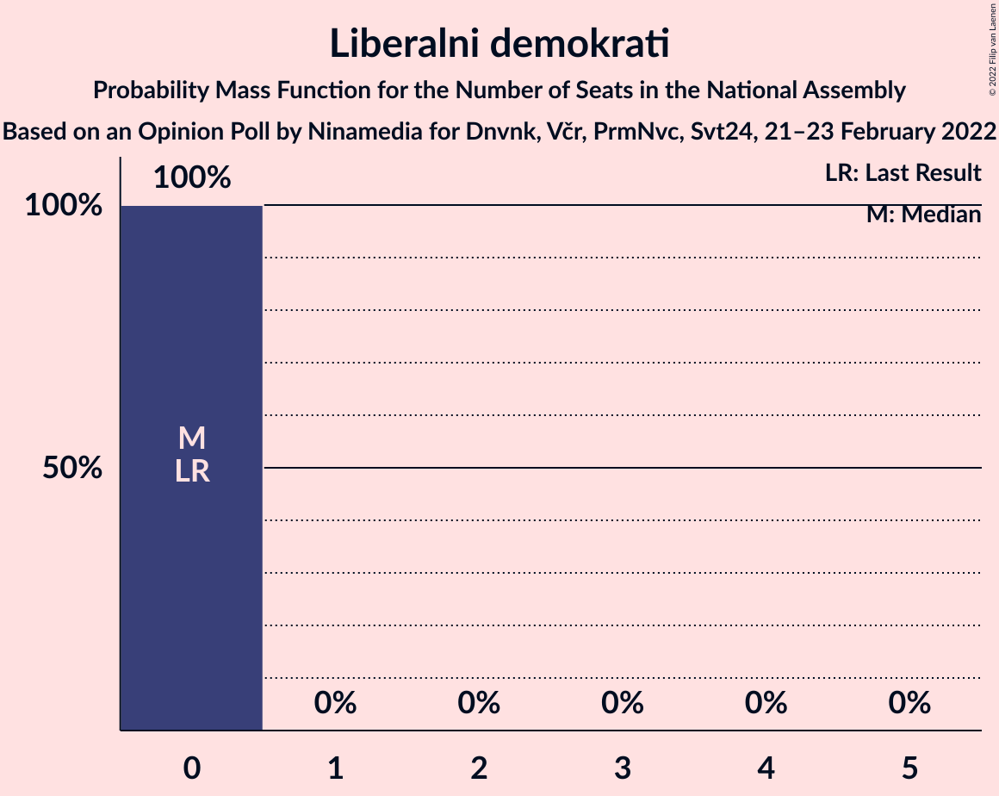
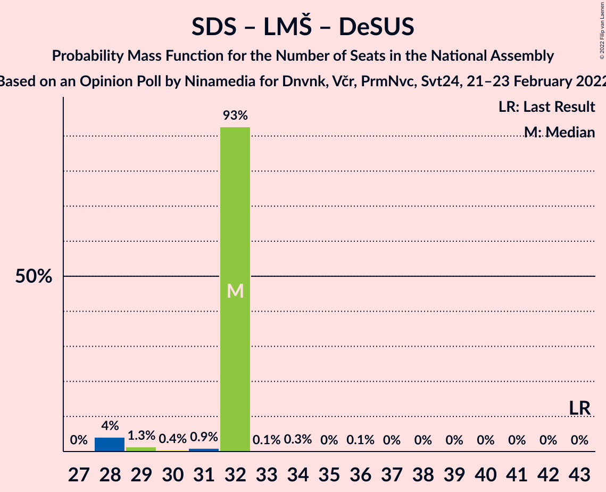

# Opinion Poll by Ninamedia for Dnvnk, Včr, PrmNvc, Svt24, 21–23 February 2022

<a href="#voting-intentions">Voting Intentions</a> | <a href="#seats">Seats</a> | <a href="#coalitions">Coalitions</a> | <a href="#technical-information">Technical Information</a>

## Voting Intentions

### Confidence Intervals

| Party | Last Result | Poll Result | 80% Confidence Interval | 90% Confidence Interval | 95% Confidence Interval | 99% Confidence Interval |
|:-----:|:-----------:|:-----------:|:-----------------------:|:-----------------------:|:-----------------------:|:-----------------------:|
| Gibanje Svoboda | 0.0% | 24.9% | 23.2–26.6% |22.7–27.1% |22.3–27.6% |21.6–28.4% |
| Slovenska demokratska stranka | 24.9% | 22.4% | 20.8–24.1% |20.3–24.6% |20.0–25.0% |19.2–25.8% |
| Socialni demokrati | 9.9% | 11.6% | 10.4–13.0% |10.1–13.4% |9.8–13.7% |9.3–14.4% |
| Levica | 9.3% | 9.2% | 8.2–10.5% |7.9–10.8% |7.6–11.2% |7.1–11.8% |
| Lista Marjana Šarca | 12.6% | 6.5% | 5.6–7.6% |5.3–7.9% |5.1–8.1% |4.7–8.7% |
| Nova Slovenija–Krščanski demokrati | 7.2% | 4.9% | 4.1–5.8% |3.9–6.1% |3.7–6.3% |3.4–6.8% |
| Stranka Alenke Bratušek | 5.1% | 4.1% | 3.4–5.0% |3.2–5.3% |3.0–5.5% |2.8–5.9% |
| Povežimo Slovenijo | 0.0% | 3.6% | 3.0–4.5% |2.8–4.7% |2.7–4.9% |2.4–5.4% |
| Naša dežela | 0.0% | 3.0% | 2.5–3.9% |2.3–4.1% |2.2–4.3% |1.9–4.7% |
| Resni.ca | 0.0% | 2.8% | 2.2–3.5% |2.1–3.7% |1.9–3.9% |1.7–4.3% |
| Piratska stranka Slovenije | 2.2% | 1.8% | 1.4–2.5% |1.2–2.7% |1.2–2.8% |1.0–3.2% |
| Liberalni demokrati | 0.0% | 1.3% | 1.0–1.9% |0.9–2.1% |0.8–2.2% |0.7–2.5% |
| Slovenska nacionalna stranka | 4.2% | 1.2% | 0.9–1.8% |0.8–2.0% |0.7–2.1% |0.6–2.4% |
| VESNA–Zelena stranka | 0.0% | 1.1% | 0.8–1.7% |0.7–1.8% |0.7–2.0% |0.5–2.3% |
| Demokratična stranka upokojencev Slovenije | 4.9% | 0.7% | 0.4–1.1% |0.4–1.2% |0.3–1.4% |0.2–1.6% |
| Dobra država | 1.5% | 0.5% | 0.3–0.9% |0.2–1.0% |0.2–1.1% |0.1–1.3% |

*Note:* The poll result column reflects the actual value used in the calculations. Published results may vary slightly, and in addition be rounded to fewer digits.

## Seats

### Confidence Intervals

| Party | Last Result | Median | 80% Confidence Interval | 90% Confidence Interval | 95% Confidence Interval | 99% Confidence Interval |
|:-----:|:-----------:|:------:|:-----------------------:|:-----------------------:|:-----------------------:|:-----------------------:|
| <a href="#gibanje-svoboda">Gibanje Svoboda</a> | 0 | 28 | 28 |28 |27–30 |23–30 |
| <a href="#slovenska-demokratska-stranka">Slovenska demokratska stranka</a> | 25 | 24 | 24 |23–24 |23–24 |22–26 |
| <a href="#socialni-demokrati">Socialni demokrati</a> | 10 | 13 | 13 |12–13 |11–13 |11–15 |
| <a href="#levica">Levica</a> | 9 | 10 | 10 |10 |9–11 |9–11 |
| <a href="#lista-marjana-šarca">Lista Marjana Šarca</a> | 13 | 8 | 8 |6–8 |5–8 |5–8 |
| <a href="#nova-slovenija–krščanski-demokrati">Nova Slovenija–Krščanski demokrati</a> | 7 | 0 | 0 |0–4 |0–5 |0–5 |
| <a href="#stranka-alenke-bratušek">Stranka Alenke Bratušek</a> | 5 | 5 | 5 |0–5 |0–5 |0–5 |
| <a href="#povežimo-slovenijo">Povežimo Slovenijo</a> | 0 | 0 | 0 |0–4 |0–4 |0–5 |
| <a href="#naša-dežela">Naša dežela</a> | 0 | 0 | 0 |0 |0 |0 |
| <a href="#resni.ca">Resni.ca</a> | 0 | 0 | 0 |0 |0 |0 |
| <a href="#piratska-stranka-slovenije">Piratska stranka Slovenije</a> | 0 | 0 | 0 |0 |0 |0 |
| <a href="#liberalni-demokrati">Liberalni demokrati</a> | 0 | 0 | 0 |0 |0 |0 |
| <a href="#slovenska-nacionalna-stranka">Slovenska nacionalna stranka</a> | 4 | 0 | 0 |0 |0 |0 |
| <a href="#vesna–zelena-stranka">VESNA–Zelena stranka</a> | 0 | 0 | 0 |0 |0 |0 |
| <a href="#demokratična-stranka-upokojencev-slovenije">Demokratična stranka upokojencev Slovenije</a> | 5 | 0 | 0 |0 |0 |0 |
| <a href="#dobra-država">Dobra država</a> | 0 | 0 | 0 |0 |0 |0 |

### Gibanje Svoboda

*For a full overview of the results for this party, see the [Gibanje Svoboda](party-gibanjesvoboda.html) page.*

| Number of Seats | Probability | Accumulated | Special Marks |
|:---------------:|:-----------:|:-----------:|:-------------:|
| 0 | 0% | 100% | Last Result |
| 1 | 0% | 100% |  |
| 2 | 0% | 100% |  |
| 3 | 0% | 100% |  |
| 4 | 0% | 100% |  |
| 5 | 0% | 100% |  |
| 6 | 0% | 100% |  |
| 7 | 0% | 100% |  |
| 8 | 0% | 100% |  |
| 9 | 0% | 100% |  |
| 10 | 0% | 100% |  |
| 11 | 0% | 100% |  |
| 12 | 0% | 100% |  |
| 13 | 0% | 100% |  |
| 14 | 0% | 100% |  |
| 15 | 0% | 100% |  |
| 16 | 0% | 100% |  |
| 17 | 0% | 100% |  |
| 18 | 0% | 100% |  |
| 19 | 0% | 100% |  |
| 20 | 0% | 100% |  |
| 21 | 0% | 100% |  |
| 22 | 0% | 100% |  |
| 23 | 0.9% | 100% |  |
| 24 | 0.3% | 99.0% |  |
| 25 | 0.4% | 98.8% |  |
| 26 | 0.8% | 98% |  |
| 27 | 1.1% | 98% |  |
| 28 | 92% | 96% | Median |
| 29 | 0.2% | 4% |  |
| 30 | 4% | 4% |  |
| 31 | 0% | 0% |  |

### Slovenska demokratska stranka

*For a full overview of the results for this party, see the [Slovenska demokratska stranka](party-slovenskademokratskastranka.html) page.*

| Number of Seats | Probability | Accumulated | Special Marks |
|:---------------:|:-----------:|:-----------:|:-------------:|
| 20 | 0% | 100% |  |
| 21 | 0% | 99.9% |  |
| 22 | 0.5% | 99.9% |  |
| 23 | 5% | 99.4% |  |
| 24 | 92% | 94% | Median |
| 25 | 1.2% | 2% | Last Result |
| 26 | 0.4% | 0.8% |  |
| 27 | 0.3% | 0.4% |  |
| 28 | 0.1% | 0.1% |  |
| 29 | 0% | 0% |  |

### Socialni demokrati

*For a full overview of the results for this party, see the [Socialni demokrati](party-socialnidemokrati.html) page.*

| Number of Seats | Probability | Accumulated | Special Marks |
|:---------------:|:-----------:|:-----------:|:-------------:|
| 10 | 0.1% | 100% | Last Result |
| 11 | 4% | 99.8% |  |
| 12 | 0.8% | 96% |  |
| 13 | 93% | 95% | Median |
| 14 | 0.5% | 2% |  |
| 15 | 1.0% | 1.1% |  |
| 16 | 0.1% | 0.1% |  |
| 17 | 0% | 0% |  |

### Levica

*For a full overview of the results for this party, see the [Levica](party-levica.html) page.*

| Number of Seats | Probability | Accumulated | Special Marks |
|:---------------:|:-----------:|:-----------:|:-------------:|
| 8 | 0.1% | 100% |  |
| 9 | 3% | 99.9% | Last Result |
| 10 | 93% | 97% | Median |
| 11 | 4% | 4% |  |
| 12 | 0.1% | 0.1% |  |
| 13 | 0% | 0% |  |

### Lista Marjana Šarca

*For a full overview of the results for this party, see the [Lista Marjana Šarca](party-listamarjanašarca.html) page.*

| Number of Seats | Probability | Accumulated | Special Marks |
|:---------------:|:-----------:|:-----------:|:-------------:|
| 5 | 4% | 100% |  |
| 6 | 3% | 96% |  |
| 7 | 0.8% | 93% |  |
| 8 | 92% | 92% | Median |
| 9 | 0% | 0% |  |
| 10 | 0% | 0% |  |
| 11 | 0% | 0% |  |
| 12 | 0% | 0% |  |
| 13 | 0% | 0% | Last Result |

### Nova Slovenija–Krščanski demokrati

*For a full overview of the results for this party, see the [Nova Slovenija–Krščanski demokrati](party-novaslovenija–krščanskidemokrati.html) page.*

| Number of Seats | Probability | Accumulated | Special Marks |
|:---------------:|:-----------:|:-----------:|:-------------:|
| 0 | 92% | 100% | Median |
| 1 | 0% | 8% |  |
| 2 | 0% | 8% |  |
| 3 | 0% | 8% |  |
| 4 | 4% | 8% |  |
| 5 | 3% | 3% |  |
| 6 | 0.3% | 0.3% |  |
| 7 | 0% | 0.1% | Last Result |
| 8 | 0% | 0% |  |

### Stranka Alenke Bratušek

*For a full overview of the results for this party, see the [Stranka Alenke Bratušek](party-strankaalenkebratušek.html) page.*

| Number of Seats | Probability | Accumulated | Special Marks |
|:---------------:|:-----------:|:-----------:|:-------------:|
| 0 | 7% | 100% |  |
| 1 | 0% | 93% |  |
| 2 | 0% | 93% |  |
| 3 | 0% | 93% |  |
| 4 | 0.4% | 93% |  |
| 5 | 92% | 93% | Last Result, Median |
| 6 | 0.3% | 0.3% |  |
| 7 | 0% | 0% |  |

### Povežimo Slovenijo

*For a full overview of the results for this party, see the [Povežimo Slovenijo](party-povežimoslovenijo.html) page.*

| Number of Seats | Probability | Accumulated | Special Marks |
|:---------------:|:-----------:|:-----------:|:-------------:|
| 0 | 93% | 100% | Last Result, Median |
| 1 | 0% | 7% |  |
| 2 | 0% | 7% |  |
| 3 | 0% | 7% |  |
| 4 | 5% | 7% |  |
| 5 | 2% | 2% |  |
| 6 | 0% | 0% |  |

### Naša dežela

*For a full overview of the results for this party, see the [Naša dežela](party-našadežela.html) page.*

| Number of Seats | Probability | Accumulated | Special Marks |
|:---------------:|:-----------:|:-----------:|:-------------:|
| 0 | 99.7% | 100% | Last Result, Median |
| 1 | 0% | 0.3% |  |
| 2 | 0% | 0.3% |  |
| 3 | 0% | 0.3% |  |
| 4 | 0.3% | 0.3% |  |
| 5 | 0% | 0% |  |

### Resni.ca

*For a full overview of the results for this party, see the [Resni.ca](party-resnica.html) page.*

| Number of Seats | Probability | Accumulated | Special Marks |
|:---------------:|:-----------:|:-----------:|:-------------:|
| 0 | 100% | 100% | Last Result, Median |

### Piratska stranka Slovenije

*For a full overview of the results for this party, see the [Piratska stranka Slovenije](party-piratskastrankaslovenije.html) page.*

| Number of Seats | Probability | Accumulated | Special Marks |
|:---------------:|:-----------:|:-----------:|:-------------:|
| 0 | 100% | 100% | Last Result, Median |

### Liberalni demokrati

*For a full overview of the results for this party, see the [Liberalni demokrati](party-liberalnidemokrati.html) page.*

| Number of Seats | Probability | Accumulated | Special Marks |
|:---------------:|:-----------:|:-----------:|:-------------:|
| 0 | 100% | 100% | Last Result, Median |

### Slovenska nacionalna stranka

*For a full overview of the results for this party, see the [Slovenska nacionalna stranka](party-slovenskanacionalnastranka.html) page.*

| Number of Seats | Probability | Accumulated | Special Marks |
|:---------------:|:-----------:|:-----------:|:-------------:|
| 0 | 100% | 100% | Median |
| 1 | 0% | 0% |  |
| 2 | 0% | 0% |  |
| 3 | 0% | 0% |  |
| 4 | 0% | 0% | Last Result |

### VESNA–Zelena stranka

*For a full overview of the results for this party, see the [VESNA–Zelena stranka](party-vesna–zelenastranka.html) page.*

| Number of Seats | Probability | Accumulated | Special Marks |
|:---------------:|:-----------:|:-----------:|:-------------:|
| 0 | 100% | 100% | Last Result, Median |

### Demokratična stranka upokojencev Slovenije

*For a full overview of the results for this party, see the [Demokratična stranka upokojencev Slovenije](party-demokratičnastrankaupokojencevslovenije.html) page.*

| Number of Seats | Probability | Accumulated | Special Marks |
|:---------------:|:-----------:|:-----------:|:-------------:|
| 0 | 100% | 100% | Median |
| 1 | 0% | 0% |  |
| 2 | 0% | 0% |  |
| 3 | 0% | 0% |  |
| 4 | 0% | 0% |  |
| 5 | 0% | 0% | Last Result |

### Dobra država

*For a full overview of the results for this party, see the [Dobra država](party-dobradržava.html) page.*

| Number of Seats | Probability | Accumulated | Special Marks |
|:---------------:|:-----------:|:-----------:|:-------------:|
| 0 | 100% | 100% | Last Result, Median |

## Coalitions

### Confidence Intervals

| Coalition | Last Result | Median | Majority? | 80% Confidence Interval | 90% Confidence Interval | 95% Confidence Interval | 99% Confidence Interval |
|:---------:|:-----------:|:------:|:---------:|:-----------------------:|:-----------------------:|:-----------------------:|:-----------------------:|
| Slovenska demokratska stranka – Lista Marjana Šarca – Demokratična stranka upokojencev Slovenije | 43 | 32 | 0% | 32 | 29–32 | 28–32 | 28–32 |
| Slovenska demokratska stranka – Lista Marjana Šarca | 38 | 32 | 0% | 32 | 29–32 | 28–32 | 28–32 |
| Socialni demokrati – Lista Marjana Šarca – Nova Slovenija–Krščanski demokrati – Demokratična stranka upokojencev Slovenije | 35 | 21 | 0% | 21 | 21 | 20–24 | 20–26 |
| Socialni demokrati – Lista Marjana Šarca – Nova Slovenija–Krščanski demokrati | 30 | 21 | 0% | 21 | 21 | 20–24 | 20–26 |
| Socialni demokrati – Lista Marjana Šarca – Demokratična stranka upokojencev Slovenije | 28 | 21 | 0% | 21 | 19–21 | 16–21 | 16–21 |
| Socialni demokrati – Lista Marjana Šarca | 23 | 21 | 0% | 21 | 19–21 | 16–21 | 16–21 |

### Slovenska demokratska stranka – Lista Marjana Šarca – Demokratična stranka upokojencev Slovenije

| Number of Seats | Probability | Accumulated | Special Marks |
|:---------------:|:-----------:|:-----------:|:-------------:|
| 27 | 0% | 100% |  |
| 28 | 4% | 99.9% |  |
| 29 | 1.3% | 96% |  |
| 30 | 0.4% | 94% |  |
| 31 | 0.9% | 94% |  |
| 32 | 93% | 93% | Median |
| 33 | 0.1% | 0.4% |  |
| 34 | 0.3% | 0.4% |  |
| 35 | 0% | 0.1% |  |
| 36 | 0.1% | 0.1% |  |
| 37 | 0% | 0% |  |
| 38 | 0% | 0% |  |
| 39 | 0% | 0% |  |
| 40 | 0% | 0% |  |
| 41 | 0% | 0% |  |
| 42 | 0% | 0% |  |
| 43 | 0% | 0% | Last Result |

### Slovenska demokratska stranka – Lista Marjana Šarca

| Number of Seats | Probability | Accumulated | Special Marks |
|:---------------:|:-----------:|:-----------:|:-------------:|
| 27 | 0% | 100% |  |
| 28 | 4% | 99.9% |  |
| 29 | 1.3% | 96% |  |
| 30 | 0.4% | 94% |  |
| 31 | 0.9% | 94% |  |
| 32 | 93% | 93% | Median |
| 33 | 0.1% | 0.4% |  |
| 34 | 0.3% | 0.4% |  |
| 35 | 0% | 0.1% |  |
| 36 | 0.1% | 0.1% |  |
| 37 | 0% | 0% |  |
| 38 | 0% | 0% | Last Result |

### Socialni demokrati – Lista Marjana Šarca – Nova Slovenija–Krščanski demokrati – Demokratična stranka upokojencev Slovenije

| Number of Seats | Probability | Accumulated | Special Marks |
|:---------------:|:-----------:|:-----------:|:-------------:|
| 19 | 0% | 100% |  |
| 20 | 4% | 99.9% |  |
| 21 | 92% | 96% | Median |
| 22 | 0.5% | 4% |  |
| 23 | 0.2% | 3% |  |
| 24 | 2% | 3% |  |
| 25 | 0% | 1.3% |  |
| 26 | 1.2% | 1.3% |  |
| 27 | 0.1% | 0.1% |  |
| 28 | 0% | 0% |  |
| 29 | 0% | 0% |  |
| 30 | 0% | 0% |  |
| 31 | 0% | 0% |  |
| 32 | 0% | 0% |  |
| 33 | 0% | 0% |  |
| 34 | 0% | 0% |  |
| 35 | 0% | 0% | Last Result |

### Socialni demokrati – Lista Marjana Šarca – Nova Slovenija–Krščanski demokrati

| Number of Seats | Probability | Accumulated | Special Marks |
|:---------------:|:-----------:|:-----------:|:-------------:|
| 19 | 0% | 100% |  |
| 20 | 4% | 99.9% |  |
| 21 | 92% | 96% | Median |
| 22 | 0.5% | 4% |  |
| 23 | 0.2% | 3% |  |
| 24 | 2% | 3% |  |
| 25 | 0% | 1.3% |  |
| 26 | 1.2% | 1.3% |  |
| 27 | 0.1% | 0.1% |  |
| 28 | 0% | 0% |  |
| 29 | 0% | 0% |  |
| 30 | 0% | 0% | Last Result |

### Socialni demokrati – Lista Marjana Šarca – Demokratična stranka upokojencev Slovenije

| Number of Seats | Probability | Accumulated | Special Marks |
|:---------------:|:-----------:|:-----------:|:-------------:|
| 16 | 4% | 100% |  |
| 17 | 0.3% | 96% |  |
| 18 | 0.5% | 96% |  |
| 19 | 2% | 95% |  |
| 20 | 0.1% | 94% |  |
| 21 | 93% | 94% | Median |
| 22 | 0.1% | 0.1% |  |
| 23 | 0% | 0.1% |  |
| 24 | 0.1% | 0.1% |  |
| 25 | 0% | 0% |  |
| 26 | 0% | 0% |  |
| 27 | 0% | 0% |  |
| 28 | 0% | 0% | Last Result |

### Socialni demokrati – Lista Marjana Šarca

| Number of Seats | Probability | Accumulated | Special Marks |
|:---------------:|:-----------:|:-----------:|:-------------:|
| 16 | 4% | 100% |  |
| 17 | 0.3% | 96% |  |
| 18 | 0.5% | 96% |  |
| 19 | 2% | 95% |  |
| 20 | 0.1% | 94% |  |
| 21 | 93% | 94% | Median |
| 22 | 0.1% | 0.1% |  |
| 23 | 0% | 0.1% | Last Result |
| 24 | 0.1% | 0.1% |  |
| 25 | 0% | 0% |  |

## Technical Information

### Opinion Poll

+ **Polling firm:** Ninamedia
+ **Commissioner(s):** Dnvnk, Včr, PrmNvc, Svt24
+ **Fieldwork period:** 21–23 February 2022

### Calculations

+ **Sample size:** 1050
+ **Simulations done:** 1,048,576
+ **Error estimate:** 2.16%

