# Opinion Poll by Mediana for POP TV, 21–24 February 2022

<a href="#voting-intentions">Voting Intentions</a> | <a href="#seats">Seats</a> | <a href="#coalitions">Coalitions</a> | <a href="#technical-information">Technical Information</a>

## Voting Intentions

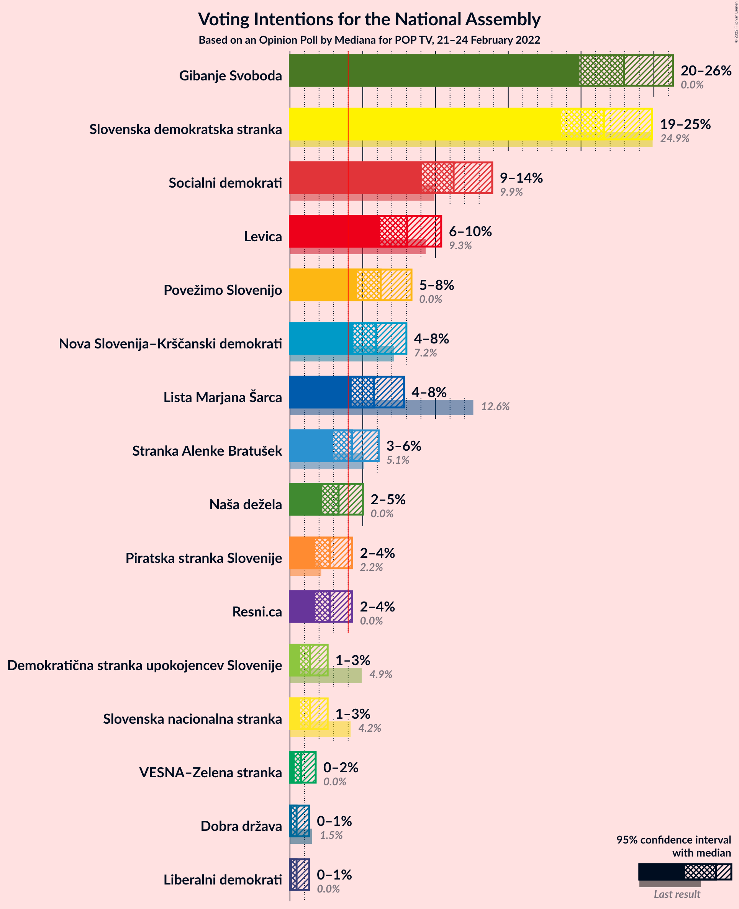

### Confidence Intervals

| Party | Last Result | Poll Result | 80% Confidence Interval | 90% Confidence Interval | 95% Confidence Interval | 99% Confidence Interval |
|:-----:|:-----------:|:-----------:|:-----------------------:|:-----------------------:|:-----------------------:|:-----------------------:|
| Gibanje Svoboda | 0.0% | 22.9% | 20.9–25.1% |20.4–25.8% |19.9–26.3% |19.0–27.4% |
| Slovenska demokratska stranka | 24.9% | 21.6% | 19.6–23.7% |19.1–24.4% |18.6–24.9% |17.7–26.0% |
| Socialni demokrati | 9.9% | 11.2% | 9.8–13.0% |9.4–13.5% |9.1–13.9% |8.4–14.8% |
| Levica | 9.3% | 8.1% | 6.8–9.6% |6.5–10.0% |6.2–10.4% |5.7–11.2% |
| Povežimo Slovenijo | 0.0% | 6.2% | 5.2–7.6% |4.9–8.0% |4.6–8.4% |4.2–9.1% |
| Nova Slovenija–Krščanski demokrati | 7.2% | 5.9% | 4.9–7.3% |4.6–7.7% |4.4–8.0% |3.9–8.7% |
| Lista Marjana Šarca | 12.6% | 5.8% | 4.8–7.1% |4.5–7.5% |4.2–7.8% |3.8–8.5% |
| Stranka Alenke Bratušek | 5.1% | 4.3% | 3.4–5.4% |3.2–5.8% |3.0–6.1% |2.6–6.7% |
| Naša dežela | 0.0% | 3.3% | 2.6–4.4% |2.4–4.7% |2.2–5.0% |1.9–5.6% |
| Piratska stranka Slovenije | 2.2% | 2.7% | 2.1–3.7% |1.9–4.0% |1.7–4.3% |1.5–4.8% |
| Resni.ca | 0.0% | 2.7% | 2.1–3.7% |1.9–4.0% |1.7–4.3% |1.5–4.8% |
| Demokratična stranka upokojencev Slovenije | 4.9% | 1.4% | 0.9–2.1% |0.8–2.4% |0.7–2.6% |0.6–3.0% |
| Slovenska nacionalna stranka | 4.2% | 1.4% | 0.9–2.1% |0.8–2.4% |0.7–2.6% |0.6–3.0% |
| VESNA–Zelena stranka | 0.0% | 0.8% | 0.5–1.4% |0.4–1.6% |0.3–1.8% |0.2–2.1% |
| Dobra država | 1.5% | 0.5% | 0.3–1.0% |0.2–1.2% |0.2–1.3% |0.1–1.7% |
| Liberalni demokrati | 0.0% | 0.5% | 0.3–1.0% |0.2–1.2% |0.2–1.3% |0.1–1.7% |

*Note:* The poll result column reflects the actual value used in the calculations. Published results may vary slightly, and in addition be rounded to fewer digits.

## Seats

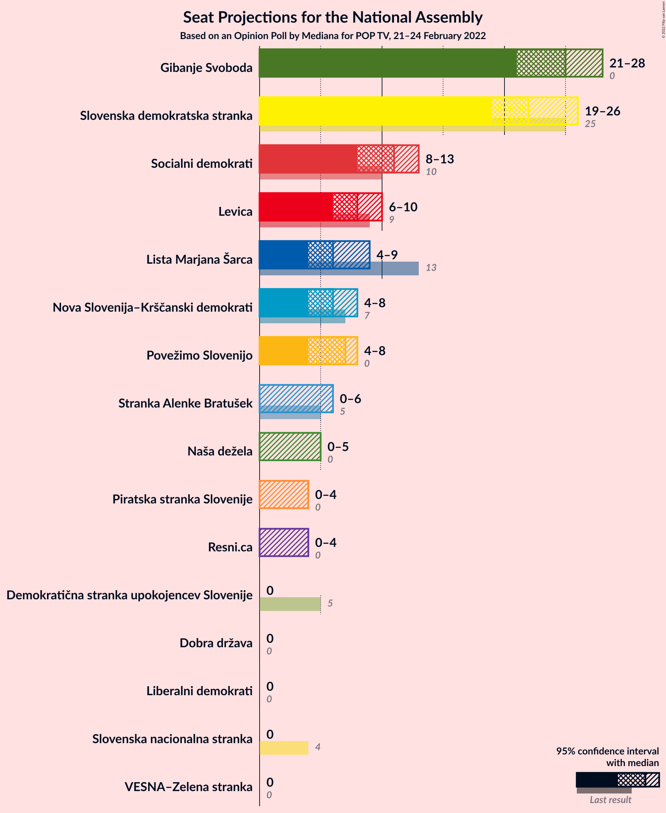

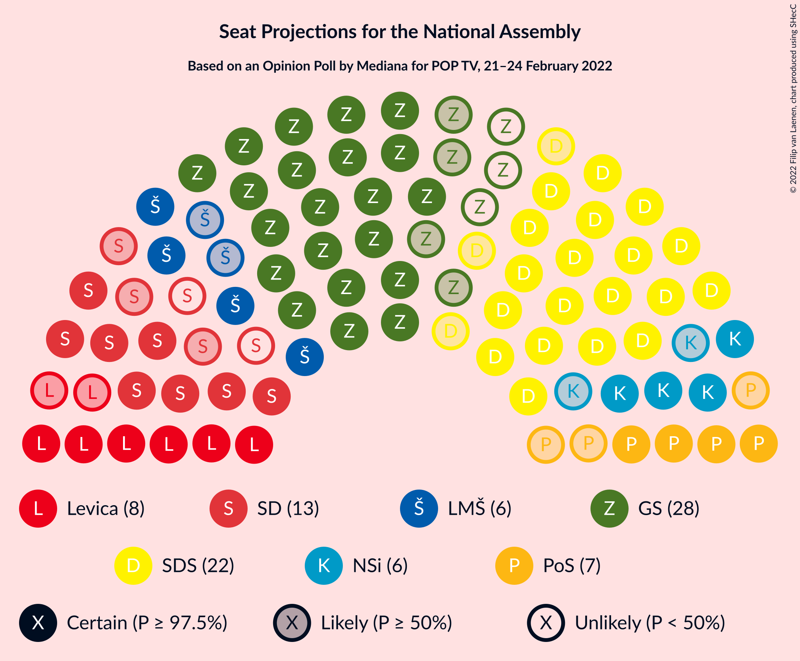

### Confidence Intervals

| Party | Last Result | Median | 80% Confidence Interval | 90% Confidence Interval | 95% Confidence Interval | 99% Confidence Interval |
|:-----:|:-----------:|:------:|:-----------------------:|:-----------------------:|:-----------------------:|:-----------------------:|
| <a href="#gibanje-svoboda">Gibanje Svoboda</a> | 0 | 25 | 22–28 |21–28 |21–28 |20–28 |
| <a href="#slovenska-demokratska-stranka">Slovenska demokratska stranka</a> | 25 | 22 | 20–25 |19–25 |19–26 |17–27 |
| <a href="#socialni-demokrati">Socialni demokrati</a> | 10 | 11 | 9–13 |8–13 |8–13 |8–16 |
| <a href="#levica">Levica</a> | 9 | 8 | 6–9 |6–9 |6–10 |5–11 |
| <a href="#povežimo-slovenijo">Povežimo Slovenijo</a> | 0 | 7 | 6–8 |5–8 |4–8 |0–8 |
| <a href="#nova-slovenija–krščanski-demokrati">Nova Slovenija–Krščanski demokrati</a> | 7 | 6 | 5–8 |5–8 |4–8 |4–9 |
| <a href="#lista-marjana-šarca">Lista Marjana Šarca</a> | 13 | 6 | 4–8 |4–9 |4–9 |4–9 |
| <a href="#stranka-alenke-bratušek">Stranka Alenke Bratušek</a> | 5 | 0 | 0–6 |0–6 |0–6 |0–6 |
| <a href="#naša-dežela">Naša dežela</a> | 0 | 0 | 0–4 |0–4 |0–5 |0–5 |
| <a href="#piratska-stranka-slovenije">Piratska stranka Slovenije</a> | 0 | 0 | 0–4 |0–4 |0–4 |0–4 |
| <a href="#resni.ca">Resni.ca</a> | 0 | 0 | 0 |0–4 |0–4 |0–5 |
| <a href="#demokratična-stranka-upokojencev-slovenije">Demokratična stranka upokojencev Slovenije</a> | 5 | 0 | 0 |0 |0 |0 |
| <a href="#slovenska-nacionalna-stranka">Slovenska nacionalna stranka</a> | 4 | 0 | 0 |0 |0 |0 |
| <a href="#vesna–zelena-stranka">VESNA–Zelena stranka</a> | 0 | 0 | 0 |0 |0 |0 |
| <a href="#dobra-država">Dobra država</a> | 0 | 0 | 0 |0 |0 |0 |
| <a href="#liberalni-demokrati">Liberalni demokrati</a> | 0 | 0 | 0 |0 |0 |0 |

### Gibanje Svoboda

*For a full overview of the results for this party, see the [Gibanje Svoboda](party-gibanjesvoboda.html) page.*

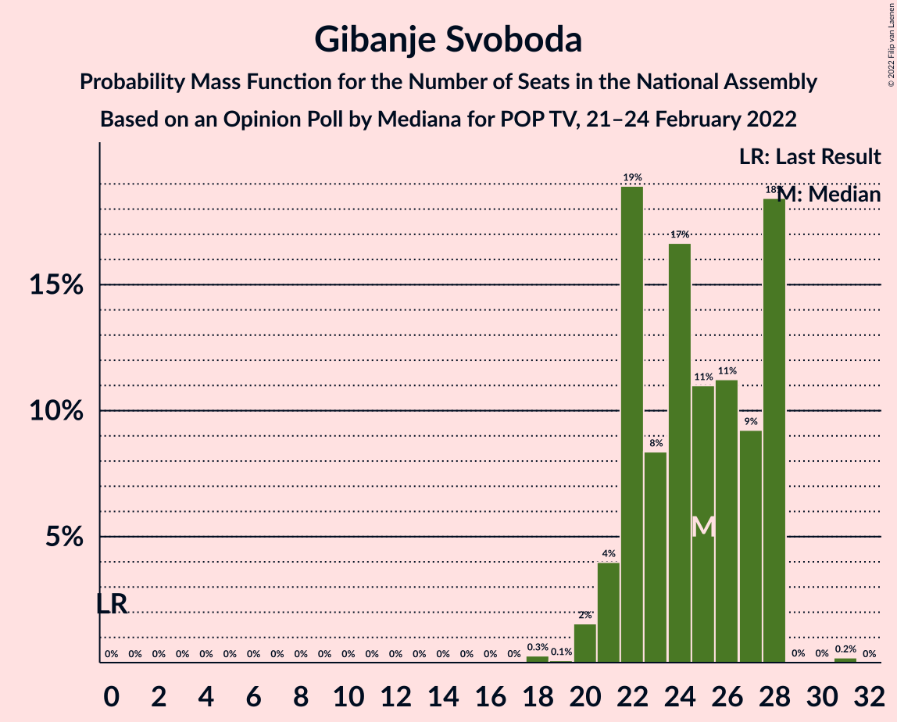

| Number of Seats | Probability | Accumulated | Special Marks |
|:---------------:|:-----------:|:-----------:|:-------------:|
| 0 | 0% | 100% | Last Result |
| 1 | 0% | 100% |  |
| 2 | 0% | 100% |  |
| 3 | 0% | 100% |  |
| 4 | 0% | 100% |  |
| 5 | 0% | 100% |  |
| 6 | 0% | 100% |  |
| 7 | 0% | 100% |  |
| 8 | 0% | 100% |  |
| 9 | 0% | 100% |  |
| 10 | 0% | 100% |  |
| 11 | 0% | 100% |  |
| 12 | 0% | 100% |  |
| 13 | 0% | 100% |  |
| 14 | 0% | 100% |  |
| 15 | 0% | 100% |  |
| 16 | 0% | 100% |  |
| 17 | 0% | 100% |  |
| 18 | 0.3% | 100% |  |
| 19 | 0.1% | 99.7% |  |
| 20 | 2% | 99.6% |  |
| 21 | 4% | 98% |  |
| 22 | 19% | 94% |  |
| 23 | 8% | 75% |  |
| 24 | 17% | 67% |  |
| 25 | 11% | 50% | Median |
| 26 | 11% | 39% |  |
| 27 | 9% | 28% |  |
| 28 | 18% | 19% |  |
| 29 | 0% | 0.3% |  |
| 30 | 0% | 0.2% |  |
| 31 | 0.2% | 0.2% |  |
| 32 | 0% | 0% |  |

### Slovenska demokratska stranka

*For a full overview of the results for this party, see the [Slovenska demokratska stranka](party-slovenskademokratskastranka.html) page.*

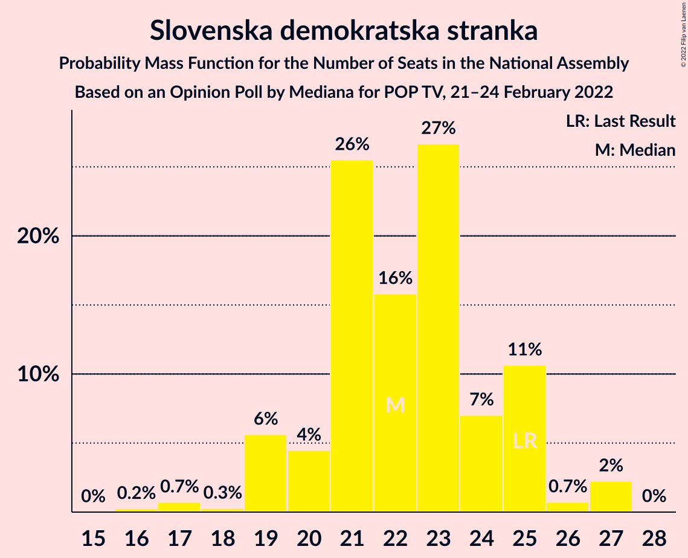

| Number of Seats | Probability | Accumulated | Special Marks |
|:---------------:|:-----------:|:-----------:|:-------------:|
| 16 | 0.2% | 100% |  |
| 17 | 0.7% | 99.7% |  |
| 18 | 0.3% | 99.0% |  |
| 19 | 6% | 98.8% |  |
| 20 | 4% | 93% |  |
| 21 | 26% | 89% |  |
| 22 | 16% | 63% | Median |
| 23 | 27% | 47% |  |
| 24 | 7% | 21% |  |
| 25 | 11% | 14% | Last Result |
| 26 | 0.7% | 3% |  |
| 27 | 2% | 2% |  |
| 28 | 0% | 0% |  |

### Socialni demokrati

*For a full overview of the results for this party, see the [Socialni demokrati](party-socialnidemokrati.html) page.*

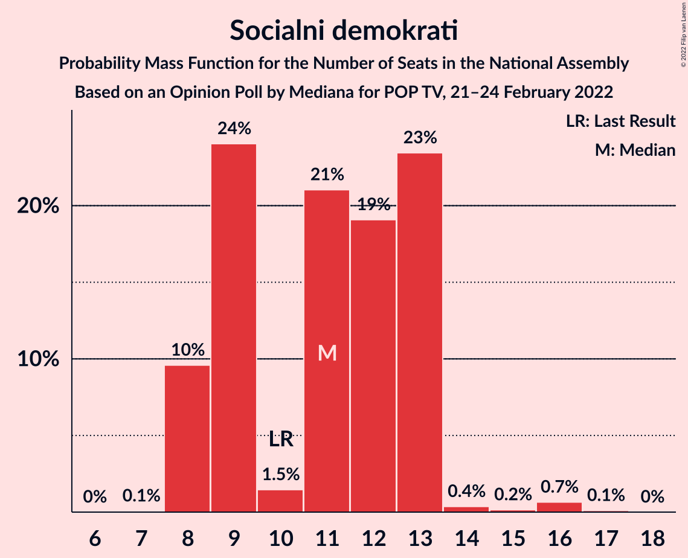

| Number of Seats | Probability | Accumulated | Special Marks |
|:---------------:|:-----------:|:-----------:|:-------------:|
| 7 | 0.1% | 100% |  |
| 8 | 10% | 99.9% |  |
| 9 | 24% | 90% |  |
| 10 | 1.5% | 66% | Last Result |
| 11 | 21% | 65% | Median |
| 12 | 19% | 44% |  |
| 13 | 23% | 25% |  |
| 14 | 0.4% | 1.3% |  |
| 15 | 0.2% | 0.9% |  |
| 16 | 0.7% | 0.8% |  |
| 17 | 0.1% | 0.1% |  |
| 18 | 0% | 0% |  |

### Levica

*For a full overview of the results for this party, see the [Levica](party-levica.html) page.*

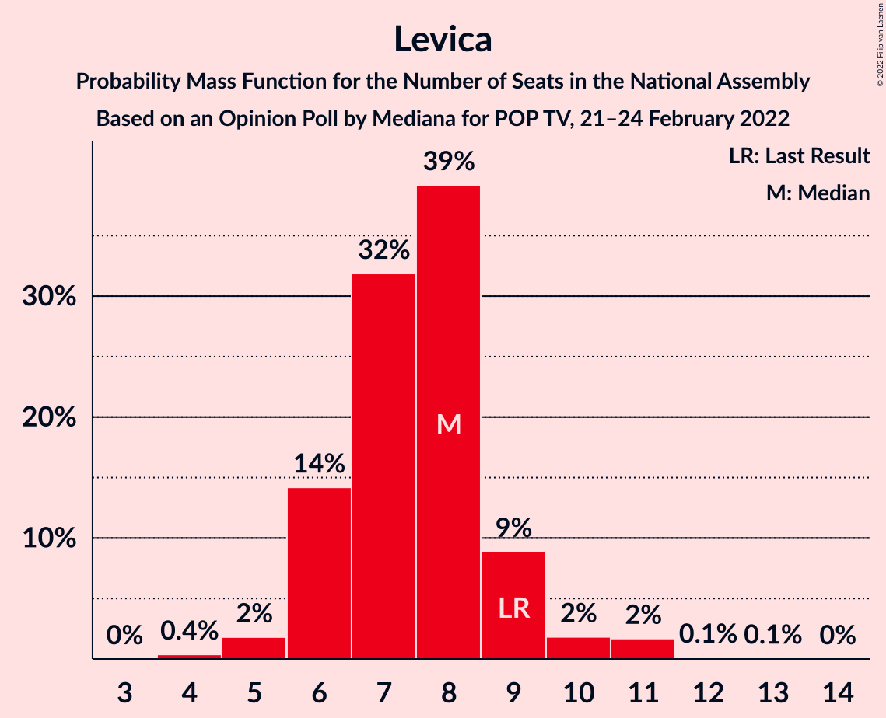

| Number of Seats | Probability | Accumulated | Special Marks |
|:---------------:|:-----------:|:-----------:|:-------------:|
| 4 | 0.4% | 100% |  |
| 5 | 2% | 99.6% |  |
| 6 | 14% | 98% |  |
| 7 | 32% | 84% |  |
| 8 | 39% | 52% | Median |
| 9 | 9% | 13% | Last Result |
| 10 | 2% | 4% |  |
| 11 | 2% | 2% |  |
| 12 | 0.1% | 0.2% |  |
| 13 | 0.1% | 0.1% |  |
| 14 | 0% | 0% |  |

### Povežimo Slovenijo

*For a full overview of the results for this party, see the [Povežimo Slovenijo](party-povežimoslovenijo.html) page.*

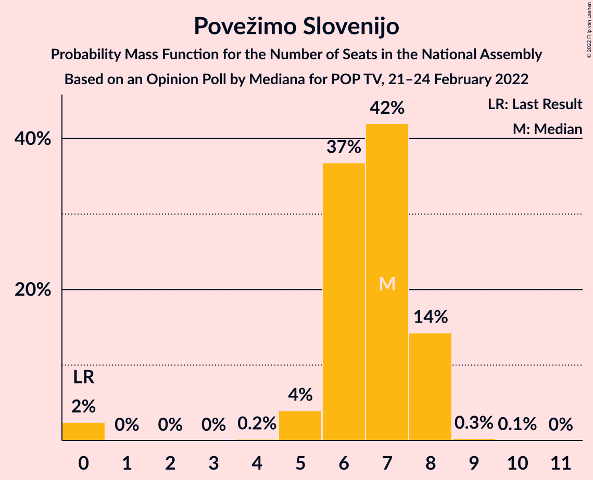

| Number of Seats | Probability | Accumulated | Special Marks |
|:---------------:|:-----------:|:-----------:|:-------------:|
| 0 | 2% | 100% | Last Result |
| 1 | 0% | 98% |  |
| 2 | 0% | 98% |  |
| 3 | 0% | 98% |  |
| 4 | 0.2% | 98% |  |
| 5 | 4% | 97% |  |
| 6 | 37% | 93% |  |
| 7 | 42% | 57% | Median |
| 8 | 14% | 15% |  |
| 9 | 0.3% | 0.4% |  |
| 10 | 0.1% | 0.1% |  |
| 11 | 0% | 0% |  |

### Nova Slovenija–Krščanski demokrati

*For a full overview of the results for this party, see the [Nova Slovenija–Krščanski demokrati](party-novaslovenija–krščanskidemokrati.html) page.*

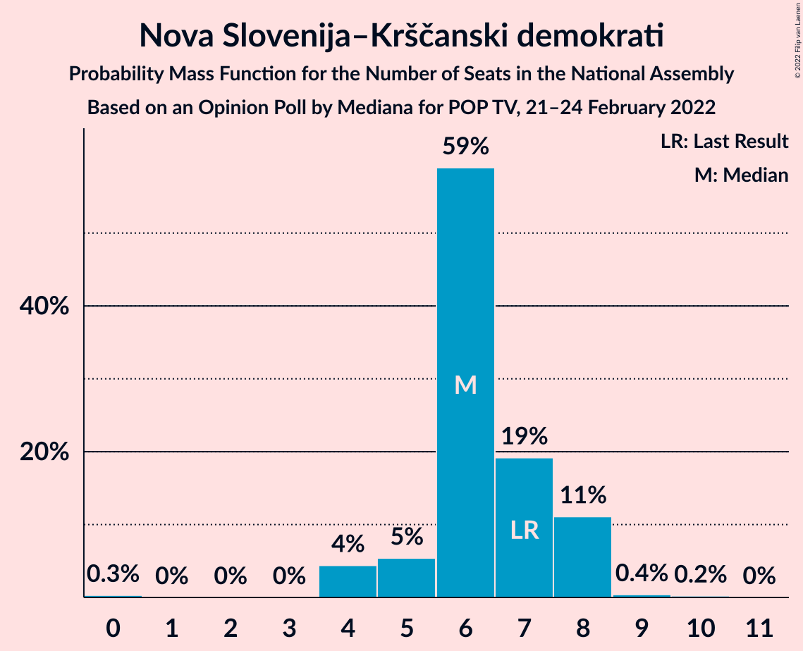

| Number of Seats | Probability | Accumulated | Special Marks |
|:---------------:|:-----------:|:-----------:|:-------------:|
| 0 | 0.3% | 100% |  |
| 1 | 0% | 99.7% |  |
| 2 | 0% | 99.7% |  |
| 3 | 0% | 99.7% |  |
| 4 | 4% | 99.7% |  |
| 5 | 5% | 95% |  |
| 6 | 59% | 90% | Median |
| 7 | 19% | 31% | Last Result |
| 8 | 11% | 12% |  |
| 9 | 0.4% | 0.6% |  |
| 10 | 0.2% | 0.2% |  |
| 11 | 0% | 0% |  |

### Lista Marjana Šarca

*For a full overview of the results for this party, see the [Lista Marjana Šarca](party-listamarjanašarca.html) page.*

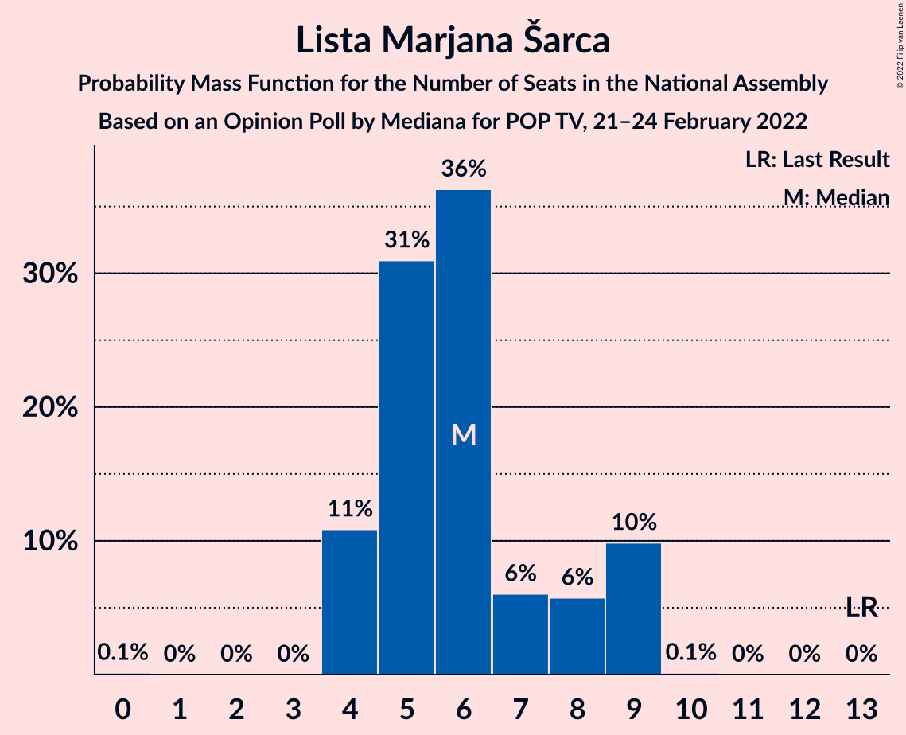

| Number of Seats | Probability | Accumulated | Special Marks |
|:---------------:|:-----------:|:-----------:|:-------------:|
| 0 | 0.1% | 100% |  |
| 1 | 0% | 99.9% |  |
| 2 | 0% | 99.9% |  |
| 3 | 0% | 99.9% |  |
| 4 | 11% | 99.9% |  |
| 5 | 31% | 89% |  |
| 6 | 36% | 58% | Median |
| 7 | 6% | 22% |  |
| 8 | 6% | 16% |  |
| 9 | 10% | 10% |  |
| 10 | 0.1% | 0.1% |  |
| 11 | 0% | 0% |  |
| 12 | 0% | 0% |  |
| 13 | 0% | 0% | Last Result |

### Stranka Alenke Bratušek

*For a full overview of the results for this party, see the [Stranka Alenke Bratušek](party-strankaalenkebratušek.html) page.*

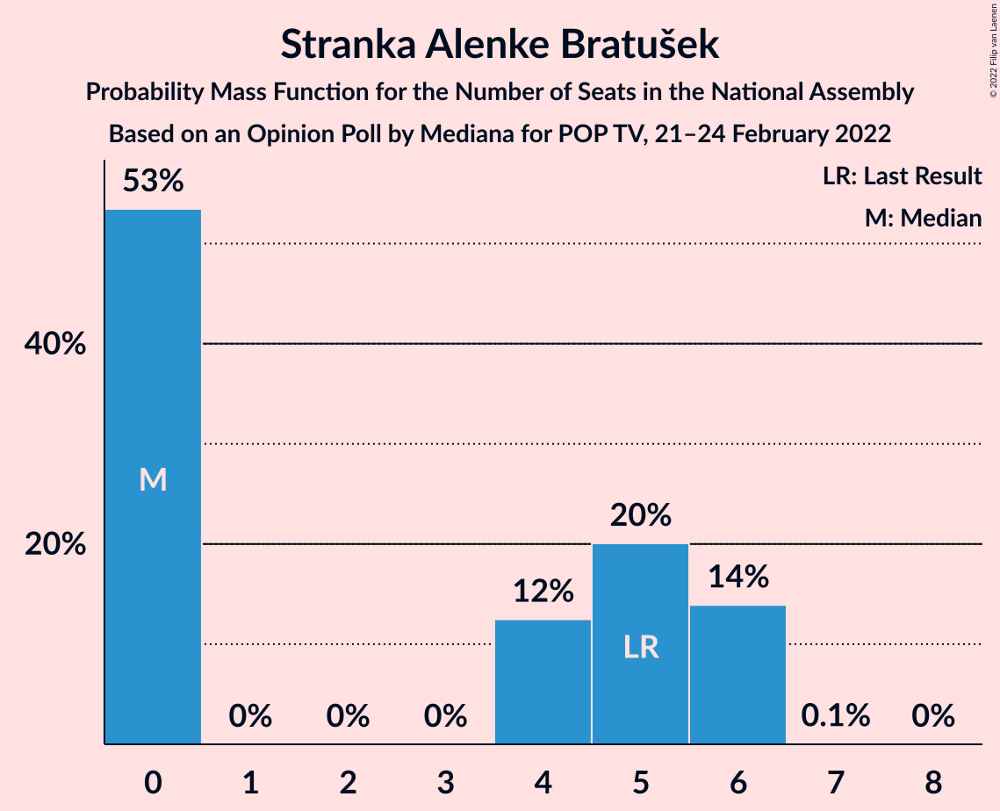

| Number of Seats | Probability | Accumulated | Special Marks |
|:---------------:|:-----------:|:-----------:|:-------------:|
| 0 | 53% | 100% | Median |
| 1 | 0% | 47% |  |
| 2 | 0% | 47% |  |
| 3 | 0% | 47% |  |
| 4 | 12% | 47% |  |
| 5 | 20% | 34% | Last Result |
| 6 | 14% | 14% |  |
| 7 | 0.1% | 0.1% |  |
| 8 | 0% | 0% |  |

### Naša dežela

*For a full overview of the results for this party, see the [Naša dežela](party-našadežela.html) page.*

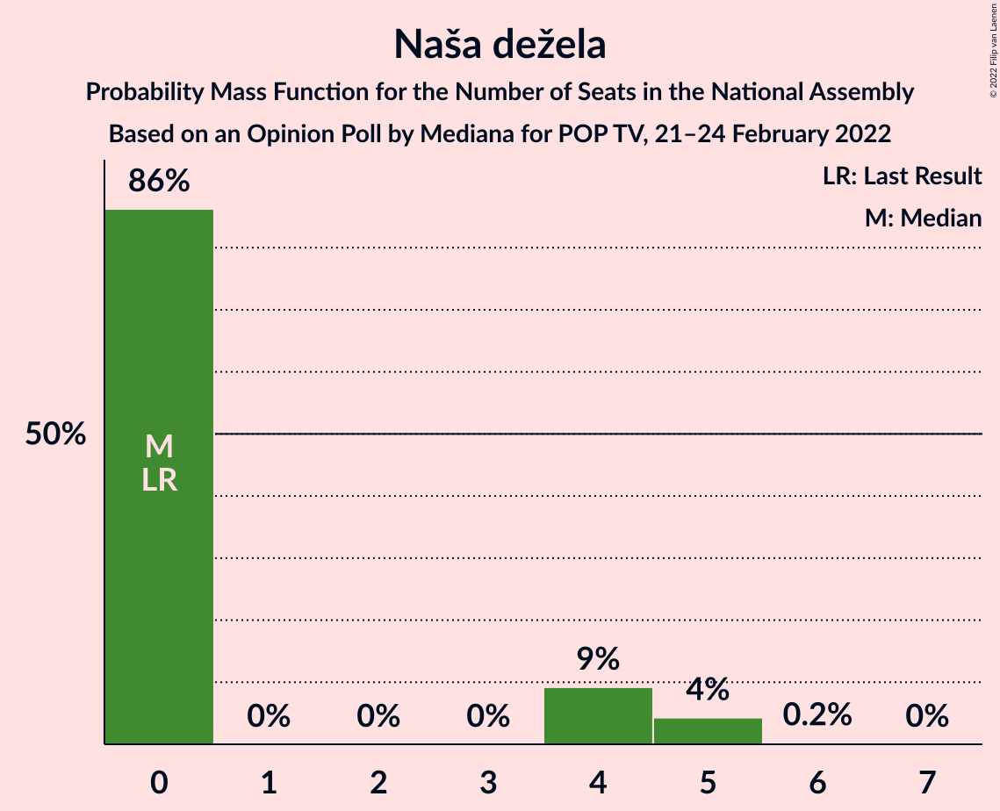

| Number of Seats | Probability | Accumulated | Special Marks |
|:---------------:|:-----------:|:-----------:|:-------------:|
| 0 | 86% | 100% | Last Result, Median |
| 1 | 0% | 14% |  |
| 2 | 0% | 14% |  |
| 3 | 0% | 14% |  |
| 4 | 9% | 14% |  |
| 5 | 4% | 5% |  |
| 6 | 0.2% | 0.2% |  |
| 7 | 0% | 0% |  |

### Piratska stranka Slovenije

*For a full overview of the results for this party, see the [Piratska stranka Slovenije](party-piratskastrankaslovenije.html) page.*

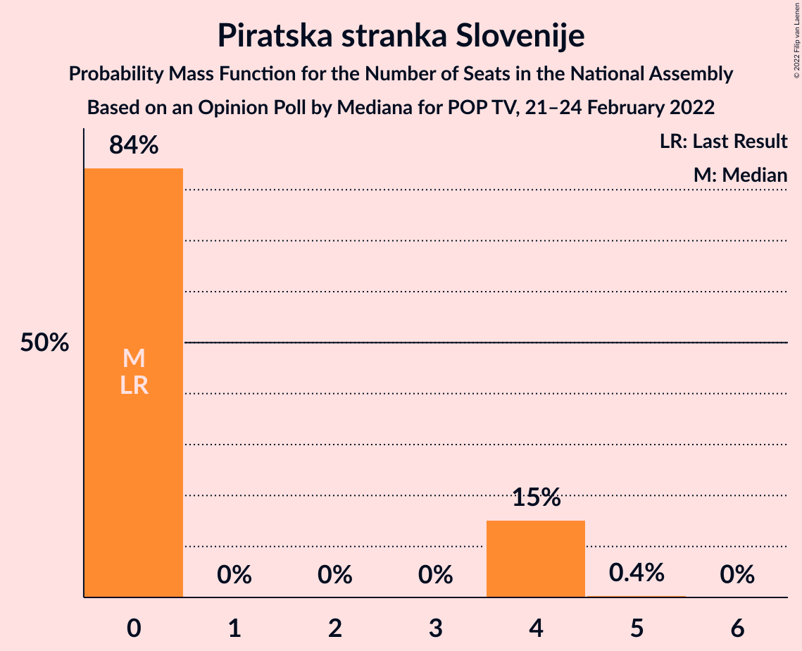

| Number of Seats | Probability | Accumulated | Special Marks |
|:---------------:|:-----------:|:-----------:|:-------------:|
| 0 | 84% | 100% | Last Result, Median |
| 1 | 0% | 16% |  |
| 2 | 0% | 16% |  |
| 3 | 0% | 16% |  |
| 4 | 15% | 16% |  |
| 5 | 0.4% | 0.5% |  |
| 6 | 0% | 0% |  |

### Resni.ca

*For a full overview of the results for this party, see the [Resni.ca](party-resnica.html) page.*

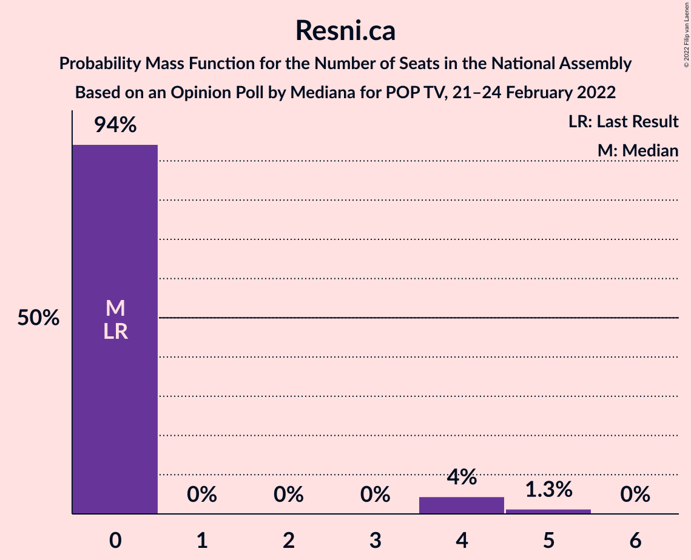

| Number of Seats | Probability | Accumulated | Special Marks |
|:---------------:|:-----------:|:-----------:|:-------------:|
| 0 | 94% | 100% | Last Result, Median |
| 1 | 0% | 6% |  |
| 2 | 0% | 6% |  |
| 3 | 0% | 6% |  |
| 4 | 4% | 6% |  |
| 5 | 1.3% | 1.3% |  |
| 6 | 0% | 0% |  |

### Demokratična stranka upokojencev Slovenije

*For a full overview of the results for this party, see the [Demokratična stranka upokojencev Slovenije](party-demokratičnastrankaupokojencevslovenije.html) page.*

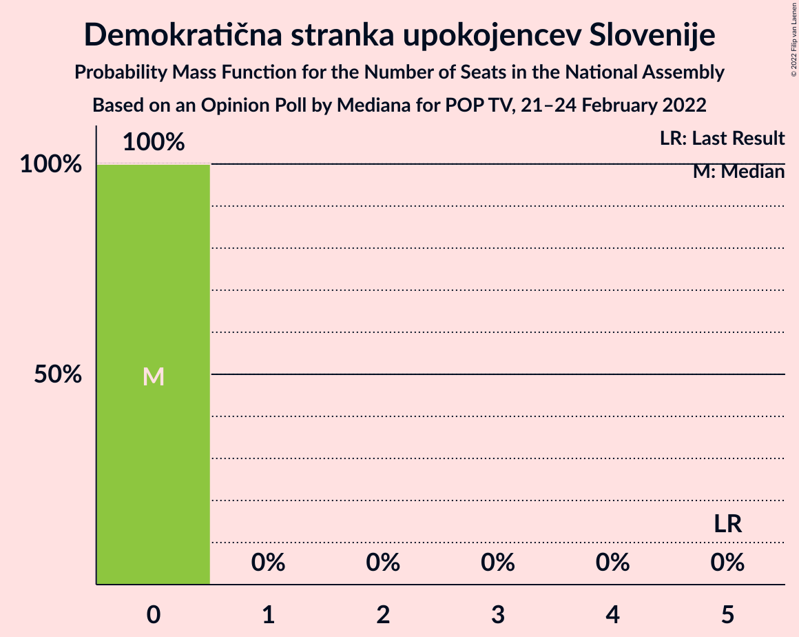

| Number of Seats | Probability | Accumulated | Special Marks |
|:---------------:|:-----------:|:-----------:|:-------------:|
| 0 | 100% | 100% | Median |
| 1 | 0% | 0% |  |
| 2 | 0% | 0% |  |
| 3 | 0% | 0% |  |
| 4 | 0% | 0% |  |
| 5 | 0% | 0% | Last Result |

### Slovenska nacionalna stranka

*For a full overview of the results for this party, see the [Slovenska nacionalna stranka](party-slovenskanacionalnastranka.html) page.*

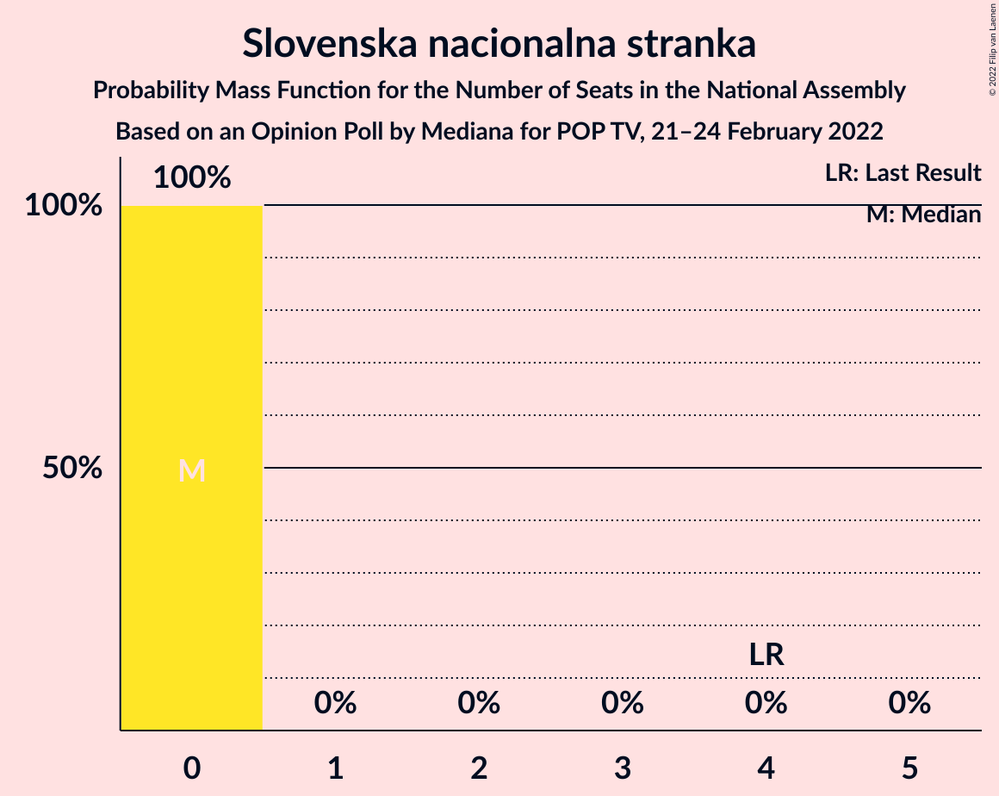

| Number of Seats | Probability | Accumulated | Special Marks |
|:---------------:|:-----------:|:-----------:|:-------------:|
| 0 | 100% | 100% | Median |
| 1 | 0% | 0% |  |
| 2 | 0% | 0% |  |
| 3 | 0% | 0% |  |
| 4 | 0% | 0% | Last Result |

### VESNA–Zelena stranka

*For a full overview of the results for this party, see the [VESNA–Zelena stranka](party-vesna–zelenastranka.html) page.*

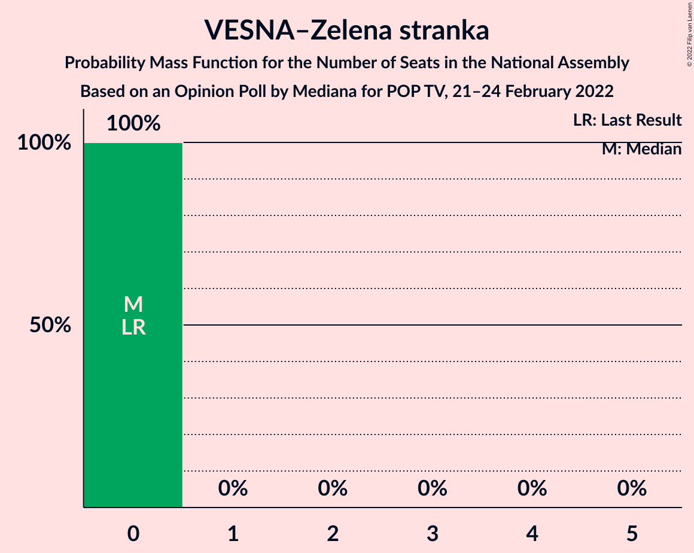

| Number of Seats | Probability | Accumulated | Special Marks |
|:---------------:|:-----------:|:-----------:|:-------------:|
| 0 | 100% | 100% | Last Result, Median |

### Dobra država

*For a full overview of the results for this party, see the [Dobra država](party-dobradržava.html) page.*

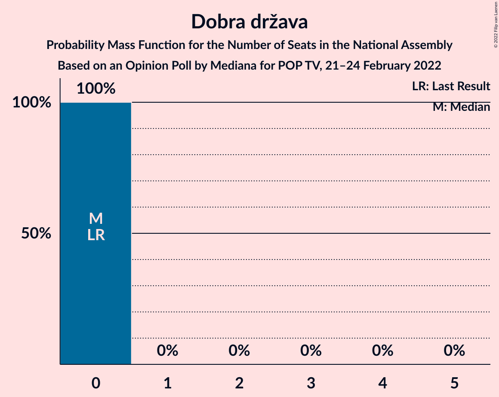

| Number of Seats | Probability | Accumulated | Special Marks |
|:---------------:|:-----------:|:-----------:|:-------------:|
| 0 | 100% | 100% | Last Result, Median |

### Liberalni demokrati

*For a full overview of the results for this party, see the [Liberalni demokrati](party-liberalnidemokrati.html) page.*

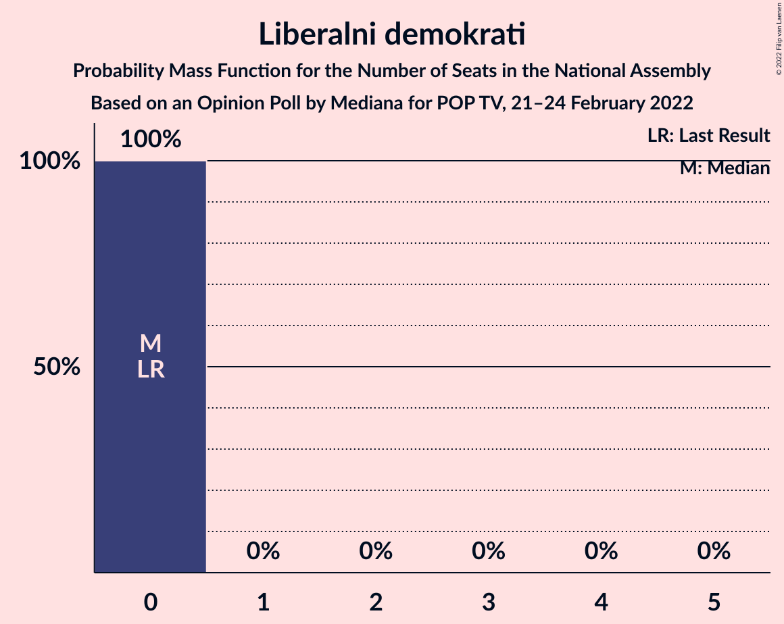

| Number of Seats | Probability | Accumulated | Special Marks |
|:---------------:|:-----------:|:-----------:|:-------------:|
| 0 | 100% | 100% | Last Result, Median |

## Coalitions

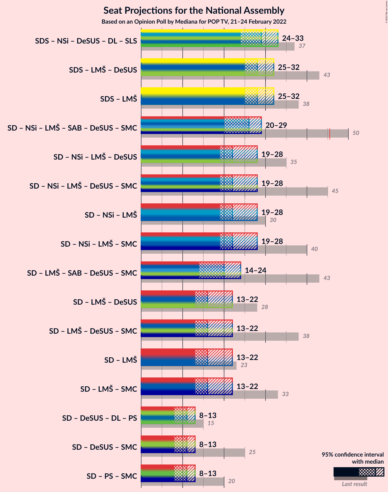

### Confidence Intervals

| Coalition | Last Result | Median | Majority? | 80% Confidence Interval | 90% Confidence Interval | 95% Confidence Interval | 99% Confidence Interval |
|:---------:|:-----------:|:------:|:---------:|:-----------------------:|:-----------------------:|:-----------------------:|:-----------------------:|
| Slovenska demokratska stranka – Lista Marjana Šarca – Demokratična stranka upokojencev Slovenije | 43 | 28 | 0% | 26–30 | 25–31 | 25–32 | 23–32 |
| Slovenska demokratska stranka – Lista Marjana Šarca | 38 | 28 | 0% | 26–30 | 25–31 | 25–32 | 23–32 |
| Socialni demokrati – Nova Slovenija–Krščanski demokrati – Lista Marjana Šarca – Demokratična stranka upokojencev Slovenije | 35 | 22 | 0% | 20–28 | 20–28 | 19–28 | 19–28 |
| Socialni demokrati – Nova Slovenija–Krščanski demokrati – Lista Marjana Šarca | 30 | 22 | 0% | 20–28 | 20–28 | 19–28 | 19–28 |
| Socialni demokrati – Lista Marjana Šarca – Demokratična stranka upokojencev Slovenije | 28 | 16 | 0% | 14–21 | 14–22 | 13–22 | 13–22 |
| Socialni demokrati – Lista Marjana Šarca | 23 | 16 | 0% | 14–21 | 14–22 | 13–22 | 13–22 |

### Slovenska demokratska stranka – Lista Marjana Šarca – Demokratična stranka upokojencev Slovenije

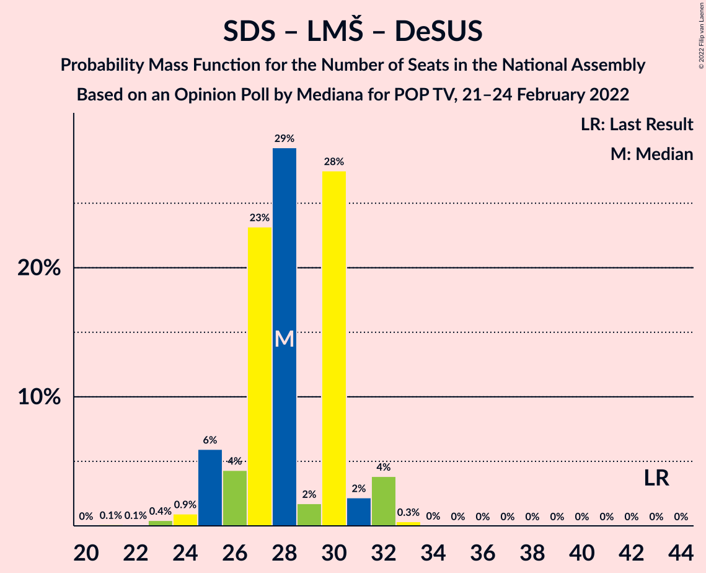

| Number of Seats | Probability | Accumulated | Special Marks |
|:---------------:|:-----------:|:-----------:|:-------------:|
| 21 | 0.1% | 100% |  |
| 22 | 0.1% | 99.9% |  |
| 23 | 0.4% | 99.8% |  |
| 24 | 0.9% | 99.3% |  |
| 25 | 6% | 98% |  |
| 26 | 4% | 92% |  |
| 27 | 23% | 88% |  |
| 28 | 29% | 65% | Median |
| 29 | 2% | 36% |  |
| 30 | 28% | 34% |  |
| 31 | 2% | 6% |  |
| 32 | 4% | 4% |  |
| 33 | 0.3% | 0.4% |  |
| 34 | 0% | 0.1% |  |
| 35 | 0% | 0% |  |
| 36 | 0% | 0% |  |
| 37 | 0% | 0% |  |
| 38 | 0% | 0% |  |
| 39 | 0% | 0% |  |
| 40 | 0% | 0% |  |
| 41 | 0% | 0% |  |
| 42 | 0% | 0% |  |
| 43 | 0% | 0% | Last Result |

### Slovenska demokratska stranka – Lista Marjana Šarca

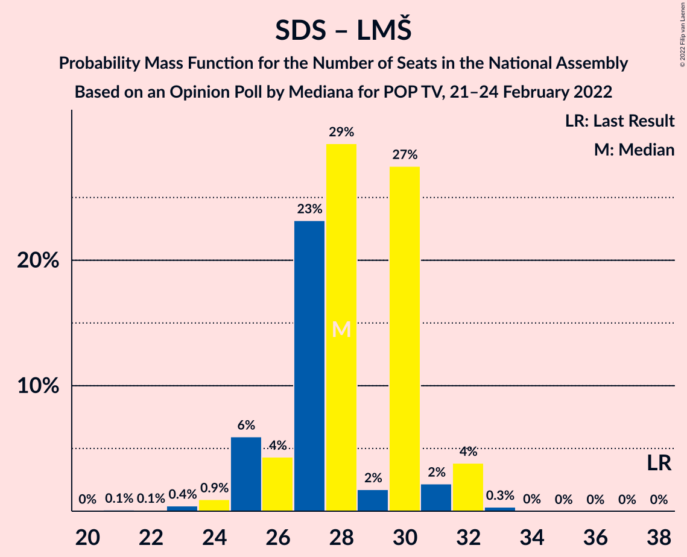

| Number of Seats | Probability | Accumulated | Special Marks |
|:---------------:|:-----------:|:-----------:|:-------------:|
| 21 | 0.1% | 100% |  |
| 22 | 0.1% | 99.9% |  |
| 23 | 0.4% | 99.8% |  |
| 24 | 0.9% | 99.3% |  |
| 25 | 6% | 98% |  |
| 26 | 4% | 92% |  |
| 27 | 23% | 88% |  |
| 28 | 29% | 65% | Median |
| 29 | 2% | 36% |  |
| 30 | 27% | 34% |  |
| 31 | 2% | 6% |  |
| 32 | 4% | 4% |  |
| 33 | 0.3% | 0.4% |  |
| 34 | 0% | 0.1% |  |
| 35 | 0% | 0% |  |
| 36 | 0% | 0% |  |
| 37 | 0% | 0% |  |
| 38 | 0% | 0% | Last Result |

### Socialni demokrati – Nova Slovenija–Krščanski demokrati – Lista Marjana Šarca – Demokratična stranka upokojencev Slovenije

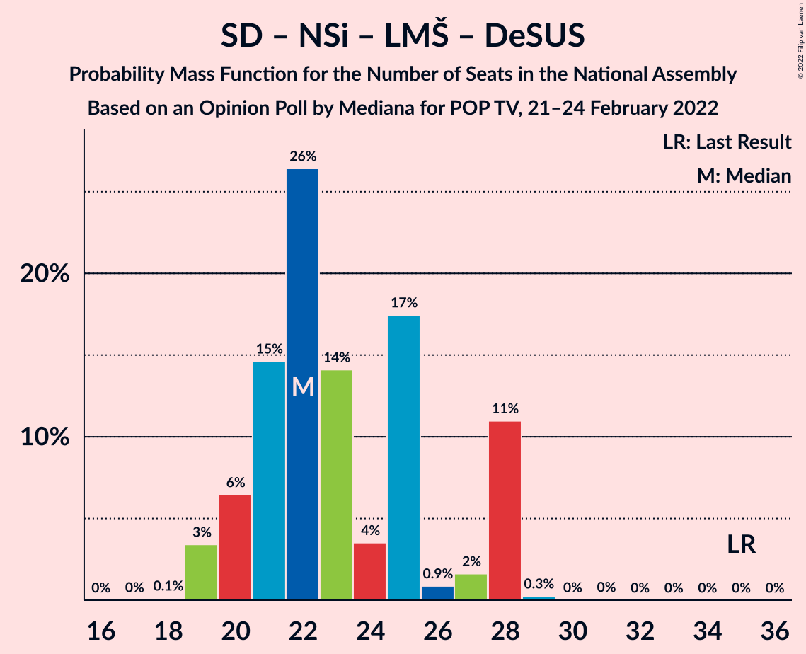

| Number of Seats | Probability | Accumulated | Special Marks |
|:---------------:|:-----------:|:-----------:|:-------------:|
| 17 | 0% | 100% |  |
| 18 | 0.1% | 99.9% |  |
| 19 | 3% | 99.8% |  |
| 20 | 6% | 96% |  |
| 21 | 15% | 90% |  |
| 22 | 26% | 75% |  |
| 23 | 14% | 49% | Median |
| 24 | 4% | 35% |  |
| 25 | 17% | 31% |  |
| 26 | 0.9% | 14% |  |
| 27 | 2% | 13% |  |
| 28 | 11% | 11% |  |
| 29 | 0.3% | 0.3% |  |
| 30 | 0% | 0.1% |  |
| 31 | 0% | 0% |  |
| 32 | 0% | 0% |  |
| 33 | 0% | 0% |  |
| 34 | 0% | 0% |  |
| 35 | 0% | 0% | Last Result |

### Socialni demokrati – Nova Slovenija–Krščanski demokrati – Lista Marjana Šarca

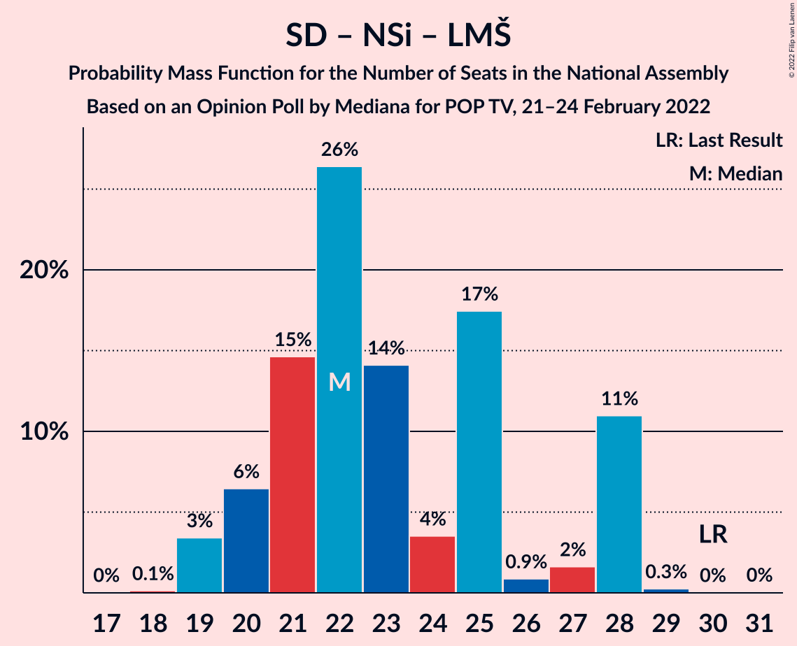

| Number of Seats | Probability | Accumulated | Special Marks |
|:---------------:|:-----------:|:-----------:|:-------------:|
| 17 | 0% | 100% |  |
| 18 | 0.1% | 99.9% |  |
| 19 | 3% | 99.8% |  |
| 20 | 6% | 96% |  |
| 21 | 15% | 90% |  |
| 22 | 26% | 75% |  |
| 23 | 14% | 49% | Median |
| 24 | 4% | 35% |  |
| 25 | 17% | 31% |  |
| 26 | 0.9% | 14% |  |
| 27 | 2% | 13% |  |
| 28 | 11% | 11% |  |
| 29 | 0.3% | 0.3% |  |
| 30 | 0% | 0.1% | Last Result |
| 31 | 0% | 0% |  |

### Socialni demokrati – Lista Marjana Šarca – Demokratična stranka upokojencev Slovenije

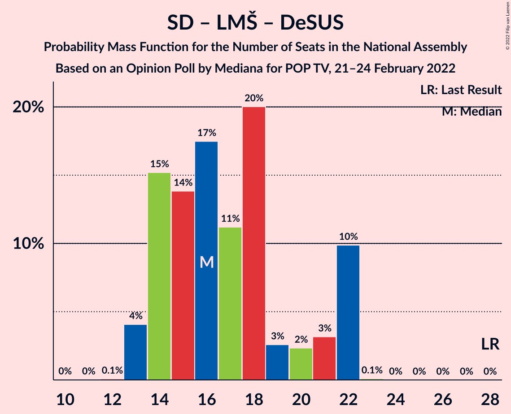

| Number of Seats | Probability | Accumulated | Special Marks |
|:---------------:|:-----------:|:-----------:|:-------------:|
| 12 | 0.1% | 100% |  |
| 13 | 4% | 99.9% |  |
| 14 | 15% | 96% |  |
| 15 | 14% | 81% |  |
| 16 | 17% | 67% |  |
| 17 | 11% | 49% | Median |
| 18 | 20% | 38% |  |
| 19 | 3% | 18% |  |
| 20 | 2% | 15% |  |
| 21 | 3% | 13% |  |
| 22 | 10% | 10% |  |
| 23 | 0.1% | 0.1% |  |
| 24 | 0% | 0% |  |
| 25 | 0% | 0% |  |
| 26 | 0% | 0% |  |
| 27 | 0% | 0% |  |
| 28 | 0% | 0% | Last Result |

### Socialni demokrati – Lista Marjana Šarca

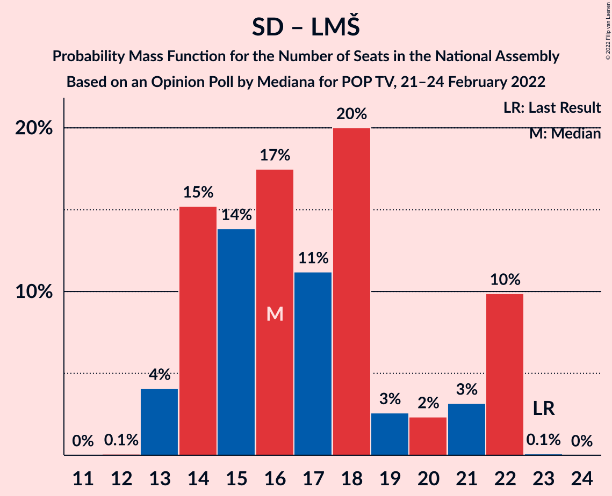

| Number of Seats | Probability | Accumulated | Special Marks |
|:---------------:|:-----------:|:-----------:|:-------------:|
| 12 | 0.1% | 100% |  |
| 13 | 4% | 99.9% |  |
| 14 | 15% | 96% |  |
| 15 | 14% | 81% |  |
| 16 | 17% | 67% |  |
| 17 | 11% | 49% | Median |
| 18 | 20% | 38% |  |
| 19 | 3% | 18% |  |
| 20 | 2% | 15% |  |
| 21 | 3% | 13% |  |
| 22 | 10% | 10% |  |
| 23 | 0.1% | 0.1% | Last Result |
| 24 | 0% | 0% |  |

## Technical Information

### Opinion Poll

+ **Polling firm:** Mediana
+ **Commissioner(s):** POP TV
+ **Fieldwork period:** 21–24 February 2022

### Calculations

+ **Sample size:** 658
+ **Simulations done:** 1,048,576
+ **Error estimate:** 1.98%

