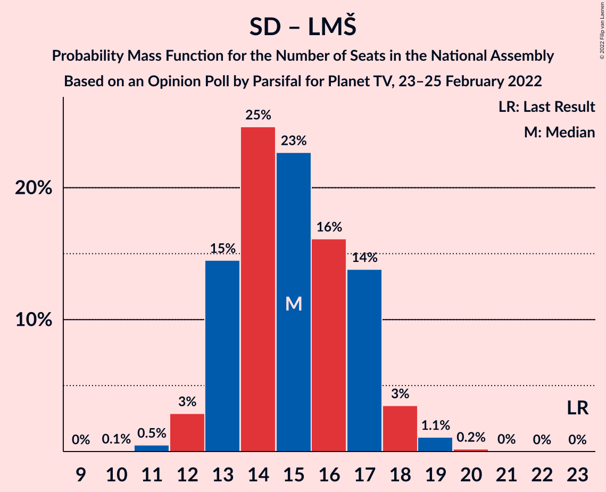

# Opinion Poll by Parsifal for Planet TV, 23–25 February 2022

<a href="#voting-intentions">Voting Intentions</a> | <a href="#seats">Seats</a> | <a href="#coalitions">Coalitions</a> | <a href="#technical-information">Technical Information</a>

## Voting Intentions

### Confidence Intervals

| Party | Last Result | Poll Result | 80% Confidence Interval | 90% Confidence Interval | 95% Confidence Interval | 99% Confidence Interval |
|:-----:|:-----------:|:-----------:|:-----------------------:|:-----------------------:|:-----------------------:|:-----------------------:|
| Slovenska demokratska stranka | 24.9% | 31.1% | 28.8–33.4% |28.2–34.1% |27.6–34.7% |26.6–35.9% |
| Gibanje Svoboda | 0.0% | 17.7% | 15.9–19.7% |15.4–20.3% |14.9–20.8% |14.1–21.8% |
| Socialni demokrati | 9.9% | 9.3% | 8.0–10.9% |7.6–11.4% |7.3–11.8% |6.7–12.6% |
| Levica | 9.3% | 7.8% | 6.6–9.3% |6.2–9.7% |5.9–10.1% |5.4–10.8% |
| Lista Marjana Šarca | 12.6% | 7.2% | 6.0–8.6% |5.7–9.0% |5.4–9.4% |4.9–10.1% |
| Povežimo Slovenijo | 0.0% | 5.9% | 4.9–7.3% |4.6–7.7% |4.4–8.0% |3.9–8.7% |
| Nova Slovenija–Krščanski demokrati | 7.2% | 5.2% | 4.2–6.5% |3.9–6.8% |3.7–7.1% |3.3–7.8% |
| Naša dežela | 0.0% | 3.0% | 2.3–4.1% |2.1–4.4% |2.0–4.7% |1.7–5.2% |
| Stranka Alenke Bratušek | 5.1% | 2.9% | 2.2–3.9% |2.0–4.2% |1.9–4.5% |1.6–5.0% |

*Note:* The poll result column reflects the actual value used in the calculations. Published results may vary slightly, and in addition be rounded to fewer digits.

## Seats

### Confidence Intervals

| Party | Last Result | Median | 80% Confidence Interval | 90% Confidence Interval | 95% Confidence Interval | 99% Confidence Interval |
|:-----:|:-----------:|:------:|:-----------------------:|:-----------------------:|:-----------------------:|:-----------------------:|
| <a href="#slovenska-demokratska-stranka">Slovenska demokratska stranka</a> | 25 | 30 | 27–32 |26–32 |26–33 |25–34 |
| <a href="#gibanje-svoboda">Gibanje Svoboda</a> | 0 | 17 | 15–19 |14–19 |14–20 |13–21 |
| <a href="#socialni-demokrati">Socialni demokrati</a> | 10 | 8 | 7–10 |7–10 |7–11 |6–12 |
| <a href="#levica">Levica</a> | 9 | 7 | 6–9 |5–9 |5–9 |5–10 |
| <a href="#lista-marjana-šarca">Lista Marjana Šarca</a> | 13 | 6 | 5–8 |5–8 |5–9 |4–9 |
| <a href="#povežimo-slovenijo">Povežimo Slovenijo</a> | 0 | 5 | 4–7 |4–7 |4–7 |0–8 |
| <a href="#nova-slovenija–krščanski-demokrati">Nova Slovenija–Krščanski demokrati</a> | 7 | 5 | 4–6 |0–6 |0–6 |0–7 |
| <a href="#naša-dežela">Naša dežela</a> | 0 | 0 | 0–3 |0–4 |0–4 |0–4 |
| <a href="#stranka-alenke-bratušek">Stranka Alenke Bratušek</a> | 5 | 0 | 0 |0 |0–4 |0–4 |

### Slovenska demokratska stranka

*For a full overview of the results for this party, see the [Slovenska demokratska stranka](party-slovenskademokratskastranka.html) page.*

| Number of Seats | Probability | Accumulated | Special Marks |
|:---------------:|:-----------:|:-----------:|:-------------:|
| 24 | 0.2% | 100% |  |
| 25 | 1.2% | 99.7% | Last Result |
| 26 | 4% | 98.5% |  |
| 27 | 9% | 94% |  |
| 28 | 17% | 85% |  |
| 29 | 18% | 68% |  |
| 30 | 20% | 50% | Median |
| 31 | 15% | 31% |  |
| 32 | 11% | 15% |  |
| 33 | 3% | 5% |  |
| 34 | 1.3% | 2% |  |
| 35 | 0.2% | 0.3% |  |
| 36 | 0.1% | 0.1% |  |
| 37 | 0% | 0% |  |

### Gibanje Svoboda

*For a full overview of the results for this party, see the [Gibanje Svoboda](party-gibanjesvoboda.html) page.*

| Number of Seats | Probability | Accumulated | Special Marks |
|:---------------:|:-----------:|:-----------:|:-------------:|
| 0 | 0% | 100% | Last Result |
| 1 | 0% | 100% |  |
| 2 | 0% | 100% |  |
| 3 | 0% | 100% |  |
| 4 | 0% | 100% |  |
| 5 | 0% | 100% |  |
| 6 | 0% | 100% |  |
| 7 | 0% | 100% |  |
| 8 | 0% | 100% |  |
| 9 | 0% | 100% |  |
| 10 | 0% | 100% |  |
| 11 | 0% | 100% |  |
| 12 | 0.2% | 100% |  |
| 13 | 2% | 99.8% |  |
| 14 | 6% | 98% |  |
| 15 | 14% | 93% |  |
| 16 | 27% | 79% |  |
| 17 | 22% | 52% | Median |
| 18 | 18% | 30% |  |
| 19 | 9% | 12% |  |
| 20 | 3% | 3% |  |
| 21 | 0.4% | 0.5% |  |
| 22 | 0.1% | 0.1% |  |
| 23 | 0% | 0% |  |

### Socialni demokrati

*For a full overview of the results for this party, see the [Socialni demokrati](party-socialnidemokrati.html) page.*

| Number of Seats | Probability | Accumulated | Special Marks |
|:---------------:|:-----------:|:-----------:|:-------------:|
| 5 | 0.1% | 100% |  |
| 6 | 2% | 99.9% |  |
| 7 | 16% | 98% |  |
| 8 | 35% | 82% | Median |
| 9 | 28% | 47% |  |
| 10 | 15% | 19% | Last Result |
| 11 | 3% | 4% |  |
| 12 | 0.6% | 0.6% |  |
| 13 | 0% | 0.1% |  |
| 14 | 0% | 0% |  |

### Levica

*For a full overview of the results for this party, see the [Levica](party-levica.html) page.*

| Number of Seats | Probability | Accumulated | Special Marks |
|:---------------:|:-----------:|:-----------:|:-------------:|
| 4 | 0.3% | 100% |  |
| 5 | 5% | 99.7% |  |
| 6 | 22% | 95% |  |
| 7 | 38% | 73% | Median |
| 8 | 25% | 35% |  |
| 9 | 8% | 10% | Last Result |
| 10 | 2% | 2% |  |
| 11 | 0.1% | 0.2% |  |
| 12 | 0% | 0% |  |

### Lista Marjana Šarca

*For a full overview of the results for this party, see the [Lista Marjana Šarca](party-listamarjanašarca.html) page.*

| Number of Seats | Probability | Accumulated | Special Marks |
|:---------------:|:-----------:|:-----------:|:-------------:|
| 4 | 2% | 100% |  |
| 5 | 18% | 98% |  |
| 6 | 33% | 80% | Median |
| 7 | 31% | 47% |  |
| 8 | 12% | 16% |  |
| 9 | 3% | 4% |  |
| 10 | 0.4% | 0.4% |  |
| 11 | 0% | 0% |  |
| 12 | 0% | 0% |  |
| 13 | 0% | 0% | Last Result |

### Povežimo Slovenijo

*For a full overview of the results for this party, see the [Povežimo Slovenijo](party-povežimoslovenijo.html) page.*

| Number of Seats | Probability | Accumulated | Special Marks |
|:---------------:|:-----------:|:-----------:|:-------------:|
| 0 | 1.5% | 100% | Last Result |
| 1 | 0% | 98.5% |  |
| 2 | 0% | 98.5% |  |
| 3 | 0.9% | 98.5% |  |
| 4 | 20% | 98% |  |
| 5 | 41% | 78% | Median |
| 6 | 21% | 37% |  |
| 7 | 14% | 16% |  |
| 8 | 2% | 2% |  |
| 9 | 0.1% | 0.1% |  |
| 10 | 0% | 0% |  |

### Nova Slovenija–Krščanski demokrati

*For a full overview of the results for this party, see the [Nova Slovenija–Krščanski demokrati](party-novaslovenija–krščanskidemokrati.html) page.*

| Number of Seats | Probability | Accumulated | Special Marks |
|:---------------:|:-----------:|:-----------:|:-------------:|
| 0 | 6% | 100% |  |
| 1 | 0% | 94% |  |
| 2 | 0% | 94% |  |
| 3 | 1.2% | 94% |  |
| 4 | 35% | 92% |  |
| 5 | 37% | 57% | Median |
| 6 | 18% | 20% |  |
| 7 | 2% | 2% | Last Result |
| 8 | 0.1% | 0.1% |  |
| 9 | 0% | 0% |  |

### Naša dežela

*For a full overview of the results for this party, see the [Naša dežela](party-našadežela.html) page.*

| Number of Seats | Probability | Accumulated | Special Marks |
|:---------------:|:-----------:|:-----------:|:-------------:|
| 0 | 87% | 100% | Last Result, Median |
| 1 | 0% | 13% |  |
| 2 | 0% | 13% |  |
| 3 | 6% | 13% |  |
| 4 | 6% | 7% |  |
| 5 | 0.3% | 0.3% |  |
| 6 | 0% | 0% |  |

### Stranka Alenke Bratušek

*For a full overview of the results for this party, see the [Stranka Alenke Bratušek](party-strankaalenkebratušek.html) page.*

| Number of Seats | Probability | Accumulated | Special Marks |
|:---------------:|:-----------:|:-----------:|:-------------:|
| 0 | 95% | 100% | Median |
| 1 | 0% | 5% |  |
| 2 | 0% | 5% |  |
| 3 | 0.8% | 5% |  |
| 4 | 4% | 4% |  |
| 5 | 0.3% | 0.3% | Last Result |
| 6 | 0% | 0% |  |

## Coalitions

### Confidence Intervals

| Coalition | Last Result | Median | Majority? | 80% Confidence Interval | 90% Confidence Interval | 95% Confidence Interval | 99% Confidence Interval |
|:---------:|:-----------:|:------:|:---------:|:-----------------------:|:-----------------------:|:-----------------------:|:-----------------------:|
| Slovenska demokratska stranka – Lista Marjana Šarca | 38 | 36 | 0% | 34–38 | 33–39 | 32–40 | 31–41 |
| Socialni demokrati – Lista Marjana Šarca – Nova Slovenija–Krščanski demokrati | 30 | 20 | 0% | 17–22 | 17–22 | 16–23 | 14–24 |
| Socialni demokrati – Lista Marjana Šarca | 23 | 15 | 0% | 13–17 | 13–17 | 12–18 | 11–19 |

### Slovenska demokratska stranka – Lista Marjana Šarca

| Number of Seats | Probability | Accumulated | Special Marks |
|:---------------:|:-----------:|:-----------:|:-------------:|
| 30 | 0.3% | 100% |  |
| 31 | 0.5% | 99.7% |  |
| 32 | 4% | 99.1% |  |
| 33 | 4% | 95% |  |
| 34 | 14% | 91% |  |
| 35 | 24% | 77% |  |
| 36 | 13% | 53% | Median |
| 37 | 20% | 40% |  |
| 38 | 11% | 20% | Last Result |
| 39 | 5% | 9% |  |
| 40 | 2% | 5% |  |
| 41 | 2% | 2% |  |
| 42 | 0.4% | 0.5% |  |
| 43 | 0.1% | 0.1% |  |
| 44 | 0% | 0% |  |

### Socialni demokrati – Lista Marjana Šarca – Nova Slovenija–Krščanski demokrati

| Number of Seats | Probability | Accumulated | Special Marks |
|:---------------:|:-----------:|:-----------:|:-------------:|
| 12 | 0.2% | 100% |  |
| 13 | 0.2% | 99.8% |  |
| 14 | 0.6% | 99.6% |  |
| 15 | 1.5% | 99.0% |  |
| 16 | 2% | 98% |  |
| 17 | 12% | 95% |  |
| 18 | 10% | 84% |  |
| 19 | 23% | 73% | Median |
| 20 | 21% | 50% |  |
| 21 | 15% | 29% |  |
| 22 | 9% | 14% |  |
| 23 | 4% | 5% |  |
| 24 | 0.9% | 1.1% |  |
| 25 | 0.2% | 0.2% |  |
| 26 | 0% | 0% |  |
| 27 | 0% | 0% |  |
| 28 | 0% | 0% |  |
| 29 | 0% | 0% |  |
| 30 | 0% | 0% | Last Result |

### Socialni demokrati – Lista Marjana Šarca

| Number of Seats | Probability | Accumulated | Special Marks |
|:---------------:|:-----------:|:-----------:|:-------------:|
| 10 | 0.1% | 100% |  |
| 11 | 0.5% | 99.9% |  |
| 12 | 3% | 99.4% |  |
| 13 | 15% | 97% |  |
| 14 | 25% | 82% | Median |
| 15 | 23% | 57% |  |
| 16 | 16% | 35% |  |
| 17 | 14% | 19% |  |
| 18 | 3% | 5% |  |
| 19 | 1.1% | 1.3% |  |
| 20 | 0.2% | 0.2% |  |
| 21 | 0% | 0% |  |
| 22 | 0% | 0% |  |
| 23 | 0% | 0% | Last Result |

## Technical Information

### Opinion Poll

+ **Polling firm:** Parsifal
+ **Commissioner(s):** Planet TV
+ **Fieldwork period:** 23–25 February 2022

### Calculations

+ **Sample size:** 657
+ **Simulations done:** 1,048,576
+ **Error estimate:** 2.96%

