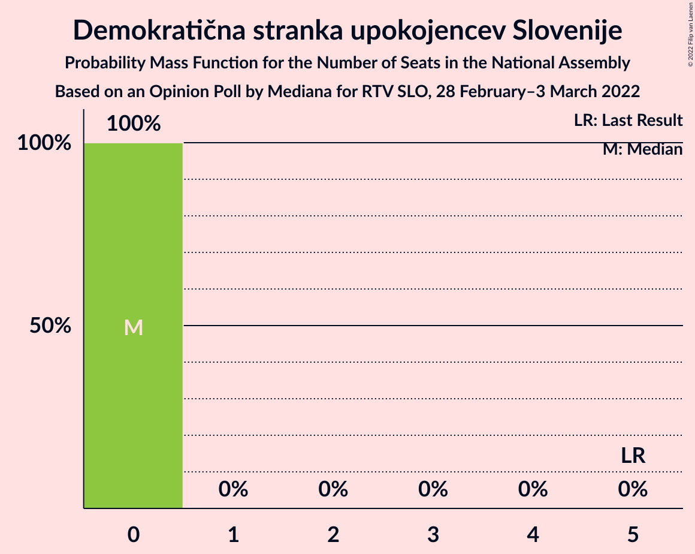
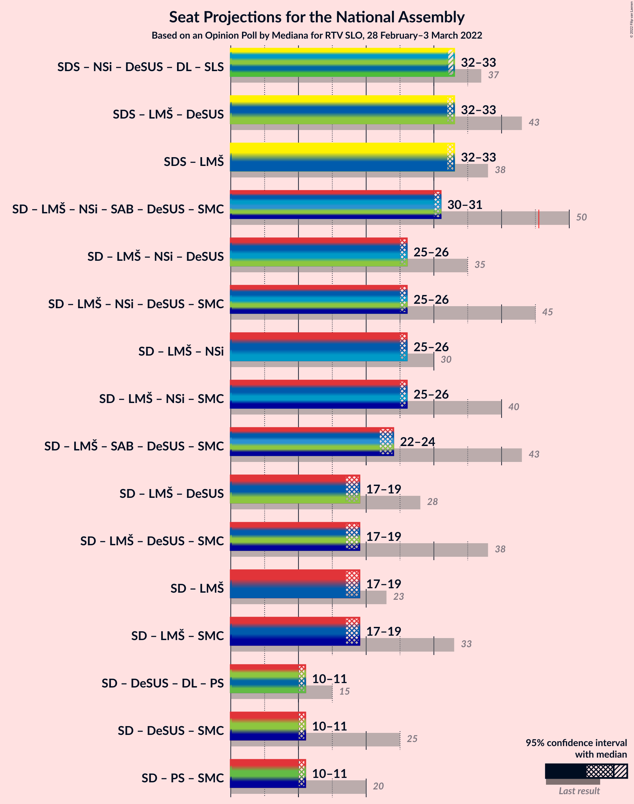

# Opinion Poll by Mediana for RTV SLO, 28 February–3 March 2022

<a href="#voting-intentions">Voting Intentions</a> | <a href="#seats">Seats</a> | <a href="#coalitions">Coalitions</a> | <a href="#technical-information">Technical Information</a>

## Voting Intentions

### Confidence Intervals

| Party | Last Result | Poll Result | 80% Confidence Interval | 90% Confidence Interval | 95% Confidence Interval | 99% Confidence Interval |
|:-----:|:-----------:|:-----------:|:-----------------------:|:-----------------------:|:-----------------------:|:-----------------------:|
| Slovenska demokratska stranka | 24.9% | 23.2% | 21.6–24.9% |21.1–25.4% |20.7–25.9% |20.0–26.7% |
| Gibanje Svoboda | 0.0% | 22.8% | 21.2–24.5% |20.7–25.0% |20.3–25.5% |19.6–26.3% |
| Socialni demokrati | 9.9% | 9.7% | 8.6–11.0% |8.3–11.3% |8.0–11.7% |7.5–12.3% |
| Lista Marjana Šarca | 12.6% | 7.2% | 6.2–8.3% |6.0–8.6% |5.7–8.9% |5.3–9.5% |
| Levica | 9.3% | 7.1% | 6.1–8.2% |5.9–8.5% |5.7–8.8% |5.2–9.4% |
| Nova Slovenija–Krščanski demokrati | 7.2% | 7.0% | 6.1–8.1% |5.8–8.4% |5.6–8.7% |5.2–9.3% |
| Stranka Alenke Bratušek | 5.1% | 5.1% | 4.4–6.1% |4.1–6.4% |3.9–6.7% |3.6–7.2% |
| Resni.ca | 0.0% | 3.2% | 2.6–4.0% |2.4–4.3% |2.3–4.5% |2.0–4.9% |
| VESNA–Zelena stranka | 0.0% | 2.9% | 2.3–3.7% |2.2–3.9% |2.0–4.1% |1.8–4.5% |
| Naša dežela | 0.0% | 2.8% | 2.3–3.6% |2.1–3.8% |2.0–4.0% |1.7–4.4% |
| Povežimo Slovenijo | 0.0% | 2.5% | 2.0–3.3% |1.8–3.5% |1.7–3.7% |1.5–4.1% |
| Slovenska nacionalna stranka | 4.2% | 2.2% | 1.7–2.9% |1.6–3.2% |1.5–3.3% |1.3–3.7% |
| Piratska stranka Slovenije | 2.2% | 1.3% | 0.9–1.8% |0.8–2.0% |0.7–2.1% |0.6–2.5% |
| Demokratična stranka upokojencev Slovenije | 4.9% | 1.1% | 0.7–1.6% |0.7–1.8% |0.6–1.9% |0.5–2.2% |
| Dobra država | 1.5% | 0.5% | 0.3–0.9% |0.2–1.0% |0.2–1.1% |0.1–1.4% |

*Note:* The poll result column reflects the actual value used in the calculations. Published results may vary slightly, and in addition be rounded to fewer digits.

## Seats

### Confidence Intervals

| Party | Last Result | Median | 80% Confidence Interval | 90% Confidence Interval | 95% Confidence Interval | 99% Confidence Interval |
|:-----:|:-----------:|:------:|:-----------------------:|:-----------------------:|:-----------------------:|:-----------------------:|
| <a href="#slovenska-demokratska-stranka">Slovenska demokratska stranka</a> | 25 | 25 | 25 |25 |25 |23–26 |
| <a href="#gibanje-svoboda">Gibanje Svoboda</a> | 0 | 25 | 25 |25 |25–26 |24–28 |
| <a href="#socialni-demokrati">Socialni demokrati</a> | 10 | 11 | 11 |11 |10–11 |9–11 |
| <a href="#lista-marjana-šarca">Lista Marjana Šarca</a> | 13 | 8 | 8 |8 |7–8 |7–8 |
| <a href="#levica">Levica</a> | 9 | 7 | 7 |7 |7–8 |7–9 |
| <a href="#nova-slovenija–krščanski-demokrati">Nova Slovenija–Krščanski demokrati</a> | 7 | 7 | 7 |7 |7–8 |6–9 |
| <a href="#stranka-alenke-bratušek">Stranka Alenke Bratušek</a> | 5 | 5 | 5 |5 |4–5 |4–5 |
| <a href="#resni.ca">Resni.ca</a> | 0 | 0 | 0 |0 |0 |0 |
| <a href="#vesna–zelena-stranka">VESNA–Zelena stranka</a> | 0 | 0 | 0 |0 |0 |0 |
| <a href="#naša-dežela">Naša dežela</a> | 0 | 0 | 0 |0 |0 |0 |
| <a href="#povežimo-slovenijo">Povežimo Slovenijo</a> | 0 | 0 | 0 |0 |0 |0 |
| <a href="#slovenska-nacionalna-stranka">Slovenska nacionalna stranka</a> | 4 | 0 | 0 |0 |0 |0 |
| <a href="#piratska-stranka-slovenije">Piratska stranka Slovenije</a> | 0 | 0 | 0 |0 |0 |0 |
| <a href="#demokratična-stranka-upokojencev-slovenije">Demokratična stranka upokojencev Slovenije</a> | 5 | 0 | 0 |0 |0 |0 |
| <a href="#dobra-država">Dobra država</a> | 0 | 0 | 0 |0 |0 |0 |

### Slovenska demokratska stranka

*For a full overview of the results for this party, see the [Slovenska demokratska stranka](party-slovenskademokratskastranka.html) page.*

| Number of Seats | Probability | Accumulated | Special Marks |
|:---------------:|:-----------:|:-----------:|:-------------:|
| 21 | 0.1% | 100% |  |
| 22 | 0.1% | 99.9% |  |
| 23 | 1.0% | 99.8% |  |
| 24 | 0.8% | 98.8% |  |
| 25 | 97% | 98% | Last Result, Median |
| 26 | 0.3% | 0.7% |  |
| 27 | 0.2% | 0.4% |  |
| 28 | 0% | 0.3% |  |
| 29 | 0.2% | 0.2% |  |
| 30 | 0% | 0.1% |  |
| 31 | 0.1% | 0.1% |  |
| 32 | 0% | 0% |  |

### Gibanje Svoboda

*For a full overview of the results for this party, see the [Gibanje Svoboda](party-gibanjesvoboda.html) page.*

| Number of Seats | Probability | Accumulated | Special Marks |
|:---------------:|:-----------:|:-----------:|:-------------:|
| 0 | 0% | 100% | Last Result |
| 1 | 0% | 100% |  |
| 2 | 0% | 100% |  |
| 3 | 0% | 100% |  |
| 4 | 0% | 100% |  |
| 5 | 0% | 100% |  |
| 6 | 0% | 100% |  |
| 7 | 0% | 100% |  |
| 8 | 0% | 100% |  |
| 9 | 0% | 100% |  |
| 10 | 0% | 100% |  |
| 11 | 0% | 100% |  |
| 12 | 0% | 100% |  |
| 13 | 0% | 100% |  |
| 14 | 0% | 100% |  |
| 15 | 0% | 100% |  |
| 16 | 0% | 100% |  |
| 17 | 0% | 100% |  |
| 18 | 0% | 100% |  |
| 19 | 0% | 100% |  |
| 20 | 0% | 100% |  |
| 21 | 0% | 100% |  |
| 22 | 0.1% | 99.9% |  |
| 23 | 0.2% | 99.8% |  |
| 24 | 0.2% | 99.7% |  |
| 25 | 96% | 99.4% | Median |
| 26 | 2% | 3% |  |
| 27 | 0.4% | 1.5% |  |
| 28 | 0.6% | 1.1% |  |
| 29 | 0.4% | 0.5% |  |
| 30 | 0.1% | 0.1% |  |
| 31 | 0% | 0% |  |

### Socialni demokrati

*For a full overview of the results for this party, see the [Socialni demokrati](party-socialnidemokrati.html) page.*

| Number of Seats | Probability | Accumulated | Special Marks |
|:---------------:|:-----------:|:-----------:|:-------------:|
| 8 | 0.1% | 100% |  |
| 9 | 1.3% | 99.9% |  |
| 10 | 2% | 98.7% | Last Result |
| 11 | 96% | 97% | Median |
| 12 | 0.1% | 0.1% |  |
| 13 | 0% | 0% |  |

### Lista Marjana Šarca

*For a full overview of the results for this party, see the [Lista Marjana Šarca](party-listamarjanašarca.html) page.*

| Number of Seats | Probability | Accumulated | Special Marks |
|:---------------:|:-----------:|:-----------:|:-------------:|
| 6 | 0.3% | 100% |  |
| 7 | 3% | 99.7% |  |
| 8 | 97% | 97% | Median |
| 9 | 0.3% | 0.3% |  |
| 10 | 0% | 0% |  |
| 11 | 0% | 0% |  |
| 12 | 0% | 0% |  |
| 13 | 0% | 0% | Last Result |

### Levica

*For a full overview of the results for this party, see the [Levica](party-levica.html) page.*

| Number of Seats | Probability | Accumulated | Special Marks |
|:---------------:|:-----------:|:-----------:|:-------------:|
| 5 | 0.1% | 100% |  |
| 6 | 0.3% | 99.9% |  |
| 7 | 96% | 99.6% | Median |
| 8 | 2% | 3% |  |
| 9 | 2% | 2% | Last Result |
| 10 | 0% | 0% |  |

### Nova Slovenija–Krščanski demokrati

*For a full overview of the results for this party, see the [Nova Slovenija–Krščanski demokrati](party-novaslovenija–krščanskidemokrati.html) page.*

| Number of Seats | Probability | Accumulated | Special Marks |
|:---------------:|:-----------:|:-----------:|:-------------:|
| 6 | 0.9% | 100% |  |
| 7 | 96% | 99.1% | Last Result, Median |
| 8 | 2% | 3% |  |
| 9 | 1.0% | 1.0% |  |
| 10 | 0% | 0% |  |

### Stranka Alenke Bratušek

*For a full overview of the results for this party, see the [Stranka Alenke Bratušek](party-strankaalenkebratušek.html) page.*

| Number of Seats | Probability | Accumulated | Special Marks |
|:---------------:|:-----------:|:-----------:|:-------------:|
| 0 | 0.4% | 100% |  |
| 1 | 0% | 99.6% |  |
| 2 | 0% | 99.6% |  |
| 3 | 0% | 99.6% |  |
| 4 | 2% | 99.6% |  |
| 5 | 97% | 97% | Last Result, Median |
| 6 | 0.1% | 0.1% |  |
| 7 | 0% | 0% |  |

### Resni.ca

*For a full overview of the results for this party, see the [Resni.ca](party-resnica.html) page.*

| Number of Seats | Probability | Accumulated | Special Marks |
|:---------------:|:-----------:|:-----------:|:-------------:|
| 0 | 99.8% | 100% | Last Result, Median |
| 1 | 0% | 0.2% |  |
| 2 | 0% | 0.2% |  |
| 3 | 0% | 0.2% |  |
| 4 | 0.2% | 0.2% |  |
| 5 | 0% | 0% |  |

### VESNA–Zelena stranka

*For a full overview of the results for this party, see the [VESNA–Zelena stranka](party-vesna–zelenastranka.html) page.*

| Number of Seats | Probability | Accumulated | Special Marks |
|:---------------:|:-----------:|:-----------:|:-------------:|
| 0 | 99.9% | 100% | Last Result, Median |
| 1 | 0% | 0.1% |  |
| 2 | 0% | 0.1% |  |
| 3 | 0% | 0.1% |  |
| 4 | 0.1% | 0.1% |  |
| 5 | 0% | 0% |  |

### Naša dežela

*For a full overview of the results for this party, see the [Naša dežela](party-našadežela.html) page.*

| Number of Seats | Probability | Accumulated | Special Marks |
|:---------------:|:-----------:|:-----------:|:-------------:|
| 0 | 100% | 100% | Last Result, Median |

### Povežimo Slovenijo

*For a full overview of the results for this party, see the [Povežimo Slovenijo](party-povežimoslovenijo.html) page.*

| Number of Seats | Probability | Accumulated | Special Marks |
|:---------------:|:-----------:|:-----------:|:-------------:|
| 0 | 100% | 100% | Last Result, Median |

### Slovenska nacionalna stranka

*For a full overview of the results for this party, see the [Slovenska nacionalna stranka](party-slovenskanacionalnastranka.html) page.*

| Number of Seats | Probability | Accumulated | Special Marks |
|:---------------:|:-----------:|:-----------:|:-------------:|
| 0 | 100% | 100% | Median |
| 1 | 0% | 0% |  |
| 2 | 0% | 0% |  |
| 3 | 0% | 0% |  |
| 4 | 0% | 0% | Last Result |

### Piratska stranka Slovenije

*For a full overview of the results for this party, see the [Piratska stranka Slovenije](party-piratskastrankaslovenije.html) page.*

| Number of Seats | Probability | Accumulated | Special Marks |
|:---------------:|:-----------:|:-----------:|:-------------:|
| 0 | 100% | 100% | Last Result, Median |

### Demokratična stranka upokojencev Slovenije

*For a full overview of the results for this party, see the [Demokratična stranka upokojencev Slovenije](party-demokratičnastrankaupokojencevslovenije.html) page.*

| Number of Seats | Probability | Accumulated | Special Marks |
|:---------------:|:-----------:|:-----------:|:-------------:|
| 0 | 100% | 100% | Median |
| 1 | 0% | 0% |  |
| 2 | 0% | 0% |  |
| 3 | 0% | 0% |  |
| 4 | 0% | 0% |  |
| 5 | 0% | 0% | Last Result |

### Dobra država

*For a full overview of the results for this party, see the [Dobra država](party-dobradržava.html) page.*

| Number of Seats | Probability | Accumulated | Special Marks |
|:---------------:|:-----------:|:-----------:|:-------------:|
| 0 | 100% | 100% | Last Result, Median |

## Coalitions

### Confidence Intervals

| Coalition | Last Result | Median | Majority? | 80% Confidence Interval | 90% Confidence Interval | 95% Confidence Interval | 99% Confidence Interval |
|:---------:|:-----------:|:------:|:---------:|:-----------------------:|:-----------------------:|:-----------------------:|:-----------------------:|
| Slovenska demokratska stranka – Lista Marjana Šarca – Demokratična stranka upokojencev Slovenije | 43 | 33 | 0% | 33 | 33 | 32–33 | 30–34 |
| Slovenska demokratska stranka – Lista Marjana Šarca | 38 | 33 | 0% | 33 | 33 | 32–33 | 30–34 |
| Socialni demokrati – Lista Marjana Šarca – Nova Slovenija–Krščanski demokrati – Demokratična stranka upokojencev Slovenije | 35 | 26 | 0% | 26 | 26 | 25–26 | 23–26 |
| Socialni demokrati – Lista Marjana Šarca – Nova Slovenija–Krščanski demokrati | 30 | 26 | 0% | 26 | 26 | 25–26 | 23–26 |
| Socialni demokrati – Lista Marjana Šarca – Demokratična stranka upokojencev Slovenije | 28 | 19 | 0% | 19 | 19 | 17–19 | 16–19 |
| Socialni demokrati – Lista Marjana Šarca | 23 | 19 | 0% | 19 | 19 | 17–19 | 16–19 |

### Slovenska demokratska stranka – Lista Marjana Šarca – Demokratična stranka upokojencev Slovenije

| Number of Seats | Probability | Accumulated | Special Marks |
|:---------------:|:-----------:|:-----------:|:-------------:|
| 28 | 0.1% | 100% |  |
| 29 | 0.1% | 99.9% |  |
| 30 | 0.9% | 99.8% |  |
| 31 | 0.1% | 98.9% |  |
| 32 | 2% | 98.8% |  |
| 33 | 96% | 97% | Median |
| 34 | 0.2% | 0.6% |  |
| 35 | 0.3% | 0.4% |  |
| 36 | 0.1% | 0.1% |  |
| 37 | 0% | 0.1% |  |
| 38 | 0% | 0.1% |  |
| 39 | 0% | 0.1% |  |
| 40 | 0.1% | 0.1% |  |
| 41 | 0% | 0% |  |
| 42 | 0% | 0% |  |
| 43 | 0% | 0% | Last Result |

### Slovenska demokratska stranka – Lista Marjana Šarca

| Number of Seats | Probability | Accumulated | Special Marks |
|:---------------:|:-----------:|:-----------:|:-------------:|
| 28 | 0.1% | 100% |  |
| 29 | 0.1% | 99.9% |  |
| 30 | 0.9% | 99.8% |  |
| 31 | 0.1% | 98.9% |  |
| 32 | 2% | 98.8% |  |
| 33 | 96% | 97% | Median |
| 34 | 0.2% | 0.6% |  |
| 35 | 0.3% | 0.4% |  |
| 36 | 0.1% | 0.1% |  |
| 37 | 0% | 0.1% |  |
| 38 | 0% | 0.1% | Last Result |
| 39 | 0% | 0.1% |  |
| 40 | 0.1% | 0.1% |  |
| 41 | 0% | 0% |  |

### Socialni demokrati – Lista Marjana Šarca – Nova Slovenija–Krščanski demokrati – Demokratična stranka upokojencev Slovenije

| Number of Seats | Probability | Accumulated | Special Marks |
|:---------------:|:-----------:|:-----------:|:-------------:|
| 23 | 0.6% | 100% |  |
| 24 | 0.9% | 99.3% |  |
| 25 | 2% | 98% |  |
| 26 | 97% | 97% | Median |
| 27 | 0.2% | 0.4% |  |
| 28 | 0.1% | 0.2% |  |
| 29 | 0% | 0% |  |
| 30 | 0% | 0% |  |
| 31 | 0% | 0% |  |
| 32 | 0% | 0% |  |
| 33 | 0% | 0% |  |
| 34 | 0% | 0% |  |
| 35 | 0% | 0% | Last Result |

### Socialni demokrati – Lista Marjana Šarca – Nova Slovenija–Krščanski demokrati

| Number of Seats | Probability | Accumulated | Special Marks |
|:---------------:|:-----------:|:-----------:|:-------------:|
| 23 | 0.6% | 100% |  |
| 24 | 0.9% | 99.3% |  |
| 25 | 2% | 98% |  |
| 26 | 97% | 97% | Median |
| 27 | 0.2% | 0.4% |  |
| 28 | 0.1% | 0.2% |  |
| 29 | 0% | 0% |  |
| 30 | 0% | 0% | Last Result |

### Socialni demokrati – Lista Marjana Šarca – Demokratična stranka upokojencev Slovenije

| Number of Seats | Probability | Accumulated | Special Marks |
|:---------------:|:-----------:|:-----------:|:-------------:|
| 14 | 0% | 100% |  |
| 15 | 0.1% | 99.9% |  |
| 16 | 0.6% | 99.8% |  |
| 17 | 2% | 99.2% |  |
| 18 | 1.0% | 97% |  |
| 19 | 96% | 96% | Median |
| 20 | 0.2% | 0.3% |  |
| 21 | 0% | 0.1% |  |
| 22 | 0% | 0% |  |
| 23 | 0% | 0% |  |
| 24 | 0% | 0% |  |
| 25 | 0% | 0% |  |
| 26 | 0% | 0% |  |
| 27 | 0% | 0% |  |
| 28 | 0% | 0% | Last Result |

### Socialni demokrati – Lista Marjana Šarca

| Number of Seats | Probability | Accumulated | Special Marks |
|:---------------:|:-----------:|:-----------:|:-------------:|
| 14 | 0% | 100% |  |
| 15 | 0.1% | 99.9% |  |
| 16 | 0.6% | 99.8% |  |
| 17 | 2% | 99.2% |  |
| 18 | 1.0% | 97% |  |
| 19 | 96% | 96% | Median |
| 20 | 0.2% | 0.3% |  |
| 21 | 0% | 0.1% |  |
| 22 | 0% | 0% |  |
| 23 | 0% | 0% | Last Result |

## Technical Information

### Opinion Poll

+ **Polling firm:** Mediana
+ **Commissioner(s):** RTV SLO
+ **Fieldwork period:** 28 February–3 March 2022

### Calculations

+ **Sample size:** 1031
+ **Simulations done:** 1,048,576
+ **Error estimate:** 1.51%

