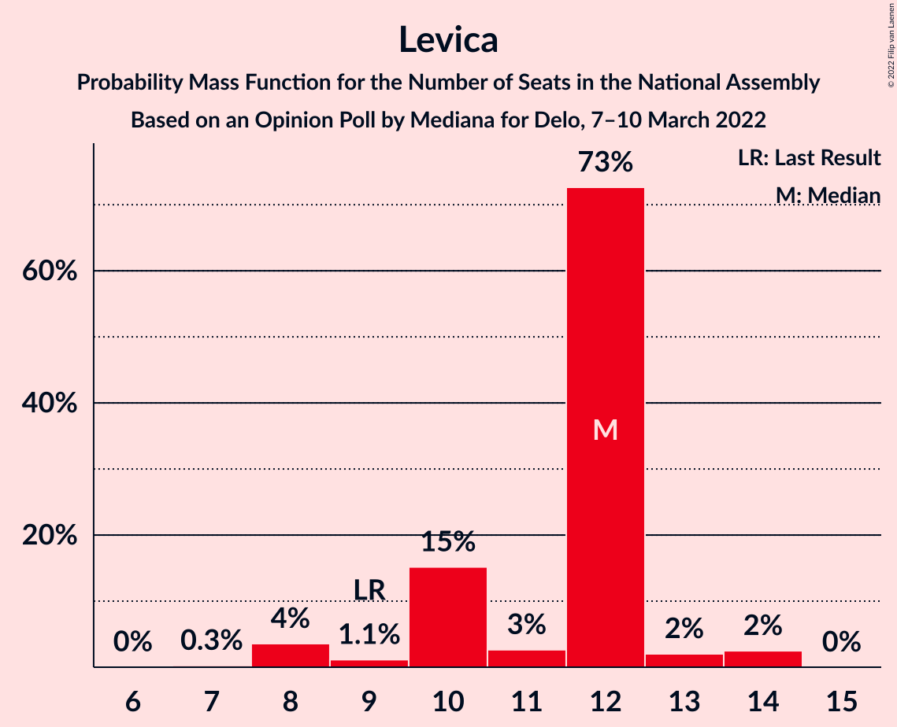

# Opinion Poll by Mediana for Delo, 7–10 March 2022

<a href="#voting-intentions">Voting Intentions</a> | <a href="#seats">Seats</a> | <a href="#coalitions">Coalitions</a> | <a href="#technical-information">Technical Information</a>

## Voting Intentions

### Confidence Intervals

| Party | Last Result | Poll Result | 80% Confidence Interval | 90% Confidence Interval | 95% Confidence Interval | 99% Confidence Interval |
|:-----:|:-----------:|:-----------:|:-----------------------:|:-----------------------:|:-----------------------:|:-----------------------:|
| Gibanje Svoboda | 0.0% | 22.6% | 20.6–24.7% |20.1–25.3% |19.6–25.8% |18.7–26.9% |
| Slovenska demokratska stranka | 24.9% | 20.6% | 18.7–22.6% |18.2–23.2% |17.7–23.7% |16.9–24.8% |
| Socialni demokrati | 9.9% | 10.6% | 9.2–12.2% |8.8–12.7% |8.5–13.1% |7.9–13.9% |
| Levica | 9.3% | 9.1% | 7.9–10.7% |7.5–11.1% |7.2–11.5% |6.7–12.3% |
| Nova Slovenija–Krščanski demokrati | 7.2% | 5.7% | 4.7–7.0% |4.5–7.4% |4.2–7.7% |3.8–8.4% |
| Lista Marjana Šarca | 12.6% | 4.6% | 3.7–5.8% |3.5–6.1% |3.3–6.4% |2.9–7.0% |
| Stranka Alenke Bratušek | 5.1% | 4.4% | 3.6–5.6% |3.3–5.9% |3.1–6.2% |2.8–6.8% |
| Stranka modernega centra | 9.7% | 4.3% | 3.4–5.4% |3.2–5.8% |3.0–6.1% |2.7–6.7% |
| Povežimo Slovenijo | 0.0% | 4.3% | 3.4–5.4% |3.2–5.8% |3.0–6.1% |2.7–6.7% |
| Resni.ca | 0.0% | 3.3% | 2.6–4.3% |2.4–4.6% |2.2–4.9% |1.9–5.4% |
| Piratska stranka Slovenije | 2.2% | 1.9% | 1.3–2.7% |1.2–2.9% |1.1–3.2% |0.9–3.6% |
| Naša dežela | 0.0% | 1.9% | 1.3–2.7% |1.2–2.9% |1.1–3.2% |0.9–3.6% |
| Slovenska nacionalna stranka | 4.2% | 1.7% | 1.2–2.5% |1.1–2.8% |1.0–3.0% |0.8–3.4% |
| Demokratična stranka upokojencev Slovenije | 4.9% | 1.1% | 0.8–1.9% |0.7–2.1% |0.6–2.2% |0.4–2.6% |
| Dobra država | 1.5% | 0.9% | 0.5–1.5% |0.5–1.7% |0.4–1.9% |0.3–2.2% |
| VESNA–Zelena stranka | 0.0% | 0.6% | 0.3–1.1% |0.3–1.3% |0.2–1.5% |0.2–1.8% |

*Note:* The poll result column reflects the actual value used in the calculations. Published results may vary slightly, and in addition be rounded to fewer digits.

## Seats

### Confidence Intervals

| Party | Last Result | Median | 80% Confidence Interval | 90% Confidence Interval | 95% Confidence Interval | 99% Confidence Interval |
|:-----:|:-----------:|:------:|:-----------------------:|:-----------------------:|:-----------------------:|:-----------------------:|
| <a href="#gibanje-svoboda">Gibanje Svoboda</a> | 0 | 23 | 23–27 |23–27 |23–27 |20–28 |
| <a href="#slovenska-demokratska-stranka">Slovenska demokratska stranka</a> | 25 | 22 | 22–23 |22–23 |20–25 |19–25 |
| <a href="#socialni-demokrati">Socialni demokrati</a> | 10 | 11 | 11–13 |11–13 |10–13 |9–15 |
| <a href="#levica">Levica</a> | 9 | 12 | 10–12 |9–12 |8–13 |8–14 |
| <a href="#nova-slovenija–krščanski-demokrati">Nova Slovenija–Krščanski demokrati</a> | 7 | 5 | 5–8 |5–8 |4–8 |4–8 |
| <a href="#lista-marjana-šarca">Lista Marjana Šarca</a> | 13 | 5 | 0–5 |0–5 |0–5 |0–6 |
| <a href="#stranka-alenke-bratušek">Stranka Alenke Bratušek</a> | 5 | 0 | 0 |0–5 |0–6 |0–6 |
| <a href="#stranka-modernega-centra">Stranka modernega centra</a> | 10 | 5 | 5–7 |4–7 |0–7 |0–7 |
| <a href="#povežimo-slovenijo">Povežimo Slovenijo</a> | 0 | 5 | 0–5 |0–5 |0–5 |0–7 |
| <a href="#resni.ca">Resni.ca</a> | 0 | 0 | 0 |0 |0 |0–4 |
| <a href="#piratska-stranka-slovenije">Piratska stranka Slovenije</a> | 0 | 0 | 0 |0 |0 |0 |
| <a href="#naša-dežela">Naša dežela</a> | 0 | 0 | 0 |0 |0 |0 |
| <a href="#slovenska-nacionalna-stranka">Slovenska nacionalna stranka</a> | 4 | 0 | 0 |0 |0 |0 |
| <a href="#demokratična-stranka-upokojencev-slovenije">Demokratična stranka upokojencev Slovenije</a> | 5 | 0 | 0 |0 |0 |0 |
| <a href="#dobra-država">Dobra država</a> | 0 | 0 | 0 |0 |0 |0 |
| <a href="#vesna–zelena-stranka">VESNA–Zelena stranka</a> | 0 | 0 | 0 |0 |0 |0 |

### Gibanje Svoboda

*For a full overview of the results for this party, see the [Gibanje Svoboda](party-gibanjesvoboda.html) page.*

| Number of Seats | Probability | Accumulated | Special Marks |
|:---------------:|:-----------:|:-----------:|:-------------:|
| 0 | 0% | 100% | Last Result |
| 1 | 0% | 100% |  |
| 2 | 0% | 100% |  |
| 3 | 0% | 100% |  |
| 4 | 0% | 100% |  |
| 5 | 0% | 100% |  |
| 6 | 0% | 100% |  |
| 7 | 0% | 100% |  |
| 8 | 0% | 100% |  |
| 9 | 0% | 100% |  |
| 10 | 0% | 100% |  |
| 11 | 0% | 100% |  |
| 12 | 0% | 100% |  |
| 13 | 0% | 100% |  |
| 14 | 0% | 100% |  |
| 15 | 0% | 100% |  |
| 16 | 0% | 100% |  |
| 17 | 0% | 100% |  |
| 18 | 0.1% | 100% |  |
| 19 | 0.1% | 99.9% |  |
| 20 | 0.4% | 99.9% |  |
| 21 | 0.6% | 99.5% |  |
| 22 | 0.7% | 98.9% |  |
| 23 | 78% | 98% | Median |
| 24 | 2% | 21% |  |
| 25 | 3% | 18% |  |
| 26 | 0.7% | 15% |  |
| 27 | 14% | 15% |  |
| 28 | 0.3% | 0.6% |  |
| 29 | 0.2% | 0.3% |  |
| 30 | 0% | 0.1% |  |
| 31 | 0% | 0.1% |  |
| 32 | 0% | 0.1% |  |
| 33 | 0.1% | 0.1% |  |
| 34 | 0% | 0% |  |

### Slovenska demokratska stranka

*For a full overview of the results for this party, see the [Slovenska demokratska stranka](party-slovenskademokratskastranka.html) page.*

| Number of Seats | Probability | Accumulated | Special Marks |
|:---------------:|:-----------:|:-----------:|:-------------:|
| 18 | 0.1% | 100% |  |
| 19 | 2% | 99.8% |  |
| 20 | 0.9% | 98% |  |
| 21 | 0.6% | 97% |  |
| 22 | 74% | 96% | Median |
| 23 | 18% | 22% |  |
| 24 | 0.5% | 4% |  |
| 25 | 3% | 3% | Last Result |
| 26 | 0.2% | 0.4% |  |
| 27 | 0% | 0.2% |  |
| 28 | 0.1% | 0.2% |  |
| 29 | 0% | 0% |  |

### Socialni demokrati

*For a full overview of the results for this party, see the [Socialni demokrati](party-socialnidemokrati.html) page.*

| Number of Seats | Probability | Accumulated | Special Marks |
|:---------------:|:-----------:|:-----------:|:-------------:|
| 8 | 0.2% | 100% |  |
| 9 | 2% | 99.8% |  |
| 10 | 1.5% | 98% | Last Result |
| 11 | 75% | 96% | Median |
| 12 | 0.5% | 21% |  |
| 13 | 19% | 20% |  |
| 14 | 0.5% | 1.4% |  |
| 15 | 0.8% | 0.9% |  |
| 16 | 0.1% | 0.1% |  |
| 17 | 0% | 0% |  |

### Levica

*For a full overview of the results for this party, see the [Levica](party-levica.html) page.*

| Number of Seats | Probability | Accumulated | Special Marks |
|:---------------:|:-----------:|:-----------:|:-------------:|
| 7 | 0.3% | 100% |  |
| 8 | 4% | 99.7% |  |
| 9 | 1.1% | 96% | Last Result |
| 10 | 15% | 95% |  |
| 11 | 3% | 80% |  |
| 12 | 73% | 77% | Median |
| 13 | 2% | 5% |  |
| 14 | 2% | 2% |  |
| 15 | 0% | 0% |  |

### Nova Slovenija–Krščanski demokrati

*For a full overview of the results for this party, see the [Nova Slovenija–Krščanski demokrati](party-novaslovenija–krščanskidemokrati.html) page.*

| Number of Seats | Probability | Accumulated | Special Marks |
|:---------------:|:-----------:|:-----------:|:-------------:|
| 0 | 0.2% | 100% |  |
| 1 | 0% | 99.8% |  |
| 2 | 0% | 99.8% |  |
| 3 | 0% | 99.8% |  |
| 4 | 3% | 99.8% |  |
| 5 | 73% | 97% | Median |
| 6 | 6% | 23% |  |
| 7 | 2% | 17% | Last Result |
| 8 | 15% | 15% |  |
| 9 | 0.1% | 0.1% |  |
| 10 | 0% | 0% |  |

### Lista Marjana Šarca

*For a full overview of the results for this party, see the [Lista Marjana Šarca](party-listamarjanašarca.html) page.*

| Number of Seats | Probability | Accumulated | Special Marks |
|:---------------:|:-----------:|:-----------:|:-------------:|
| 0 | 20% | 100% |  |
| 1 | 0% | 80% |  |
| 2 | 0% | 80% |  |
| 3 | 0% | 80% |  |
| 4 | 2% | 80% |  |
| 5 | 76% | 78% | Median |
| 6 | 2% | 2% |  |
| 7 | 0.5% | 0.5% |  |
| 8 | 0% | 0% |  |
| 9 | 0% | 0% |  |
| 10 | 0% | 0% |  |
| 11 | 0% | 0% |  |
| 12 | 0% | 0% |  |
| 13 | 0% | 0% | Last Result |

### Stranka Alenke Bratušek

*For a full overview of the results for this party, see the [Stranka Alenke Bratušek](party-strankaalenkebratušek.html) page.*

| Number of Seats | Probability | Accumulated | Special Marks |
|:---------------:|:-----------:|:-----------:|:-------------:|
| 0 | 93% | 100% | Median |
| 1 | 0% | 7% |  |
| 2 | 0% | 7% |  |
| 3 | 0% | 7% |  |
| 4 | 2% | 7% |  |
| 5 | 0.8% | 5% | Last Result |
| 6 | 5% | 5% |  |
| 7 | 0% | 0.1% |  |
| 8 | 0% | 0% |  |

### Stranka modernega centra

*For a full overview of the results for this party, see the [Stranka modernega centra](party-strankamodernegacentra.html) page.*

| Number of Seats | Probability | Accumulated | Special Marks |
|:---------------:|:-----------:|:-----------:|:-------------:|
| 0 | 3% | 100% |  |
| 1 | 0% | 97% |  |
| 2 | 0% | 97% |  |
| 3 | 0% | 97% |  |
| 4 | 3% | 97% |  |
| 5 | 80% | 94% | Median |
| 6 | 0.4% | 15% |  |
| 7 | 14% | 14% |  |
| 8 | 0% | 0% |  |
| 9 | 0% | 0% |  |
| 10 | 0% | 0% | Last Result |

### Povežimo Slovenijo

*For a full overview of the results for this party, see the [Povežimo Slovenijo](party-povežimoslovenijo.html) page.*

| Number of Seats | Probability | Accumulated | Special Marks |
|:---------------:|:-----------:|:-----------:|:-------------:|
| 0 | 20% | 100% | Last Result |
| 1 | 0% | 80% |  |
| 2 | 0% | 80% |  |
| 3 | 0% | 80% |  |
| 4 | 3% | 80% |  |
| 5 | 75% | 77% | Median |
| 6 | 1.0% | 2% |  |
| 7 | 0.6% | 0.6% |  |
| 8 | 0% | 0% |  |

### Resni.ca

*For a full overview of the results for this party, see the [Resni.ca](party-resnica.html) page.*

| Number of Seats | Probability | Accumulated | Special Marks |
|:---------------:|:-----------:|:-----------:|:-------------:|
| 0 | 98% | 100% | Last Result, Median |
| 1 | 0% | 2% |  |
| 2 | 0% | 2% |  |
| 3 | 0% | 2% |  |
| 4 | 1.3% | 2% |  |
| 5 | 0.2% | 0.4% |  |
| 6 | 0.1% | 0.2% |  |
| 7 | 0% | 0% |  |

### Piratska stranka Slovenije

*For a full overview of the results for this party, see the [Piratska stranka Slovenije](party-piratskastrankaslovenije.html) page.*

| Number of Seats | Probability | Accumulated | Special Marks |
|:---------------:|:-----------:|:-----------:|:-------------:|
| 0 | 100% | 100% | Last Result, Median |

### Naša dežela

*For a full overview of the results for this party, see the [Naša dežela](party-našadežela.html) page.*

| Number of Seats | Probability | Accumulated | Special Marks |
|:---------------:|:-----------:|:-----------:|:-------------:|
| 0 | 100% | 100% | Last Result, Median |

### Slovenska nacionalna stranka

*For a full overview of the results for this party, see the [Slovenska nacionalna stranka](party-slovenskanacionalnastranka.html) page.*

| Number of Seats | Probability | Accumulated | Special Marks |
|:---------------:|:-----------:|:-----------:|:-------------:|
| 0 | 100% | 100% | Median |
| 1 | 0% | 0% |  |
| 2 | 0% | 0% |  |
| 3 | 0% | 0% |  |
| 4 | 0% | 0% | Last Result |

### Demokratična stranka upokojencev Slovenije

*For a full overview of the results for this party, see the [Demokratična stranka upokojencev Slovenije](party-demokratičnastrankaupokojencevslovenije.html) page.*

| Number of Seats | Probability | Accumulated | Special Marks |
|:---------------:|:-----------:|:-----------:|:-------------:|
| 0 | 100% | 100% | Median |
| 1 | 0% | 0% |  |
| 2 | 0% | 0% |  |
| 3 | 0% | 0% |  |
| 4 | 0% | 0% |  |
| 5 | 0% | 0% | Last Result |

### Dobra država

*For a full overview of the results for this party, see the [Dobra država](party-dobradržava.html) page.*

| Number of Seats | Probability | Accumulated | Special Marks |
|:---------------:|:-----------:|:-----------:|:-------------:|
| 0 | 100% | 100% | Last Result, Median |

### VESNA–Zelena stranka

*For a full overview of the results for this party, see the [VESNA–Zelena stranka](party-vesna–zelenastranka.html) page.*

| Number of Seats | Probability | Accumulated | Special Marks |
|:---------------:|:-----------:|:-----------:|:-------------:|
| 0 | 100% | 100% | Last Result, Median |

## Coalitions

### Confidence Intervals

| Coalition | Last Result | Median | Majority? | 80% Confidence Interval | 90% Confidence Interval | 95% Confidence Interval | 99% Confidence Interval |
|:---------:|:-----------:|:------:|:---------:|:-----------------------:|:-----------------------:|:-----------------------:|:-----------------------:|
| Slovenska demokratska stranka – Lista Marjana Šarca – Demokratična stranka upokojencev Slovenije | 43 | 27 | 0% | 23–27 | 23–27 | 22–30 | 19–30 |
| Slovenska demokratska stranka – Lista Marjana Šarca | 38 | 27 | 0% | 23–27 | 23–27 | 22–30 | 19–30 |
| Socialni demokrati – Nova Slovenija–Krščanski demokrati – Lista Marjana Šarca – Stranka Alenke Bratušek – Stranka modernega centra – Demokratična stranka upokojencev Slovenije | 50 | 26 | 0% | 26–28 | 26–28 | 22–29 | 20–32 |
| Socialni demokrati – Nova Slovenija–Krščanski demokrati – Lista Marjana Šarca – Stranka modernega centra – Demokratična stranka upokojencev Slovenije | 45 | 26 | 0% | 26–28 | 22–28 | 22–28 | 20–32 |
| Socialni demokrati – Nova Slovenija–Krščanski demokrati – Lista Marjana Šarca – Stranka modernega centra | 40 | 26 | 0% | 26–28 | 22–28 | 22–28 | 20–32 |
| Socialni demokrati – Nova Slovenija–Krščanski demokrati – Lista Marjana Šarca – Demokratična stranka upokojencev Slovenije | 35 | 21 | 0% | 21 | 17–22 | 17–24 | 17–27 |
| Socialni demokrati – Nova Slovenija–Krščanski demokrati – Lista Marjana Šarca | 30 | 21 | 0% | 21 | 17–22 | 17–24 | 17–27 |
| Socialni demokrati – Lista Marjana Šarca – Stranka Alenke Bratušek – Stranka modernega centra – Demokratična stranka upokojencev Slovenije | 43 | 21 | 0% | 20–21 | 20–24 | 16–24 | 14–26 |
| Socialni demokrati – Lista Marjana Šarca – Stranka modernega centra – Demokratična stranka upokojencev Slovenije | 38 | 21 | 0% | 20–21 | 17–21 | 16–22 | 14–25 |
| Socialni demokrati – Lista Marjana Šarca – Stranka modernega centra | 33 | 21 | 0% | 20–21 | 17–21 | 16–22 | 14–25 |
| Socialni demokrati – Stranka modernega centra – Demokratična stranka upokojencev Slovenije | 25 | 16 | 0% | 16–20 | 15–20 | 14–20 | 10–20 |
| Socialni demokrati – Lista Marjana Šarca – Demokratična stranka upokojencev Slovenije | 28 | 16 | 0% | 13–16 | 13–16 | 11–18 | 9–20 |
| Socialni demokrati – Lista Marjana Šarca | 23 | 16 | 0% | 13–16 | 13–16 | 11–18 | 9–20 |

### Slovenska demokratska stranka – Lista Marjana Šarca – Demokratična stranka upokojencev Slovenije

| Number of Seats | Probability | Accumulated | Special Marks |
|:---------------:|:-----------:|:-----------:|:-------------:|
| 19 | 2% | 100% |  |
| 20 | 0.1% | 98% |  |
| 21 | 0.1% | 98% |  |
| 22 | 1.0% | 98% |  |
| 23 | 17% | 97% |  |
| 24 | 0.2% | 80% |  |
| 25 | 1.1% | 80% |  |
| 26 | 2% | 79% |  |
| 27 | 72% | 77% | Median |
| 28 | 0.9% | 5% |  |
| 29 | 1.3% | 4% |  |
| 30 | 2% | 3% |  |
| 31 | 0.2% | 0.3% |  |
| 32 | 0% | 0% |  |
| 33 | 0% | 0% |  |
| 34 | 0% | 0% |  |
| 35 | 0% | 0% |  |
| 36 | 0% | 0% |  |
| 37 | 0% | 0% |  |
| 38 | 0% | 0% |  |
| 39 | 0% | 0% |  |
| 40 | 0% | 0% |  |
| 41 | 0% | 0% |  |
| 42 | 0% | 0% |  |
| 43 | 0% | 0% | Last Result |

### Slovenska demokratska stranka – Lista Marjana Šarca

| Number of Seats | Probability | Accumulated | Special Marks |
|:---------------:|:-----------:|:-----------:|:-------------:|
| 19 | 2% | 100% |  |
| 20 | 0.1% | 98% |  |
| 21 | 0.1% | 98% |  |
| 22 | 1.0% | 98% |  |
| 23 | 17% | 97% |  |
| 24 | 0.2% | 80% |  |
| 25 | 1.1% | 80% |  |
| 26 | 2% | 79% |  |
| 27 | 72% | 77% | Median |
| 28 | 0.9% | 5% |  |
| 29 | 1.3% | 4% |  |
| 30 | 2% | 3% |  |
| 31 | 0.2% | 0.3% |  |
| 32 | 0% | 0% |  |
| 33 | 0% | 0% |  |
| 34 | 0% | 0% |  |
| 35 | 0% | 0% |  |
| 36 | 0% | 0% |  |
| 37 | 0% | 0% |  |
| 38 | 0% | 0% | Last Result |

### Socialni demokrati – Nova Slovenija–Krščanski demokrati – Lista Marjana Šarca – Stranka Alenke Bratušek – Stranka modernega centra – Demokratična stranka upokojencev Slovenije

| Number of Seats | Probability | Accumulated | Special Marks |
|:---------------:|:-----------:|:-----------:|:-------------:|
| 19 | 0.2% | 100% |  |
| 20 | 0.4% | 99.8% |  |
| 21 | 0.2% | 99.4% |  |
| 22 | 2% | 99.2% |  |
| 23 | 0.3% | 97% |  |
| 24 | 0.1% | 97% |  |
| 25 | 0.2% | 97% |  |
| 26 | 74% | 97% | Median |
| 27 | 0.3% | 23% |  |
| 28 | 19% | 22% |  |
| 29 | 0.5% | 3% |  |
| 30 | 0.1% | 2% |  |
| 31 | 2% | 2% |  |
| 32 | 0.5% | 0.7% |  |
| 33 | 0.1% | 0.2% |  |
| 34 | 0% | 0.1% |  |
| 35 | 0% | 0.1% |  |
| 36 | 0% | 0% |  |
| 37 | 0% | 0% |  |
| 38 | 0% | 0% |  |
| 39 | 0% | 0% |  |
| 40 | 0% | 0% |  |
| 41 | 0% | 0% |  |
| 42 | 0% | 0% |  |
| 43 | 0% | 0% |  |
| 44 | 0% | 0% |  |
| 45 | 0% | 0% |  |
| 46 | 0% | 0% | Majority |
| 47 | 0% | 0% |  |
| 48 | 0% | 0% |  |
| 49 | 0% | 0% |  |
| 50 | 0% | 0% | Last Result |

### Socialni demokrati – Nova Slovenija–Krščanski demokrati – Lista Marjana Šarca – Stranka modernega centra – Demokratična stranka upokojencev Slovenije

| Number of Seats | Probability | Accumulated | Special Marks |
|:---------------:|:-----------:|:-----------:|:-------------:|
| 17 | 0.1% | 100% |  |
| 18 | 0% | 99.8% |  |
| 19 | 0.2% | 99.8% |  |
| 20 | 0.6% | 99.6% |  |
| 21 | 0.1% | 99.0% |  |
| 22 | 6% | 98.9% |  |
| 23 | 0.9% | 93% |  |
| 24 | 0.3% | 92% |  |
| 25 | 2% | 92% |  |
| 26 | 73% | 90% | Median |
| 27 | 0.3% | 17% |  |
| 28 | 17% | 17% |  |
| 29 | 0.1% | 0.7% |  |
| 30 | 0.1% | 0.6% |  |
| 31 | 0.1% | 0.6% |  |
| 32 | 0.5% | 0.5% |  |
| 33 | 0% | 0% |  |
| 34 | 0% | 0% |  |
| 35 | 0% | 0% |  |
| 36 | 0% | 0% |  |
| 37 | 0% | 0% |  |
| 38 | 0% | 0% |  |
| 39 | 0% | 0% |  |
| 40 | 0% | 0% |  |
| 41 | 0% | 0% |  |
| 42 | 0% | 0% |  |
| 43 | 0% | 0% |  |
| 44 | 0% | 0% |  |
| 45 | 0% | 0% | Last Result |

### Socialni demokrati – Nova Slovenija–Krščanski demokrati – Lista Marjana Šarca – Stranka modernega centra

| Number of Seats | Probability | Accumulated | Special Marks |
|:---------------:|:-----------:|:-----------:|:-------------:|
| 17 | 0.1% | 100% |  |
| 18 | 0% | 99.8% |  |
| 19 | 0.2% | 99.8% |  |
| 20 | 0.6% | 99.6% |  |
| 21 | 0.1% | 99.0% |  |
| 22 | 6% | 98.9% |  |
| 23 | 0.9% | 93% |  |
| 24 | 0.3% | 92% |  |
| 25 | 2% | 92% |  |
| 26 | 73% | 90% | Median |
| 27 | 0.3% | 17% |  |
| 28 | 17% | 17% |  |
| 29 | 0.1% | 0.7% |  |
| 30 | 0.1% | 0.6% |  |
| 31 | 0.1% | 0.6% |  |
| 32 | 0.5% | 0.5% |  |
| 33 | 0% | 0% |  |
| 34 | 0% | 0% |  |
| 35 | 0% | 0% |  |
| 36 | 0% | 0% |  |
| 37 | 0% | 0% |  |
| 38 | 0% | 0% |  |
| 39 | 0% | 0% |  |
| 40 | 0% | 0% | Last Result |

### Socialni demokrati – Nova Slovenija–Krščanski demokrati – Lista Marjana Šarca – Demokratična stranka upokojencev Slovenije

| Number of Seats | Probability | Accumulated | Special Marks |
|:---------------:|:-----------:|:-----------:|:-------------:|
| 13 | 0.1% | 100% |  |
| 14 | 0% | 99.9% |  |
| 15 | 0.1% | 99.9% |  |
| 16 | 0.2% | 99.8% |  |
| 17 | 5% | 99.6% |  |
| 18 | 0.3% | 95% |  |
| 19 | 0.4% | 94% |  |
| 20 | 2% | 94% |  |
| 21 | 87% | 92% | Median |
| 22 | 1.1% | 5% |  |
| 23 | 1.0% | 4% |  |
| 24 | 2% | 3% |  |
| 25 | 0% | 0.7% |  |
| 26 | 0.1% | 0.7% |  |
| 27 | 0.5% | 0.6% |  |
| 28 | 0% | 0% |  |
| 29 | 0% | 0% |  |
| 30 | 0% | 0% |  |
| 31 | 0% | 0% |  |
| 32 | 0% | 0% |  |
| 33 | 0% | 0% |  |
| 34 | 0% | 0% |  |
| 35 | 0% | 0% | Last Result |

### Socialni demokrati – Nova Slovenija–Krščanski demokrati – Lista Marjana Šarca

| Number of Seats | Probability | Accumulated | Special Marks |
|:---------------:|:-----------:|:-----------:|:-------------:|
| 13 | 0.1% | 100% |  |
| 14 | 0% | 99.9% |  |
| 15 | 0.1% | 99.9% |  |
| 16 | 0.2% | 99.8% |  |
| 17 | 5% | 99.6% |  |
| 18 | 0.3% | 95% |  |
| 19 | 0.4% | 94% |  |
| 20 | 2% | 94% |  |
| 21 | 87% | 92% | Median |
| 22 | 1.1% | 5% |  |
| 23 | 1.0% | 4% |  |
| 24 | 2% | 3% |  |
| 25 | 0% | 0.7% |  |
| 26 | 0.1% | 0.7% |  |
| 27 | 0.5% | 0.6% |  |
| 28 | 0% | 0% |  |
| 29 | 0% | 0% |  |
| 30 | 0% | 0% | Last Result |

### Socialni demokrati – Lista Marjana Šarca – Stranka Alenke Bratušek – Stranka modernega centra – Demokratična stranka upokojencev Slovenije

| Number of Seats | Probability | Accumulated | Special Marks |
|:---------------:|:-----------:|:-----------:|:-------------:|
| 12 | 0.3% | 100% |  |
| 13 | 0% | 99.7% |  |
| 14 | 0.3% | 99.7% |  |
| 15 | 0% | 99.4% |  |
| 16 | 2% | 99.4% |  |
| 17 | 0.4% | 97% |  |
| 18 | 0.7% | 97% |  |
| 19 | 0.3% | 96% |  |
| 20 | 15% | 96% |  |
| 21 | 73% | 81% | Median |
| 22 | 3% | 8% |  |
| 23 | 0.6% | 6% |  |
| 24 | 4% | 5% |  |
| 25 | 0.6% | 1.3% |  |
| 26 | 0.4% | 0.7% |  |
| 27 | 0.1% | 0.2% |  |
| 28 | 0.1% | 0.2% |  |
| 29 | 0% | 0.1% |  |
| 30 | 0% | 0% |  |
| 31 | 0% | 0% |  |
| 32 | 0% | 0% |  |
| 33 | 0% | 0% |  |
| 34 | 0% | 0% |  |
| 35 | 0% | 0% |  |
| 36 | 0% | 0% |  |
| 37 | 0% | 0% |  |
| 38 | 0% | 0% |  |
| 39 | 0% | 0% |  |
| 40 | 0% | 0% |  |
| 41 | 0% | 0% |  |
| 42 | 0% | 0% |  |
| 43 | 0% | 0% | Last Result |

### Socialni demokrati – Lista Marjana Šarca – Stranka modernega centra – Demokratična stranka upokojencev Slovenije

| Number of Seats | Probability | Accumulated | Special Marks |
|:---------------:|:-----------:|:-----------:|:-------------:|
| 12 | 0.3% | 100% |  |
| 13 | 0.2% | 99.7% |  |
| 14 | 1.0% | 99.5% |  |
| 15 | 0.2% | 98.6% |  |
| 16 | 3% | 98% |  |
| 17 | 0.7% | 96% |  |
| 18 | 4% | 95% |  |
| 19 | 0.4% | 91% |  |
| 20 | 15% | 90% |  |
| 21 | 73% | 76% | Median |
| 22 | 2% | 3% |  |
| 23 | 0.2% | 0.9% |  |
| 24 | 0.1% | 0.6% |  |
| 25 | 0.5% | 0.5% |  |
| 26 | 0% | 0.1% |  |
| 27 | 0% | 0% |  |
| 28 | 0% | 0% |  |
| 29 | 0% | 0% |  |
| 30 | 0% | 0% |  |
| 31 | 0% | 0% |  |
| 32 | 0% | 0% |  |
| 33 | 0% | 0% |  |
| 34 | 0% | 0% |  |
| 35 | 0% | 0% |  |
| 36 | 0% | 0% |  |
| 37 | 0% | 0% |  |
| 38 | 0% | 0% | Last Result |

### Socialni demokrati – Lista Marjana Šarca – Stranka modernega centra

| Number of Seats | Probability | Accumulated | Special Marks |
|:---------------:|:-----------:|:-----------:|:-------------:|
| 12 | 0.3% | 100% |  |
| 13 | 0.2% | 99.7% |  |
| 14 | 1.0% | 99.5% |  |
| 15 | 0.2% | 98.6% |  |
| 16 | 3% | 98% |  |
| 17 | 0.7% | 96% |  |
| 18 | 4% | 95% |  |
| 19 | 0.4% | 91% |  |
| 20 | 15% | 90% |  |
| 21 | 73% | 76% | Median |
| 22 | 2% | 3% |  |
| 23 | 0.2% | 0.9% |  |
| 24 | 0.1% | 0.6% |  |
| 25 | 0.5% | 0.5% |  |
| 26 | 0% | 0.1% |  |
| 27 | 0% | 0% |  |
| 28 | 0% | 0% |  |
| 29 | 0% | 0% |  |
| 30 | 0% | 0% |  |
| 31 | 0% | 0% |  |
| 32 | 0% | 0% |  |
| 33 | 0% | 0% | Last Result |

### Socialni demokrati – Stranka modernega centra – Demokratična stranka upokojencev Slovenije

| Number of Seats | Probability | Accumulated | Special Marks |
|:---------------:|:-----------:|:-----------:|:-------------:|
| 9 | 0.1% | 100% |  |
| 10 | 0.8% | 99.9% |  |
| 11 | 0.8% | 99.1% |  |
| 12 | 0.4% | 98% |  |
| 13 | 0.4% | 98% |  |
| 14 | 2% | 98% |  |
| 15 | 0.5% | 95% |  |
| 16 | 74% | 95% | Median |
| 17 | 3% | 20% |  |
| 18 | 3% | 18% |  |
| 19 | 0.1% | 15% |  |
| 20 | 15% | 15% |  |
| 21 | 0.1% | 0.1% |  |
| 22 | 0% | 0% |  |
| 23 | 0% | 0% |  |
| 24 | 0% | 0% |  |
| 25 | 0% | 0% | Last Result |

### Socialni demokrati – Lista Marjana Šarca – Demokratična stranka upokojencev Slovenije

| Number of Seats | Probability | Accumulated | Special Marks |
|:---------------:|:-----------:|:-----------:|:-------------:|
| 9 | 0.7% | 100% |  |
| 10 | 0.1% | 99.3% |  |
| 11 | 2% | 99.1% |  |
| 12 | 0.4% | 97% |  |
| 13 | 18% | 97% |  |
| 14 | 1.0% | 79% |  |
| 15 | 0.7% | 78% |  |
| 16 | 73% | 77% | Median |
| 17 | 0.7% | 4% |  |
| 18 | 3% | 4% |  |
| 19 | 0.1% | 0.8% |  |
| 20 | 0.6% | 0.7% |  |
| 21 | 0.1% | 0.1% |  |
| 22 | 0% | 0% |  |
| 23 | 0% | 0% |  |
| 24 | 0% | 0% |  |
| 25 | 0% | 0% |  |
| 26 | 0% | 0% |  |
| 27 | 0% | 0% |  |
| 28 | 0% | 0% | Last Result |

### Socialni demokrati – Lista Marjana Šarca

| Number of Seats | Probability | Accumulated | Special Marks |
|:---------------:|:-----------:|:-----------:|:-------------:|
| 9 | 0.7% | 100% |  |
| 10 | 0.1% | 99.3% |  |
| 11 | 2% | 99.1% |  |
| 12 | 0.4% | 97% |  |
| 13 | 18% | 97% |  |
| 14 | 1.0% | 79% |  |
| 15 | 0.7% | 78% |  |
| 16 | 73% | 77% | Median |
| 17 | 0.7% | 4% |  |
| 18 | 3% | 4% |  |
| 19 | 0.1% | 0.8% |  |
| 20 | 0.6% | 0.7% |  |
| 21 | 0.1% | 0.1% |  |
| 22 | 0% | 0% |  |
| 23 | 0% | 0% | Last Result |

## Technical Information

### Opinion Poll

+ **Polling firm:** Mediana
+ **Commissioner(s):** Delo
+ **Fieldwork period:** 7–10 March 2022

### Calculations

+ **Sample size:** 700
+ **Simulations done:** 1,048,576
+ **Error estimate:** 2.23%

