# Opinion Poll by Ninamedia for Dnevnik, Večer, 7–10 March 2022

<a href="#voting-intentions">Voting Intentions</a> | <a href="#seats">Seats</a> | <a href="#coalitions">Coalitions</a> | <a href="#technical-information">Technical Information</a>

## Voting Intentions

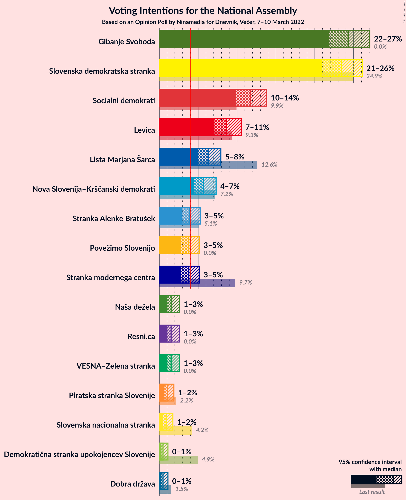

### Confidence Intervals

| Party | Last Result | Poll Result | 80% Confidence Interval | 90% Confidence Interval | 95% Confidence Interval | 99% Confidence Interval |
|:-----:|:-----------:|:-----------:|:-----------------------:|:-----------------------:|:-----------------------:|:-----------------------:|
| Gibanje Svoboda | 0.0% | 24.4% | 22.7–26.1% |22.3–26.6% |21.9–27.1% |21.1–27.9% |
| Slovenska demokratska stranka | 24.9% | 23.4% | 21.8–25.2% |21.4–25.7% |21.0–26.1% |20.2–26.9% |
| Socialni demokrati | 9.9% | 11.7% | 10.5–13.1% |10.2–13.5% |9.9–13.8% |9.4–14.5% |
| Levica | 9.3% | 8.7% | 7.6–9.9% |7.3–10.2% |7.1–10.5% |6.6–11.1% |
| Lista Marjana Šarca | 12.6% | 6.3% | 5.4–7.4% |5.2–7.7% |5.0–7.9% |4.6–8.5% |
| Nova Slovenija–Krščanski demokrati | 7.2% | 5.7% | 4.9–6.8% |4.7–7.0% |4.5–7.3% |4.1–7.8% |
| Stranka Alenke Bratušek | 5.1% | 3.9% | 3.2–4.8% |3.0–5.0% |2.9–5.3% |2.6–5.7% |
| Stranka modernega centra | 9.7% | 3.8% | 3.1–4.7% |3.0–4.9% |2.8–5.2% |2.5–5.6% |
| Povežimo Slovenijo | 0.0% | 3.8% | 3.1–4.7% |3.0–4.9% |2.8–5.2% |2.5–5.6% |
| Naša dežela | 0.0% | 1.6% | 1.2–2.2% |1.1–2.4% |1.0–2.6% |0.9–2.9% |
| Resni.ca | 0.0% | 1.6% | 1.2–2.2% |1.1–2.4% |1.0–2.6% |0.9–2.9% |
| VESNA–Zelena stranka | 0.0% | 1.6% | 1.2–2.2% |1.1–2.4% |1.0–2.6% |0.9–2.9% |
| Piratska stranka Slovenije | 2.2% | 1.0% | 0.7–1.6% |0.7–1.7% |0.6–1.9% |0.5–2.2% |
| Slovenska nacionalna stranka | 4.2% | 1.0% | 0.7–1.5% |0.6–1.6% |0.5–1.8% |0.4–2.0% |
| Demokratična stranka upokojencev Slovenije | 4.9% | 0.5% | 0.3–0.9% |0.2–1.0% |0.2–1.1% |0.1–1.3% |
| Dobra država | 1.5% | 0.5% | 0.3–0.9% |0.2–1.0% |0.2–1.1% |0.1–1.3% |

*Note:* The poll result column reflects the actual value used in the calculations. Published results may vary slightly, and in addition be rounded to fewer digits.

## Seats

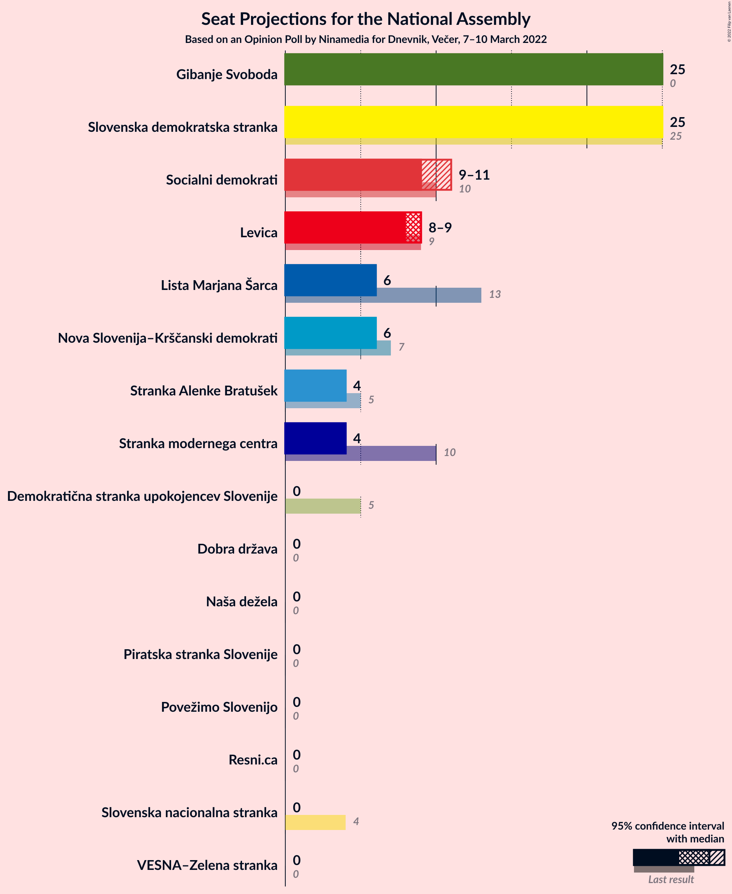

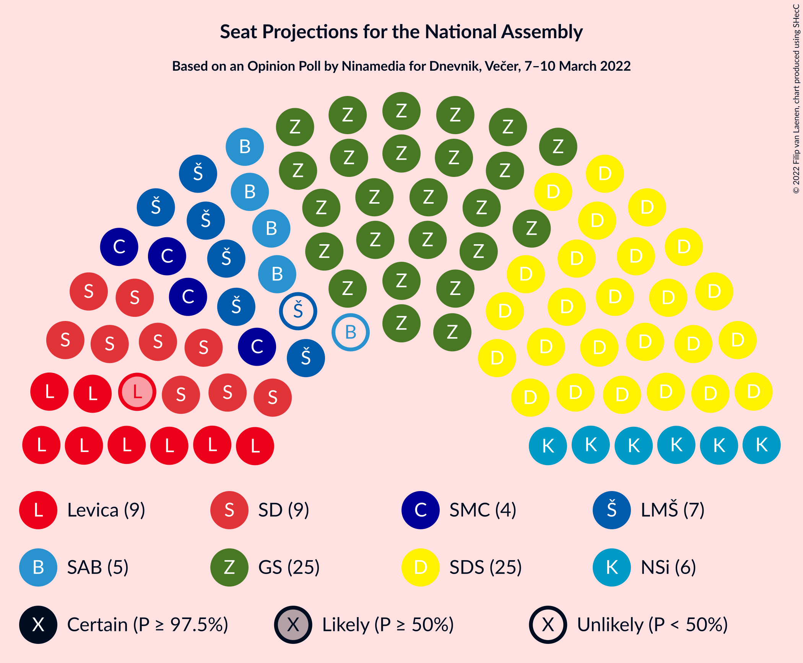

### Confidence Intervals

| Party | Last Result | Median | 80% Confidence Interval | 90% Confidence Interval | 95% Confidence Interval | 99% Confidence Interval |
|:-----:|:-----------:|:------:|:-----------------------:|:-----------------------:|:-----------------------:|:-----------------------:|
| <a href="#gibanje-svoboda">Gibanje Svoboda</a> | 0 | 25 | 25 |25 |25 |21–27 |
| <a href="#slovenska-demokratska-stranka">Slovenska demokratska stranka</a> | 25 | 25 | 25 |25 |25 |23–27 |
| <a href="#socialni-demokrati">Socialni demokrati</a> | 10 | 9 | 9 |9 |9–11 |9–13 |
| <a href="#levica">Levica</a> | 9 | 9 | 9 |9 |8–9 |7–9 |
| <a href="#lista-marjana-šarca">Lista Marjana Šarca</a> | 13 | 6 | 6 |6 |6 |6–7 |
| <a href="#nova-slovenija–krščanski-demokrati">Nova Slovenija–Krščanski demokrati</a> | 7 | 6 | 6 |6 |6 |5–7 |
| <a href="#stranka-alenke-bratušek">Stranka Alenke Bratušek</a> | 5 | 4 | 4 |4 |4 |0–5 |
| <a href="#stranka-modernega-centra">Stranka modernega centra</a> | 10 | 4 | 4 |4 |4 |0–4 |
| <a href="#povežimo-slovenijo">Povežimo Slovenijo</a> | 0 | 0 | 0 |0 |0 |0 |
| <a href="#naša-dežela">Naša dežela</a> | 0 | 0 | 0 |0 |0 |0 |
| <a href="#resni.ca">Resni.ca</a> | 0 | 0 | 0 |0 |0 |0 |
| <a href="#vesna–zelena-stranka">VESNA–Zelena stranka</a> | 0 | 0 | 0 |0 |0 |0 |
| <a href="#piratska-stranka-slovenije">Piratska stranka Slovenije</a> | 0 | 0 | 0 |0 |0 |0 |
| <a href="#slovenska-nacionalna-stranka">Slovenska nacionalna stranka</a> | 4 | 0 | 0 |0 |0 |0 |
| <a href="#demokratična-stranka-upokojencev-slovenije">Demokratična stranka upokojencev Slovenije</a> | 5 | 0 | 0 |0 |0 |0 |
| <a href="#dobra-država">Dobra država</a> | 0 | 0 | 0 |0 |0 |0 |

### Gibanje Svoboda

*For a full overview of the results for this party, see the [Gibanje Svoboda](party-gibanjesvoboda.html) page.*

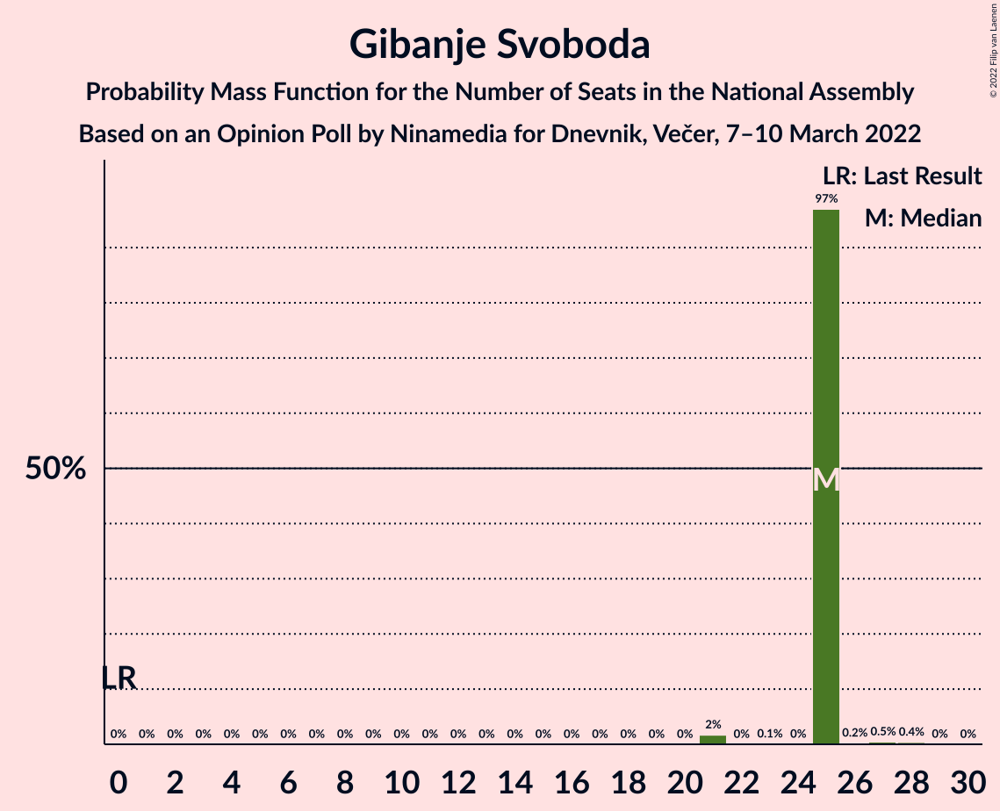

| Number of Seats | Probability | Accumulated | Special Marks |
|:---------------:|:-----------:|:-----------:|:-------------:|
| 0 | 0% | 100% | Last Result |
| 1 | 0% | 100% |  |
| 2 | 0% | 100% |  |
| 3 | 0% | 100% |  |
| 4 | 0% | 100% |  |
| 5 | 0% | 100% |  |
| 6 | 0% | 100% |  |
| 7 | 0% | 100% |  |
| 8 | 0% | 100% |  |
| 9 | 0% | 100% |  |
| 10 | 0% | 100% |  |
| 11 | 0% | 100% |  |
| 12 | 0% | 100% |  |
| 13 | 0% | 100% |  |
| 14 | 0% | 100% |  |
| 15 | 0% | 100% |  |
| 16 | 0% | 100% |  |
| 17 | 0% | 100% |  |
| 18 | 0% | 100% |  |
| 19 | 0% | 100% |  |
| 20 | 0% | 100% |  |
| 21 | 2% | 100% |  |
| 22 | 0% | 98% |  |
| 23 | 0.1% | 98% |  |
| 24 | 0% | 98% |  |
| 25 | 97% | 98% | Median |
| 26 | 0.2% | 1.1% |  |
| 27 | 0.5% | 0.9% |  |
| 28 | 0.4% | 0.4% |  |
| 29 | 0% | 0% |  |

### Slovenska demokratska stranka

*For a full overview of the results for this party, see the [Slovenska demokratska stranka](party-slovenskademokratskastranka.html) page.*

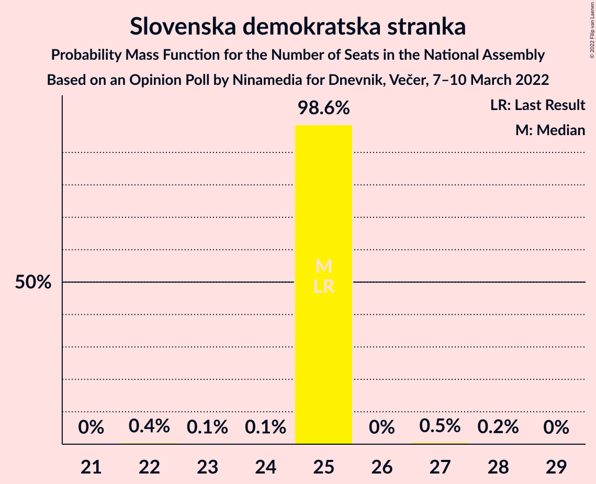

| Number of Seats | Probability | Accumulated | Special Marks |
|:---------------:|:-----------:|:-----------:|:-------------:|
| 21 | 0% | 100% |  |
| 22 | 0.4% | 99.9% |  |
| 23 | 0.1% | 99.5% |  |
| 24 | 0.1% | 99.4% |  |
| 25 | 98.6% | 99.3% | Last Result, Median |
| 26 | 0% | 0.7% |  |
| 27 | 0.5% | 0.7% |  |
| 28 | 0.2% | 0.2% |  |
| 29 | 0% | 0% |  |

### Socialni demokrati

*For a full overview of the results for this party, see the [Socialni demokrati](party-socialnidemokrati.html) page.*

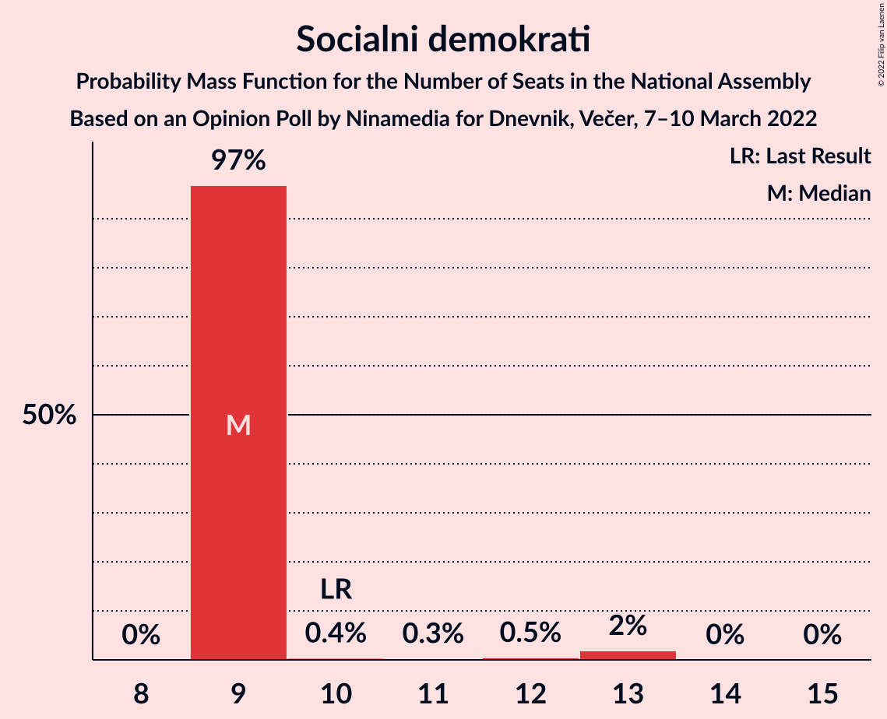

| Number of Seats | Probability | Accumulated | Special Marks |
|:---------------:|:-----------:|:-----------:|:-------------:|
| 9 | 97% | 100% | Median |
| 10 | 0.4% | 3% | Last Result |
| 11 | 0.3% | 3% |  |
| 12 | 0.5% | 2% |  |
| 13 | 2% | 2% |  |
| 14 | 0% | 0.1% |  |
| 15 | 0% | 0% |  |

### Levica

*For a full overview of the results for this party, see the [Levica](party-levica.html) page.*

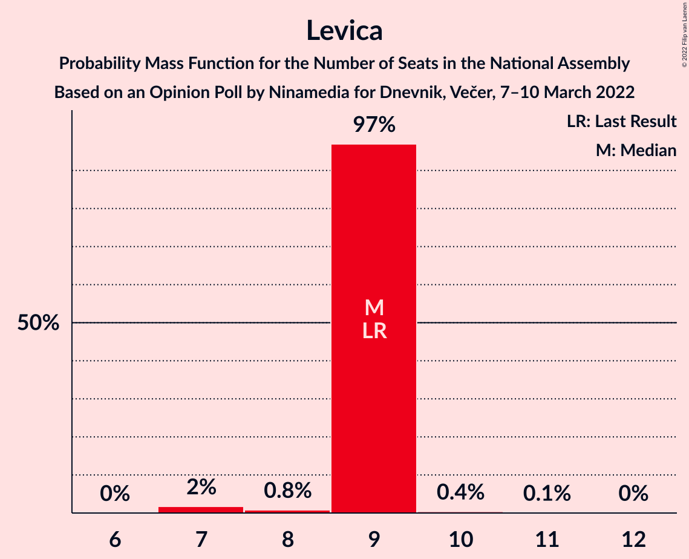

| Number of Seats | Probability | Accumulated | Special Marks |
|:---------------:|:-----------:|:-----------:|:-------------:|
| 7 | 2% | 100% |  |
| 8 | 0.8% | 98% |  |
| 9 | 97% | 97% | Last Result, Median |
| 10 | 0.4% | 0.5% |  |
| 11 | 0.1% | 0.1% |  |
| 12 | 0% | 0% |  |

### Lista Marjana Šarca

*For a full overview of the results for this party, see the [Lista Marjana Šarca](party-listamarjanašarca.html) page.*

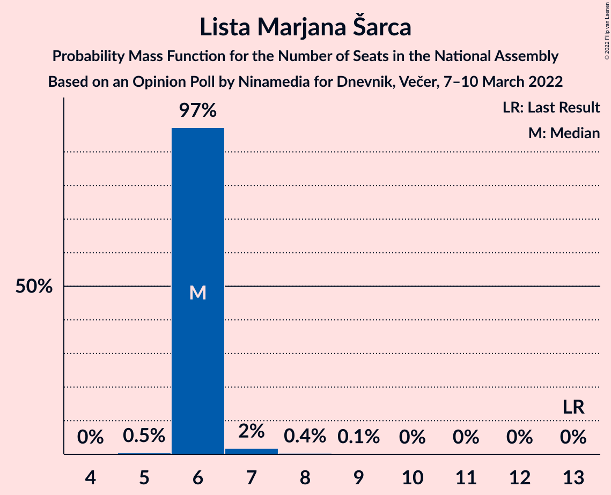

| Number of Seats | Probability | Accumulated | Special Marks |
|:---------------:|:-----------:|:-----------:|:-------------:|
| 5 | 0.5% | 100% |  |
| 6 | 97% | 99.5% | Median |
| 7 | 2% | 2% |  |
| 8 | 0.4% | 0.5% |  |
| 9 | 0.1% | 0.1% |  |
| 10 | 0% | 0% |  |
| 11 | 0% | 0% |  |
| 12 | 0% | 0% |  |
| 13 | 0% | 0% | Last Result |

### Nova Slovenija–Krščanski demokrati

*For a full overview of the results for this party, see the [Nova Slovenija–Krščanski demokrati](party-novaslovenija–krščanskidemokrati.html) page.*

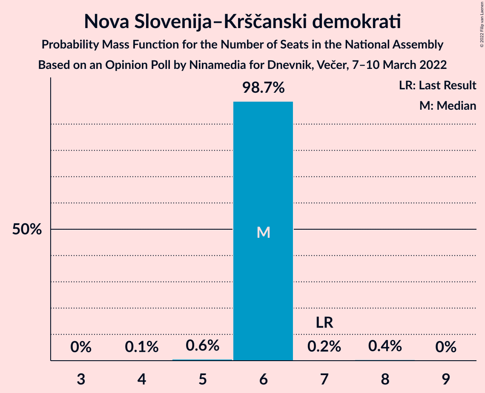

| Number of Seats | Probability | Accumulated | Special Marks |
|:---------------:|:-----------:|:-----------:|:-------------:|
| 4 | 0.1% | 100% |  |
| 5 | 0.6% | 99.9% |  |
| 6 | 98.7% | 99.3% | Median |
| 7 | 0.2% | 0.6% | Last Result |
| 8 | 0.4% | 0.4% |  |
| 9 | 0% | 0% |  |

### Stranka Alenke Bratušek

*For a full overview of the results for this party, see the [Stranka Alenke Bratušek](party-strankaalenkebratušek.html) page.*

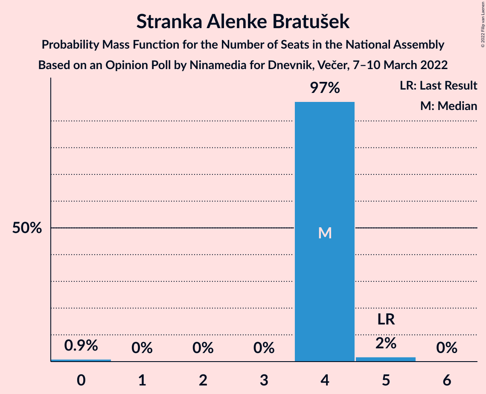

| Number of Seats | Probability | Accumulated | Special Marks |
|:---------------:|:-----------:|:-----------:|:-------------:|
| 0 | 0.9% | 100% |  |
| 1 | 0% | 99.1% |  |
| 2 | 0% | 99.1% |  |
| 3 | 0% | 99.1% |  |
| 4 | 97% | 99.1% | Median |
| 5 | 2% | 2% | Last Result |
| 6 | 0% | 0% |  |

### Stranka modernega centra

*For a full overview of the results for this party, see the [Stranka modernega centra](party-strankamodernegacentra.html) page.*

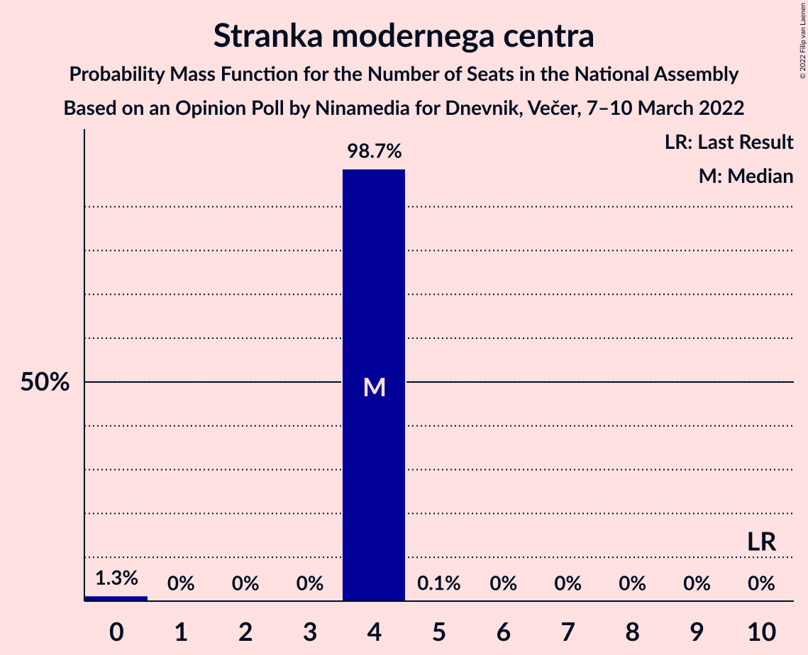

| Number of Seats | Probability | Accumulated | Special Marks |
|:---------------:|:-----------:|:-----------:|:-------------:|
| 0 | 1.3% | 100% |  |
| 1 | 0% | 98.7% |  |
| 2 | 0% | 98.7% |  |
| 3 | 0% | 98.7% |  |
| 4 | 98.7% | 98.7% | Median |
| 5 | 0.1% | 0.1% |  |
| 6 | 0% | 0% |  |
| 7 | 0% | 0% |  |
| 8 | 0% | 0% |  |
| 9 | 0% | 0% |  |
| 10 | 0% | 0% | Last Result |

### Povežimo Slovenijo

*For a full overview of the results for this party, see the [Povežimo Slovenijo](party-povežimoslovenijo.html) page.*

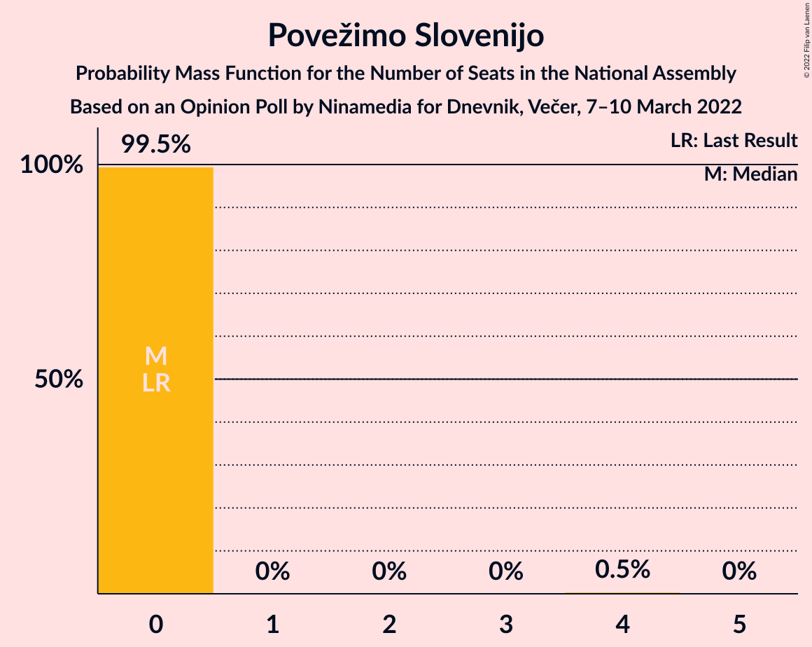

| Number of Seats | Probability | Accumulated | Special Marks |
|:---------------:|:-----------:|:-----------:|:-------------:|
| 0 | 99.5% | 100% | Last Result, Median |
| 1 | 0% | 0.5% |  |
| 2 | 0% | 0.5% |  |
| 3 | 0% | 0.5% |  |
| 4 | 0.5% | 0.5% |  |
| 5 | 0% | 0% |  |

### Naša dežela

*For a full overview of the results for this party, see the [Naša dežela](party-našadežela.html) page.*

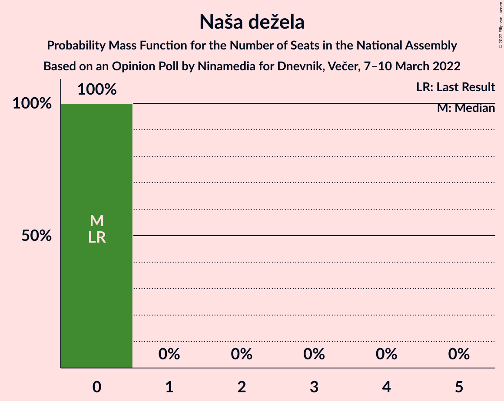

| Number of Seats | Probability | Accumulated | Special Marks |
|:---------------:|:-----------:|:-----------:|:-------------:|
| 0 | 100% | 100% | Last Result, Median |

### Resni.ca

*For a full overview of the results for this party, see the [Resni.ca](party-resnica.html) page.*

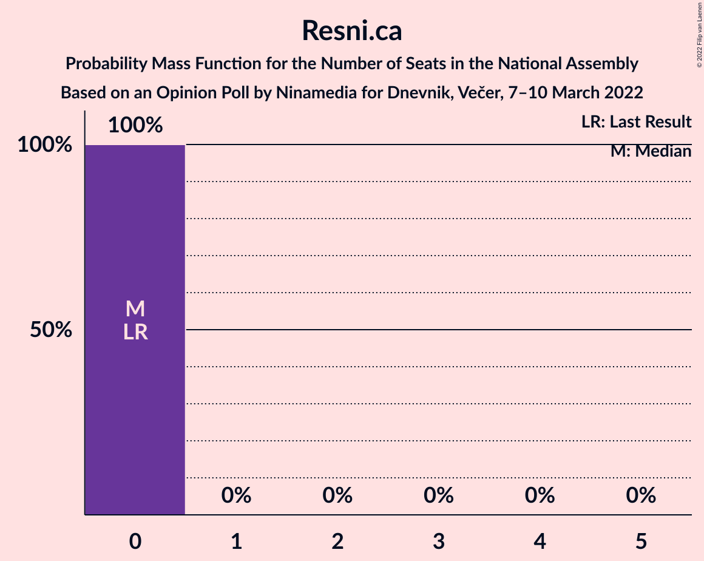

| Number of Seats | Probability | Accumulated | Special Marks |
|:---------------:|:-----------:|:-----------:|:-------------:|
| 0 | 100% | 100% | Last Result, Median |

### VESNA–Zelena stranka

*For a full overview of the results for this party, see the [VESNA–Zelena stranka](party-vesna–zelenastranka.html) page.*

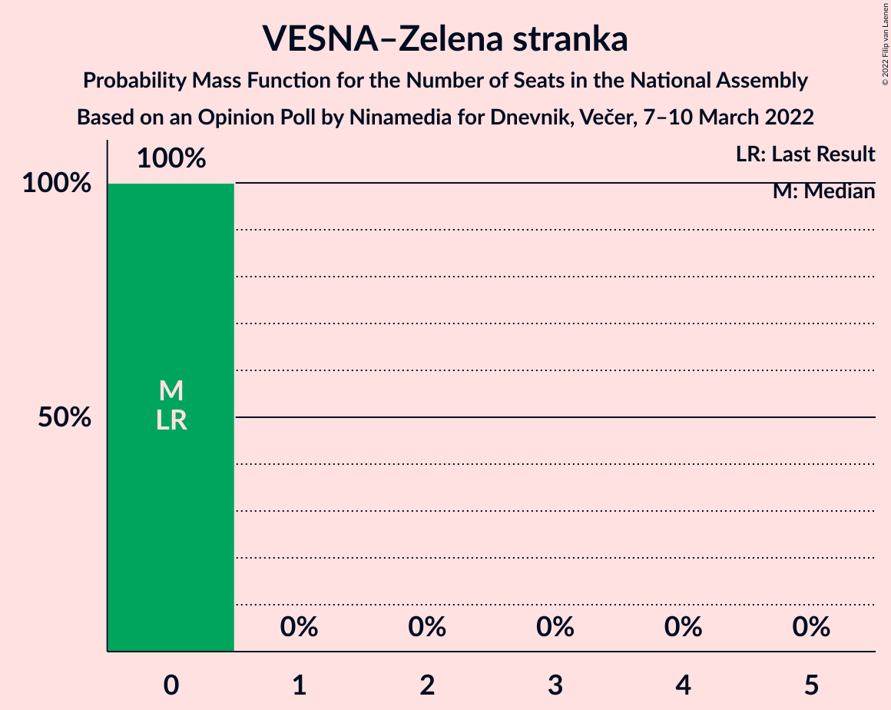

| Number of Seats | Probability | Accumulated | Special Marks |
|:---------------:|:-----------:|:-----------:|:-------------:|
| 0 | 100% | 100% | Last Result, Median |

### Piratska stranka Slovenije

*For a full overview of the results for this party, see the [Piratska stranka Slovenije](party-piratskastrankaslovenije.html) page.*

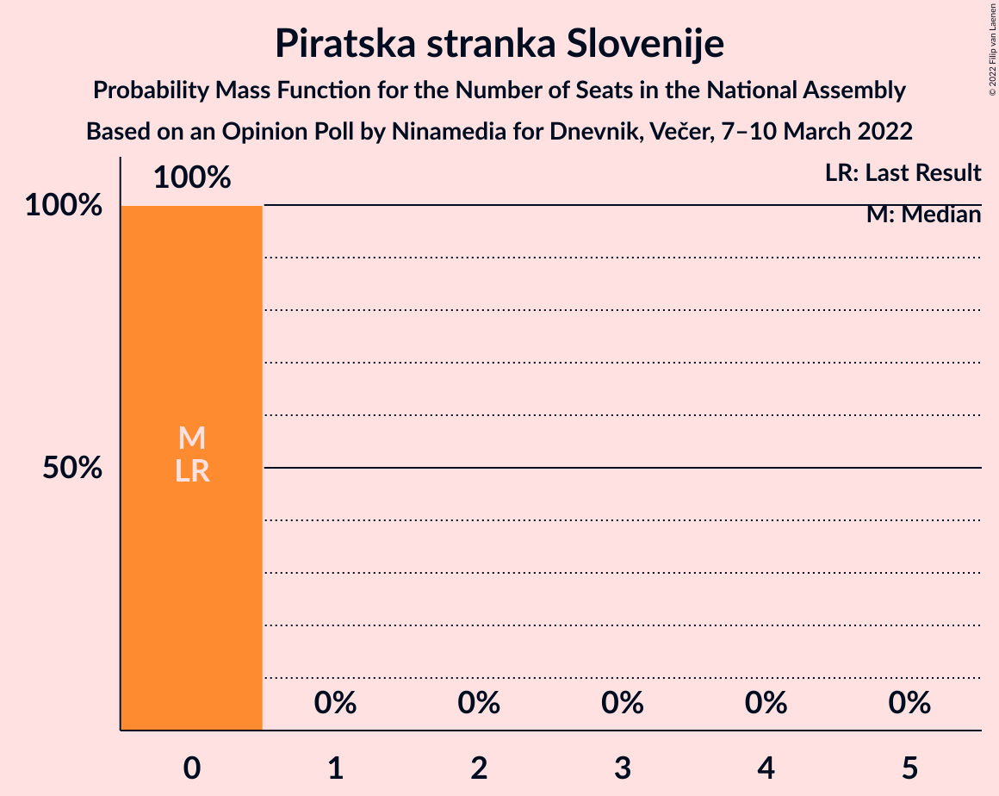

| Number of Seats | Probability | Accumulated | Special Marks |
|:---------------:|:-----------:|:-----------:|:-------------:|
| 0 | 100% | 100% | Last Result, Median |

### Slovenska nacionalna stranka

*For a full overview of the results for this party, see the [Slovenska nacionalna stranka](party-slovenskanacionalnastranka.html) page.*

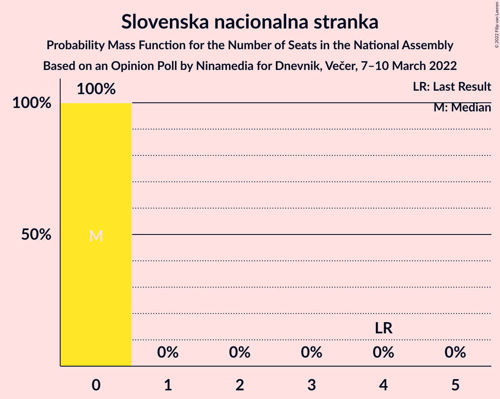

| Number of Seats | Probability | Accumulated | Special Marks |
|:---------------:|:-----------:|:-----------:|:-------------:|
| 0 | 100% | 100% | Median |
| 1 | 0% | 0% |  |
| 2 | 0% | 0% |  |
| 3 | 0% | 0% |  |
| 4 | 0% | 0% | Last Result |

### Demokratična stranka upokojencev Slovenije

*For a full overview of the results for this party, see the [Demokratična stranka upokojencev Slovenije](party-demokratičnastrankaupokojencevslovenije.html) page.*

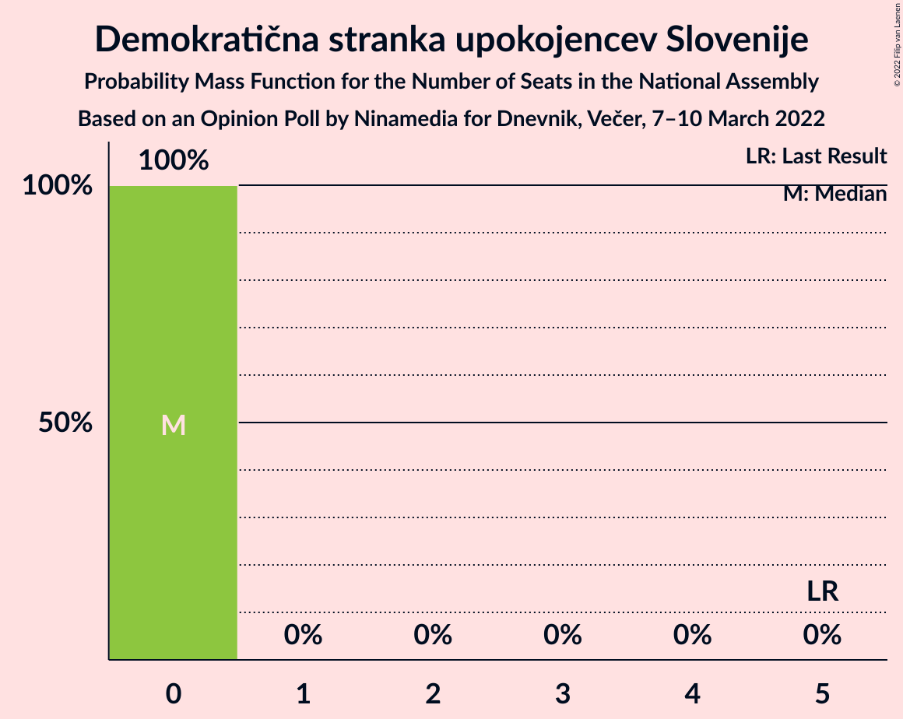

| Number of Seats | Probability | Accumulated | Special Marks |
|:---------------:|:-----------:|:-----------:|:-------------:|
| 0 | 100% | 100% | Median |
| 1 | 0% | 0% |  |
| 2 | 0% | 0% |  |
| 3 | 0% | 0% |  |
| 4 | 0% | 0% |  |
| 5 | 0% | 0% | Last Result |

### Dobra država

*For a full overview of the results for this party, see the [Dobra država](party-dobradržava.html) page.*

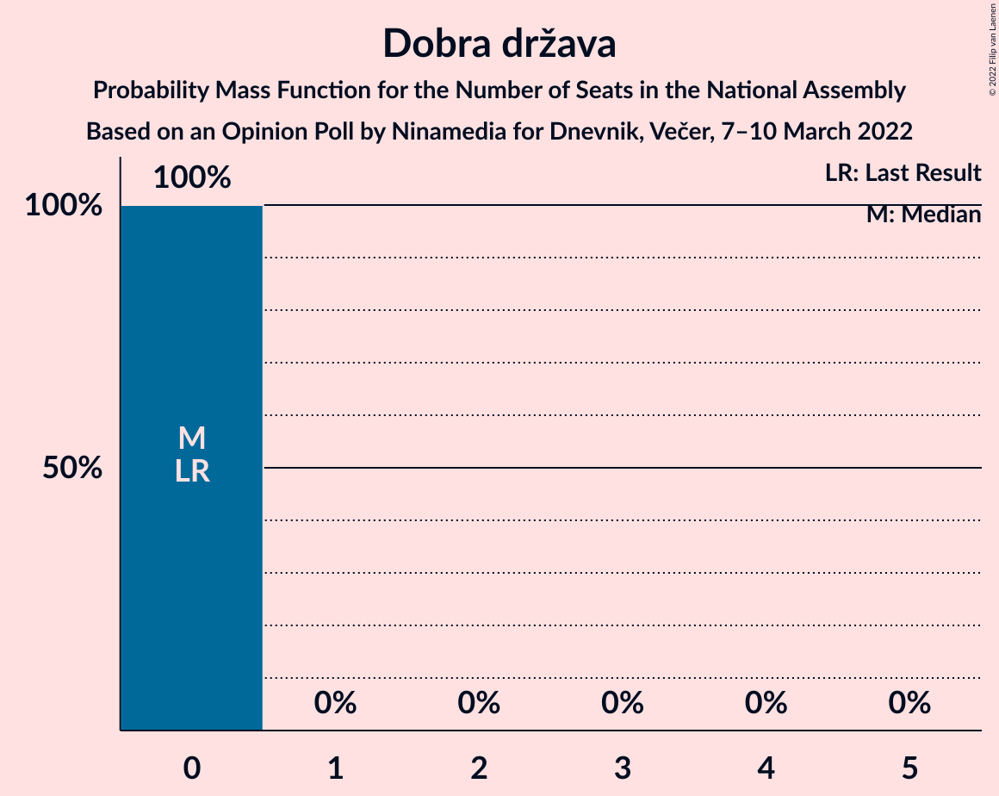

| Number of Seats | Probability | Accumulated | Special Marks |
|:---------------:|:-----------:|:-----------:|:-------------:|
| 0 | 100% | 100% | Last Result, Median |

## Coalitions

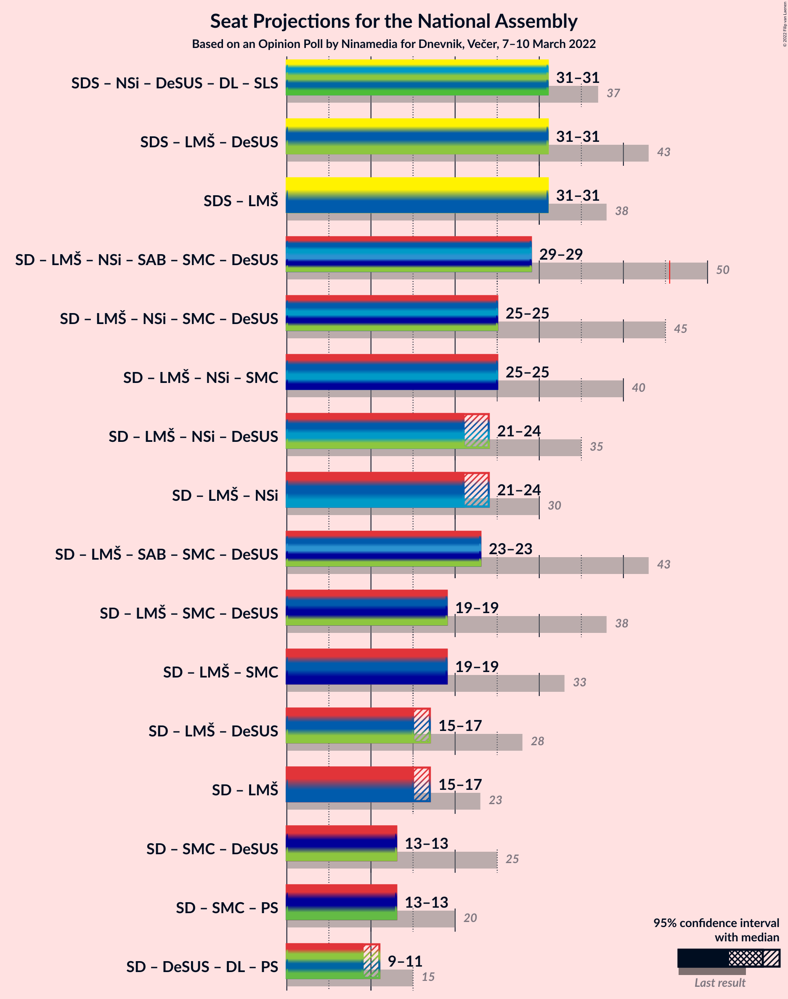

### Confidence Intervals

| Coalition | Last Result | Median | Majority? | 80% Confidence Interval | 90% Confidence Interval | 95% Confidence Interval | 99% Confidence Interval |
|:---------:|:-----------:|:------:|:---------:|:-----------------------:|:-----------------------:|:-----------------------:|:-----------------------:|
| Slovenska demokratska stranka – Lista Marjana Šarca – Demokratična stranka upokojencev Slovenije | 43 | 31 | 0% | 31 | 31 | 31 | 30–32 |
| Slovenska demokratska stranka – Lista Marjana Šarca | 38 | 31 | 0% | 31 | 31 | 31 | 30–32 |
| Socialni demokrati – Lista Marjana Šarca – Nova Slovenija–Krščanski demokrati – Stranka Alenke Bratušek – Stranka modernega centra – Demokratična stranka upokojencev Slovenije | 50 | 29 | 0% | 29 | 29 | 29 | 25–35 |
| Socialni demokrati – Lista Marjana Šarca – Nova Slovenija–Krščanski demokrati – Stranka modernega centra – Demokratična stranka upokojencev Slovenije | 45 | 25 | 0% | 25 | 25 | 25 | 24–30 |
| Socialni demokrati – Lista Marjana Šarca – Nova Slovenija–Krščanski demokrati – Stranka modernega centra | 40 | 25 | 0% | 25 | 25 | 25 | 24–30 |
| Socialni demokrati – Lista Marjana Šarca – Nova Slovenija–Krščanski demokrati – Demokratična stranka upokojencev Slovenije | 35 | 21 | 0% | 21 | 21 | 21–24 | 21–26 |
| Socialni demokrati – Lista Marjana Šarca – Nova Slovenija–Krščanski demokrati | 30 | 21 | 0% | 21 | 21 | 21–24 | 21–26 |
| Socialni demokrati – Lista Marjana Šarca – Stranka Alenke Bratušek – Stranka modernega centra – Demokratična stranka upokojencev Slovenije | 43 | 23 | 0% | 23 | 23 | 23 | 17–29 |
| Socialni demokrati – Lista Marjana Šarca – Stranka modernega centra – Demokratična stranka upokojencev Slovenije | 38 | 19 | 0% | 19 | 19 | 19 | 17–24 |
| Socialni demokrati – Lista Marjana Šarca – Stranka modernega centra | 33 | 19 | 0% | 19 | 19 | 19 | 17–24 |
| Socialni demokrati – Lista Marjana Šarca – Demokratična stranka upokojencev Slovenije | 28 | 15 | 0% | 15 | 15 | 15–17 | 15–20 |
| Socialni demokrati – Lista Marjana Šarca | 23 | 15 | 0% | 15 | 15 | 15–17 | 15–20 |
| Socialni demokrati – Stranka modernega centra – Demokratična stranka upokojencev Slovenije | 25 | 13 | 0% | 13 | 13 | 13 | 11–17 |

### Slovenska demokratska stranka – Lista Marjana Šarca – Demokratična stranka upokojencev Slovenije

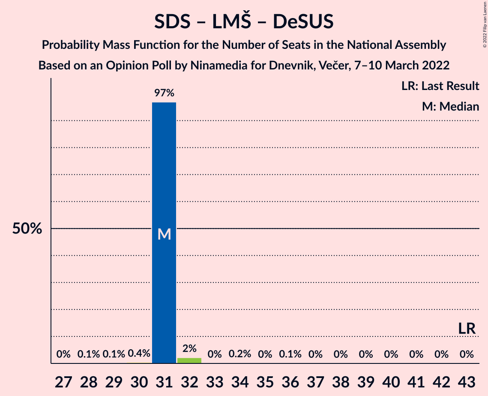

| Number of Seats | Probability | Accumulated | Special Marks |
|:---------------:|:-----------:|:-----------:|:-------------:|
| 27 | 0% | 100% |  |
| 28 | 0.1% | 99.9% |  |
| 29 | 0.1% | 99.9% |  |
| 30 | 0.4% | 99.8% |  |
| 31 | 97% | 99.4% | Median |
| 32 | 2% | 2% |  |
| 33 | 0% | 0.3% |  |
| 34 | 0.2% | 0.3% |  |
| 35 | 0% | 0.1% |  |
| 36 | 0.1% | 0.1% |  |
| 37 | 0% | 0% |  |
| 38 | 0% | 0% |  |
| 39 | 0% | 0% |  |
| 40 | 0% | 0% |  |
| 41 | 0% | 0% |  |
| 42 | 0% | 0% |  |
| 43 | 0% | 0% | Last Result |

### Slovenska demokratska stranka – Lista Marjana Šarca

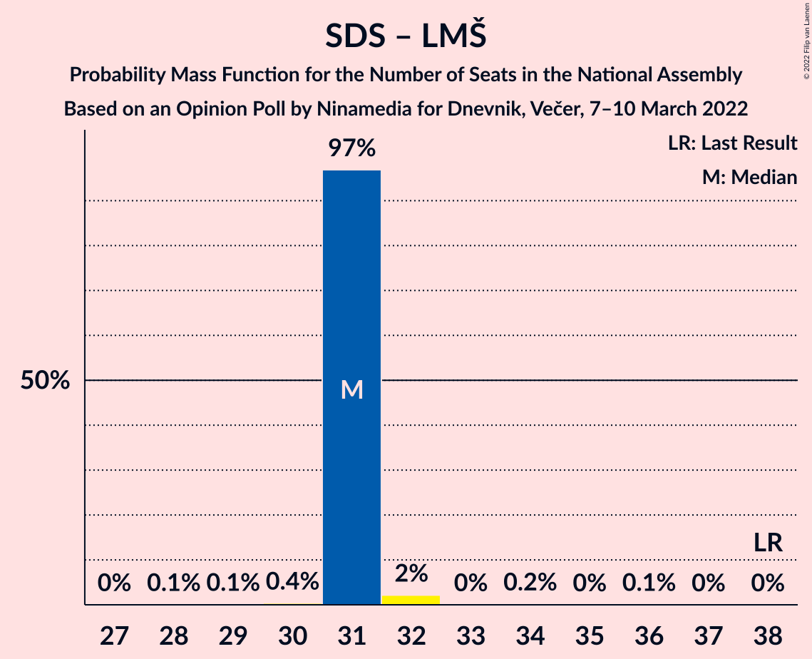

| Number of Seats | Probability | Accumulated | Special Marks |
|:---------------:|:-----------:|:-----------:|:-------------:|
| 27 | 0% | 100% |  |
| 28 | 0.1% | 99.9% |  |
| 29 | 0.1% | 99.9% |  |
| 30 | 0.4% | 99.8% |  |
| 31 | 97% | 99.4% | Median |
| 32 | 2% | 2% |  |
| 33 | 0% | 0.3% |  |
| 34 | 0.2% | 0.3% |  |
| 35 | 0% | 0.1% |  |
| 36 | 0.1% | 0.1% |  |
| 37 | 0% | 0% |  |
| 38 | 0% | 0% | Last Result |

### Socialni demokrati – Lista Marjana Šarca – Nova Slovenija–Krščanski demokrati – Stranka Alenke Bratušek – Stranka modernega centra – Demokratična stranka upokojencev Slovenije

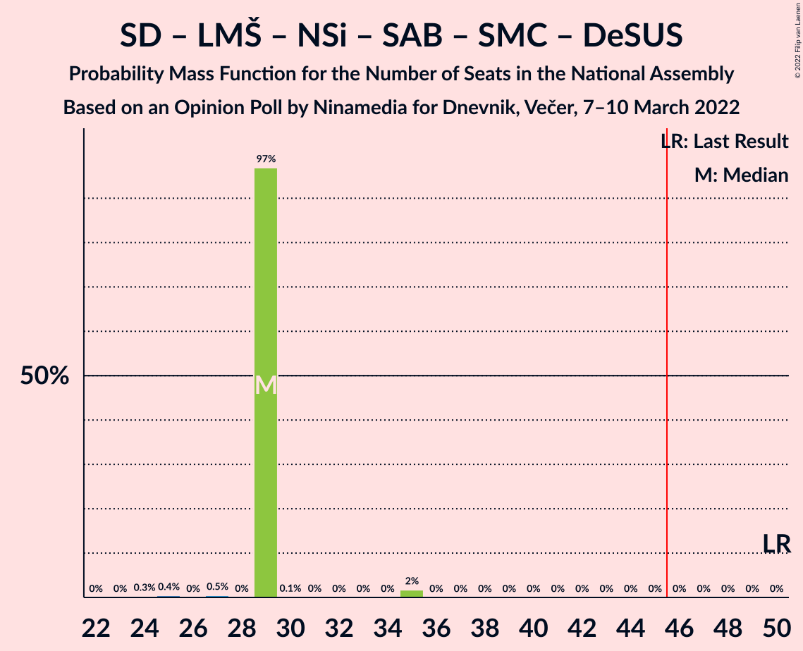

| Number of Seats | Probability | Accumulated | Special Marks |
|:---------------:|:-----------:|:-----------:|:-------------:|
| 24 | 0.3% | 100% |  |
| 25 | 0.4% | 99.7% |  |
| 26 | 0% | 99.3% |  |
| 27 | 0.5% | 99.3% |  |
| 28 | 0% | 98.8% |  |
| 29 | 97% | 98.8% | Median |
| 30 | 0.1% | 2% |  |
| 31 | 0% | 2% |  |
| 32 | 0% | 2% |  |
| 33 | 0% | 2% |  |
| 34 | 0% | 2% |  |
| 35 | 2% | 2% |  |
| 36 | 0% | 0% |  |
| 37 | 0% | 0% |  |
| 38 | 0% | 0% |  |
| 39 | 0% | 0% |  |
| 40 | 0% | 0% |  |
| 41 | 0% | 0% |  |
| 42 | 0% | 0% |  |
| 43 | 0% | 0% |  |
| 44 | 0% | 0% |  |
| 45 | 0% | 0% |  |
| 46 | 0% | 0% | Majority |
| 47 | 0% | 0% |  |
| 48 | 0% | 0% |  |
| 49 | 0% | 0% |  |
| 50 | 0% | 0% | Last Result |

### Socialni demokrati – Lista Marjana Šarca – Nova Slovenija–Krščanski demokrati – Stranka modernega centra – Demokratična stranka upokojencev Slovenije

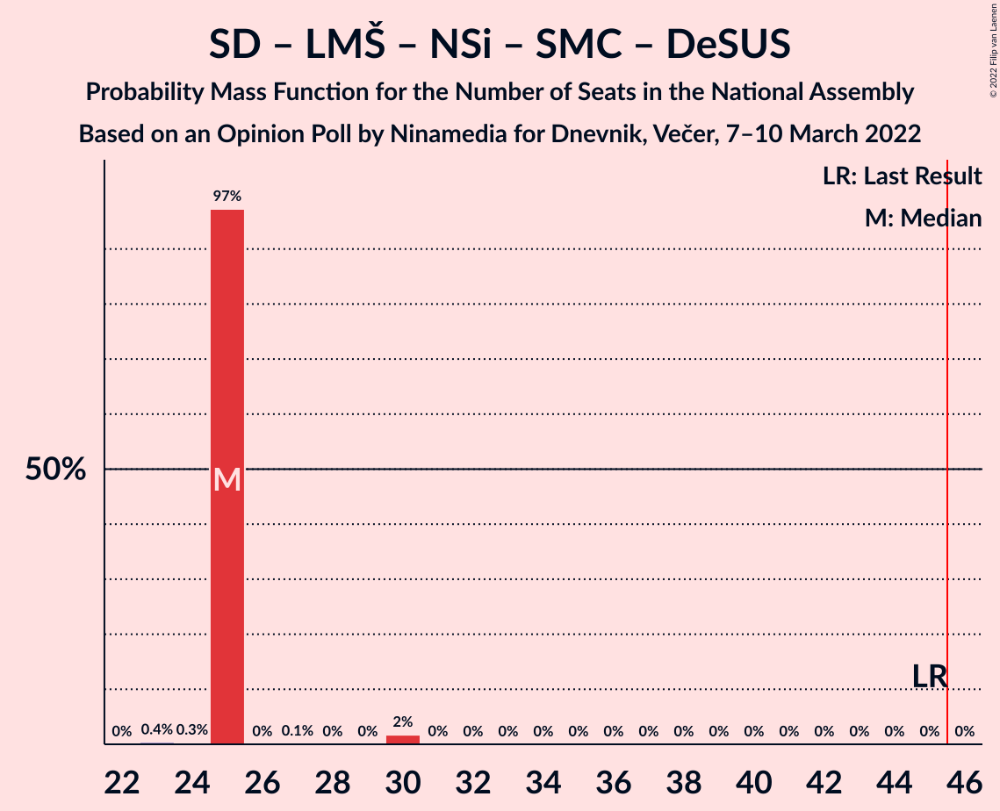

| Number of Seats | Probability | Accumulated | Special Marks |
|:---------------:|:-----------:|:-----------:|:-------------:|
| 23 | 0.4% | 100% |  |
| 24 | 0.3% | 99.6% |  |
| 25 | 97% | 99.3% | Median |
| 26 | 0% | 2% |  |
| 27 | 0.1% | 2% |  |
| 28 | 0% | 2% |  |
| 29 | 0% | 2% |  |
| 30 | 2% | 2% |  |
| 31 | 0% | 0% |  |
| 32 | 0% | 0% |  |
| 33 | 0% | 0% |  |
| 34 | 0% | 0% |  |
| 35 | 0% | 0% |  |
| 36 | 0% | 0% |  |
| 37 | 0% | 0% |  |
| 38 | 0% | 0% |  |
| 39 | 0% | 0% |  |
| 40 | 0% | 0% |  |
| 41 | 0% | 0% |  |
| 42 | 0% | 0% |  |
| 43 | 0% | 0% |  |
| 44 | 0% | 0% |  |
| 45 | 0% | 0% | Last Result |

### Socialni demokrati – Lista Marjana Šarca – Nova Slovenija–Krščanski demokrati – Stranka modernega centra

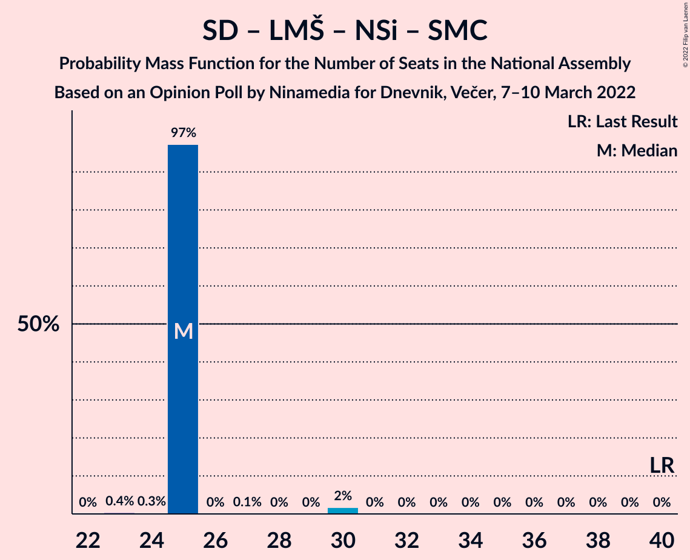

| Number of Seats | Probability | Accumulated | Special Marks |
|:---------------:|:-----------:|:-----------:|:-------------:|
| 23 | 0.4% | 100% |  |
| 24 | 0.3% | 99.6% |  |
| 25 | 97% | 99.3% | Median |
| 26 | 0% | 2% |  |
| 27 | 0.1% | 2% |  |
| 28 | 0% | 2% |  |
| 29 | 0% | 2% |  |
| 30 | 2% | 2% |  |
| 31 | 0% | 0% |  |
| 32 | 0% | 0% |  |
| 33 | 0% | 0% |  |
| 34 | 0% | 0% |  |
| 35 | 0% | 0% |  |
| 36 | 0% | 0% |  |
| 37 | 0% | 0% |  |
| 38 | 0% | 0% |  |
| 39 | 0% | 0% |  |
| 40 | 0% | 0% | Last Result |

### Socialni demokrati – Lista Marjana Šarca – Nova Slovenija–Krščanski demokrati – Demokratična stranka upokojencev Slovenije

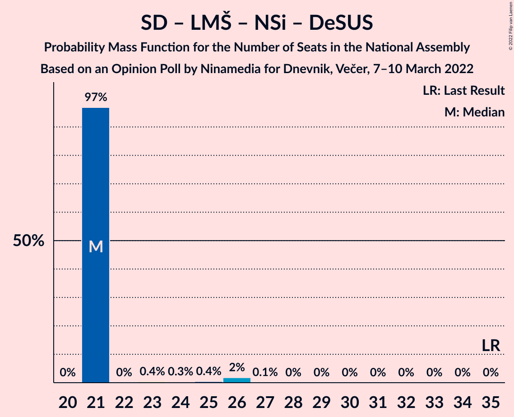

| Number of Seats | Probability | Accumulated | Special Marks |
|:---------------:|:-----------:|:-----------:|:-------------:|
| 21 | 97% | 100% | Median |
| 22 | 0% | 3% |  |
| 23 | 0.4% | 3% |  |
| 24 | 0.3% | 3% |  |
| 25 | 0.4% | 2% |  |
| 26 | 2% | 2% |  |
| 27 | 0.1% | 0.1% |  |
| 28 | 0% | 0% |  |
| 29 | 0% | 0% |  |
| 30 | 0% | 0% |  |
| 31 | 0% | 0% |  |
| 32 | 0% | 0% |  |
| 33 | 0% | 0% |  |
| 34 | 0% | 0% |  |
| 35 | 0% | 0% | Last Result |

### Socialni demokrati – Lista Marjana Šarca – Nova Slovenija–Krščanski demokrati

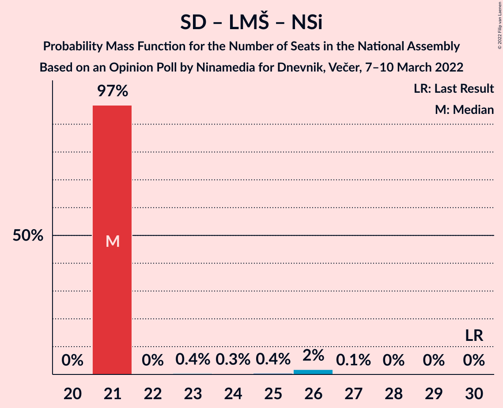

| Number of Seats | Probability | Accumulated | Special Marks |
|:---------------:|:-----------:|:-----------:|:-------------:|
| 21 | 97% | 100% | Median |
| 22 | 0% | 3% |  |
| 23 | 0.4% | 3% |  |
| 24 | 0.3% | 3% |  |
| 25 | 0.4% | 2% |  |
| 26 | 2% | 2% |  |
| 27 | 0.1% | 0.1% |  |
| 28 | 0% | 0% |  |
| 29 | 0% | 0% |  |
| 30 | 0% | 0% | Last Result |

### Socialni demokrati – Lista Marjana Šarca – Stranka Alenke Bratušek – Stranka modernega centra – Demokratična stranka upokojencev Slovenije

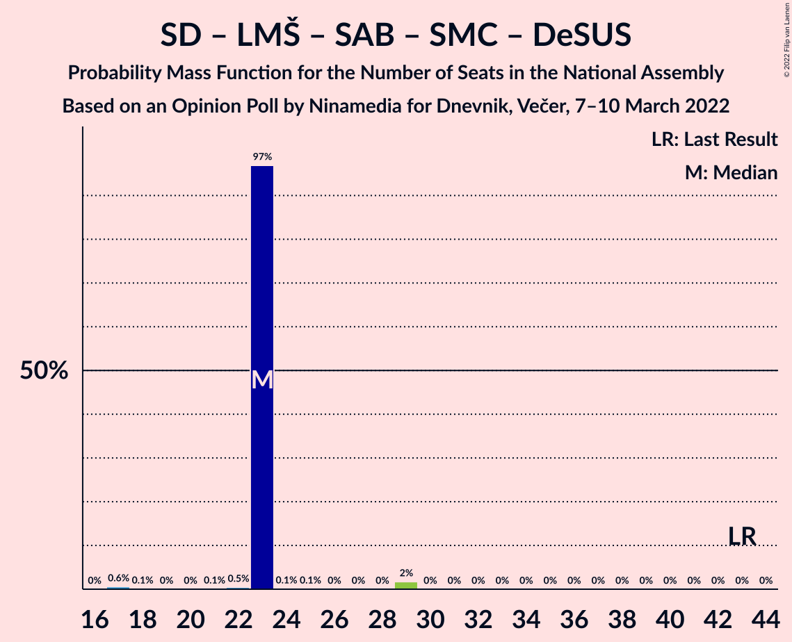

| Number of Seats | Probability | Accumulated | Special Marks |
|:---------------:|:-----------:|:-----------:|:-------------:|
| 17 | 0.6% | 100% |  |
| 18 | 0.1% | 99.4% |  |
| 19 | 0% | 99.4% |  |
| 20 | 0% | 99.3% |  |
| 21 | 0.1% | 99.3% |  |
| 22 | 0.5% | 99.3% |  |
| 23 | 97% | 98.8% | Median |
| 24 | 0.1% | 2% |  |
| 25 | 0.1% | 2% |  |
| 26 | 0% | 2% |  |
| 27 | 0% | 2% |  |
| 28 | 0% | 2% |  |
| 29 | 2% | 2% |  |
| 30 | 0% | 0% |  |
| 31 | 0% | 0% |  |
| 32 | 0% | 0% |  |
| 33 | 0% | 0% |  |
| 34 | 0% | 0% |  |
| 35 | 0% | 0% |  |
| 36 | 0% | 0% |  |
| 37 | 0% | 0% |  |
| 38 | 0% | 0% |  |
| 39 | 0% | 0% |  |
| 40 | 0% | 0% |  |
| 41 | 0% | 0% |  |
| 42 | 0% | 0% |  |
| 43 | 0% | 0% | Last Result |

### Socialni demokrati – Lista Marjana Šarca – Stranka modernega centra – Demokratična stranka upokojencev Slovenije

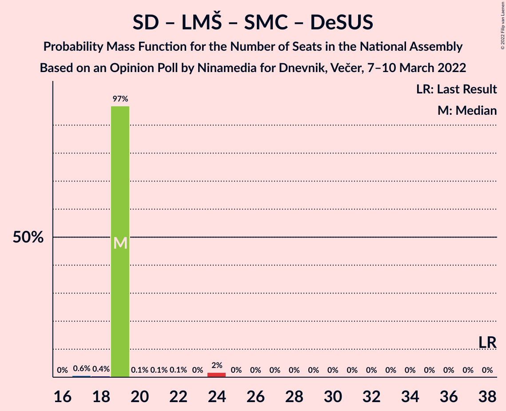

| Number of Seats | Probability | Accumulated | Special Marks |
|:---------------:|:-----------:|:-----------:|:-------------:|
| 17 | 0.6% | 100% |  |
| 18 | 0.4% | 99.4% |  |
| 19 | 97% | 98.9% | Median |
| 20 | 0.1% | 2% |  |
| 21 | 0.1% | 2% |  |
| 22 | 0.1% | 2% |  |
| 23 | 0% | 2% |  |
| 24 | 2% | 2% |  |
| 25 | 0% | 0% |  |
| 26 | 0% | 0% |  |
| 27 | 0% | 0% |  |
| 28 | 0% | 0% |  |
| 29 | 0% | 0% |  |
| 30 | 0% | 0% |  |
| 31 | 0% | 0% |  |
| 32 | 0% | 0% |  |
| 33 | 0% | 0% |  |
| 34 | 0% | 0% |  |
| 35 | 0% | 0% |  |
| 36 | 0% | 0% |  |
| 37 | 0% | 0% |  |
| 38 | 0% | 0% | Last Result |

### Socialni demokrati – Lista Marjana Šarca – Stranka modernega centra

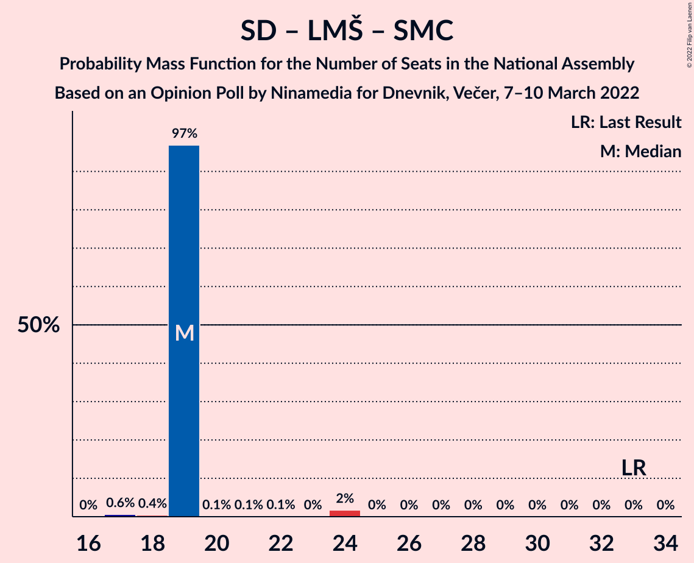

| Number of Seats | Probability | Accumulated | Special Marks |
|:---------------:|:-----------:|:-----------:|:-------------:|
| 17 | 0.6% | 100% |  |
| 18 | 0.4% | 99.4% |  |
| 19 | 97% | 98.9% | Median |
| 20 | 0.1% | 2% |  |
| 21 | 0.1% | 2% |  |
| 22 | 0.1% | 2% |  |
| 23 | 0% | 2% |  |
| 24 | 2% | 2% |  |
| 25 | 0% | 0% |  |
| 26 | 0% | 0% |  |
| 27 | 0% | 0% |  |
| 28 | 0% | 0% |  |
| 29 | 0% | 0% |  |
| 30 | 0% | 0% |  |
| 31 | 0% | 0% |  |
| 32 | 0% | 0% |  |
| 33 | 0% | 0% | Last Result |

### Socialni demokrati – Lista Marjana Šarca – Demokratična stranka upokojencev Slovenije

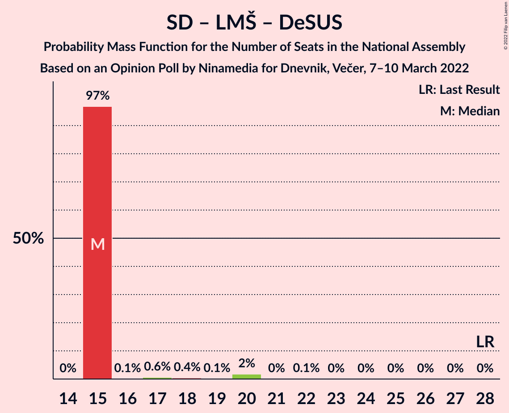

| Number of Seats | Probability | Accumulated | Special Marks |
|:---------------:|:-----------:|:-----------:|:-------------:|
| 15 | 97% | 100% | Median |
| 16 | 0.1% | 3% |  |
| 17 | 0.6% | 3% |  |
| 18 | 0.4% | 2% |  |
| 19 | 0.1% | 2% |  |
| 20 | 2% | 2% |  |
| 21 | 0% | 0.1% |  |
| 22 | 0.1% | 0.1% |  |
| 23 | 0% | 0% |  |
| 24 | 0% | 0% |  |
| 25 | 0% | 0% |  |
| 26 | 0% | 0% |  |
| 27 | 0% | 0% |  |
| 28 | 0% | 0% | Last Result |

### Socialni demokrati – Lista Marjana Šarca

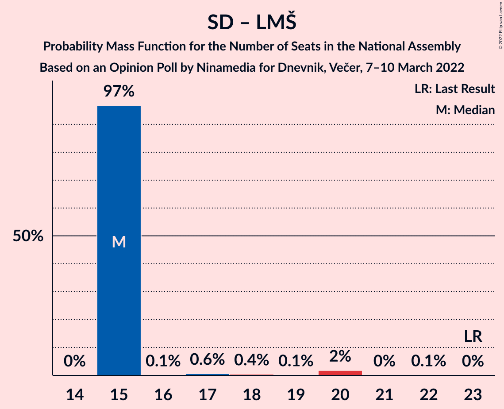

| Number of Seats | Probability | Accumulated | Special Marks |
|:---------------:|:-----------:|:-----------:|:-------------:|
| 15 | 97% | 100% | Median |
| 16 | 0.1% | 3% |  |
| 17 | 0.6% | 3% |  |
| 18 | 0.4% | 2% |  |
| 19 | 0.1% | 2% |  |
| 20 | 2% | 2% |  |
| 21 | 0% | 0.1% |  |
| 22 | 0.1% | 0.1% |  |
| 23 | 0% | 0% | Last Result |

### Socialni demokrati – Stranka modernega centra – Demokratična stranka upokojencev Slovenije

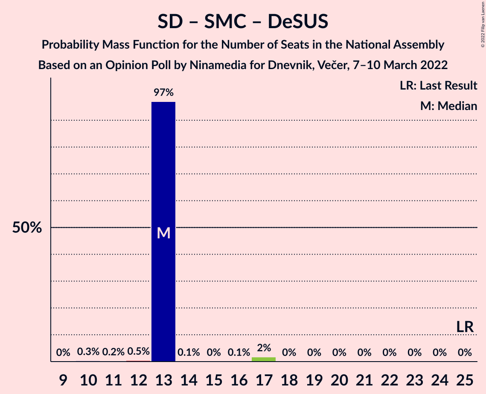

| Number of Seats | Probability | Accumulated | Special Marks |
|:---------------:|:-----------:|:-----------:|:-------------:|
| 10 | 0.3% | 100% |  |
| 11 | 0.2% | 99.7% |  |
| 12 | 0.5% | 99.4% |  |
| 13 | 97% | 98.9% | Median |
| 14 | 0.1% | 2% |  |
| 15 | 0% | 2% |  |
| 16 | 0.1% | 2% |  |
| 17 | 2% | 2% |  |
| 18 | 0% | 0% |  |
| 19 | 0% | 0% |  |
| 20 | 0% | 0% |  |
| 21 | 0% | 0% |  |
| 22 | 0% | 0% |  |
| 23 | 0% | 0% |  |
| 24 | 0% | 0% |  |
| 25 | 0% | 0% | Last Result |

## Technical Information

### Opinion Poll

+ **Polling firm:** Ninamedia
+ **Commissioner(s):** Dnevnik, Večer
+ **Fieldwork period:** 7–10 March 2022

### Calculations

+ **Sample size:** 1050
+ **Simulations done:** 1,048,576
+ **Error estimate:** 3.44%

