# Opinion Poll by Ninamedia for Dnvnk, Včr, PrmNvc, Svt24, 21–24 March 2022

<a href="#voting-intentions">Voting Intentions</a> | <a href="#seats">Seats</a> | <a href="#coalitions">Coalitions</a> | <a href="#technical-information">Technical Information</a>

## Voting Intentions

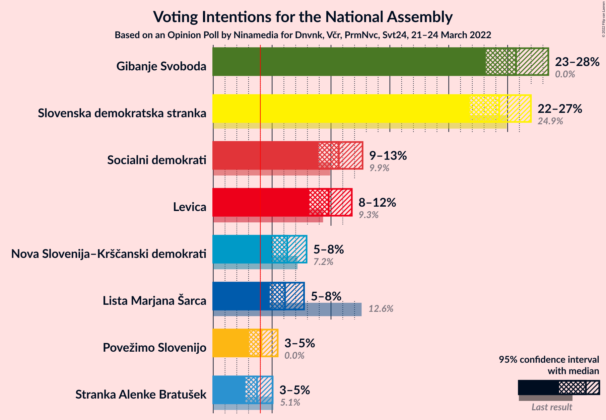

### Confidence Intervals

| Party | Last Result | Poll Result | 80% Confidence Interval | 90% Confidence Interval | 95% Confidence Interval | 99% Confidence Interval |
|:-----:|:-----------:|:-----------:|:-----------------------:|:-----------------------:|:-----------------------:|:-----------------------:|
| Gibanje Svoboda | 0.0% | 25.7% | 24.0–27.5% |23.6–28.0% |23.2–28.5% |22.4–29.3% |
| Slovenska demokratska stranka | 24.9% | 24.3% | 22.6–26.0% |22.2–26.6% |21.8–27.0% |21.0–27.8% |
| Socialni demokrati | 9.9% | 10.7% | 9.5–12.0% |9.2–12.4% |8.9–12.7% |8.4–13.3% |
| Levica | 9.3% | 9.8% | 8.7–11.1% |8.4–11.4% |8.2–11.8% |7.7–12.4% |
| Nova Slovenija–Krščanski demokrati | 7.2% | 6.3% | 5.4–7.4% |5.2–7.7% |5.0–7.9% |4.6–8.5% |
| Lista Marjana Šarca | 12.6% | 6.1% | 5.2–7.1% |5.0–7.5% |4.8–7.7% |4.4–8.2% |
| Povežimo Slovenijo | 0.0% | 4.1% | 3.4–5.0% |3.2–5.3% |3.0–5.5% |2.8–5.9% |
| Stranka Alenke Bratušek | 5.1% | 3.7% | 3.1–4.6% |2.9–4.8% |2.7–5.0% |2.4–5.5% |

*Note:* The poll result column reflects the actual value used in the calculations. Published results may vary slightly, and in addition be rounded to fewer digits.

## Seats

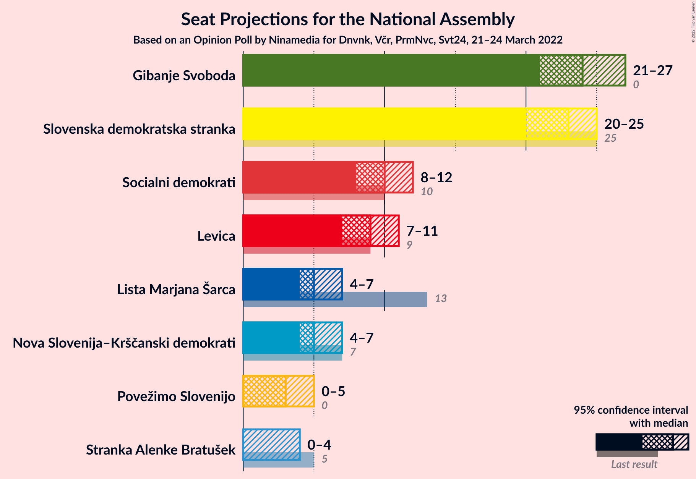

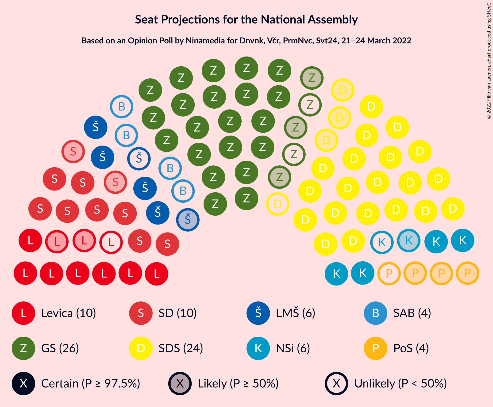

### Confidence Intervals

| Party | Last Result | Median | 80% Confidence Interval | 90% Confidence Interval | 95% Confidence Interval | 99% Confidence Interval |
|:-----:|:-----------:|:------:|:-----------------------:|:-----------------------:|:-----------------------:|:-----------------------:|
| <a href="#gibanje-svoboda">Gibanje Svoboda</a> | 0 | 24 | 22–26 |22–26 |21–27 |20–28 |
| <a href="#slovenska-demokratska-stranka">Slovenska demokratska stranka</a> | 25 | 23 | 21–24 |20–25 |20–25 |19–26 |
| <a href="#socialni-demokrati">Socialni demokrati</a> | 10 | 10 | 9–11 |8–11 |8–12 |7–12 |
| <a href="#levica">Levica</a> | 9 | 9 | 8–10 |7–10 |7–11 |7–11 |
| <a href="#nova-slovenija–krščanski-demokrati">Nova Slovenija–Krščanski demokrati</a> | 7 | 5 | 5–7 |4–7 |4–7 |4–8 |
| <a href="#lista-marjana-šarca">Lista Marjana Šarca</a> | 13 | 5 | 4–6 |4–7 |4–7 |4–7 |
| <a href="#povežimo-slovenijo">Povežimo Slovenijo</a> | 0 | 3 | 0–4 |0–5 |0–5 |0–5 |
| <a href="#stranka-alenke-bratušek">Stranka Alenke Bratušek</a> | 5 | 0 | 0–4 |0–4 |0–4 |0–5 |

### Gibanje Svoboda

*For a full overview of the results for this party, see the [Gibanje Svoboda](party-gibanjesvoboda.html) page.*

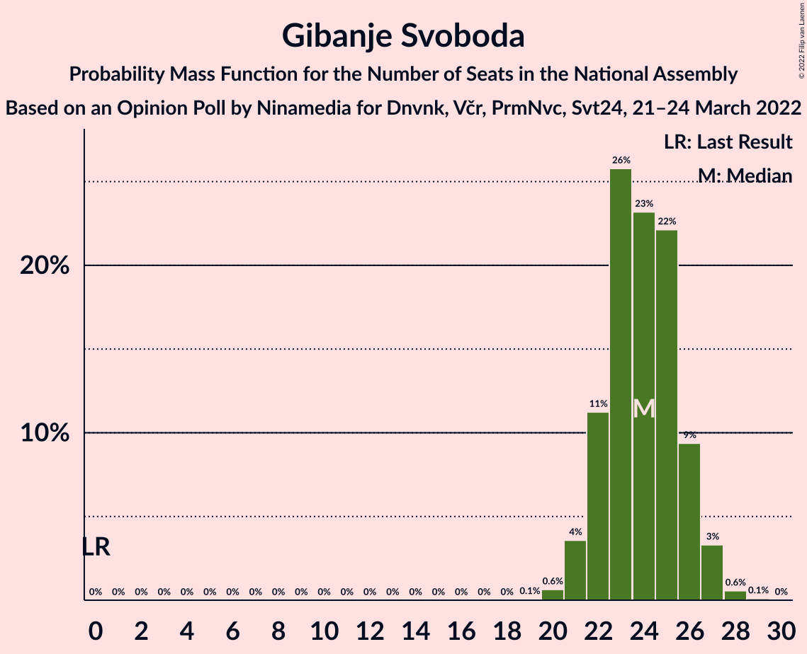

| Number of Seats | Probability | Accumulated | Special Marks |
|:---------------:|:-----------:|:-----------:|:-------------:|
| 0 | 0% | 100% | Last Result |
| 1 | 0% | 100% |  |
| 2 | 0% | 100% |  |
| 3 | 0% | 100% |  |
| 4 | 0% | 100% |  |
| 5 | 0% | 100% |  |
| 6 | 0% | 100% |  |
| 7 | 0% | 100% |  |
| 8 | 0% | 100% |  |
| 9 | 0% | 100% |  |
| 10 | 0% | 100% |  |
| 11 | 0% | 100% |  |
| 12 | 0% | 100% |  |
| 13 | 0% | 100% |  |
| 14 | 0% | 100% |  |
| 15 | 0% | 100% |  |
| 16 | 0% | 100% |  |
| 17 | 0% | 100% |  |
| 18 | 0% | 100% |  |
| 19 | 0.1% | 100% |  |
| 20 | 0.6% | 99.9% |  |
| 21 | 4% | 99.3% |  |
| 22 | 11% | 96% |  |
| 23 | 26% | 84% |  |
| 24 | 23% | 59% | Median |
| 25 | 22% | 35% |  |
| 26 | 9% | 13% |  |
| 27 | 3% | 4% |  |
| 28 | 0.6% | 0.7% |  |
| 29 | 0.1% | 0.1% |  |
| 30 | 0% | 0% |  |

### Slovenska demokratska stranka

*For a full overview of the results for this party, see the [Slovenska demokratska stranka](party-slovenskademokratskastranka.html) page.*

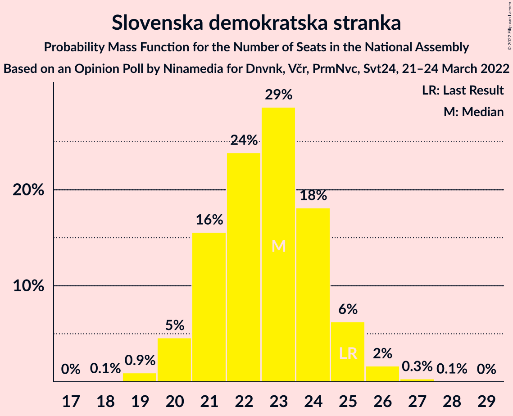

| Number of Seats | Probability | Accumulated | Special Marks |
|:---------------:|:-----------:|:-----------:|:-------------:|
| 18 | 0.1% | 100% |  |
| 19 | 0.9% | 99.9% |  |
| 20 | 5% | 99.0% |  |
| 21 | 16% | 94% |  |
| 22 | 24% | 79% |  |
| 23 | 29% | 55% | Median |
| 24 | 18% | 26% |  |
| 25 | 6% | 8% | Last Result |
| 26 | 2% | 2% |  |
| 27 | 0.3% | 0.4% |  |
| 28 | 0.1% | 0.1% |  |
| 29 | 0% | 0% |  |

### Socialni demokrati

*For a full overview of the results for this party, see the [Socialni demokrati](party-socialnidemokrati.html) page.*

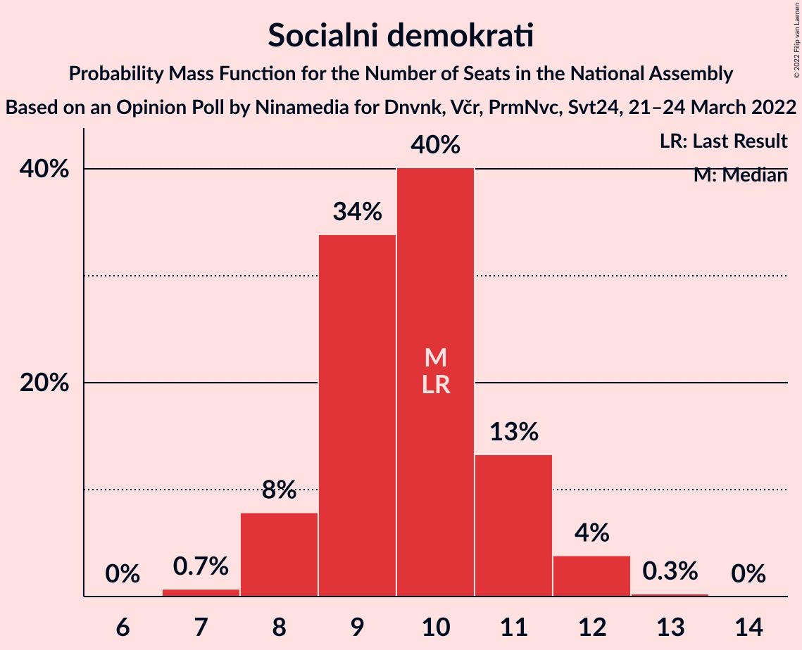

| Number of Seats | Probability | Accumulated | Special Marks |
|:---------------:|:-----------:|:-----------:|:-------------:|
| 7 | 0.7% | 100% |  |
| 8 | 8% | 99.3% |  |
| 9 | 34% | 91% |  |
| 10 | 40% | 58% | Last Result, Median |
| 11 | 13% | 17% |  |
| 12 | 4% | 4% |  |
| 13 | 0.3% | 0.3% |  |
| 14 | 0% | 0% |  |

### Levica

*For a full overview of the results for this party, see the [Levica](party-levica.html) page.*

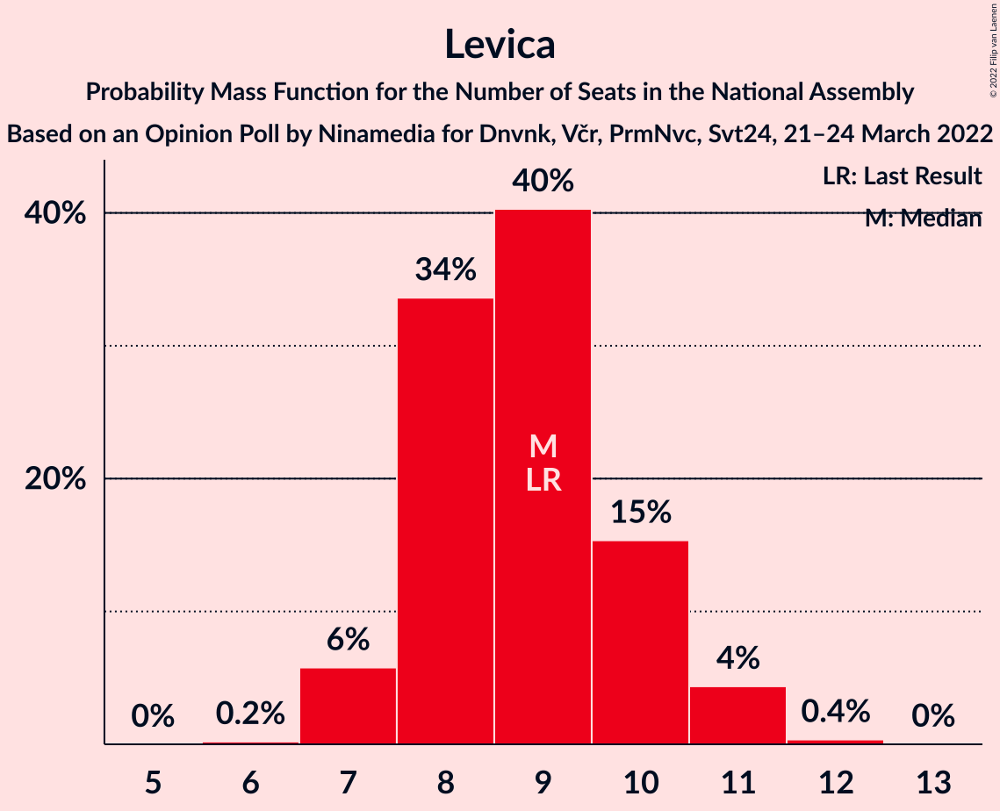

| Number of Seats | Probability | Accumulated | Special Marks |
|:---------------:|:-----------:|:-----------:|:-------------:|
| 6 | 0.2% | 100% |  |
| 7 | 6% | 99.8% |  |
| 8 | 34% | 94% |  |
| 9 | 40% | 60% | Last Result, Median |
| 10 | 15% | 20% |  |
| 11 | 4% | 5% |  |
| 12 | 0.4% | 0.4% |  |
| 13 | 0% | 0% |  |

### Nova Slovenija–Krščanski demokrati

*For a full overview of the results for this party, see the [Nova Slovenija–Krščanski demokrati](party-novaslovenija–krščanskidemokrati.html) page.*

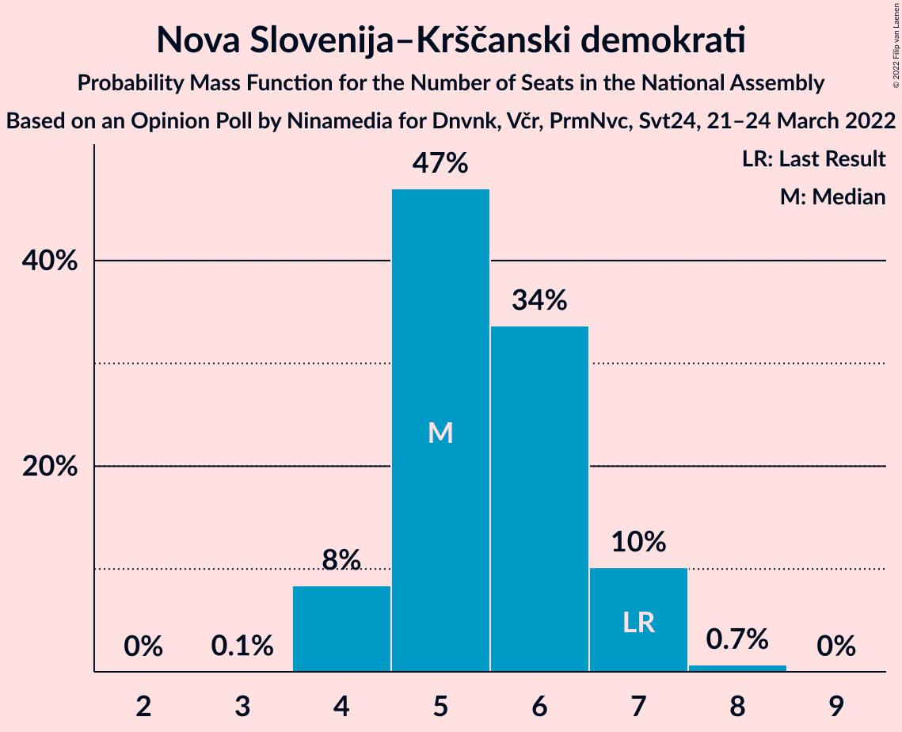

| Number of Seats | Probability | Accumulated | Special Marks |
|:---------------:|:-----------:|:-----------:|:-------------:|
| 3 | 0.1% | 100% |  |
| 4 | 8% | 99.9% |  |
| 5 | 47% | 92% | Median |
| 6 | 34% | 45% |  |
| 7 | 10% | 11% | Last Result |
| 8 | 0.7% | 0.7% |  |
| 9 | 0% | 0% |  |

### Lista Marjana Šarca

*For a full overview of the results for this party, see the [Lista Marjana Šarca](party-listamarjanašarca.html) page.*

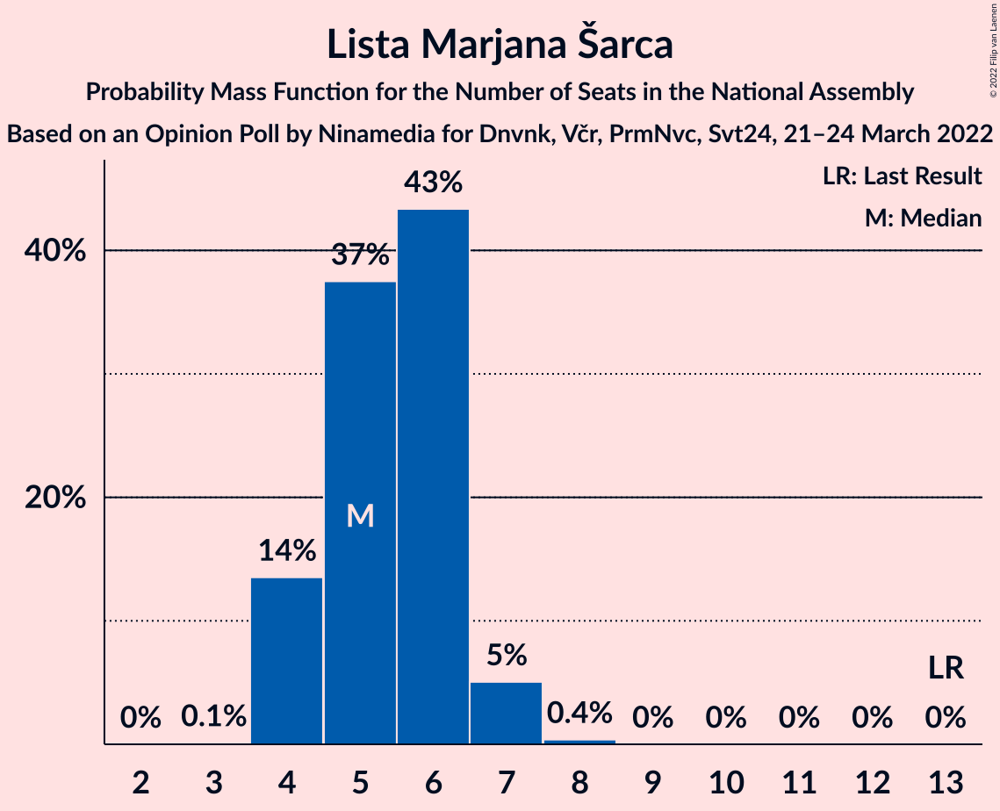

| Number of Seats | Probability | Accumulated | Special Marks |
|:---------------:|:-----------:|:-----------:|:-------------:|
| 3 | 0.1% | 100% |  |
| 4 | 14% | 99.8% |  |
| 5 | 37% | 86% | Median |
| 6 | 43% | 49% |  |
| 7 | 5% | 5% |  |
| 8 | 0.4% | 0.4% |  |
| 9 | 0% | 0% |  |
| 10 | 0% | 0% |  |
| 11 | 0% | 0% |  |
| 12 | 0% | 0% |  |
| 13 | 0% | 0% | Last Result |

### Povežimo Slovenijo

*For a full overview of the results for this party, see the [Povežimo Slovenijo](party-povežimoslovenijo.html) page.*

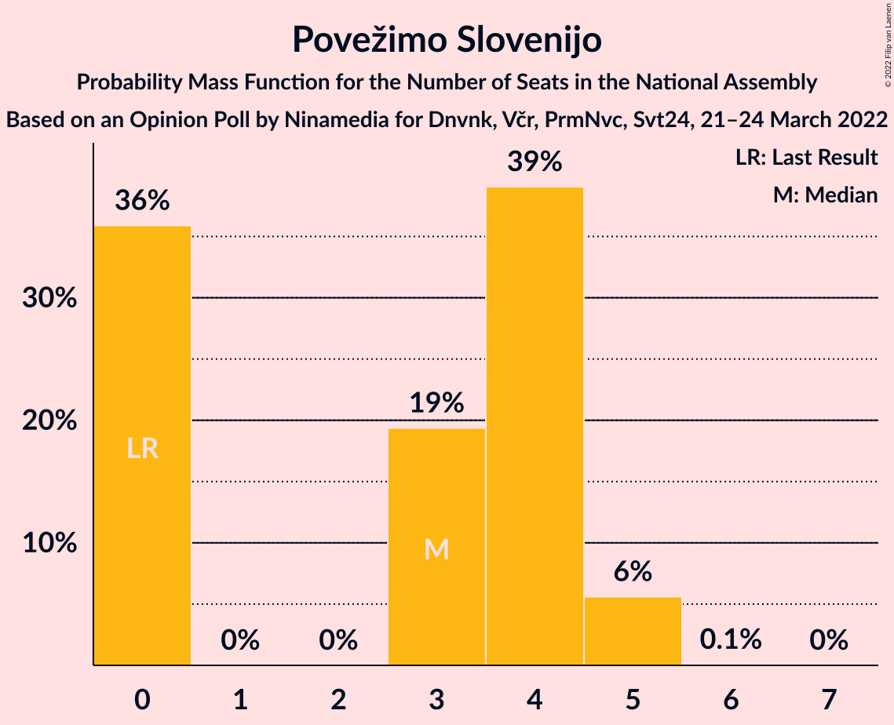

| Number of Seats | Probability | Accumulated | Special Marks |
|:---------------:|:-----------:|:-----------:|:-------------:|
| 0 | 36% | 100% | Last Result |
| 1 | 0% | 64% |  |
| 2 | 0% | 64% |  |
| 3 | 19% | 64% | Median |
| 4 | 39% | 45% |  |
| 5 | 6% | 6% |  |
| 6 | 0.1% | 0.1% |  |
| 7 | 0% | 0% |  |

### Stranka Alenke Bratušek

*For a full overview of the results for this party, see the [Stranka Alenke Bratušek](party-strankaalenkebratušek.html) page.*

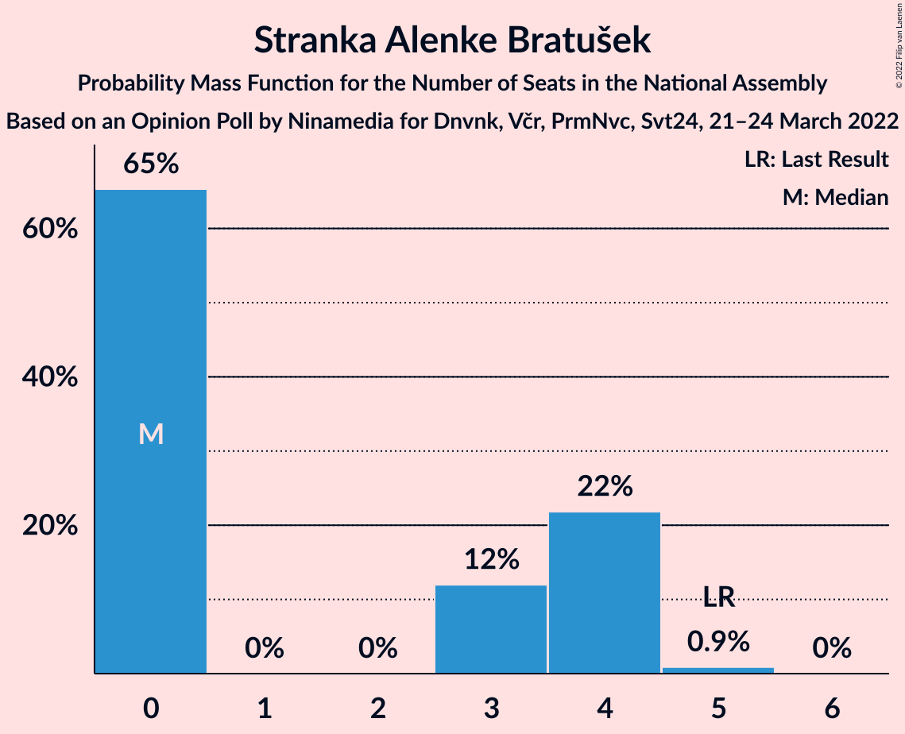

| Number of Seats | Probability | Accumulated | Special Marks |
|:---------------:|:-----------:|:-----------:|:-------------:|
| 0 | 65% | 100% | Median |
| 1 | 0% | 35% |  |
| 2 | 0% | 35% |  |
| 3 | 12% | 35% |  |
| 4 | 22% | 23% |  |
| 5 | 0.9% | 0.9% | Last Result |
| 6 | 0% | 0% |  |

## Coalitions

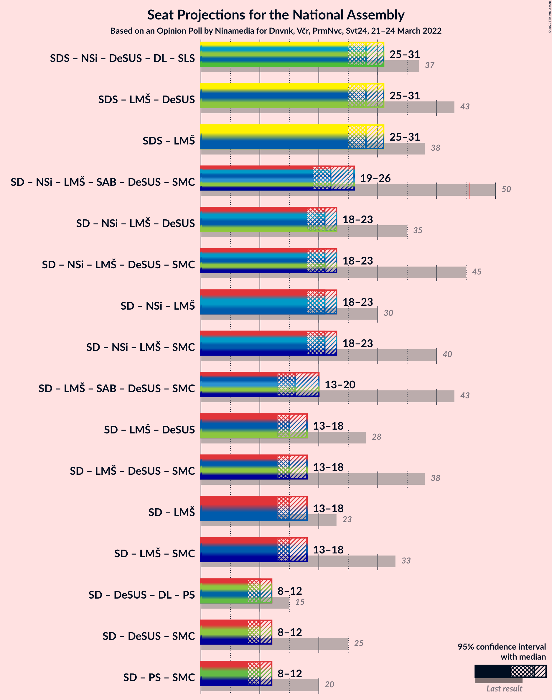

### Confidence Intervals

| Coalition | Last Result | Median | Majority? | 80% Confidence Interval | 90% Confidence Interval | 95% Confidence Interval | 99% Confidence Interval |
|:---------:|:-----------:|:------:|:---------:|:-----------------------:|:-----------------------:|:-----------------------:|:-----------------------:|
| Slovenska demokratska stranka – Lista Marjana Šarca | 38 | 28 | 0% | 26–30 | 25–30 | 25–31 | 24–32 |
| Socialni demokrati – Nova Slovenija–Krščanski demokrati – Lista Marjana Šarca | 30 | 21 | 0% | 19–22 | 18–23 | 18–23 | 17–24 |
| Socialni demokrati – Lista Marjana Šarca | 23 | 15 | 0% | 14–16 | 13–17 | 13–18 | 12–18 |

### Slovenska demokratska stranka – Lista Marjana Šarca

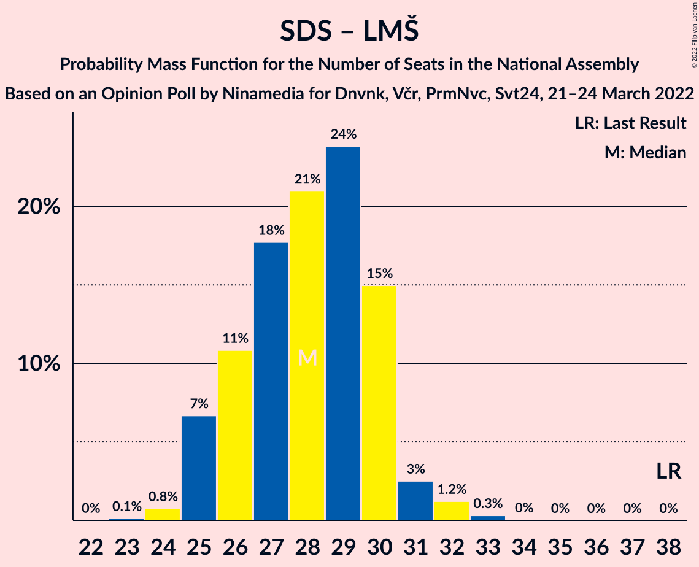

| Number of Seats | Probability | Accumulated | Special Marks |
|:---------------:|:-----------:|:-----------:|:-------------:|
| 23 | 0.1% | 100% |  |
| 24 | 0.8% | 99.9% |  |
| 25 | 7% | 99.1% |  |
| 26 | 11% | 92% |  |
| 27 | 18% | 82% |  |
| 28 | 21% | 64% | Median |
| 29 | 24% | 43% |  |
| 30 | 15% | 19% |  |
| 31 | 3% | 4% |  |
| 32 | 1.2% | 2% |  |
| 33 | 0.3% | 0.3% |  |
| 34 | 0% | 0% |  |
| 35 | 0% | 0% |  |
| 36 | 0% | 0% |  |
| 37 | 0% | 0% |  |
| 38 | 0% | 0% | Last Result |

### Socialni demokrati – Nova Slovenija–Krščanski demokrati – Lista Marjana Šarca

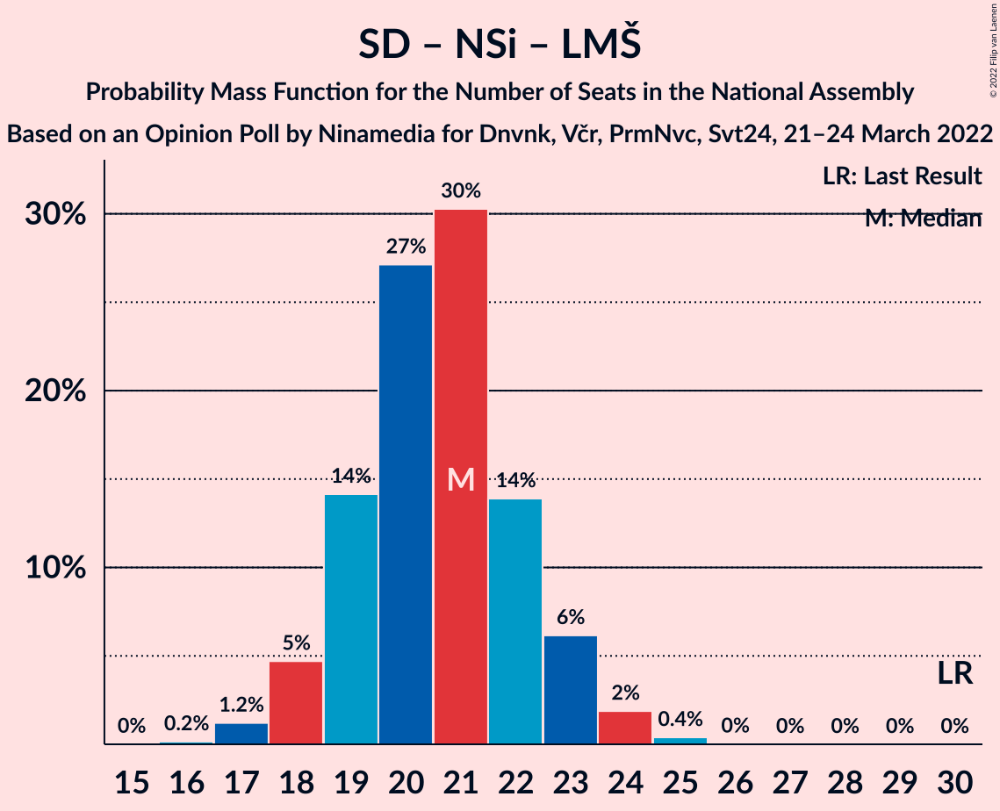

| Number of Seats | Probability | Accumulated | Special Marks |
|:---------------:|:-----------:|:-----------:|:-------------:|
| 16 | 0.2% | 100% |  |
| 17 | 1.2% | 99.8% |  |
| 18 | 5% | 98.6% |  |
| 19 | 14% | 94% |  |
| 20 | 27% | 80% | Median |
| 21 | 30% | 53% |  |
| 22 | 14% | 22% |  |
| 23 | 6% | 8% |  |
| 24 | 2% | 2% |  |
| 25 | 0.4% | 0.4% |  |
| 26 | 0% | 0% |  |
| 27 | 0% | 0% |  |
| 28 | 0% | 0% |  |
| 29 | 0% | 0% |  |
| 30 | 0% | 0% | Last Result |

### Socialni demokrati – Lista Marjana Šarca

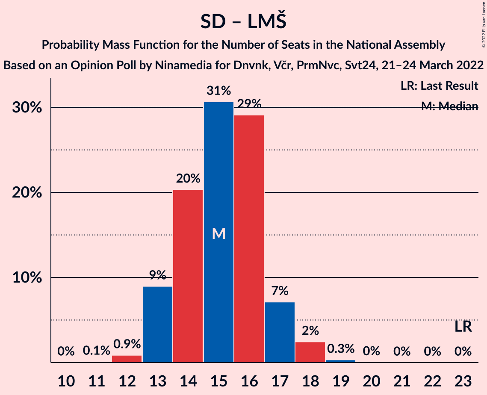

| Number of Seats | Probability | Accumulated | Special Marks |
|:---------------:|:-----------:|:-----------:|:-------------:|
| 11 | 0.1% | 100% |  |
| 12 | 0.9% | 99.9% |  |
| 13 | 9% | 99.0% |  |
| 14 | 20% | 90% |  |
| 15 | 31% | 70% | Median |
| 16 | 29% | 39% |  |
| 17 | 7% | 10% |  |
| 18 | 2% | 3% |  |
| 19 | 0.3% | 0.4% |  |
| 20 | 0% | 0% |  |
| 21 | 0% | 0% |  |
| 22 | 0% | 0% |  |
| 23 | 0% | 0% | Last Result |

## Technical Information

### Opinion Poll

+ **Polling firm:** Ninamedia
+ **Commissioner(s):** Dnvnk, Včr, PrmNvc, Svt24
+ **Fieldwork period:** 21–24 March 2022

### Calculations

+ **Sample size:** 1050
+ **Simulations done:** 1,048,576
+ **Error estimate:** 0.90%

