# Opinion Poll by Parsifal for Planet TV, 22–24 March 2022

<a href="#voting-intentions">Voting Intentions</a> | <a href="#seats">Seats</a> | <a href="#coalitions">Coalitions</a> | <a href="#technical-information">Technical Information</a>

## Voting Intentions

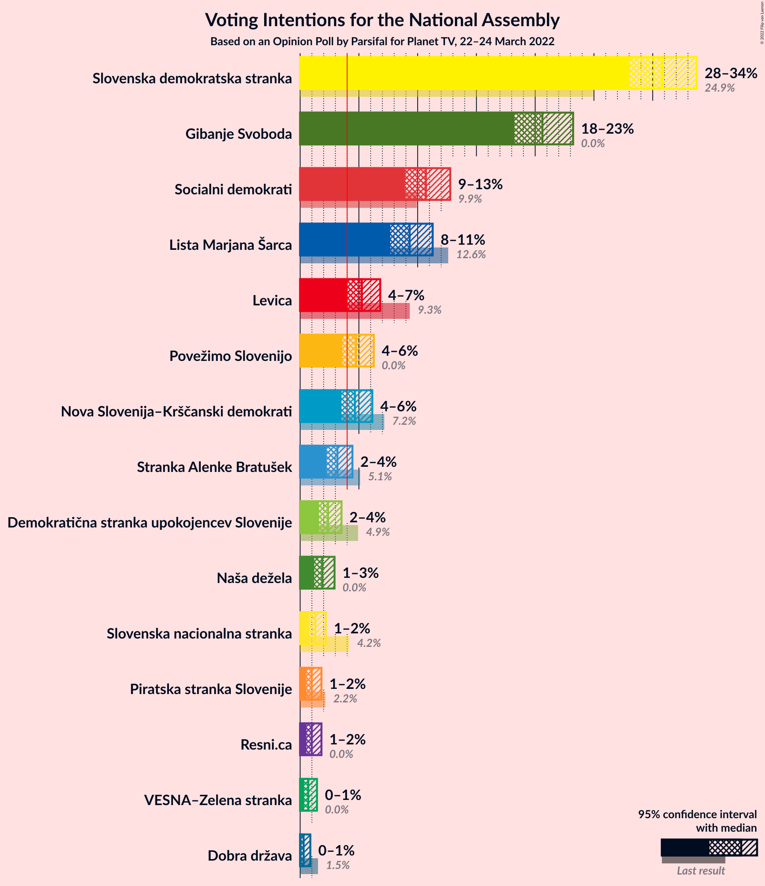

### Confidence Intervals

| Party | Last Result | Poll Result | 80% Confidence Interval | 90% Confidence Interval | 95% Confidence Interval | 99% Confidence Interval |
|:-----:|:-----------:|:-----------:|:-----------------------:|:-----------------------:|:-----------------------:|:-----------------------:|
| Slovenska demokratska stranka | 24.9% | 30.8% | 29.0–32.7% |28.5–33.3% |28.0–33.7% |27.2–34.7% |
| Gibanje Svoboda | 0.0% | 20.6% | 19.1–22.3% |18.6–22.8% |18.2–23.2% |17.5–24.1% |
| Socialni demokrati | 9.9% | 10.7% | 9.5–12.1% |9.2–12.4% |8.9–12.8% |8.4–13.4% |
| Lista Marjana Šarca | 12.6% | 9.3% | 8.2–10.6% |7.9–11.0% |7.7–11.3% |7.2–11.9% |
| Levica | 9.3% | 5.3% | 4.5–6.3% |4.2–6.6% |4.0–6.8% |3.7–7.3% |
| Povežimo Slovenijo | 0.0% | 4.8% | 4.0–5.7% |3.8–6.0% |3.6–6.3% |3.3–6.8% |
| Nova Slovenija–Krščanski demokrati | 7.2% | 4.7% | 3.9–5.6% |3.7–5.9% |3.5–6.1% |3.2–6.6% |
| Stranka Alenke Bratušek | 5.1% | 3.2% | 2.6–4.0% |2.4–4.2% |2.3–4.5% |2.0–4.9% |
| Demokratična stranka upokojencev Slovenije | 4.9% | 2.4% | 1.9–3.1% |1.7–3.3% |1.6–3.5% |1.4–3.9% |
| Naša dežela | 0.0% | 1.9% | 1.4–2.6% |1.3–2.8% |1.2–2.9% |1.0–3.3% |
| Slovenska nacionalna stranka | 4.2% | 1.3% | 0.9–1.9% |0.8–2.0% |0.7–2.2% |0.6–2.5% |
| Piratska stranka Slovenije | 2.2% | 1.0% | 0.7–1.5% |0.6–1.7% |0.5–1.8% |0.4–2.1% |
| Resni.ca | 0.0% | 1.0% | 0.7–1.5% |0.6–1.7% |0.5–1.8% |0.4–2.1% |
| VESNA–Zelena stranka | 0.0% | 0.7% | 0.5–1.2% |0.4–1.3% |0.3–1.4% |0.2–1.7% |
| Dobra država | 1.5% | 0.3% | 0.2–0.7% |0.1–0.8% |0.1–0.9% |0.1–1.1% |

*Note:* The poll result column reflects the actual value used in the calculations. Published results may vary slightly, and in addition be rounded to fewer digits.

## Seats

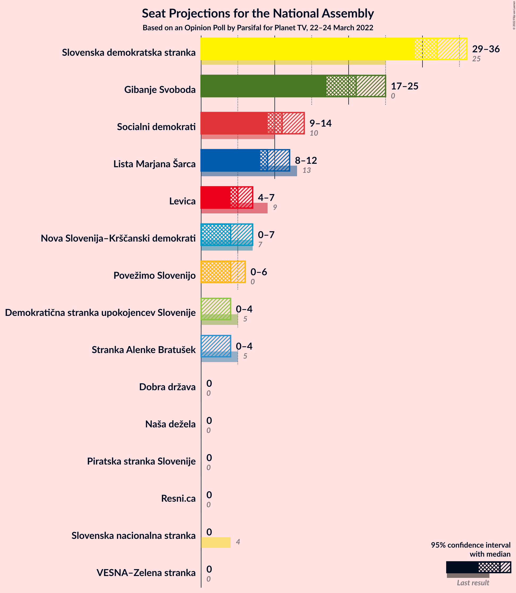

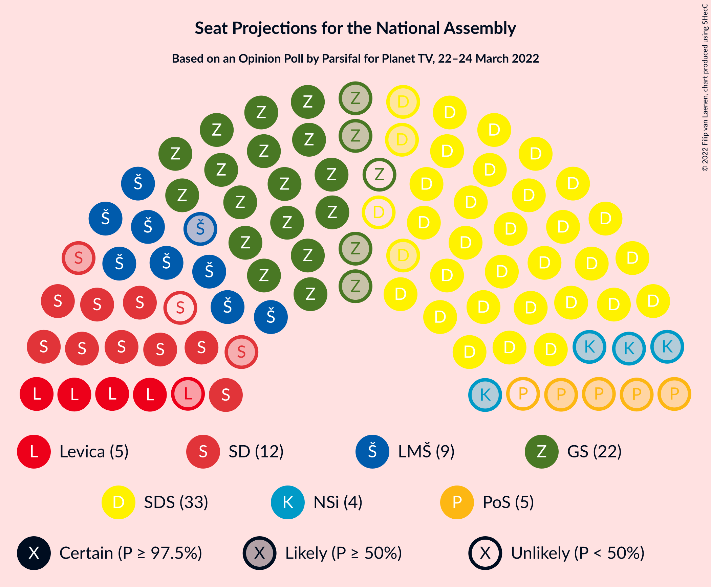

### Confidence Intervals

| Party | Last Result | Median | 80% Confidence Interval | 90% Confidence Interval | 95% Confidence Interval | 99% Confidence Interval |
|:-----:|:-----------:|:------:|:-----------------------:|:-----------------------:|:-----------------------:|:-----------------------:|
| <a href="#slovenska-demokratska-stranka">Slovenska demokratska stranka</a> | 25 | 32 | 30–36 |29–36 |29–36 |28–38 |
| <a href="#gibanje-svoboda">Gibanje Svoboda</a> | 0 | 21 | 19–22 |19–23 |17–25 |17–26 |
| <a href="#socialni-demokrati">Socialni demokrati</a> | 10 | 11 | 10–13 |10–13 |9–14 |8–15 |
| <a href="#lista-marjana-šarca">Lista Marjana Šarca</a> | 13 | 9 | 8–12 |8–12 |8–12 |7–13 |
| <a href="#levica">Levica</a> | 9 | 5 | 4–6 |4–7 |4–7 |0–7 |
| <a href="#povežimo-slovenijo">Povežimo Slovenijo</a> | 0 | 4 | 0–6 |0–6 |0–6 |0–7 |
| <a href="#nova-slovenija–krščanski-demokrati">Nova Slovenija–Krščanski demokrati</a> | 7 | 4 | 0–6 |0–6 |0–7 |0–7 |
| <a href="#stranka-alenke-bratušek">Stranka Alenke Bratušek</a> | 5 | 0 | 0–4 |0–4 |0–4 |0–4 |
| <a href="#demokratična-stranka-upokojencev-slovenije">Demokratična stranka upokojencev Slovenije</a> | 5 | 0 | 0 |0 |0–4 |0–4 |
| <a href="#naša-dežela">Naša dežela</a> | 0 | 0 | 0 |0 |0 |0 |
| <a href="#slovenska-nacionalna-stranka">Slovenska nacionalna stranka</a> | 4 | 0 | 0 |0 |0 |0 |
| <a href="#piratska-stranka-slovenije">Piratska stranka Slovenije</a> | 0 | 0 | 0 |0 |0 |0 |
| <a href="#resni.ca">Resni.ca</a> | 0 | 0 | 0 |0 |0 |0 |
| <a href="#vesna–zelena-stranka">VESNA–Zelena stranka</a> | 0 | 0 | 0 |0 |0 |0 |
| <a href="#dobra-država">Dobra država</a> | 0 | 0 | 0 |0 |0 |0 |

### Slovenska demokratska stranka

*For a full overview of the results for this party, see the [Slovenska demokratska stranka](party-slovenskademokratskastranka.html) page.*

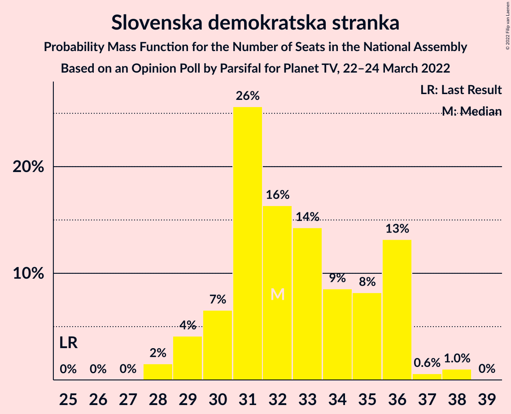

| Number of Seats | Probability | Accumulated | Special Marks |
|:---------------:|:-----------:|:-----------:|:-------------:|
| 25 | 0% | 100% | Last Result |
| 26 | 0% | 100% |  |
| 27 | 0% | 100% |  |
| 28 | 2% | 100% |  |
| 29 | 4% | 98% |  |
| 30 | 7% | 94% |  |
| 31 | 26% | 88% |  |
| 32 | 16% | 62% | Median |
| 33 | 14% | 46% |  |
| 34 | 9% | 32% |  |
| 35 | 8% | 23% |  |
| 36 | 13% | 15% |  |
| 37 | 0.6% | 2% |  |
| 38 | 1.0% | 1.1% |  |
| 39 | 0% | 0% |  |

### Gibanje Svoboda

*For a full overview of the results for this party, see the [Gibanje Svoboda](party-gibanjesvoboda.html) page.*

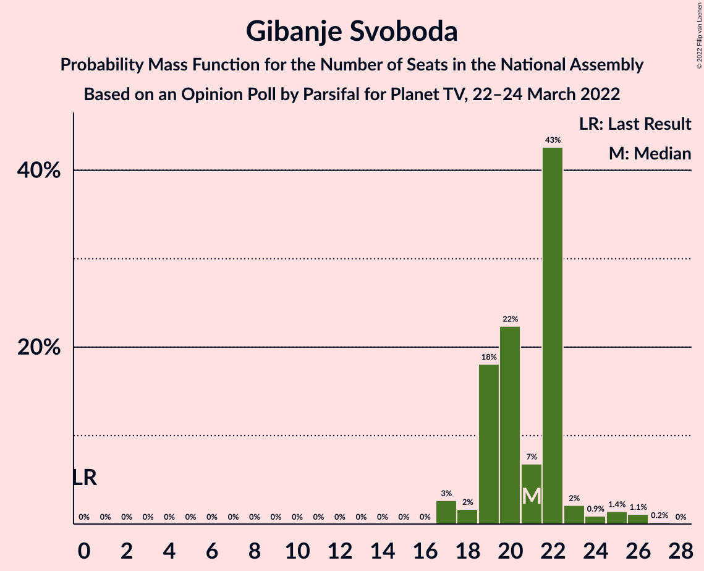

| Number of Seats | Probability | Accumulated | Special Marks |
|:---------------:|:-----------:|:-----------:|:-------------:|
| 0 | 0% | 100% | Last Result |
| 1 | 0% | 100% |  |
| 2 | 0% | 100% |  |
| 3 | 0% | 100% |  |
| 4 | 0% | 100% |  |
| 5 | 0% | 100% |  |
| 6 | 0% | 100% |  |
| 7 | 0% | 100% |  |
| 8 | 0% | 100% |  |
| 9 | 0% | 100% |  |
| 10 | 0% | 100% |  |
| 11 | 0% | 100% |  |
| 12 | 0% | 100% |  |
| 13 | 0% | 100% |  |
| 14 | 0% | 100% |  |
| 15 | 0% | 100% |  |
| 16 | 0% | 100% |  |
| 17 | 3% | 100% |  |
| 18 | 2% | 97% |  |
| 19 | 18% | 96% |  |
| 20 | 22% | 78% |  |
| 21 | 7% | 55% | Median |
| 22 | 43% | 48% |  |
| 23 | 2% | 6% |  |
| 24 | 0.9% | 4% |  |
| 25 | 1.4% | 3% |  |
| 26 | 1.1% | 1.3% |  |
| 27 | 0.2% | 0.2% |  |
| 28 | 0% | 0% |  |

### Socialni demokrati

*For a full overview of the results for this party, see the [Socialni demokrati](party-socialnidemokrati.html) page.*

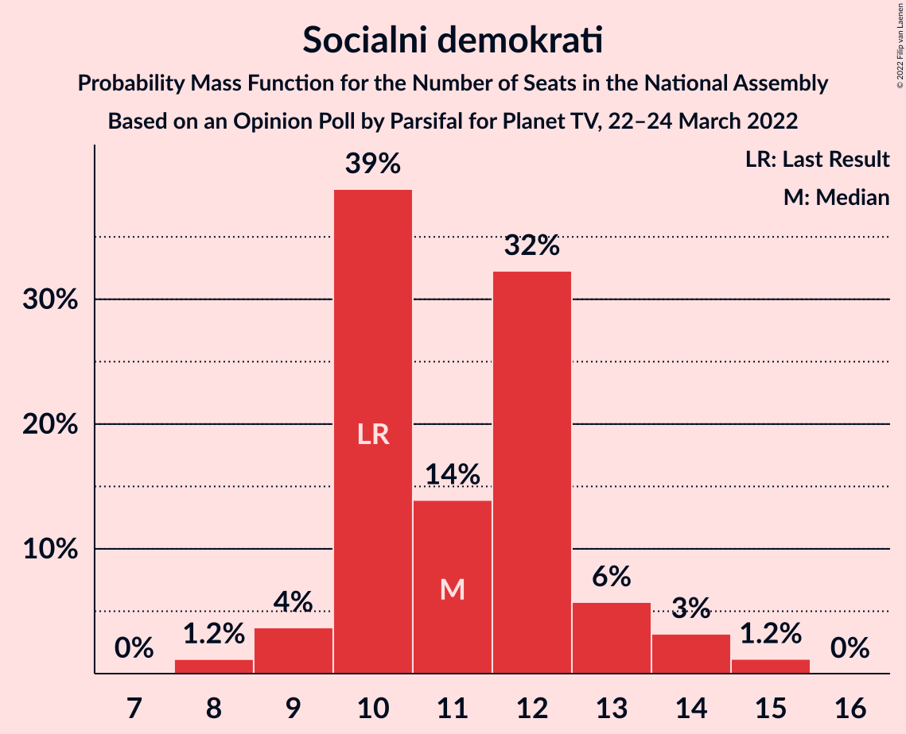

| Number of Seats | Probability | Accumulated | Special Marks |
|:---------------:|:-----------:|:-----------:|:-------------:|
| 8 | 1.2% | 100% |  |
| 9 | 4% | 98.8% |  |
| 10 | 39% | 95% | Last Result |
| 11 | 14% | 56% | Median |
| 12 | 32% | 42% |  |
| 13 | 6% | 10% |  |
| 14 | 3% | 4% |  |
| 15 | 1.2% | 1.2% |  |
| 16 | 0% | 0% |  |

### Lista Marjana Šarca

*For a full overview of the results for this party, see the [Lista Marjana Šarca](party-listamarjanašarca.html) page.*

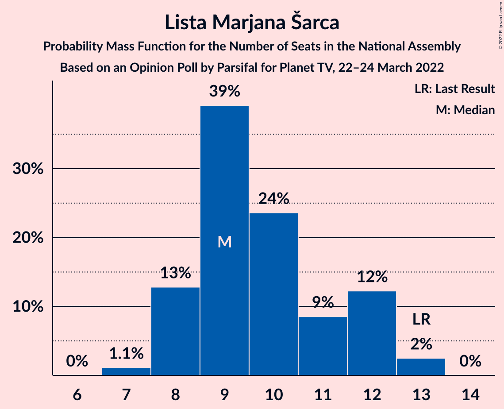

| Number of Seats | Probability | Accumulated | Special Marks |
|:---------------:|:-----------:|:-----------:|:-------------:|
| 7 | 1.1% | 100% |  |
| 8 | 13% | 98.9% |  |
| 9 | 39% | 86% | Median |
| 10 | 24% | 47% |  |
| 11 | 9% | 23% |  |
| 12 | 12% | 15% |  |
| 13 | 2% | 2% | Last Result |
| 14 | 0% | 0% |  |

### Levica

*For a full overview of the results for this party, see the [Levica](party-levica.html) page.*

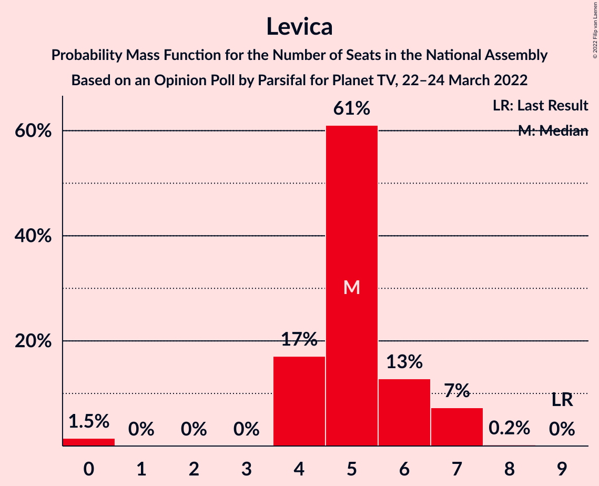

| Number of Seats | Probability | Accumulated | Special Marks |
|:---------------:|:-----------:|:-----------:|:-------------:|
| 0 | 1.5% | 100% |  |
| 1 | 0% | 98.5% |  |
| 2 | 0% | 98.5% |  |
| 3 | 0% | 98.5% |  |
| 4 | 17% | 98.5% |  |
| 5 | 61% | 81% | Median |
| 6 | 13% | 20% |  |
| 7 | 7% | 8% |  |
| 8 | 0.2% | 0.2% |  |
| 9 | 0% | 0% | Last Result |

### Povežimo Slovenijo

*For a full overview of the results for this party, see the [Povežimo Slovenijo](party-povežimoslovenijo.html) page.*

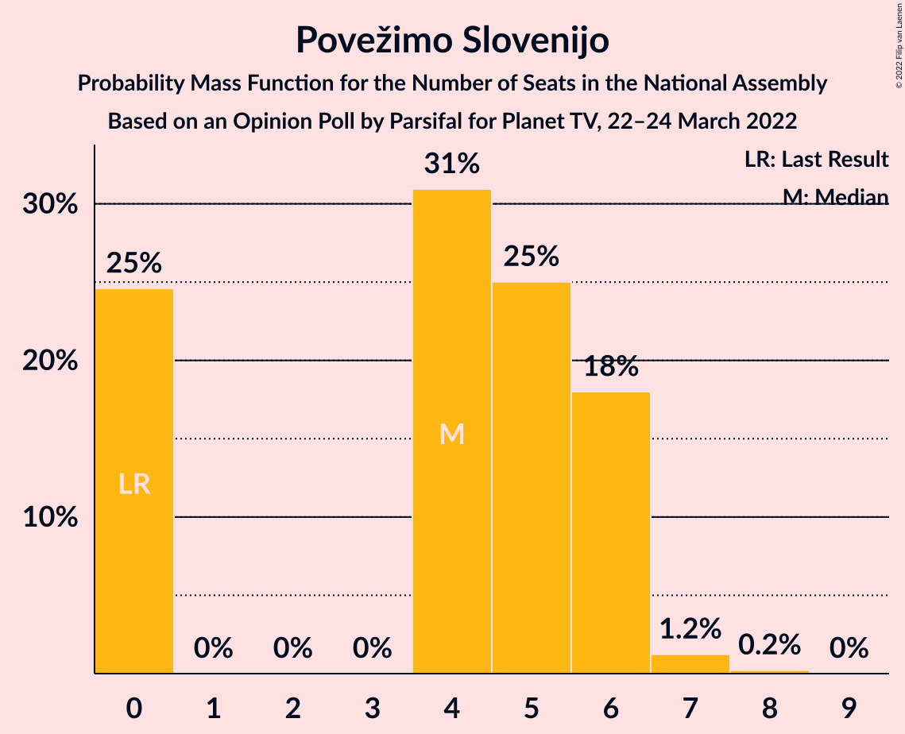

| Number of Seats | Probability | Accumulated | Special Marks |
|:---------------:|:-----------:|:-----------:|:-------------:|
| 0 | 25% | 100% | Last Result |
| 1 | 0% | 75% |  |
| 2 | 0% | 75% |  |
| 3 | 0% | 75% |  |
| 4 | 31% | 75% | Median |
| 5 | 25% | 44% |  |
| 6 | 18% | 19% |  |
| 7 | 1.2% | 1.5% |  |
| 8 | 0.2% | 0.2% |  |
| 9 | 0% | 0% |  |

### Nova Slovenija–Krščanski demokrati

*For a full overview of the results for this party, see the [Nova Slovenija–Krščanski demokrati](party-novaslovenija–krščanskidemokrati.html) page.*

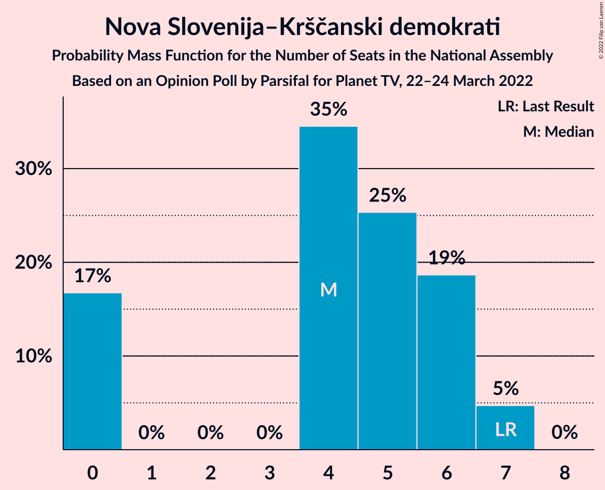

| Number of Seats | Probability | Accumulated | Special Marks |
|:---------------:|:-----------:|:-----------:|:-------------:|
| 0 | 17% | 100% |  |
| 1 | 0% | 83% |  |
| 2 | 0% | 83% |  |
| 3 | 0% | 83% |  |
| 4 | 35% | 83% | Median |
| 5 | 25% | 49% |  |
| 6 | 19% | 23% |  |
| 7 | 5% | 5% | Last Result |
| 8 | 0% | 0% |  |

### Stranka Alenke Bratušek

*For a full overview of the results for this party, see the [Stranka Alenke Bratušek](party-strankaalenkebratušek.html) page.*

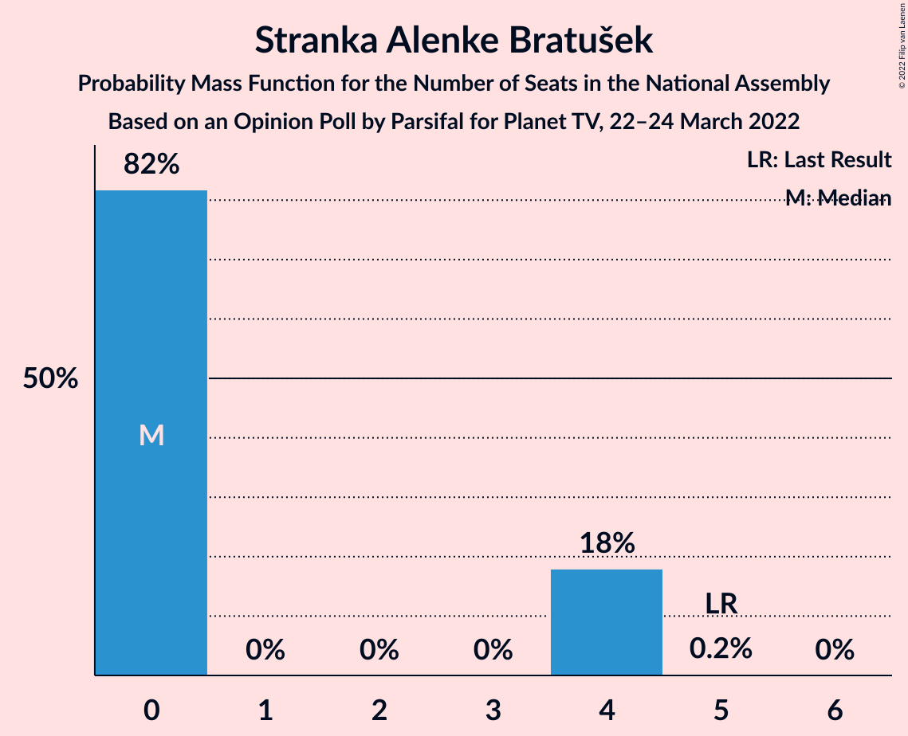

| Number of Seats | Probability | Accumulated | Special Marks |
|:---------------:|:-----------:|:-----------:|:-------------:|
| 0 | 82% | 100% | Median |
| 1 | 0% | 18% |  |
| 2 | 0% | 18% |  |
| 3 | 0% | 18% |  |
| 4 | 18% | 18% |  |
| 5 | 0.2% | 0.2% | Last Result |
| 6 | 0% | 0% |  |

### Demokratična stranka upokojencev Slovenije

*For a full overview of the results for this party, see the [Demokratična stranka upokojencev Slovenije](party-demokratičnastrankaupokojencevslovenije.html) page.*

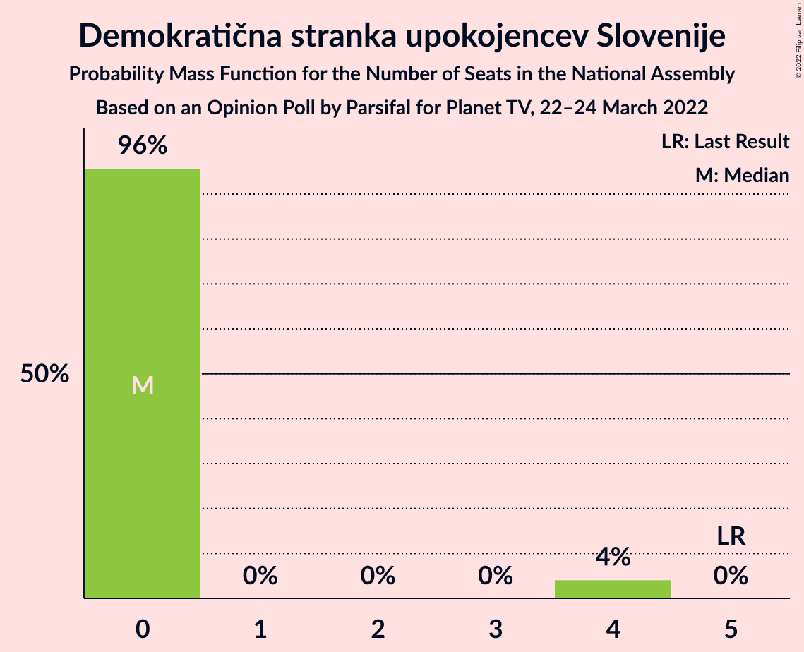

| Number of Seats | Probability | Accumulated | Special Marks |
|:---------------:|:-----------:|:-----------:|:-------------:|
| 0 | 96% | 100% | Median |
| 1 | 0% | 4% |  |
| 2 | 0% | 4% |  |
| 3 | 0% | 4% |  |
| 4 | 4% | 4% |  |
| 5 | 0% | 0% | Last Result |

### Naša dežela

*For a full overview of the results for this party, see the [Naša dežela](party-našadežela.html) page.*

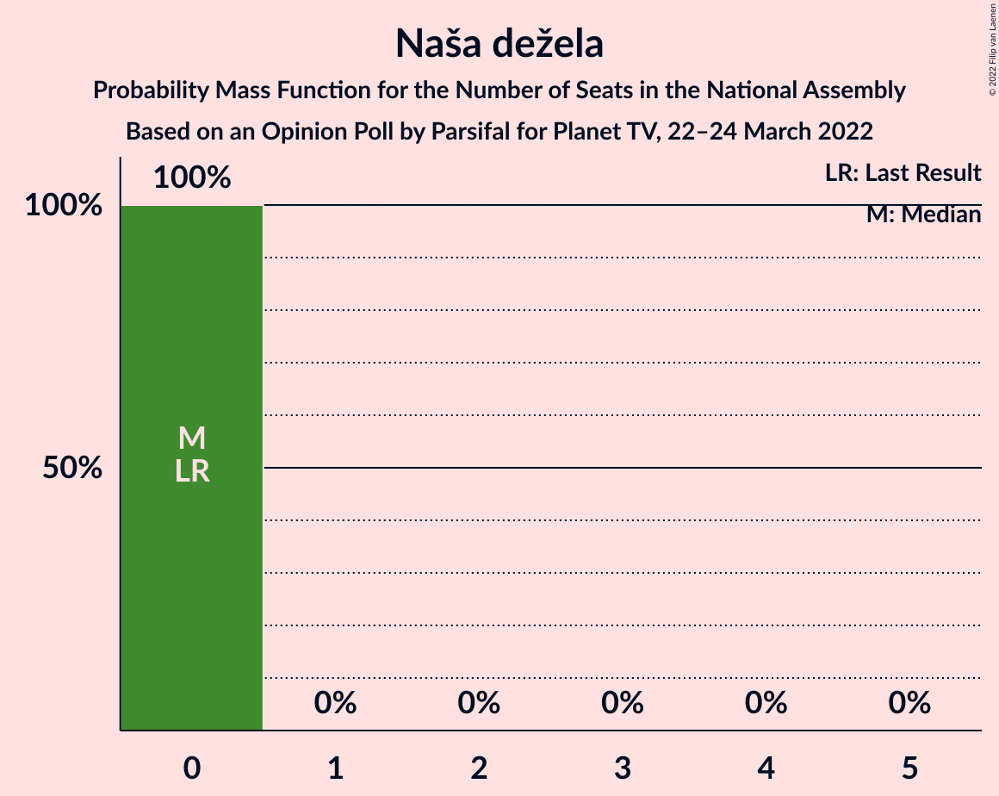

| Number of Seats | Probability | Accumulated | Special Marks |
|:---------------:|:-----------:|:-----------:|:-------------:|
| 0 | 100% | 100% | Last Result, Median |

### Slovenska nacionalna stranka

*For a full overview of the results for this party, see the [Slovenska nacionalna stranka](party-slovenskanacionalnastranka.html) page.*

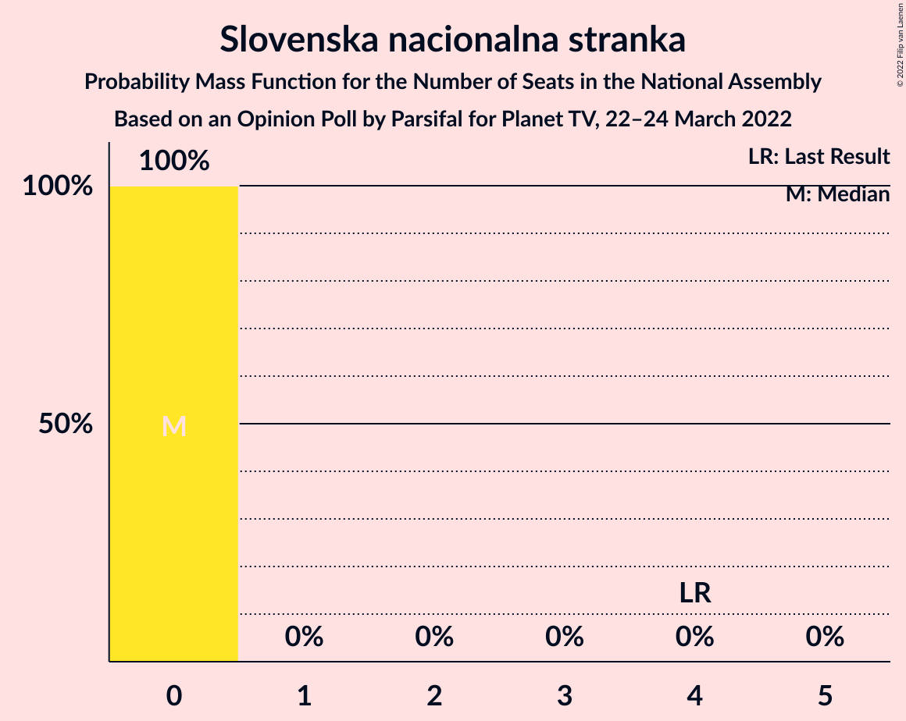

| Number of Seats | Probability | Accumulated | Special Marks |
|:---------------:|:-----------:|:-----------:|:-------------:|
| 0 | 100% | 100% | Median |
| 1 | 0% | 0% |  |
| 2 | 0% | 0% |  |
| 3 | 0% | 0% |  |
| 4 | 0% | 0% | Last Result |

### Piratska stranka Slovenije

*For a full overview of the results for this party, see the [Piratska stranka Slovenije](party-piratskastrankaslovenije.html) page.*

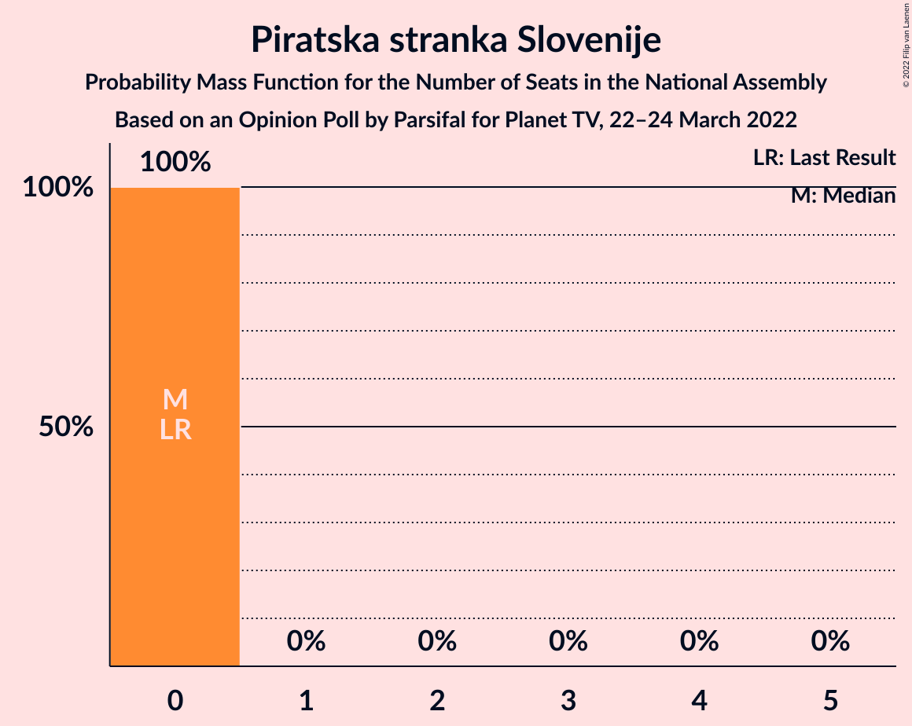

| Number of Seats | Probability | Accumulated | Special Marks |
|:---------------:|:-----------:|:-----------:|:-------------:|
| 0 | 100% | 100% | Last Result, Median |

### Resni.ca

*For a full overview of the results for this party, see the [Resni.ca](party-resnica.html) page.*

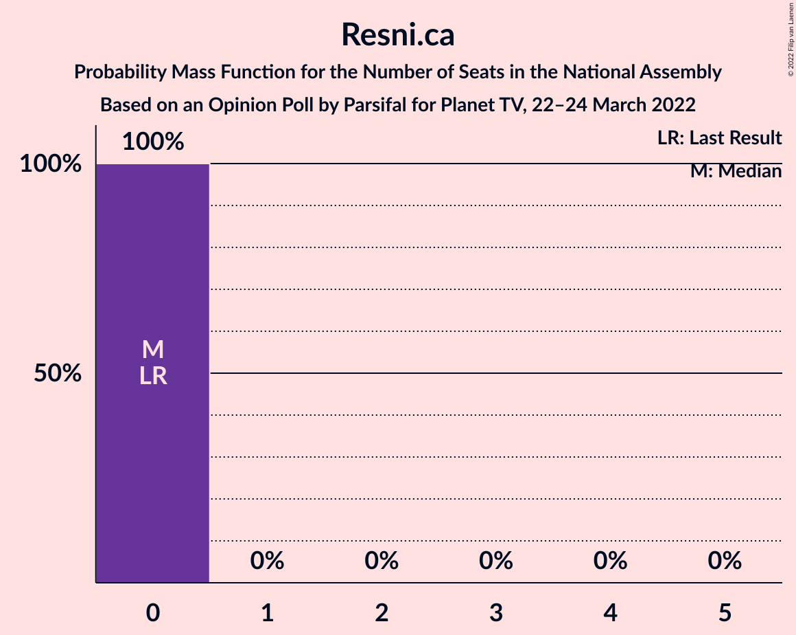

| Number of Seats | Probability | Accumulated | Special Marks |
|:---------------:|:-----------:|:-----------:|:-------------:|
| 0 | 100% | 100% | Last Result, Median |

### VESNA–Zelena stranka

*For a full overview of the results for this party, see the [VESNA–Zelena stranka](party-vesna–zelenastranka.html) page.*

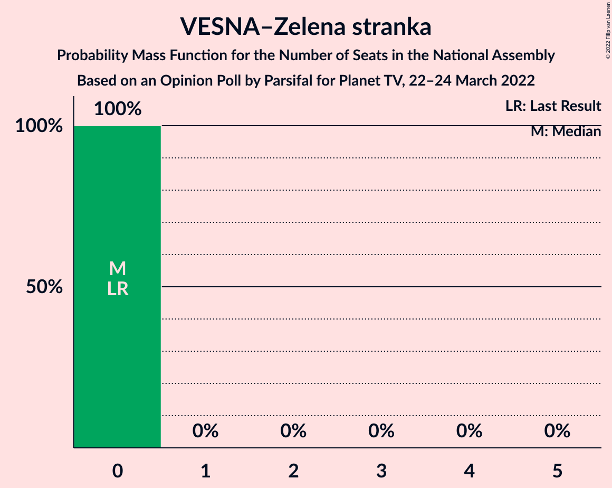

| Number of Seats | Probability | Accumulated | Special Marks |
|:---------------:|:-----------:|:-----------:|:-------------:|
| 0 | 100% | 100% | Last Result, Median |

### Dobra država

*For a full overview of the results for this party, see the [Dobra država](party-dobradržava.html) page.*

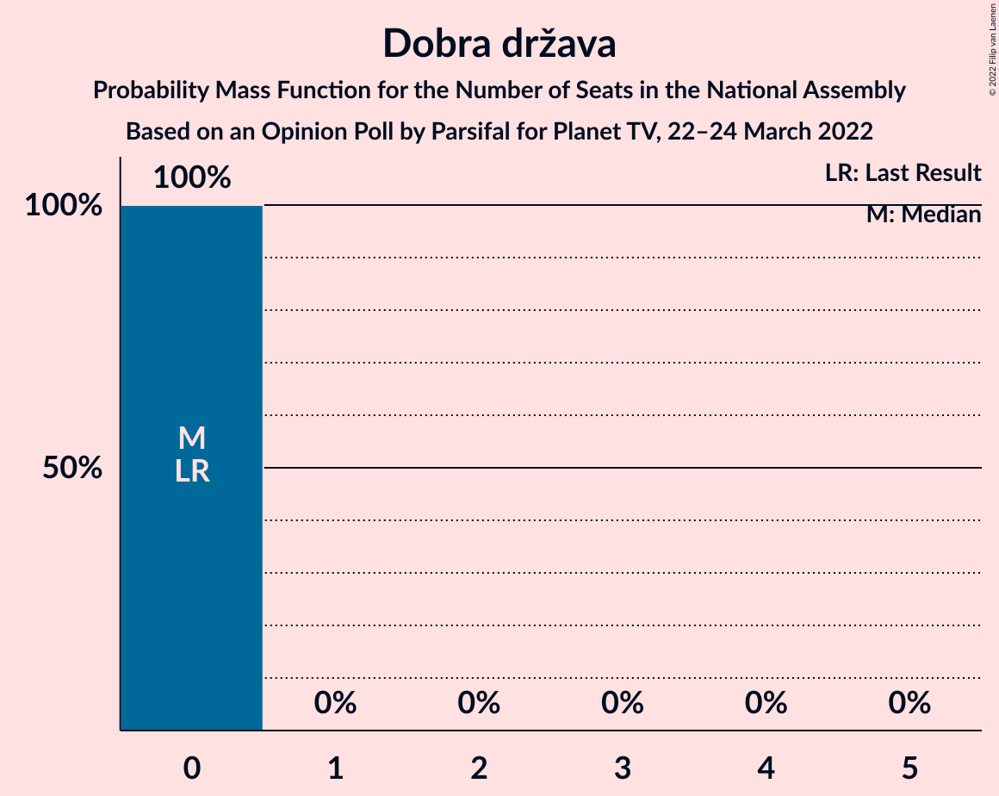

| Number of Seats | Probability | Accumulated | Special Marks |
|:---------------:|:-----------:|:-----------:|:-------------:|
| 0 | 100% | 100% | Last Result, Median |

## Coalitions

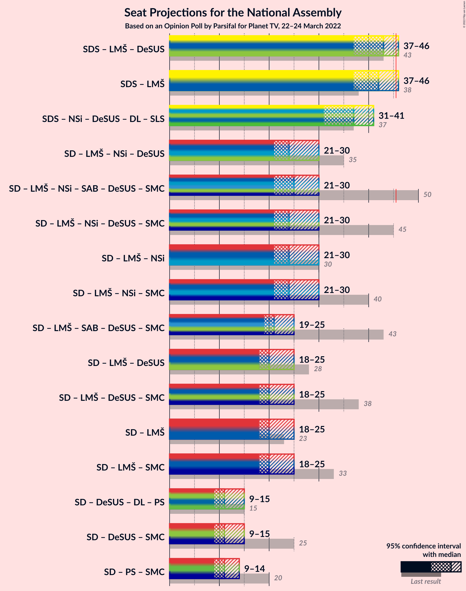

### Confidence Intervals

| Coalition | Last Result | Median | Majority? | 80% Confidence Interval | 90% Confidence Interval | 95% Confidence Interval | 99% Confidence Interval |
|:---------:|:-----------:|:------:|:---------:|:-----------------------:|:-----------------------:|:-----------------------:|:-----------------------:|
| Slovenska demokratska stranka – Lista Marjana Šarca – Demokratična stranka upokojencev Slovenije | 43 | 43 | 17% | 40–46 | 39–46 | 37–46 | 37–47 |
| Slovenska demokratska stranka – Lista Marjana Šarca | 38 | 42 | 13% | 40–46 | 39–46 | 37–46 | 37–47 |
| Socialni demokrati – Lista Marjana Šarca – Nova Slovenija–Krščanski demokrati – Demokratična stranka upokojencev Slovenije | 35 | 24 | 0% | 21–30 | 21–30 | 21–30 | 18–31 |
| Socialni demokrati – Lista Marjana Šarca – Nova Slovenija–Krščanski demokrati | 30 | 24 | 0% | 21–30 | 21–30 | 21–30 | 18–31 |
| Socialni demokrati – Lista Marjana Šarca – Demokratična stranka upokojencev Slovenije | 28 | 20 | 0% | 19–24 | 18–25 | 18–25 | 17–25 |
| Socialni demokrati – Lista Marjana Šarca | 23 | 20 | 0% | 19–24 | 18–25 | 18–25 | 17–25 |

### Slovenska demokratska stranka – Lista Marjana Šarca – Demokratična stranka upokojencev Slovenije

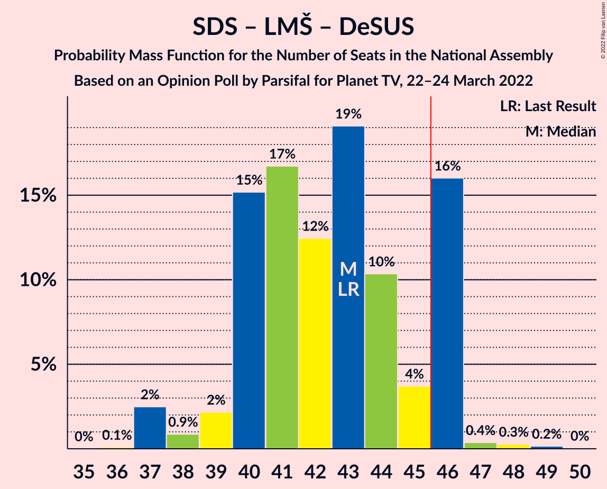

| Number of Seats | Probability | Accumulated | Special Marks |
|:---------------:|:-----------:|:-----------:|:-------------:|
| 36 | 0.1% | 100% |  |
| 37 | 2% | 99.9% |  |
| 38 | 0.9% | 97% |  |
| 39 | 2% | 97% |  |
| 40 | 15% | 94% |  |
| 41 | 17% | 79% | Median |
| 42 | 12% | 62% |  |
| 43 | 19% | 50% | Last Result |
| 44 | 10% | 31% |  |
| 45 | 4% | 21% |  |
| 46 | 16% | 17% | Majority |
| 47 | 0.4% | 0.8% |  |
| 48 | 0.3% | 0.5% |  |
| 49 | 0.2% | 0.2% |  |
| 50 | 0% | 0% |  |

### Slovenska demokratska stranka – Lista Marjana Šarca

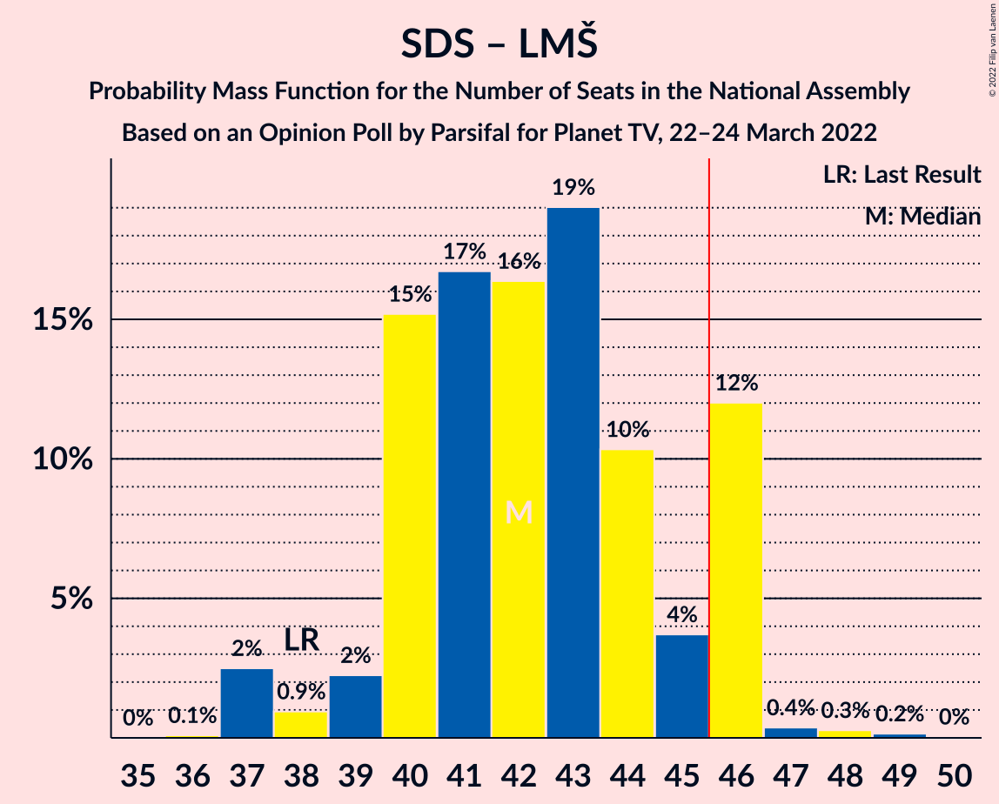

| Number of Seats | Probability | Accumulated | Special Marks |
|:---------------:|:-----------:|:-----------:|:-------------:|
| 36 | 0.1% | 100% |  |
| 37 | 2% | 99.9% |  |
| 38 | 0.9% | 97% | Last Result |
| 39 | 2% | 96% |  |
| 40 | 15% | 94% |  |
| 41 | 17% | 79% | Median |
| 42 | 16% | 62% |  |
| 43 | 19% | 46% |  |
| 44 | 10% | 27% |  |
| 45 | 4% | 17% |  |
| 46 | 12% | 13% | Majority |
| 47 | 0.4% | 0.8% |  |
| 48 | 0.3% | 0.5% |  |
| 49 | 0.2% | 0.2% |  |
| 50 | 0% | 0% |  |

### Socialni demokrati – Lista Marjana Šarca – Nova Slovenija–Krščanski demokrati – Demokratična stranka upokojencev Slovenije

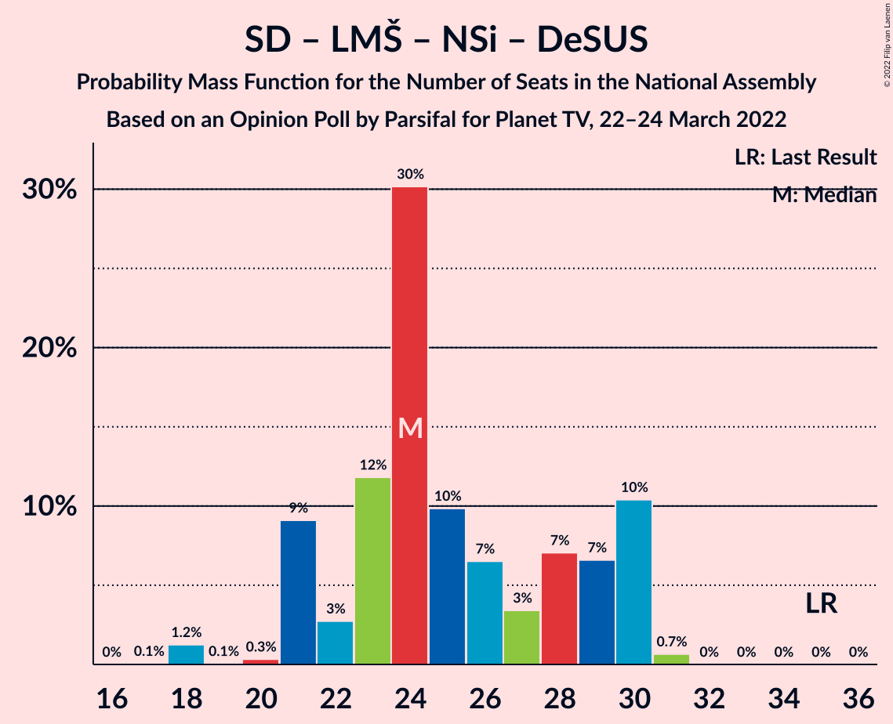

| Number of Seats | Probability | Accumulated | Special Marks |
|:---------------:|:-----------:|:-----------:|:-------------:|
| 17 | 0.1% | 100% |  |
| 18 | 1.2% | 99.9% |  |
| 19 | 0.1% | 98.7% |  |
| 20 | 0.3% | 98.6% |  |
| 21 | 9% | 98% |  |
| 22 | 3% | 89% |  |
| 23 | 12% | 86% |  |
| 24 | 30% | 75% | Median |
| 25 | 10% | 44% |  |
| 26 | 7% | 35% |  |
| 27 | 3% | 28% |  |
| 28 | 7% | 25% |  |
| 29 | 7% | 18% |  |
| 30 | 10% | 11% |  |
| 31 | 0.7% | 0.7% |  |
| 32 | 0% | 0% |  |
| 33 | 0% | 0% |  |
| 34 | 0% | 0% |  |
| 35 | 0% | 0% | Last Result |

### Socialni demokrati – Lista Marjana Šarca – Nova Slovenija–Krščanski demokrati

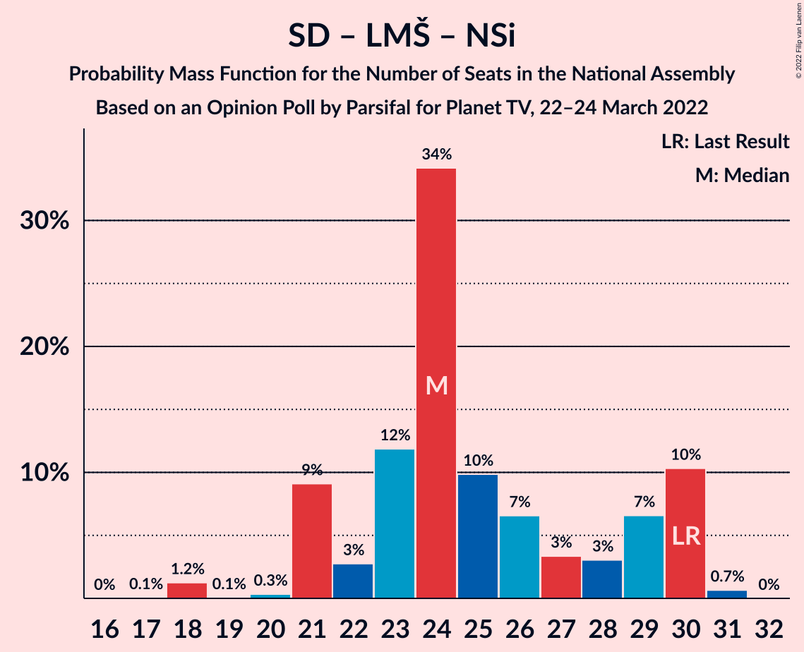

| Number of Seats | Probability | Accumulated | Special Marks |
|:---------------:|:-----------:|:-----------:|:-------------:|
| 17 | 0.1% | 100% |  |
| 18 | 1.2% | 99.9% |  |
| 19 | 0.1% | 98.7% |  |
| 20 | 0.3% | 98.6% |  |
| 21 | 9% | 98% |  |
| 22 | 3% | 89% |  |
| 23 | 12% | 86% |  |
| 24 | 34% | 75% | Median |
| 25 | 10% | 40% |  |
| 26 | 7% | 31% |  |
| 27 | 3% | 24% |  |
| 28 | 3% | 21% |  |
| 29 | 7% | 18% |  |
| 30 | 10% | 11% | Last Result |
| 31 | 0.7% | 0.7% |  |
| 32 | 0% | 0% |  |

### Socialni demokrati – Lista Marjana Šarca – Demokratična stranka upokojencev Slovenije

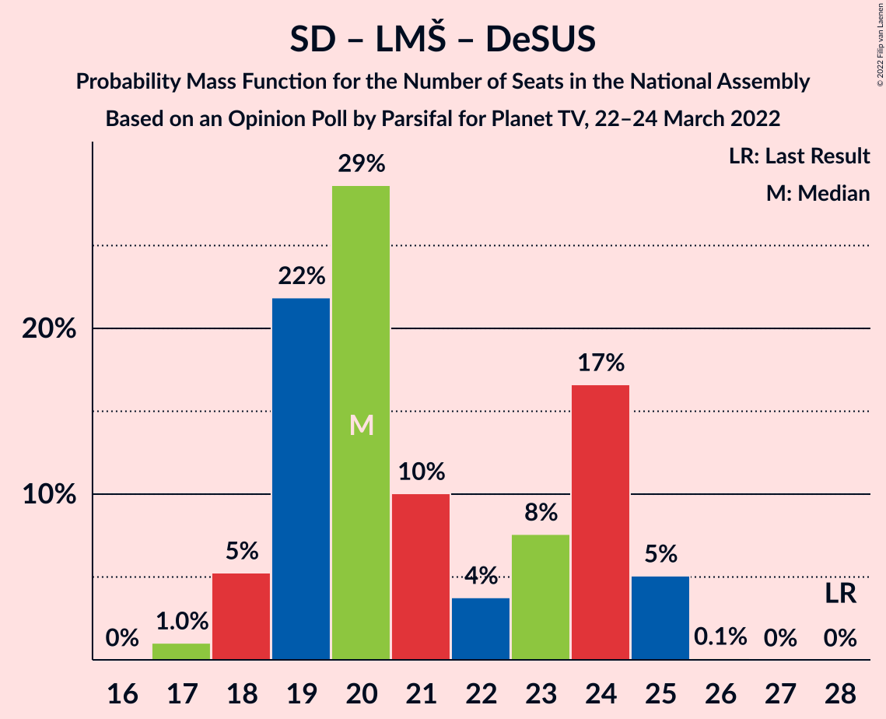

| Number of Seats | Probability | Accumulated | Special Marks |
|:---------------:|:-----------:|:-----------:|:-------------:|
| 17 | 1.0% | 100% |  |
| 18 | 5% | 99.0% |  |
| 19 | 22% | 94% |  |
| 20 | 29% | 72% | Median |
| 21 | 10% | 43% |  |
| 22 | 4% | 33% |  |
| 23 | 8% | 29% |  |
| 24 | 17% | 22% |  |
| 25 | 5% | 5% |  |
| 26 | 0.1% | 0.1% |  |
| 27 | 0% | 0% |  |
| 28 | 0% | 0% | Last Result |

### Socialni demokrati – Lista Marjana Šarca

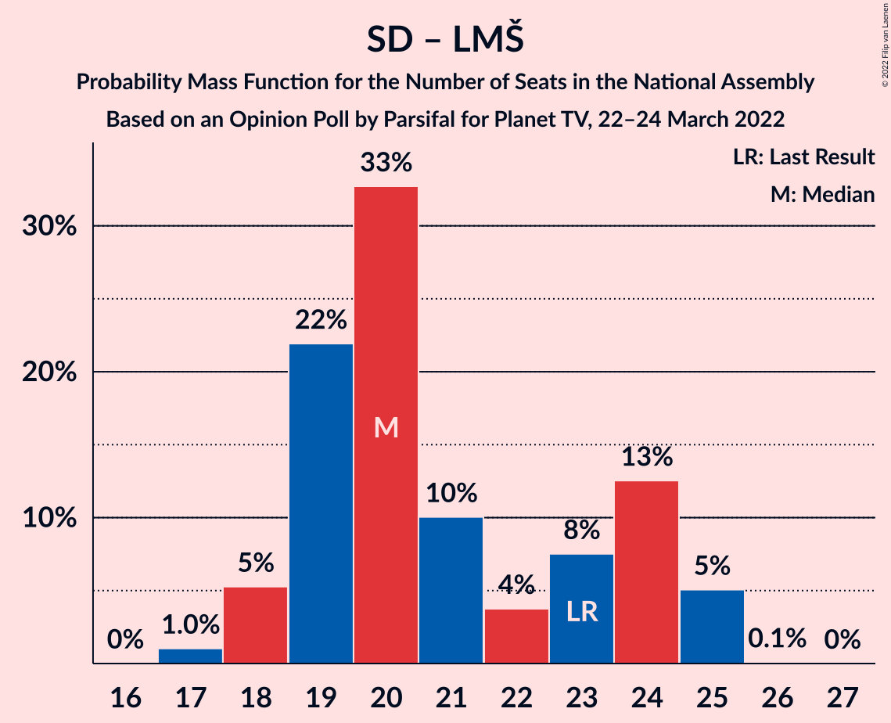

| Number of Seats | Probability | Accumulated | Special Marks |
|:---------------:|:-----------:|:-----------:|:-------------:|
| 17 | 1.0% | 100% |  |
| 18 | 5% | 98.9% |  |
| 19 | 22% | 94% |  |
| 20 | 33% | 72% | Median |
| 21 | 10% | 39% |  |
| 22 | 4% | 29% |  |
| 23 | 8% | 25% | Last Result |
| 24 | 13% | 18% |  |
| 25 | 5% | 5% |  |
| 26 | 0.1% | 0.1% |  |
| 27 | 0% | 0% |  |

## Technical Information

### Opinion Poll

+ **Polling firm:** Parsifal
+ **Commissioner(s):** Planet TV
+ **Fieldwork period:** 22–24 March 2022

### Calculations

+ **Sample size:** 1009
+ **Simulations done:** 1,048,576
+ **Error estimate:** 1.80%

