# Opinion Poll by Mediana for RTV SLO, 30–31 March 2022

<a href="#voting-intentions">Voting Intentions</a> | <a href="#seats">Seats</a> | <a href="#coalitions">Coalitions</a> | <a href="#technical-information">Technical Information</a>

## Voting Intentions

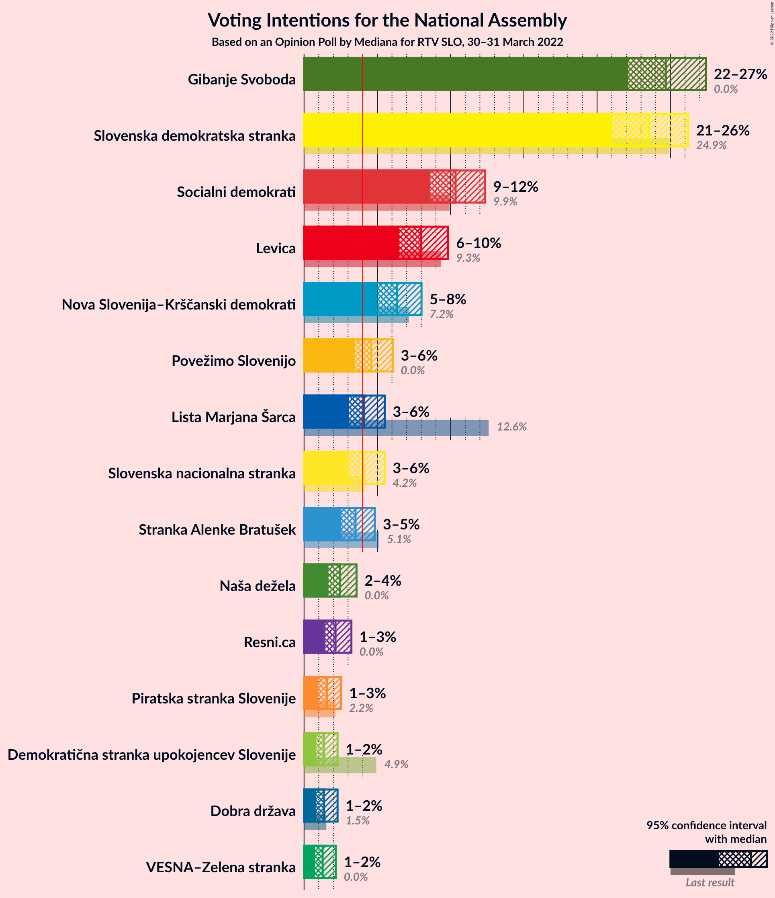

### Confidence Intervals

| Party | Last Result | Poll Result | 80% Confidence Interval | 90% Confidence Interval | 95% Confidence Interval | 99% Confidence Interval |
|:-----:|:-----------:|:-----------:|:-----------------------:|:-----------------------:|:-----------------------:|:-----------------------:|
| Gibanje Svoboda | 0.0% | 24.7% | 23.0–26.5% |22.5–27.0% |22.1–27.4% |21.4–28.3% |
| Slovenska demokratska stranka | 24.9% | 23.5% | 21.9–25.3% |21.4–25.8% |21.0–26.2% |20.2–27.1% |
| Socialni demokrati | 9.9% | 10.3% | 9.2–11.7% |8.9–12.0% |8.6–12.4% |8.1–13.0% |
| Levica | 9.3% | 8.0% | 7.0–9.2% |6.7–9.5% |6.5–9.8% |6.0–10.4% |
| Nova Slovenija–Krščanski demokrati | 7.2% | 6.3% | 5.5–7.4% |5.2–7.7% |5.0–8.0% |4.6–8.6% |
| Povežimo Slovenijo | 0.0% | 4.6% | 3.8–5.5% |3.6–5.8% |3.5–6.1% |3.1–6.5% |
| Lista Marjana Šarca | 12.6% | 4.1% | 3.4–5.0% |3.2–5.3% |3.0–5.5% |2.7–6.0% |
| Slovenska nacionalna stranka | 4.2% | 4.1% | 3.4–5.0% |3.2–5.3% |3.0–5.5% |2.7–6.0% |
| Stranka Alenke Bratušek | 5.1% | 3.5% | 2.9–4.4% |2.7–4.6% |2.5–4.8% |2.3–5.3% |
| Naša dežela | 0.0% | 2.4% | 1.9–3.2% |1.8–3.4% |1.7–3.6% |1.4–4.0% |
| Resni.ca | 0.0% | 2.1% | 1.7–2.9% |1.5–3.0% |1.4–3.2% |1.2–3.6% |
| Piratska stranka Slovenije | 2.2% | 1.6% | 1.2–2.2% |1.1–2.4% |1.0–2.5% |0.8–2.9% |
| Demokratična stranka upokojencev Slovenije | 4.9% | 1.4% | 1.0–2.0% |0.9–2.1% |0.8–2.3% |0.7–2.6% |
| Dobra država | 1.5% | 1.4% | 1.0–2.0% |0.9–2.1% |0.8–2.3% |0.7–2.6% |
| VESNA–Zelena stranka | 0.0% | 1.3% | 0.9–1.8% |0.8–2.0% |0.7–2.2% |0.6–2.5% |

*Note:* The poll result column reflects the actual value used in the calculations. Published results may vary slightly, and in addition be rounded to fewer digits.

## Seats

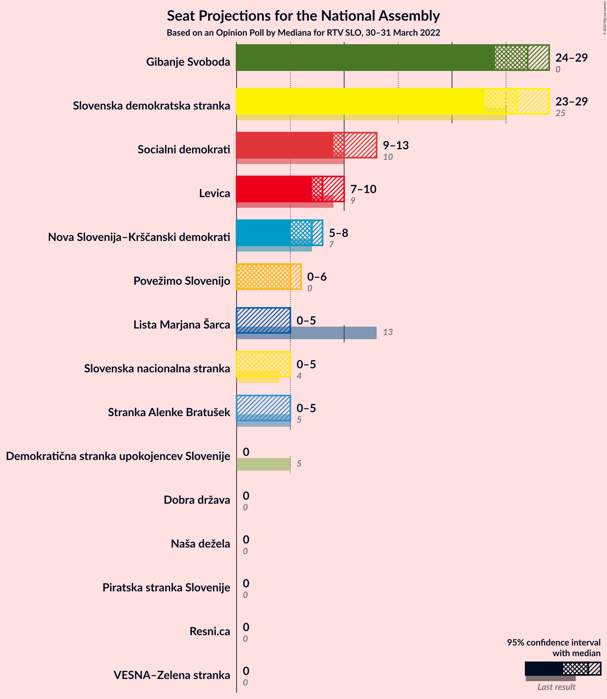

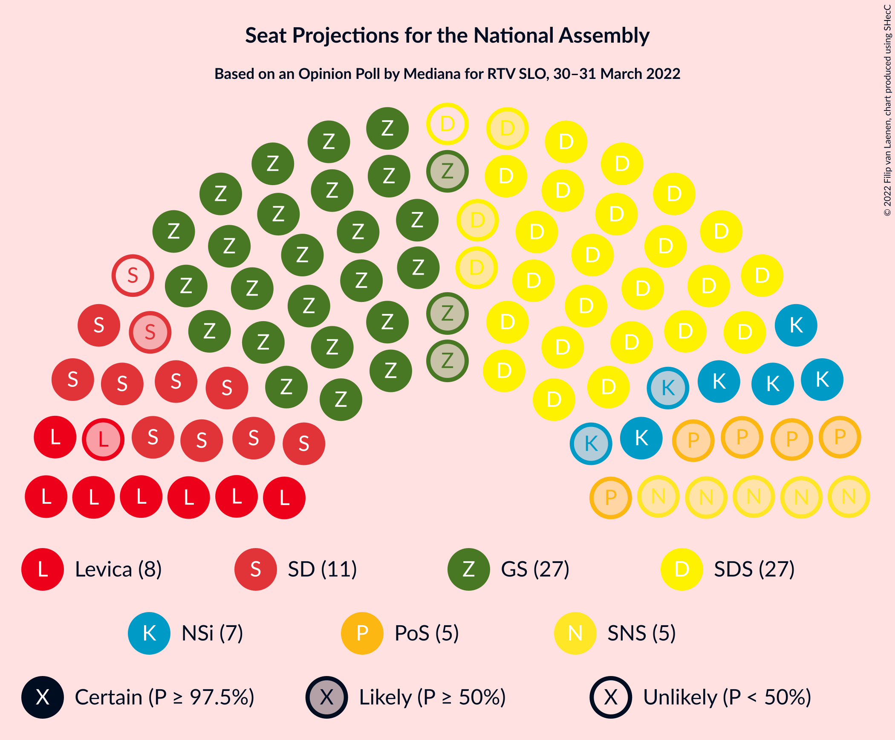

### Confidence Intervals

| Party | Last Result | Median | 80% Confidence Interval | 90% Confidence Interval | 95% Confidence Interval | 99% Confidence Interval |
|:-----:|:-----------:|:------:|:-----------------------:|:-----------------------:|:-----------------------:|:-----------------------:|
| <a href="#gibanje-svoboda">Gibanje Svoboda</a> | 0 | 27 | 24–28 |24–28 |24–29 |23–31 |
| <a href="#slovenska-demokratska-stranka">Slovenska demokratska stranka</a> | 25 | 26 | 25–27 |23–29 |23–29 |22–30 |
| <a href="#socialni-demokrati">Socialni demokrati</a> | 10 | 10 | 10–11 |10–12 |9–13 |9–13 |
| <a href="#levica">Levica</a> | 9 | 8 | 8–9 |8–10 |7–10 |6–11 |
| <a href="#nova-slovenija–krščanski-demokrati">Nova Slovenija–Krščanski demokrati</a> | 7 | 7 | 6–8 |6–8 |5–8 |5–9 |
| <a href="#povežimo-slovenijo">Povežimo Slovenijo</a> | 0 | 5 | 4–5 |0–6 |0–6 |0–7 |
| <a href="#lista-marjana-šarca">Lista Marjana Šarca</a> | 13 | 0 | 0–4 |0–4 |0–5 |0–5 |
| <a href="#slovenska-nacionalna-stranka">Slovenska nacionalna stranka</a> | 4 | 5 | 0–5 |0–5 |0–5 |0–6 |
| <a href="#stranka-alenke-bratušek">Stranka Alenke Bratušek</a> | 5 | 0 | 0 |0–5 |0–5 |0–5 |
| <a href="#naša-dežela">Naša dežela</a> | 0 | 0 | 0 |0 |0 |0 |
| <a href="#resni.ca">Resni.ca</a> | 0 | 0 | 0 |0 |0 |0 |
| <a href="#piratska-stranka-slovenije">Piratska stranka Slovenije</a> | 0 | 0 | 0 |0 |0 |0 |
| <a href="#demokratična-stranka-upokojencev-slovenije">Demokratična stranka upokojencev Slovenije</a> | 5 | 0 | 0 |0 |0 |0 |
| <a href="#dobra-država">Dobra država</a> | 0 | 0 | 0 |0 |0 |0 |
| <a href="#vesna–zelena-stranka">VESNA–Zelena stranka</a> | 0 | 0 | 0 |0 |0 |0 |

### Gibanje Svoboda

*For a full overview of the results for this party, see the [Gibanje Svoboda](party-gibanjesvoboda.html) page.*

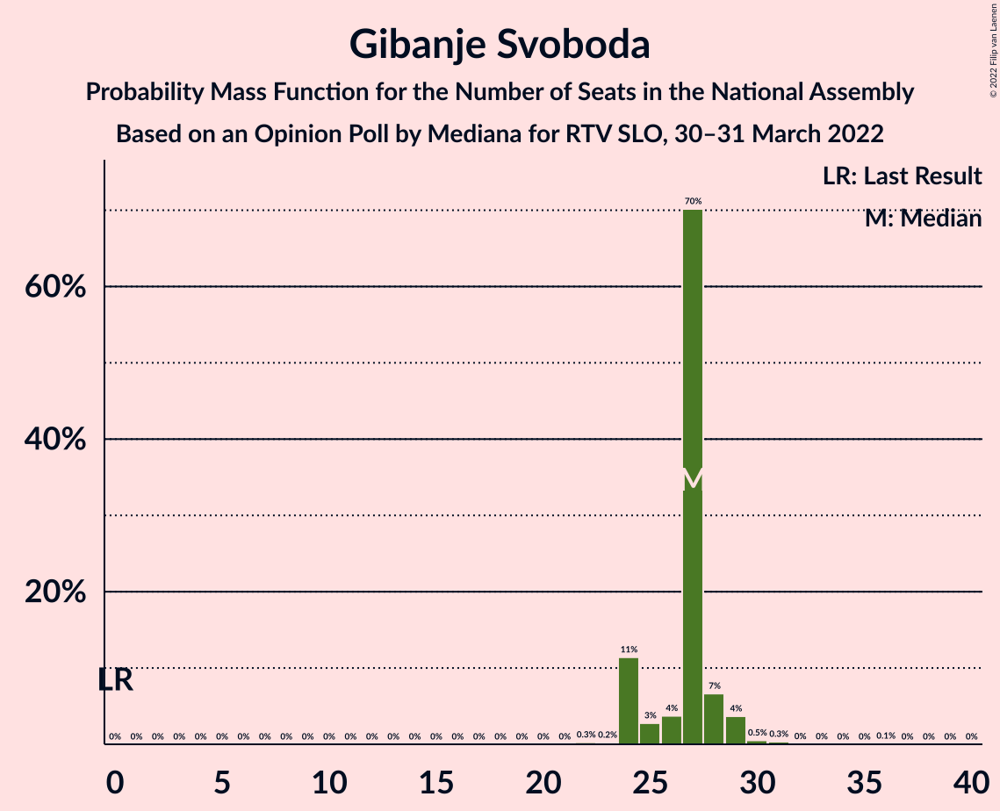

| Number of Seats | Probability | Accumulated | Special Marks |
|:---------------:|:-----------:|:-----------:|:-------------:|
| 0 | 0% | 100% | Last Result |
| 1 | 0% | 100% |  |
| 2 | 0% | 100% |  |
| 3 | 0% | 100% |  |
| 4 | 0% | 100% |  |
| 5 | 0% | 100% |  |
| 6 | 0% | 100% |  |
| 7 | 0% | 100% |  |
| 8 | 0% | 100% |  |
| 9 | 0% | 100% |  |
| 10 | 0% | 100% |  |
| 11 | 0% | 100% |  |
| 12 | 0% | 100% |  |
| 13 | 0% | 100% |  |
| 14 | 0% | 100% |  |
| 15 | 0% | 100% |  |
| 16 | 0% | 100% |  |
| 17 | 0% | 100% |  |
| 18 | 0% | 100% |  |
| 19 | 0% | 100% |  |
| 20 | 0% | 100% |  |
| 21 | 0% | 100% |  |
| 22 | 0.3% | 100% |  |
| 23 | 0.2% | 99.7% |  |
| 24 | 11% | 99.5% |  |
| 25 | 3% | 88% |  |
| 26 | 4% | 85% |  |
| 27 | 70% | 82% | Median |
| 28 | 7% | 11% |  |
| 29 | 4% | 5% |  |
| 30 | 0.5% | 1.1% |  |
| 31 | 0.3% | 0.5% |  |
| 32 | 0% | 0.2% |  |
| 33 | 0% | 0.1% |  |
| 34 | 0% | 0.1% |  |
| 35 | 0% | 0.1% |  |
| 36 | 0.1% | 0.1% |  |
| 37 | 0% | 0% |  |

### Slovenska demokratska stranka

*For a full overview of the results for this party, see the [Slovenska demokratska stranka](party-slovenskademokratskastranka.html) page.*

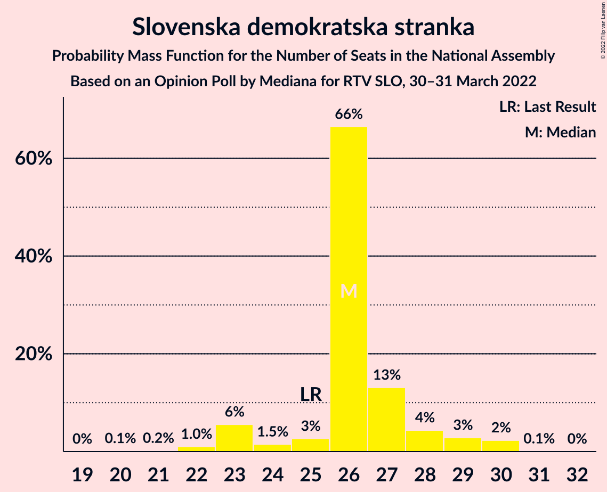

| Number of Seats | Probability | Accumulated | Special Marks |
|:---------------:|:-----------:|:-----------:|:-------------:|
| 20 | 0.1% | 100% |  |
| 21 | 0.2% | 99.9% |  |
| 22 | 1.0% | 99.7% |  |
| 23 | 6% | 98.7% |  |
| 24 | 1.5% | 93% |  |
| 25 | 3% | 92% | Last Result |
| 26 | 66% | 89% | Median |
| 27 | 13% | 23% |  |
| 28 | 4% | 10% |  |
| 29 | 3% | 5% |  |
| 30 | 2% | 2% |  |
| 31 | 0.1% | 0.1% |  |
| 32 | 0% | 0% |  |

### Socialni demokrati

*For a full overview of the results for this party, see the [Socialni demokrati](party-socialnidemokrati.html) page.*

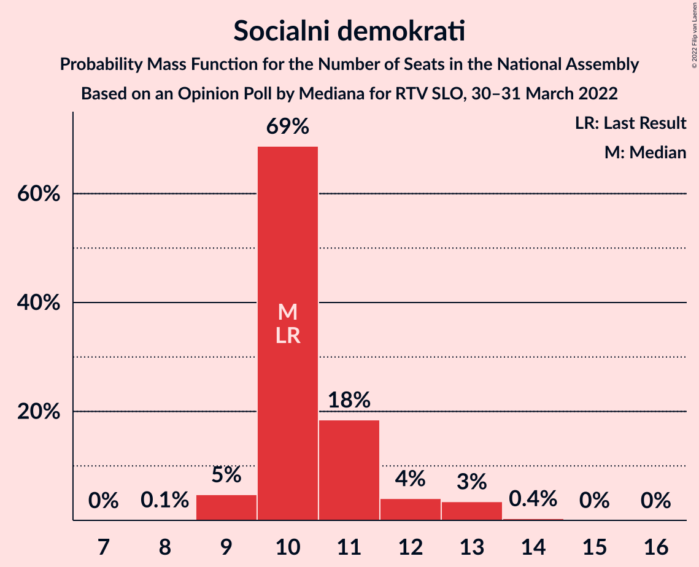

| Number of Seats | Probability | Accumulated | Special Marks |
|:---------------:|:-----------:|:-----------:|:-------------:|
| 8 | 0.1% | 100% |  |
| 9 | 5% | 99.9% |  |
| 10 | 69% | 95% | Last Result, Median |
| 11 | 18% | 26% |  |
| 12 | 4% | 8% |  |
| 13 | 3% | 4% |  |
| 14 | 0.4% | 0.4% |  |
| 15 | 0% | 0.1% |  |
| 16 | 0% | 0% |  |

### Levica

*For a full overview of the results for this party, see the [Levica](party-levica.html) page.*

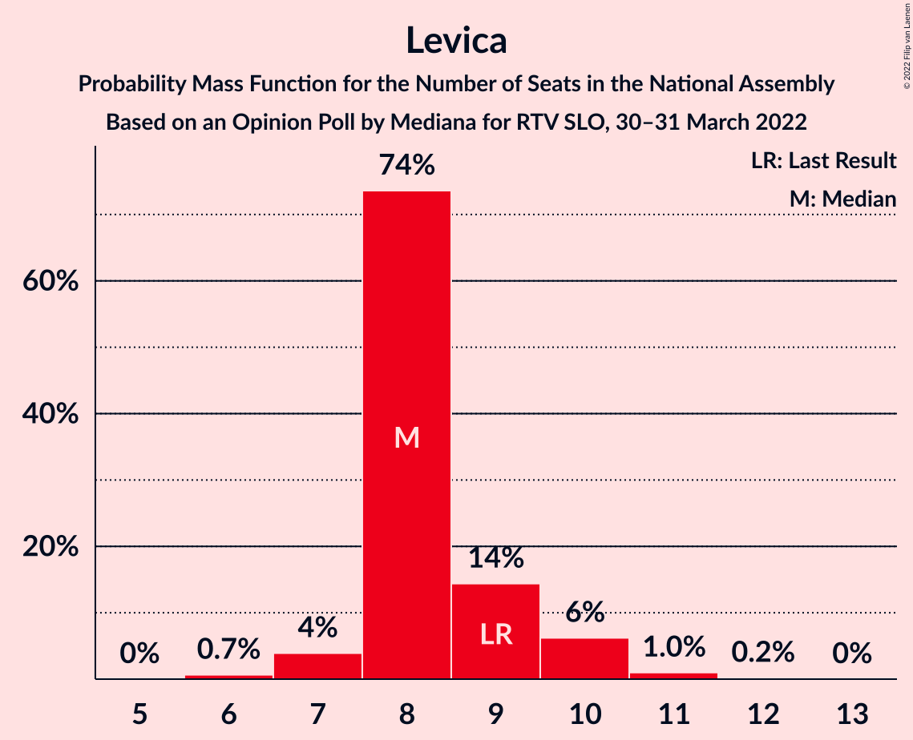

| Number of Seats | Probability | Accumulated | Special Marks |
|:---------------:|:-----------:|:-----------:|:-------------:|
| 6 | 0.7% | 100% |  |
| 7 | 4% | 99.3% |  |
| 8 | 74% | 95% | Median |
| 9 | 14% | 22% | Last Result |
| 10 | 6% | 7% |  |
| 11 | 1.0% | 1.2% |  |
| 12 | 0.2% | 0.2% |  |
| 13 | 0% | 0% |  |

### Nova Slovenija–Krščanski demokrati

*For a full overview of the results for this party, see the [Nova Slovenija–Krščanski demokrati](party-novaslovenija–krščanskidemokrati.html) page.*

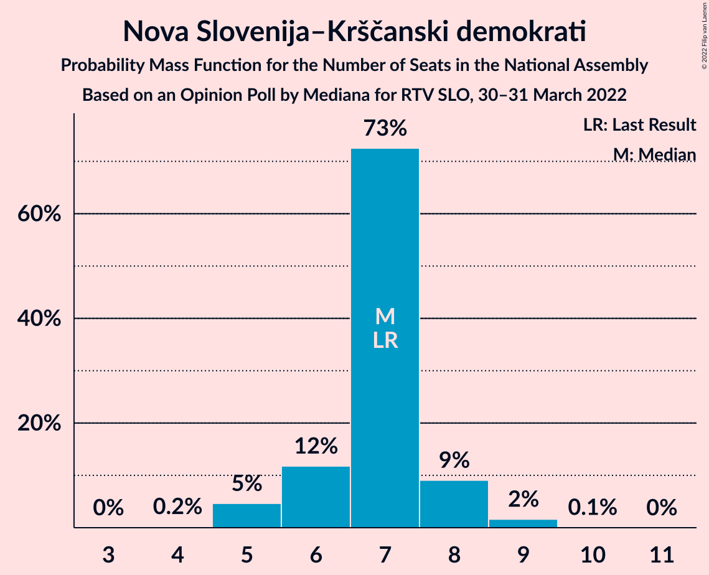

| Number of Seats | Probability | Accumulated | Special Marks |
|:---------------:|:-----------:|:-----------:|:-------------:|
| 4 | 0.2% | 100% |  |
| 5 | 5% | 99.8% |  |
| 6 | 12% | 95% |  |
| 7 | 73% | 83% | Last Result, Median |
| 8 | 9% | 11% |  |
| 9 | 2% | 2% |  |
| 10 | 0.1% | 0.1% |  |
| 11 | 0% | 0% |  |

### Povežimo Slovenijo

*For a full overview of the results for this party, see the [Povežimo Slovenijo](party-povežimoslovenijo.html) page.*

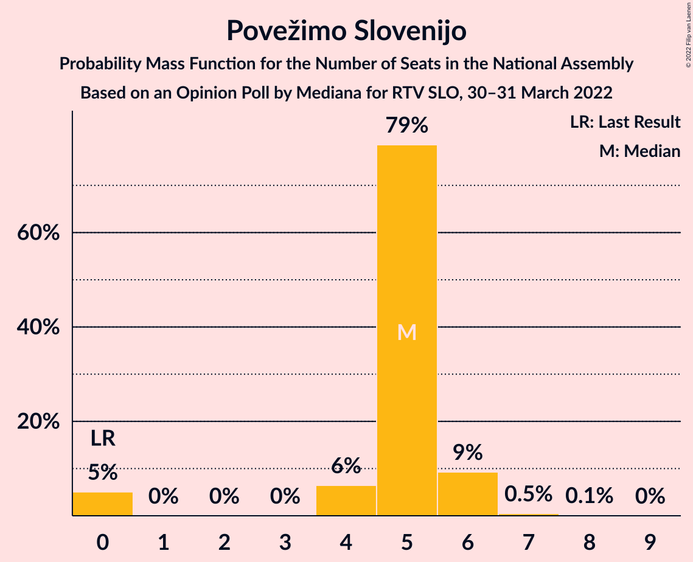

| Number of Seats | Probability | Accumulated | Special Marks |
|:---------------:|:-----------:|:-----------:|:-------------:|
| 0 | 5% | 100% | Last Result |
| 1 | 0% | 95% |  |
| 2 | 0% | 95% |  |
| 3 | 0% | 95% |  |
| 4 | 6% | 95% |  |
| 5 | 79% | 88% | Median |
| 6 | 9% | 10% |  |
| 7 | 0.5% | 0.6% |  |
| 8 | 0.1% | 0.1% |  |
| 9 | 0% | 0% |  |

### Lista Marjana Šarca

*For a full overview of the results for this party, see the [Lista Marjana Šarca](party-listamarjanašarca.html) page.*

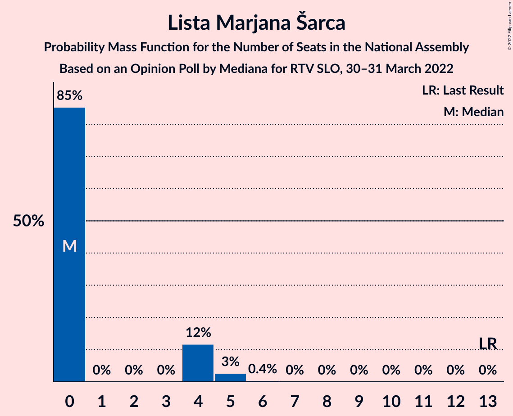

| Number of Seats | Probability | Accumulated | Special Marks |
|:---------------:|:-----------:|:-----------:|:-------------:|
| 0 | 85% | 100% | Median |
| 1 | 0% | 15% |  |
| 2 | 0% | 15% |  |
| 3 | 0% | 15% |  |
| 4 | 12% | 15% |  |
| 5 | 3% | 3% |  |
| 6 | 0.4% | 0.4% |  |
| 7 | 0% | 0% |  |
| 8 | 0% | 0% |  |
| 9 | 0% | 0% |  |
| 10 | 0% | 0% |  |
| 11 | 0% | 0% |  |
| 12 | 0% | 0% |  |
| 13 | 0% | 0% | Last Result |

### Slovenska nacionalna stranka

*For a full overview of the results for this party, see the [Slovenska nacionalna stranka](party-slovenskanacionalnastranka.html) page.*

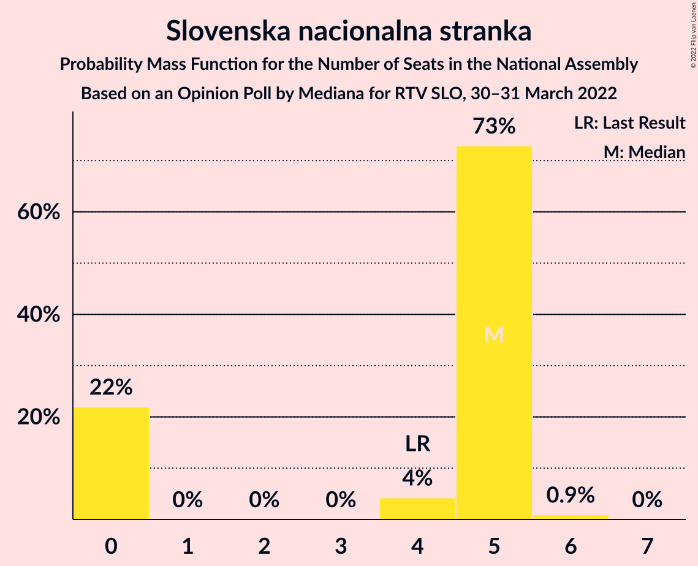

| Number of Seats | Probability | Accumulated | Special Marks |
|:---------------:|:-----------:|:-----------:|:-------------:|
| 0 | 22% | 100% |  |
| 1 | 0% | 78% |  |
| 2 | 0% | 78% |  |
| 3 | 0% | 78% |  |
| 4 | 4% | 78% | Last Result |
| 5 | 73% | 74% | Median |
| 6 | 0.9% | 0.9% |  |
| 7 | 0% | 0% |  |

### Stranka Alenke Bratušek

*For a full overview of the results for this party, see the [Stranka Alenke Bratušek](party-strankaalenkebratušek.html) page.*

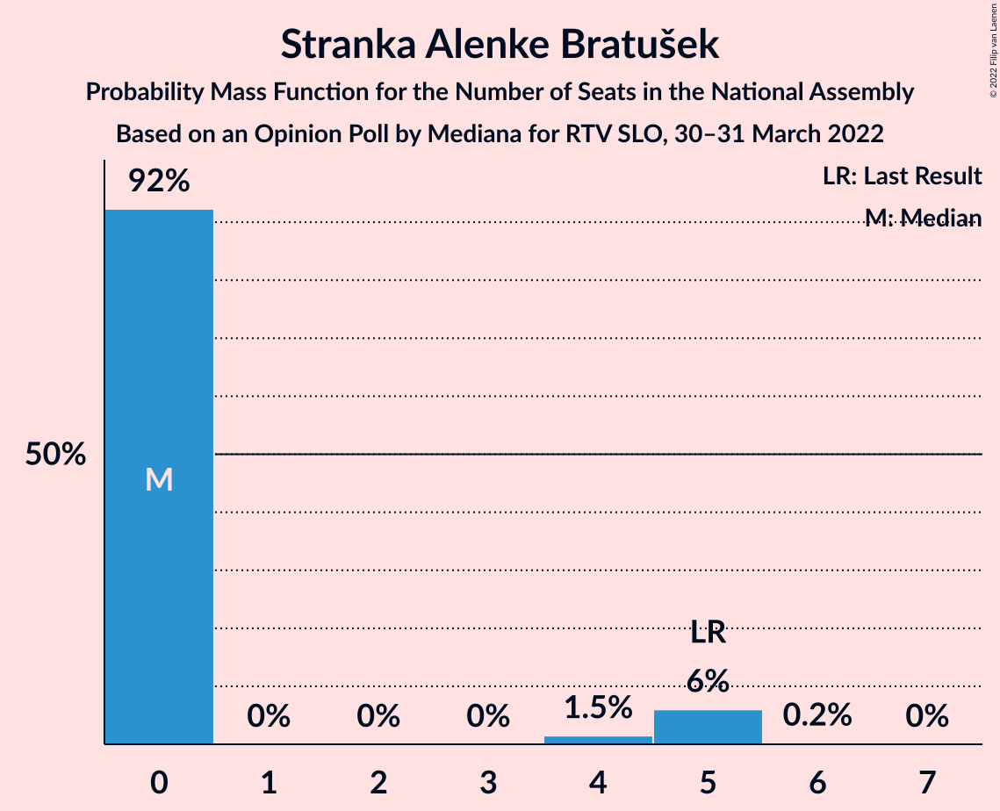

| Number of Seats | Probability | Accumulated | Special Marks |
|:---------------:|:-----------:|:-----------:|:-------------:|
| 0 | 92% | 100% | Median |
| 1 | 0% | 8% |  |
| 2 | 0% | 8% |  |
| 3 | 0% | 8% |  |
| 4 | 1.5% | 8% |  |
| 5 | 6% | 6% | Last Result |
| 6 | 0.2% | 0.2% |  |
| 7 | 0% | 0% |  |

### Naša dežela

*For a full overview of the results for this party, see the [Naša dežela](party-našadežela.html) page.*

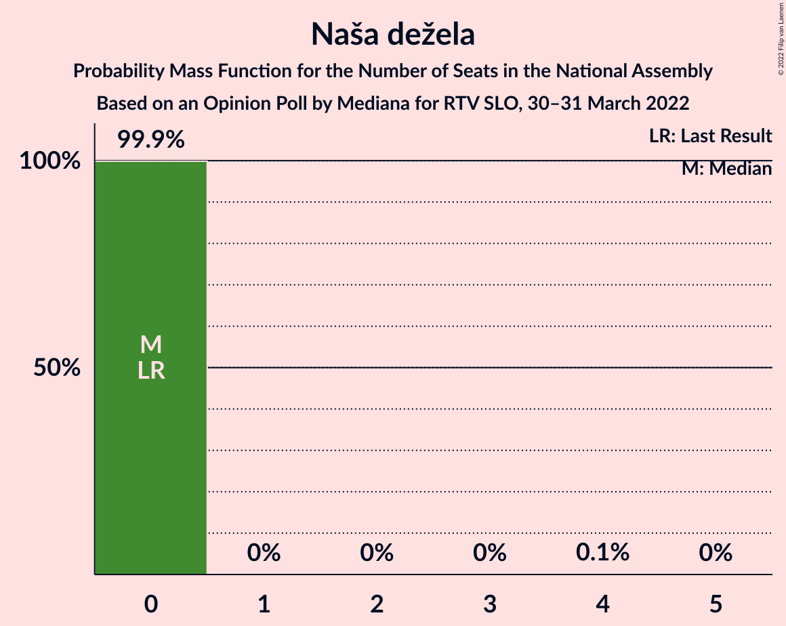

| Number of Seats | Probability | Accumulated | Special Marks |
|:---------------:|:-----------:|:-----------:|:-------------:|
| 0 | 99.9% | 100% | Last Result, Median |
| 1 | 0% | 0.1% |  |
| 2 | 0% | 0.1% |  |
| 3 | 0% | 0.1% |  |
| 4 | 0.1% | 0.1% |  |
| 5 | 0% | 0% |  |

### Resni.ca

*For a full overview of the results for this party, see the [Resni.ca](party-resnica.html) page.*

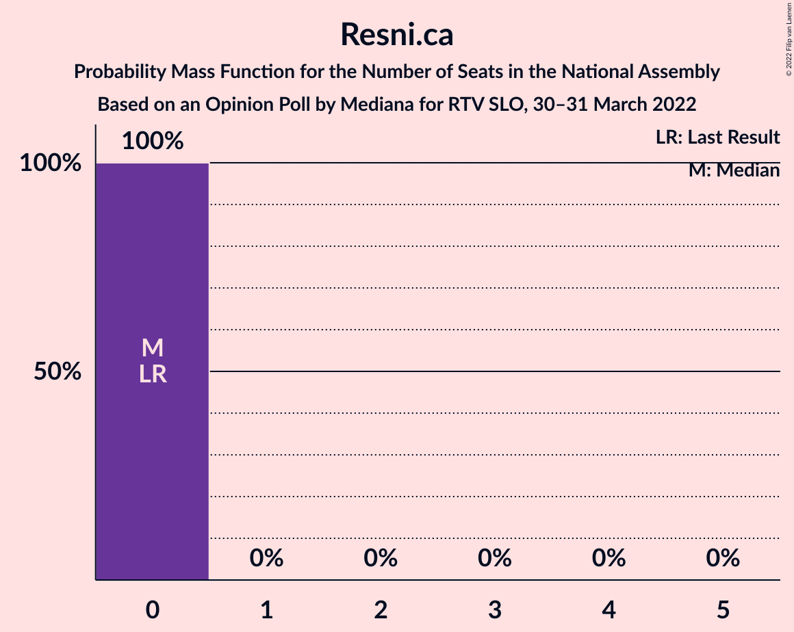

| Number of Seats | Probability | Accumulated | Special Marks |
|:---------------:|:-----------:|:-----------:|:-------------:|
| 0 | 100% | 100% | Last Result, Median |

### Piratska stranka Slovenije

*For a full overview of the results for this party, see the [Piratska stranka Slovenije](party-piratskastrankaslovenije.html) page.*

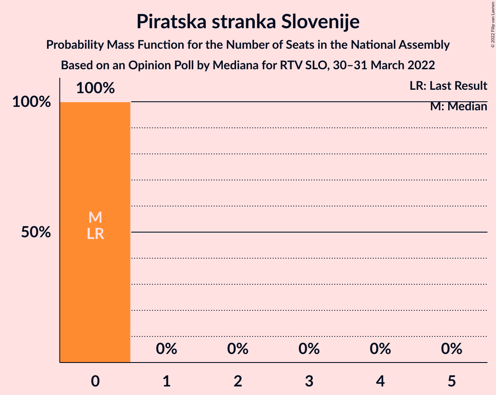

| Number of Seats | Probability | Accumulated | Special Marks |
|:---------------:|:-----------:|:-----------:|:-------------:|
| 0 | 100% | 100% | Last Result, Median |

### Demokratična stranka upokojencev Slovenije

*For a full overview of the results for this party, see the [Demokratična stranka upokojencev Slovenije](party-demokratičnastrankaupokojencevslovenije.html) page.*

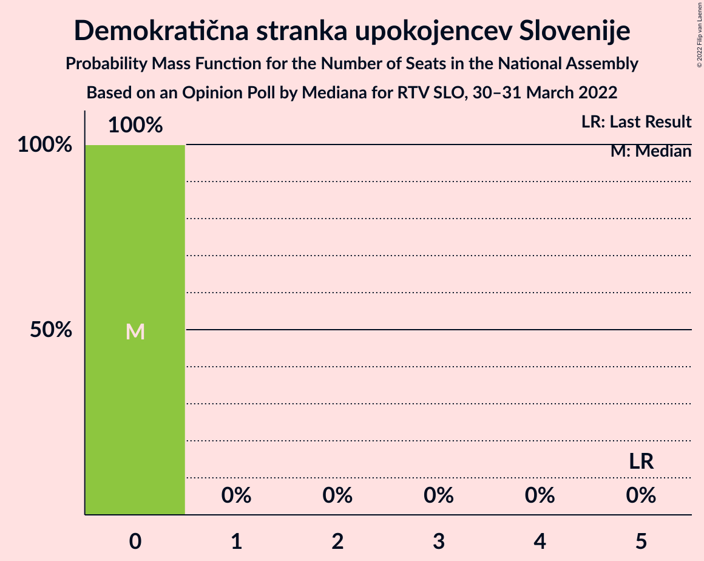

| Number of Seats | Probability | Accumulated | Special Marks |
|:---------------:|:-----------:|:-----------:|:-------------:|
| 0 | 100% | 100% | Median |
| 1 | 0% | 0% |  |
| 2 | 0% | 0% |  |
| 3 | 0% | 0% |  |
| 4 | 0% | 0% |  |
| 5 | 0% | 0% | Last Result |

### Dobra država

*For a full overview of the results for this party, see the [Dobra država](party-dobradržava.html) page.*

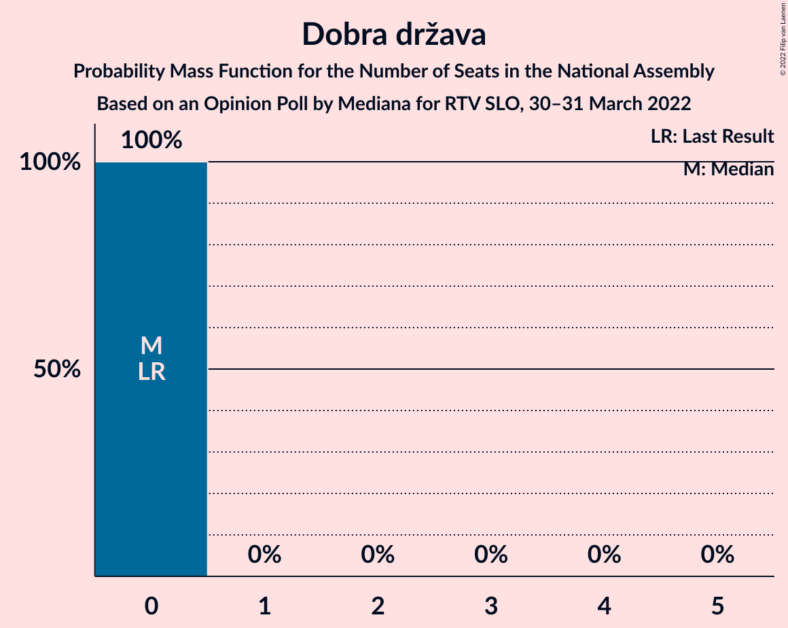

| Number of Seats | Probability | Accumulated | Special Marks |
|:---------------:|:-----------:|:-----------:|:-------------:|
| 0 | 100% | 100% | Last Result, Median |

### VESNA–Zelena stranka

*For a full overview of the results for this party, see the [VESNA–Zelena stranka](party-vesna–zelenastranka.html) page.*

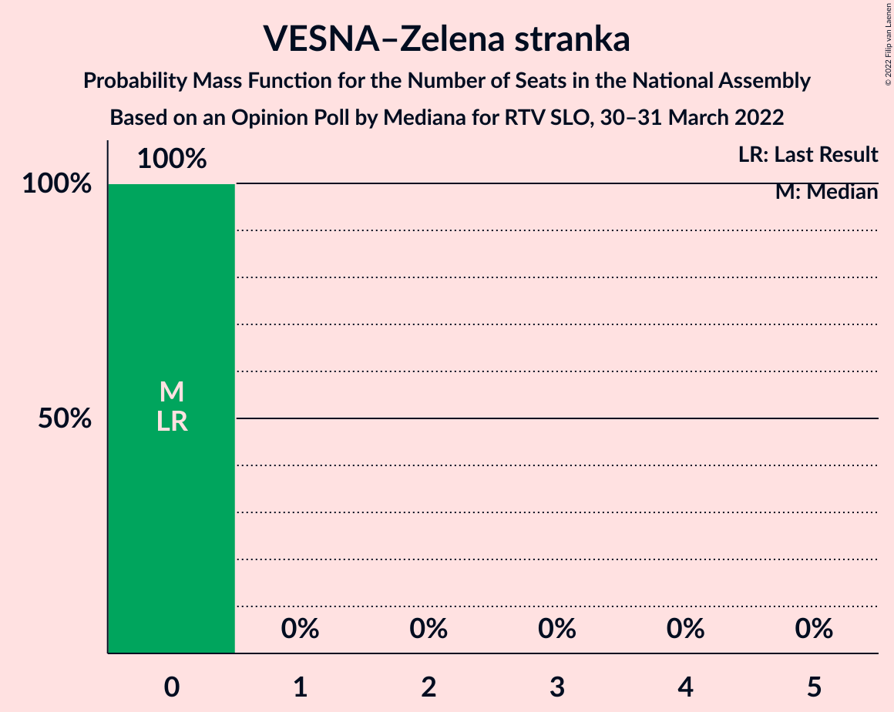

| Number of Seats | Probability | Accumulated | Special Marks |
|:---------------:|:-----------:|:-----------:|:-------------:|
| 0 | 100% | 100% | Last Result, Median |

## Coalitions

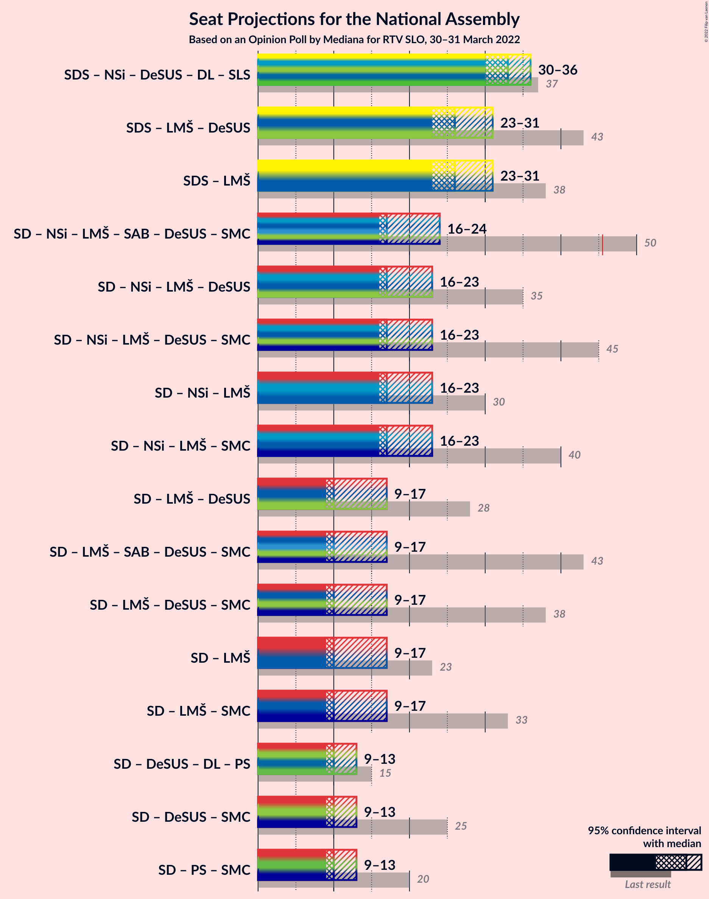

### Confidence Intervals

| Coalition | Last Result | Median | Majority? | 80% Confidence Interval | 90% Confidence Interval | 95% Confidence Interval | 99% Confidence Interval |
|:---------:|:-----------:|:------:|:---------:|:-----------------------:|:-----------------------:|:-----------------------:|:-----------------------:|
| Slovenska demokratska stranka – Lista Marjana Šarca – Demokratična stranka upokojencev Slovenije | 43 | 26 | 0% | 26–30 | 23–31 | 23–31 | 22–33 |
| Slovenska demokratska stranka – Lista Marjana Šarca | 38 | 26 | 0% | 26–30 | 23–31 | 23–31 | 22–33 |
| Socialni demokrati – Nova Slovenija–Krščanski demokrati – Lista Marjana Šarca – Demokratična stranka upokojencev Slovenije | 35 | 17 | 0% | 17–23 | 16–23 | 16–23 | 16–24 |
| Socialni demokrati – Nova Slovenija–Krščanski demokrati – Lista Marjana Šarca | 30 | 17 | 0% | 17–23 | 16–23 | 16–23 | 16–24 |
| Socialni demokrati – Lista Marjana Šarca – Demokratična stranka upokojencev Slovenije | 28 | 10 | 0% | 10–15 | 10–15 | 9–17 | 9–17 |
| Socialni demokrati – Lista Marjana Šarca | 23 | 10 | 0% | 10–15 | 10–15 | 9–17 | 9–17 |

### Slovenska demokratska stranka – Lista Marjana Šarca – Demokratična stranka upokojencev Slovenije

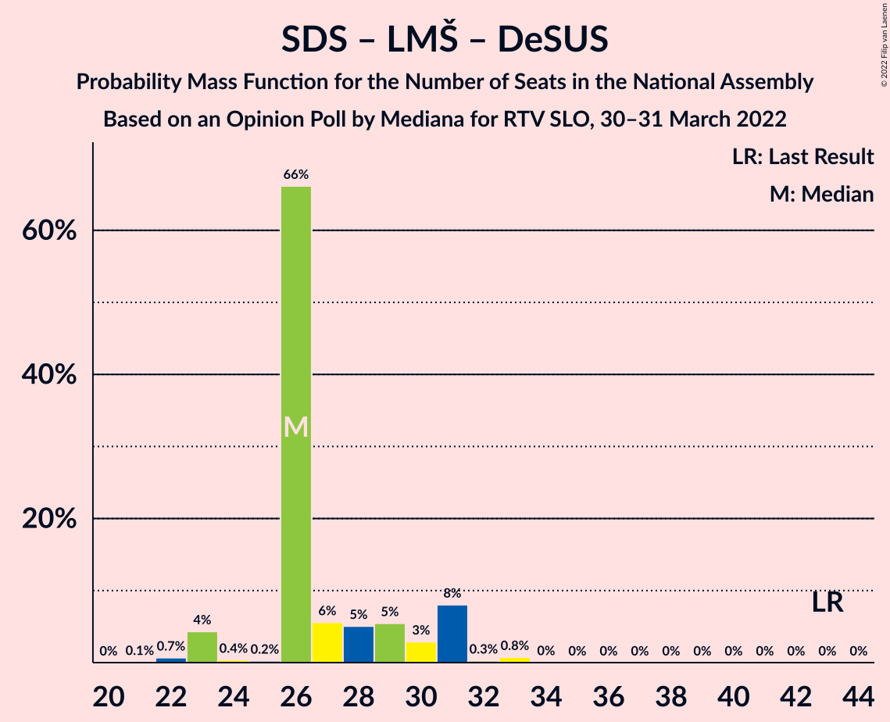

| Number of Seats | Probability | Accumulated | Special Marks |
|:---------------:|:-----------:|:-----------:|:-------------:|
| 21 | 0.1% | 100% |  |
| 22 | 0.7% | 99.9% |  |
| 23 | 4% | 99.2% |  |
| 24 | 0.4% | 95% |  |
| 25 | 0.2% | 95% |  |
| 26 | 66% | 94% | Median |
| 27 | 6% | 28% |  |
| 28 | 5% | 23% |  |
| 29 | 5% | 17% |  |
| 30 | 3% | 12% |  |
| 31 | 8% | 9% |  |
| 32 | 0.3% | 1.1% |  |
| 33 | 0.8% | 0.8% |  |
| 34 | 0% | 0.1% |  |
| 35 | 0% | 0% |  |
| 36 | 0% | 0% |  |
| 37 | 0% | 0% |  |
| 38 | 0% | 0% |  |
| 39 | 0% | 0% |  |
| 40 | 0% | 0% |  |
| 41 | 0% | 0% |  |
| 42 | 0% | 0% |  |
| 43 | 0% | 0% | Last Result |

### Slovenska demokratska stranka – Lista Marjana Šarca

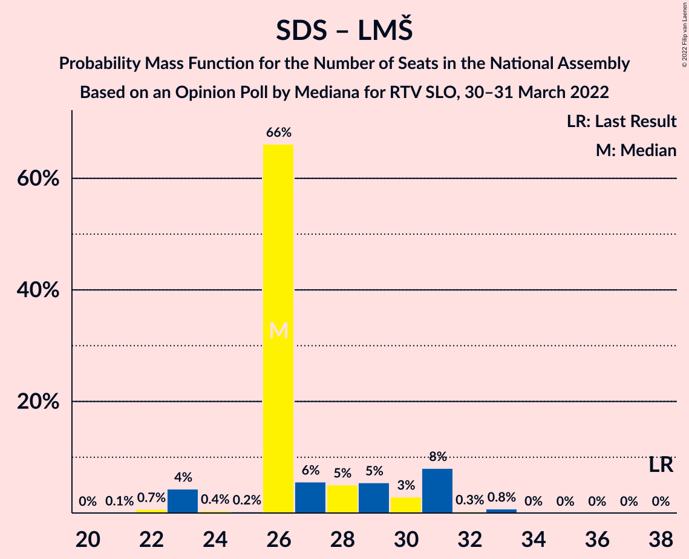

| Number of Seats | Probability | Accumulated | Special Marks |
|:---------------:|:-----------:|:-----------:|:-------------:|
| 21 | 0.1% | 100% |  |
| 22 | 0.7% | 99.9% |  |
| 23 | 4% | 99.2% |  |
| 24 | 0.4% | 95% |  |
| 25 | 0.2% | 95% |  |
| 26 | 66% | 94% | Median |
| 27 | 6% | 28% |  |
| 28 | 5% | 23% |  |
| 29 | 5% | 17% |  |
| 30 | 3% | 12% |  |
| 31 | 8% | 9% |  |
| 32 | 0.3% | 1.1% |  |
| 33 | 0.8% | 0.8% |  |
| 34 | 0% | 0.1% |  |
| 35 | 0% | 0% |  |
| 36 | 0% | 0% |  |
| 37 | 0% | 0% |  |
| 38 | 0% | 0% | Last Result |

### Socialni demokrati – Nova Slovenija–Krščanski demokrati – Lista Marjana Šarca – Demokratična stranka upokojencev Slovenije

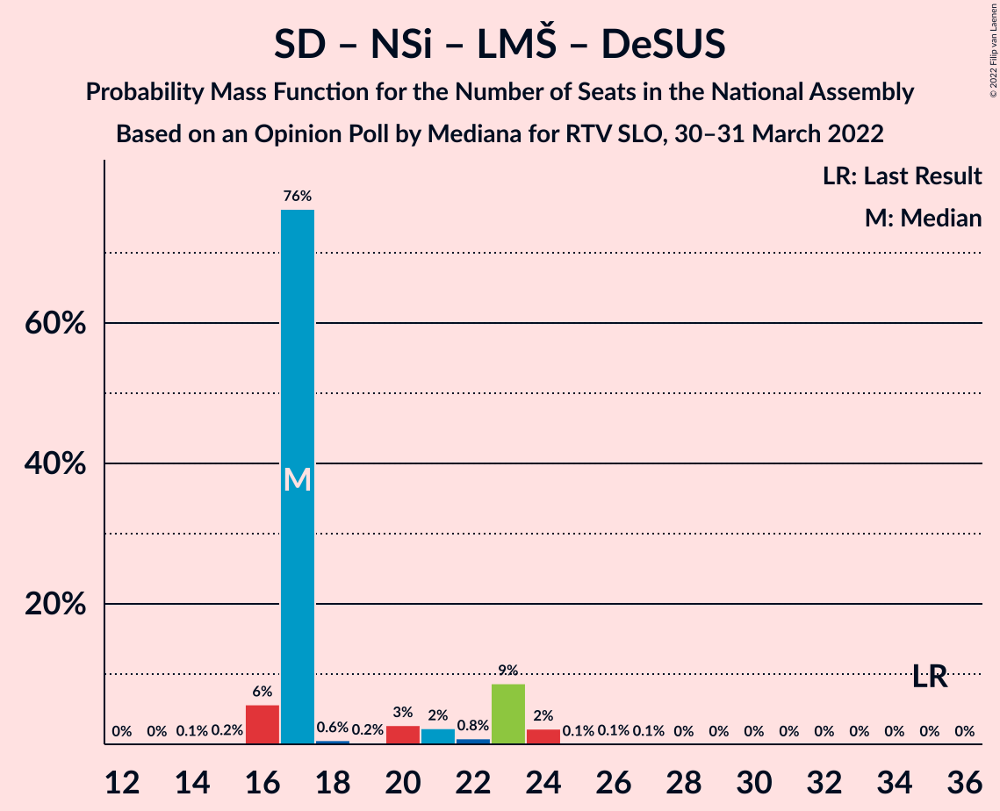

| Number of Seats | Probability | Accumulated | Special Marks |
|:---------------:|:-----------:|:-----------:|:-------------:|
| 14 | 0.1% | 100% |  |
| 15 | 0.2% | 99.9% |  |
| 16 | 6% | 99.8% |  |
| 17 | 76% | 94% | Median |
| 18 | 0.6% | 18% |  |
| 19 | 0.2% | 17% |  |
| 20 | 3% | 17% |  |
| 21 | 2% | 14% |  |
| 22 | 0.8% | 12% |  |
| 23 | 9% | 11% |  |
| 24 | 2% | 2% |  |
| 25 | 0.1% | 0.3% |  |
| 26 | 0.1% | 0.2% |  |
| 27 | 0.1% | 0.1% |  |
| 28 | 0% | 0% |  |
| 29 | 0% | 0% |  |
| 30 | 0% | 0% |  |
| 31 | 0% | 0% |  |
| 32 | 0% | 0% |  |
| 33 | 0% | 0% |  |
| 34 | 0% | 0% |  |
| 35 | 0% | 0% | Last Result |

### Socialni demokrati – Nova Slovenija–Krščanski demokrati – Lista Marjana Šarca

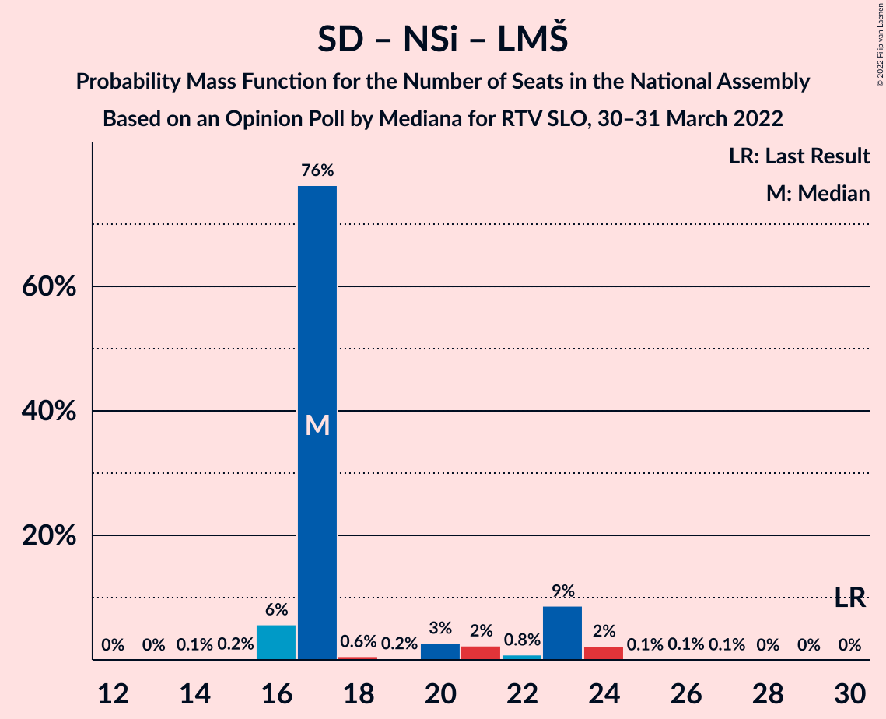

| Number of Seats | Probability | Accumulated | Special Marks |
|:---------------:|:-----------:|:-----------:|:-------------:|
| 14 | 0.1% | 100% |  |
| 15 | 0.2% | 99.9% |  |
| 16 | 6% | 99.8% |  |
| 17 | 76% | 94% | Median |
| 18 | 0.6% | 18% |  |
| 19 | 0.2% | 17% |  |
| 20 | 3% | 17% |  |
| 21 | 2% | 14% |  |
| 22 | 0.8% | 12% |  |
| 23 | 9% | 11% |  |
| 24 | 2% | 2% |  |
| 25 | 0.1% | 0.3% |  |
| 26 | 0.1% | 0.2% |  |
| 27 | 0.1% | 0.1% |  |
| 28 | 0% | 0% |  |
| 29 | 0% | 0% |  |
| 30 | 0% | 0% | Last Result |

### Socialni demokrati – Lista Marjana Šarca – Demokratična stranka upokojencev Slovenije

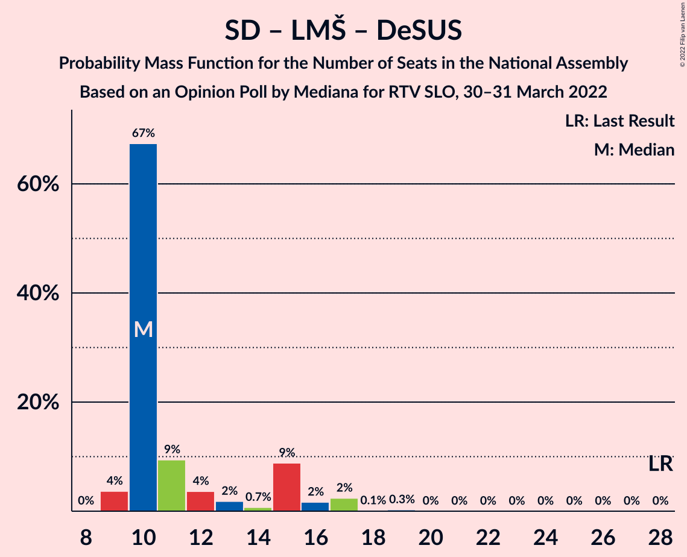

| Number of Seats | Probability | Accumulated | Special Marks |
|:---------------:|:-----------:|:-----------:|:-------------:|
| 9 | 4% | 100% |  |
| 10 | 67% | 96% | Median |
| 11 | 9% | 29% |  |
| 12 | 4% | 19% |  |
| 13 | 2% | 16% |  |
| 14 | 0.7% | 14% |  |
| 15 | 9% | 13% |  |
| 16 | 2% | 4% |  |
| 17 | 2% | 3% |  |
| 18 | 0.1% | 0.4% |  |
| 19 | 0.3% | 0.3% |  |
| 20 | 0% | 0% |  |
| 21 | 0% | 0% |  |
| 22 | 0% | 0% |  |
| 23 | 0% | 0% |  |
| 24 | 0% | 0% |  |
| 25 | 0% | 0% |  |
| 26 | 0% | 0% |  |
| 27 | 0% | 0% |  |
| 28 | 0% | 0% | Last Result |

### Socialni demokrati – Lista Marjana Šarca

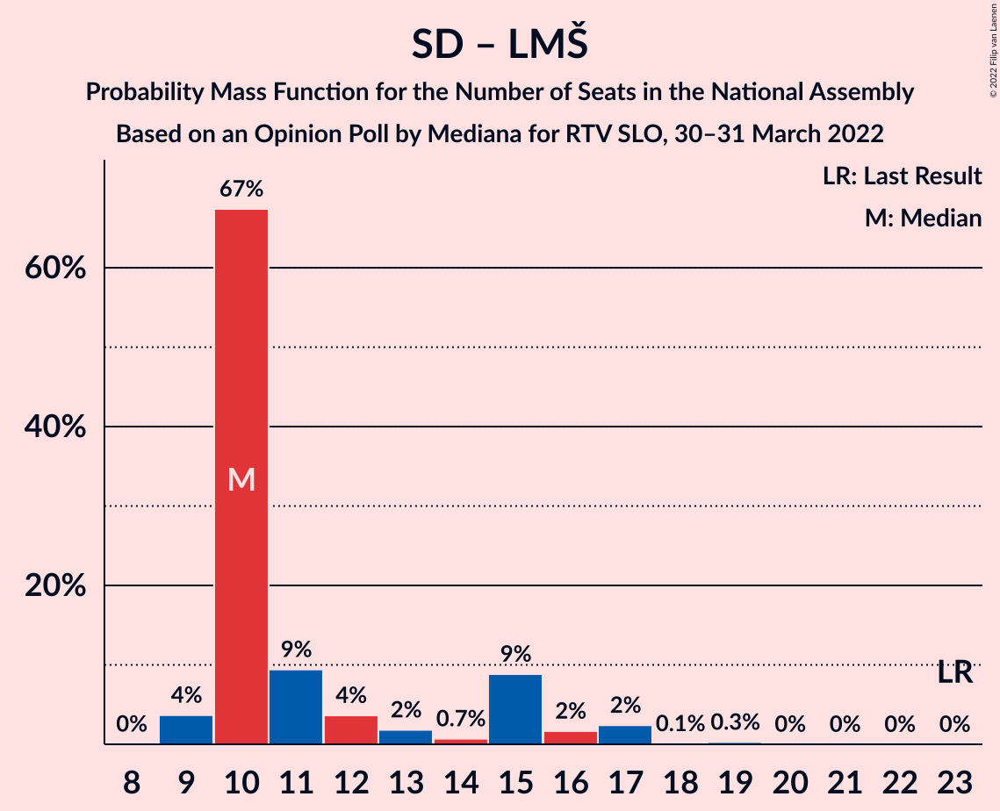

| Number of Seats | Probability | Accumulated | Special Marks |
|:---------------:|:-----------:|:-----------:|:-------------:|
| 9 | 4% | 100% |  |
| 10 | 67% | 96% | Median |
| 11 | 9% | 29% |  |
| 12 | 4% | 19% |  |
| 13 | 2% | 16% |  |
| 14 | 0.7% | 14% |  |
| 15 | 9% | 13% |  |
| 16 | 2% | 4% |  |
| 17 | 2% | 3% |  |
| 18 | 0.1% | 0.4% |  |
| 19 | 0.3% | 0.3% |  |
| 20 | 0% | 0% |  |
| 21 | 0% | 0% |  |
| 22 | 0% | 0% |  |
| 23 | 0% | 0% | Last Result |

## Technical Information

### Opinion Poll

+ **Polling firm:** Mediana
+ **Commissioner(s):** RTV SLO
+ **Fieldwork period:** 30–31 March 2022

### Calculations

+ **Sample size:** 1025
+ **Simulations done:** 1,048,576
+ **Error estimate:** 2.07%

