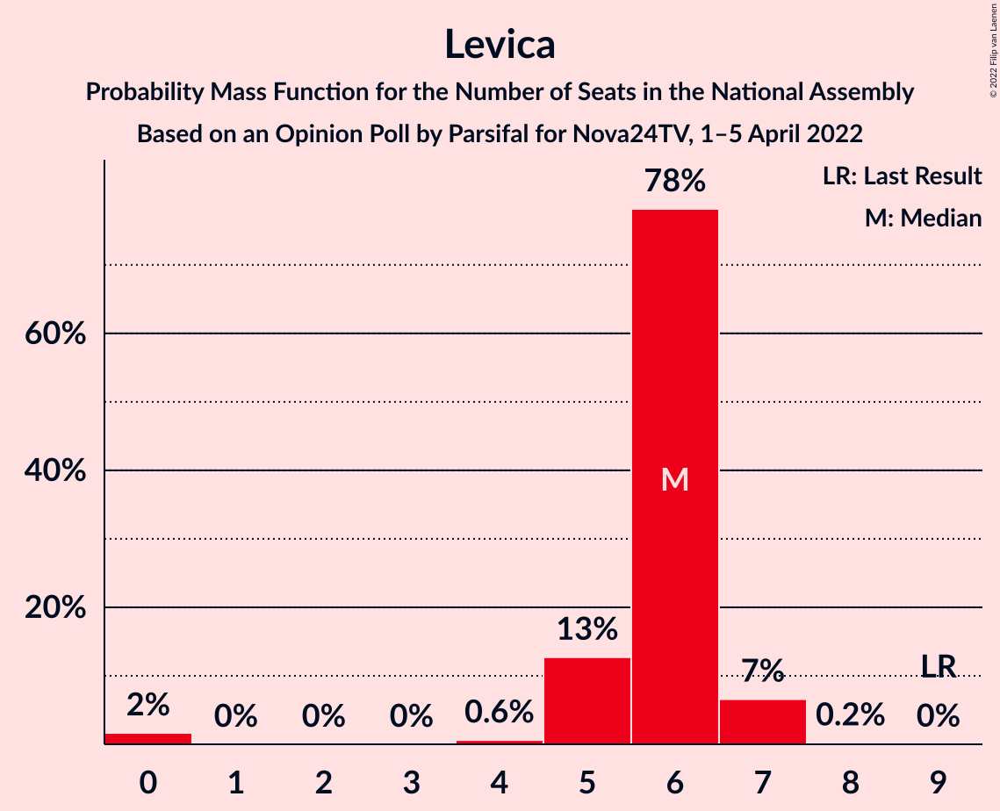
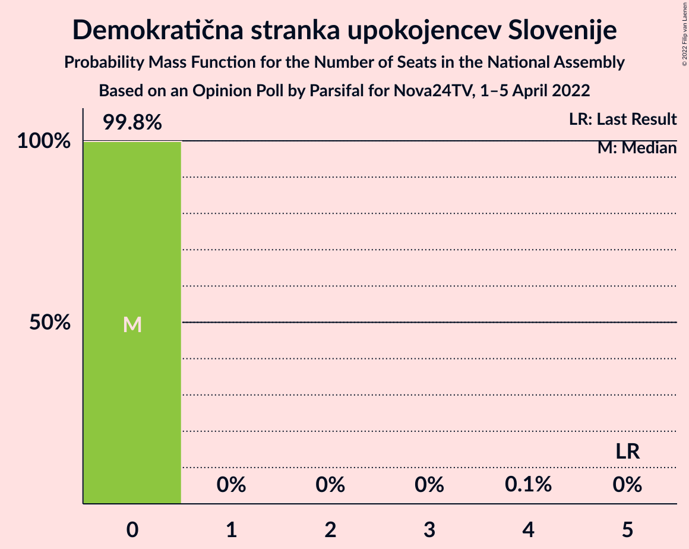

# Opinion Poll by Parsifal for Nova24TV, 1–5 April 2022

<a href="#voting-intentions">Voting Intentions</a> | <a href="#seats">Seats</a> | <a href="#coalitions">Coalitions</a> | <a href="#technical-information">Technical Information</a>

## Voting Intentions

### Confidence Intervals

| Party | Last Result | Poll Result | 80% Confidence Interval | 90% Confidence Interval | 95% Confidence Interval | 99% Confidence Interval |
|:-----:|:-----------:|:-----------:|:-----------------------:|:-----------------------:|:-----------------------:|:-----------------------:|
| Slovenska demokratska stranka | 24.9% | 28.3% | 26.4–30.3% |25.8–30.8% |25.4–31.3% |24.5–32.3% |
| Gibanje Svoboda | 0.0% | 22.7% | 21.0–24.6% |20.5–25.1% |20.1–25.6% |19.2–26.5% |
| Socialni demokrati | 9.9% | 10.7% | 9.4–12.1% |9.1–12.5% |8.8–12.9% |8.2–13.6% |
| Nova Slovenija–Krščanski demokrati | 7.2% | 6.1% | 5.2–7.3% |4.9–7.6% |4.7–7.9% |4.3–8.5% |
| Levica | 9.3% | 5.3% | 4.5–6.4% |4.2–6.8% |4.0–7.0% |3.7–7.6% |
| Povežimo Slovenijo | 0.0% | 5.0% | 4.2–6.1% |3.9–6.4% |3.7–6.6% |3.4–7.2% |
| Naša dežela | 0.0% | 3.9% | 3.1–4.8% |2.9–5.1% |2.8–5.3% |2.5–5.9% |
| Stranka Alenke Bratušek | 5.1% | 3.6% | 2.9–4.6% |2.7–4.8% |2.6–5.1% |2.3–5.6% |
| Lista Marjana Šarca | 12.6% | 2.8% | 2.2–3.7% |2.1–3.9% |1.9–4.2% |1.7–4.6% |
| Demokratična stranka upokojencev Slovenije | 4.9% | 2.4% | 1.8–3.2% |1.7–3.4% |1.6–3.6% |1.3–4.1% |
| Slovenska nacionalna stranka | 4.2% | 2.4% | 1.8–3.2% |1.7–3.4% |1.6–3.6% |1.3–4.1% |
| Resni.ca | 0.0% | 1.9% | 1.4–2.7% |1.3–2.9% |1.2–3.1% |1.0–3.5% |
| Piratska stranka Slovenije | 2.2% | 1.4% | 1.0–2.0% |0.9–2.2% |0.8–2.4% |0.6–2.7% |
| VESNA–Zelena stranka | 0.0% | 1.2% | 0.9–1.9% |0.8–2.1% |0.7–2.2% |0.5–2.6% |

*Note:* The poll result column reflects the actual value used in the calculations. Published results may vary slightly, and in addition be rounded to fewer digits.

## Seats

### Confidence Intervals

| Party | Last Result | Median | 80% Confidence Interval | 90% Confidence Interval | 95% Confidence Interval | 99% Confidence Interval |
|:-----:|:-----------:|:------:|:-----------------------:|:-----------------------:|:-----------------------:|:-----------------------:|
| <a href="#slovenska-demokratska-stranka">Slovenska demokratska stranka</a> | 25 | 30 | 29–33 |29–35 |29–35 |27–36 |
| <a href="#gibanje-svoboda">Gibanje Svoboda</a> | 0 | 24 | 23–25 |23–27 |23–27 |21–30 |
| <a href="#socialni-demokrati">Socialni demokrati</a> | 10 | 12 | 11–13 |9–13 |9–14 |9–14 |
| <a href="#nova-slovenija–krščanski-demokrati">Nova Slovenija–Krščanski demokrati</a> | 7 | 7 | 6–8 |5–8 |5–8 |4–8 |
| <a href="#levica">Levica</a> | 9 | 6 | 5–6 |5–7 |5–7 |0–7 |
| <a href="#povežimo-slovenijo">Povežimo Slovenijo</a> | 0 | 5 | 5–6 |5–6 |4–7 |0–8 |
| <a href="#naša-dežela">Naša dežela</a> | 0 | 0 | 0–4 |0–4 |0–4 |0–5 |
| <a href="#stranka-alenke-bratušek">Stranka Alenke Bratušek</a> | 5 | 0 | 0–4 |0–5 |0–5 |0–5 |
| <a href="#lista-marjana-šarca">Lista Marjana Šarca</a> | 13 | 0 | 0 |0 |0 |0–4 |
| <a href="#demokratična-stranka-upokojencev-slovenije">Demokratična stranka upokojencev Slovenije</a> | 5 | 0 | 0 |0 |0 |0 |
| <a href="#slovenska-nacionalna-stranka">Slovenska nacionalna stranka</a> | 4 | 0 | 0 |0 |0 |0 |
| <a href="#resni.ca">Resni.ca</a> | 0 | 0 | 0 |0 |0 |0 |
| <a href="#piratska-stranka-slovenije">Piratska stranka Slovenije</a> | 0 | 0 | 0 |0 |0 |0 |
| <a href="#vesna–zelena-stranka">VESNA–Zelena stranka</a> | 0 | 0 | 0 |0 |0 |0 |

### Slovenska demokratska stranka

*For a full overview of the results for this party, see the [Slovenska demokratska stranka](party-slovenskademokratskastranka.html) page.*

| Number of Seats | Probability | Accumulated | Special Marks |
|:---------------:|:-----------:|:-----------:|:-------------:|
| 25 | 0% | 100% | Last Result |
| 26 | 0.2% | 100% |  |
| 27 | 0.3% | 99.8% |  |
| 28 | 0.4% | 99.5% |  |
| 29 | 39% | 99.1% |  |
| 30 | 42% | 60% | Median |
| 31 | 3% | 18% |  |
| 32 | 2% | 14% |  |
| 33 | 3% | 12% |  |
| 34 | 0.7% | 9% |  |
| 35 | 6% | 8% |  |
| 36 | 2% | 2% |  |
| 37 | 0% | 0% |  |

### Gibanje Svoboda

*For a full overview of the results for this party, see the [Gibanje Svoboda](party-gibanjesvoboda.html) page.*

| Number of Seats | Probability | Accumulated | Special Marks |
|:---------------:|:-----------:|:-----------:|:-------------:|
| 0 | 0% | 100% | Last Result |
| 1 | 0% | 100% |  |
| 2 | 0% | 100% |  |
| 3 | 0% | 100% |  |
| 4 | 0% | 100% |  |
| 5 | 0% | 100% |  |
| 6 | 0% | 100% |  |
| 7 | 0% | 100% |  |
| 8 | 0% | 100% |  |
| 9 | 0% | 100% |  |
| 10 | 0% | 100% |  |
| 11 | 0% | 100% |  |
| 12 | 0% | 100% |  |
| 13 | 0% | 100% |  |
| 14 | 0% | 100% |  |
| 15 | 0% | 100% |  |
| 16 | 0% | 100% |  |
| 17 | 0% | 100% |  |
| 18 | 0% | 100% |  |
| 19 | 0.1% | 100% |  |
| 20 | 0.1% | 99.9% |  |
| 21 | 1.5% | 99.9% |  |
| 22 | 0.5% | 98% |  |
| 23 | 38% | 98% |  |
| 24 | 17% | 60% | Median |
| 25 | 36% | 43% |  |
| 26 | 2% | 7% |  |
| 27 | 3% | 5% |  |
| 28 | 0.4% | 2% |  |
| 29 | 0.4% | 2% |  |
| 30 | 1.2% | 1.3% |  |
| 31 | 0% | 0% |  |

### Socialni demokrati

*For a full overview of the results for this party, see the [Socialni demokrati](party-socialnidemokrati.html) page.*

| Number of Seats | Probability | Accumulated | Special Marks |
|:---------------:|:-----------:|:-----------:|:-------------:|
| 8 | 0.1% | 100% |  |
| 9 | 8% | 99.9% |  |
| 10 | 2% | 92% | Last Result |
| 11 | 9% | 91% |  |
| 12 | 43% | 81% | Median |
| 13 | 36% | 38% |  |
| 14 | 2% | 3% |  |
| 15 | 0.1% | 0.2% |  |
| 16 | 0% | 0.1% |  |
| 17 | 0.1% | 0.1% |  |
| 18 | 0% | 0% |  |

### Nova Slovenija–Krščanski demokrati

*For a full overview of the results for this party, see the [Nova Slovenija–Krščanski demokrati](party-novaslovenija–krščanskidemokrati.html) page.*

| Number of Seats | Probability | Accumulated | Special Marks |
|:---------------:|:-----------:|:-----------:|:-------------:|
| 4 | 1.0% | 100% |  |
| 5 | 8% | 99.0% |  |
| 6 | 39% | 91% |  |
| 7 | 7% | 53% | Last Result, Median |
| 8 | 45% | 46% |  |
| 9 | 0.2% | 0.2% |  |
| 10 | 0% | 0.1% |  |
| 11 | 0% | 0% |  |

### Levica

*For a full overview of the results for this party, see the [Levica](party-levica.html) page.*

| Number of Seats | Probability | Accumulated | Special Marks |
|:---------------:|:-----------:|:-----------:|:-------------:|
| 0 | 2% | 100% |  |
| 1 | 0% | 98% |  |
| 2 | 0% | 98% |  |
| 3 | 0% | 98% |  |
| 4 | 0.6% | 98% |  |
| 5 | 13% | 98% |  |
| 6 | 78% | 85% | Median |
| 7 | 7% | 7% |  |
| 8 | 0.2% | 0.2% |  |
| 9 | 0% | 0% | Last Result |

### Povežimo Slovenijo

*For a full overview of the results for this party, see the [Povežimo Slovenijo](party-povežimoslovenijo.html) page.*

| Number of Seats | Probability | Accumulated | Special Marks |
|:---------------:|:-----------:|:-----------:|:-------------:|
| 0 | 0.9% | 100% | Last Result |
| 1 | 0% | 99.1% |  |
| 2 | 0% | 99.1% |  |
| 3 | 0% | 99.1% |  |
| 4 | 2% | 99.1% |  |
| 5 | 86% | 97% | Median |
| 6 | 8% | 11% |  |
| 7 | 2% | 3% |  |
| 8 | 2% | 2% |  |
| 9 | 0% | 0% |  |

### Naša dežela

*For a full overview of the results for this party, see the [Naša dežela](party-našadežela.html) page.*

| Number of Seats | Probability | Accumulated | Special Marks |
|:---------------:|:-----------:|:-----------:|:-------------:|
| 0 | 53% | 100% | Last Result, Median |
| 1 | 0% | 47% |  |
| 2 | 0% | 47% |  |
| 3 | 0% | 47% |  |
| 4 | 45% | 47% |  |
| 5 | 2% | 2% |  |
| 6 | 0.2% | 0.2% |  |
| 7 | 0% | 0% |  |

### Stranka Alenke Bratušek

*For a full overview of the results for this party, see the [Stranka Alenke Bratušek](party-strankaalenkebratušek.html) page.*

| Number of Seats | Probability | Accumulated | Special Marks |
|:---------------:|:-----------:|:-----------:|:-------------:|
| 0 | 57% | 100% | Median |
| 1 | 0% | 43% |  |
| 2 | 0% | 43% |  |
| 3 | 0% | 43% |  |
| 4 | 36% | 43% |  |
| 5 | 7% | 7% | Last Result |
| 6 | 0.1% | 0.1% |  |
| 7 | 0% | 0% |  |

### Lista Marjana Šarca

*For a full overview of the results for this party, see the [Lista Marjana Šarca](party-listamarjanašarca.html) page.*

| Number of Seats | Probability | Accumulated | Special Marks |
|:---------------:|:-----------:|:-----------:|:-------------:|
| 0 | 99.2% | 100% | Median |
| 1 | 0% | 0.8% |  |
| 2 | 0% | 0.8% |  |
| 3 | 0% | 0.8% |  |
| 4 | 0.5% | 0.8% |  |
| 5 | 0.3% | 0.3% |  |
| 6 | 0% | 0% |  |
| 7 | 0% | 0% |  |
| 8 | 0% | 0% |  |
| 9 | 0% | 0% |  |
| 10 | 0% | 0% |  |
| 11 | 0% | 0% |  |
| 12 | 0% | 0% |  |
| 13 | 0% | 0% | Last Result |

### Demokratična stranka upokojencev Slovenije

*For a full overview of the results for this party, see the [Demokratična stranka upokojencev Slovenije](party-demokratičnastrankaupokojencevslovenije.html) page.*

| Number of Seats | Probability | Accumulated | Special Marks |
|:---------------:|:-----------:|:-----------:|:-------------:|
| 0 | 99.8% | 100% | Median |
| 1 | 0% | 0.2% |  |
| 2 | 0% | 0.2% |  |
| 3 | 0% | 0.2% |  |
| 4 | 0.1% | 0.2% |  |
| 5 | 0% | 0% | Last Result |

### Slovenska nacionalna stranka

*For a full overview of the results for this party, see the [Slovenska nacionalna stranka](party-slovenskanacionalnastranka.html) page.*

| Number of Seats | Probability | Accumulated | Special Marks |
|:---------------:|:-----------:|:-----------:|:-------------:|
| 0 | 100% | 100% | Median |
| 1 | 0% | 0% |  |
| 2 | 0% | 0% |  |
| 3 | 0% | 0% |  |
| 4 | 0% | 0% | Last Result |

### Resni.ca

*For a full overview of the results for this party, see the [Resni.ca](party-resnica.html) page.*

| Number of Seats | Probability | Accumulated | Special Marks |
|:---------------:|:-----------:|:-----------:|:-------------:|
| 0 | 100% | 100% | Last Result, Median |

### Piratska stranka Slovenije

*For a full overview of the results for this party, see the [Piratska stranka Slovenije](party-piratskastrankaslovenije.html) page.*

| Number of Seats | Probability | Accumulated | Special Marks |
|:---------------:|:-----------:|:-----------:|:-------------:|
| 0 | 100% | 100% | Last Result, Median |

### VESNA–Zelena stranka

*For a full overview of the results for this party, see the [VESNA–Zelena stranka](party-vesna–zelenastranka.html) page.*

| Number of Seats | Probability | Accumulated | Special Marks |
|:---------------:|:-----------:|:-----------:|:-------------:|
| 0 | 100% | 100% | Last Result, Median |

## Coalitions

### Confidence Intervals

| Coalition | Last Result | Median | Majority? | 80% Confidence Interval | 90% Confidence Interval | 95% Confidence Interval | 99% Confidence Interval |
|:---------:|:-----------:|:------:|:---------:|:-----------------------:|:-----------------------:|:-----------------------:|:-----------------------:|
| Slovenska demokratska stranka – Lista Marjana Šarca – Demokratična stranka upokojencev Slovenije | 43 | 30 | 0% | 29–33 | 29–35 | 29–36 | 28–36 |
| Slovenska demokratska stranka – Lista Marjana Šarca | 38 | 30 | 0% | 29–33 | 29–35 | 29–36 | 28–36 |
| Socialni demokrati – Nova Slovenija–Krščanski demokrati – Lista Marjana Šarca – Demokratična stranka upokojencev Slovenije | 35 | 19 | 0% | 17–20 | 15–20 | 14–21 | 14–22 |
| Socialni demokrati – Nova Slovenija–Krščanski demokrati – Lista Marjana Šarca | 30 | 19 | 0% | 17–20 | 15–20 | 14–21 | 14–22 |
| Socialni demokrati – Lista Marjana Šarca – Demokratična stranka upokojencev Slovenije | 28 | 12 | 0% | 11–13 | 9–13 | 9–14 | 9–16 |
| Socialni demokrati – Lista Marjana Šarca | 23 | 12 | 0% | 11–13 | 9–13 | 9–14 | 9–16 |

### Slovenska demokratska stranka – Lista Marjana Šarca – Demokratična stranka upokojencev Slovenije

| Number of Seats | Probability | Accumulated | Special Marks |
|:---------------:|:-----------:|:-----------:|:-------------:|
| 26 | 0% | 100% |  |
| 27 | 0.2% | 99.9% |  |
| 28 | 0.3% | 99.7% |  |
| 29 | 39% | 99.4% |  |
| 30 | 42% | 60% | Median |
| 31 | 3% | 18% |  |
| 32 | 2% | 15% |  |
| 33 | 3% | 13% |  |
| 34 | 0.7% | 10% |  |
| 35 | 6% | 9% |  |
| 36 | 3% | 3% |  |
| 37 | 0.1% | 0.1% |  |
| 38 | 0% | 0% |  |
| 39 | 0% | 0% |  |
| 40 | 0% | 0% |  |
| 41 | 0% | 0% |  |
| 42 | 0% | 0% |  |
| 43 | 0% | 0% | Last Result |

### Slovenska demokratska stranka – Lista Marjana Šarca

| Number of Seats | Probability | Accumulated | Special Marks |
|:---------------:|:-----------:|:-----------:|:-------------:|
| 26 | 0.1% | 100% |  |
| 27 | 0.2% | 99.9% |  |
| 28 | 0.3% | 99.7% |  |
| 29 | 39% | 99.4% |  |
| 30 | 42% | 60% | Median |
| 31 | 3% | 18% |  |
| 32 | 2% | 15% |  |
| 33 | 3% | 13% |  |
| 34 | 0.7% | 10% |  |
| 35 | 6% | 9% |  |
| 36 | 3% | 3% |  |
| 37 | 0.1% | 0.1% |  |
| 38 | 0% | 0% | Last Result |

### Socialni demokrati – Nova Slovenija–Krščanski demokrati – Lista Marjana Šarca – Demokratična stranka upokojencev Slovenije

| Number of Seats | Probability | Accumulated | Special Marks |
|:---------------:|:-----------:|:-----------:|:-------------:|
| 14 | 5% | 100% |  |
| 15 | 0.2% | 95% |  |
| 16 | 5% | 95% |  |
| 17 | 5% | 90% |  |
| 18 | 0.8% | 86% |  |
| 19 | 42% | 85% | Median |
| 20 | 39% | 43% |  |
| 21 | 3% | 4% |  |
| 22 | 0.5% | 0.9% |  |
| 23 | 0.2% | 0.4% |  |
| 24 | 0.2% | 0.2% |  |
| 25 | 0% | 0% |  |
| 26 | 0% | 0% |  |
| 27 | 0% | 0% |  |
| 28 | 0% | 0% |  |
| 29 | 0% | 0% |  |
| 30 | 0% | 0% |  |
| 31 | 0% | 0% |  |
| 32 | 0% | 0% |  |
| 33 | 0% | 0% |  |
| 34 | 0% | 0% |  |
| 35 | 0% | 0% | Last Result |

### Socialni demokrati – Nova Slovenija–Krščanski demokrati – Lista Marjana Šarca

| Number of Seats | Probability | Accumulated | Special Marks |
|:---------------:|:-----------:|:-----------:|:-------------:|
| 14 | 5% | 100% |  |
| 15 | 0.2% | 95% |  |
| 16 | 5% | 95% |  |
| 17 | 5% | 90% |  |
| 18 | 0.8% | 86% |  |
| 19 | 42% | 85% | Median |
| 20 | 39% | 43% |  |
| 21 | 3% | 4% |  |
| 22 | 0.5% | 0.7% |  |
| 23 | 0.1% | 0.2% |  |
| 24 | 0.2% | 0.2% |  |
| 25 | 0% | 0% |  |
| 26 | 0% | 0% |  |
| 27 | 0% | 0% |  |
| 28 | 0% | 0% |  |
| 29 | 0% | 0% |  |
| 30 | 0% | 0% | Last Result |

### Socialni demokrati – Lista Marjana Šarca – Demokratična stranka upokojencev Slovenije

| Number of Seats | Probability | Accumulated | Special Marks |
|:---------------:|:-----------:|:-----------:|:-------------:|
| 9 | 8% | 100% |  |
| 10 | 2% | 92% |  |
| 11 | 8% | 91% |  |
| 12 | 43% | 82% | Median |
| 13 | 36% | 39% |  |
| 14 | 2% | 3% |  |
| 15 | 0.4% | 1.1% |  |
| 16 | 0.5% | 0.7% |  |
| 17 | 0.2% | 0.2% |  |
| 18 | 0% | 0% |  |
| 19 | 0% | 0% |  |
| 20 | 0% | 0% |  |
| 21 | 0% | 0% |  |
| 22 | 0% | 0% |  |
| 23 | 0% | 0% |  |
| 24 | 0% | 0% |  |
| 25 | 0% | 0% |  |
| 26 | 0% | 0% |  |
| 27 | 0% | 0% |  |
| 28 | 0% | 0% | Last Result |

### Socialni demokrati – Lista Marjana Šarca

| Number of Seats | Probability | Accumulated | Special Marks |
|:---------------:|:-----------:|:-----------:|:-------------:|
| 9 | 8% | 100% |  |
| 10 | 2% | 92% |  |
| 11 | 8% | 91% |  |
| 12 | 43% | 82% | Median |
| 13 | 36% | 39% |  |
| 14 | 2% | 3% |  |
| 15 | 0.4% | 1.0% |  |
| 16 | 0.4% | 0.5% |  |
| 17 | 0.1% | 0.2% |  |
| 18 | 0% | 0% |  |
| 19 | 0% | 0% |  |
| 20 | 0% | 0% |  |
| 21 | 0% | 0% |  |
| 22 | 0% | 0% |  |
| 23 | 0% | 0% | Last Result |

## Technical Information

### Opinion Poll

+ **Polling firm:** Parsifal
+ **Commissioner(s):** Nova24TV
+ **Fieldwork period:** 1–5 April 2022

### Calculations

+ **Sample size:** 881
+ **Simulations done:** 1,048,576
+ **Error estimate:** 2.09%

