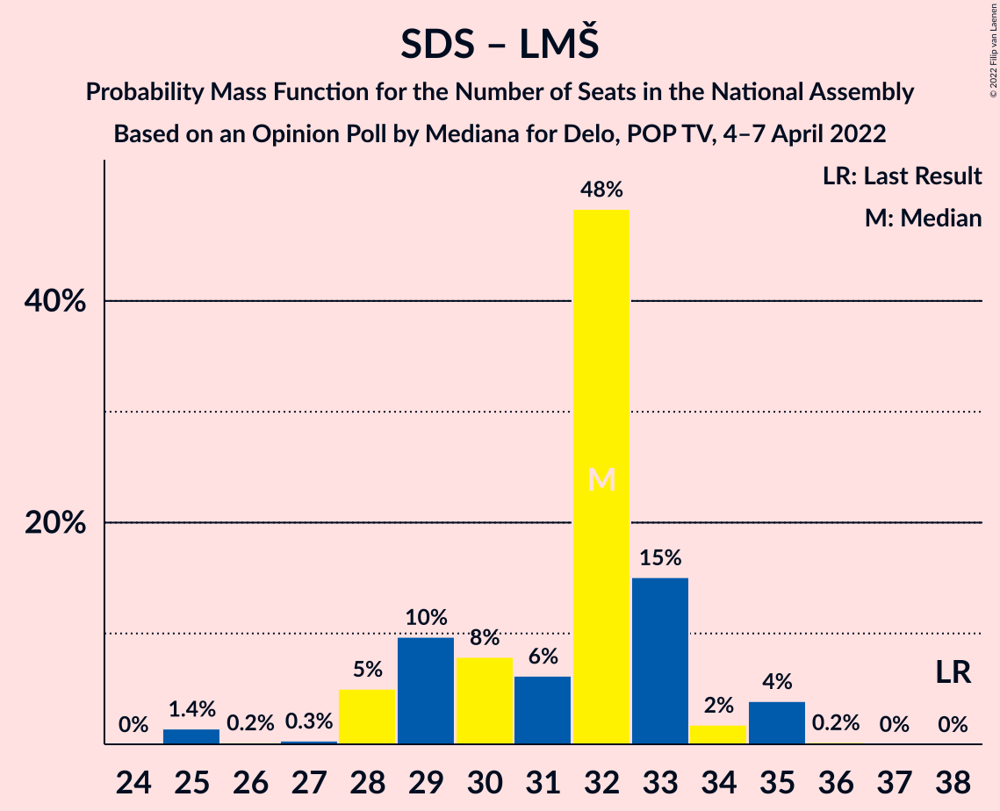
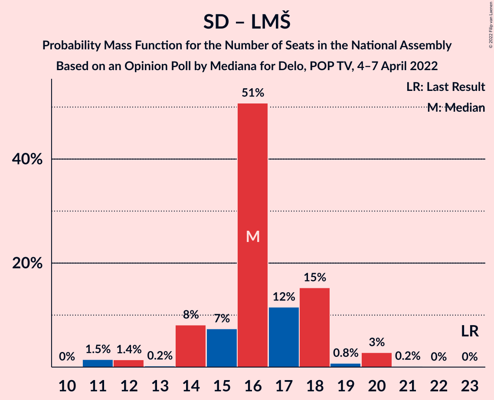

# Opinion Poll by Mediana for Delo, POP TV, 4–7 April 2022

<a href="#voting-intentions">Voting Intentions</a> | <a href="#seats">Seats</a> | <a href="#coalitions">Coalitions</a> | <a href="#technical-information">Technical Information</a>

## Voting Intentions

### Confidence Intervals

| Party | Last Result | Poll Result | 80% Confidence Interval | 90% Confidence Interval | 95% Confidence Interval | 99% Confidence Interval |
|:-----:|:-----------:|:-----------:|:-----------------------:|:-----------------------:|:-----------------------:|:-----------------------:|
| Gibanje Svoboda | 0.0% | 24.5% | 22.9–26.3% |22.4–26.8% |22.0–27.3% |21.2–28.1% |
| Slovenska demokratska stranka | 24.9% | 23.0% | 21.4–24.7% |20.9–25.2% |20.5–25.7% |19.8–26.5% |
| Socialni demokrati | 9.9% | 9.8% | 8.7–11.1% |8.4–11.5% |8.2–11.8% |7.7–12.5% |
| Levica | 9.3% | 7.2% | 6.3–8.4% |6.0–8.7% |5.8–9.0% |5.3–9.5% |
| Nova Slovenija–Krščanski demokrati | 7.2% | 6.8% | 5.9–7.9% |5.6–8.2% |5.4–8.5% |5.0–9.1% |
| Lista Marjana Šarca | 12.6% | 5.7% | 4.9–6.8% |4.7–7.1% |4.5–7.3% |4.1–7.9% |
| Stranka Alenke Bratušek | 5.1% | 3.6% | 3.0–4.5% |2.8–4.7% |2.6–4.9% |2.3–5.4% |
| Povežimo Slovenijo | 0.0% | 3.5% | 2.9–4.4% |2.7–4.6% |2.5–4.8% |2.3–5.3% |
| Piratska stranka Slovenije | 2.2% | 3.0% | 2.4–3.8% |2.3–4.1% |2.1–4.3% |1.9–4.7% |
| Naša dežela | 0.0% | 3.0% | 2.4–3.8% |2.3–4.1% |2.1–4.3% |1.9–4.7% |
| Slovenska nacionalna stranka | 4.2% | 2.8% | 2.3–3.6% |2.1–3.8% |2.0–4.0% |1.7–4.4% |
| Resni.ca | 0.0% | 2.1% | 1.7–2.9% |1.5–3.0% |1.4–3.2% |1.2–3.6% |
| Demokratična stranka upokojencev Slovenije | 4.9% | 1.1% | 0.8–1.6% |0.7–1.8% |0.6–1.9% |0.5–2.2% |
| VESNA–Zelena stranka | 0.0% | 1.1% | 0.8–1.6% |0.7–1.8% |0.6–1.9% |0.5–2.2% |

*Note:* The poll result column reflects the actual value used in the calculations. Published results may vary slightly, and in addition be rounded to fewer digits.

## Seats

### Confidence Intervals

| Party | Last Result | Median | 80% Confidence Interval | 90% Confidence Interval | 95% Confidence Interval | 99% Confidence Interval |
|:-----:|:-----------:|:------:|:-----------------------:|:-----------------------:|:-----------------------:|:-----------------------:|
| <a href="#gibanje-svoboda">Gibanje Svoboda</a> | 0 | 26 | 24–30 |24–30 |24–32 |23–32 |
| <a href="#slovenska-demokratska-stranka">Slovenska demokratska stranka</a> | 25 | 26 | 23–28 |23–28 |22–28 |22–29 |
| <a href="#socialni-demokrati">Socialni demokrati</a> | 10 | 10 | 9–12 |9–12 |9–13 |8–13 |
| <a href="#levica">Levica</a> | 9 | 7 | 7–9 |6–9 |5–10 |5–11 |
| <a href="#nova-slovenija–krščanski-demokrati">Nova Slovenija–Krščanski demokrati</a> | 7 | 7 | 6–9 |6–9 |6–9 |5–9 |
| <a href="#lista-marjana-šarca">Lista Marjana Šarca</a> | 13 | 6 | 5–7 |5–7 |0–7 |0–8 |
| <a href="#stranka-alenke-bratušek">Stranka Alenke Bratušek</a> | 5 | 4 | 0–5 |0–5 |0–5 |0–5 |
| <a href="#povežimo-slovenijo">Povežimo Slovenijo</a> | 0 | 4 | 0–4 |0–4 |0–5 |0–6 |
| <a href="#piratska-stranka-slovenije">Piratska stranka Slovenije</a> | 0 | 0 | 0 |0–4 |0–4 |0–4 |
| <a href="#naša-dežela">Naša dežela</a> | 0 | 0 | 0 |0 |0–4 |0–5 |
| <a href="#slovenska-nacionalna-stranka">Slovenska nacionalna stranka</a> | 4 | 0 | 0 |0 |0 |0–4 |
| <a href="#resni.ca">Resni.ca</a> | 0 | 0 | 0 |0 |0 |0 |
| <a href="#demokratična-stranka-upokojencev-slovenije">Demokratična stranka upokojencev Slovenije</a> | 5 | 0 | 0 |0 |0 |0 |
| <a href="#vesna–zelena-stranka">VESNA–Zelena stranka</a> | 0 | 0 | 0 |0 |0 |0 |

### Gibanje Svoboda

*For a full overview of the results for this party, see the [Gibanje Svoboda](party-gibanjesvoboda.html) page.*

| Number of Seats | Probability | Accumulated | Special Marks |
|:---------------:|:-----------:|:-----------:|:-------------:|
| 0 | 0% | 100% | Last Result |
| 1 | 0% | 100% |  |
| 2 | 0% | 100% |  |
| 3 | 0% | 100% |  |
| 4 | 0% | 100% |  |
| 5 | 0% | 100% |  |
| 6 | 0% | 100% |  |
| 7 | 0% | 100% |  |
| 8 | 0% | 100% |  |
| 9 | 0% | 100% |  |
| 10 | 0% | 100% |  |
| 11 | 0% | 100% |  |
| 12 | 0% | 100% |  |
| 13 | 0% | 100% |  |
| 14 | 0% | 100% |  |
| 15 | 0% | 100% |  |
| 16 | 0% | 100% |  |
| 17 | 0% | 100% |  |
| 18 | 0% | 100% |  |
| 19 | 0% | 100% |  |
| 20 | 0% | 100% |  |
| 21 | 0% | 100% |  |
| 22 | 0.3% | 100% |  |
| 23 | 0.8% | 99.7% |  |
| 24 | 43% | 98.9% |  |
| 25 | 3% | 56% |  |
| 26 | 8% | 53% | Median |
| 27 | 11% | 45% |  |
| 28 | 11% | 34% |  |
| 29 | 10% | 22% |  |
| 30 | 9% | 12% |  |
| 31 | 0.6% | 3% |  |
| 32 | 3% | 3% |  |
| 33 | 0% | 0% |  |

### Slovenska demokratska stranka

*For a full overview of the results for this party, see the [Slovenska demokratska stranka](party-slovenskademokratskastranka.html) page.*

| Number of Seats | Probability | Accumulated | Special Marks |
|:---------------:|:-----------:|:-----------:|:-------------:|
| 21 | 0.2% | 100% |  |
| 22 | 4% | 99.7% |  |
| 23 | 6% | 96% |  |
| 24 | 14% | 90% |  |
| 25 | 6% | 76% | Last Result |
| 26 | 49% | 70% | Median |
| 27 | 4% | 21% |  |
| 28 | 17% | 18% |  |
| 29 | 0.8% | 0.9% |  |
| 30 | 0.1% | 0.1% |  |
| 31 | 0% | 0.1% |  |
| 32 | 0% | 0% |  |

### Socialni demokrati

*For a full overview of the results for this party, see the [Socialni demokrati](party-socialnidemokrati.html) page.*

| Number of Seats | Probability | Accumulated | Special Marks |
|:---------------:|:-----------:|:-----------:|:-------------:|
| 8 | 1.2% | 100% |  |
| 9 | 15% | 98.7% |  |
| 10 | 45% | 84% | Last Result, Median |
| 11 | 22% | 39% |  |
| 12 | 14% | 17% |  |
| 13 | 3% | 4% |  |
| 14 | 0.4% | 0.4% |  |
| 15 | 0% | 0% |  |

### Levica

*For a full overview of the results for this party, see the [Levica](party-levica.html) page.*

| Number of Seats | Probability | Accumulated | Special Marks |
|:---------------:|:-----------:|:-----------:|:-------------:|
| 5 | 4% | 100% |  |
| 6 | 3% | 96% |  |
| 7 | 57% | 93% | Median |
| 8 | 10% | 36% |  |
| 9 | 22% | 27% | Last Result |
| 10 | 3% | 5% |  |
| 11 | 1.4% | 1.4% |  |
| 12 | 0% | 0% |  |

### Nova Slovenija–Krščanski demokrati

*For a full overview of the results for this party, see the [Nova Slovenija–Krščanski demokrati](party-novaslovenija–krščanskidemokrati.html) page.*

| Number of Seats | Probability | Accumulated | Special Marks |
|:---------------:|:-----------:|:-----------:|:-------------:|
| 5 | 1.1% | 100% |  |
| 6 | 49% | 98.8% |  |
| 7 | 19% | 50% | Last Result, Median |
| 8 | 18% | 31% |  |
| 9 | 12% | 13% |  |
| 10 | 0.2% | 0.3% |  |
| 11 | 0.1% | 0.1% |  |
| 12 | 0% | 0% |  |

### Lista Marjana Šarca

*For a full overview of the results for this party, see the [Lista Marjana Šarca](party-listamarjanašarca.html) page.*

| Number of Seats | Probability | Accumulated | Special Marks |
|:---------------:|:-----------:|:-----------:|:-------------:|
| 0 | 3% | 100% |  |
| 1 | 0% | 97% |  |
| 2 | 0% | 97% |  |
| 3 | 0% | 97% |  |
| 4 | 0.6% | 97% |  |
| 5 | 23% | 96% |  |
| 6 | 58% | 73% | Median |
| 7 | 14% | 16% |  |
| 8 | 2% | 2% |  |
| 9 | 0.1% | 0.1% |  |
| 10 | 0% | 0% |  |
| 11 | 0% | 0% |  |
| 12 | 0% | 0% |  |
| 13 | 0% | 0% | Last Result |

### Stranka Alenke Bratušek

*For a full overview of the results for this party, see the [Stranka Alenke Bratušek](party-strankaalenkebratušek.html) page.*

| Number of Seats | Probability | Accumulated | Special Marks |
|:---------------:|:-----------:|:-----------:|:-------------:|
| 0 | 49% | 100% |  |
| 1 | 0% | 51% |  |
| 2 | 0% | 51% |  |
| 3 | 0% | 51% |  |
| 4 | 9% | 51% | Median |
| 5 | 42% | 42% | Last Result |
| 6 | 0.3% | 0.3% |  |
| 7 | 0% | 0% |  |

### Povežimo Slovenijo

*For a full overview of the results for this party, see the [Povežimo Slovenijo](party-povežimoslovenijo.html) page.*

| Number of Seats | Probability | Accumulated | Special Marks |
|:---------------:|:-----------:|:-----------:|:-------------:|
| 0 | 45% | 100% | Last Result |
| 1 | 0% | 55% |  |
| 2 | 0% | 55% |  |
| 3 | 0% | 55% |  |
| 4 | 51% | 55% | Median |
| 5 | 2% | 5% |  |
| 6 | 2% | 2% |  |
| 7 | 0% | 0% |  |

### Piratska stranka Slovenije

*For a full overview of the results for this party, see the [Piratska stranka Slovenije](party-piratskastrankaslovenije.html) page.*

| Number of Seats | Probability | Accumulated | Special Marks |
|:---------------:|:-----------:|:-----------:|:-------------:|
| 0 | 93% | 100% | Last Result, Median |
| 1 | 0% | 7% |  |
| 2 | 0% | 7% |  |
| 3 | 0% | 7% |  |
| 4 | 7% | 7% |  |
| 5 | 0.1% | 0.1% |  |
| 6 | 0% | 0% |  |

### Naša dežela

*For a full overview of the results for this party, see the [Naša dežela](party-našadežela.html) page.*

| Number of Seats | Probability | Accumulated | Special Marks |
|:---------------:|:-----------:|:-----------:|:-------------:|
| 0 | 96% | 100% | Last Result, Median |
| 1 | 0% | 4% |  |
| 2 | 0% | 4% |  |
| 3 | 0% | 4% |  |
| 4 | 3% | 4% |  |
| 5 | 0.7% | 0.8% |  |
| 6 | 0% | 0% |  |

### Slovenska nacionalna stranka

*For a full overview of the results for this party, see the [Slovenska nacionalna stranka](party-slovenskanacionalnastranka.html) page.*

| Number of Seats | Probability | Accumulated | Special Marks |
|:---------------:|:-----------:|:-----------:|:-------------:|
| 0 | 99.1% | 100% | Median |
| 1 | 0% | 0.9% |  |
| 2 | 0% | 0.9% |  |
| 3 | 0% | 0.9% |  |
| 4 | 0.5% | 0.9% | Last Result |
| 5 | 0.3% | 0.3% |  |
| 6 | 0% | 0% |  |

### Resni.ca

*For a full overview of the results for this party, see the [Resni.ca](party-resnica.html) page.*

| Number of Seats | Probability | Accumulated | Special Marks |
|:---------------:|:-----------:|:-----------:|:-------------:|
| 0 | 99.9% | 100% | Last Result, Median |
| 1 | 0% | 0.1% |  |
| 2 | 0% | 0.1% |  |
| 3 | 0% | 0.1% |  |
| 4 | 0.1% | 0.1% |  |
| 5 | 0% | 0% |  |

### Demokratična stranka upokojencev Slovenije

*For a full overview of the results for this party, see the [Demokratična stranka upokojencev Slovenije](party-demokratičnastrankaupokojencevslovenije.html) page.*

| Number of Seats | Probability | Accumulated | Special Marks |
|:---------------:|:-----------:|:-----------:|:-------------:|
| 0 | 100% | 100% | Median |
| 1 | 0% | 0% |  |
| 2 | 0% | 0% |  |
| 3 | 0% | 0% |  |
| 4 | 0% | 0% |  |
| 5 | 0% | 0% | Last Result |

### VESNA–Zelena stranka

*For a full overview of the results for this party, see the [VESNA–Zelena stranka](party-vesna–zelenastranka.html) page.*

| Number of Seats | Probability | Accumulated | Special Marks |
|:---------------:|:-----------:|:-----------:|:-------------:|
| 0 | 100% | 100% | Last Result, Median |

## Coalitions

### Confidence Intervals

| Coalition | Last Result | Median | Majority? | 80% Confidence Interval | 90% Confidence Interval | 95% Confidence Interval | 99% Confidence Interval |
|:---------:|:-----------:|:------:|:---------:|:-----------------------:|:-----------------------:|:-----------------------:|:-----------------------:|
| Slovenska demokratska stranka – Lista Marjana Šarca – Demokratična stranka upokojencev Slovenije | 43 | 32 | 0% | 29–33 | 28–34 | 28–35 | 25–35 |
| Slovenska demokratska stranka – Lista Marjana Šarca | 38 | 32 | 0% | 29–33 | 28–34 | 28–35 | 25–35 |
| Socialni demokrati – Nova Slovenija–Krščanski demokrati – Lista Marjana Šarca – Demokratična stranka upokojencev Slovenije | 35 | 22 | 0% | 21–26 | 21–26 | 20–27 | 18–28 |
| Socialni demokrati – Nova Slovenija–Krščanski demokrati – Lista Marjana Šarca | 30 | 22 | 0% | 21–26 | 21–26 | 20–27 | 18–28 |
| Socialni demokrati – Lista Marjana Šarca – Demokratična stranka upokojencev Slovenije | 28 | 16 | 0% | 14–18 | 14–18 | 12–20 | 11–20 |
| Socialni demokrati – Lista Marjana Šarca | 23 | 16 | 0% | 14–18 | 14–18 | 12–20 | 11–20 |

### Slovenska demokratska stranka – Lista Marjana Šarca – Demokratična stranka upokojencev Slovenije

| Number of Seats | Probability | Accumulated | Special Marks |
|:---------------:|:-----------:|:-----------:|:-------------:|
| 25 | 1.4% | 100% |  |
| 26 | 0.2% | 98.6% |  |
| 27 | 0.3% | 98% |  |
| 28 | 5% | 98% |  |
| 29 | 10% | 93% |  |
| 30 | 8% | 83% |  |
| 31 | 6% | 75% |  |
| 32 | 48% | 69% | Median |
| 33 | 15% | 21% |  |
| 34 | 2% | 6% |  |
| 35 | 4% | 4% |  |
| 36 | 0.2% | 0.3% |  |
| 37 | 0% | 0.1% |  |
| 38 | 0% | 0% |  |
| 39 | 0% | 0% |  |
| 40 | 0% | 0% |  |
| 41 | 0% | 0% |  |
| 42 | 0% | 0% |  |
| 43 | 0% | 0% | Last Result |

### Slovenska demokratska stranka – Lista Marjana Šarca

| Number of Seats | Probability | Accumulated | Special Marks |
|:---------------:|:-----------:|:-----------:|:-------------:|
| 25 | 1.4% | 100% |  |
| 26 | 0.2% | 98.6% |  |
| 27 | 0.3% | 98% |  |
| 28 | 5% | 98% |  |
| 29 | 10% | 93% |  |
| 30 | 8% | 83% |  |
| 31 | 6% | 75% |  |
| 32 | 48% | 69% | Median |
| 33 | 15% | 21% |  |
| 34 | 2% | 6% |  |
| 35 | 4% | 4% |  |
| 36 | 0.2% | 0.3% |  |
| 37 | 0% | 0.1% |  |
| 38 | 0% | 0% | Last Result |

### Socialni demokrati – Nova Slovenija–Krščanski demokrati – Lista Marjana Šarca – Demokratična stranka upokojencev Slovenije

| Number of Seats | Probability | Accumulated | Special Marks |
|:---------------:|:-----------:|:-----------:|:-------------:|
| 17 | 0.1% | 100% |  |
| 18 | 1.5% | 99.9% |  |
| 19 | 0.1% | 98% |  |
| 20 | 2% | 98% |  |
| 21 | 6% | 96% |  |
| 22 | 42% | 90% |  |
| 23 | 5% | 48% | Median |
| 24 | 20% | 43% |  |
| 25 | 11% | 22% |  |
| 26 | 7% | 11% |  |
| 27 | 2% | 4% |  |
| 28 | 1.1% | 1.2% |  |
| 29 | 0.1% | 0.1% |  |
| 30 | 0% | 0% |  |
| 31 | 0% | 0% |  |
| 32 | 0% | 0% |  |
| 33 | 0% | 0% |  |
| 34 | 0% | 0% |  |
| 35 | 0% | 0% | Last Result |

### Socialni demokrati – Nova Slovenija–Krščanski demokrati – Lista Marjana Šarca

| Number of Seats | Probability | Accumulated | Special Marks |
|:---------------:|:-----------:|:-----------:|:-------------:|
| 17 | 0.1% | 100% |  |
| 18 | 1.5% | 99.9% |  |
| 19 | 0.1% | 98% |  |
| 20 | 2% | 98% |  |
| 21 | 6% | 96% |  |
| 22 | 42% | 90% |  |
| 23 | 5% | 48% | Median |
| 24 | 20% | 43% |  |
| 25 | 11% | 22% |  |
| 26 | 7% | 11% |  |
| 27 | 2% | 4% |  |
| 28 | 1.1% | 1.2% |  |
| 29 | 0.1% | 0.1% |  |
| 30 | 0% | 0% | Last Result |

### Socialni demokrati – Lista Marjana Šarca – Demokratična stranka upokojencev Slovenije

| Number of Seats | Probability | Accumulated | Special Marks |
|:---------------:|:-----------:|:-----------:|:-------------:|
| 10 | 0% | 100% |  |
| 11 | 1.5% | 99.9% |  |
| 12 | 1.4% | 98% |  |
| 13 | 0.2% | 97% |  |
| 14 | 8% | 97% |  |
| 15 | 7% | 89% |  |
| 16 | 51% | 81% | Median |
| 17 | 12% | 31% |  |
| 18 | 15% | 19% |  |
| 19 | 0.8% | 4% |  |
| 20 | 3% | 3% |  |
| 21 | 0.2% | 0.2% |  |
| 22 | 0% | 0% |  |
| 23 | 0% | 0% |  |
| 24 | 0% | 0% |  |
| 25 | 0% | 0% |  |
| 26 | 0% | 0% |  |
| 27 | 0% | 0% |  |
| 28 | 0% | 0% | Last Result |

### Socialni demokrati – Lista Marjana Šarca

| Number of Seats | Probability | Accumulated | Special Marks |
|:---------------:|:-----------:|:-----------:|:-------------:|
| 10 | 0% | 100% |  |
| 11 | 1.5% | 99.9% |  |
| 12 | 1.4% | 98% |  |
| 13 | 0.2% | 97% |  |
| 14 | 8% | 97% |  |
| 15 | 7% | 89% |  |
| 16 | 51% | 81% | Median |
| 17 | 12% | 31% |  |
| 18 | 15% | 19% |  |
| 19 | 0.8% | 4% |  |
| 20 | 3% | 3% |  |
| 21 | 0.2% | 0.2% |  |
| 22 | 0% | 0% |  |
| 23 | 0% | 0% | Last Result |

## Technical Information

### Opinion Poll

+ **Polling firm:** Mediana
+ **Commissioner(s):** Delo, POP TV
+ **Fieldwork period:** 4–7 April 2022

### Calculations

+ **Sample size:** 1027
+ **Simulations done:** 1,048,576
+ **Error estimate:** 2.35%

