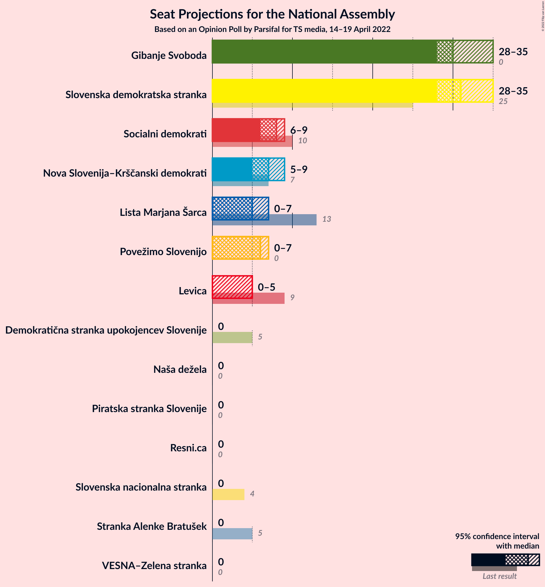

# Opinion Poll by Parsifal for TS media, 14–19 April 2022

<a href="#voting-intentions">Voting Intentions</a> | <a href="#seats">Seats</a> | <a href="#coalitions">Coalitions</a> | <a href="#technical-information">Technical Information</a>

## Voting Intentions

### Confidence Intervals

| Party | Last Result | Poll Result | 80% Confidence Interval | 90% Confidence Interval | 95% Confidence Interval | 99% Confidence Interval |
|:-----:|:-----------:|:-----------:|:-----------------------:|:-----------------------:|:-----------------------:|:-----------------------:|
| Slovenska demokratska stranka | 24.9% | 29.2% | 27.4–31.2% |26.9–31.7% |26.4–32.2% |25.6–33.1% |
| Gibanje Svoboda | 0.0% | 28.4% | 26.6–30.3% |26.1–30.9% |25.6–31.4% |24.8–32.3% |
| Socialni demokrati | 9.9% | 7.4% | 6.4–8.6% |6.1–8.9% |5.9–9.2% |5.5–9.8% |
| Nova Slovenija–Krščanski demokrati | 7.2% | 6.6% | 5.6–7.7% |5.4–8.0% |5.2–8.3% |4.7–8.9% |
| Lista Marjana Šarca | 12.6% | 5.0% | 4.2–6.0% |4.0–6.3% |3.8–6.6% |3.4–7.1% |
| Povežimo Slovenijo | 0.0% | 5.0% | 4.2–6.0% |4.0–6.3% |3.8–6.6% |3.4–7.1% |
| Levica | 9.3% | 3.6% | 3.0–4.5% |2.8–4.8% |2.6–5.0% |2.3–5.5% |
| Naša dežela | 0.0% | 2.7% | 2.1–3.5% |2.0–3.7% |1.8–3.9% |1.6–4.4% |
| Stranka Alenke Bratušek | 5.1% | 2.4% | 1.9–3.2% |1.7–3.4% |1.6–3.6% |1.4–4.0% |
| Resni.ca | 0.0% | 1.9% | 1.4–2.6% |1.3–2.8% |1.2–2.9% |1.0–3.3% |
| VESNA–Zelena stranka | 0.0% | 1.8% | 1.3–2.5% |1.2–2.7% |1.1–2.8% |0.9–3.2% |
| Piratska stranka Slovenije | 2.2% | 1.5% | 1.1–2.1% |1.0–2.3% |0.9–2.4% |0.7–2.8% |
| Slovenska nacionalna stranka | 4.2% | 1.4% | 1.0–2.0% |0.9–2.1% |0.8–2.3% |0.6–2.6% |
| Demokratična stranka upokojencev Slovenije | 4.9% | 1.2% | 0.9–1.8% |0.8–2.0% |0.7–2.2% |0.6–2.5% |

*Note:* The poll result column reflects the actual value used in the calculations. Published results may vary slightly, and in addition be rounded to fewer digits.

## Seats

### Confidence Intervals

| Party | Last Result | Median | 80% Confidence Interval | 90% Confidence Interval | 95% Confidence Interval | 99% Confidence Interval |
|:-----:|:-----------:|:------:|:-----------------------:|:-----------------------:|:-----------------------:|:-----------------------:|
| <a href="#slovenska-demokratska-stranka">Slovenska demokratska stranka</a> | 25 | 31 | 29–34 |28–34 |28–35 |28–35 |
| <a href="#gibanje-svoboda">Gibanje Svoboda</a> | 0 | 30 | 28–32 |28–34 |28–35 |27–35 |
| <a href="#socialni-demokrati">Socialni demokrati</a> | 10 | 8 | 7–9 |6–9 |6–9 |6–11 |
| <a href="#nova-slovenija–krščanski-demokrati">Nova Slovenija–Krščanski demokrati</a> | 7 | 7 | 6–9 |5–9 |5–9 |5–10 |
| <a href="#lista-marjana-šarca">Lista Marjana Šarca</a> | 13 | 5 | 5–6 |0–6 |0–7 |0–8 |
| <a href="#povežimo-slovenijo">Povežimo Slovenijo</a> | 0 | 6 | 4–7 |0–7 |0–7 |0–7 |
| <a href="#levica">Levica</a> | 9 | 0 | 0–4 |0–4 |0–5 |0–6 |
| <a href="#naša-dežela">Naša dežela</a> | 0 | 0 | 0 |0 |0 |0–4 |
| <a href="#stranka-alenke-bratušek">Stranka Alenke Bratušek</a> | 5 | 0 | 0 |0 |0 |0 |
| <a href="#resni.ca">Resni.ca</a> | 0 | 0 | 0 |0 |0 |0 |
| <a href="#vesna–zelena-stranka">VESNA–Zelena stranka</a> | 0 | 0 | 0 |0 |0 |0 |
| <a href="#piratska-stranka-slovenije">Piratska stranka Slovenije</a> | 0 | 0 | 0 |0 |0 |0 |
| <a href="#slovenska-nacionalna-stranka">Slovenska nacionalna stranka</a> | 4 | 0 | 0 |0 |0 |0 |
| <a href="#demokratična-stranka-upokojencev-slovenije">Demokratična stranka upokojencev Slovenije</a> | 5 | 0 | 0 |0 |0 |0 |

### Slovenska demokratska stranka

*For a full overview of the results for this party, see the [Slovenska demokratska stranka](party-slovenskademokratskastranka.html) page.*

| Number of Seats | Probability | Accumulated | Special Marks |
|:---------------:|:-----------:|:-----------:|:-------------:|
| 25 | 0% | 100% | Last Result |
| 26 | 0% | 100% |  |
| 27 | 0.2% | 99.9% |  |
| 28 | 8% | 99.7% |  |
| 29 | 4% | 92% |  |
| 30 | 10% | 88% |  |
| 31 | 29% | 77% | Median |
| 32 | 31% | 48% |  |
| 33 | 7% | 17% |  |
| 34 | 7% | 10% |  |
| 35 | 3% | 3% |  |
| 36 | 0.2% | 0.4% |  |
| 37 | 0.2% | 0.3% |  |
| 38 | 0% | 0.1% |  |
| 39 | 0% | 0% |  |

### Gibanje Svoboda

*For a full overview of the results for this party, see the [Gibanje Svoboda](party-gibanjesvoboda.html) page.*

| Number of Seats | Probability | Accumulated | Special Marks |
|:---------------:|:-----------:|:-----------:|:-------------:|
| 0 | 0% | 100% | Last Result |
| 1 | 0% | 100% |  |
| 2 | 0% | 100% |  |
| 3 | 0% | 100% |  |
| 4 | 0% | 100% |  |
| 5 | 0% | 100% |  |
| 6 | 0% | 100% |  |
| 7 | 0% | 100% |  |
| 8 | 0% | 100% |  |
| 9 | 0% | 100% |  |
| 10 | 0% | 100% |  |
| 11 | 0% | 100% |  |
| 12 | 0% | 100% |  |
| 13 | 0% | 100% |  |
| 14 | 0% | 100% |  |
| 15 | 0% | 100% |  |
| 16 | 0% | 100% |  |
| 17 | 0% | 100% |  |
| 18 | 0% | 100% |  |
| 19 | 0% | 100% |  |
| 20 | 0% | 100% |  |
| 21 | 0% | 100% |  |
| 22 | 0% | 100% |  |
| 23 | 0% | 100% |  |
| 24 | 0% | 100% |  |
| 25 | 0% | 100% |  |
| 26 | 0.4% | 100% |  |
| 27 | 1.1% | 99.6% |  |
| 28 | 9% | 98% |  |
| 29 | 9% | 90% |  |
| 30 | 33% | 80% | Median |
| 31 | 22% | 47% |  |
| 32 | 16% | 26% |  |
| 33 | 2% | 10% |  |
| 34 | 4% | 8% |  |
| 35 | 4% | 4% |  |
| 36 | 0.1% | 0.3% |  |
| 37 | 0.1% | 0.2% |  |
| 38 | 0% | 0% |  |

### Socialni demokrati

*For a full overview of the results for this party, see the [Socialni demokrati](party-socialnidemokrati.html) page.*

| Number of Seats | Probability | Accumulated | Special Marks |
|:---------------:|:-----------:|:-----------:|:-------------:|
| 5 | 0.2% | 100% |  |
| 6 | 8% | 99.8% |  |
| 7 | 34% | 92% |  |
| 8 | 45% | 57% | Median |
| 9 | 10% | 12% |  |
| 10 | 1.2% | 2% | Last Result |
| 11 | 1.1% | 1.1% |  |
| 12 | 0% | 0% |  |

### Nova Slovenija–Krščanski demokrati

*For a full overview of the results for this party, see the [Nova Slovenija–Krščanski demokrati](party-novaslovenija–krščanskidemokrati.html) page.*

| Number of Seats | Probability | Accumulated | Special Marks |
|:---------------:|:-----------:|:-----------:|:-------------:|
| 4 | 0.3% | 100% |  |
| 5 | 7% | 99.6% |  |
| 6 | 34% | 92% |  |
| 7 | 33% | 59% | Last Result, Median |
| 8 | 7% | 26% |  |
| 9 | 18% | 19% |  |
| 10 | 1.3% | 1.3% |  |
| 11 | 0% | 0% |  |

### Lista Marjana Šarca

*For a full overview of the results for this party, see the [Lista Marjana Šarca](party-listamarjanašarca.html) page.*

| Number of Seats | Probability | Accumulated | Special Marks |
|:---------------:|:-----------:|:-----------:|:-------------:|
| 0 | 6% | 100% |  |
| 1 | 0% | 94% |  |
| 2 | 0% | 94% |  |
| 3 | 0% | 94% |  |
| 4 | 3% | 94% |  |
| 5 | 81% | 91% | Median |
| 6 | 7% | 10% |  |
| 7 | 0.9% | 3% |  |
| 8 | 2% | 2% |  |
| 9 | 0% | 0% |  |
| 10 | 0% | 0% |  |
| 11 | 0% | 0% |  |
| 12 | 0% | 0% |  |
| 13 | 0% | 0% | Last Result |

### Povežimo Slovenijo

*For a full overview of the results for this party, see the [Povežimo Slovenijo](party-povežimoslovenijo.html) page.*

| Number of Seats | Probability | Accumulated | Special Marks |
|:---------------:|:-----------:|:-----------:|:-------------:|
| 0 | 10% | 100% | Last Result |
| 1 | 0% | 90% |  |
| 2 | 0% | 90% |  |
| 3 | 0% | 90% |  |
| 4 | 13% | 90% |  |
| 5 | 21% | 77% |  |
| 6 | 12% | 56% | Median |
| 7 | 44% | 44% |  |
| 8 | 0.2% | 0.2% |  |
| 9 | 0% | 0% |  |

### Levica

*For a full overview of the results for this party, see the [Levica](party-levica.html) page.*

| Number of Seats | Probability | Accumulated | Special Marks |
|:---------------:|:-----------:|:-----------:|:-------------:|
| 0 | 73% | 100% | Median |
| 1 | 0% | 27% |  |
| 2 | 0% | 27% |  |
| 3 | 0% | 27% |  |
| 4 | 23% | 27% |  |
| 5 | 4% | 4% |  |
| 6 | 0.7% | 0.7% |  |
| 7 | 0% | 0% |  |
| 8 | 0% | 0% |  |
| 9 | 0% | 0% | Last Result |

### Naša dežela

*For a full overview of the results for this party, see the [Naša dežela](party-našadežela.html) page.*

| Number of Seats | Probability | Accumulated | Special Marks |
|:---------------:|:-----------:|:-----------:|:-------------:|
| 0 | 99.3% | 100% | Last Result, Median |
| 1 | 0% | 0.7% |  |
| 2 | 0% | 0.7% |  |
| 3 | 0% | 0.7% |  |
| 4 | 0.4% | 0.7% |  |
| 5 | 0.3% | 0.3% |  |
| 6 | 0% | 0% |  |

### Stranka Alenke Bratušek

*For a full overview of the results for this party, see the [Stranka Alenke Bratušek](party-strankaalenkebratušek.html) page.*

| Number of Seats | Probability | Accumulated | Special Marks |
|:---------------:|:-----------:|:-----------:|:-------------:|
| 0 | 99.8% | 100% | Median |
| 1 | 0% | 0.2% |  |
| 2 | 0% | 0.2% |  |
| 3 | 0% | 0.2% |  |
| 4 | 0.1% | 0.2% |  |
| 5 | 0% | 0% | Last Result |

### Resni.ca

*For a full overview of the results for this party, see the [Resni.ca](party-resnica.html) page.*

| Number of Seats | Probability | Accumulated | Special Marks |
|:---------------:|:-----------:|:-----------:|:-------------:|
| 0 | 99.9% | 100% | Last Result, Median |
| 1 | 0% | 0.1% |  |
| 2 | 0% | 0.1% |  |
| 3 | 0% | 0.1% |  |
| 4 | 0.1% | 0.1% |  |
| 5 | 0% | 0% |  |

### VESNA–Zelena stranka

*For a full overview of the results for this party, see the [VESNA–Zelena stranka](party-vesna–zelenastranka.html) page.*

| Number of Seats | Probability | Accumulated | Special Marks |
|:---------------:|:-----------:|:-----------:|:-------------:|
| 0 | 100% | 100% | Last Result, Median |

### Piratska stranka Slovenije

*For a full overview of the results for this party, see the [Piratska stranka Slovenije](party-piratskastrankaslovenije.html) page.*

| Number of Seats | Probability | Accumulated | Special Marks |
|:---------------:|:-----------:|:-----------:|:-------------:|
| 0 | 100% | 100% | Last Result, Median |

### Slovenska nacionalna stranka

*For a full overview of the results for this party, see the [Slovenska nacionalna stranka](party-slovenskanacionalnastranka.html) page.*

| Number of Seats | Probability | Accumulated | Special Marks |
|:---------------:|:-----------:|:-----------:|:-------------:|
| 0 | 100% | 100% | Median |
| 1 | 0% | 0% |  |
| 2 | 0% | 0% |  |
| 3 | 0% | 0% |  |
| 4 | 0% | 0% | Last Result |

### Demokratična stranka upokojencev Slovenije

*For a full overview of the results for this party, see the [Demokratična stranka upokojencev Slovenije](party-demokratičnastrankaupokojencevslovenije.html) page.*

| Number of Seats | Probability | Accumulated | Special Marks |
|:---------------:|:-----------:|:-----------:|:-------------:|
| 0 | 100% | 100% | Median |
| 1 | 0% | 0% |  |
| 2 | 0% | 0% |  |
| 3 | 0% | 0% |  |
| 4 | 0% | 0% |  |
| 5 | 0% | 0% | Last Result |

## Coalitions

### Confidence Intervals

| Coalition | Last Result | Median | Majority? | 80% Confidence Interval | 90% Confidence Interval | 95% Confidence Interval | 99% Confidence Interval |
|:---------:|:-----------:|:------:|:---------:|:-----------------------:|:-----------------------:|:-----------------------:|:-----------------------:|
| Slovenska demokratska stranka – Lista Marjana Šarca – Demokratična stranka upokojencev Slovenije | 43 | 36 | 0% | 33–39 | 32–39 | 32–40 | 29–41 |
| Slovenska demokratska stranka – Lista Marjana Šarca | 38 | 36 | 0% | 33–39 | 32–39 | 32–40 | 29–41 |
| Socialni demokrati – Nova Slovenija–Krščanski demokrati – Lista Marjana Šarca – Demokratična stranka upokojencev Slovenije | 35 | 19 | 0% | 18–22 | 15–22 | 15–23 | 14–24 |
| Socialni demokrati – Nova Slovenija–Krščanski demokrati – Lista Marjana Šarca | 30 | 19 | 0% | 18–22 | 15–22 | 15–23 | 14–24 |
| Socialni demokrati – Lista Marjana Šarca – Demokratična stranka upokojencev Slovenije | 28 | 13 | 0% | 11–14 | 8–14 | 7–16 | 7–16 |
| Socialni demokrati – Lista Marjana Šarca | 23 | 13 | 0% | 11–14 | 8–14 | 7–16 | 7–16 |

### Slovenska demokratska stranka – Lista Marjana Šarca – Demokratična stranka upokojencev Slovenije

| Number of Seats | Probability | Accumulated | Special Marks |
|:---------------:|:-----------:|:-----------:|:-------------:|
| 29 | 0.6% | 100% |  |
| 30 | 0.7% | 99.4% |  |
| 31 | 0.3% | 98.7% |  |
| 32 | 4% | 98% |  |
| 33 | 7% | 95% |  |
| 34 | 3% | 88% |  |
| 35 | 9% | 85% |  |
| 36 | 29% | 75% | Median |
| 37 | 30% | 47% |  |
| 38 | 7% | 17% |  |
| 39 | 7% | 10% |  |
| 40 | 2% | 3% |  |
| 41 | 1.3% | 2% |  |
| 42 | 0.2% | 0.4% |  |
| 43 | 0.2% | 0.2% | Last Result |
| 44 | 0% | 0% |  |

### Slovenska demokratska stranka – Lista Marjana Šarca

| Number of Seats | Probability | Accumulated | Special Marks |
|:---------------:|:-----------:|:-----------:|:-------------:|
| 29 | 0.6% | 100% |  |
| 30 | 0.7% | 99.4% |  |
| 31 | 0.3% | 98.7% |  |
| 32 | 4% | 98% |  |
| 33 | 7% | 95% |  |
| 34 | 3% | 88% |  |
| 35 | 9% | 85% |  |
| 36 | 29% | 75% | Median |
| 37 | 30% | 47% |  |
| 38 | 7% | 17% | Last Result |
| 39 | 7% | 10% |  |
| 40 | 2% | 3% |  |
| 41 | 1.3% | 2% |  |
| 42 | 0.2% | 0.4% |  |
| 43 | 0.2% | 0.2% |  |
| 44 | 0% | 0% |  |

### Socialni demokrati – Nova Slovenija–Krščanski demokrati – Lista Marjana Šarca – Demokratična stranka upokojencev Slovenije

| Number of Seats | Probability | Accumulated | Special Marks |
|:---------------:|:-----------:|:-----------:|:-------------:|
| 12 | 0.1% | 100% |  |
| 13 | 0.3% | 99.9% |  |
| 14 | 0.6% | 99.6% |  |
| 15 | 4% | 99.0% |  |
| 16 | 0.2% | 95% |  |
| 17 | 2% | 94% |  |
| 18 | 9% | 92% |  |
| 19 | 49% | 83% |  |
| 20 | 3% | 34% | Median |
| 21 | 20% | 31% |  |
| 22 | 6% | 11% |  |
| 23 | 4% | 5% |  |
| 24 | 0.9% | 1.0% |  |
| 25 | 0.1% | 0.1% |  |
| 26 | 0% | 0% |  |
| 27 | 0% | 0% |  |
| 28 | 0% | 0% |  |
| 29 | 0% | 0% |  |
| 30 | 0% | 0% |  |
| 31 | 0% | 0% |  |
| 32 | 0% | 0% |  |
| 33 | 0% | 0% |  |
| 34 | 0% | 0% |  |
| 35 | 0% | 0% | Last Result |

### Socialni demokrati – Nova Slovenija–Krščanski demokrati – Lista Marjana Šarca

| Number of Seats | Probability | Accumulated | Special Marks |
|:---------------:|:-----------:|:-----------:|:-------------:|
| 12 | 0.1% | 100% |  |
| 13 | 0.3% | 99.9% |  |
| 14 | 0.6% | 99.6% |  |
| 15 | 4% | 99.0% |  |
| 16 | 0.2% | 95% |  |
| 17 | 2% | 94% |  |
| 18 | 9% | 92% |  |
| 19 | 49% | 83% |  |
| 20 | 3% | 34% | Median |
| 21 | 20% | 31% |  |
| 22 | 6% | 11% |  |
| 23 | 4% | 5% |  |
| 24 | 0.9% | 1.0% |  |
| 25 | 0.1% | 0.1% |  |
| 26 | 0% | 0% |  |
| 27 | 0% | 0% |  |
| 28 | 0% | 0% |  |
| 29 | 0% | 0% |  |
| 30 | 0% | 0% | Last Result |

### Socialni demokrati – Lista Marjana Šarca – Demokratična stranka upokojencev Slovenije

| Number of Seats | Probability | Accumulated | Special Marks |
|:---------------:|:-----------:|:-----------:|:-------------:|
| 6 | 0.2% | 100% |  |
| 7 | 4% | 99.8% |  |
| 8 | 0.4% | 95% |  |
| 9 | 0.7% | 95% |  |
| 10 | 1.2% | 94% |  |
| 11 | 4% | 93% |  |
| 12 | 30% | 89% |  |
| 13 | 44% | 59% | Median |
| 14 | 9% | 14% |  |
| 15 | 1.1% | 5% |  |
| 16 | 4% | 4% |  |
| 17 | 0.1% | 0.2% |  |
| 18 | 0% | 0% |  |
| 19 | 0% | 0% |  |
| 20 | 0% | 0% |  |
| 21 | 0% | 0% |  |
| 22 | 0% | 0% |  |
| 23 | 0% | 0% |  |
| 24 | 0% | 0% |  |
| 25 | 0% | 0% |  |
| 26 | 0% | 0% |  |
| 27 | 0% | 0% |  |
| 28 | 0% | 0% | Last Result |

### Socialni demokrati – Lista Marjana Šarca

| Number of Seats | Probability | Accumulated | Special Marks |
|:---------------:|:-----------:|:-----------:|:-------------:|
| 6 | 0.2% | 100% |  |
| 7 | 4% | 99.8% |  |
| 8 | 0.4% | 95% |  |
| 9 | 0.7% | 95% |  |
| 10 | 1.2% | 94% |  |
| 11 | 4% | 93% |  |
| 12 | 30% | 89% |  |
| 13 | 44% | 59% | Median |
| 14 | 9% | 14% |  |
| 15 | 1.1% | 5% |  |
| 16 | 4% | 4% |  |
| 17 | 0.1% | 0.2% |  |
| 18 | 0% | 0% |  |
| 19 | 0% | 0% |  |
| 20 | 0% | 0% |  |
| 21 | 0% | 0% |  |
| 22 | 0% | 0% |  |
| 23 | 0% | 0% | Last Result |

## Technical Information

### Opinion Poll

+ **Polling firm:** Parsifal
+ **Commissioner(s):** TS media
+ **Fieldwork period:** 14–19 April 2022

### Calculations

+ **Sample size:** 961
+ **Simulations done:** 1,048,576
+ **Error estimate:** 1.08%

