# Opinion Poll by Mediana for Delo, POP TV, 19–21 April 2022

<a href="#voting-intentions">Voting Intentions</a> | <a href="#seats">Seats</a> | <a href="#coalitions">Coalitions</a> | <a href="#technical-information">Technical Information</a>

## Voting Intentions

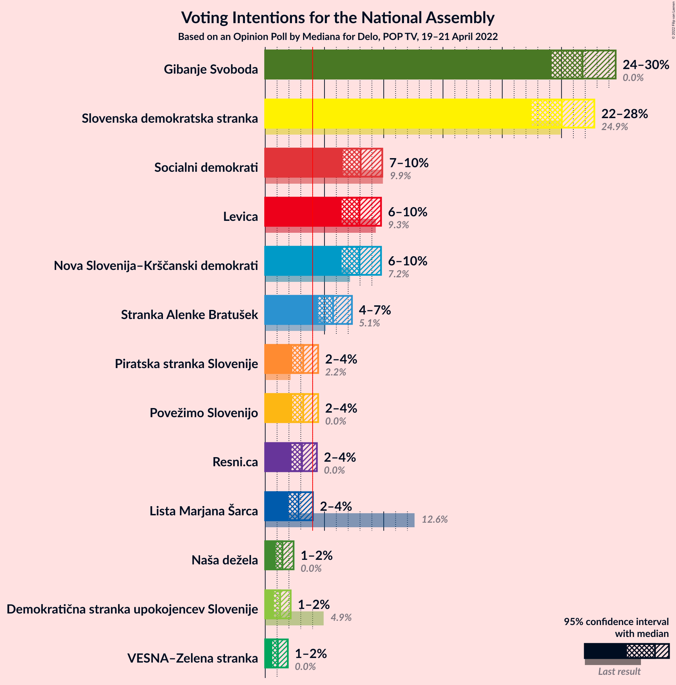

### Confidence Intervals

| Party | Last Result | Poll Result | 80% Confidence Interval | 90% Confidence Interval | 95% Confidence Interval | 99% Confidence Interval |
|:-----:|:-----------:|:-----------:|:-----------------------:|:-----------------------:|:-----------------------:|:-----------------------:|
| Gibanje Svoboda | 0.0% | 26.8% | 25.1–28.6% |24.6–29.1% |24.2–29.6% |23.4–30.5% |
| Slovenska demokratska stranka | 24.9% | 25.0% | 23.4–26.8% |22.9–27.3% |22.5–27.8% |21.7–28.6% |
| Socialni demokrati | 9.9% | 8.1% | 7.1–9.3% |6.8–9.6% |6.5–9.9% |6.1–10.5% |
| Levica | 9.3% | 8.0% | 7.0–9.1% |6.7–9.5% |6.4–9.8% |6.0–10.4% |
| Nova Slovenija–Krščanski demokrati | 7.2% | 8.0% | 7.0–9.1% |6.7–9.5% |6.4–9.8% |6.0–10.4% |
| Stranka Alenke Bratušek | 5.1% | 5.7% | 4.9–6.8% |4.6–7.1% |4.5–7.3% |4.1–7.8% |
| Piratska stranka Slovenije | 2.2% | 3.2% | 2.6–4.0% |2.4–4.3% |2.3–4.5% |2.0–4.9% |
| Povežimo Slovenijo | 0.0% | 3.2% | 2.6–4.0% |2.4–4.3% |2.3–4.5% |2.0–4.9% |
| Resni.ca | 0.0% | 3.1% | 2.5–3.9% |2.3–4.1% |2.2–4.4% |2.0–4.8% |
| Lista Marjana Šarca | 12.6% | 2.8% | 2.3–3.6% |2.1–3.8% |2.0–4.0% |1.7–4.4% |
| Naša dežela | 0.0% | 1.5% | 1.1–2.1% |1.0–2.2% |0.9–2.4% |0.7–2.7% |
| Demokratična stranka upokojencev Slovenije | 4.9% | 1.3% | 0.9–1.8% |0.8–2.0% |0.7–2.1% |0.6–2.5% |
| VESNA–Zelena stranka | 0.0% | 1.1% | 0.7–1.6% |0.7–1.8% |0.6–1.9% |0.5–2.2% |

*Note:* The poll result column reflects the actual value used in the calculations. Published results may vary slightly, and in addition be rounded to fewer digits.

## Seats

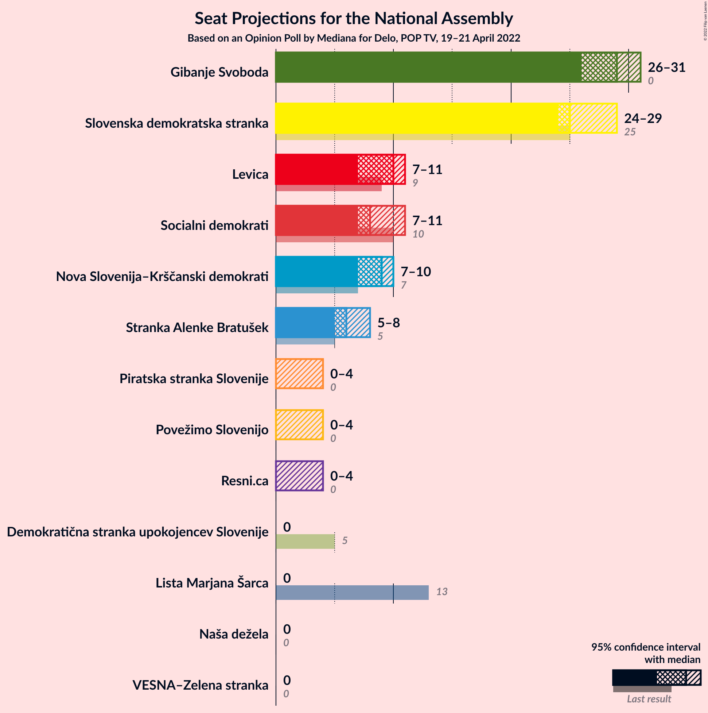

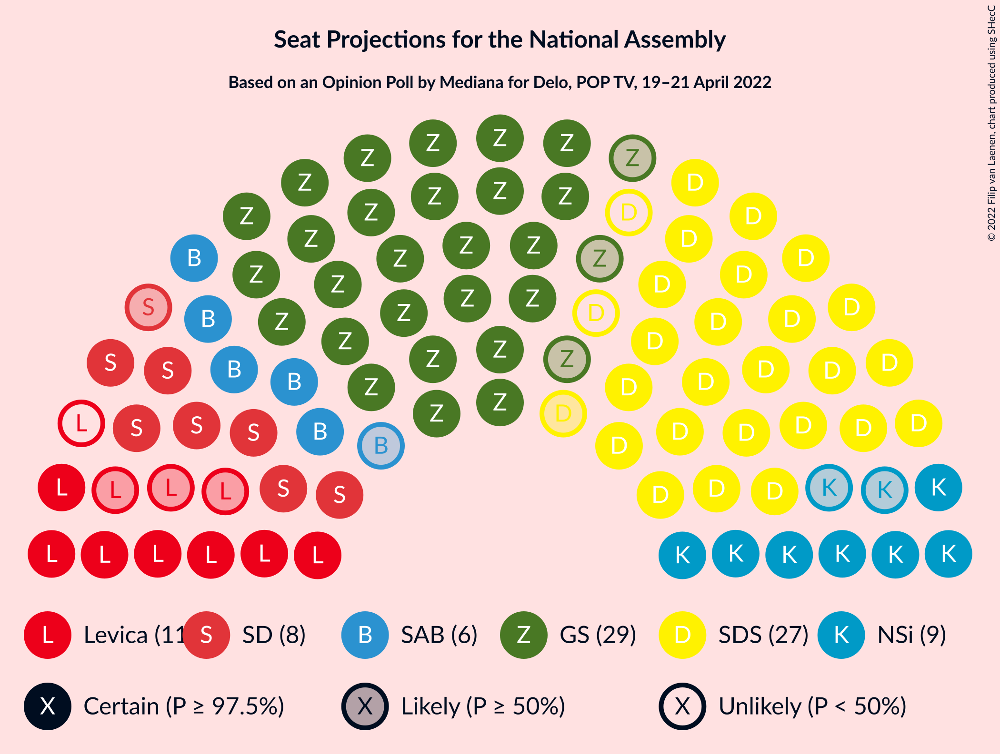

### Confidence Intervals

| Party | Last Result | Median | 80% Confidence Interval | 90% Confidence Interval | 95% Confidence Interval | 99% Confidence Interval |
|:-----:|:-----------:|:------:|:-----------------------:|:-----------------------:|:-----------------------:|:-----------------------:|
| <a href="#gibanje-svoboda">Gibanje Svoboda</a> | 0 | 29 | 28–30 |27–30 |26–31 |25–32 |
| <a href="#slovenska-demokratska-stranka">Slovenska demokratska stranka</a> | 25 | 25 | 25–28 |24–29 |24–29 |23–30 |
| <a href="#socialni-demokrati">Socialni demokrati</a> | 10 | 8 | 7–9 |7–10 |7–11 |6–11 |
| <a href="#levica">Levica</a> | 9 | 10 | 7–11 |7–11 |7–11 |6–11 |
| <a href="#nova-slovenija–krščanski-demokrati">Nova Slovenija–Krščanski demokrati</a> | 7 | 9 | 7–9 |7–10 |7–10 |6–10 |
| <a href="#stranka-alenke-bratušek">Stranka Alenke Bratušek</a> | 5 | 6 | 5–7 |5–8 |5–8 |4–8 |
| <a href="#piratska-stranka-slovenije">Piratska stranka Slovenije</a> | 0 | 0 | 0 |0 |0–4 |0–4 |
| <a href="#povežimo-slovenijo">Povežimo Slovenijo</a> | 0 | 0 | 0–4 |0–4 |0–4 |0–5 |
| <a href="#resni.ca">Resni.ca</a> | 0 | 0 | 0 |0 |0–4 |0–5 |
| <a href="#lista-marjana-šarca">Lista Marjana Šarca</a> | 13 | 0 | 0 |0 |0 |0–4 |
| <a href="#naša-dežela">Naša dežela</a> | 0 | 0 | 0 |0 |0 |0 |
| <a href="#demokratična-stranka-upokojencev-slovenije">Demokratična stranka upokojencev Slovenije</a> | 5 | 0 | 0 |0 |0 |0 |
| <a href="#vesna–zelena-stranka">VESNA–Zelena stranka</a> | 0 | 0 | 0 |0 |0 |0 |

### Gibanje Svoboda

*For a full overview of the results for this party, see the [Gibanje Svoboda](party-gibanjesvoboda.html) page.*

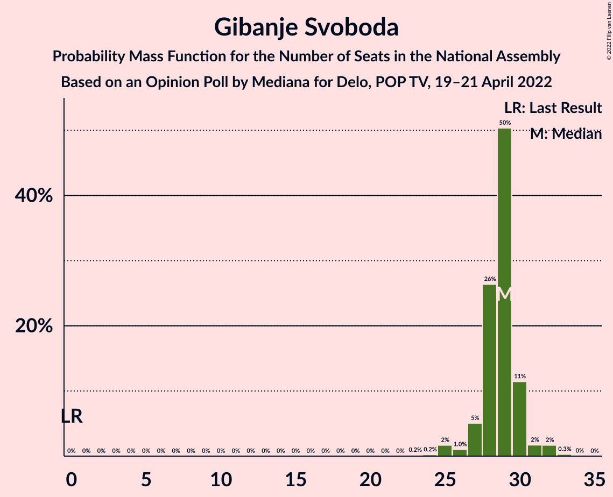

| Number of Seats | Probability | Accumulated | Special Marks |
|:---------------:|:-----------:|:-----------:|:-------------:|
| 0 | 0% | 100% | Last Result |
| 1 | 0% | 100% |  |
| 2 | 0% | 100% |  |
| 3 | 0% | 100% |  |
| 4 | 0% | 100% |  |
| 5 | 0% | 100% |  |
| 6 | 0% | 100% |  |
| 7 | 0% | 100% |  |
| 8 | 0% | 100% |  |
| 9 | 0% | 100% |  |
| 10 | 0% | 100% |  |
| 11 | 0% | 100% |  |
| 12 | 0% | 100% |  |
| 13 | 0% | 100% |  |
| 14 | 0% | 100% |  |
| 15 | 0% | 100% |  |
| 16 | 0% | 100% |  |
| 17 | 0% | 100% |  |
| 18 | 0% | 100% |  |
| 19 | 0% | 100% |  |
| 20 | 0% | 100% |  |
| 21 | 0% | 100% |  |
| 22 | 0% | 100% |  |
| 23 | 0.2% | 100% |  |
| 24 | 0.2% | 99.8% |  |
| 25 | 2% | 99.6% |  |
| 26 | 1.0% | 98% |  |
| 27 | 5% | 97% |  |
| 28 | 26% | 92% |  |
| 29 | 50% | 66% | Median |
| 30 | 11% | 15% |  |
| 31 | 2% | 4% |  |
| 32 | 2% | 2% |  |
| 33 | 0.3% | 0.3% |  |
| 34 | 0% | 0% |  |

### Slovenska demokratska stranka

*For a full overview of the results for this party, see the [Slovenska demokratska stranka](party-slovenskademokratskastranka.html) page.*

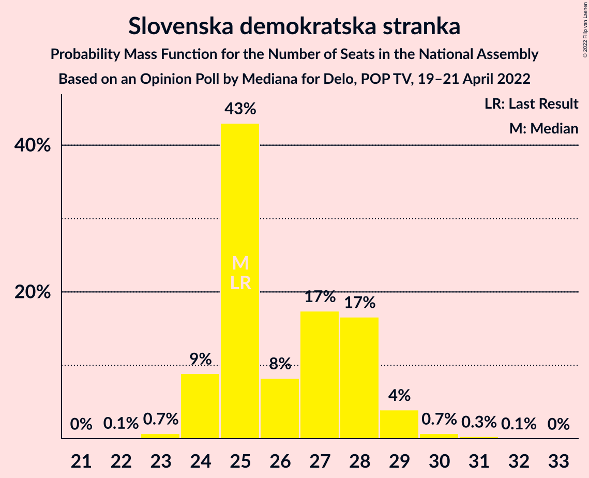

| Number of Seats | Probability | Accumulated | Special Marks |
|:---------------:|:-----------:|:-----------:|:-------------:|
| 22 | 0.1% | 100% |  |
| 23 | 0.7% | 99.9% |  |
| 24 | 9% | 99.1% |  |
| 25 | 43% | 90% | Last Result, Median |
| 26 | 8% | 47% |  |
| 27 | 17% | 39% |  |
| 28 | 17% | 22% |  |
| 29 | 4% | 5% |  |
| 30 | 0.7% | 1.1% |  |
| 31 | 0.3% | 0.4% |  |
| 32 | 0.1% | 0.1% |  |
| 33 | 0% | 0% |  |

### Socialni demokrati

*For a full overview of the results for this party, see the [Socialni demokrati](party-socialnidemokrati.html) page.*

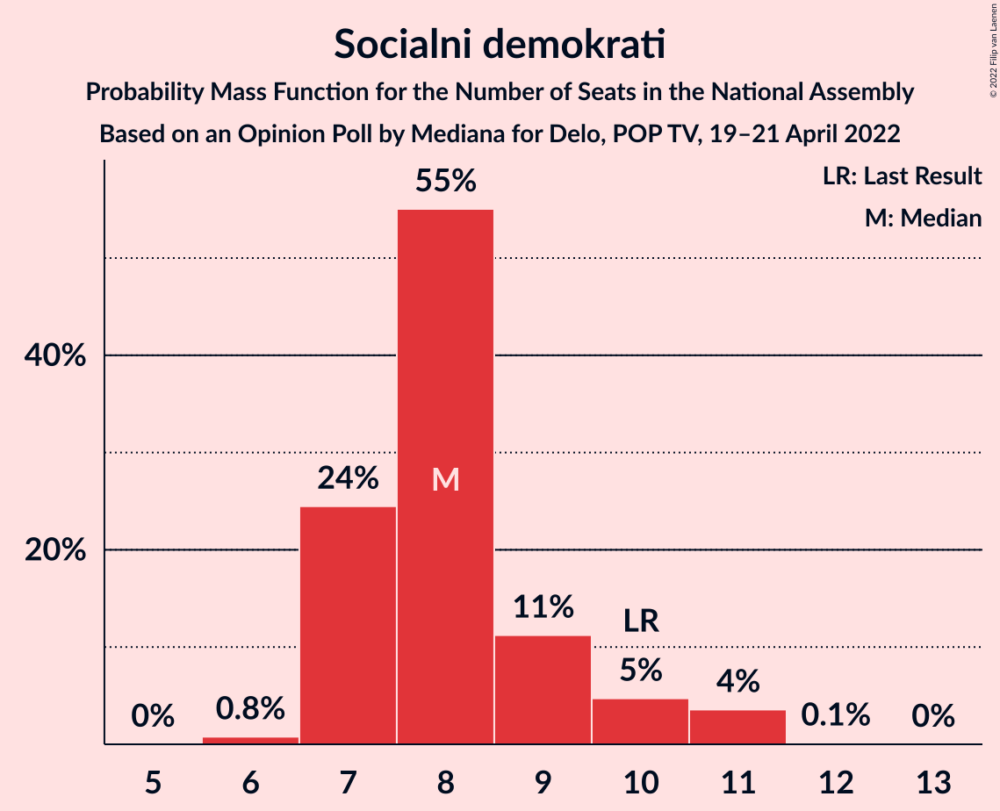

| Number of Seats | Probability | Accumulated | Special Marks |
|:---------------:|:-----------:|:-----------:|:-------------:|
| 6 | 0.8% | 100% |  |
| 7 | 24% | 99.2% |  |
| 8 | 55% | 75% | Median |
| 9 | 11% | 20% |  |
| 10 | 5% | 8% | Last Result |
| 11 | 4% | 4% |  |
| 12 | 0.1% | 0.1% |  |
| 13 | 0% | 0% |  |

### Levica

*For a full overview of the results for this party, see the [Levica](party-levica.html) page.*

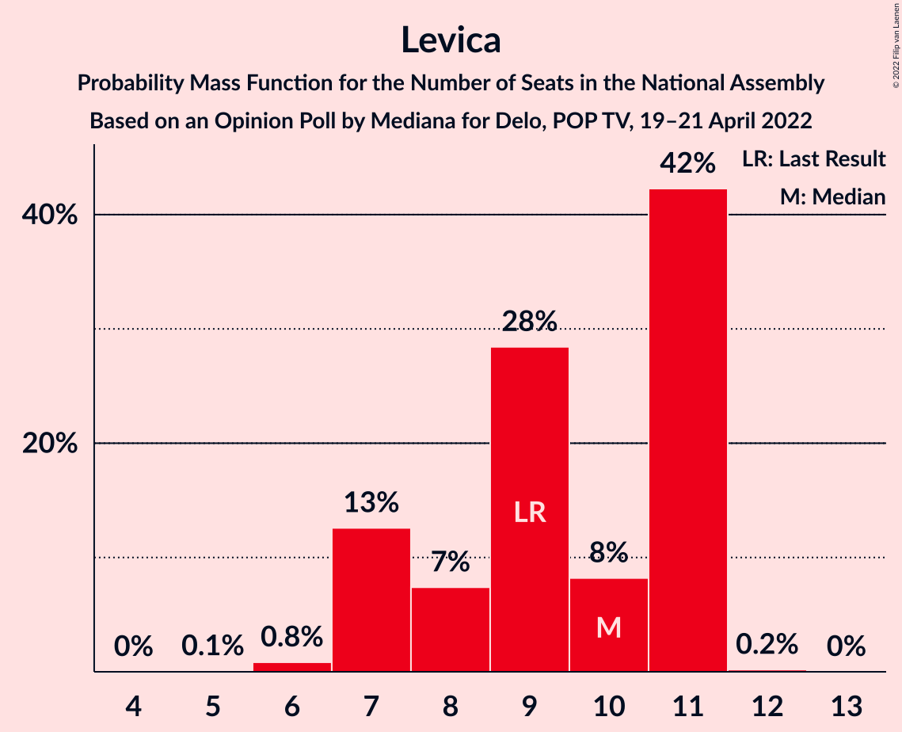

| Number of Seats | Probability | Accumulated | Special Marks |
|:---------------:|:-----------:|:-----------:|:-------------:|
| 5 | 0.1% | 100% |  |
| 6 | 0.8% | 99.9% |  |
| 7 | 13% | 99.1% |  |
| 8 | 7% | 87% |  |
| 9 | 28% | 79% | Last Result |
| 10 | 8% | 51% | Median |
| 11 | 42% | 42% |  |
| 12 | 0.2% | 0.2% |  |
| 13 | 0% | 0% |  |

### Nova Slovenija–Krščanski demokrati

*For a full overview of the results for this party, see the [Nova Slovenija–Krščanski demokrati](party-novaslovenija–krščanskidemokrati.html) page.*

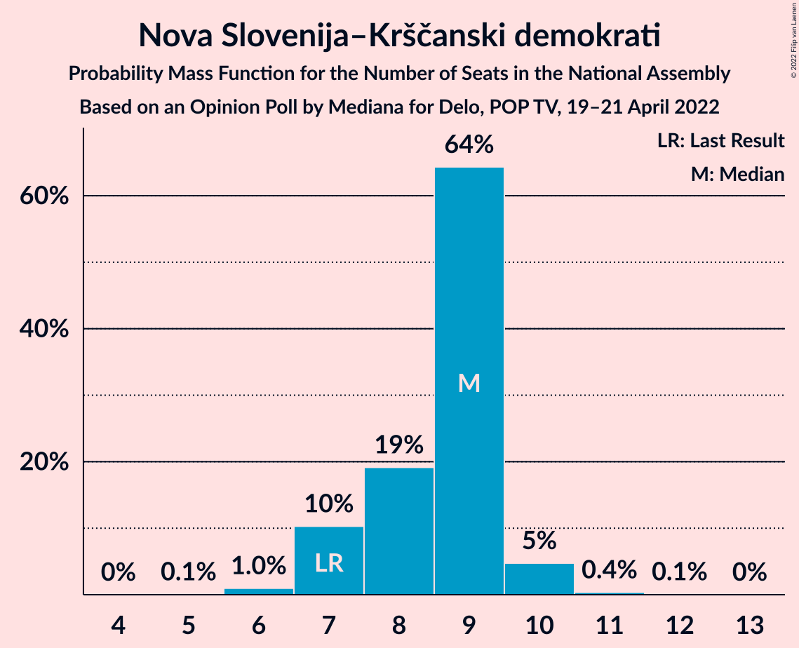

| Number of Seats | Probability | Accumulated | Special Marks |
|:---------------:|:-----------:|:-----------:|:-------------:|
| 5 | 0.1% | 100% |  |
| 6 | 1.0% | 99.9% |  |
| 7 | 10% | 99.0% | Last Result |
| 8 | 19% | 89% |  |
| 9 | 64% | 70% | Median |
| 10 | 5% | 5% |  |
| 11 | 0.4% | 0.4% |  |
| 12 | 0.1% | 0.1% |  |
| 13 | 0% | 0% |  |

### Stranka Alenke Bratušek

*For a full overview of the results for this party, see the [Stranka Alenke Bratušek](party-strankaalenkebratušek.html) page.*

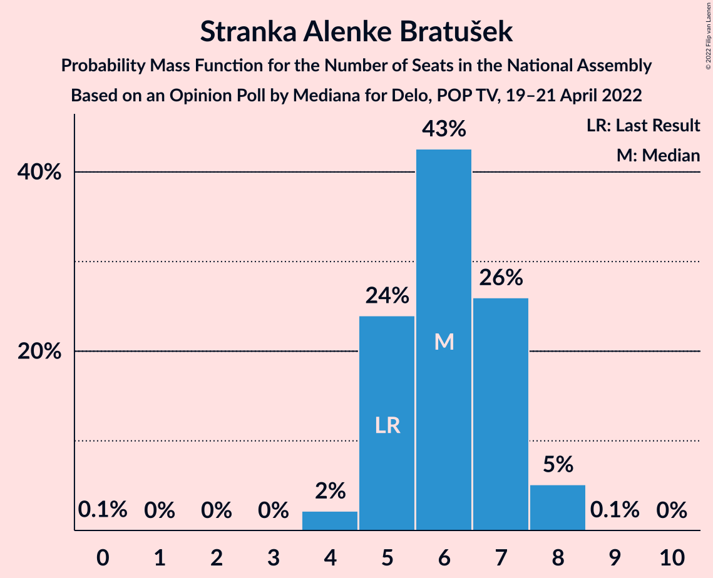

| Number of Seats | Probability | Accumulated | Special Marks |
|:---------------:|:-----------:|:-----------:|:-------------:|
| 0 | 0.1% | 100% |  |
| 1 | 0% | 99.9% |  |
| 2 | 0% | 99.9% |  |
| 3 | 0% | 99.9% |  |
| 4 | 2% | 99.9% |  |
| 5 | 24% | 98% | Last Result |
| 6 | 43% | 74% | Median |
| 7 | 26% | 31% |  |
| 8 | 5% | 5% |  |
| 9 | 0.1% | 0.1% |  |
| 10 | 0% | 0% |  |

### Piratska stranka Slovenije

*For a full overview of the results for this party, see the [Piratska stranka Slovenije](party-piratskastrankaslovenije.html) page.*

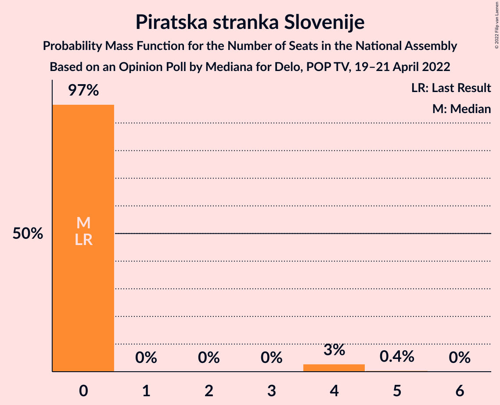

| Number of Seats | Probability | Accumulated | Special Marks |
|:---------------:|:-----------:|:-----------:|:-------------:|
| 0 | 97% | 100% | Last Result, Median |
| 1 | 0% | 3% |  |
| 2 | 0% | 3% |  |
| 3 | 0% | 3% |  |
| 4 | 3% | 3% |  |
| 5 | 0.4% | 0.4% |  |
| 6 | 0% | 0% |  |

### Povežimo Slovenijo

*For a full overview of the results for this party, see the [Povežimo Slovenijo](party-povežimoslovenijo.html) page.*

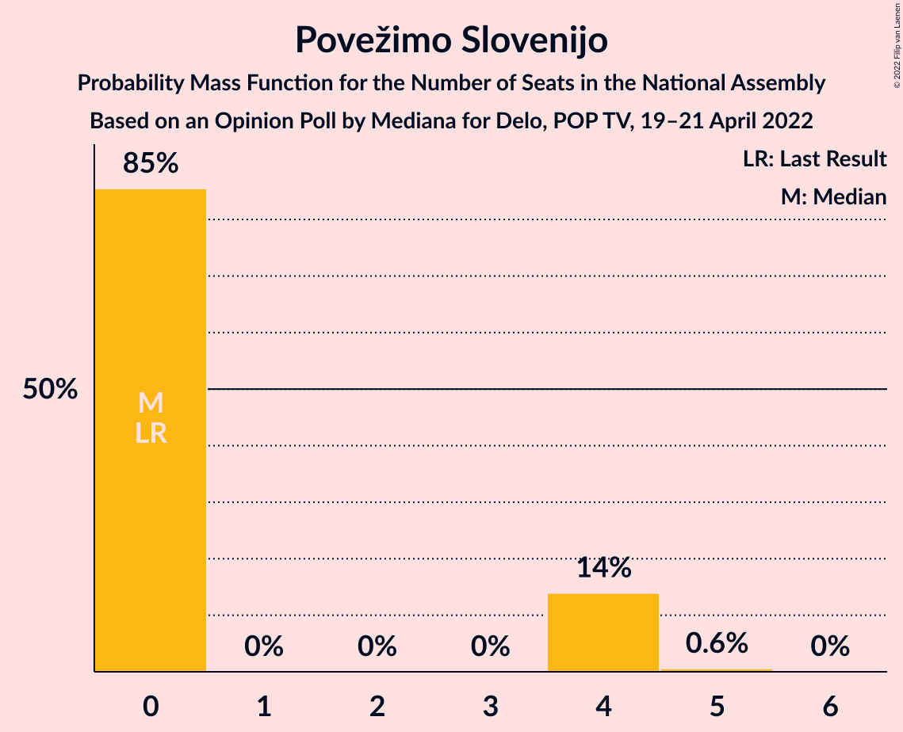

| Number of Seats | Probability | Accumulated | Special Marks |
|:---------------:|:-----------:|:-----------:|:-------------:|
| 0 | 85% | 100% | Last Result, Median |
| 1 | 0% | 15% |  |
| 2 | 0% | 15% |  |
| 3 | 0% | 15% |  |
| 4 | 14% | 15% |  |
| 5 | 0.6% | 0.6% |  |
| 6 | 0% | 0% |  |

### Resni.ca

*For a full overview of the results for this party, see the [Resni.ca](party-resnica.html) page.*

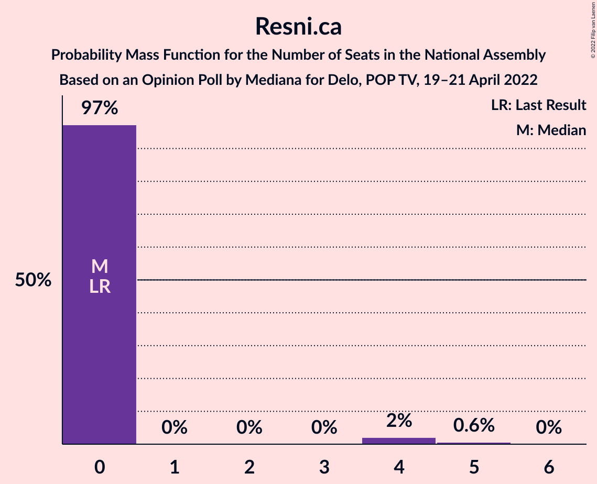

| Number of Seats | Probability | Accumulated | Special Marks |
|:---------------:|:-----------:|:-----------:|:-------------:|
| 0 | 97% | 100% | Last Result, Median |
| 1 | 0% | 3% |  |
| 2 | 0% | 3% |  |
| 3 | 0% | 3% |  |
| 4 | 2% | 3% |  |
| 5 | 0.6% | 0.6% |  |
| 6 | 0% | 0% |  |

### Lista Marjana Šarca

*For a full overview of the results for this party, see the [Lista Marjana Šarca](party-listamarjanašarca.html) page.*

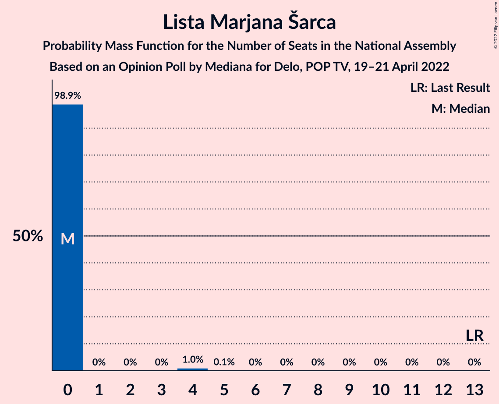

| Number of Seats | Probability | Accumulated | Special Marks |
|:---------------:|:-----------:|:-----------:|:-------------:|
| 0 | 98.9% | 100% | Median |
| 1 | 0% | 1.1% |  |
| 2 | 0% | 1.1% |  |
| 3 | 0% | 1.1% |  |
| 4 | 1.0% | 1.1% |  |
| 5 | 0.1% | 0.1% |  |
| 6 | 0% | 0% |  |
| 7 | 0% | 0% |  |
| 8 | 0% | 0% |  |
| 9 | 0% | 0% |  |
| 10 | 0% | 0% |  |
| 11 | 0% | 0% |  |
| 12 | 0% | 0% |  |
| 13 | 0% | 0% | Last Result |

### Naša dežela

*For a full overview of the results for this party, see the [Naša dežela](party-našadežela.html) page.*

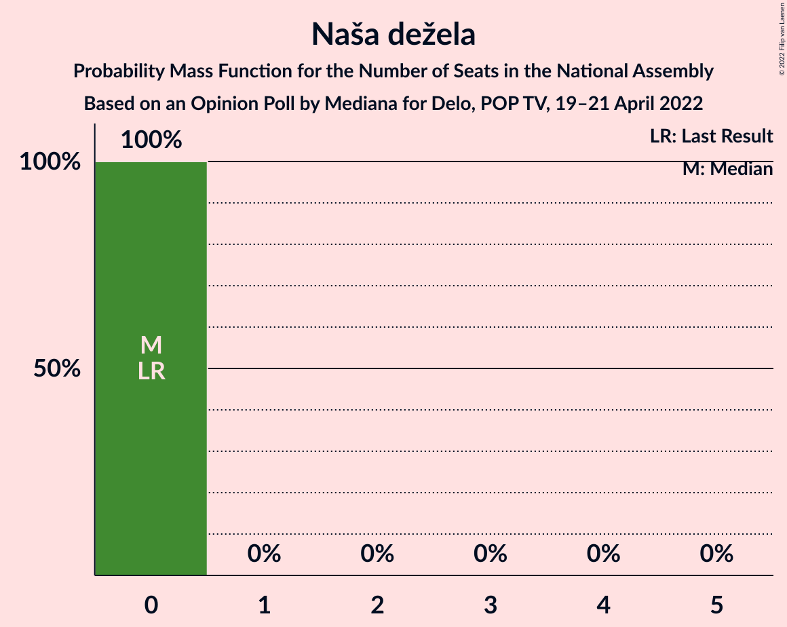

| Number of Seats | Probability | Accumulated | Special Marks |
|:---------------:|:-----------:|:-----------:|:-------------:|
| 0 | 100% | 100% | Last Result, Median |

### Demokratična stranka upokojencev Slovenije

*For a full overview of the results for this party, see the [Demokratična stranka upokojencev Slovenije](party-demokratičnastrankaupokojencevslovenije.html) page.*

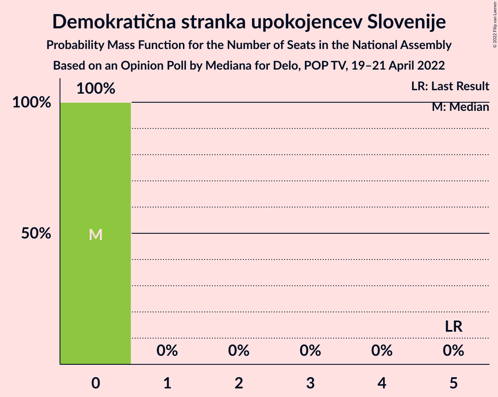

| Number of Seats | Probability | Accumulated | Special Marks |
|:---------------:|:-----------:|:-----------:|:-------------:|
| 0 | 100% | 100% | Median |
| 1 | 0% | 0% |  |
| 2 | 0% | 0% |  |
| 3 | 0% | 0% |  |
| 4 | 0% | 0% |  |
| 5 | 0% | 0% | Last Result |

### VESNA–Zelena stranka

*For a full overview of the results for this party, see the [VESNA–Zelena stranka](party-vesna–zelenastranka.html) page.*

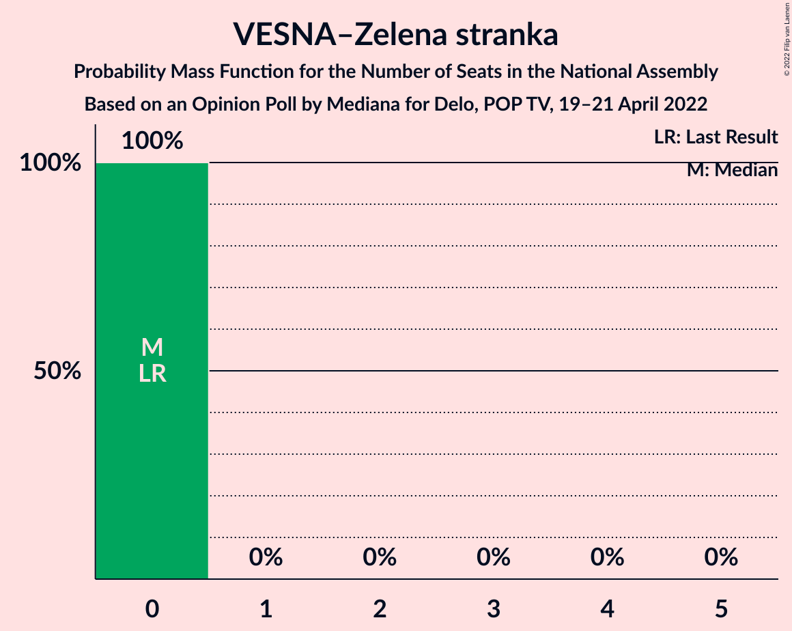

| Number of Seats | Probability | Accumulated | Special Marks |
|:---------------:|:-----------:|:-----------:|:-------------:|
| 0 | 100% | 100% | Last Result, Median |

## Coalitions

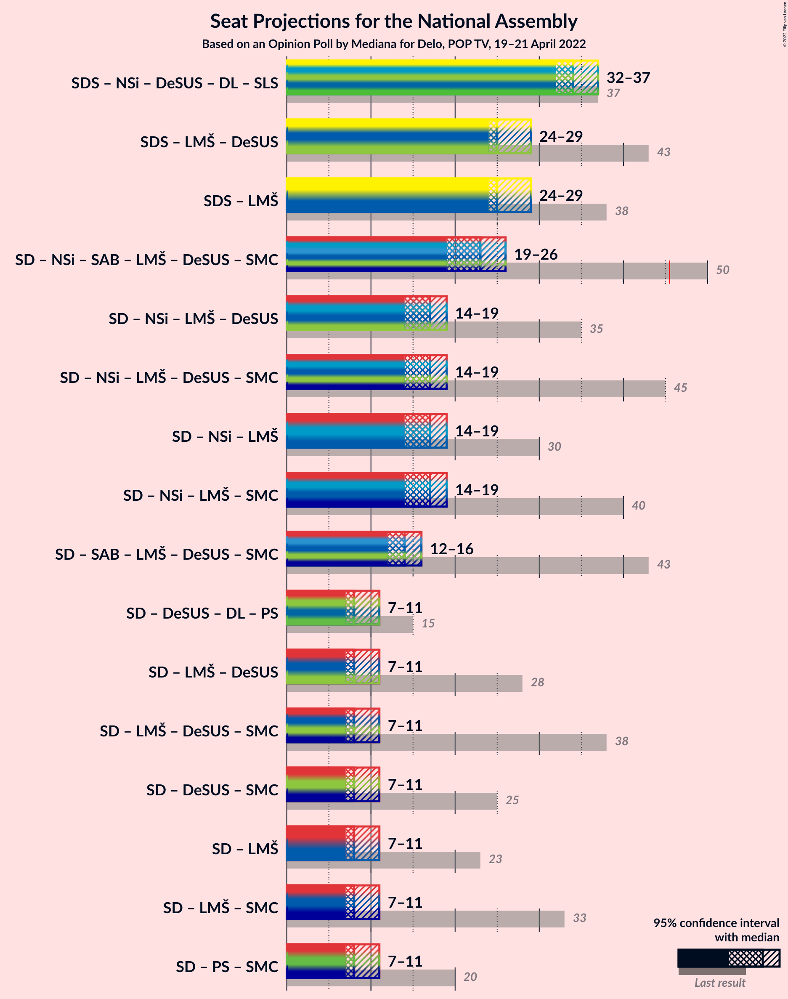

### Confidence Intervals

| Coalition | Last Result | Median | Majority? | 80% Confidence Interval | 90% Confidence Interval | 95% Confidence Interval | 99% Confidence Interval |
|:---------:|:-----------:|:------:|:---------:|:-----------------------:|:-----------------------:|:-----------------------:|:-----------------------:|
| Slovenska demokratska stranka – Lista Marjana Šarca – Demokratična stranka upokojencev Slovenije | 43 | 25 | 0% | 25–28 | 24–29 | 24–29 | 23–31 |
| Slovenska demokratska stranka – Lista Marjana Šarca | 38 | 25 | 0% | 25–28 | 24–29 | 24–29 | 23–31 |
| Socialni demokrati – Nova Slovenija–Krščanski demokrati – Lista Marjana Šarca – Demokratična stranka upokojencev Slovenije | 35 | 17 | 0% | 15–18 | 15–19 | 14–19 | 14–20 |
| Socialni demokrati – Nova Slovenija–Krščanski demokrati – Lista Marjana Šarca | 30 | 17 | 0% | 15–18 | 15–19 | 14–19 | 14–20 |
| Socialni demokrati – Lista Marjana Šarca – Demokratična stranka upokojencev Slovenije | 28 | 8 | 0% | 7–9 | 7–10 | 7–11 | 6–12 |
| Socialni demokrati – Lista Marjana Šarca | 23 | 8 | 0% | 7–9 | 7–10 | 7–11 | 6–12 |

### Slovenska demokratska stranka – Lista Marjana Šarca – Demokratična stranka upokojencev Slovenije

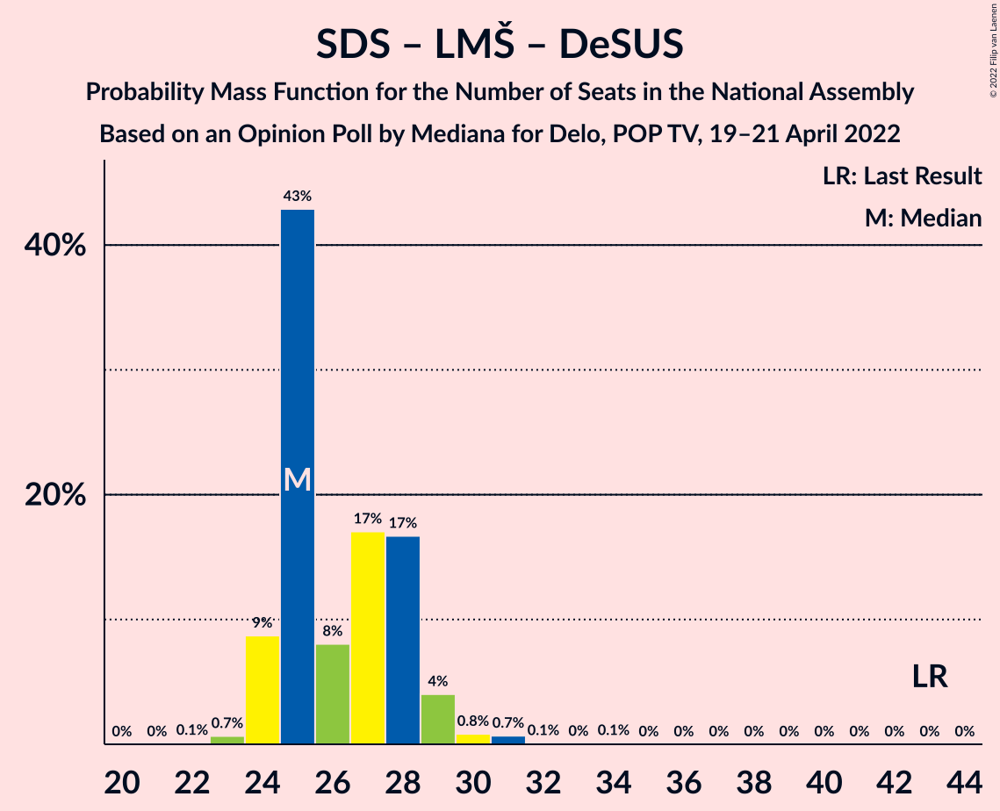

| Number of Seats | Probability | Accumulated | Special Marks |
|:---------------:|:-----------:|:-----------:|:-------------:|
| 22 | 0.1% | 100% |  |
| 23 | 0.7% | 99.9% |  |
| 24 | 9% | 99.2% |  |
| 25 | 43% | 90% | Median |
| 26 | 8% | 48% |  |
| 27 | 17% | 40% |  |
| 28 | 17% | 22% |  |
| 29 | 4% | 6% |  |
| 30 | 0.8% | 2% |  |
| 31 | 0.7% | 0.9% |  |
| 32 | 0.1% | 0.2% |  |
| 33 | 0% | 0.1% |  |
| 34 | 0.1% | 0.1% |  |
| 35 | 0% | 0% |  |
| 36 | 0% | 0% |  |
| 37 | 0% | 0% |  |
| 38 | 0% | 0% |  |
| 39 | 0% | 0% |  |
| 40 | 0% | 0% |  |
| 41 | 0% | 0% |  |
| 42 | 0% | 0% |  |
| 43 | 0% | 0% | Last Result |

### Slovenska demokratska stranka – Lista Marjana Šarca

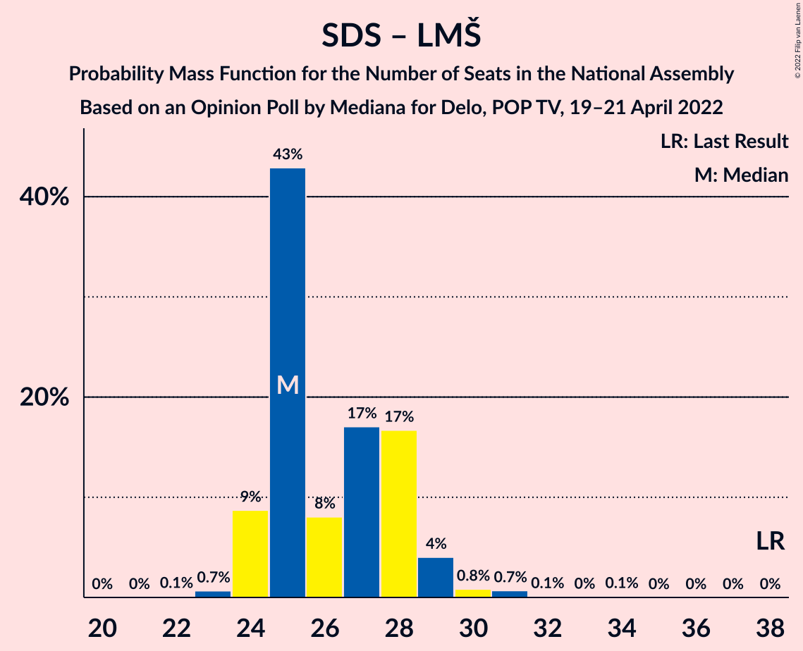

| Number of Seats | Probability | Accumulated | Special Marks |
|:---------------:|:-----------:|:-----------:|:-------------:|
| 22 | 0.1% | 100% |  |
| 23 | 0.7% | 99.9% |  |
| 24 | 9% | 99.2% |  |
| 25 | 43% | 90% | Median |
| 26 | 8% | 48% |  |
| 27 | 17% | 40% |  |
| 28 | 17% | 22% |  |
| 29 | 4% | 6% |  |
| 30 | 0.8% | 2% |  |
| 31 | 0.7% | 0.9% |  |
| 32 | 0.1% | 0.2% |  |
| 33 | 0% | 0.1% |  |
| 34 | 0.1% | 0.1% |  |
| 35 | 0% | 0% |  |
| 36 | 0% | 0% |  |
| 37 | 0% | 0% |  |
| 38 | 0% | 0% | Last Result |

### Socialni demokrati – Nova Slovenija–Krščanski demokrati – Lista Marjana Šarca – Demokratična stranka upokojencev Slovenije

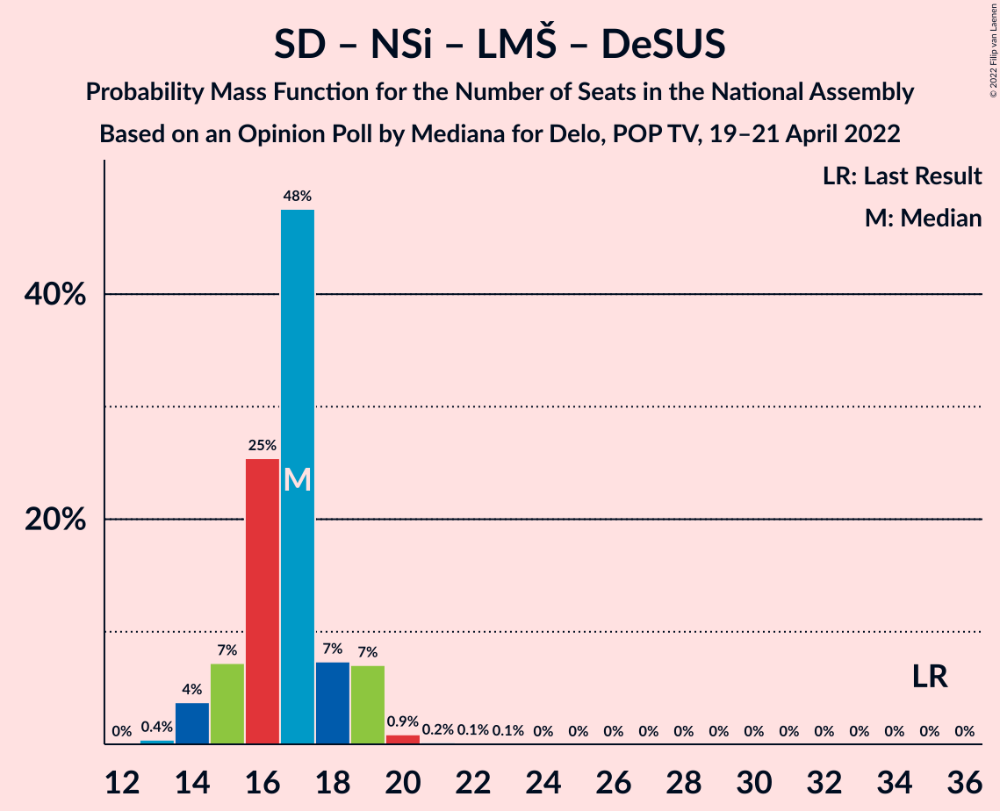

| Number of Seats | Probability | Accumulated | Special Marks |
|:---------------:|:-----------:|:-----------:|:-------------:|
| 13 | 0.4% | 100% |  |
| 14 | 4% | 99.6% |  |
| 15 | 7% | 96% |  |
| 16 | 25% | 89% |  |
| 17 | 48% | 63% | Median |
| 18 | 7% | 16% |  |
| 19 | 7% | 8% |  |
| 20 | 0.9% | 1.2% |  |
| 21 | 0.2% | 0.4% |  |
| 22 | 0.1% | 0.2% |  |
| 23 | 0.1% | 0.1% |  |
| 24 | 0% | 0% |  |
| 25 | 0% | 0% |  |
| 26 | 0% | 0% |  |
| 27 | 0% | 0% |  |
| 28 | 0% | 0% |  |
| 29 | 0% | 0% |  |
| 30 | 0% | 0% |  |
| 31 | 0% | 0% |  |
| 32 | 0% | 0% |  |
| 33 | 0% | 0% |  |
| 34 | 0% | 0% |  |
| 35 | 0% | 0% | Last Result |

### Socialni demokrati – Nova Slovenija–Krščanski demokrati – Lista Marjana Šarca

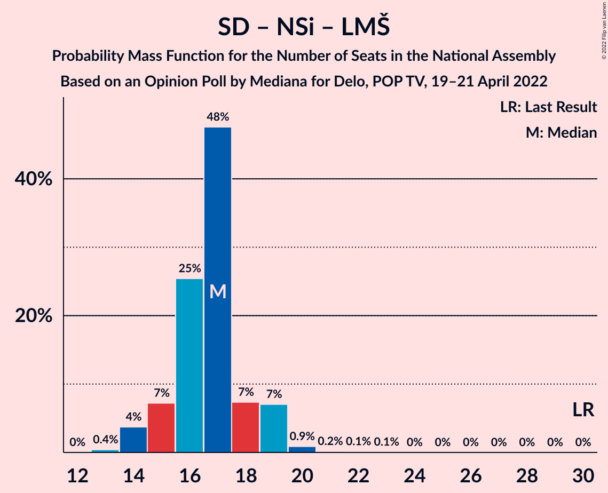

| Number of Seats | Probability | Accumulated | Special Marks |
|:---------------:|:-----------:|:-----------:|:-------------:|
| 13 | 0.4% | 100% |  |
| 14 | 4% | 99.6% |  |
| 15 | 7% | 96% |  |
| 16 | 25% | 89% |  |
| 17 | 48% | 63% | Median |
| 18 | 7% | 16% |  |
| 19 | 7% | 8% |  |
| 20 | 0.9% | 1.2% |  |
| 21 | 0.2% | 0.4% |  |
| 22 | 0.1% | 0.2% |  |
| 23 | 0.1% | 0.1% |  |
| 24 | 0% | 0% |  |
| 25 | 0% | 0% |  |
| 26 | 0% | 0% |  |
| 27 | 0% | 0% |  |
| 28 | 0% | 0% |  |
| 29 | 0% | 0% |  |
| 30 | 0% | 0% | Last Result |

### Socialni demokrati – Lista Marjana Šarca – Demokratična stranka upokojencev Slovenije

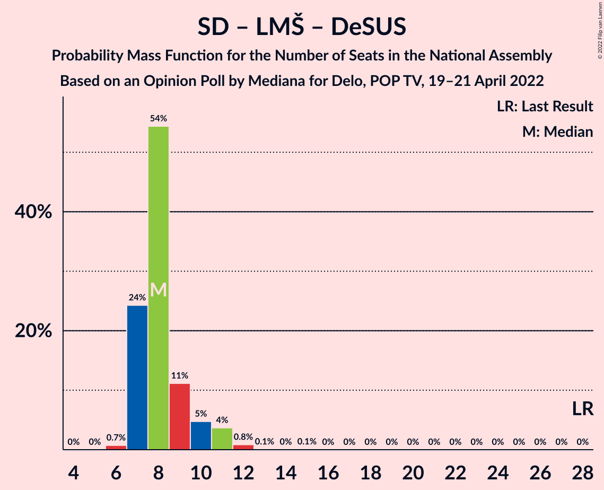

| Number of Seats | Probability | Accumulated | Special Marks |
|:---------------:|:-----------:|:-----------:|:-------------:|
| 6 | 0.7% | 100% |  |
| 7 | 24% | 99.3% |  |
| 8 | 54% | 75% | Median |
| 9 | 11% | 21% |  |
| 10 | 5% | 9% |  |
| 11 | 4% | 5% |  |
| 12 | 0.8% | 1.0% |  |
| 13 | 0.1% | 0.2% |  |
| 14 | 0% | 0.1% |  |
| 15 | 0.1% | 0.1% |  |
| 16 | 0% | 0% |  |
| 17 | 0% | 0% |  |
| 18 | 0% | 0% |  |
| 19 | 0% | 0% |  |
| 20 | 0% | 0% |  |
| 21 | 0% | 0% |  |
| 22 | 0% | 0% |  |
| 23 | 0% | 0% |  |
| 24 | 0% | 0% |  |
| 25 | 0% | 0% |  |
| 26 | 0% | 0% |  |
| 27 | 0% | 0% |  |
| 28 | 0% | 0% | Last Result |

### Socialni demokrati – Lista Marjana Šarca

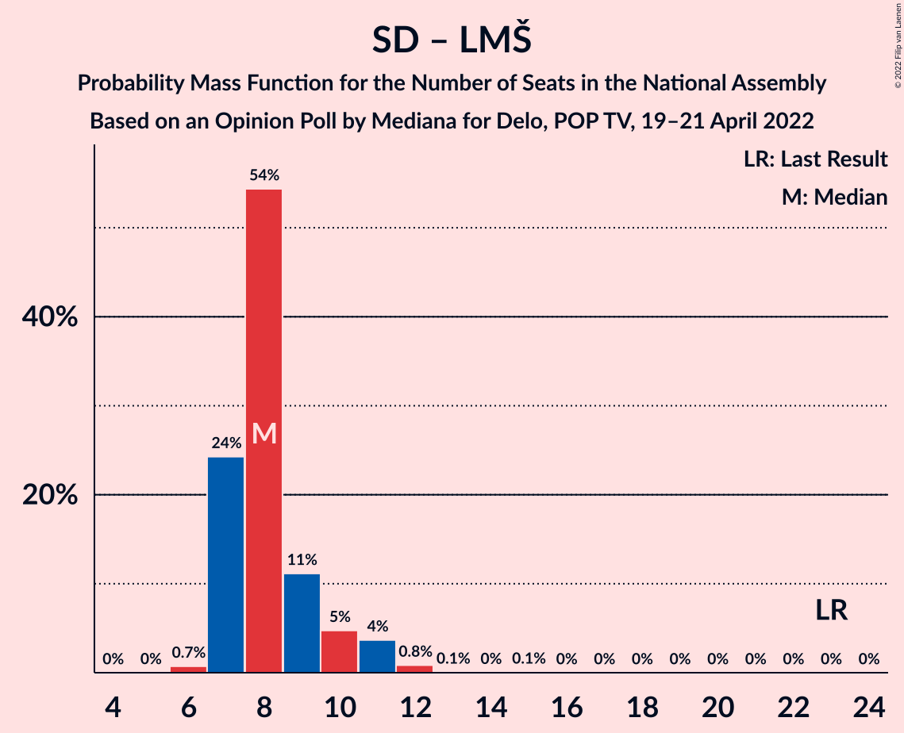

| Number of Seats | Probability | Accumulated | Special Marks |
|:---------------:|:-----------:|:-----------:|:-------------:|
| 6 | 0.7% | 100% |  |
| 7 | 24% | 99.3% |  |
| 8 | 54% | 75% | Median |
| 9 | 11% | 21% |  |
| 10 | 5% | 9% |  |
| 11 | 4% | 5% |  |
| 12 | 0.8% | 1.0% |  |
| 13 | 0.1% | 0.2% |  |
| 14 | 0% | 0.1% |  |
| 15 | 0.1% | 0.1% |  |
| 16 | 0% | 0% |  |
| 17 | 0% | 0% |  |
| 18 | 0% | 0% |  |
| 19 | 0% | 0% |  |
| 20 | 0% | 0% |  |
| 21 | 0% | 0% |  |
| 22 | 0% | 0% |  |
| 23 | 0% | 0% | Last Result |

## Technical Information

### Opinion Poll

+ **Polling firm:** Mediana
+ **Commissioner(s):** Delo, POP TV
+ **Fieldwork period:** 19–21 April 2022

### Calculations

+ **Sample size:** 1031
+ **Simulations done:** 1,048,576
+ **Error estimate:** 2.38%

