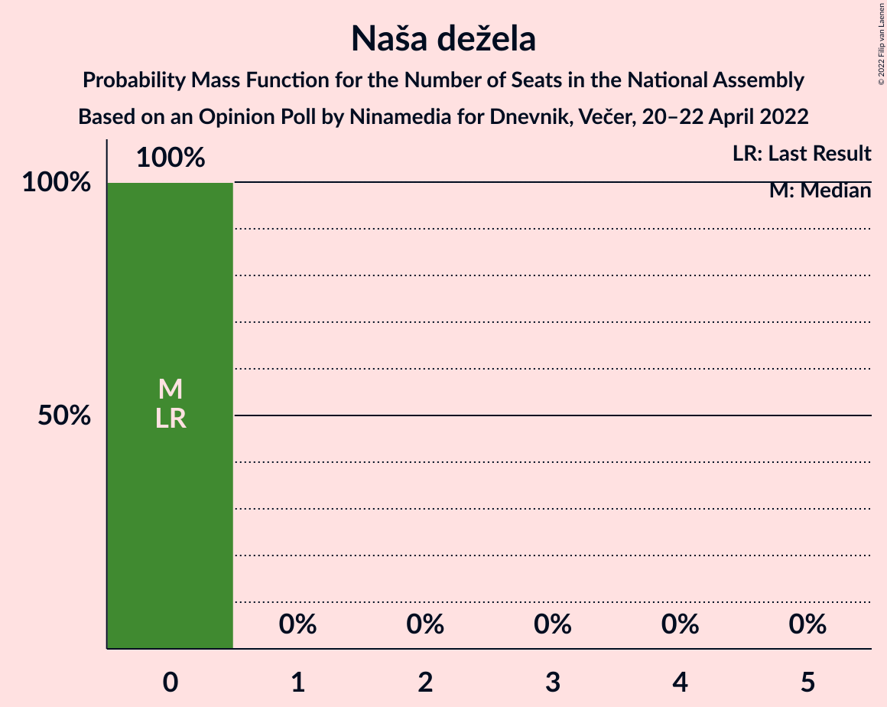

# Opinion Poll by Ninamedia for Dnevnik, Večer, 20–22 April 2022

<a href="#voting-intentions">Voting Intentions</a> | <a href="#seats">Seats</a> | <a href="#coalitions">Coalitions</a> | <a href="#technical-information">Technical Information</a>

## Voting Intentions

### Confidence Intervals

| Party | Last Result | Poll Result | 80% Confidence Interval | 90% Confidence Interval | 95% Confidence Interval | 99% Confidence Interval |
|:-----:|:-----------:|:-----------:|:-----------------------:|:-----------------------:|:-----------------------:|:-----------------------:|
| Gibanje Svoboda | 0.0% | 27.7% | 25.8–29.6% |25.3–30.2% |24.8–30.7% |24.0–31.6% |
| Slovenska demokratska stranka | 24.9% | 24.0% | 22.2–25.9% |21.7–26.4% |21.3–26.9% |20.5–27.8% |
| Socialni demokrati | 9.9% | 8.1% | 7.0–9.4% |6.8–9.8% |6.5–10.1% |6.0–10.7% |
| Levica | 9.3% | 7.1% | 6.1–8.3% |5.8–8.7% |5.6–9.0% |5.2–9.6% |
| Nova Slovenija–Krščanski demokrati | 7.2% | 6.9% | 5.9–8.1% |5.6–8.4% |5.4–8.7% |5.0–9.4% |
| Lista Marjana Šarca | 12.6% | 4.3% | 3.6–5.3% |3.4–5.6% |3.2–5.9% |2.9–6.4% |
| Stranka Alenke Bratušek | 5.1% | 4.0% | 3.3–5.0% |3.1–5.2% |2.9–5.5% |2.6–6.0% |
| Povežimo Slovenijo | 0.0% | 3.6% | 2.9–4.5% |2.7–4.8% |2.5–5.0% |2.2–5.5% |
| Resni.ca | 0.0% | 3.0% | 2.4–3.9% |2.2–4.1% |2.1–4.3% |1.8–4.8% |
| Piratska stranka Slovenije | 2.2% | 2.6% | 2.0–3.4% |1.8–3.6% |1.7–3.8% |1.5–4.2% |
| VESNA–Zelena stranka | 0.0% | 2.4% | 1.9–3.2% |1.7–3.5% |1.6–3.7% |1.4–4.1% |
| Naša dežela | 0.0% | 1.7% | 1.2–2.4% |1.1–2.6% |1.0–2.7% |0.8–3.1% |
| Slovenska nacionalna stranka | 4.2% | 1.6% | 1.1–2.2% |1.0–2.4% |0.9–2.6% |0.8–3.0% |

*Note:* The poll result column reflects the actual value used in the calculations. Published results may vary slightly, and in addition be rounded to fewer digits.

## Seats

### Confidence Intervals

| Party | Last Result | Median | 80% Confidence Interval | 90% Confidence Interval | 95% Confidence Interval | 99% Confidence Interval |
|:-----:|:-----------:|:------:|:-----------------------:|:-----------------------:|:-----------------------:|:-----------------------:|
| <a href="#gibanje-svoboda">Gibanje Svoboda</a> | 0 | 31 | 28–34 |28–34 |27–34 |26–35 |
| <a href="#slovenska-demokratska-stranka">Slovenska demokratska stranka</a> | 25 | 26 | 23–29 |23–29 |23–29 |22–30 |
| <a href="#socialni-demokrati">Socialni demokrati</a> | 10 | 10 | 7–11 |7–11 |7–11 |6–12 |
| <a href="#levica">Levica</a> | 9 | 7 | 6–9 |6–9 |6–10 |5–10 |
| <a href="#nova-slovenija–krščanski-demokrati">Nova Slovenija–Krščanski demokrati</a> | 7 | 7 | 6–9 |6–9 |5–9 |5–10 |
| <a href="#lista-marjana-šarca">Lista Marjana Šarca</a> | 13 | 4 | 0–6 |0–6 |0–6 |0–6 |
| <a href="#stranka-alenke-bratušek">Stranka Alenke Bratušek</a> | 5 | 0 | 0–5 |0–5 |0–5 |0–6 |
| <a href="#povežimo-slovenijo">Povežimo Slovenijo</a> | 0 | 0 | 0–4 |0–5 |0–5 |0–5 |
| <a href="#resni.ca">Resni.ca</a> | 0 | 0 | 0–4 |0–4 |0–4 |0–5 |
| <a href="#piratska-stranka-slovenije">Piratska stranka Slovenije</a> | 0 | 0 | 0 |0 |0 |0–4 |
| <a href="#vesna–zelena-stranka">VESNA–Zelena stranka</a> | 0 | 0 | 0 |0 |0 |0–4 |
| <a href="#naša-dežela">Naša dežela</a> | 0 | 0 | 0 |0 |0 |0 |
| <a href="#slovenska-nacionalna-stranka">Slovenska nacionalna stranka</a> | 4 | 0 | 0 |0 |0 |0 |

### Gibanje Svoboda

*For a full overview of the results for this party, see the [Gibanje Svoboda](party-gibanjesvoboda.html) page.*

| Number of Seats | Probability | Accumulated | Special Marks |
|:---------------:|:-----------:|:-----------:|:-------------:|
| 0 | 0% | 100% | Last Result |
| 1 | 0% | 100% |  |
| 2 | 0% | 100% |  |
| 3 | 0% | 100% |  |
| 4 | 0% | 100% |  |
| 5 | 0% | 100% |  |
| 6 | 0% | 100% |  |
| 7 | 0% | 100% |  |
| 8 | 0% | 100% |  |
| 9 | 0% | 100% |  |
| 10 | 0% | 100% |  |
| 11 | 0% | 100% |  |
| 12 | 0% | 100% |  |
| 13 | 0% | 100% |  |
| 14 | 0% | 100% |  |
| 15 | 0% | 100% |  |
| 16 | 0% | 100% |  |
| 17 | 0% | 100% |  |
| 18 | 0% | 100% |  |
| 19 | 0% | 100% |  |
| 20 | 0% | 100% |  |
| 21 | 0% | 100% |  |
| 22 | 0% | 100% |  |
| 23 | 0% | 100% |  |
| 24 | 0.1% | 100% |  |
| 25 | 0.3% | 99.9% |  |
| 26 | 0.7% | 99.5% |  |
| 27 | 1.4% | 98.9% |  |
| 28 | 13% | 97% |  |
| 29 | 13% | 85% |  |
| 30 | 18% | 71% |  |
| 31 | 13% | 53% | Median |
| 32 | 17% | 40% |  |
| 33 | 4% | 23% |  |
| 34 | 18% | 18% |  |
| 35 | 0.2% | 0.5% |  |
| 36 | 0.3% | 0.3% |  |
| 37 | 0% | 0% |  |

### Slovenska demokratska stranka

*For a full overview of the results for this party, see the [Slovenska demokratska stranka](party-slovenskademokratskastranka.html) page.*

| Number of Seats | Probability | Accumulated | Special Marks |
|:---------------:|:-----------:|:-----------:|:-------------:|
| 21 | 0.1% | 100% |  |
| 22 | 1.4% | 99.8% |  |
| 23 | 12% | 98% |  |
| 24 | 14% | 86% |  |
| 25 | 20% | 72% | Last Result |
| 26 | 13% | 52% | Median |
| 27 | 8% | 39% |  |
| 28 | 10% | 31% |  |
| 29 | 20% | 21% |  |
| 30 | 0.6% | 0.9% |  |
| 31 | 0.2% | 0.4% |  |
| 32 | 0.1% | 0.2% |  |
| 33 | 0.1% | 0.1% |  |
| 34 | 0% | 0% |  |

### Socialni demokrati

*For a full overview of the results for this party, see the [Socialni demokrati](party-socialnidemokrati.html) page.*

| Number of Seats | Probability | Accumulated | Special Marks |
|:---------------:|:-----------:|:-----------:|:-------------:|
| 5 | 0.3% | 100% |  |
| 6 | 2% | 99.7% |  |
| 7 | 15% | 98% |  |
| 8 | 14% | 83% |  |
| 9 | 12% | 69% |  |
| 10 | 30% | 57% | Last Result, Median |
| 11 | 26% | 27% |  |
| 12 | 0.6% | 0.6% |  |
| 13 | 0% | 0% |  |

### Levica

*For a full overview of the results for this party, see the [Levica](party-levica.html) page.*

| Number of Seats | Probability | Accumulated | Special Marks |
|:---------------:|:-----------:|:-----------:|:-------------:|
| 5 | 1.3% | 100% |  |
| 6 | 23% | 98.7% |  |
| 7 | 39% | 76% | Median |
| 8 | 20% | 37% |  |
| 9 | 14% | 17% | Last Result |
| 10 | 3% | 3% |  |
| 11 | 0.3% | 0.3% |  |
| 12 | 0% | 0% |  |

### Nova Slovenija–Krščanski demokrati

*For a full overview of the results for this party, see the [Nova Slovenija–Krščanski demokrati](party-novaslovenija–krščanskidemokrati.html) page.*

| Number of Seats | Probability | Accumulated | Special Marks |
|:---------------:|:-----------:|:-----------:|:-------------:|
| 5 | 3% | 100% |  |
| 6 | 26% | 97% |  |
| 7 | 30% | 72% | Last Result, Median |
| 8 | 32% | 42% |  |
| 9 | 9% | 10% |  |
| 10 | 1.3% | 1.4% |  |
| 11 | 0.1% | 0.1% |  |
| 12 | 0% | 0% |  |

### Lista Marjana Šarca

*For a full overview of the results for this party, see the [Lista Marjana Šarca](party-listamarjanašarca.html) page.*

| Number of Seats | Probability | Accumulated | Special Marks |
|:---------------:|:-----------:|:-----------:|:-------------:|
| 0 | 42% | 100% |  |
| 1 | 0% | 58% |  |
| 2 | 0% | 58% |  |
| 3 | 0% | 58% |  |
| 4 | 22% | 58% | Median |
| 5 | 23% | 36% |  |
| 6 | 13% | 13% |  |
| 7 | 0.4% | 0.4% |  |
| 8 | 0% | 0% |  |
| 9 | 0% | 0% |  |
| 10 | 0% | 0% |  |
| 11 | 0% | 0% |  |
| 12 | 0% | 0% |  |
| 13 | 0% | 0% | Last Result |

### Stranka Alenke Bratušek

*For a full overview of the results for this party, see the [Stranka Alenke Bratušek](party-strankaalenkebratušek.html) page.*

| Number of Seats | Probability | Accumulated | Special Marks |
|:---------------:|:-----------:|:-----------:|:-------------:|
| 0 | 50% | 100% | Median |
| 1 | 0% | 50% |  |
| 2 | 0% | 50% |  |
| 3 | 0% | 50% |  |
| 4 | 24% | 50% |  |
| 5 | 23% | 26% | Last Result |
| 6 | 2% | 2% |  |
| 7 | 0.1% | 0.1% |  |
| 8 | 0% | 0% |  |

### Povežimo Slovenijo

*For a full overview of the results for this party, see the [Povežimo Slovenijo](party-povežimoslovenijo.html) page.*

| Number of Seats | Probability | Accumulated | Special Marks |
|:---------------:|:-----------:|:-----------:|:-------------:|
| 0 | 81% | 100% | Last Result, Median |
| 1 | 0% | 19% |  |
| 2 | 0% | 19% |  |
| 3 | 0% | 19% |  |
| 4 | 11% | 19% |  |
| 5 | 8% | 8% |  |
| 6 | 0.3% | 0.4% |  |
| 7 | 0.1% | 0.1% |  |
| 8 | 0% | 0% |  |

### Resni.ca

*For a full overview of the results for this party, see the [Resni.ca](party-resnica.html) page.*

| Number of Seats | Probability | Accumulated | Special Marks |
|:---------------:|:-----------:|:-----------:|:-------------:|
| 0 | 83% | 100% | Last Result, Median |
| 1 | 0% | 17% |  |
| 2 | 0% | 17% |  |
| 3 | 0% | 17% |  |
| 4 | 16% | 17% |  |
| 5 | 0.6% | 1.0% |  |
| 6 | 0.4% | 0.4% |  |
| 7 | 0% | 0% |  |

### Piratska stranka Slovenije

*For a full overview of the results for this party, see the [Piratska stranka Slovenije](party-piratskastrankaslovenije.html) page.*

| Number of Seats | Probability | Accumulated | Special Marks |
|:---------------:|:-----------:|:-----------:|:-------------:|
| 0 | 99.0% | 100% | Last Result, Median |
| 1 | 0% | 1.0% |  |
| 2 | 0% | 1.0% |  |
| 3 | 0% | 1.0% |  |
| 4 | 0.9% | 1.0% |  |
| 5 | 0.1% | 0.1% |  |
| 6 | 0% | 0% |  |

### VESNA–Zelena stranka

*For a full overview of the results for this party, see the [VESNA–Zelena stranka](party-vesna–zelenastranka.html) page.*

| Number of Seats | Probability | Accumulated | Special Marks |
|:---------------:|:-----------:|:-----------:|:-------------:|
| 0 | 98.8% | 100% | Last Result, Median |
| 1 | 0% | 1.2% |  |
| 2 | 0% | 1.2% |  |
| 3 | 0% | 1.2% |  |
| 4 | 1.1% | 1.2% |  |
| 5 | 0.1% | 0.1% |  |
| 6 | 0% | 0% |  |

### Naša dežela

*For a full overview of the results for this party, see the [Naša dežela](party-našadežela.html) page.*

| Number of Seats | Probability | Accumulated | Special Marks |
|:---------------:|:-----------:|:-----------:|:-------------:|
| 0 | 100% | 100% | Last Result, Median |

### Slovenska nacionalna stranka

*For a full overview of the results for this party, see the [Slovenska nacionalna stranka](party-slovenskanacionalnastranka.html) page.*

| Number of Seats | Probability | Accumulated | Special Marks |
|:---------------:|:-----------:|:-----------:|:-------------:|
| 0 | 100% | 100% | Median |
| 1 | 0% | 0% |  |
| 2 | 0% | 0% |  |
| 3 | 0% | 0% |  |
| 4 | 0% | 0% | Last Result |

## Coalitions

### Confidence Intervals

| Coalition | Last Result | Median | Majority? | 80% Confidence Interval | 90% Confidence Interval | 95% Confidence Interval | 99% Confidence Interval |
|:---------:|:-----------:|:------:|:---------:|:-----------------------:|:-----------------------:|:-----------------------:|:-----------------------:|
| Slovenska demokratska stranka – Lista Marjana Šarca | 38 | 29 | 0% | 27–31 | 26–32 | 25–33 | 24–34 |
| Socialni demokrati – Nova Slovenija–Krščanski demokrati – Lista Marjana Šarca | 30 | 19 | 0% | 16–22 | 15–22 | 14–24 | 13–24 |
| Socialni demokrati – Lista Marjana Šarca | 23 | 12 | 0% | 8–16 | 7–16 | 7–16 | 6–16 |

### Slovenska demokratska stranka – Lista Marjana Šarca

| Number of Seats | Probability | Accumulated | Special Marks |
|:---------------:|:-----------:|:-----------:|:-------------:|
| 22 | 0.2% | 100% |  |
| 23 | 0.2% | 99.8% |  |
| 24 | 0.9% | 99.7% |  |
| 25 | 3% | 98.8% |  |
| 26 | 5% | 96% |  |
| 27 | 12% | 91% |  |
| 28 | 26% | 80% |  |
| 29 | 23% | 54% |  |
| 30 | 8% | 31% | Median |
| 31 | 16% | 23% |  |
| 32 | 3% | 6% |  |
| 33 | 3% | 4% |  |
| 34 | 0.3% | 0.8% |  |
| 35 | 0.3% | 0.5% |  |
| 36 | 0.1% | 0.2% |  |
| 37 | 0.1% | 0.1% |  |
| 38 | 0% | 0% | Last Result |

### Socialni demokrati – Nova Slovenija–Krščanski demokrati – Lista Marjana Šarca

| Number of Seats | Probability | Accumulated | Special Marks |
|:---------------:|:-----------:|:-----------:|:-------------:|
| 12 | 0.1% | 100% |  |
| 13 | 0.4% | 99.9% |  |
| 14 | 3% | 99.5% |  |
| 15 | 7% | 97% |  |
| 16 | 5% | 90% |  |
| 17 | 5% | 85% |  |
| 18 | 3% | 79% |  |
| 19 | 29% | 76% |  |
| 20 | 9% | 47% |  |
| 21 | 21% | 39% | Median |
| 22 | 14% | 18% |  |
| 23 | 0.9% | 4% |  |
| 24 | 3% | 3% |  |
| 25 | 0.1% | 0.2% |  |
| 26 | 0.1% | 0.1% |  |
| 27 | 0% | 0% |  |
| 28 | 0% | 0% |  |
| 29 | 0% | 0% |  |
| 30 | 0% | 0% | Last Result |

### Socialni demokrati – Lista Marjana Šarca

| Number of Seats | Probability | Accumulated | Special Marks |
|:---------------:|:-----------:|:-----------:|:-------------:|
| 6 | 0.5% | 100% |  |
| 7 | 5% | 99.5% |  |
| 8 | 5% | 94% |  |
| 9 | 6% | 89% |  |
| 10 | 3% | 84% |  |
| 11 | 26% | 81% |  |
| 12 | 11% | 54% |  |
| 13 | 5% | 44% |  |
| 14 | 22% | 39% | Median |
| 15 | 4% | 18% |  |
| 16 | 13% | 14% |  |
| 17 | 0.3% | 0.3% |  |
| 18 | 0.1% | 0.1% |  |
| 19 | 0% | 0% |  |
| 20 | 0% | 0% |  |
| 21 | 0% | 0% |  |
| 22 | 0% | 0% |  |
| 23 | 0% | 0% | Last Result |

## Technical Information

### Opinion Poll

+ **Polling firm:** Ninamedia
+ **Commissioner(s):** Dnevnik, Večer
+ **Fieldwork period:** 20–22 April 2022

### Calculations

+ **Sample size:** 900
+ **Simulations done:** 1,048,576
+ **Error estimate:** 2.39%

