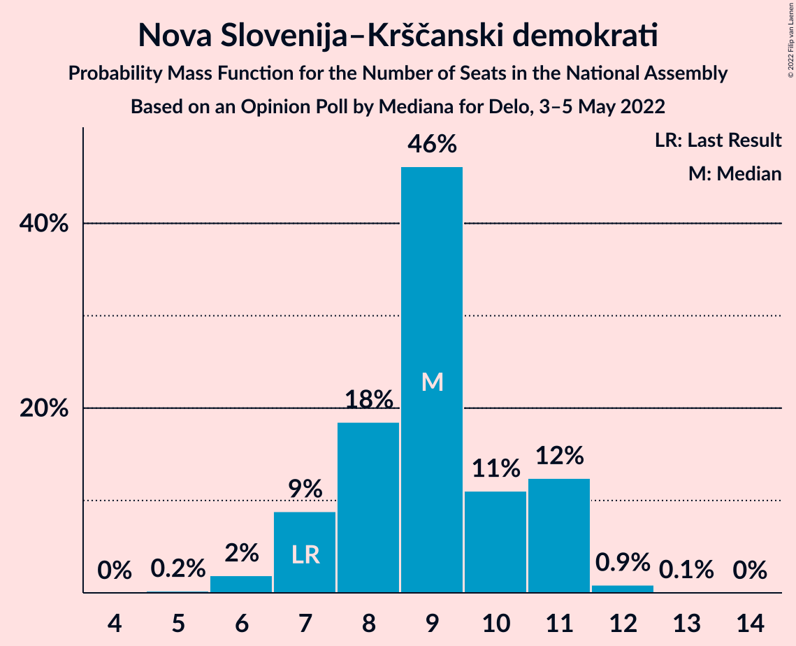
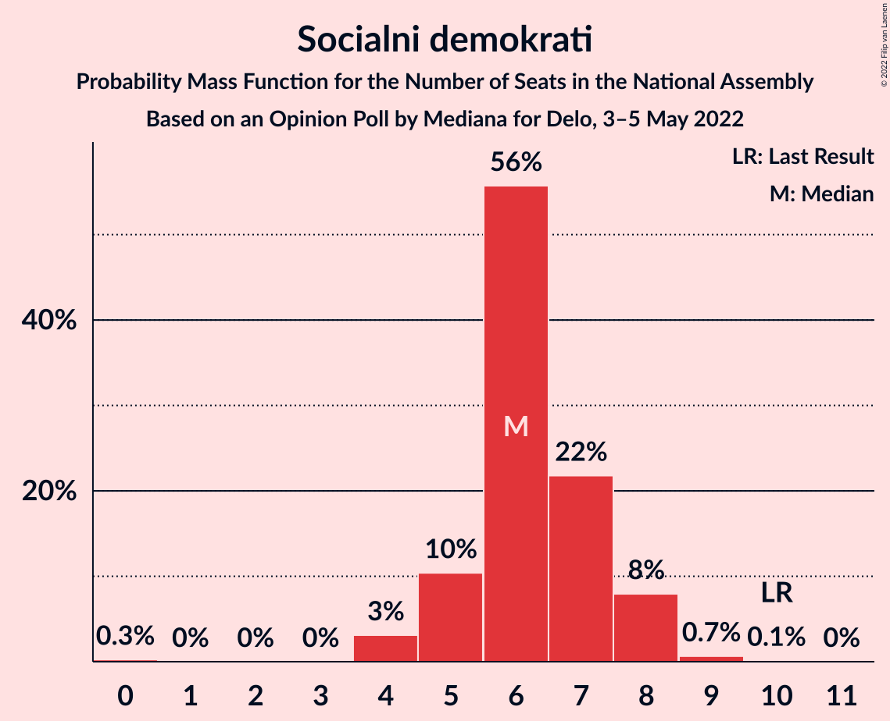
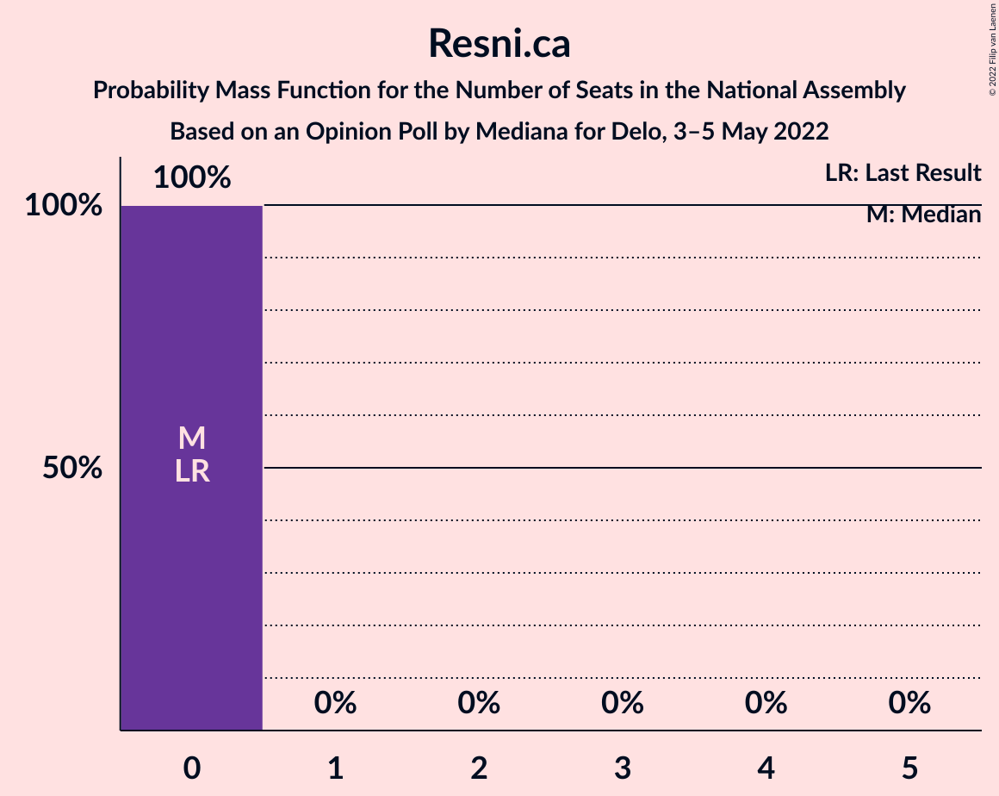
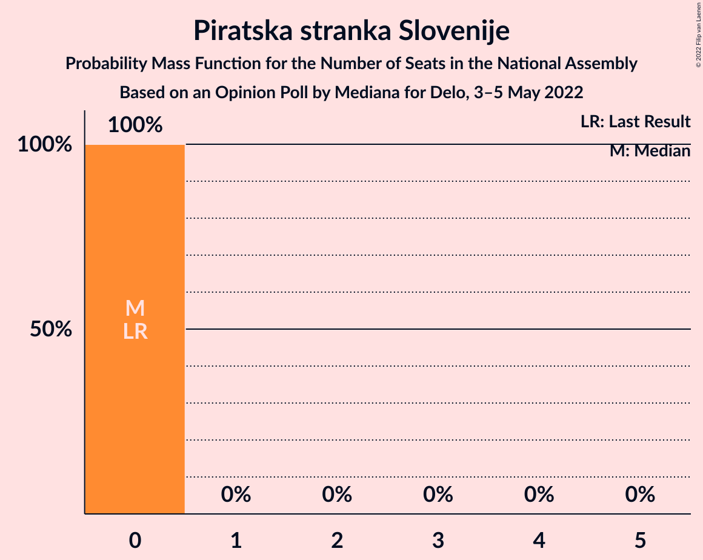
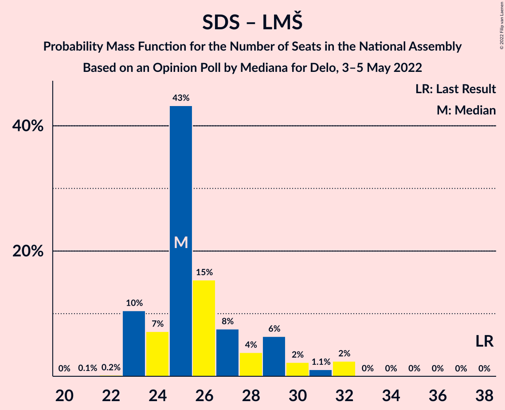

# Opinion Poll by Mediana for Delo, 3–5 May 2022

<a href="#voting-intentions">Voting Intentions</a> | <a href="#seats">Seats</a> | <a href="#coalitions">Coalitions</a> | <a href="#technical-information">Technical Information</a>

## Voting Intentions

### Confidence Intervals

| Party | Last Result | Poll Result | 80% Confidence Interval | 90% Confidence Interval | 95% Confidence Interval | 99% Confidence Interval |
|:-----:|:-----------:|:-----------:|:-----------------------:|:-----------------------:|:-----------------------:|:-----------------------:|
| Gibanje Svoboda | 0.0% | 36.8% | 34.5–39.2% |33.9–39.9% |33.3–40.4% |32.3–41.6% |
| Slovenska demokratska stranka | 24.9% | 25.2% | 23.2–27.4% |22.7–28.0% |22.2–28.6% |21.2–29.6% |
| Nova Slovenija–Krščanski demokrati | 7.2% | 8.5% | 7.3–10.0% |6.9–10.4% |6.6–10.7% |6.1–11.5% |
| Socialni demokrati | 9.9% | 6.2% | 5.2–7.5% |4.9–7.9% |4.6–8.2% |4.2–8.9% |
| Levica | 9.3% | 5.9% | 4.9–7.2% |4.6–7.6% |4.4–7.9% |4.0–8.6% |
| Lista Marjana Šarca | 12.6% | 3.0% | 2.3–4.0% |2.1–4.2% |2.0–4.5% |1.7–5.0% |
| Povežimo Slovenijo | 0.0% | 2.8% | 2.2–3.8% |2.0–4.1% |1.8–4.3% |1.6–4.8% |
| Stranka Alenke Bratušek | 5.1% | 2.7% | 2.0–3.6% |1.9–3.9% |1.7–4.2% |1.5–4.7% |
| VESNA–Zelena stranka | 0.0% | 1.6% | 1.1–2.3% |1.0–2.6% |0.9–2.8% |0.7–3.2% |
| Slovenska nacionalna stranka | 4.2% | 1.3% | 0.9–2.0% |0.8–2.2% |0.7–2.4% |0.5–2.8% |
| Naša dežela | 0.0% | 1.0% | 0.7–1.7% |0.5–1.8% |0.5–2.0% |0.4–2.4% |
| Resni.ca | 0.0% | 1.0% | 0.7–1.7% |0.5–1.8% |0.5–2.0% |0.4–2.4% |
| Piratska stranka Slovenije | 2.2% | 0.6% | 0.3–1.1% |0.3–1.3% |0.2–1.4% |0.1–1.8% |

*Note:* The poll result column reflects the actual value used in the calculations. Published results may vary slightly, and in addition be rounded to fewer digits.

## Seats

### Confidence Intervals

| Party | Last Result | Median | 80% Confidence Interval | 90% Confidence Interval | 95% Confidence Interval | 99% Confidence Interval |
|:-----:|:-----------:|:------:|:-----------------------:|:-----------------------:|:-----------------------:|:-----------------------:|
| <a href="#gibanje-svoboda">Gibanje Svoboda</a> | 0 | 39 | 36–42 |35–43 |35–43 |33–45 |
| <a href="#slovenska-demokratska-stranka">Slovenska demokratska stranka</a> | 25 | 25 | 23–28 |23–29 |23–31 |22–32 |
| <a href="#nova-slovenija–krščanski-demokrati">Nova Slovenija–Krščanski demokrati</a> | 7 | 9 | 7–11 |7–11 |7–11 |6–12 |
| <a href="#socialni-demokrati">Socialni demokrati</a> | 10 | 6 | 5–7 |5–8 |4–8 |4–9 |
| <a href="#levica">Levica</a> | 9 | 6 | 5–7 |4–8 |4–8 |0–9 |
| <a href="#lista-marjana-šarca">Lista Marjana Šarca</a> | 13 | 0 | 0 |0–4 |0–4 |0–5 |
| <a href="#povežimo-slovenijo">Povežimo Slovenijo</a> | 0 | 0 | 0 |0–4 |0–4 |0–5 |
| <a href="#stranka-alenke-bratušek">Stranka Alenke Bratušek</a> | 5 | 0 | 0 |0 |0 |0–4 |
| <a href="#vesna–zelena-stranka">VESNA–Zelena stranka</a> | 0 | 0 | 0 |0 |0 |0 |
| <a href="#slovenska-nacionalna-stranka">Slovenska nacionalna stranka</a> | 4 | 0 | 0 |0 |0 |0 |
| <a href="#naša-dežela">Naša dežela</a> | 0 | 0 | 0 |0 |0 |0 |
| <a href="#resni.ca">Resni.ca</a> | 0 | 0 | 0 |0 |0 |0 |
| <a href="#piratska-stranka-slovenije">Piratska stranka Slovenije</a> | 0 | 0 | 0 |0 |0 |0 |

### Gibanje Svoboda

*For a full overview of the results for this party, see the [Gibanje Svoboda](party-gibanjesvoboda.html) page.*

| Number of Seats | Probability | Accumulated | Special Marks |
|:---------------:|:-----------:|:-----------:|:-------------:|
| 0 | 0% | 100% | Last Result |
| 1 | 0% | 100% |  |
| 2 | 0% | 100% |  |
| 3 | 0% | 100% |  |
| 4 | 0% | 100% |  |
| 5 | 0% | 100% |  |
| 6 | 0% | 100% |  |
| 7 | 0% | 100% |  |
| 8 | 0% | 100% |  |
| 9 | 0% | 100% |  |
| 10 | 0% | 100% |  |
| 11 | 0% | 100% |  |
| 12 | 0% | 100% |  |
| 13 | 0% | 100% |  |
| 14 | 0% | 100% |  |
| 15 | 0% | 100% |  |
| 16 | 0% | 100% |  |
| 17 | 0% | 100% |  |
| 18 | 0% | 100% |  |
| 19 | 0% | 100% |  |
| 20 | 0% | 100% |  |
| 21 | 0% | 100% |  |
| 22 | 0% | 100% |  |
| 23 | 0% | 100% |  |
| 24 | 0% | 100% |  |
| 25 | 0% | 100% |  |
| 26 | 0% | 100% |  |
| 27 | 0% | 100% |  |
| 28 | 0% | 100% |  |
| 29 | 0% | 100% |  |
| 30 | 0% | 100% |  |
| 31 | 0% | 100% |  |
| 32 | 0.4% | 100% |  |
| 33 | 0.4% | 99.6% |  |
| 34 | 2% | 99.2% |  |
| 35 | 4% | 98% |  |
| 36 | 6% | 93% |  |
| 37 | 19% | 87% |  |
| 38 | 14% | 69% |  |
| 39 | 9% | 55% | Median |
| 40 | 4% | 45% |  |
| 41 | 3% | 42% |  |
| 42 | 33% | 38% |  |
| 43 | 5% | 6% |  |
| 44 | 0.1% | 1.4% |  |
| 45 | 1.2% | 1.3% |  |
| 46 | 0.1% | 0.1% | Majority |
| 47 | 0% | 0% |  |

### Slovenska demokratska stranka

*For a full overview of the results for this party, see the [Slovenska demokratska stranka](party-slovenskademokratskastranka.html) page.*

| Number of Seats | Probability | Accumulated | Special Marks |
|:---------------:|:-----------:|:-----------:|:-------------:|
| 21 | 0.2% | 100% |  |
| 22 | 2% | 99.8% |  |
| 23 | 11% | 98% |  |
| 24 | 8% | 86% |  |
| 25 | 43% | 78% | Last Result, Median |
| 26 | 15% | 35% |  |
| 27 | 8% | 20% |  |
| 28 | 2% | 12% |  |
| 29 | 6% | 10% |  |
| 30 | 0.9% | 3% |  |
| 31 | 0.9% | 3% |  |
| 32 | 2% | 2% |  |
| 33 | 0% | 0% |  |

### Nova Slovenija–Krščanski demokrati

*For a full overview of the results for this party, see the [Nova Slovenija–Krščanski demokrati](party-novaslovenija–krščanskidemokrati.html) page.*

| Number of Seats | Probability | Accumulated | Special Marks |
|:---------------:|:-----------:|:-----------:|:-------------:|
| 5 | 0.2% | 100% |  |
| 6 | 2% | 99.8% |  |
| 7 | 9% | 98% | Last Result |
| 8 | 18% | 89% |  |
| 9 | 46% | 71% | Median |
| 10 | 11% | 24% |  |
| 11 | 12% | 13% |  |
| 12 | 0.9% | 1.0% |  |
| 13 | 0.1% | 0.1% |  |
| 14 | 0% | 0% |  |

### Socialni demokrati

*For a full overview of the results for this party, see the [Socialni demokrati](party-socialnidemokrati.html) page.*

| Number of Seats | Probability | Accumulated | Special Marks |
|:---------------:|:-----------:|:-----------:|:-------------:|
| 0 | 0.3% | 100% |  |
| 1 | 0% | 99.7% |  |
| 2 | 0% | 99.7% |  |
| 3 | 0% | 99.7% |  |
| 4 | 3% | 99.7% |  |
| 5 | 10% | 97% |  |
| 6 | 56% | 86% | Median |
| 7 | 22% | 31% |  |
| 8 | 8% | 9% |  |
| 9 | 0.7% | 0.8% |  |
| 10 | 0.1% | 0.1% | Last Result |
| 11 | 0% | 0% |  |

### Levica

*For a full overview of the results for this party, see the [Levica](party-levica.html) page.*

| Number of Seats | Probability | Accumulated | Special Marks |
|:---------------:|:-----------:|:-----------:|:-------------:|
| 0 | 1.1% | 100% |  |
| 1 | 0% | 98.9% |  |
| 2 | 0% | 98.9% |  |
| 3 | 0% | 98.9% |  |
| 4 | 4% | 98.9% |  |
| 5 | 16% | 95% |  |
| 6 | 57% | 78% | Median |
| 7 | 13% | 21% |  |
| 8 | 6% | 8% |  |
| 9 | 1.4% | 2% | Last Result |
| 10 | 0.3% | 0.3% |  |
| 11 | 0% | 0% |  |

### Lista Marjana Šarca

*For a full overview of the results for this party, see the [Lista Marjana Šarca](party-listamarjanašarca.html) page.*

| Number of Seats | Probability | Accumulated | Special Marks |
|:---------------:|:-----------:|:-----------:|:-------------:|
| 0 | 94% | 100% | Median |
| 1 | 0% | 6% |  |
| 2 | 0% | 6% |  |
| 3 | 0% | 6% |  |
| 4 | 5% | 6% |  |
| 5 | 1.4% | 2% |  |
| 6 | 0.1% | 0.1% |  |
| 7 | 0% | 0% |  |
| 8 | 0% | 0% |  |
| 9 | 0% | 0% |  |
| 10 | 0% | 0% |  |
| 11 | 0% | 0% |  |
| 12 | 0% | 0% |  |
| 13 | 0% | 0% | Last Result |

### Povežimo Slovenijo

*For a full overview of the results for this party, see the [Povežimo Slovenijo](party-povežimoslovenijo.html) page.*

| Number of Seats | Probability | Accumulated | Special Marks |
|:---------------:|:-----------:|:-----------:|:-------------:|
| 0 | 93% | 100% | Last Result, Median |
| 1 | 0% | 7% |  |
| 2 | 0% | 7% |  |
| 3 | 0% | 7% |  |
| 4 | 7% | 7% |  |
| 5 | 0.9% | 0.9% |  |
| 6 | 0% | 0% |  |

### Stranka Alenke Bratušek

*For a full overview of the results for this party, see the [Stranka Alenke Bratušek](party-strankaalenkebratušek.html) page.*

| Number of Seats | Probability | Accumulated | Special Marks |
|:---------------:|:-----------:|:-----------:|:-------------:|
| 0 | 98% | 100% | Median |
| 1 | 0% | 2% |  |
| 2 | 0% | 2% |  |
| 3 | 0% | 2% |  |
| 4 | 2% | 2% |  |
| 5 | 0.4% | 0.4% | Last Result |
| 6 | 0% | 0% |  |

### VESNA–Zelena stranka

*For a full overview of the results for this party, see the [VESNA–Zelena stranka](party-vesna–zelenastranka.html) page.*

| Number of Seats | Probability | Accumulated | Special Marks |
|:---------------:|:-----------:|:-----------:|:-------------:|
| 0 | 100% | 100% | Last Result, Median |

### Slovenska nacionalna stranka

*For a full overview of the results for this party, see the [Slovenska nacionalna stranka](party-slovenskanacionalnastranka.html) page.*

| Number of Seats | Probability | Accumulated | Special Marks |
|:---------------:|:-----------:|:-----------:|:-------------:|
| 0 | 100% | 100% | Median |
| 1 | 0% | 0% |  |
| 2 | 0% | 0% |  |
| 3 | 0% | 0% |  |
| 4 | 0% | 0% | Last Result |

### Naša dežela

*For a full overview of the results for this party, see the [Naša dežela](party-našadežela.html) page.*

| Number of Seats | Probability | Accumulated | Special Marks |
|:---------------:|:-----------:|:-----------:|:-------------:|
| 0 | 100% | 100% | Last Result, Median |

### Resni.ca

*For a full overview of the results for this party, see the [Resni.ca](party-resnica.html) page.*

| Number of Seats | Probability | Accumulated | Special Marks |
|:---------------:|:-----------:|:-----------:|:-------------:|
| 0 | 100% | 100% | Last Result, Median |

### Piratska stranka Slovenije

*For a full overview of the results for this party, see the [Piratska stranka Slovenije](party-piratskastrankaslovenije.html) page.*

| Number of Seats | Probability | Accumulated | Special Marks |
|:---------------:|:-----------:|:-----------:|:-------------:|
| 0 | 100% | 100% | Last Result, Median |

## Coalitions

### Confidence Intervals

| Coalition | Last Result | Median | Majority? | 80% Confidence Interval | 90% Confidence Interval | 95% Confidence Interval | 99% Confidence Interval |
|:---------:|:-----------:|:------:|:---------:|:-----------------------:|:-----------------------:|:-----------------------:|:-----------------------:|
| Slovenska demokratska stranka – Lista Marjana Šarca | 38 | 25 | 0% | 23–29 | 23–30 | 23–32 | 23–32 |
| Nova Slovenija–Krščanski demokrati – Socialni demokrati – Lista Marjana Šarca | 30 | 15 | 0% | 14–17 | 13–19 | 13–19 | 11–20 |
| Socialni demokrati – Lista Marjana Šarca | 23 | 6 | 0% | 6–8 | 5–9 | 5–10 | 4–12 |

### Slovenska demokratska stranka – Lista Marjana Šarca

| Number of Seats | Probability | Accumulated | Special Marks |
|:---------------:|:-----------:|:-----------:|:-------------:|
| 21 | 0.1% | 100% |  |
| 22 | 0.2% | 99.9% |  |
| 23 | 10% | 99.7% |  |
| 24 | 7% | 89% |  |
| 25 | 43% | 82% | Median |
| 26 | 15% | 39% |  |
| 27 | 8% | 23% |  |
| 28 | 4% | 16% |  |
| 29 | 6% | 12% |  |
| 30 | 2% | 6% |  |
| 31 | 1.1% | 4% |  |
| 32 | 2% | 3% |  |
| 33 | 0% | 0.1% |  |
| 34 | 0% | 0.1% |  |
| 35 | 0% | 0% |  |
| 36 | 0% | 0% |  |
| 37 | 0% | 0% |  |
| 38 | 0% | 0% | Last Result |

### Nova Slovenija–Krščanski demokrati – Socialni demokrati – Lista Marjana Šarca

| Number of Seats | Probability | Accumulated | Special Marks |
|:---------------:|:-----------:|:-----------:|:-------------:|
| 9 | 0.1% | 100% |  |
| 10 | 0.1% | 99.9% |  |
| 11 | 0.6% | 99.7% |  |
| 12 | 0.8% | 99.2% |  |
| 13 | 6% | 98% |  |
| 14 | 12% | 92% |  |
| 15 | 42% | 80% | Median |
| 16 | 17% | 38% |  |
| 17 | 12% | 21% |  |
| 18 | 2% | 8% |  |
| 19 | 6% | 7% |  |
| 20 | 0.3% | 0.7% |  |
| 21 | 0.3% | 0.4% |  |
| 22 | 0.1% | 0.1% |  |
| 23 | 0% | 0% |  |
| 24 | 0% | 0% |  |
| 25 | 0% | 0% |  |
| 26 | 0% | 0% |  |
| 27 | 0% | 0% |  |
| 28 | 0% | 0% |  |
| 29 | 0% | 0% |  |
| 30 | 0% | 0% | Last Result |

### Socialni demokrati – Lista Marjana Šarca

| Number of Seats | Probability | Accumulated | Special Marks |
|:---------------:|:-----------:|:-----------:|:-------------:|
| 0 | 0.2% | 100% |  |
| 1 | 0% | 99.8% |  |
| 2 | 0% | 99.8% |  |
| 3 | 0% | 99.8% |  |
| 4 | 2% | 99.8% |  |
| 5 | 8% | 98% |  |
| 6 | 55% | 90% | Median |
| 7 | 21% | 35% |  |
| 8 | 8% | 14% |  |
| 9 | 4% | 7% |  |
| 10 | 0.6% | 3% |  |
| 11 | 1.0% | 2% |  |
| 12 | 1.1% | 1.2% |  |
| 13 | 0.1% | 0.1% |  |
| 14 | 0% | 0% |  |
| 15 | 0% | 0% |  |
| 16 | 0% | 0% |  |
| 17 | 0% | 0% |  |
| 18 | 0% | 0% |  |
| 19 | 0% | 0% |  |
| 20 | 0% | 0% |  |
| 21 | 0% | 0% |  |
| 22 | 0% | 0% |  |
| 23 | 0% | 0% | Last Result |

## Technical Information

### Opinion Poll

+ **Polling firm:** Mediana
+ **Commissioner(s):** Delo
+ **Fieldwork period:** 3–5 May 2022

### Calculations

+ **Sample size:** 709
+ **Simulations done:** 1,048,576
+ **Error estimate:** 3.20%

