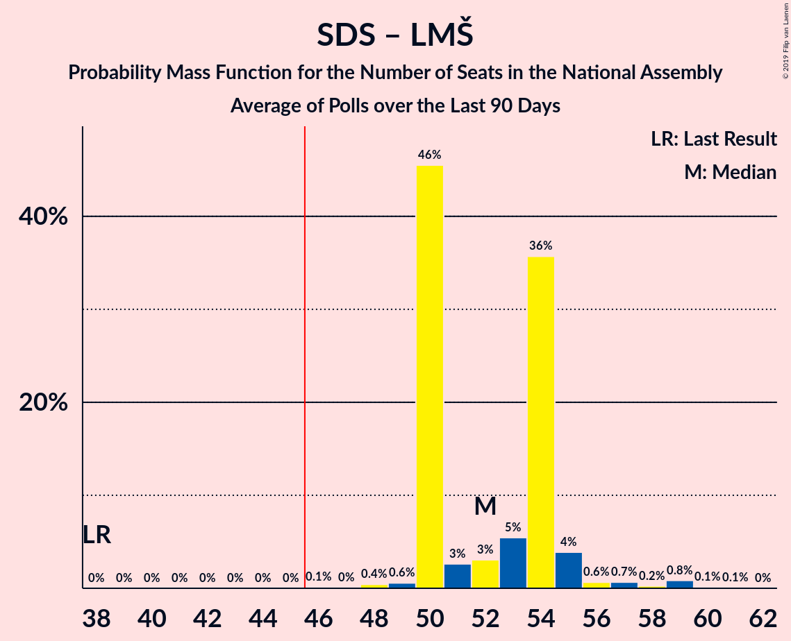

# Poll Average

<a href="#voting-intentions">Voting Intentions</a> | <a href="#seats">Seats</a> | <a href="#coalitions">Coalitions</a> | <a href="#technical-information">Technical Information</a>

## Summary

The table below lists the polls on which the average is based. They are the most recent polls (less than 90 days old) registered and analyzed so far.

| Period     | Polling firm/Commissioner(s) | SDS | LMŠ | SD | SMC | Levica | NSi | PAB | DeSUS | SNS | SLS | GOD–NLS | GOD | NLS | DL | PS | HIM |
|:----------:|:----------------------------:|:--:|:--:|:--:|:--:|:--:|:--:|:--:|:--:|:--:|:--:|:--:|:--:|:--:|:--:|:--:|:--:|
| 3 June 2018 | General Election | 24.9%   25 | 12.6%   13 | 9.9%   10 | 9.7%   10 | 9.3%   9 | 7.2%   7 | 5.1%   5 | 4.9%   5 | 4.2%   4 | 2.6%   0 | 0.2%   0 | 0.2%   0 | 0.2%   0 | 0.0%   0 | 0.0%   0 | 0.0%   2 |
| N/A | Poll Average | 20–31%   19–30 | 22–32%   21–32 | 9–15%   8–14 | 0–4%   0–4 | 5–11%   4–11 | 6–11%   5–12 | 1–5%   0–4 | 3–6%   0–6 | 2–8%   0–8 | 1–6%   0–6 | N/A   N/A | N/A   N/A | N/A   N/A | N/A   N/A | N/A   N/A | N/A   N/A |
| [1–23 June 2019](2019-06-23-Mediana.html) | Mediana   POP TV | 21–28%   21–27 | 24–30%   22–31 | 10–15%   10–14 | 1–3%   0 | 8–12%   7–12 | 8–12%   7–12 | 2–5%   0–4 | 3–6%   0–5 | 3–7%   0–6 | 2–5%   0–4 | N/A   N/A | N/A   N/A | N/A   N/A | N/A   N/A | N/A   N/A | N/A   N/A |
| [11–13 June 2019](2019-06-13-Ninamedia.html) | Ninamedia   Dnevnik and Večer | 19–26%   18–25 | 26–33%   25–32 | 10–15%   9–14 | 0–2%   0 | 6–10%   5–9 | 6–10%   5–10 | 1–3%   0 | 3–6%   0–5 | 1–4%   0 | 1–3%   0 | N/A   N/A | N/A   N/A | N/A   N/A | N/A   N/A | N/A   N/A | N/A   N/A |
| [1–4 April 2019](2019-04-04-ParsifalSC.html) | Parsifal SC   Nova24TV | 24–32%   23–31 | 21–29%   20–28 | 8–13%   7–13 | 2–5%   0–4 | 5–10%   4–9 | 5–10%   5–9 | 2–5%   0–5 | 3–7%   0–6 | 4–9%   4–8 | 3–7%   0–6 | N/A   N/A | N/A   N/A | N/A   N/A | N/A   N/A | N/A   N/A | N/A   N/A |
| 3 June 2018 | General Election | 24.9%   25 | 12.6%   13 | 9.9%   10 | 9.7%   10 | 9.3%   9 | 7.2%   7 | 5.1%   5 | 4.9%   5 | 4.2%   4 | 2.6%   0 | 0.2%   0 | 0.2%   0 | 0.2%   0 | 0.0%   0 | 0.0%   0 | 0.0%   2 |

Only polls for which at least the sample size has been published are included in the table above.

**Legend:**
+ **Top half of each row:** Voting intentions (95% confidence interval)
+ **Bottom half of each row:** Seat projections for the National Assembly (95% confidence interval)
+ **SDS:** Slovenska demokratska stranka
+ **LMŠ:** Lista Marjana Šarca
+ **SD:** Socialni demokrati
+ **SMC:** Stranka modernega centra
+ **Levica:** Levica
+ **NSi:** Nova Slovenija–Krščanski demokrati
+ **PAB:** Stranka Alenke Bratušek
+ **DeSUS:** Demokratična stranka upokojencev Slovenije
+ **SNS:** Slovenska nacionalna stranka
+ **SLS:** Slovenska ljudska stranka
+ **GOD–NLS:** Glas za otroke in družine–Nova ljudska stranka Slovenije
+ **GOD:** Glas za otroke in družine
+ **NLS:** Nova ljudska stranka Slovenije
+ **DL:** Državljanska lista
+ **PS:** Pozitivna Slovenija
+ **HIM:** Hungarian and Italian minorities
+ **N/A (single party):** Party not included the published results
+ **N/A (entire row):** Calculation for this opinion poll not started yet

## Voting Intentions

### Confidence Intervals

| Party | Last Result | Median | 80% Confidence Interval | 90% Confidence Interval | 95% Confidence Interval | 99% Confidence Interval |
|:-----:|:-----------:|:------:|:-----------------------:|:-----------------------:|:-----------------------:|:-----------------------:|
| <a href="#slovenska-demokratska-stranka">Slovenska demokratska stranka</a> | 24.9% | 24.5% | 21.4–28.9% |20.7–29.9% | 20.1–30.8% | 19.0–32.3% |
| <a href="#lista-marjana-šarca">Lista Marjana Šarca</a> | 12.6% | 27.1% | 23.5–30.6% |22.6–31.5% | 21.9–32.2% | 20.6–33.4% |
| <a href="#socialni-demokrati">Socialni demokrati</a> | 9.9% | 11.8% | 9.7–13.6% |9.1–14.2% | 8.6–14.6% | 7.8–15.5% |
| <a href="#stranka-modernega-centra">Stranka modernega centra</a> | 9.7% | 1.9% | 0.6–3.3% |0.5–3.7% | 0.4–4.1% | 0.3–4.8% |
| <a href="#levica">Levica</a> | 9.3% | 8.0% | 6.2–10.2% |5.8–10.8% | 5.4–11.2% | 4.7–12.1% |
| <a href="#nova-slovenija–krščanski-demokrati">Nova Slovenija–Krščanski demokrati</a> | 7.2% | 8.3% | 6.6–10.3% |6.1–10.8% | 5.8–11.2% | 5.1–12.1% |
| <a href="#stranka-alenke-bratušek">Stranka Alenke Bratušek</a> | 5.1% | 2.8% | 1.4–4.1% |1.2–4.4% | 1.1–4.8% | 0.8–5.4% |
| <a href="#demokratična-stranka-upokojencev-slovenije">Demokratična stranka upokojencev Slovenije</a> | 4.9% | 4.2% | 3.3–5.4% |3.0–5.8% | 2.8–6.2% | 2.5–6.9% |
| <a href="#slovenska-nacionalna-stranka">Slovenska nacionalna stranka</a> | 4.2% | 4.7% | 2.0–7.0% |1.7–7.6% | 1.5–8.1% | 1.2–9.1% |
| <a href="#slovenska-ljudska-stranka">Slovenska ljudska stranka</a> | 2.6% | 3.3% | 1.8–5.5% |1.6–6.0% | 1.4–6.5% | 1.1–7.4% |
| <a href="#glas-za-otroke-in-družine–nova-ljudska-stranka-slovenije">Glas za otroke in družine–Nova ljudska stranka Slovenije</a> | 0.2% | N/A | N/A |N/A | N/A | N/A |
| <a href="#glas-za-otroke-in-družine">Glas za otroke in družine</a> | 0.2% | N/A | N/A |N/A | N/A | N/A |
| <a href="#nova-ljudska-stranka-slovenije">Nova ljudska stranka Slovenije</a> | 0.2% | N/A | N/A |N/A | N/A | N/A |
| <a href="#državljanska-lista">Državljanska lista</a> | 0.0% | N/A | N/A |N/A | N/A | N/A |
| <a href="#pozitivna-slovenija">Pozitivna Slovenija</a> | 0.0% | N/A | N/A |N/A | N/A | N/A |
| <a href="#hungarian-and-italian-minorities">Hungarian and Italian minorities</a> | 0.0% | N/A | N/A |N/A | N/A | N/A |

### Slovenska demokratska stranka

*For a full overview of the results for this party, see the [Slovenska demokratska stranka](party-slovenskademokratskastranka.html) page.*

| Voting Intentions | Probability | Accumulated | Special Marks |
|:-----------------:|:-----------:|:-----------:|:-------------:|
| 16.5–17.5% | 0% | 100% |  |
| 17.5–18.5% | 0.2% | 100% |  |
| 18.5–19.5% | 1.0% | 99.8% |  |
| 19.5–20.5% | 3% | 98.8% |  |
| 20.5–21.5% | 7% | 96% |  |
| 21.5–22.5% | 12% | 88% |  |
| 22.5–23.5% | 14% | 77% |  |
| 23.5–24.5% | 14% | 63% | Median |
| 24.5–25.5% | 12% | 49% | Last Result |
| 25.5–26.5% | 10% | 37% |  |
| 26.5–27.5% | 8% | 27% |  |
| 27.5–28.5% | 7% | 19% |  |
| 28.5–29.5% | 5% | 12% |  |
| 29.5–30.5% | 3% | 6% |  |
| 30.5–31.5% | 2% | 3% |  |
| 31.5–32.5% | 0.8% | 1.2% |  |
| 32.5–33.5% | 0.3% | 0.4% |  |
| 33.5–34.5% | 0.1% | 0.1% |  |
| 34.5–35.5% | 0% | 0% |  |

### Lista Marjana Šarca

*For a full overview of the results for this party, see the [Lista Marjana Šarca](party-listamarjanašarca.html) page.*

| Voting Intentions | Probability | Accumulated | Special Marks |
|:-----------------:|:-----------:|:-----------:|:-------------:|
| 12.5–13.5% | 0% | 100% | Last Result |
| 13.5–14.5% | 0% | 100% |  |
| 14.5–15.5% | 0% | 100% |  |
| 15.5–16.5% | 0% | 100% |  |
| 16.5–17.5% | 0% | 100% |  |
| 17.5–18.5% | 0% | 100% |  |
| 18.5–19.5% | 0.1% | 100% |  |
| 19.5–20.5% | 0.4% | 99.9% |  |
| 20.5–21.5% | 1.2% | 99.5% |  |
| 21.5–22.5% | 3% | 98% |  |
| 22.5–23.5% | 5% | 95% |  |
| 23.5–24.5% | 8% | 90% |  |
| 24.5–25.5% | 11% | 82% |  |
| 25.5–26.5% | 13% | 71% |  |
| 26.5–27.5% | 14% | 58% | Median |
| 27.5–28.5% | 13% | 44% |  |
| 28.5–29.5% | 12% | 31% |  |
| 29.5–30.5% | 9% | 19% |  |
| 30.5–31.5% | 6% | 10% |  |
| 31.5–32.5% | 3% | 5% |  |
| 32.5–33.5% | 1.1% | 2% |  |
| 33.5–34.5% | 0.3% | 0.4% |  |
| 34.5–35.5% | 0.1% | 0.1% |  |
| 35.5–36.5% | 0% | 0% |  |

### Socialni demokrati

*For a full overview of the results for this party, see the [Socialni demokrati](party-socialnidemokrati.html) page.*

| Voting Intentions | Probability | Accumulated | Special Marks |
|:-----------------:|:-----------:|:-----------:|:-------------:|
| 5.5–6.5% | 0% | 100% |  |
| 6.5–7.5% | 0.3% | 100% |  |
| 7.5–8.5% | 2% | 99.7% |  |
| 8.5–9.5% | 6% | 98% |  |
| 9.5–10.5% | 13% | 91% | Last Result |
| 10.5–11.5% | 22% | 78% |  |
| 11.5–12.5% | 26% | 56% | Median |
| 12.5–13.5% | 19% | 30% |  |
| 13.5–14.5% | 8% | 11% |  |
| 14.5–15.5% | 2% | 3% |  |
| 15.5–16.5% | 0.4% | 0.5% |  |
| 16.5–17.5% | 0% | 0% |  |
| 17.5–18.5% | 0% | 0% |  |

### Stranka modernega centra

*For a full overview of the results for this party, see the [Stranka modernega centra](party-strankamodernegacentra.html) page.*

| Voting Intentions | Probability | Accumulated | Special Marks |
|:-----------------:|:-----------:|:-----------:|:-------------:|
| 0.0–0.5% | 6% | 100% |  |
| 0.5–1.5% | 32% | 94% |  |
| 1.5–2.5% | 34% | 62% | Median |
| 2.5–3.5% | 21% | 28% |  |
| 3.5–4.5% | 6% | 7% |  |
| 4.5–5.5% | 0.8% | 0.9% |  |
| 5.5–6.5% | 0.1% | 0.1% |  |
| 6.5–7.5% | 0% | 0% |  |
| 7.5–8.5% | 0% | 0% |  |
| 8.5–9.5% | 0% | 0% |  |
| 9.5–10.5% | 0% | 0% | Last Result |

### Levica

*For a full overview of the results for this party, see the [Levica](party-levica.html) page.*

| Voting Intentions | Probability | Accumulated | Special Marks |
|:-----------------:|:-----------:|:-----------:|:-------------:|
| 2.5–3.5% | 0% | 100% |  |
| 3.5–4.5% | 0.3% | 100% |  |
| 4.5–5.5% | 3% | 99.7% |  |
| 5.5–6.5% | 12% | 97% |  |
| 6.5–7.5% | 23% | 84% |  |
| 7.5–8.5% | 24% | 61% | Median |
| 8.5–9.5% | 19% | 37% | Last Result |
| 9.5–10.5% | 12% | 19% |  |
| 10.5–11.5% | 5% | 7% |  |
| 11.5–12.5% | 1.2% | 1.4% |  |
| 12.5–13.5% | 0.2% | 0.2% |  |
| 13.5–14.5% | 0% | 0% |  |

### Nova Slovenija–Krščanski demokrati

*For a full overview of the results for this party, see the [Nova Slovenija–Krščanski demokrati](party-novaslovenija–krščanskidemokrati.html) page.*

| Voting Intentions | Probability | Accumulated | Special Marks |
|:-----------------:|:-----------:|:-----------:|:-------------:|
| 2.5–3.5% | 0% | 100% |  |
| 3.5–4.5% | 0.1% | 100% |  |
| 4.5–5.5% | 1.5% | 99.9% |  |
| 5.5–6.5% | 8% | 98% |  |
| 6.5–7.5% | 19% | 90% | Last Result |
| 7.5–8.5% | 27% | 71% | Median |
| 8.5–9.5% | 23% | 44% |  |
| 9.5–10.5% | 14% | 21% |  |
| 10.5–11.5% | 6% | 7% |  |
| 11.5–12.5% | 1.3% | 1.5% |  |
| 12.5–13.5% | 0.2% | 0.2% |  |
| 13.5–14.5% | 0% | 0% |  |

### Stranka Alenke Bratušek

*For a full overview of the results for this party, see the [Stranka Alenke Bratušek](party-strankaalenkebratušek.html) page.*

| Voting Intentions | Probability | Accumulated | Special Marks |
|:-----------------:|:-----------:|:-----------:|:-------------:|
| 0.0–0.5% | 0% | 100% |  |
| 0.5–1.5% | 14% | 100% |  |
| 1.5–2.5% | 27% | 86% |  |
| 2.5–3.5% | 35% | 59% | Median |
| 3.5–4.5% | 20% | 24% |  |
| 4.5–5.5% | 4% | 4% | Last Result |
| 5.5–6.5% | 0.3% | 0.4% |  |
| 6.5–7.5% | 0% | 0% |  |

### Demokratična stranka upokojencev Slovenije

*For a full overview of the results for this party, see the [Demokratična stranka upokojencev Slovenije](party-demokratičnastrankaupokojencevslovenije.html) page.*

| Voting Intentions | Probability | Accumulated | Special Marks |
|:-----------------:|:-----------:|:-----------:|:-------------:|
| 0.5–1.5% | 0% | 100% |  |
| 1.5–2.5% | 0.8% | 100% |  |
| 2.5–3.5% | 19% | 99.2% |  |
| 3.5–4.5% | 46% | 81% | Median |
| 4.5–5.5% | 27% | 35% | Last Result |
| 5.5–6.5% | 7% | 8% |  |
| 6.5–7.5% | 1.0% | 1.1% |  |
| 7.5–8.5% | 0.1% | 0.1% |  |
| 8.5–9.5% | 0% | 0% |  |

### Slovenska nacionalna stranka

*For a full overview of the results for this party, see the [Slovenska nacionalna stranka](party-slovenskanacionalnastranka.html) page.*

| Voting Intentions | Probability | Accumulated | Special Marks |
|:-----------------:|:-----------:|:-----------:|:-------------:|
| 0.0–0.5% | 0% | 100% |  |
| 0.5–1.5% | 3% | 100% |  |
| 1.5–2.5% | 21% | 97% |  |
| 2.5–3.5% | 11% | 77% |  |
| 3.5–4.5% | 13% | 66% | Last Result |
| 4.5–5.5% | 21% | 53% | Median |
| 5.5–6.5% | 17% | 32% |  |
| 6.5–7.5% | 10% | 15% |  |
| 7.5–8.5% | 4% | 5% |  |
| 8.5–9.5% | 1.0% | 1.2% |  |
| 9.5–10.5% | 0.2% | 0.2% |  |
| 10.5–11.5% | 0% | 0% |  |

### Slovenska ljudska stranka

*For a full overview of the results for this party, see the [Slovenska ljudska stranka](party-slovenskaljudskastranka.html) page.*

| Voting Intentions | Probability | Accumulated | Special Marks |
|:-----------------:|:-----------:|:-----------:|:-------------:|
| 0.0–0.5% | 0% | 100% |  |
| 0.5–1.5% | 5% | 100% |  |
| 1.5–2.5% | 25% | 95% |  |
| 2.5–3.5% | 27% | 70% | Last Result, Median |
| 3.5–4.5% | 20% | 43% |  |
| 4.5–5.5% | 14% | 23% |  |
| 5.5–6.5% | 7% | 9% |  |
| 6.5–7.5% | 2% | 2% |  |
| 7.5–8.5% | 0.3% | 0.3% |  |
| 8.5–9.5% | 0% | 0% |  |

## Seats

### Confidence Intervals

| Party | Last Result | Median | 80% Confidence Interval | 90% Confidence Interval | 95% Confidence Interval | 99% Confidence Interval |
|:-----:|:-----------:|:------:|:-----------------------:|:-----------------------:|:-----------------------:|:-----------------------:|
| <a href="#slovenska-demokratska-stranka">Slovenska demokratska stranka</a> | 25 | 24 | 20–28 |19–29 | 19–30 | 18–32 |
| <a href="#lista-marjana-šarca">Lista Marjana Šarca</a> | 13 | 26 | 23–30 |22–31 | 21–32 | 20–33 |
| <a href="#socialni-demokrati">Socialni demokrati</a> | 10 | 11 | 9–13 |8–14 | 8–14 | 7–15 |
| <a href="#stranka-modernega-centra">Stranka modernega centra</a> | 10 | 0 | 0 |0 | 0–4 | 0–4 |
| <a href="#levica">Levica</a> | 9 | 7 | 6–10 |5–11 | 4–11 | 4–12 |
| <a href="#nova-slovenija–krščanski-demokrati">Nova Slovenija–Krščanski demokrati</a> | 7 | 8 | 6–10 |6–11 | 5–12 | 5–12 |
| <a href="#stranka-alenke-bratušek">Stranka Alenke Bratušek</a> | 5 | 0 | 0–3 |0–4 | 0–4 | 0–5 |
| <a href="#demokratična-stranka-upokojencev-slovenije">Demokratična stranka upokojencev Slovenije</a> | 5 | 4 | 0–5 |0–5 | 0–6 | 0–6 |
| <a href="#slovenska-nacionalna-stranka">Slovenska nacionalna stranka</a> | 4 | 4 | 0–6 |0–7 | 0–8 | 0–9 |
| <a href="#slovenska-ljudska-stranka">Slovenska ljudska stranka</a> | 0 | 0 | 0–5 |0–5 | 0–6 | 0–7 |
| <a href="#glas-za-otroke-in-družine–nova-ljudska-stranka-slovenije">Glas za otroke in družine–Nova ljudska stranka Slovenije</a> | 0 | N/A | N/A |N/A | N/A | N/A |
| <a href="#glas-za-otroke-in-družine">Glas za otroke in družine</a> | 0 | N/A | N/A |N/A | N/A | N/A |
| <a href="#nova-ljudska-stranka-slovenije">Nova ljudska stranka Slovenije</a> | 0 | N/A | N/A |N/A | N/A | N/A |
| <a href="#državljanska-lista">Državljanska lista</a> | 0 | N/A | N/A |N/A | N/A | N/A |
| <a href="#pozitivna-slovenija">Pozitivna Slovenija</a> | 0 | N/A | N/A |N/A | N/A | N/A |
| <a href="#hungarian-and-italian-minorities">Hungarian and Italian minorities</a> | 2 | N/A | N/A |N/A | N/A | N/A |

### Slovenska demokratska stranka

*For a full overview of the results for this party, see the [Slovenska demokratska stranka](party-slovenskademokratskastranka.html) page.*

| Number of Seats | Probability | Accumulated | Special Marks |
|:---------------:|:-----------:|:-----------:|:-------------:|
| 17 | 0.2% | 100% |  |
| 18 | 1.3% | 99.8% |  |
| 19 | 4% | 98% |  |
| 20 | 7% | 94% |  |
| 21 | 6% | 87% |  |
| 22 | 13% | 81% |  |
| 23 | 8% | 68% |  |
| 24 | 23% | 60% | Median |
| 25 | 9% | 37% | Last Result |
| 26 | 8% | 28% |  |
| 27 | 7% | 19% |  |
| 28 | 5% | 13% |  |
| 29 | 4% | 8% |  |
| 30 | 1.5% | 3% |  |
| 31 | 1.1% | 2% |  |
| 32 | 0.6% | 0.8% |  |
| 33 | 0.2% | 0.2% |  |
| 34 | 0% | 0% |  |

### Lista Marjana Šarca

*For a full overview of the results for this party, see the [Lista Marjana Šarca](party-listamarjanašarca.html) page.*

| Number of Seats | Probability | Accumulated | Special Marks |
|:---------------:|:-----------:|:-----------:|:-------------:|
| 13 | 0% | 100% | Last Result |
| 14 | 0% | 100% |  |
| 15 | 0% | 100% |  |
| 16 | 0% | 100% |  |
| 17 | 0% | 100% |  |
| 18 | 0.1% | 100% |  |
| 19 | 0.4% | 99.9% |  |
| 20 | 0.7% | 99.6% |  |
| 21 | 3% | 98.9% |  |
| 22 | 5% | 95% |  |
| 23 | 6% | 91% |  |
| 24 | 7% | 85% |  |
| 25 | 11% | 78% |  |
| 26 | 18% | 67% | Median |
| 27 | 14% | 50% |  |
| 28 | 16% | 36% |  |
| 29 | 8% | 19% |  |
| 30 | 6% | 11% |  |
| 31 | 3% | 6% |  |
| 32 | 2% | 3% |  |
| 33 | 0.6% | 0.8% |  |
| 34 | 0.1% | 0.1% |  |
| 35 | 0% | 0.1% |  |
| 36 | 0% | 0% |  |

### Socialni demokrati

*For a full overview of the results for this party, see the [Socialni demokrati](party-socialnidemokrati.html) page.*

| Number of Seats | Probability | Accumulated | Special Marks |
|:---------------:|:-----------:|:-----------:|:-------------:|
| 6 | 0.1% | 100% |  |
| 7 | 1.1% | 99.9% |  |
| 8 | 4% | 98.8% |  |
| 9 | 12% | 95% |  |
| 10 | 18% | 83% | Last Result |
| 11 | 20% | 65% | Median |
| 12 | 27% | 46% |  |
| 13 | 13% | 18% |  |
| 14 | 5% | 6% |  |
| 15 | 0.9% | 1.0% |  |
| 16 | 0.2% | 0.2% |  |
| 17 | 0% | 0% |  |

### Stranka modernega centra

*For a full overview of the results for this party, see the [Stranka modernega centra](party-strankamodernegacentra.html) page.*

| Number of Seats | Probability | Accumulated | Special Marks |
|:---------------:|:-----------:|:-----------:|:-------------:|
| 0 | 97% | 100% | Median |
| 1 | 0% | 3% |  |
| 2 | 0% | 3% |  |
| 3 | 0.2% | 3% |  |
| 4 | 3% | 3% |  |
| 5 | 0.2% | 0.2% |  |
| 6 | 0% | 0% |  |
| 7 | 0% | 0% |  |
| 8 | 0% | 0% |  |
| 9 | 0% | 0% |  |
| 10 | 0% | 0% | Last Result |

### Levica

*For a full overview of the results for this party, see the [Levica](party-levica.html) page.*

| Number of Seats | Probability | Accumulated | Special Marks |
|:---------------:|:-----------:|:-----------:|:-------------:|
| 0 | 0.1% | 100% |  |
| 1 | 0% | 99.9% |  |
| 2 | 0% | 99.9% |  |
| 3 | 0% | 99.9% |  |
| 4 | 2% | 99.9% |  |
| 5 | 7% | 97% |  |
| 6 | 19% | 90% |  |
| 7 | 28% | 71% | Median |
| 8 | 22% | 43% |  |
| 9 | 9% | 22% | Last Result |
| 10 | 5% | 12% |  |
| 11 | 6% | 7% |  |
| 12 | 0.6% | 0.9% |  |
| 13 | 0.1% | 0.2% |  |
| 14 | 0.1% | 0.1% |  |
| 15 | 0% | 0% |  |

### Nova Slovenija–Krščanski demokrati

*For a full overview of the results for this party, see the [Nova Slovenija–Krščanski demokrati](party-novaslovenija–krščanskidemokrati.html) page.*

| Number of Seats | Probability | Accumulated | Special Marks |
|:---------------:|:-----------:|:-----------:|:-------------:|
| 4 | 0.3% | 100% |  |
| 5 | 5% | 99.6% |  |
| 6 | 16% | 95% |  |
| 7 | 23% | 79% | Last Result |
| 8 | 29% | 56% | Median |
| 9 | 11% | 26% |  |
| 10 | 10% | 16% |  |
| 11 | 3% | 6% |  |
| 12 | 2% | 3% |  |
| 13 | 0.1% | 0.1% |  |
| 14 | 0% | 0% |  |

### Stranka Alenke Bratušek

*For a full overview of the results for this party, see the [Stranka Alenke Bratušek](party-strankaalenkebratušek.html) page.*

| Number of Seats | Probability | Accumulated | Special Marks |
|:---------------:|:-----------:|:-----------:|:-------------:|
| 0 | 89% | 100% | Median |
| 1 | 0% | 11% |  |
| 2 | 0% | 11% |  |
| 3 | 2% | 11% |  |
| 4 | 7% | 9% |  |
| 5 | 2% | 2% | Last Result |
| 6 | 0.1% | 0.1% |  |
| 7 | 0% | 0% |  |

### Demokratična stranka upokojencev Slovenije

*For a full overview of the results for this party, see the [Demokratična stranka upokojencev Slovenije](party-demokratičnastrankaupokojencevslovenije.html) page.*

| Number of Seats | Probability | Accumulated | Special Marks |
|:---------------:|:-----------:|:-----------:|:-------------:|
| 0 | 38% | 100% |  |
| 1 | 0% | 62% |  |
| 2 | 0% | 62% |  |
| 3 | 3% | 62% |  |
| 4 | 32% | 58% | Median |
| 5 | 23% | 26% | Last Result |
| 6 | 3% | 3% |  |
| 7 | 0.2% | 0.3% |  |
| 8 | 0% | 0% |  |

### Slovenska nacionalna stranka

*For a full overview of the results for this party, see the [Slovenska nacionalna stranka](party-slovenskanacionalnastranka.html) page.*

| Number of Seats | Probability | Accumulated | Special Marks |
|:---------------:|:-----------:|:-----------:|:-------------:|
| 0 | 36% | 100% |  |
| 1 | 0% | 64% |  |
| 2 | 0% | 64% |  |
| 3 | 0.3% | 64% |  |
| 4 | 20% | 63% | Last Result, Median |
| 5 | 22% | 43% |  |
| 6 | 13% | 22% |  |
| 7 | 6% | 9% |  |
| 8 | 2% | 3% |  |
| 9 | 0.5% | 0.6% |  |
| 10 | 0.1% | 0.1% |  |
| 11 | 0% | 0% |  |

### Slovenska ljudska stranka

*For a full overview of the results for this party, see the [Slovenska ljudska stranka](party-slovenskaljudskastranka.html) page.*

| Number of Seats | Probability | Accumulated | Special Marks |
|:---------------:|:-----------:|:-----------:|:-------------:|
| 0 | 67% | 100% | Last Result, Median |
| 1 | 0% | 33% |  |
| 2 | 0% | 33% |  |
| 3 | 0.2% | 33% |  |
| 4 | 17% | 32% |  |
| 5 | 12% | 16% |  |
| 6 | 3% | 4% |  |
| 7 | 0.6% | 0.7% |  |
| 8 | 0.1% | 0.1% |  |
| 9 | 0% | 0% |  |

## Coalitions

### Confidence Intervals

| Coalition | Last Result | Median | Majority? | 80% Confidence Interval | 90% Confidence Interval | 95% Confidence Interval | 99% Confidence Interval |
|:---------:|:-----------:|:------:|:---------:|:-----------------------:|:-----------------------:|:-----------------------:|:-----------------------:|
| Slovenska demokratska stranka – Lista Marjana Šarca – Demokratična stranka upokojencev Slovenije | 43 | 53 | 99.9% | 49–57 | 49–57 | 48–59 | 46–60 |
| Slovenska demokratska stranka – Lista Marjana Šarca | 38 | 50 | 98% | 47–53 | 46–55 | 46–56 | 44–58 |
| Lista Marjana Šarca – Socialni demokrati – Stranka modernega centra – Nova Slovenija–Krščanski demokrati – Stranka Alenke Bratušek – Demokratična stranka upokojencev Slovenije | 50 | 49 | 81% | 44–53 | 43–54 | 42–54 | 39–55 |
| Lista Marjana Šarca – Socialni demokrati – Stranka modernega centra – Nova Slovenija–Krščanski demokrati – Demokratična stranka upokojencev Slovenije | 45 | 48 | 76% | 43–53 | 42–54 | 41–54 | 38–55 |
| Lista Marjana Šarca – Socialni demokrati – Nova Slovenija–Krščanski demokrati – Demokratična stranka upokojencev Slovenije | 35 | 48 | 74% | 43–53 | 41–54 | 40–54 | 38–55 |
| Lista Marjana Šarca – Socialni demokrati – Nova Slovenija–Krščanski demokrati | 30 | 46 | 57% | 39–50 | 38–50 | 37–51 | 35–54 |
| Lista Marjana Šarca – Socialni demokrati – Stranka modernega centra – Nova Slovenija–Krščanski demokrati | 40 | 47 | 57% | 40–50 | 38–50 | 37–51 | 36–54 |
| Lista Marjana Šarca – Socialni demokrati – Stranka modernega centra – Stranka Alenke Bratušek – Demokratična stranka upokojencev Slovenije | 43 | 41 | 5% | 37–45 | 35–46 | 34–46 | 32–47 |
| Lista Marjana Šarca – Socialni demokrati – Stranka modernega centra – Demokratična stranka upokojencev Slovenije | 38 | 40 | 5% | 36–45 | 35–46 | 34–46 | 31–47 |
| Lista Marjana Šarca – Socialni demokrati – Demokratična stranka upokojencev Slovenije | 28 | 40 | 5% | 36–45 | 34–46 | 33–46 | 31–47 |
| Slovenska demokratska stranka – Nova Slovenija–Krščanski demokrati – Demokratična stranka upokojencev Slovenije – Slovenska ljudska stranka – Državljanska lista | 37 | 36 | 1.4% | 30–42 | 30–44 | 29–45 | 27–47 |
| Lista Marjana Šarca – Socialni demokrati – Stranka modernega centra | 33 | 38 | 0.3% | 33–41 | 31–42 | 31–43 | 29–45 |
| Lista Marjana Šarca – Socialni demokrati | 23 | 38 | 0.3% | 32–41 | 31–42 | 30–43 | 29–45 |
| Socialni demokrati – Demokratična stranka upokojencev Slovenije – Državljanska lista – Pozitivna Slovenija | 15 | 14 | 0% | 11–17 | 10–18 | 9–18 | 8–19 |
| Socialni demokrati – Stranka modernega centra – Demokratična stranka upokojencev Slovenije | 25 | 14 | 0% | 11–17 | 10–18 | 9–18 | 8–19 |
| Socialni demokrati – Stranka modernega centra – Pozitivna Slovenija | 20 | 11 | 0% | 9–13 | 9–14 | 8–14 | 7–15 |

### Slovenska demokratska stranka – Lista Marjana Šarca – Demokratična stranka upokojencev Slovenije

| Number of Seats | Probability | Accumulated | Special Marks |
|:---------------:|:-----------:|:-----------:|:-------------:|
| 43 | 0% | 100% | Last Result |
| 44 | 0% | 100% |  |
| 45 | 0.1% | 100% |  |
| 46 | 0.4% | 99.9% | Majority |
| 47 | 0.9% | 99.5% |  |
| 48 | 2% | 98.6% |  |
| 49 | 7% | 96% |  |
| 50 | 11% | 89% |  |
| 51 | 10% | 79% |  |
| 52 | 13% | 69% |  |
| 53 | 12% | 56% |  |
| 54 | 12% | 44% | Median |
| 55 | 9% | 32% |  |
| 56 | 7% | 23% |  |
| 57 | 12% | 16% |  |
| 58 | 2% | 5% |  |
| 59 | 2% | 3% |  |
| 60 | 0.7% | 1.0% |  |
| 61 | 0.2% | 0.3% |  |
| 62 | 0% | 0.1% |  |
| 63 | 0% | 0% |  |

### Slovenska demokratska stranka – Lista Marjana Šarca

| Number of Seats | Probability | Accumulated | Special Marks |
|:---------------:|:-----------:|:-----------:|:-------------:|
| 38 | 0% | 100% | Last Result |
| 39 | 0% | 100% |  |
| 40 | 0% | 100% |  |
| 41 | 0% | 100% |  |
| 42 | 0.1% | 100% |  |
| 43 | 0.2% | 99.9% |  |
| 44 | 0.5% | 99.8% |  |
| 45 | 2% | 99.3% |  |
| 46 | 3% | 98% | Majority |
| 47 | 6% | 95% |  |
| 48 | 10% | 89% |  |
| 49 | 16% | 79% |  |
| 50 | 18% | 63% | Median |
| 51 | 12% | 45% |  |
| 52 | 18% | 33% |  |
| 53 | 6% | 15% |  |
| 54 | 2% | 9% |  |
| 55 | 4% | 7% |  |
| 56 | 0.7% | 3% |  |
| 57 | 2% | 2% |  |
| 58 | 0.3% | 0.6% |  |
| 59 | 0.2% | 0.3% |  |
| 60 | 0% | 0% |  |

### Lista Marjana Šarca – Socialni demokrati – Stranka modernega centra – Nova Slovenija–Krščanski demokrati – Stranka Alenke Bratušek – Demokratična stranka upokojencev Slovenije

| Number of Seats | Probability | Accumulated | Special Marks |
|:---------------:|:-----------:|:-----------:|:-------------:|
| 37 | 0.1% | 100% |  |
| 38 | 0.2% | 99.9% |  |
| 39 | 0.5% | 99.7% |  |
| 40 | 0.6% | 99.3% |  |
| 41 | 1.1% | 98.7% |  |
| 42 | 2% | 98% |  |
| 43 | 4% | 96% |  |
| 44 | 5% | 92% |  |
| 45 | 6% | 87% |  |
| 46 | 9% | 81% | Majority |
| 47 | 6% | 72% |  |
| 48 | 14% | 65% |  |
| 49 | 9% | 52% | Median |
| 50 | 11% | 43% | Last Result |
| 51 | 6% | 32% |  |
| 52 | 9% | 25% |  |
| 53 | 11% | 16% |  |
| 54 | 3% | 6% |  |
| 55 | 2% | 2% |  |
| 56 | 0.2% | 0.3% |  |
| 57 | 0% | 0.1% |  |
| 58 | 0% | 0% |  |

### Lista Marjana Šarca – Socialni demokrati – Stranka modernega centra – Nova Slovenija–Krščanski demokrati – Demokratična stranka upokojencev Slovenije

| Number of Seats | Probability | Accumulated | Special Marks |
|:---------------:|:-----------:|:-----------:|:-------------:|
| 36 | 0% | 100% |  |
| 37 | 0.1% | 99.9% |  |
| 38 | 0.7% | 99.8% |  |
| 39 | 0.6% | 99.1% |  |
| 40 | 0.9% | 98% |  |
| 41 | 2% | 98% |  |
| 42 | 2% | 95% |  |
| 43 | 5% | 93% |  |
| 44 | 5% | 88% |  |
| 45 | 6% | 82% | Last Result |
| 46 | 9% | 76% | Majority |
| 47 | 7% | 67% |  |
| 48 | 14% | 61% |  |
| 49 | 7% | 47% | Median |
| 50 | 10% | 39% |  |
| 51 | 5% | 29% |  |
| 52 | 8% | 24% |  |
| 53 | 10% | 15% |  |
| 54 | 3% | 5% |  |
| 55 | 2% | 2% |  |
| 56 | 0.2% | 0.2% |  |
| 57 | 0% | 0% |  |

### Lista Marjana Šarca – Socialni demokrati – Nova Slovenija–Krščanski demokrati – Demokratična stranka upokojencev Slovenije

| Number of Seats | Probability | Accumulated | Special Marks |
|:---------------:|:-----------:|:-----------:|:-------------:|
| 35 | 0% | 100% | Last Result |
| 36 | 0.1% | 100% |  |
| 37 | 0.2% | 99.9% |  |
| 38 | 0.8% | 99.7% |  |
| 39 | 1.1% | 98.8% |  |
| 40 | 0.9% | 98% |  |
| 41 | 3% | 97% |  |
| 42 | 3% | 94% |  |
| 43 | 5% | 91% |  |
| 44 | 5% | 86% |  |
| 45 | 6% | 80% |  |
| 46 | 8% | 74% | Majority |
| 47 | 6% | 66% |  |
| 48 | 14% | 60% |  |
| 49 | 7% | 46% | Median |
| 50 | 10% | 39% |  |
| 51 | 5% | 29% |  |
| 52 | 8% | 24% |  |
| 53 | 10% | 15% |  |
| 54 | 3% | 5% |  |
| 55 | 2% | 2% |  |
| 56 | 0.2% | 0.2% |  |
| 57 | 0% | 0% |  |

### Lista Marjana Šarca – Socialni demokrati – Nova Slovenija–Krščanski demokrati

| Number of Seats | Probability | Accumulated | Special Marks |
|:---------------:|:-----------:|:-----------:|:-------------:|
| 30 | 0% | 100% | Last Result |
| 31 | 0% | 100% |  |
| 32 | 0% | 100% |  |
| 33 | 0% | 100% |  |
| 34 | 0.1% | 100% |  |
| 35 | 0.6% | 99.8% |  |
| 36 | 0.9% | 99.2% |  |
| 37 | 2% | 98% |  |
| 38 | 4% | 97% |  |
| 39 | 4% | 93% |  |
| 40 | 4% | 89% |  |
| 41 | 5% | 84% |  |
| 42 | 5% | 79% |  |
| 43 | 5% | 74% |  |
| 44 | 5% | 69% |  |
| 45 | 8% | 64% | Median |
| 46 | 7% | 57% | Majority |
| 47 | 9% | 50% |  |
| 48 | 22% | 40% |  |
| 49 | 7% | 18% |  |
| 50 | 6% | 11% |  |
| 51 | 3% | 5% |  |
| 52 | 1.1% | 2% |  |
| 53 | 0.4% | 1.0% |  |
| 54 | 0.1% | 0.6% |  |
| 55 | 0.5% | 0.5% |  |
| 56 | 0% | 0% |  |

### Lista Marjana Šarca – Socialni demokrati – Stranka modernega centra – Nova Slovenija–Krščanski demokrati

| Number of Seats | Probability | Accumulated | Special Marks |
|:---------------:|:-----------:|:-----------:|:-------------:|
| 34 | 0.1% | 100% |  |
| 35 | 0.3% | 99.9% |  |
| 36 | 0.7% | 99.6% |  |
| 37 | 1.4% | 98.8% |  |
| 38 | 3% | 97% |  |
| 39 | 4% | 94% |  |
| 40 | 4% | 91% | Last Result |
| 41 | 5% | 86% |  |
| 42 | 6% | 81% |  |
| 43 | 6% | 76% |  |
| 44 | 5% | 70% |  |
| 45 | 8% | 65% | Median |
| 46 | 7% | 57% | Majority |
| 47 | 9% | 50% |  |
| 48 | 22% | 41% |  |
| 49 | 7% | 18% |  |
| 50 | 6% | 11% |  |
| 51 | 3% | 5% |  |
| 52 | 1.1% | 2% |  |
| 53 | 0.4% | 1.0% |  |
| 54 | 0.1% | 0.6% |  |
| 55 | 0.5% | 0.5% |  |
| 56 | 0% | 0% |  |

### Lista Marjana Šarca – Socialni demokrati – Stranka modernega centra – Stranka Alenke Bratušek – Demokratična stranka upokojencev Slovenije

| Number of Seats | Probability | Accumulated | Special Marks |
|:---------------:|:-----------:|:-----------:|:-------------:|
| 30 | 0.1% | 100% |  |
| 31 | 0.3% | 99.8% |  |
| 32 | 0.5% | 99.5% |  |
| 33 | 0.4% | 99.0% |  |
| 34 | 2% | 98.6% |  |
| 35 | 2% | 97% |  |
| 36 | 2% | 95% |  |
| 37 | 7% | 93% |  |
| 38 | 12% | 86% |  |
| 39 | 11% | 75% |  |
| 40 | 12% | 64% |  |
| 41 | 10% | 52% | Median |
| 42 | 9% | 42% |  |
| 43 | 8% | 33% | Last Result |
| 44 | 5% | 25% |  |
| 45 | 14% | 19% |  |
| 46 | 4% | 5% | Majority |
| 47 | 1.3% | 2% |  |
| 48 | 0.2% | 0.3% |  |
| 49 | 0.2% | 0.2% |  |
| 50 | 0% | 0% |  |

### Lista Marjana Šarca – Socialni demokrati – Stranka modernega centra – Demokratična stranka upokojencev Slovenije

| Number of Seats | Probability | Accumulated | Special Marks |
|:---------------:|:-----------:|:-----------:|:-------------:|
| 29 | 0% | 100% |  |
| 30 | 0.3% | 99.9% |  |
| 31 | 0.5% | 99.7% |  |
| 32 | 0.6% | 99.1% |  |
| 33 | 0.8% | 98% |  |
| 34 | 2% | 98% |  |
| 35 | 3% | 96% |  |
| 36 | 4% | 92% |  |
| 37 | 8% | 88% |  |
| 38 | 12% | 80% | Last Result |
| 39 | 11% | 68% |  |
| 40 | 10% | 56% |  |
| 41 | 9% | 46% | Median |
| 42 | 7% | 38% |  |
| 43 | 7% | 31% |  |
| 44 | 5% | 24% |  |
| 45 | 14% | 19% |  |
| 46 | 4% | 5% | Majority |
| 47 | 1.2% | 2% |  |
| 48 | 0.1% | 0.3% |  |
| 49 | 0.1% | 0.2% |  |
| 50 | 0% | 0% |  |

### Lista Marjana Šarca – Socialni demokrati – Demokratična stranka upokojencev Slovenije

| Number of Seats | Probability | Accumulated | Special Marks |
|:---------------:|:-----------:|:-----------:|:-------------:|
| 28 | 0.1% | 100% | Last Result |
| 29 | 0.1% | 99.9% |  |
| 30 | 0.3% | 99.9% |  |
| 31 | 0.6% | 99.6% |  |
| 32 | 0.8% | 99.0% |  |
| 33 | 1.2% | 98% |  |
| 34 | 2% | 97% |  |
| 35 | 4% | 95% |  |
| 36 | 5% | 90% |  |
| 37 | 8% | 86% |  |
| 38 | 12% | 78% |  |
| 39 | 10% | 65% |  |
| 40 | 9% | 55% |  |
| 41 | 8% | 46% | Median |
| 42 | 7% | 37% |  |
| 43 | 7% | 31% |  |
| 44 | 5% | 24% |  |
| 45 | 14% | 19% |  |
| 46 | 4% | 5% | Majority |
| 47 | 1.2% | 2% |  |
| 48 | 0.1% | 0.3% |  |
| 49 | 0.1% | 0.2% |  |
| 50 | 0% | 0% |  |

### Slovenska demokratska stranka – Nova Slovenija–Krščanski demokrati – Demokratična stranka upokojencev Slovenije – Slovenska ljudska stranka – Državljanska lista

| Number of Seats | Probability | Accumulated | Special Marks |
|:---------------:|:-----------:|:-----------:|:-------------:|
| 25 | 0.1% | 100% |  |
| 26 | 0.2% | 99.9% |  |
| 27 | 0.8% | 99.7% |  |
| 28 | 0.9% | 98.9% |  |
| 29 | 3% | 98% |  |
| 30 | 5% | 95% |  |
| 31 | 9% | 90% |  |
| 32 | 5% | 81% |  |
| 33 | 7% | 75% |  |
| 34 | 11% | 68% |  |
| 35 | 6% | 58% |  |
| 36 | 6% | 52% | Median |
| 37 | 11% | 46% | Last Result |
| 38 | 5% | 35% |  |
| 39 | 7% | 30% |  |
| 40 | 4% | 23% |  |
| 41 | 5% | 19% |  |
| 42 | 5% | 14% |  |
| 43 | 3% | 9% |  |
| 44 | 2% | 6% |  |
| 45 | 2% | 4% |  |
| 46 | 0.9% | 1.4% | Majority |
| 47 | 0.3% | 0.6% |  |
| 48 | 0.2% | 0.3% |  |
| 49 | 0.1% | 0.1% |  |
| 50 | 0% | 0% |  |

### Lista Marjana Šarca – Socialni demokrati – Stranka modernega centra

| Number of Seats | Probability | Accumulated | Special Marks |
|:---------------:|:-----------:|:-----------:|:-------------:|
| 27 | 0.1% | 100% |  |
| 28 | 0.1% | 99.9% |  |
| 29 | 0.5% | 99.7% |  |
| 30 | 1.4% | 99.2% |  |
| 31 | 3% | 98% |  |
| 32 | 3% | 95% |  |
| 33 | 2% | 91% | Last Result |
| 34 | 6% | 89% |  |
| 35 | 7% | 83% |  |
| 36 | 9% | 76% |  |
| 37 | 10% | 67% | Median |
| 38 | 14% | 57% |  |
| 39 | 8% | 42% |  |
| 40 | 18% | 35% |  |
| 41 | 8% | 17% |  |
| 42 | 6% | 9% |  |
| 43 | 2% | 4% |  |
| 44 | 0.6% | 2% |  |
| 45 | 0.9% | 1.2% |  |
| 46 | 0.2% | 0.3% | Majority |
| 47 | 0.1% | 0.1% |  |
| 48 | 0% | 0% |  |

### Lista Marjana Šarca – Socialni demokrati

| Number of Seats | Probability | Accumulated | Special Marks |
|:---------------:|:-----------:|:-----------:|:-------------:|
| 23 | 0% | 100% | Last Result |
| 24 | 0% | 100% |  |
| 25 | 0% | 100% |  |
| 26 | 0% | 100% |  |
| 27 | 0.1% | 100% |  |
| 28 | 0.2% | 99.9% |  |
| 29 | 0.8% | 99.7% |  |
| 30 | 1.5% | 98.9% |  |
| 31 | 4% | 97% |  |
| 32 | 4% | 94% |  |
| 33 | 3% | 89% |  |
| 34 | 6% | 87% |  |
| 35 | 7% | 81% |  |
| 36 | 8% | 74% |  |
| 37 | 10% | 66% | Median |
| 38 | 14% | 56% |  |
| 39 | 8% | 42% |  |
| 40 | 18% | 35% |  |
| 41 | 8% | 17% |  |
| 42 | 6% | 9% |  |
| 43 | 2% | 4% |  |
| 44 | 0.6% | 2% |  |
| 45 | 0.9% | 1.2% |  |
| 46 | 0.2% | 0.3% | Majority |
| 47 | 0.1% | 0.1% |  |
| 48 | 0% | 0% |  |

### Socialni demokrati – Demokratična stranka upokojencev Slovenije – Državljanska lista – Pozitivna Slovenija

| Number of Seats | Probability | Accumulated | Special Marks |
|:---------------:|:-----------:|:-----------:|:-------------:|
| 7 | 0.2% | 100% |  |
| 8 | 1.2% | 99.8% |  |
| 9 | 2% | 98.6% |  |
| 10 | 5% | 97% |  |
| 11 | 11% | 92% |  |
| 12 | 12% | 80% |  |
| 13 | 16% | 68% |  |
| 14 | 9% | 53% |  |
| 15 | 14% | 43% | Last Result, Median |
| 16 | 11% | 29% |  |
| 17 | 13% | 19% |  |
| 18 | 5% | 5% |  |
| 19 | 0.5% | 0.7% |  |
| 20 | 0.1% | 0.2% |  |
| 21 | 0% | 0% |  |

### Socialni demokrati – Stranka modernega centra – Demokratična stranka upokojencev Slovenije

| Number of Seats | Probability | Accumulated | Special Marks |
|:---------------:|:-----------:|:-----------:|:-------------:|
| 7 | 0.2% | 100% |  |
| 8 | 1.1% | 99.8% |  |
| 9 | 2% | 98.7% |  |
| 10 | 5% | 97% |  |
| 11 | 11% | 92% |  |
| 12 | 12% | 82% |  |
| 13 | 15% | 70% |  |
| 14 | 9% | 55% |  |
| 15 | 14% | 45% | Median |
| 16 | 11% | 31% |  |
| 17 | 14% | 20% |  |
| 18 | 6% | 7% |  |
| 19 | 0.7% | 1.0% |  |
| 20 | 0.2% | 0.3% |  |
| 21 | 0.1% | 0.1% |  |
| 22 | 0% | 0% |  |
| 23 | 0% | 0% |  |
| 24 | 0% | 0% |  |
| 25 | 0% | 0% | Last Result |

### Socialni demokrati – Stranka modernega centra – Pozitivna Slovenija

| Number of Seats | Probability | Accumulated | Special Marks |
|:---------------:|:-----------:|:-----------:|:-------------:|
| 6 | 0.1% | 100% |  |
| 7 | 0.8% | 99.9% |  |
| 8 | 3% | 99.1% |  |
| 9 | 11% | 96% |  |
| 10 | 17% | 85% |  |
| 11 | 20% | 68% | Median |
| 12 | 28% | 48% |  |
| 13 | 13% | 21% |  |
| 14 | 6% | 7% |  |
| 15 | 1.3% | 2% |  |
| 16 | 0.3% | 0.4% |  |
| 17 | 0.1% | 0.1% |  |
| 18 | 0% | 0% |  |
| 19 | 0% | 0% |  |
| 20 | 0% | 0% | Last Result |

## Technical Information

+ **Number of polls included in this average:** 3
+ **Lowest number of simulations done in a poll included in this average:** 262,144
+ **Total number of simulations done in the polls included in this average:** 2,359,296
+ **Error estimate:** 6.19%
