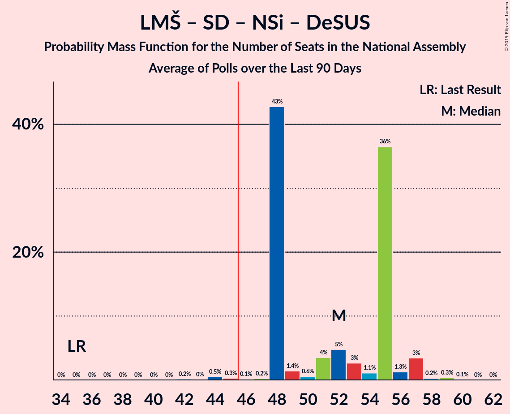
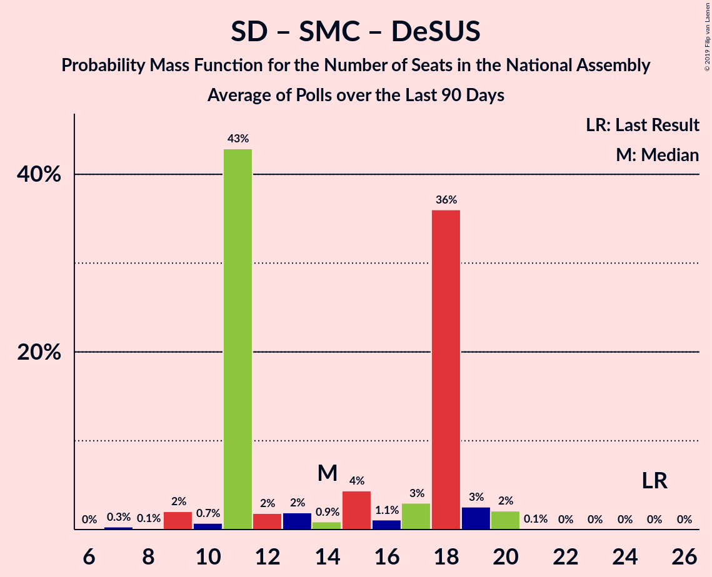

# Poll Average

<a href="#voting-intentions">Voting Intentions</a> | <a href="#seats">Seats</a> | <a href="#coalitions">Coalitions</a> | <a href="#technical-information">Technical Information</a>

## Summary

The table below lists the polls on which the average is based. They are the most recent polls (less than 90 days old) registered and analyzed so far.

| Period     | Polling firm/Commissioner(s) | SDS | LMŠ | SD | SMC | Levica | NSi | PAB | DeSUS | SNS | SLS | GOD–NLS | GOD | NLS | DL | PS | HIM |
|:----------:|:----------------------------:|:--:|:--:|:--:|:--:|:--:|:--:|:--:|:--:|:--:|:--:|:--:|:--:|:--:|:--:|:--:|:--:|
| 3 June 2018 | General Election | 24.9%   25 | 12.6%   13 | 9.9%   10 | 9.7%   10 | 9.3%   9 | 7.2%   7 | 5.1%   5 | 4.9%   5 | 4.2%   4 | 2.6%   0 | 0.2%   0 | 0.2%   0 | 0.2%   0 | 0.0%   0 | 0.0%   0 | 0.0%   2 |
| N/A | Poll Average | 22–28%   20–28 | 24–33%   23–33 | 10–16%   10–16 | 1–3%   0 | 7–12%   7–11 | 6–12%   5–11 | 1–4%   0–4 | 3–6%   0–6 | 2–6%   0–6 | 2–4%   0–4 | N/A   N/A | N/A   N/A | N/A   N/A | N/A   N/A | N/A   N/A | N/A   N/A |
| [11–13 July 2019](2019-07-13-Ninamedia.html) | Ninamedia   RTV SLO and Dnevnik | 22–29%   21–28 | 27–33%   26–34 | 12–17%   11–16 | 1–3%   0 | 7–11%   6–11 | 6–10%   5–10 | 1–3%   0 | 3–7%   0–6 | 2–4%   0–4 | 1–4%   0 | N/A   N/A | N/A   N/A | N/A   N/A | N/A   N/A | N/A   N/A | N/A   N/A |
| [1–23 June 2019](2019-06-23-Mediana.html) | Mediana   POP TV | 21–28%   20–28 | 24–30%   23–30 | 10–15%   9–15 | 1–3%   0 | 8–12%   7–12 | 8–12%   7–12 | 2–5%   0–4 | 3–6%   0–5 | 3–7%   0–6 | 2–5%   0–4 | N/A   N/A | N/A   N/A | N/A   N/A | N/A   N/A | N/A   N/A | N/A   N/A |
| 3 June 2018 | General Election | 24.9%   25 | 12.6%   13 | 9.9%   10 | 9.7%   10 | 9.3%   9 | 7.2%   7 | 5.1%   5 | 4.9%   5 | 4.2%   4 | 2.6%   0 | 0.2%   0 | 0.2%   0 | 0.2%   0 | 0.0%   0 | 0.0%   0 | 0.0%   2 |

Only polls for which at least the sample size has been published are included in the table above.

**Legend:**
+ **Top half of each row:** Voting intentions (95% confidence interval)
+ **Bottom half of each row:** Seat projections for the National Assembly (95% confidence interval)
+ **SDS:** Slovenska demokratska stranka
+ **LMŠ:** Lista Marjana Šarca
+ **SD:** Socialni demokrati
+ **SMC:** Stranka modernega centra
+ **Levica:** Levica
+ **NSi:** Nova Slovenija–Krščanski demokrati
+ **PAB:** Stranka Alenke Bratušek
+ **DeSUS:** Demokratična stranka upokojencev Slovenije
+ **SNS:** Slovenska nacionalna stranka
+ **SLS:** Slovenska ljudska stranka
+ **GOD–NLS:** Glas za otroke in družine–Nova ljudska stranka Slovenije
+ **GOD:** Glas za otroke in družine
+ **NLS:** Nova ljudska stranka Slovenije
+ **DL:** Državljanska lista
+ **PS:** Pozitivna Slovenija
+ **HIM:** Hungarian and Italian minorities
+ **N/A (single party):** Party not included the published results
+ **N/A (entire row):** Calculation for this opinion poll not started yet

## Voting Intentions

### Confidence Intervals

| Party | Last Result | Median | 80% Confidence Interval | 90% Confidence Interval | 95% Confidence Interval | 99% Confidence Interval |
|:-----:|:-----------:|:------:|:-----------------------:|:-----------------------:|:-----------------------:|:-----------------------:|
| <a href="#slovenska-demokratska-stranka">Slovenska demokratska stranka</a> | 24.9% | 24.7% | 22.6–26.9% |22.0–27.6% | 21.5–28.1% | 20.6–29.2% |
| <a href="#lista-marjana-šarca">Lista Marjana Šarca</a> | 12.6% | 28.4% | 25.5–31.4% |24.8–32.2% | 24.3–32.8% | 23.2–34.0% |
| <a href="#socialni-demokrati">Socialni demokrati</a> | 9.9% | 13.3% | 11.3–15.4% |10.8–16.0% | 10.4–16.5% | 9.7–17.5% |
| <a href="#stranka-modernega-centra">Stranka modernega centra</a> | 9.7% | 1.8% | 1.1–2.6% |1.0–2.8% | 0.9–3.1% | 0.7–3.5% |
| <a href="#levica">Levica</a> | 9.3% | 9.2% | 7.8–10.7% |7.4–11.1% | 7.1–11.6% | 6.5–12.4% |
| <a href="#nova-slovenija–krščanski-demokrati">Nova Slovenija–Krščanski demokrati</a> | 7.2% | 8.7% | 7.0–10.5% |6.6–11.0% | 6.2–11.5% | 5.7–12.3% |
| <a href="#stranka-alenke-bratušek">Stranka Alenke Bratušek</a> | 5.1% | 2.4% | 1.3–3.9% |1.1–4.2% | 1.0–4.5% | 0.8–5.1% |
| <a href="#demokratična-stranka-upokojencev-slovenije">Demokratična stranka upokojencev Slovenije</a> | 4.9% | 4.5% | 3.4–5.7% |3.1–6.1% | 2.9–6.4% | 2.5–7.1% |
| <a href="#slovenska-nacionalna-stranka">Slovenska nacionalna stranka</a> | 4.2% | 3.8% | 2.3–5.5% |2.1–5.9% | 1.9–6.2% | 1.6–6.9% |
| <a href="#slovenska-ljudska-stranka">Slovenska ljudska stranka</a> | 2.6% | 2.8% | 1.9–3.9% |1.7–4.2% | 1.5–4.5% | 1.3–5.1% |
| <a href="#glas-za-otroke-in-družine–nova-ljudska-stranka-slovenije">Glas za otroke in družine–Nova ljudska stranka Slovenije</a> | 0.2% | N/A | N/A |N/A | N/A | N/A |
| <a href="#glas-za-otroke-in-družine">Glas za otroke in družine</a> | 0.2% | N/A | N/A |N/A | N/A | N/A |
| <a href="#nova-ljudska-stranka-slovenije">Nova ljudska stranka Slovenije</a> | 0.2% | N/A | N/A |N/A | N/A | N/A |
| <a href="#državljanska-lista">Državljanska lista</a> | 0.0% | N/A | N/A |N/A | N/A | N/A |
| <a href="#pozitivna-slovenija">Pozitivna Slovenija</a> | 0.0% | N/A | N/A |N/A | N/A | N/A |
| <a href="#hungarian-and-italian-minorities">Hungarian and Italian minorities</a> | 0.0% | N/A | N/A |N/A | N/A | N/A |

### Slovenska demokratska stranka

*For a full overview of the results for this party, see the [Slovenska demokratska stranka](party-slovenskademokratskastranka.html) page.*

| Voting Intentions | Probability | Accumulated | Special Marks |
|:-----------------:|:-----------:|:-----------:|:-------------:|
| 18.5–19.5% | 0% | 100% |  |
| 19.5–20.5% | 0.4% | 99.9% |  |
| 20.5–21.5% | 2% | 99.5% |  |
| 21.5–22.5% | 7% | 97% |  |
| 22.5–23.5% | 15% | 91% |  |
| 23.5–24.5% | 22% | 76% |  |
| 24.5–25.5% | 23% | 54% | Last Result, Median |
| 25.5–26.5% | 17% | 32% |  |
| 26.5–27.5% | 9% | 14% |  |
| 27.5–28.5% | 4% | 5% |  |
| 28.5–29.5% | 1.1% | 1.4% |  |
| 29.5–30.5% | 0.2% | 0.3% |  |
| 30.5–31.5% | 0% | 0% |  |
| 31.5–32.5% | 0% | 0% |  |

### Lista Marjana Šarca

*For a full overview of the results for this party, see the [Lista Marjana Šarca](party-listamarjanašarca.html) page.*

| Voting Intentions | Probability | Accumulated | Special Marks |
|:-----------------:|:-----------:|:-----------:|:-------------:|
| 12.5–13.5% | 0% | 100% | Last Result |
| 13.5–14.5% | 0% | 100% |  |
| 14.5–15.5% | 0% | 100% |  |
| 15.5–16.5% | 0% | 100% |  |
| 16.5–17.5% | 0% | 100% |  |
| 17.5–18.5% | 0% | 100% |  |
| 18.5–19.5% | 0% | 100% |  |
| 19.5–20.5% | 0% | 100% |  |
| 20.5–21.5% | 0% | 100% |  |
| 21.5–22.5% | 0.1% | 100% |  |
| 22.5–23.5% | 0.7% | 99.8% |  |
| 23.5–24.5% | 3% | 99.1% |  |
| 24.5–25.5% | 7% | 96% |  |
| 25.5–26.5% | 12% | 90% |  |
| 26.5–27.5% | 15% | 78% |  |
| 27.5–28.5% | 16% | 63% | Median |
| 28.5–29.5% | 16% | 48% |  |
| 29.5–30.5% | 13% | 32% |  |
| 30.5–31.5% | 10% | 19% |  |
| 31.5–32.5% | 5% | 9% |  |
| 32.5–33.5% | 2% | 3% |  |
| 33.5–34.5% | 0.8% | 1.0% |  |
| 34.5–35.5% | 0.2% | 0.2% |  |
| 35.5–36.5% | 0% | 0% |  |

### Socialni demokrati

*For a full overview of the results for this party, see the [Socialni demokrati](party-socialnidemokrati.html) page.*

| Voting Intentions | Probability | Accumulated | Special Marks |
|:-----------------:|:-----------:|:-----------:|:-------------:|
| 7.5–8.5% | 0% | 100% |  |
| 8.5–9.5% | 0.4% | 100% |  |
| 9.5–10.5% | 3% | 99.6% | Last Result |
| 10.5–11.5% | 11% | 97% |  |
| 11.5–12.5% | 19% | 86% |  |
| 12.5–13.5% | 24% | 67% | Median |
| 13.5–14.5% | 21% | 43% |  |
| 14.5–15.5% | 14% | 22% |  |
| 15.5–16.5% | 6% | 8% |  |
| 16.5–17.5% | 2% | 2% |  |
| 17.5–18.5% | 0.4% | 0.4% |  |
| 18.5–19.5% | 0.1% | 0.1% |  |
| 19.5–20.5% | 0% | 0% |  |

### Stranka modernega centra

*For a full overview of the results for this party, see the [Stranka modernega centra](party-strankamodernegacentra.html) page.*

| Voting Intentions | Probability | Accumulated | Special Marks |
|:-----------------:|:-----------:|:-----------:|:-------------:|
| 0.0–0.5% | 0.1% | 100% |  |
| 0.5–1.5% | 34% | 99.9% |  |
| 1.5–2.5% | 55% | 66% | Median |
| 2.5–3.5% | 10% | 11% |  |
| 3.5–4.5% | 0.4% | 0.5% |  |
| 4.5–5.5% | 0% | 0% |  |
| 5.5–6.5% | 0% | 0% |  |
| 6.5–7.5% | 0% | 0% |  |
| 7.5–8.5% | 0% | 0% |  |
| 8.5–9.5% | 0% | 0% |  |
| 9.5–10.5% | 0% | 0% | Last Result |

### Levica

*For a full overview of the results for this party, see the [Levica](party-levica.html) page.*

| Voting Intentions | Probability | Accumulated | Special Marks |
|:-----------------:|:-----------:|:-----------:|:-------------:|
| 4.5–5.5% | 0% | 100% |  |
| 5.5–6.5% | 0.6% | 100% |  |
| 6.5–7.5% | 6% | 99.4% |  |
| 7.5–8.5% | 22% | 93% |  |
| 8.5–9.5% | 34% | 71% | Last Result, Median |
| 9.5–10.5% | 25% | 37% |  |
| 10.5–11.5% | 10% | 12% |  |
| 11.5–12.5% | 2% | 3% |  |
| 12.5–13.5% | 0.3% | 0.3% |  |
| 13.5–14.5% | 0% | 0% |  |

### Nova Slovenija–Krščanski demokrati

*For a full overview of the results for this party, see the [Nova Slovenija–Krščanski demokrati](party-novaslovenija–krščanskidemokrati.html) page.*

| Voting Intentions | Probability | Accumulated | Special Marks |
|:-----------------:|:-----------:|:-----------:|:-------------:|
| 3.5–4.5% | 0% | 100% |  |
| 4.5–5.5% | 0.3% | 100% |  |
| 5.5–6.5% | 5% | 99.7% |  |
| 6.5–7.5% | 16% | 95% | Last Result |
| 7.5–8.5% | 26% | 79% |  |
| 8.5–9.5% | 26% | 53% | Median |
| 9.5–10.5% | 18% | 27% |  |
| 10.5–11.5% | 8% | 10% |  |
| 11.5–12.5% | 2% | 2% |  |
| 12.5–13.5% | 0.3% | 0.3% |  |
| 13.5–14.5% | 0% | 0% |  |

### Stranka Alenke Bratušek

*For a full overview of the results for this party, see the [Stranka Alenke Bratušek](party-strankaalenkebratušek.html) page.*

| Voting Intentions | Probability | Accumulated | Special Marks |
|:-----------------:|:-----------:|:-----------:|:-------------:|
| 0.0–0.5% | 0% | 100% |  |
| 0.5–1.5% | 20% | 100% |  |
| 1.5–2.5% | 32% | 80% | Median |
| 2.5–3.5% | 30% | 47% |  |
| 3.5–4.5% | 15% | 18% |  |
| 4.5–5.5% | 2% | 2% | Last Result |
| 5.5–6.5% | 0.1% | 0.1% |  |
| 6.5–7.5% | 0% | 0% |  |

### Demokratična stranka upokojencev Slovenije

*For a full overview of the results for this party, see the [Demokratična stranka upokojencev Slovenije](party-demokratičnastrankaupokojencevslovenije.html) page.*

| Voting Intentions | Probability | Accumulated | Special Marks |
|:-----------------:|:-----------:|:-----------:|:-------------:|
| 0.5–1.5% | 0% | 100% |  |
| 1.5–2.5% | 0.6% | 100% |  |
| 2.5–3.5% | 14% | 99.4% |  |
| 3.5–4.5% | 40% | 85% | Median |
| 4.5–5.5% | 32% | 46% | Last Result |
| 5.5–6.5% | 11% | 13% |  |
| 6.5–7.5% | 2% | 2% |  |
| 7.5–8.5% | 0.1% | 0.1% |  |
| 8.5–9.5% | 0% | 0% |  |

### Slovenska nacionalna stranka

*For a full overview of the results for this party, see the [Slovenska nacionalna stranka](party-slovenskanacionalnastranka.html) page.*

| Voting Intentions | Probability | Accumulated | Special Marks |
|:-----------------:|:-----------:|:-----------:|:-------------:|
| 0.0–0.5% | 0% | 100% |  |
| 0.5–1.5% | 0.4% | 100% |  |
| 1.5–2.5% | 16% | 99.6% |  |
| 2.5–3.5% | 29% | 83% |  |
| 3.5–4.5% | 23% | 55% | Last Result, Median |
| 4.5–5.5% | 22% | 32% |  |
| 5.5–6.5% | 8% | 10% |  |
| 6.5–7.5% | 1.1% | 1.2% |  |
| 7.5–8.5% | 0.1% | 0.1% |  |
| 8.5–9.5% | 0% | 0% |  |

### Slovenska ljudska stranka

*For a full overview of the results for this party, see the [Slovenska ljudska stranka](party-slovenskaljudskastranka.html) page.*

| Voting Intentions | Probability | Accumulated | Special Marks |
|:-----------------:|:-----------:|:-----------:|:-------------:|
| 0.0–0.5% | 0% | 100% |  |
| 0.5–1.5% | 3% | 100% |  |
| 1.5–2.5% | 34% | 97% |  |
| 2.5–3.5% | 44% | 64% | Last Result, Median |
| 3.5–4.5% | 17% | 19% |  |
| 4.5–5.5% | 2% | 2% |  |
| 5.5–6.5% | 0.1% | 0.1% |  |
| 6.5–7.5% | 0% | 0% |  |

## Seats

### Confidence Intervals

| Party | Last Result | Median | 80% Confidence Interval | 90% Confidence Interval | 95% Confidence Interval | 99% Confidence Interval |
|:-----:|:-----------:|:------:|:-----------------------:|:-----------------------:|:-----------------------:|:-----------------------:|
| <a href="#slovenska-demokratska-stranka">Slovenska demokratska stranka</a> | 25 | 24 | 22–26 |21–28 | 20–28 | 20–29 |
| <a href="#lista-marjana-šarca">Lista Marjana Šarca</a> | 13 | 28 | 25–31 |24–32 | 23–33 | 22–34 |
| <a href="#socialni-demokrati">Socialni demokrati</a> | 10 | 12 | 11–15 |10–15 | 10–16 | 9–17 |
| <a href="#stranka-modernega-centra">Stranka modernega centra</a> | 10 | 0 | 0 |0 | 0 | 0 |
| <a href="#levica">Levica</a> | 9 | 9 | 7–11 |7–11 | 7–11 | 6–12 |
| <a href="#nova-slovenija–krščanski-demokrati">Nova Slovenija–Krščanski demokrati</a> | 7 | 8 | 6–10 |6–11 | 5–11 | 5–12 |
| <a href="#stranka-alenke-bratušek">Stranka Alenke Bratušek</a> | 5 | 0 | 0–4 |0–4 | 0–4 | 0–5 |
| <a href="#demokratična-stranka-upokojencev-slovenije">Demokratična stranka upokojencev Slovenije</a> | 5 | 4 | 0–5 |0–6 | 0–6 | 0–7 |
| <a href="#slovenska-nacionalna-stranka">Slovenska nacionalna stranka</a> | 4 | 0 | 0–5 |0–6 | 0–6 | 0–7 |
| <a href="#slovenska-ljudska-stranka">Slovenska ljudska stranka</a> | 0 | 0 | 0 |0–3 | 0–4 | 0–5 |
| <a href="#glas-za-otroke-in-družine–nova-ljudska-stranka-slovenije">Glas za otroke in družine–Nova ljudska stranka Slovenije</a> | 0 | N/A | N/A |N/A | N/A | N/A |
| <a href="#glas-za-otroke-in-družine">Glas za otroke in družine</a> | 0 | N/A | N/A |N/A | N/A | N/A |
| <a href="#nova-ljudska-stranka-slovenije">Nova ljudska stranka Slovenije</a> | 0 | N/A | N/A |N/A | N/A | N/A |
| <a href="#državljanska-lista">Državljanska lista</a> | 0 | N/A | N/A |N/A | N/A | N/A |
| <a href="#pozitivna-slovenija">Pozitivna Slovenija</a> | 0 | N/A | N/A |N/A | N/A | N/A |
| <a href="#hungarian-and-italian-minorities">Hungarian and Italian minorities</a> | 2 | N/A | N/A |N/A | N/A | N/A |

### Slovenska demokratska stranka

*For a full overview of the results for this party, see the [Slovenska demokratska stranka](party-slovenskademokratskastranka.html) page.*

| Number of Seats | Probability | Accumulated | Special Marks |
|:---------------:|:-----------:|:-----------:|:-------------:|
| 19 | 0.2% | 100% |  |
| 20 | 3% | 99.7% |  |
| 21 | 3% | 97% |  |
| 22 | 16% | 94% |  |
| 23 | 15% | 78% |  |
| 24 | 23% | 63% | Median |
| 25 | 18% | 40% | Last Result |
| 26 | 13% | 22% |  |
| 27 | 4% | 9% |  |
| 28 | 5% | 6% |  |
| 29 | 0.8% | 1.1% |  |
| 30 | 0.2% | 0.3% |  |
| 31 | 0.1% | 0.1% |  |
| 32 | 0% | 0% |  |

### Lista Marjana Šarca

*For a full overview of the results for this party, see the [Lista Marjana Šarca](party-listamarjanašarca.html) page.*

| Number of Seats | Probability | Accumulated | Special Marks |
|:---------------:|:-----------:|:-----------:|:-------------:|
| 13 | 0% | 100% | Last Result |
| 14 | 0% | 100% |  |
| 15 | 0% | 100% |  |
| 16 | 0% | 100% |  |
| 17 | 0% | 100% |  |
| 18 | 0% | 100% |  |
| 19 | 0% | 100% |  |
| 20 | 0% | 100% |  |
| 21 | 0.1% | 100% |  |
| 22 | 0.6% | 99.9% |  |
| 23 | 2% | 99.3% |  |
| 24 | 4% | 97% |  |
| 25 | 10% | 93% |  |
| 26 | 9% | 83% |  |
| 27 | 15% | 74% |  |
| 28 | 20% | 59% | Median |
| 29 | 10% | 39% |  |
| 30 | 15% | 29% |  |
| 31 | 6% | 14% |  |
| 32 | 3% | 8% |  |
| 33 | 3% | 5% |  |
| 34 | 1.0% | 1.3% |  |
| 35 | 0.2% | 0.3% |  |
| 36 | 0.1% | 0.1% |  |
| 37 | 0% | 0% |  |

### Socialni demokrati

*For a full overview of the results for this party, see the [Socialni demokrati](party-socialnidemokrati.html) page.*

| Number of Seats | Probability | Accumulated | Special Marks |
|:---------------:|:-----------:|:-----------:|:-------------:|
| 8 | 0.1% | 100% |  |
| 9 | 1.1% | 99.9% |  |
| 10 | 5% | 98.7% | Last Result |
| 11 | 22% | 94% |  |
| 12 | 22% | 72% | Median |
| 13 | 16% | 50% |  |
| 14 | 18% | 34% |  |
| 15 | 13% | 16% |  |
| 16 | 2% | 3% |  |
| 17 | 0.7% | 0.8% |  |
| 18 | 0.1% | 0.2% |  |
| 19 | 0% | 0.1% |  |
| 20 | 0% | 0% |  |

### Stranka modernega centra

*For a full overview of the results for this party, see the [Stranka modernega centra](party-strankamodernegacentra.html) page.*

| Number of Seats | Probability | Accumulated | Special Marks |
|:---------------:|:-----------:|:-----------:|:-------------:|
| 0 | 99.9% | 100% | Median |
| 1 | 0% | 0.1% |  |
| 2 | 0% | 0.1% |  |
| 3 | 0% | 0.1% |  |
| 4 | 0.1% | 0.1% |  |
| 5 | 0% | 0% |  |
| 6 | 0% | 0% |  |
| 7 | 0% | 0% |  |
| 8 | 0% | 0% |  |
| 9 | 0% | 0% |  |
| 10 | 0% | 0% | Last Result |

### Levica

*For a full overview of the results for this party, see the [Levica](party-levica.html) page.*

| Number of Seats | Probability | Accumulated | Special Marks |
|:---------------:|:-----------:|:-----------:|:-------------:|
| 5 | 0.1% | 100% |  |
| 6 | 2% | 99.9% |  |
| 7 | 10% | 98% |  |
| 8 | 24% | 87% |  |
| 9 | 27% | 63% | Last Result, Median |
| 10 | 24% | 36% |  |
| 11 | 9% | 11% |  |
| 12 | 2% | 2% |  |
| 13 | 0.2% | 0.3% |  |
| 14 | 0.1% | 0.1% |  |
| 15 | 0% | 0% |  |

### Nova Slovenija–Krščanski demokrati

*For a full overview of the results for this party, see the [Nova Slovenija–Krščanski demokrati](party-novaslovenija–krščanskidemokrati.html) page.*

| Number of Seats | Probability | Accumulated | Special Marks |
|:---------------:|:-----------:|:-----------:|:-------------:|
| 5 | 3% | 100% |  |
| 6 | 11% | 97% |  |
| 7 | 18% | 86% | Last Result |
| 8 | 19% | 67% | Median |
| 9 | 25% | 48% |  |
| 10 | 16% | 23% |  |
| 11 | 5% | 7% |  |
| 12 | 2% | 2% |  |
| 13 | 0.2% | 0.2% |  |
| 14 | 0% | 0% |  |

### Stranka Alenke Bratušek

*For a full overview of the results for this party, see the [Stranka Alenke Bratušek](party-strankaalenkebratušek.html) page.*

| Number of Seats | Probability | Accumulated | Special Marks |
|:---------------:|:-----------:|:-----------:|:-------------:|
| 0 | 87% | 100% | Median |
| 1 | 0% | 13% |  |
| 2 | 0% | 13% |  |
| 3 | 0.5% | 13% |  |
| 4 | 11% | 12% |  |
| 5 | 0.9% | 1.0% | Last Result |
| 6 | 0% | 0% |  |

### Demokratična stranka upokojencev Slovenije

*For a full overview of the results for this party, see the [Demokratična stranka upokojencev Slovenije](party-demokratičnastrankaupokojencevslovenije.html) page.*

| Number of Seats | Probability | Accumulated | Special Marks |
|:---------------:|:-----------:|:-----------:|:-------------:|
| 0 | 34% | 100% |  |
| 1 | 0% | 66% |  |
| 2 | 0% | 66% |  |
| 3 | 3% | 66% |  |
| 4 | 33% | 64% | Median |
| 5 | 25% | 31% | Last Result |
| 6 | 5% | 6% |  |
| 7 | 0.5% | 0.6% |  |
| 8 | 0% | 0% |  |

### Slovenska nacionalna stranka

*For a full overview of the results for this party, see the [Slovenska nacionalna stranka](party-slovenskanacionalnastranka.html) page.*

| Number of Seats | Probability | Accumulated | Special Marks |
|:---------------:|:-----------:|:-----------:|:-------------:|
| 0 | 52% | 100% | Median |
| 1 | 0% | 48% |  |
| 2 | 0% | 48% |  |
| 3 | 1.1% | 48% |  |
| 4 | 29% | 47% | Last Result |
| 5 | 12% | 19% |  |
| 6 | 6% | 7% |  |
| 7 | 0.7% | 0.8% |  |
| 8 | 0% | 0% |  |

### Slovenska ljudska stranka

*For a full overview of the results for this party, see the [Slovenska ljudska stranka](party-slovenskaljudskastranka.html) page.*

| Number of Seats | Probability | Accumulated | Special Marks |
|:---------------:|:-----------:|:-----------:|:-------------:|
| 0 | 95% | 100% | Last Result, Median |
| 1 | 0% | 5% |  |
| 2 | 0% | 5% |  |
| 3 | 0.2% | 5% |  |
| 4 | 4% | 5% |  |
| 5 | 0.5% | 0.5% |  |
| 6 | 0% | 0% |  |

## Coalitions

### Confidence Intervals

| Coalition | Last Result | Median | Majority? | 80% Confidence Interval | 90% Confidence Interval | 95% Confidence Interval | 99% Confidence Interval |
|:---------:|:-----------:|:------:|:---------:|:-----------------------:|:-----------------------:|:-----------------------:|:-----------------------:|
| Slovenska demokratska stranka – Lista Marjana Šarca – Demokratična stranka upokojencev Slovenije | 43 | 56 | 99.8% | 50–60 | 49–60 | 49–61 | 46–62 |
| Lista Marjana Šarca – Socialni demokrati – Stranka modernega centra – Nova Slovenija–Krščanski demokrati – Stranka Alenke Bratušek – Demokratična stranka upokojencev Slovenije | 50 | 53 | 98.9% | 49–56 | 48–57 | 47–58 | 45–59 |
| Lista Marjana Šarca – Socialni demokrati – Nova Slovenija–Krščanski demokrati – Demokratična stranka upokojencev Slovenije | 35 | 53 | 98% | 48–56 | 47–57 | 46–58 | 44–59 |
| Lista Marjana Šarca – Socialni demokrati – Stranka modernega centra – Nova Slovenija–Krščanski demokrati – Demokratična stranka upokojencev Slovenije | 45 | 53 | 98% | 48–56 | 47–57 | 46–58 | 44–59 |
| Slovenska demokratska stranka – Lista Marjana Šarca | 38 | 52 | 98.8% | 48–57 | 47–57 | 46–58 | 45–59 |
| Lista Marjana Šarca – Socialni demokrati – Nova Slovenija–Krščanski demokrati | 30 | 49 | 89% | 45–52 | 45–53 | 44–54 | 43–56 |
| Lista Marjana Šarca – Socialni demokrati – Stranka modernega centra – Nova Slovenija–Krščanski demokrati | 40 | 49 | 89% | 45–52 | 45–53 | 44–54 | 43–56 |
| Lista Marjana Šarca – Socialni demokrati – Demokratična stranka upokojencev Slovenije | 28 | 44 | 39% | 38–49 | 37–50 | 37–50 | 35–52 |
| Lista Marjana Šarca – Socialni demokrati – Stranka modernega centra – Stranka Alenke Bratušek – Demokratična stranka upokojencev Slovenije | 43 | 44 | 40% | 39–49 | 38–50 | 37–50 | 36–52 |
| Lista Marjana Šarca – Socialni demokrati – Stranka modernega centra – Demokratična stranka upokojencev Slovenije | 38 | 44 | 39% | 38–49 | 37–50 | 37–50 | 35–52 |
| Lista Marjana Šarca – Socialni demokrati | 23 | 41 | 5% | 36–45 | 36–46 | 35–48 | 34–48 |
| Lista Marjana Šarca – Socialni demokrati – Stranka modernega centra | 33 | 41 | 5% | 36–45 | 36–46 | 35–48 | 34–48 |
| Slovenska demokratska stranka – Nova Slovenija–Krščanski demokrati – Demokratična stranka upokojencev Slovenije – Slovenska ljudska stranka – Državljanska lista | 37 | 35 | 0% | 32–39 | 32–40 | 31–40 | 30–42 |
| Socialni demokrati – Demokratična stranka upokojencev Slovenije – Državljanska lista – Pozitivna Slovenija | 15 | 16 | 0% | 11–19 | 11–20 | 10–20 | 10–22 |
| Socialni demokrati – Stranka modernega centra – Demokratična stranka upokojencev Slovenije | 25 | 16 | 0% | 11–19 | 11–20 | 10–20 | 10–22 |
| Socialni demokrati – Stranka modernega centra – Pozitivna Slovenija | 20 | 12 | 0% | 11–15 | 10–15 | 10–16 | 9–17 |

### Slovenska demokratska stranka – Lista Marjana Šarca – Demokratična stranka upokojencev Slovenije

| Number of Seats | Probability | Accumulated | Special Marks |
|:---------------:|:-----------:|:-----------:|:-------------:|
| 43 | 0% | 100% | Last Result |
| 44 | 0% | 100% |  |
| 45 | 0.1% | 100% |  |
| 46 | 0.5% | 99.8% | Majority |
| 47 | 0.5% | 99.4% |  |
| 48 | 1.4% | 98.9% |  |
| 49 | 4% | 98% |  |
| 50 | 7% | 93% |  |
| 51 | 10% | 87% |  |
| 52 | 10% | 76% |  |
| 53 | 4% | 67% |  |
| 54 | 5% | 63% |  |
| 55 | 7% | 58% |  |
| 56 | 6% | 51% | Median |
| 57 | 11% | 45% |  |
| 58 | 13% | 35% |  |
| 59 | 8% | 22% |  |
| 60 | 10% | 13% |  |
| 61 | 2% | 4% |  |
| 62 | 1.2% | 2% |  |
| 63 | 0.3% | 0.5% |  |
| 64 | 0.2% | 0.2% |  |
| 65 | 0% | 0% |  |

### Lista Marjana Šarca – Socialni demokrati – Stranka modernega centra – Nova Slovenija–Krščanski demokrati – Stranka Alenke Bratušek – Demokratična stranka upokojencev Slovenije

| Number of Seats | Probability | Accumulated | Special Marks |
|:---------------:|:-----------:|:-----------:|:-------------:|
| 43 | 0.1% | 100% |  |
| 44 | 0.2% | 99.9% |  |
| 45 | 0.8% | 99.7% |  |
| 46 | 1.3% | 98.9% | Majority |
| 47 | 2% | 98% |  |
| 48 | 5% | 95% |  |
| 49 | 9% | 90% |  |
| 50 | 6% | 82% | Last Result |
| 51 | 10% | 76% |  |
| 52 | 8% | 66% | Median |
| 53 | 17% | 57% |  |
| 54 | 14% | 40% |  |
| 55 | 13% | 26% |  |
| 56 | 6% | 13% |  |
| 57 | 4% | 7% |  |
| 58 | 2% | 3% |  |
| 59 | 0.7% | 0.9% |  |
| 60 | 0.1% | 0.2% |  |
| 61 | 0% | 0% |  |

### Lista Marjana Šarca – Socialni demokrati – Nova Slovenija–Krščanski demokrati – Demokratična stranka upokojencev Slovenije

| Number of Seats | Probability | Accumulated | Special Marks |
|:---------------:|:-----------:|:-----------:|:-------------:|
| 35 | 0% | 100% | Last Result |
| 36 | 0% | 100% |  |
| 37 | 0% | 100% |  |
| 38 | 0% | 100% |  |
| 39 | 0% | 100% |  |
| 40 | 0% | 100% |  |
| 41 | 0% | 100% |  |
| 42 | 0.1% | 100% |  |
| 43 | 0.2% | 99.9% |  |
| 44 | 0.7% | 99.7% |  |
| 45 | 1.1% | 99.0% |  |
| 46 | 1.5% | 98% | Majority |
| 47 | 6% | 96% |  |
| 48 | 6% | 91% |  |
| 49 | 13% | 84% |  |
| 50 | 7% | 72% |  |
| 51 | 7% | 65% |  |
| 52 | 7% | 58% | Median |
| 53 | 12% | 51% |  |
| 54 | 13% | 38% |  |
| 55 | 13% | 25% |  |
| 56 | 5% | 12% |  |
| 57 | 4% | 7% |  |
| 58 | 2% | 3% |  |
| 59 | 0.7% | 0.9% |  |
| 60 | 0.1% | 0.2% |  |
| 61 | 0% | 0% |  |

### Lista Marjana Šarca – Socialni demokrati – Stranka modernega centra – Nova Slovenija–Krščanski demokrati – Demokratična stranka upokojencev Slovenije

| Number of Seats | Probability | Accumulated | Special Marks |
|:---------------:|:-----------:|:-----------:|:-------------:|
| 42 | 0.1% | 100% |  |
| 43 | 0.2% | 99.9% |  |
| 44 | 0.7% | 99.7% |  |
| 45 | 1.1% | 99.0% | Last Result |
| 46 | 1.5% | 98% | Majority |
| 47 | 5% | 96% |  |
| 48 | 6% | 91% |  |
| 49 | 13% | 85% |  |
| 50 | 7% | 72% |  |
| 51 | 7% | 65% |  |
| 52 | 7% | 58% | Median |
| 53 | 12% | 51% |  |
| 54 | 13% | 38% |  |
| 55 | 13% | 25% |  |
| 56 | 5% | 12% |  |
| 57 | 4% | 7% |  |
| 58 | 2% | 3% |  |
| 59 | 0.7% | 0.9% |  |
| 60 | 0.1% | 0.2% |  |
| 61 | 0% | 0% |  |

### Slovenska demokratska stranka – Lista Marjana Šarca

| Number of Seats | Probability | Accumulated | Special Marks |
|:---------------:|:-----------:|:-----------:|:-------------:|
| 38 | 0% | 100% | Last Result |
| 39 | 0% | 100% |  |
| 40 | 0% | 100% |  |
| 41 | 0% | 100% |  |
| 42 | 0% | 100% |  |
| 43 | 0.1% | 100% |  |
| 44 | 0.3% | 99.9% |  |
| 45 | 0.7% | 99.5% |  |
| 46 | 2% | 98.8% | Majority |
| 47 | 7% | 97% |  |
| 48 | 6% | 91% |  |
| 49 | 6% | 85% |  |
| 50 | 12% | 79% |  |
| 51 | 7% | 67% |  |
| 52 | 13% | 60% | Median |
| 53 | 12% | 47% |  |
| 54 | 13% | 35% |  |
| 55 | 7% | 22% |  |
| 56 | 5% | 15% |  |
| 57 | 7% | 11% |  |
| 58 | 2% | 3% |  |
| 59 | 0.5% | 0.8% |  |
| 60 | 0.2% | 0.3% |  |
| 61 | 0.1% | 0.1% |  |
| 62 | 0% | 0% |  |

### Lista Marjana Šarca – Socialni demokrati – Nova Slovenija–Krščanski demokrati

| Number of Seats | Probability | Accumulated | Special Marks |
|:---------------:|:-----------:|:-----------:|:-------------:|
| 30 | 0% | 100% | Last Result |
| 31 | 0% | 100% |  |
| 32 | 0% | 100% |  |
| 33 | 0% | 100% |  |
| 34 | 0% | 100% |  |
| 35 | 0% | 100% |  |
| 36 | 0% | 100% |  |
| 37 | 0% | 100% |  |
| 38 | 0% | 100% |  |
| 39 | 0% | 100% |  |
| 40 | 0.1% | 100% |  |
| 41 | 0.1% | 99.9% |  |
| 42 | 0.3% | 99.8% |  |
| 43 | 1.1% | 99.5% |  |
| 44 | 3% | 98% |  |
| 45 | 7% | 96% |  |
| 46 | 7% | 89% | Majority |
| 47 | 8% | 82% |  |
| 48 | 14% | 74% | Median |
| 49 | 17% | 59% |  |
| 50 | 14% | 42% |  |
| 51 | 12% | 28% |  |
| 52 | 7% | 16% |  |
| 53 | 4% | 9% |  |
| 54 | 3% | 5% |  |
| 55 | 0.9% | 2% |  |
| 56 | 0.3% | 0.7% |  |
| 57 | 0.4% | 0.5% |  |
| 58 | 0% | 0% |  |

### Lista Marjana Šarca – Socialni demokrati – Stranka modernega centra – Nova Slovenija–Krščanski demokrati

| Number of Seats | Probability | Accumulated | Special Marks |
|:---------------:|:-----------:|:-----------:|:-------------:|
| 40 | 0.1% | 100% | Last Result |
| 41 | 0.1% | 99.9% |  |
| 42 | 0.3% | 99.8% |  |
| 43 | 1.1% | 99.5% |  |
| 44 | 3% | 98% |  |
| 45 | 7% | 96% |  |
| 46 | 7% | 89% | Majority |
| 47 | 8% | 82% |  |
| 48 | 14% | 74% | Median |
| 49 | 18% | 59% |  |
| 50 | 14% | 42% |  |
| 51 | 12% | 28% |  |
| 52 | 7% | 16% |  |
| 53 | 4% | 9% |  |
| 54 | 3% | 5% |  |
| 55 | 0.9% | 2% |  |
| 56 | 0.3% | 0.7% |  |
| 57 | 0.4% | 0.5% |  |
| 58 | 0% | 0% |  |

### Lista Marjana Šarca – Socialni demokrati – Demokratična stranka upokojencev Slovenije

| Number of Seats | Probability | Accumulated | Special Marks |
|:---------------:|:-----------:|:-----------:|:-------------:|
| 28 | 0% | 100% | Last Result |
| 29 | 0% | 100% |  |
| 30 | 0% | 100% |  |
| 31 | 0% | 100% |  |
| 32 | 0% | 100% |  |
| 33 | 0.1% | 100% |  |
| 34 | 0.3% | 99.9% |  |
| 35 | 0.4% | 99.6% |  |
| 36 | 2% | 99.1% |  |
| 37 | 3% | 98% |  |
| 38 | 8% | 94% |  |
| 39 | 7% | 87% |  |
| 40 | 10% | 79% |  |
| 41 | 5% | 69% |  |
| 42 | 5% | 64% |  |
| 43 | 4% | 60% |  |
| 44 | 8% | 55% | Median |
| 45 | 9% | 48% |  |
| 46 | 8% | 39% | Majority |
| 47 | 4% | 31% |  |
| 48 | 12% | 26% |  |
| 49 | 8% | 14% |  |
| 50 | 4% | 5% |  |
| 51 | 0.6% | 1.4% |  |
| 52 | 0.5% | 0.8% |  |
| 53 | 0.3% | 0.3% |  |
| 54 | 0% | 0% |  |

### Lista Marjana Šarca – Socialni demokrati – Stranka modernega centra – Stranka Alenke Bratušek – Demokratična stranka upokojencev Slovenije

| Number of Seats | Probability | Accumulated | Special Marks |
|:---------------:|:-----------:|:-----------:|:-------------:|
| 34 | 0% | 100% |  |
| 35 | 0.3% | 99.9% |  |
| 36 | 1.1% | 99.6% |  |
| 37 | 3% | 98.5% |  |
| 38 | 5% | 96% |  |
| 39 | 6% | 91% |  |
| 40 | 5% | 85% |  |
| 41 | 5% | 79% |  |
| 42 | 7% | 75% |  |
| 43 | 5% | 68% | Last Result |
| 44 | 13% | 62% | Median |
| 45 | 9% | 49% |  |
| 46 | 9% | 40% | Majority |
| 47 | 4% | 31% |  |
| 48 | 13% | 26% |  |
| 49 | 8% | 14% |  |
| 50 | 4% | 5% |  |
| 51 | 0.6% | 1.4% |  |
| 52 | 0.5% | 0.8% |  |
| 53 | 0.3% | 0.3% |  |
| 54 | 0% | 0% |  |

### Lista Marjana Šarca – Socialni demokrati – Stranka modernega centra – Demokratična stranka upokojencev Slovenije

| Number of Seats | Probability | Accumulated | Special Marks |
|:---------------:|:-----------:|:-----------:|:-------------:|
| 33 | 0.1% | 100% |  |
| 34 | 0.3% | 99.9% |  |
| 35 | 0.4% | 99.6% |  |
| 36 | 2% | 99.1% |  |
| 37 | 3% | 98% |  |
| 38 | 8% | 94% | Last Result |
| 39 | 7% | 87% |  |
| 40 | 10% | 79% |  |
| 41 | 5% | 69% |  |
| 42 | 5% | 65% |  |
| 43 | 4% | 60% |  |
| 44 | 8% | 55% | Median |
| 45 | 9% | 48% |  |
| 46 | 8% | 39% | Majority |
| 47 | 4% | 31% |  |
| 48 | 12% | 26% |  |
| 49 | 8% | 14% |  |
| 50 | 4% | 5% |  |
| 51 | 0.6% | 1.4% |  |
| 52 | 0.5% | 0.8% |  |
| 53 | 0.3% | 0.3% |  |
| 54 | 0% | 0% |  |

### Lista Marjana Šarca – Socialni demokrati

| Number of Seats | Probability | Accumulated | Special Marks |
|:---------------:|:-----------:|:-----------:|:-------------:|
| 23 | 0% | 100% | Last Result |
| 24 | 0% | 100% |  |
| 25 | 0% | 100% |  |
| 26 | 0% | 100% |  |
| 27 | 0% | 100% |  |
| 28 | 0% | 100% |  |
| 29 | 0% | 100% |  |
| 30 | 0% | 100% |  |
| 31 | 0% | 100% |  |
| 32 | 0.1% | 100% |  |
| 33 | 0.4% | 99.9% |  |
| 34 | 2% | 99.5% |  |
| 35 | 2% | 98% |  |
| 36 | 9% | 96% |  |
| 37 | 6% | 87% |  |
| 38 | 9% | 81% |  |
| 39 | 10% | 72% |  |
| 40 | 9% | 61% | Median |
| 41 | 9% | 52% |  |
| 42 | 10% | 43% |  |
| 43 | 10% | 34% |  |
| 44 | 10% | 23% |  |
| 45 | 8% | 13% |  |
| 46 | 2% | 5% | Majority |
| 47 | 0.7% | 3% |  |
| 48 | 2% | 3% |  |
| 49 | 0.1% | 0.2% |  |
| 50 | 0.1% | 0.1% |  |
| 51 | 0% | 0% |  |

### Lista Marjana Šarca – Socialni demokrati – Stranka modernega centra

| Number of Seats | Probability | Accumulated | Special Marks |
|:---------------:|:-----------:|:-----------:|:-------------:|
| 32 | 0.1% | 100% |  |
| 33 | 0.4% | 99.9% | Last Result |
| 34 | 2% | 99.5% |  |
| 35 | 2% | 98% |  |
| 36 | 9% | 96% |  |
| 37 | 6% | 87% |  |
| 38 | 9% | 81% |  |
| 39 | 10% | 72% |  |
| 40 | 9% | 61% | Median |
| 41 | 9% | 52% |  |
| 42 | 10% | 43% |  |
| 43 | 10% | 34% |  |
| 44 | 10% | 23% |  |
| 45 | 8% | 13% |  |
| 46 | 2% | 5% | Majority |
| 47 | 0.7% | 3% |  |
| 48 | 2% | 3% |  |
| 49 | 0.1% | 0.2% |  |
| 50 | 0.1% | 0.1% |  |
| 51 | 0% | 0% |  |

### Slovenska demokratska stranka – Nova Slovenija–Krščanski demokrati – Demokratična stranka upokojencev Slovenije – Slovenska ljudska stranka – Državljanska lista

| Number of Seats | Probability | Accumulated | Special Marks |
|:---------------:|:-----------:|:-----------:|:-------------:|
| 29 | 0.4% | 100% |  |
| 30 | 2% | 99.6% |  |
| 31 | 2% | 98% |  |
| 32 | 8% | 96% |  |
| 33 | 5% | 88% |  |
| 34 | 14% | 83% |  |
| 35 | 20% | 70% |  |
| 36 | 15% | 49% | Median |
| 37 | 14% | 34% | Last Result |
| 38 | 6% | 20% |  |
| 39 | 8% | 14% |  |
| 40 | 4% | 6% |  |
| 41 | 2% | 2% |  |
| 42 | 0.7% | 0.8% |  |
| 43 | 0.1% | 0.2% |  |
| 44 | 0% | 0% |  |

### Socialni demokrati – Demokratična stranka upokojencev Slovenije – Državljanska lista – Pozitivna Slovenija

| Number of Seats | Probability | Accumulated | Special Marks |
|:---------------:|:-----------:|:-----------:|:-------------:|
| 9 | 0.3% | 100% |  |
| 10 | 2% | 99.7% |  |
| 11 | 10% | 97% |  |
| 12 | 7% | 87% |  |
| 13 | 5% | 80% |  |
| 14 | 6% | 75% |  |
| 15 | 14% | 70% | Last Result |
| 16 | 12% | 56% | Median |
| 17 | 15% | 43% |  |
| 18 | 9% | 28% |  |
| 19 | 10% | 19% |  |
| 20 | 7% | 9% |  |
| 21 | 2% | 2% |  |
| 22 | 0.5% | 0.7% |  |
| 23 | 0.2% | 0.2% |  |
| 24 | 0% | 0% |  |

### Socialni demokrati – Stranka modernega centra – Demokratična stranka upokojencev Slovenije

| Number of Seats | Probability | Accumulated | Special Marks |
|:---------------:|:-----------:|:-----------:|:-------------:|
| 9 | 0.3% | 100% |  |
| 10 | 2% | 99.7% |  |
| 11 | 10% | 97% |  |
| 12 | 7% | 87% |  |
| 13 | 5% | 80% |  |
| 14 | 6% | 75% |  |
| 15 | 14% | 70% |  |
| 16 | 12% | 56% | Median |
| 17 | 15% | 43% |  |
| 18 | 9% | 28% |  |
| 19 | 10% | 19% |  |
| 20 | 7% | 9% |  |
| 21 | 2% | 2% |  |
| 22 | 0.5% | 0.7% |  |
| 23 | 0.2% | 0.2% |  |
| 24 | 0% | 0% |  |
| 25 | 0% | 0% | Last Result |

### Socialni demokrati – Stranka modernega centra – Pozitivna Slovenija

| Number of Seats | Probability | Accumulated | Special Marks |
|:---------------:|:-----------:|:-----------:|:-------------:|
| 8 | 0.1% | 100% |  |
| 9 | 1.1% | 99.9% |  |
| 10 | 5% | 98.8% |  |
| 11 | 22% | 94% |  |
| 12 | 22% | 72% | Median |
| 13 | 16% | 50% |  |
| 14 | 18% | 34% |  |
| 15 | 13% | 16% |  |
| 16 | 2% | 3% |  |
| 17 | 0.7% | 0.8% |  |
| 18 | 0.1% | 0.2% |  |
| 19 | 0.1% | 0.1% |  |
| 20 | 0% | 0% | Last Result |

## Technical Information

+ **Number of polls included in this average:** 2
+ **Lowest number of simulations done in a poll included in this average:** 1,048,576
+ **Total number of simulations done in the polls included in this average:** 2,097,152
+ **Error estimate:** 2.83%
