# Poll Average

<a href="#voting-intentions">Voting Intentions</a> | <a href="#seats">Seats</a> | <a href="#coalitions">Coalitions</a> | <a href="#technical-information">Technical Information</a>

## Summary

The table below lists the polls on which the average is based. They are the most recent polls (less than 90 days old) registered and analyzed so far.

| Period     | Polling firm/Commissioner(s) | SDS | LMŠ | SD | SMC | Levica | NSi | PAB | DeSUS | SNS | SLS | GOD–NLS | GOD | NLS | DL | PS | HIM | PSS | DD | AČZS |
|:----------:|:----------------------------:|:--:|:--:|:--:|:--:|:--:|:--:|:--:|:--:|:--:|:--:|:--:|:--:|:--:|:--:|:--:|:--:|:--:|:--:|:--:|
| 3 June 2018 | General Election | 24.9%   25 | 12.6%   13 | 9.9%   10 | 9.7%   10 | 9.3%   9 | 7.2%   7 | 5.1%   5 | 4.9%   5 | 4.2%   4 | 2.6%   0 | 0.2%   0 | 0.2%   0 | 0.2%   0 | 0.0%   0 | 0.0%   0 | 0.0%   2 | 2.2%   0 | 1.5%   0 | 1.1%   0 |
| N/A | Poll Average | 22–33%   23–32 | 8–14%   8–13 | 18–24%   18–24 | 0–2%   0 | 8–15%   8–15 | 6–12%   5–12 | 5–8%   5–8 | 0–4%   0 | 1–4%   0 | 2–4%   0 | N/A   N/A | N/A   N/A | N/A   N/A | N/A   N/A | N/A   N/A | N/A   N/A | 2–4%   0 | 1–4%   0–4 | 2–4%   0 |
| [9–11 November 2021](2021-11-11-Ninamedia.html) | Ninamedia   Dnevnik, Večer | 24–30%   23–29 | 9–14%   9–13 | 19–25%   19–24 | 0–1%   0 | 11–16%   10–15 | 8–13%   8–12 | 5–9%   5–8 | 1–3%   0 | 1–3%   0 | 2–4%   0–4 | N/A   N/A | N/A   N/A | N/A   N/A | N/A   N/A | N/A   N/A | N/A   N/A | N/A   N/A | N/A   N/A | N/A   N/A |
| [20 September–4 November 2021](2021-11-04-Parsifal.html) | Parsifal   Nova 24TV | 31–33%   30–33 | 8–10%   8–10 | 18–20%   18–20 | 1–2%   0 | 8–9%   7–9 | 6–7%   5–7 | 5–6%   4–6 | 3–4%   0 | 2%   0 | N/A   N/A | N/A   N/A | N/A   N/A | N/A   N/A | N/A   N/A | N/A   N/A | N/A   N/A | 2%   0 | 1–2%   0 | N/A   N/A |
| [2–4 November 2021](2021-11-04-Mediana.html) | Mediana   Delo | 22–28%   22–29 | 8–12%   8–13 | 17–23%   18–23 | 0–1%   0 | 9–14%   9–13 | 7–12%   8–11 | 4–8%   5–8 | 0–1%   0 | 2–4%   0–4 | 2–4%   0 | N/A   N/A | N/A   N/A | N/A   N/A | N/A   N/A | N/A   N/A | N/A   N/A | 2–4%   0 | 2–4%   0–4 | 2–4%   0 |
| 3 June 2018 | General Election | 24.9%   25 | 12.6%   13 | 9.9%   10 | 9.7%   10 | 9.3%   9 | 7.2%   7 | 5.1%   5 | 4.9%   5 | 4.2%   4 | 2.6%   0 | 0.2%   0 | 0.2%   0 | 0.2%   0 | 0.0%   0 | 0.0%   0 | 0.0%   2 | 2.2%   0 | 1.5%   0 | 1.1%   0 |

Only polls for which at least the sample size has been published are included in the table above.

**Legend:**
+ **Top half of each row:** Voting intentions (95% confidence interval)
+ **Bottom half of each row:** Seat projections for the National Assembly (95% confidence interval)
+ **SDS:** Slovenska demokratska stranka
+ **LMŠ:** Lista Marjana Šarca
+ **SD:** Socialni demokrati
+ **SMC:** Stranka modernega centra
+ **Levica:** Levica
+ **NSi:** Nova Slovenija–Krščanski demokrati
+ **PAB:** Stranka Alenke Bratušek
+ **DeSUS:** Demokratična stranka upokojencev Slovenije
+ **SNS:** Slovenska nacionalna stranka
+ **SLS:** Slovenska ljudska stranka
+ **GOD–NLS:** Glas za otroke in družine–Nova ljudska stranka Slovenije
+ **GOD:** Glas za otroke in družine
+ **NLS:** Nova ljudska stranka Slovenije
+ **DL:** Državljanska lista
+ **PS:** Pozitivna Slovenija
+ **HIM:** Hungarian and Italian minorities
+ **PSS:** Piratska stranka Slovenije
+ **DD:** Dobra država
+ **AČZS:** Andrej Čuš in Zeleni Slovenije
+ **N/A (single party):** Party not included the published results
+ **N/A (entire row):** Calculation for this opinion poll not started yet

## Voting Intentions

### Confidence Intervals

| Party | Last Result | Median | 80% Confidence Interval | 90% Confidence Interval | 95% Confidence Interval | 99% Confidence Interval |
|:-----:|:-----------:|:------:|:-----------------------:|:-----------------------:|:-----------------------:|:-----------------------:|
| <a href="#slovenska-demokratska-stranka">Slovenska demokratska stranka</a> | 24.9% | 27.2% | 23.6–32.2% |22.9–32.6% | 22.3–32.8% | 21.2–33.3% |
| <a href="#lista-marjana-šarca">Lista Marjana Šarca</a> | 12.6% | 9.7% | 8.7–12.3% |8.3–12.9% | 8.0–13.5% | 7.3–14.4% |
| <a href="#socialni-demokrati">Socialni demokrati</a> | 9.9% | 20.1% | 18.7–23.1% |18.3–23.8% | 18.0–24.4% | 17.1–25.6% |
| <a href="#stranka-modernega-centra">Stranka modernega centra</a> | 9.7% | 0.8% | 0.3–1.4% |0.3–1.5% | 0.2–1.6% | 0.1–1.7% |
| <a href="#levica">Levica</a> | 9.3% | 11.1% | 8.2–13.7% |8.0–14.3% | 7.9–14.9% | 7.6–15.8% |
| <a href="#nova-slovenija–krščanski-demokrati">Nova Slovenija–Krščanski demokrati</a> | 7.2% | 9.1% | 6.2–11.3% |6.1–11.9% | 5.9–12.3% | 5.7–13.2% |
| <a href="#stranka-alenke-bratušek">Stranka Alenke Bratušek</a> | 5.1% | 5.8% | 5.0–7.6% |4.8–8.0% | 4.6–8.4% | 4.1–9.2% |
| <a href="#demokratična-stranka-upokojencev-slovenije">Demokratična stranka upokojencev Slovenije</a> | 4.9% | 2.0% | 0.5–3.7% |0.4–3.8% | 0.3–3.9% | 0.2–4.1% |
| <a href="#slovenska-nacionalna-stranka">Slovenska nacionalna stranka</a> | 4.2% | 2.2% | 1.7–3.4% |1.5–3.8% | 1.3–4.1% | 1.0–4.7% |
| <a href="#slovenska-ljudska-stranka">Slovenska ljudska stranka</a> | 2.6% | 2.7% | 2.0–3.6% |1.8–3.8% | 1.7–4.1% | 1.4–4.6% |
| <a href="#piratska-stranka-slovenije">Piratska stranka Slovenije</a> | 2.2% | 2.2% | 1.8–3.5% |1.7–3.8% | 1.7–4.1% | 1.5–4.6% |
| <a href="#dobra-država">Dobra država</a> | 1.5% | 1.7% | 1.2–3.6% |1.1–4.0% | 1.1–4.2% | 1.0–4.8% |
| <a href="#andrej-čuš-in-zeleni-slovenije">Andrej Čuš in Zeleni Slovenije</a> | 1.1% | 2.8% | 2.1–3.6% |1.9–3.9% | 1.7–4.2% | 1.5–4.7% |
| <a href="#glas-za-otroke-in-družine–nova-ljudska-stranka-slovenije">Glas za otroke in družine–Nova ljudska stranka Slovenije</a> | 0.2% | N/A | N/A |N/A | N/A | N/A |
| <a href="#glas-za-otroke-in-družine">Glas za otroke in družine</a> | 0.2% | N/A | N/A |N/A | N/A | N/A |
| <a href="#nova-ljudska-stranka-slovenije">Nova ljudska stranka Slovenije</a> | 0.2% | N/A | N/A |N/A | N/A | N/A |
| <a href="#državljanska-lista">Državljanska lista</a> | 0.0% | N/A | N/A |N/A | N/A | N/A |
| <a href="#pozitivna-slovenija">Pozitivna Slovenija</a> | 0.0% | N/A | N/A |N/A | N/A | N/A |
| <a href="#hungarian-and-italian-minorities">Hungarian and Italian minorities</a> | 0.0% | N/A | N/A |N/A | N/A | N/A |

### Slovenska demokratska stranka

*For a full overview of the results for this party, see the [Slovenska demokratska stranka](party-slovenskademokratskastranka.html) page.*

| Voting Intentions | Probability | Accumulated | Special Marks |
|:-----------------:|:-----------:|:-----------:|:-------------:|
| 18.5–19.5% | 0% | 100% |  |
| 19.5–20.5% | 0.1% | 100% |  |
| 20.5–21.5% | 0.7% | 99.8% |  |
| 21.5–22.5% | 3% | 99.1% |  |
| 22.5–23.5% | 6% | 97% |  |
| 23.5–24.5% | 10% | 91% |  |
| 24.5–25.5% | 12% | 81% | Last Result |
| 25.5–26.5% | 12% | 69% |  |
| 26.5–27.5% | 10% | 57% | Median |
| 27.5–28.5% | 7% | 46% |  |
| 28.5–29.5% | 4% | 39% |  |
| 29.5–30.5% | 2% | 35% |  |
| 30.5–31.5% | 10% | 33% |  |
| 31.5–32.5% | 18% | 23% |  |
| 32.5–33.5% | 5% | 5% |  |
| 33.5–34.5% | 0.2% | 0.2% |  |
| 34.5–35.5% | 0% | 0% |  |

### Lista Marjana Šarca

*For a full overview of the results for this party, see the [Lista Marjana Šarca](party-listamarjanašarca.html) page.*

| Voting Intentions | Probability | Accumulated | Special Marks |
|:-----------------:|:-----------:|:-----------:|:-------------:|
| 5.5–6.5% | 0% | 100% |  |
| 6.5–7.5% | 0.9% | 100% |  |
| 7.5–8.5% | 7% | 99.1% |  |
| 8.5–9.5% | 37% | 92% |  |
| 9.5–10.5% | 22% | 55% | Median |
| 10.5–11.5% | 15% | 34% |  |
| 11.5–12.5% | 11% | 19% |  |
| 12.5–13.5% | 6% | 8% | Last Result |
| 13.5–14.5% | 2% | 2% |  |
| 14.5–15.5% | 0.4% | 0.4% |  |
| 15.5–16.5% | 0% | 0.1% |  |
| 16.5–17.5% | 0% | 0% |  |

### Socialni demokrati

*For a full overview of the results for this party, see the [Socialni demokrati](party-socialnidemokrati.html) page.*

| Voting Intentions | Probability | Accumulated | Special Marks |
|:-----------------:|:-----------:|:-----------:|:-------------:|
| 9.5–10.5% | 0% | 100% | Last Result |
| 10.5–11.5% | 0% | 100% |  |
| 11.5–12.5% | 0% | 100% |  |
| 12.5–13.5% | 0% | 100% |  |
| 13.5–14.5% | 0% | 100% |  |
| 14.5–15.5% | 0% | 100% |  |
| 15.5–16.5% | 0.2% | 100% |  |
| 16.5–17.5% | 1.0% | 99.8% |  |
| 17.5–18.5% | 6% | 98.9% |  |
| 18.5–19.5% | 28% | 92% |  |
| 19.5–20.5% | 23% | 65% | Median |
| 20.5–21.5% | 15% | 42% |  |
| 21.5–22.5% | 13% | 27% |  |
| 22.5–23.5% | 8% | 15% |  |
| 23.5–24.5% | 4% | 6% |  |
| 24.5–25.5% | 2% | 2% |  |
| 25.5–26.5% | 0.4% | 0.5% |  |
| 26.5–27.5% | 0.1% | 0.1% |  |
| 27.5–28.5% | 0% | 0% |  |

### Stranka modernega centra

*For a full overview of the results for this party, see the [Stranka modernega centra](party-strankamodernegacentra.html) page.*

| Voting Intentions | Probability | Accumulated | Special Marks |
|:-----------------:|:-----------:|:-----------:|:-------------:|
| 0.0–0.5% | 30% | 100% |  |
| 0.5–1.5% | 67% | 70% | Median |
| 1.5–2.5% | 4% | 4% |  |
| 2.5–3.5% | 0% | 0% |  |
| 3.5–4.5% | 0% | 0% |  |
| 4.5–5.5% | 0% | 0% |  |
| 5.5–6.5% | 0% | 0% |  |
| 6.5–7.5% | 0% | 0% |  |
| 7.5–8.5% | 0% | 0% |  |
| 8.5–9.5% | 0% | 0% |  |
| 9.5–10.5% | 0% | 0% | Last Result |

### Levica

*For a full overview of the results for this party, see the [Levica](party-levica.html) page.*

| Voting Intentions | Probability | Accumulated | Special Marks |
|:-----------------:|:-----------:|:-----------:|:-------------:|
| 5.5–6.5% | 0% | 100% |  |
| 6.5–7.5% | 0.4% | 100% |  |
| 7.5–8.5% | 21% | 99.6% |  |
| 8.5–9.5% | 14% | 79% | Last Result |
| 9.5–10.5% | 7% | 65% |  |
| 10.5–11.5% | 14% | 58% | Median |
| 11.5–12.5% | 17% | 43% |  |
| 12.5–13.5% | 14% | 26% |  |
| 13.5–14.5% | 8% | 12% |  |
| 14.5–15.5% | 3% | 4% |  |
| 15.5–16.5% | 0.7% | 0.8% |  |
| 16.5–17.5% | 0.1% | 0.1% |  |
| 17.5–18.5% | 0% | 0% |  |

### Nova Slovenija–Krščanski demokrati

*For a full overview of the results for this party, see the [Nova Slovenija–Krščanski demokrati](party-novaslovenija–krščanskidemokrati.html) page.*

| Voting Intentions | Probability | Accumulated | Special Marks |
|:-----------------:|:-----------:|:-----------:|:-------------:|
| 3.5–4.5% | 0% | 100% |  |
| 4.5–5.5% | 0.2% | 100% |  |
| 5.5–6.5% | 22% | 99.8% |  |
| 6.5–7.5% | 12% | 78% | Last Result |
| 7.5–8.5% | 7% | 65% |  |
| 8.5–9.5% | 17% | 58% | Median |
| 9.5–10.5% | 20% | 41% |  |
| 10.5–11.5% | 14% | 21% |  |
| 11.5–12.5% | 6% | 7% |  |
| 12.5–13.5% | 1.5% | 2% |  |
| 13.5–14.5% | 0.2% | 0.3% |  |
| 14.5–15.5% | 0% | 0% |  |

### Stranka Alenke Bratušek

*For a full overview of the results for this party, see the [Stranka Alenke Bratušek](party-strankaalenkebratušek.html) page.*

| Voting Intentions | Probability | Accumulated | Special Marks |
|:-----------------:|:-----------:|:-----------:|:-------------:|
| 2.5–3.5% | 0% | 100% |  |
| 3.5–4.5% | 2% | 100% |  |
| 4.5–5.5% | 34% | 98% | Last Result |
| 5.5–6.5% | 34% | 64% | Median |
| 6.5–7.5% | 19% | 29% |  |
| 7.5–8.5% | 8% | 10% |  |
| 8.5–9.5% | 2% | 2% |  |
| 9.5–10.5% | 0.2% | 0.2% |  |
| 10.5–11.5% | 0% | 0% |  |

### Demokratična stranka upokojencev Slovenije

*For a full overview of the results for this party, see the [Demokratična stranka upokojencev Slovenije](party-demokratičnastrankaupokojencevslovenije.html) page.*

| Voting Intentions | Probability | Accumulated | Special Marks |
|:-----------------:|:-----------:|:-----------:|:-------------:|
| 0.0–0.5% | 12% | 100% |  |
| 0.5–1.5% | 28% | 88% |  |
| 1.5–2.5% | 22% | 60% | Median |
| 2.5–3.5% | 24% | 38% |  |
| 3.5–4.5% | 15% | 15% |  |
| 4.5–5.5% | 0% | 0% | Last Result |

### Slovenska nacionalna stranka

*For a full overview of the results for this party, see the [Slovenska nacionalna stranka](party-slovenskanacionalnastranka.html) page.*

| Voting Intentions | Probability | Accumulated | Special Marks |
|:-----------------:|:-----------:|:-----------:|:-------------:|
| 0.0–0.5% | 0% | 100% |  |
| 0.5–1.5% | 7% | 100% |  |
| 1.5–2.5% | 61% | 93% | Median |
| 2.5–3.5% | 24% | 32% |  |
| 3.5–4.5% | 7% | 8% | Last Result |
| 4.5–5.5% | 0.7% | 0.7% |  |
| 5.5–6.5% | 0% | 0% |  |

### Slovenska ljudska stranka

*For a full overview of the results for this party, see the [Slovenska ljudska stranka](party-slovenskaljudskastranka.html) page.*

| Voting Intentions | Probability | Accumulated | Special Marks |
|:-----------------:|:-----------:|:-----------:|:-------------:|
| 0.0–0.5% | 0% | 100% |  |
| 0.5–1.5% | 1.3% | 100% |  |
| 1.5–2.5% | 38% | 98.7% |  |
| 2.5–3.5% | 50% | 61% | Last Result, Median |
| 3.5–4.5% | 10% | 11% |  |
| 4.5–5.5% | 0.6% | 0.6% |  |
| 5.5–6.5% | 0% | 0% |  |

### Piratska stranka Slovenije

*For a full overview of the results for this party, see the [Piratska stranka Slovenije](party-piratskastrankaslovenije.html) page.*

| Voting Intentions | Probability | Accumulated | Special Marks |
|:-----------------:|:-----------:|:-----------:|:-------------:|
| 0.0–0.5% | 0% | 100% |  |
| 0.5–1.5% | 0.5% | 100% |  |
| 1.5–2.5% | 63% | 99.5% | Last Result, Median |
| 2.5–3.5% | 28% | 37% |  |
| 3.5–4.5% | 8% | 8% |  |
| 4.5–5.5% | 0.6% | 0.6% |  |
| 5.5–6.5% | 0% | 0% |  |

### Dobra država

*For a full overview of the results for this party, see the [Dobra država](party-dobradržava.html) page.*

| Voting Intentions | Probability | Accumulated | Special Marks |
|:-----------------:|:-----------:|:-----------:|:-------------:|
| 0.0–0.5% | 0% | 100% |  |
| 0.5–1.5% | 46% | 100% |  |
| 1.5–2.5% | 14% | 54% | Last Result, Median |
| 2.5–3.5% | 28% | 40% |  |
| 3.5–4.5% | 10% | 11% |  |
| 4.5–5.5% | 1.0% | 1.0% |  |
| 5.5–6.5% | 0% | 0% |  |

### Andrej Čuš in Zeleni Slovenije

*For a full overview of the results for this party, see the [Andrej Čuš in Zeleni Slovenije](party-andrejčušinzelenislovenije.html) page.*

| Voting Intentions | Probability | Accumulated | Special Marks |
|:-----------------:|:-----------:|:-----------:|:-------------:|
| 0.0–0.5% | 0% | 100% |  |
| 0.5–1.5% | 0.9% | 100% | Last Result |
| 1.5–2.5% | 35% | 99.1% |  |
| 2.5–3.5% | 53% | 65% | Median |
| 3.5–4.5% | 11% | 12% |  |
| 4.5–5.5% | 0.7% | 0.7% |  |
| 5.5–6.5% | 0% | 0% |  |

## Seats

### Confidence Intervals

| Party | Last Result | Median | 80% Confidence Interval | 90% Confidence Interval | 95% Confidence Interval | 99% Confidence Interval |
|:-----:|:-----------:|:------:|:-----------------------:|:-----------------------:|:-----------------------:|:-----------------------:|
| <a href="#slovenska-demokratska-stranka">Slovenska demokratska stranka</a> | 25 | 27 | 25–32 |24–32 | 23–32 | 22–33 |
| <a href="#lista-marjana-šarca">Lista Marjana Šarca</a> | 13 | 9 | 9–12 |8–12 | 8–13 | 7–13 |
| <a href="#socialni-demokrati">Socialni demokrati</a> | 10 | 21 | 19–23 |18–23 | 18–24 | 18–25 |
| <a href="#stranka-modernega-centra">Stranka modernega centra</a> | 10 | 0 | 0 |0 | 0 | 0 |
| <a href="#levica">Levica</a> | 9 | 9 | 8–13 |8–14 | 8–15 | 7–15 |
| <a href="#nova-slovenija–krščanski-demokrati">Nova Slovenija–Krščanski demokrati</a> | 7 | 9 | 6–10 |5–11 | 5–12 | 5–13 |
| <a href="#stranka-alenke-bratušek">Stranka Alenke Bratušek</a> | 5 | 6 | 5–7 |5–7 | 5–8 | 4–8 |
| <a href="#demokratična-stranka-upokojencev-slovenije">Demokratična stranka upokojencev Slovenije</a> | 5 | 0 | 0 |0 | 0 | 0–4 |
| <a href="#slovenska-nacionalna-stranka">Slovenska nacionalna stranka</a> | 4 | 0 | 0 |0 | 0 | 0–4 |
| <a href="#slovenska-ljudska-stranka">Slovenska ljudska stranka</a> | 0 | 0 | 0 |0 | 0 | 0–4 |
| <a href="#piratska-stranka-slovenije">Piratska stranka Slovenije</a> | 0 | 0 | 0 |0 | 0 | 0–4 |
| <a href="#dobra-država">Dobra država</a> | 0 | 0 | 0 |0 | 0–4 | 0–4 |
| <a href="#andrej-čuš-in-zeleni-slovenije">Andrej Čuš in Zeleni Slovenije</a> | 0 | 0 | 0 |0 | 0 | 0–4 |
| <a href="#glas-za-otroke-in-družine–nova-ljudska-stranka-slovenije">Glas za otroke in družine–Nova ljudska stranka Slovenije</a> | 0 | N/A | N/A |N/A | N/A | N/A |
| <a href="#glas-za-otroke-in-družine">Glas za otroke in družine</a> | 0 | N/A | N/A |N/A | N/A | N/A |
| <a href="#nova-ljudska-stranka-slovenije">Nova ljudska stranka Slovenije</a> | 0 | N/A | N/A |N/A | N/A | N/A |
| <a href="#državljanska-lista">Državljanska lista</a> | 0 | N/A | N/A |N/A | N/A | N/A |
| <a href="#pozitivna-slovenija">Pozitivna Slovenija</a> | 0 | N/A | N/A |N/A | N/A | N/A |
| <a href="#hungarian-and-italian-minorities">Hungarian and Italian minorities</a> | 2 | N/A | N/A |N/A | N/A | N/A |

### Slovenska demokratska stranka

*For a full overview of the results for this party, see the [Slovenska demokratska stranka](party-slovenskademokratskastranka.html) page.*

| Number of Seats | Probability | Accumulated | Special Marks |
|:---------------:|:-----------:|:-----------:|:-------------:|
| 21 | 0.1% | 100% |  |
| 22 | 1.2% | 99.8% |  |
| 23 | 3% | 98.6% |  |
| 24 | 3% | 95% |  |
| 25 | 7% | 93% | Last Result |
| 26 | 32% | 85% |  |
| 27 | 11% | 53% | Median |
| 28 | 4% | 42% |  |
| 29 | 4% | 38% |  |
| 30 | 2% | 35% |  |
| 31 | 5% | 33% |  |
| 32 | 25% | 27% |  |
| 33 | 2% | 2% |  |
| 34 | 0.2% | 0.2% |  |
| 35 | 0% | 0% |  |

### Lista Marjana Šarca

*For a full overview of the results for this party, see the [Lista Marjana Šarca](party-listamarjanašarca.html) page.*

| Number of Seats | Probability | Accumulated | Special Marks |
|:---------------:|:-----------:|:-----------:|:-------------:|
| 7 | 0.7% | 100% |  |
| 8 | 5% | 99.3% |  |
| 9 | 54% | 95% | Median |
| 10 | 15% | 40% |  |
| 11 | 12% | 25% |  |
| 12 | 9% | 13% |  |
| 13 | 3% | 3% | Last Result |
| 14 | 0.2% | 0.3% |  |
| 15 | 0.1% | 0.1% |  |
| 16 | 0% | 0% |  |

### Socialni demokrati

*For a full overview of the results for this party, see the [Socialni demokrati](party-socialnidemokrati.html) page.*

| Number of Seats | Probability | Accumulated | Special Marks |
|:---------------:|:-----------:|:-----------:|:-------------:|
| 10 | 0% | 100% | Last Result |
| 11 | 0% | 100% |  |
| 12 | 0% | 100% |  |
| 13 | 0% | 100% |  |
| 14 | 0% | 100% |  |
| 15 | 0% | 100% |  |
| 16 | 0.1% | 100% |  |
| 17 | 0.3% | 99.9% |  |
| 18 | 6% | 99.7% |  |
| 19 | 25% | 93% |  |
| 20 | 12% | 69% |  |
| 21 | 14% | 57% | Median |
| 22 | 10% | 43% |  |
| 23 | 29% | 33% |  |
| 24 | 3% | 4% |  |
| 25 | 0.4% | 0.5% |  |
| 26 | 0.1% | 0.1% |  |
| 27 | 0% | 0% |  |

### Stranka modernega centra

*For a full overview of the results for this party, see the [Stranka modernega centra](party-strankamodernegacentra.html) page.*

| Number of Seats | Probability | Accumulated | Special Marks |
|:---------------:|:-----------:|:-----------:|:-------------:|
| 0 | 100% | 100% | Median |
| 1 | 0% | 0% |  |
| 2 | 0% | 0% |  |
| 3 | 0% | 0% |  |
| 4 | 0% | 0% |  |
| 5 | 0% | 0% |  |
| 6 | 0% | 0% |  |
| 7 | 0% | 0% |  |
| 8 | 0% | 0% |  |
| 9 | 0% | 0% |  |
| 10 | 0% | 0% | Last Result |

### Levica

*For a full overview of the results for this party, see the [Levica](party-levica.html) page.*

| Number of Seats | Probability | Accumulated | Special Marks |
|:---------------:|:-----------:|:-----------:|:-------------:|
| 7 | 1.0% | 100% |  |
| 8 | 30% | 99.0% |  |
| 9 | 24% | 69% | Last Result, Median |
| 10 | 4% | 45% |  |
| 11 | 8% | 41% |  |
| 12 | 10% | 33% |  |
| 13 | 15% | 23% |  |
| 14 | 6% | 8% |  |
| 15 | 2% | 3% |  |
| 16 | 0.4% | 0.5% |  |
| 17 | 0.1% | 0.1% |  |
| 18 | 0% | 0% |  |

### Nova Slovenija–Krščanski demokrati

*For a full overview of the results for this party, see the [Nova Slovenija–Krščanski demokrati](party-novaslovenija–krščanskidemokrati.html) page.*

| Number of Seats | Probability | Accumulated | Special Marks |
|:---------------:|:-----------:|:-----------:|:-------------:|
| 5 | 5% | 100% |  |
| 6 | 26% | 95% |  |
| 7 | 3% | 68% | Last Result |
| 8 | 6% | 66% |  |
| 9 | 35% | 60% | Median |
| 10 | 15% | 25% |  |
| 11 | 7% | 10% |  |
| 12 | 2% | 3% |  |
| 13 | 0.9% | 1.1% |  |
| 14 | 0.1% | 0.1% |  |
| 15 | 0% | 0% |  |

### Stranka Alenke Bratušek

*For a full overview of the results for this party, see the [Stranka Alenke Bratušek](party-strankaalenkebratušek.html) page.*

| Number of Seats | Probability | Accumulated | Special Marks |
|:---------------:|:-----------:|:-----------:|:-------------:|
| 0 | 0.3% | 100% |  |
| 1 | 0% | 99.7% |  |
| 2 | 0% | 99.7% |  |
| 3 | 0% | 99.7% |  |
| 4 | 2% | 99.7% |  |
| 5 | 39% | 98% | Last Result |
| 6 | 45% | 59% | Median |
| 7 | 12% | 15% |  |
| 8 | 3% | 3% |  |
| 9 | 0.4% | 0.4% |  |
| 10 | 0% | 0% |  |

### Demokratična stranka upokojencev Slovenije

*For a full overview of the results for this party, see the [Demokratična stranka upokojencev Slovenije](party-demokratičnastrankaupokojencevslovenije.html) page.*

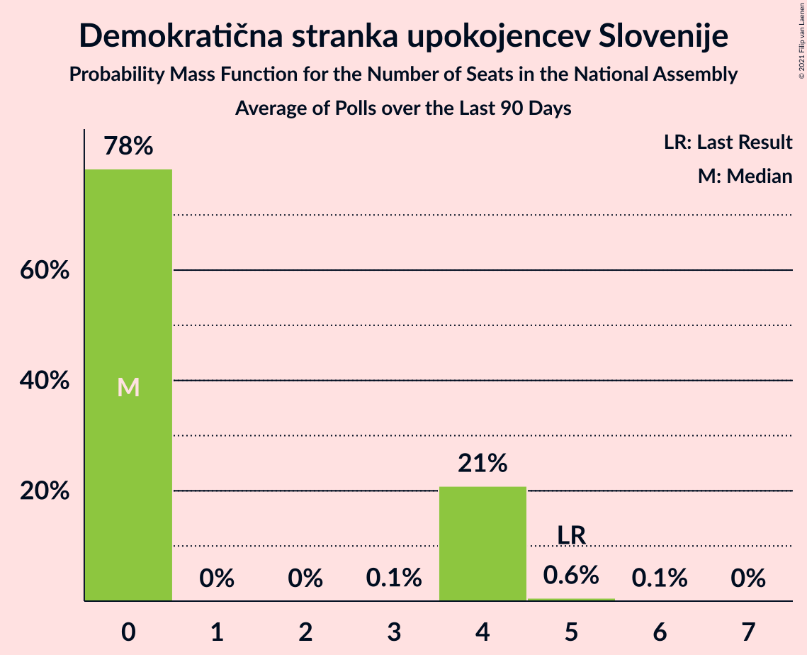

| Number of Seats | Probability | Accumulated | Special Marks |
|:---------------:|:-----------:|:-----------:|:-------------:|
| 0 | 99.2% | 100% | Median |
| 1 | 0% | 0.8% |  |
| 2 | 0% | 0.8% |  |
| 3 | 0.1% | 0.8% |  |
| 4 | 0.6% | 0.6% |  |
| 5 | 0% | 0% | Last Result |

### Slovenska nacionalna stranka

*For a full overview of the results for this party, see the [Slovenska nacionalna stranka](party-slovenskanacionalnastranka.html) page.*

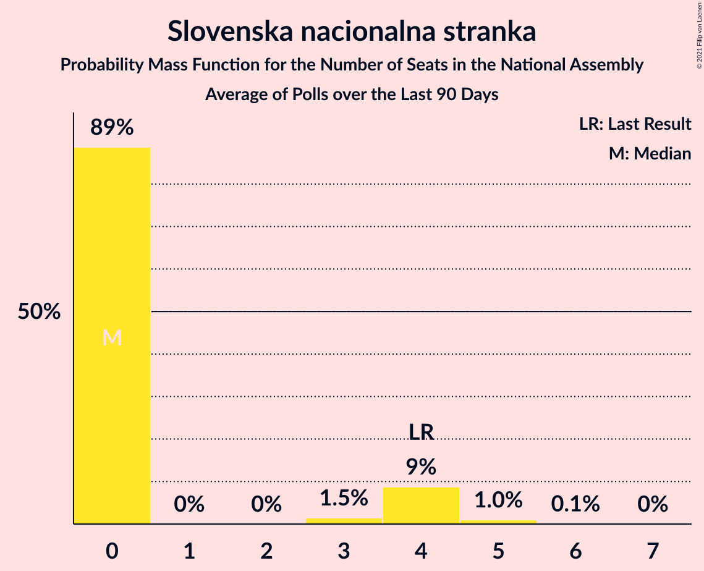

| Number of Seats | Probability | Accumulated | Special Marks |
|:---------------:|:-----------:|:-----------:|:-------------:|
| 0 | 99.1% | 100% | Median |
| 1 | 0% | 0.9% |  |
| 2 | 0% | 0.9% |  |
| 3 | 0% | 0.9% |  |
| 4 | 0.8% | 0.9% | Last Result |
| 5 | 0.1% | 0.1% |  |
| 6 | 0% | 0% |  |

### Slovenska ljudska stranka

*For a full overview of the results for this party, see the [Slovenska ljudska stranka](party-slovenskaljudskastranka.html) page.*

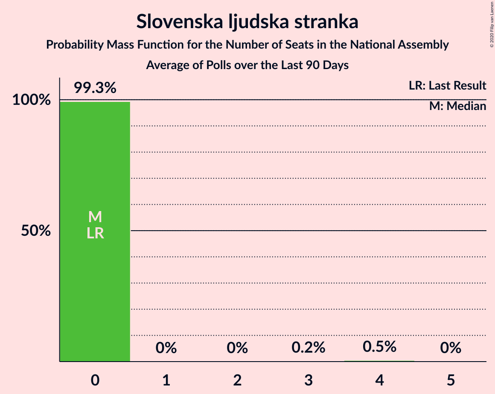

| Number of Seats | Probability | Accumulated | Special Marks |
|:---------------:|:-----------:|:-----------:|:-------------:|
| 0 | 98% | 100% | Last Result, Median |
| 1 | 0% | 2% |  |
| 2 | 0% | 2% |  |
| 3 | 0.3% | 2% |  |
| 4 | 2% | 2% |  |
| 5 | 0.1% | 0.1% |  |
| 6 | 0% | 0% |  |

### Piratska stranka Slovenije

*For a full overview of the results for this party, see the [Piratska stranka Slovenije](party-piratskastrankaslovenije.html) page.*

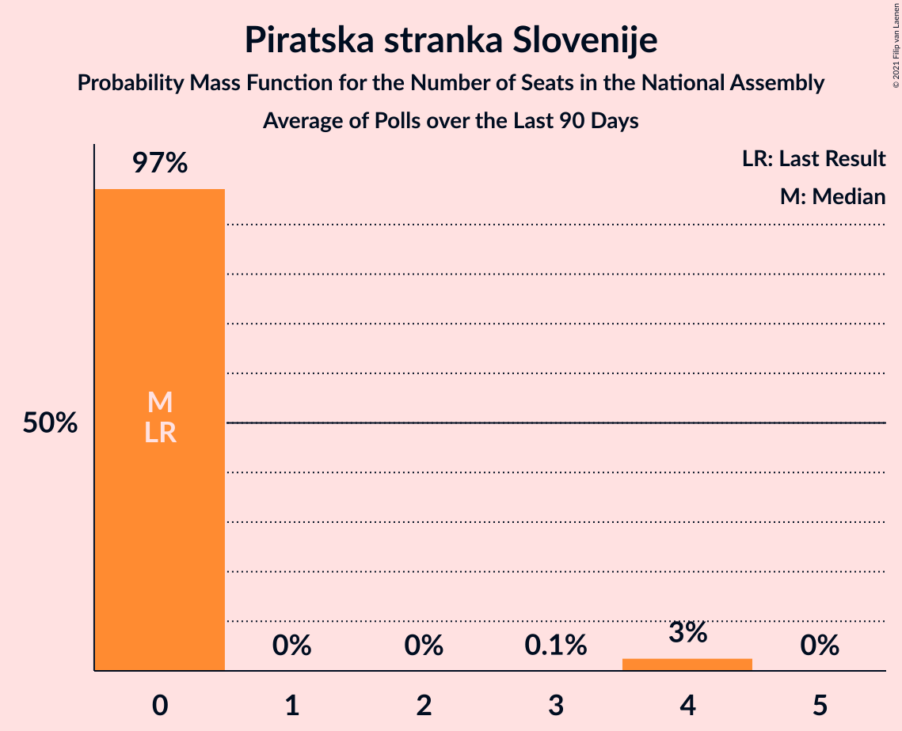

| Number of Seats | Probability | Accumulated | Special Marks |
|:---------------:|:-----------:|:-----------:|:-------------:|
| 0 | 99.1% | 100% | Last Result, Median |
| 1 | 0% | 0.9% |  |
| 2 | 0% | 0.9% |  |
| 3 | 0% | 0.9% |  |
| 4 | 0.8% | 0.9% |  |
| 5 | 0.1% | 0.1% |  |
| 6 | 0% | 0% |  |

### Dobra država

*For a full overview of the results for this party, see the [Dobra država](party-dobradržava.html) page.*

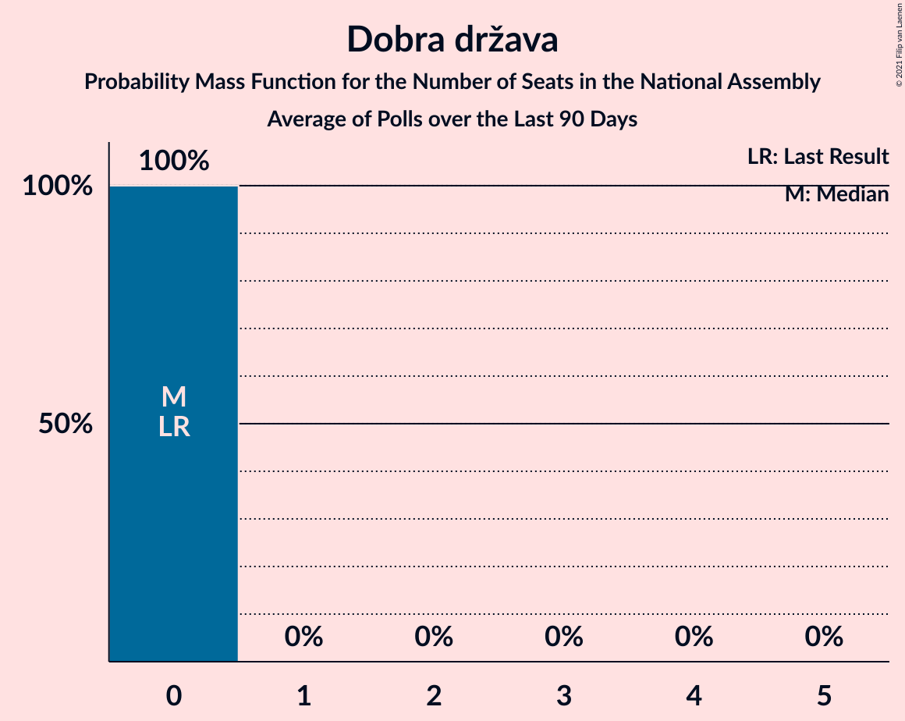

| Number of Seats | Probability | Accumulated | Special Marks |
|:---------------:|:-----------:|:-----------:|:-------------:|
| 0 | 97% | 100% | Last Result, Median |
| 1 | 0% | 3% |  |
| 2 | 0% | 3% |  |
| 3 | 0% | 3% |  |
| 4 | 3% | 3% |  |
| 5 | 0.3% | 0.3% |  |
| 6 | 0% | 0% |  |

### Andrej Čuš in Zeleni Slovenije

*For a full overview of the results for this party, see the [Andrej Čuš in Zeleni Slovenije](party-andrejčušinzelenislovenije.html) page.*

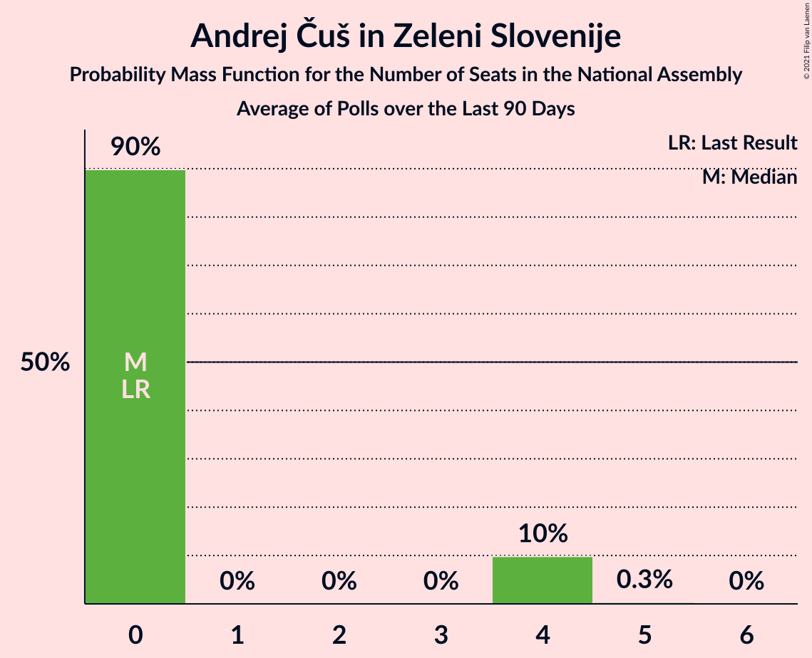

| Number of Seats | Probability | Accumulated | Special Marks |
|:---------------:|:-----------:|:-----------:|:-------------:|
| 0 | 99.2% | 100% | Last Result, Median |
| 1 | 0% | 0.8% |  |
| 2 | 0% | 0.8% |  |
| 3 | 0% | 0.8% |  |
| 4 | 0.6% | 0.8% |  |
| 5 | 0.2% | 0.2% |  |
| 6 | 0% | 0% |  |

### Glas za otroke in družine–Nova ljudska stranka Slovenije

*For a full overview of the results for this party, see the [Glas za otroke in družine–Nova ljudska stranka Slovenije](party-glaszaotrokeindružine–novaljudskastrankaslovenije.html) page.*

### Glas za otroke in družine

*For a full overview of the results for this party, see the [Glas za otroke in družine](party-glaszaotrokeindružine.html) page.*

### Nova ljudska stranka Slovenije

*For a full overview of the results for this party, see the [Nova ljudska stranka Slovenije](party-novaljudskastrankaslovenije.html) page.*

### Državljanska lista

*For a full overview of the results for this party, see the [Državljanska lista](party-državljanskalista.html) page.*

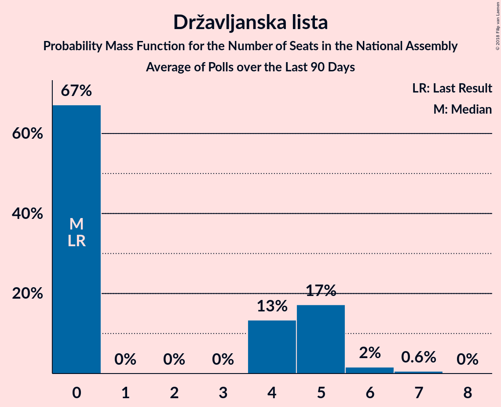

### Pozitivna Slovenija

*For a full overview of the results for this party, see the [Pozitivna Slovenija](party-pozitivnaslovenija.html) page.*

### Hungarian and Italian minorities

*For a full overview of the results for this party, see the [Hungarian and Italian minorities](party-hungariananditalianminorities.html) page.*

## Coalitions

### Confidence Intervals

| Coalition | Last Result | Median | Majority? | 80% Confidence Interval | 90% Confidence Interval | 95% Confidence Interval | 99% Confidence Interval |
|:---------:|:-----------:|:------:|:---------:|:-----------------------:|:-----------------------:|:-----------------------:|:-----------------------:|
| Lista Marjana Šarca – Socialni demokrati – Stranka modernega centra – Nova Slovenija–Krščanski demokrati – Stranka Alenke Bratušek – Demokratična stranka upokojencev Slovenije | 50 | 47 | 61% | 39–50 | 38–51 | 38–51 | 38–53 |
| Lista Marjana Šarca – Socialni demokrati – Nova Slovenija–Krščanski demokrati – Demokratična stranka upokojencev Slovenije | 35 | 41 | 2% | 34–44 | 33–45 | 33–45 | 33–47 |
| Lista Marjana Šarca – Socialni demokrati – Stranka modernega centra – Nova Slovenija–Krščanski demokrati – Demokratična stranka upokojencev Slovenije | 45 | 41 | 2% | 34–44 | 33–45 | 33–45 | 33–47 |
| Lista Marjana Šarca – Socialni demokrati – Nova Slovenija–Krščanski demokrati | 30 | 41 | 2% | 34–44 | 33–45 | 33–45 | 32–47 |
| Lista Marjana Šarca – Socialni demokrati – Stranka modernega centra – Nova Slovenija–Krščanski demokrati | 40 | 41 | 2% | 34–44 | 33–45 | 33–45 | 32–47 |
| Slovenska demokratska stranka – Lista Marjana Šarca – Demokratična stranka upokojencev Slovenije | 43 | 38 | 0% | 35–41 | 34–41 | 33–42 | 31–43 |
| Slovenska demokratska stranka – Lista Marjana Šarca | 38 | 38 | 0% | 35–41 | 34–41 | 33–42 | 31–42 |
| Lista Marjana Šarca – Socialni demokrati – Stranka modernega centra – Stranka Alenke Bratušek – Demokratična stranka upokojencev Slovenije | 43 | 38 | 0% | 33–40 | 33–41 | 32–41 | 32–42 |
| Slovenska demokratska stranka – Nova Slovenija–Krščanski demokrati – Demokratična stranka upokojencev Slovenije – Slovenska ljudska stranka – Državljanska lista | 37 | 36 | 0% | 35–38 | 33–39 | 33–40 | 31–41 |
| Lista Marjana Šarca – Socialni demokrati – Demokratična stranka upokojencev Slovenije | 28 | 32 | 0% | 28–34 | 28–34 | 27–35 | 27–36 |
| Lista Marjana Šarca – Socialni demokrati – Stranka modernega centra – Demokratična stranka upokojencev Slovenije | 38 | 32 | 0% | 28–34 | 28–34 | 27–35 | 27–36 |
| Lista Marjana Šarca – Socialni demokrati | 23 | 32 | 0% | 28–34 | 27–34 | 27–35 | 27–36 |
| Lista Marjana Šarca – Socialni demokrati – Stranka modernega centra | 33 | 32 | 0% | 28–34 | 27–34 | 27–35 | 27–36 |
| Socialni demokrati – Demokratična stranka upokojencev Slovenije – Državljanska lista – Pozitivna Slovenija | 15 | 21 | 0% | 19–23 | 18–23 | 18–24 | 18–25 |
| Socialni demokrati – Stranka modernega centra – Demokratična stranka upokojencev Slovenije | 25 | 21 | 0% | 19–23 | 18–23 | 18–24 | 18–25 |
| Socialni demokrati – Stranka modernega centra – Pozitivna Slovenija | 20 | 21 | 0% | 19–23 | 18–23 | 18–24 | 18–25 |

### Lista Marjana Šarca – Socialni demokrati – Stranka modernega centra – Nova Slovenija–Krščanski demokrati – Stranka Alenke Bratušek – Demokratična stranka upokojencev Slovenije

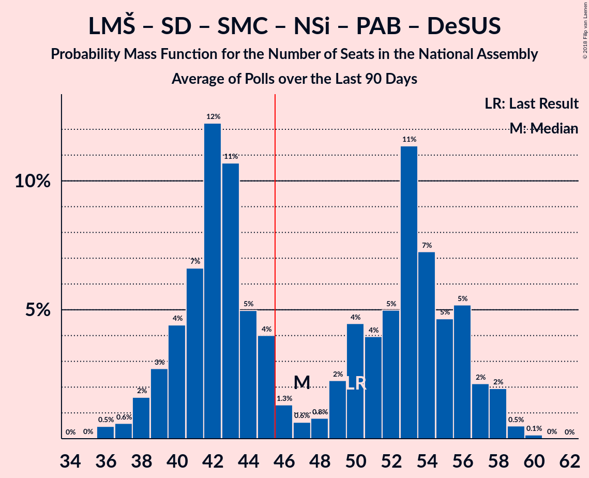

| Number of Seats | Probability | Accumulated | Special Marks |
|:---------------:|:-----------:|:-----------:|:-------------:|
| 37 | 0.2% | 100% |  |
| 38 | 6% | 99.8% |  |
| 39 | 21% | 93% |  |
| 40 | 5% | 72% |  |
| 41 | 1.1% | 68% |  |
| 42 | 0.6% | 66% |  |
| 43 | 2% | 66% |  |
| 44 | 1.0% | 64% |  |
| 45 | 1.5% | 63% | Median |
| 46 | 5% | 61% | Majority |
| 47 | 27% | 56% |  |
| 48 | 10% | 29% |  |
| 49 | 7% | 19% |  |
| 50 | 7% | 13% | Last Result |
| 51 | 4% | 5% |  |
| 52 | 0.7% | 2% |  |
| 53 | 0.7% | 1.0% |  |
| 54 | 0.3% | 0.3% |  |
| 55 | 0% | 0% |  |

### Lista Marjana Šarca – Socialni demokrati – Nova Slovenija–Krščanski demokrati – Demokratična stranka upokojencev Slovenije

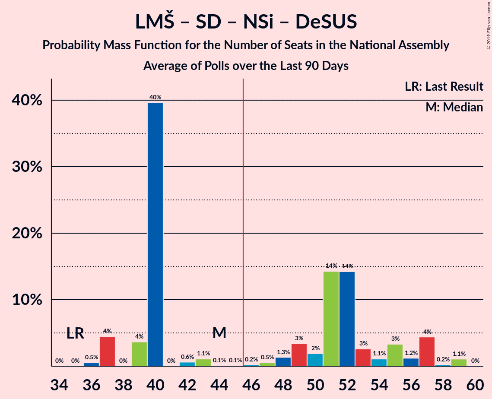

| Number of Seats | Probability | Accumulated | Special Marks |
|:---------------:|:-----------:|:-----------:|:-------------:|
| 32 | 0.1% | 100% |  |
| 33 | 7% | 99.9% |  |
| 34 | 21% | 93% |  |
| 35 | 5% | 72% | Last Result |
| 36 | 1.3% | 67% |  |
| 37 | 2% | 66% |  |
| 38 | 0.7% | 64% |  |
| 39 | 2% | 63% | Median |
| 40 | 6% | 61% |  |
| 41 | 31% | 55% |  |
| 42 | 6% | 24% |  |
| 43 | 6% | 18% |  |
| 44 | 5% | 12% |  |
| 45 | 5% | 6% |  |
| 46 | 1.1% | 2% | Majority |
| 47 | 0.4% | 0.6% |  |
| 48 | 0.2% | 0.2% |  |
| 49 | 0% | 0% |  |

### Lista Marjana Šarca – Socialni demokrati – Stranka modernega centra – Nova Slovenija–Krščanski demokrati – Demokratična stranka upokojencev Slovenije

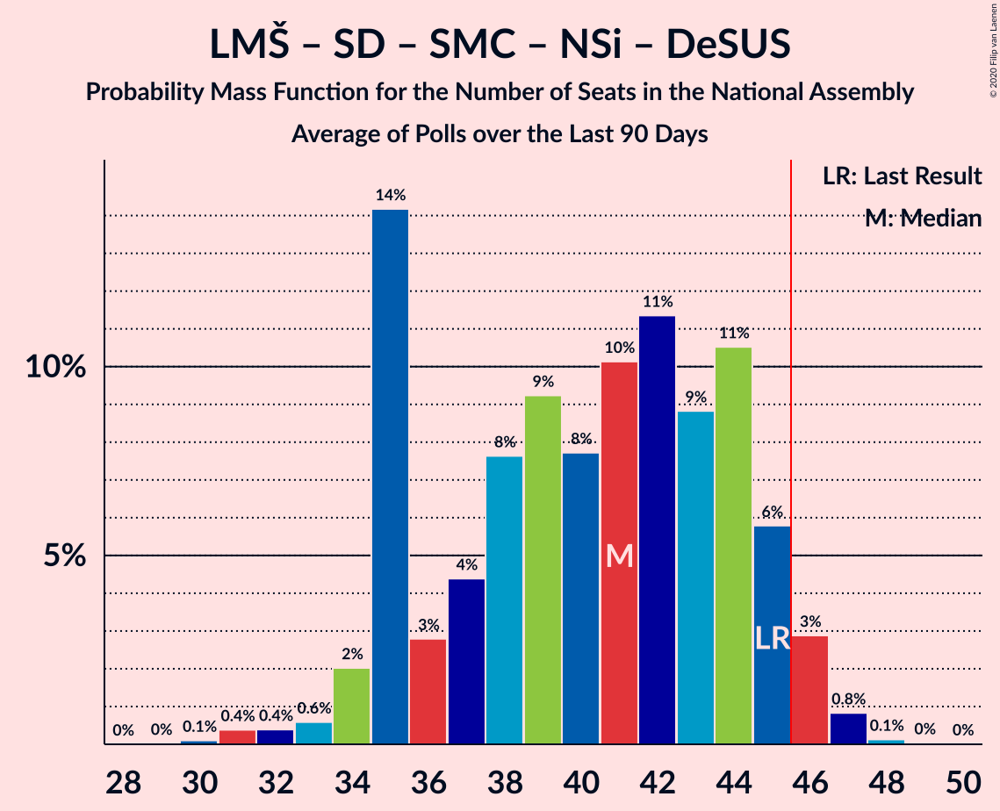

| Number of Seats | Probability | Accumulated | Special Marks |
|:---------------:|:-----------:|:-----------:|:-------------:|
| 32 | 0.1% | 100% |  |
| 33 | 7% | 99.9% |  |
| 34 | 21% | 93% |  |
| 35 | 5% | 72% |  |
| 36 | 1.3% | 67% |  |
| 37 | 2% | 66% |  |
| 38 | 0.7% | 64% |  |
| 39 | 2% | 63% | Median |
| 40 | 6% | 61% |  |
| 41 | 31% | 55% |  |
| 42 | 6% | 24% |  |
| 43 | 6% | 18% |  |
| 44 | 5% | 12% |  |
| 45 | 5% | 6% | Last Result |
| 46 | 1.1% | 2% | Majority |
| 47 | 0.4% | 0.6% |  |
| 48 | 0.2% | 0.2% |  |
| 49 | 0% | 0% |  |

### Lista Marjana Šarca – Socialni demokrati – Nova Slovenija–Krščanski demokrati

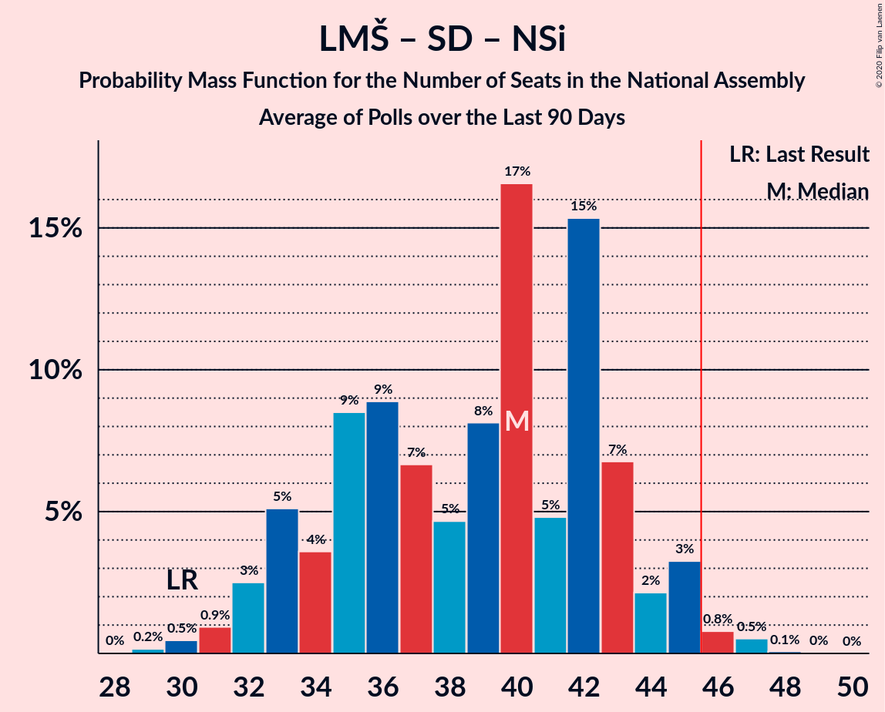

| Number of Seats | Probability | Accumulated | Special Marks |
|:---------------:|:-----------:|:-----------:|:-------------:|
| 30 | 0% | 100% | Last Result |
| 31 | 0.1% | 100% |  |
| 32 | 0.6% | 99.9% |  |
| 33 | 7% | 99.3% |  |
| 34 | 21% | 92% |  |
| 35 | 4% | 71% |  |
| 36 | 0.9% | 67% |  |
| 37 | 2% | 66% |  |
| 38 | 0.6% | 64% |  |
| 39 | 2% | 63% | Median |
| 40 | 6% | 61% |  |
| 41 | 31% | 55% |  |
| 42 | 6% | 24% |  |
| 43 | 6% | 18% |  |
| 44 | 5% | 12% |  |
| 45 | 5% | 6% |  |
| 46 | 1.1% | 2% | Majority |
| 47 | 0.4% | 0.6% |  |
| 48 | 0.2% | 0.2% |  |
| 49 | 0% | 0% |  |

### Lista Marjana Šarca – Socialni demokrati – Stranka modernega centra – Nova Slovenija–Krščanski demokrati

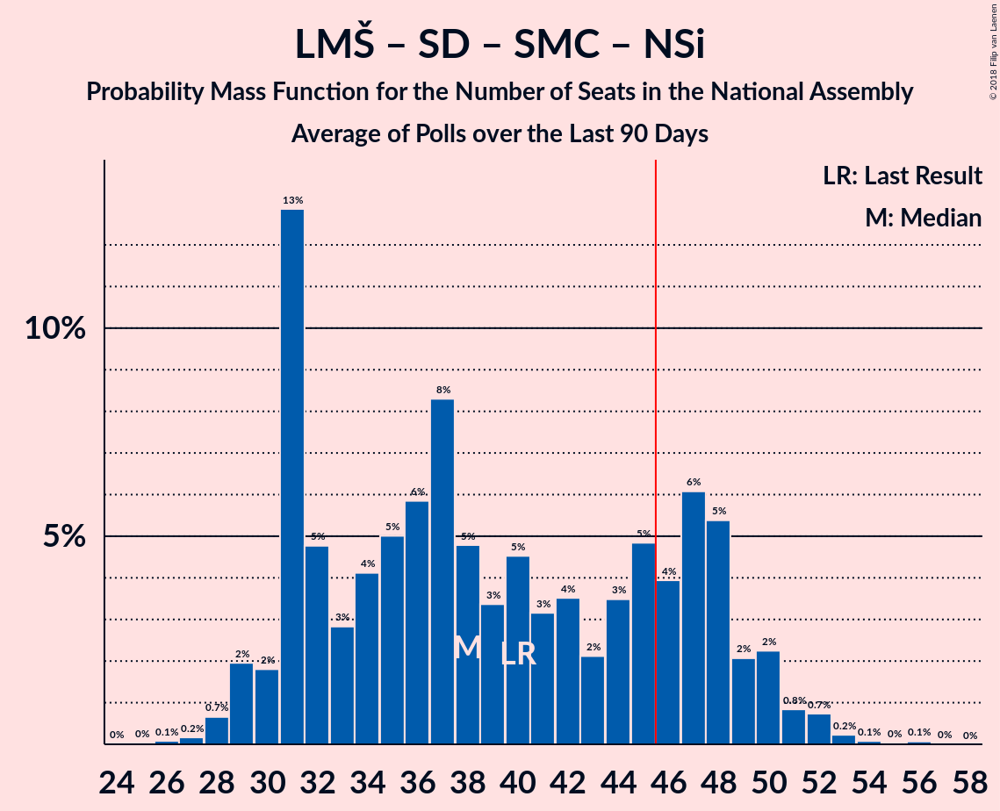

| Number of Seats | Probability | Accumulated | Special Marks |
|:---------------:|:-----------:|:-----------:|:-------------:|
| 31 | 0.1% | 100% |  |
| 32 | 0.6% | 99.9% |  |
| 33 | 7% | 99.3% |  |
| 34 | 21% | 92% |  |
| 35 | 4% | 71% |  |
| 36 | 0.9% | 67% |  |
| 37 | 2% | 66% |  |
| 38 | 0.6% | 64% |  |
| 39 | 2% | 63% | Median |
| 40 | 6% | 61% | Last Result |
| 41 | 31% | 55% |  |
| 42 | 6% | 24% |  |
| 43 | 6% | 18% |  |
| 44 | 5% | 12% |  |
| 45 | 5% | 6% |  |
| 46 | 1.1% | 2% | Majority |
| 47 | 0.4% | 0.6% |  |
| 48 | 0.2% | 0.2% |  |
| 49 | 0% | 0% |  |

### Slovenska demokratska stranka – Lista Marjana Šarca – Demokratična stranka upokojencev Slovenije

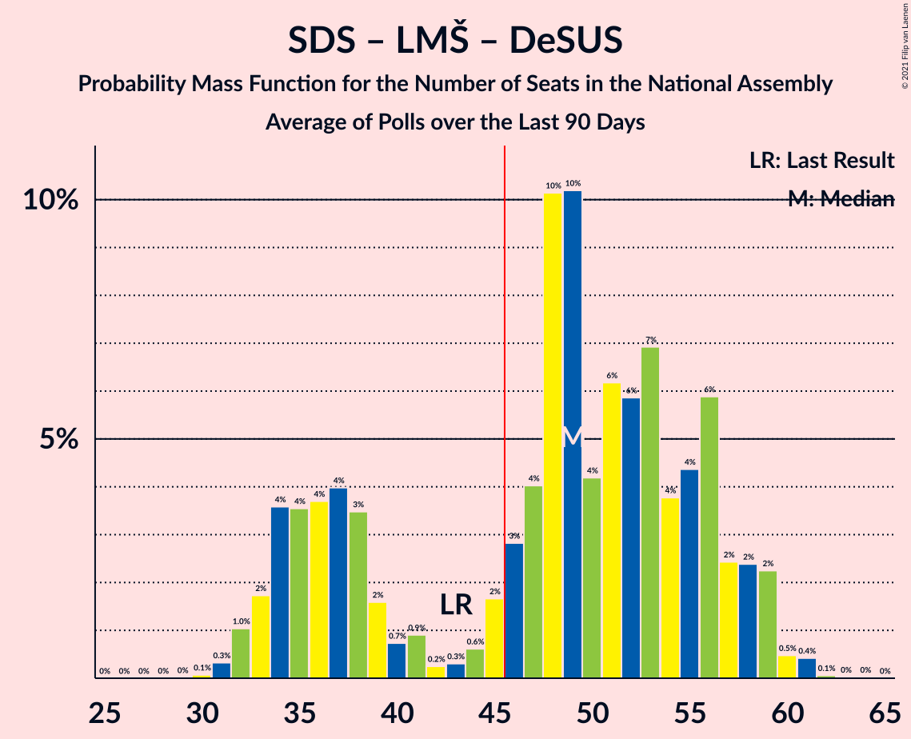

| Number of Seats | Probability | Accumulated | Special Marks |
|:---------------:|:-----------:|:-----------:|:-------------:|
| 29 | 0.1% | 100% |  |
| 30 | 0.1% | 99.9% |  |
| 31 | 0.4% | 99.8% |  |
| 32 | 0.7% | 99.5% |  |
| 33 | 3% | 98.8% |  |
| 34 | 3% | 96% |  |
| 35 | 26% | 93% |  |
| 36 | 8% | 67% | Median |
| 37 | 7% | 60% |  |
| 38 | 11% | 52% |  |
| 39 | 4% | 41% |  |
| 40 | 9% | 37% |  |
| 41 | 23% | 28% |  |
| 42 | 4% | 5% |  |
| 43 | 0.9% | 1.0% | Last Result |
| 44 | 0.1% | 0.1% |  |
| 45 | 0% | 0% |  |

### Slovenska demokratska stranka – Lista Marjana Šarca

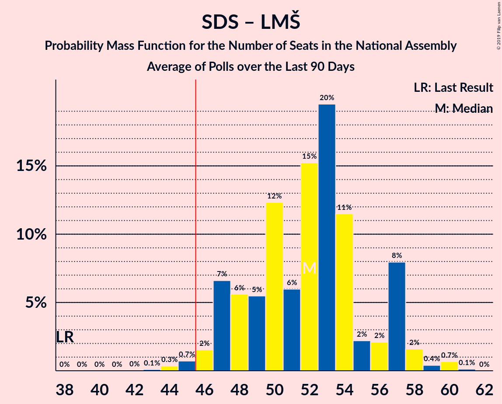

| Number of Seats | Probability | Accumulated | Special Marks |
|:---------------:|:-----------:|:-----------:|:-------------:|
| 29 | 0.1% | 100% |  |
| 30 | 0.1% | 99.9% |  |
| 31 | 0.4% | 99.8% |  |
| 32 | 0.7% | 99.5% |  |
| 33 | 3% | 98.8% |  |
| 34 | 3% | 96% |  |
| 35 | 26% | 93% |  |
| 36 | 8% | 67% | Median |
| 37 | 7% | 60% |  |
| 38 | 11% | 52% | Last Result |
| 39 | 4% | 41% |  |
| 40 | 9% | 37% |  |
| 41 | 23% | 28% |  |
| 42 | 4% | 4% |  |
| 43 | 0.3% | 0.3% |  |
| 44 | 0% | 0% |  |

### Lista Marjana Šarca – Socialni demokrati – Stranka modernega centra – Stranka Alenke Bratušek – Demokratična stranka upokojencev Slovenije

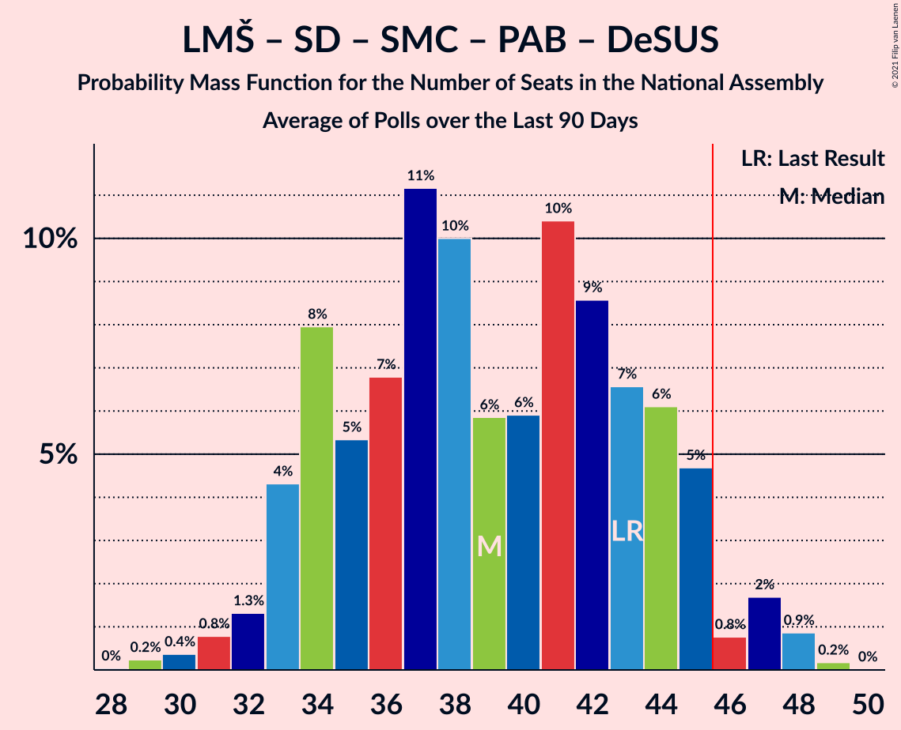

| Number of Seats | Probability | Accumulated | Special Marks |
|:---------------:|:-----------:|:-----------:|:-------------:|
| 30 | 0% | 100% |  |
| 31 | 0.2% | 99.9% |  |
| 32 | 4% | 99.7% |  |
| 33 | 24% | 96% |  |
| 34 | 6% | 72% |  |
| 35 | 4% | 66% |  |
| 36 | 2% | 62% | Median |
| 37 | 7% | 60% |  |
| 38 | 29% | 53% |  |
| 39 | 12% | 24% |  |
| 40 | 7% | 12% |  |
| 41 | 3% | 5% |  |
| 42 | 1.1% | 2% |  |
| 43 | 0.3% | 0.5% | Last Result |
| 44 | 0.1% | 0.2% |  |
| 45 | 0% | 0.1% |  |
| 46 | 0% | 0% | Majority |

### Slovenska demokratska stranka – Nova Slovenija–Krščanski demokrati – Demokratična stranka upokojencev Slovenije – Slovenska ljudska stranka – Državljanska lista

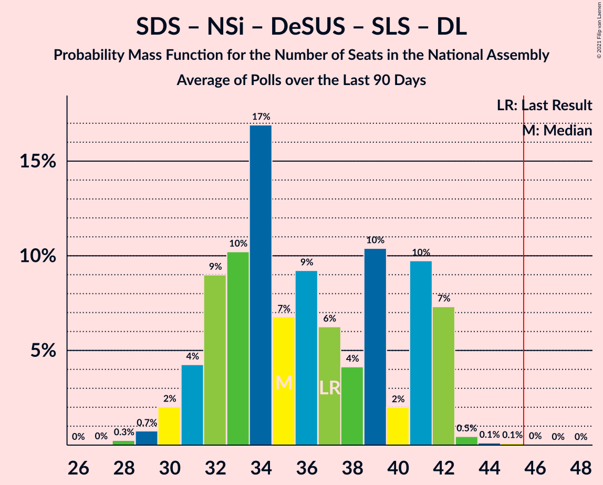

| Number of Seats | Probability | Accumulated | Special Marks |
|:---------------:|:-----------:|:-----------:|:-------------:|
| 30 | 0.3% | 100% |  |
| 31 | 0.9% | 99.7% |  |
| 32 | 0.8% | 98.8% |  |
| 33 | 5% | 98% |  |
| 34 | 3% | 93% |  |
| 35 | 29% | 91% |  |
| 36 | 13% | 61% | Median |
| 37 | 15% | 48% | Last Result |
| 38 | 25% | 33% |  |
| 39 | 5% | 8% |  |
| 40 | 2% | 3% |  |
| 41 | 0.7% | 1.0% |  |
| 42 | 0.2% | 0.3% |  |
| 43 | 0.1% | 0.1% |  |
| 44 | 0% | 0% |  |

### Lista Marjana Šarca – Socialni demokrati – Demokratična stranka upokojencev Slovenije

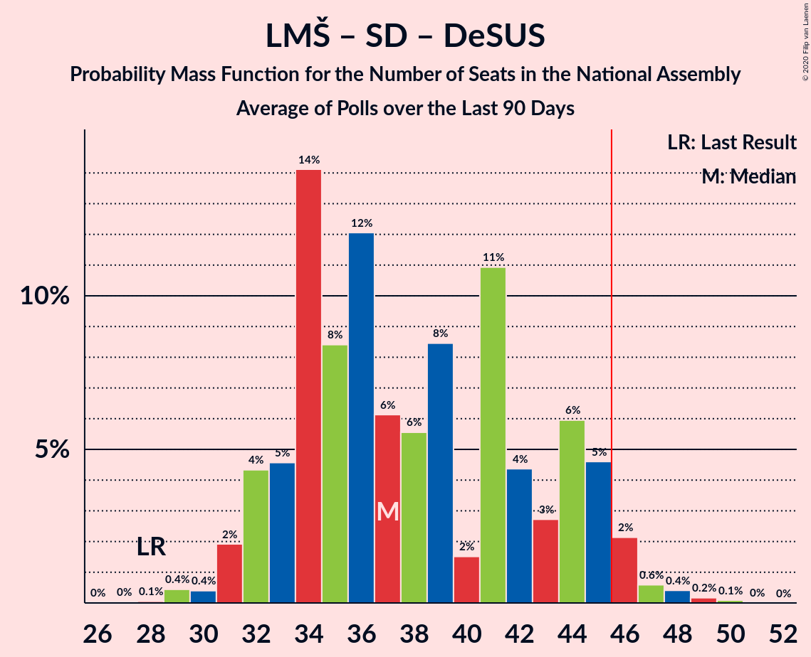

| Number of Seats | Probability | Accumulated | Special Marks |
|:---------------:|:-----------:|:-----------:|:-------------:|
| 25 | 0.1% | 100% |  |
| 26 | 0.2% | 99.9% |  |
| 27 | 4% | 99.7% |  |
| 28 | 25% | 96% | Last Result |
| 29 | 8% | 71% |  |
| 30 | 4% | 63% | Median |
| 31 | 8% | 59% |  |
| 32 | 31% | 51% |  |
| 33 | 8% | 20% |  |
| 34 | 8% | 12% |  |
| 35 | 3% | 5% |  |
| 36 | 0.8% | 1.0% |  |
| 37 | 0.2% | 0.3% |  |
| 38 | 0% | 0.1% |  |
| 39 | 0% | 0% |  |

### Lista Marjana Šarca – Socialni demokrati – Stranka modernega centra – Demokratična stranka upokojencev Slovenije

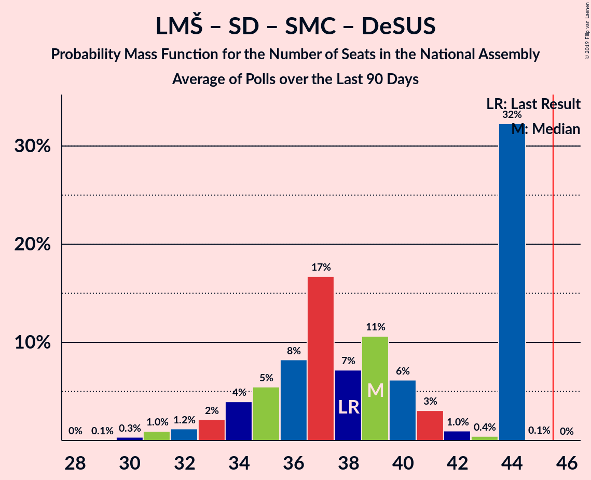

| Number of Seats | Probability | Accumulated | Special Marks |
|:---------------:|:-----------:|:-----------:|:-------------:|
| 25 | 0.1% | 100% |  |
| 26 | 0.2% | 99.9% |  |
| 27 | 4% | 99.7% |  |
| 28 | 25% | 96% |  |
| 29 | 8% | 71% |  |
| 30 | 4% | 63% | Median |
| 31 | 8% | 59% |  |
| 32 | 31% | 51% |  |
| 33 | 8% | 20% |  |
| 34 | 8% | 12% |  |
| 35 | 3% | 5% |  |
| 36 | 0.8% | 1.0% |  |
| 37 | 0.2% | 0.3% |  |
| 38 | 0% | 0.1% | Last Result |
| 39 | 0% | 0% |  |

### Lista Marjana Šarca – Socialni demokrati

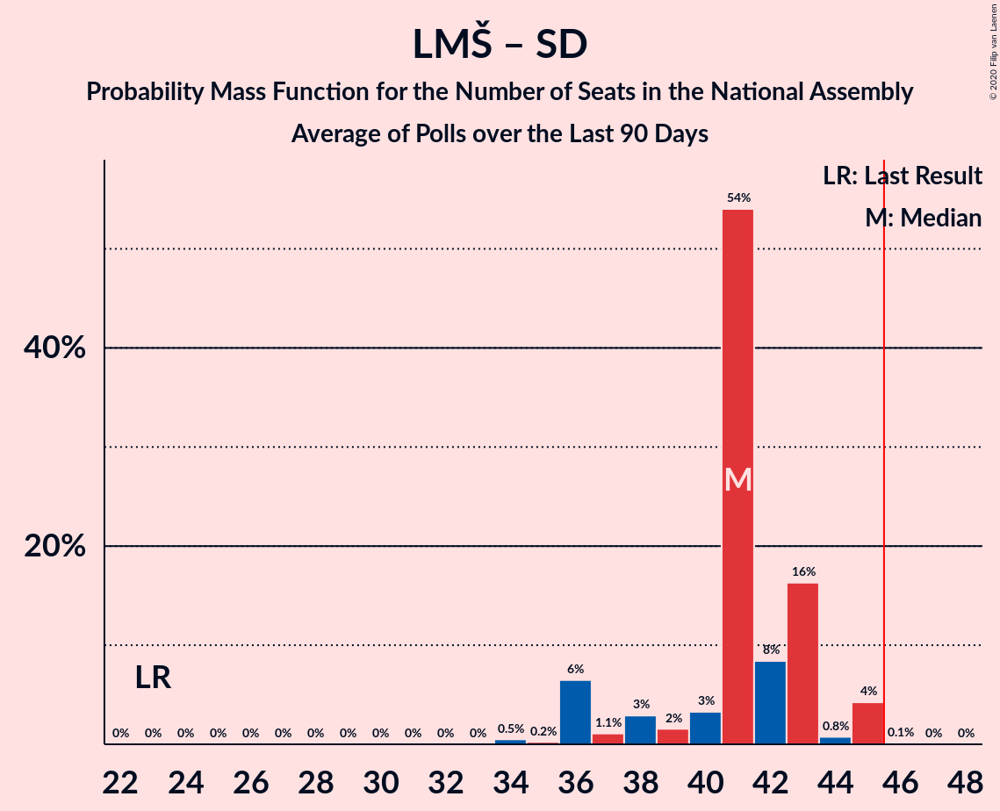

| Number of Seats | Probability | Accumulated | Special Marks |
|:---------------:|:-----------:|:-----------:|:-------------:|
| 23 | 0% | 100% | Last Result |
| 24 | 0% | 100% |  |
| 25 | 0.1% | 100% |  |
| 26 | 0.3% | 99.9% |  |
| 27 | 5% | 99.6% |  |
| 28 | 25% | 95% |  |
| 29 | 8% | 70% |  |
| 30 | 3% | 62% | Median |
| 31 | 8% | 59% |  |
| 32 | 31% | 51% |  |
| 33 | 8% | 20% |  |
| 34 | 8% | 12% |  |
| 35 | 3% | 5% |  |
| 36 | 0.8% | 1.0% |  |
| 37 | 0.2% | 0.3% |  |
| 38 | 0% | 0.1% |  |
| 39 | 0% | 0% |  |

### Lista Marjana Šarca – Socialni demokrati – Stranka modernega centra

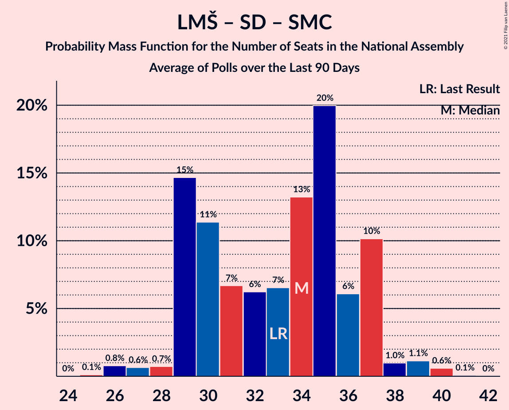

| Number of Seats | Probability | Accumulated | Special Marks |
|:---------------:|:-----------:|:-----------:|:-------------:|
| 25 | 0.1% | 100% |  |
| 26 | 0.3% | 99.9% |  |
| 27 | 5% | 99.6% |  |
| 28 | 25% | 95% |  |
| 29 | 8% | 70% |  |
| 30 | 3% | 62% | Median |
| 31 | 8% | 59% |  |
| 32 | 31% | 51% |  |
| 33 | 8% | 20% | Last Result |
| 34 | 8% | 12% |  |
| 35 | 3% | 5% |  |
| 36 | 0.8% | 1.0% |  |
| 37 | 0.2% | 0.3% |  |
| 38 | 0% | 0.1% |  |
| 39 | 0% | 0% |  |

### Socialni demokrati – Demokratična stranka upokojencev Slovenije – Državljanska lista – Pozitivna Slovenija

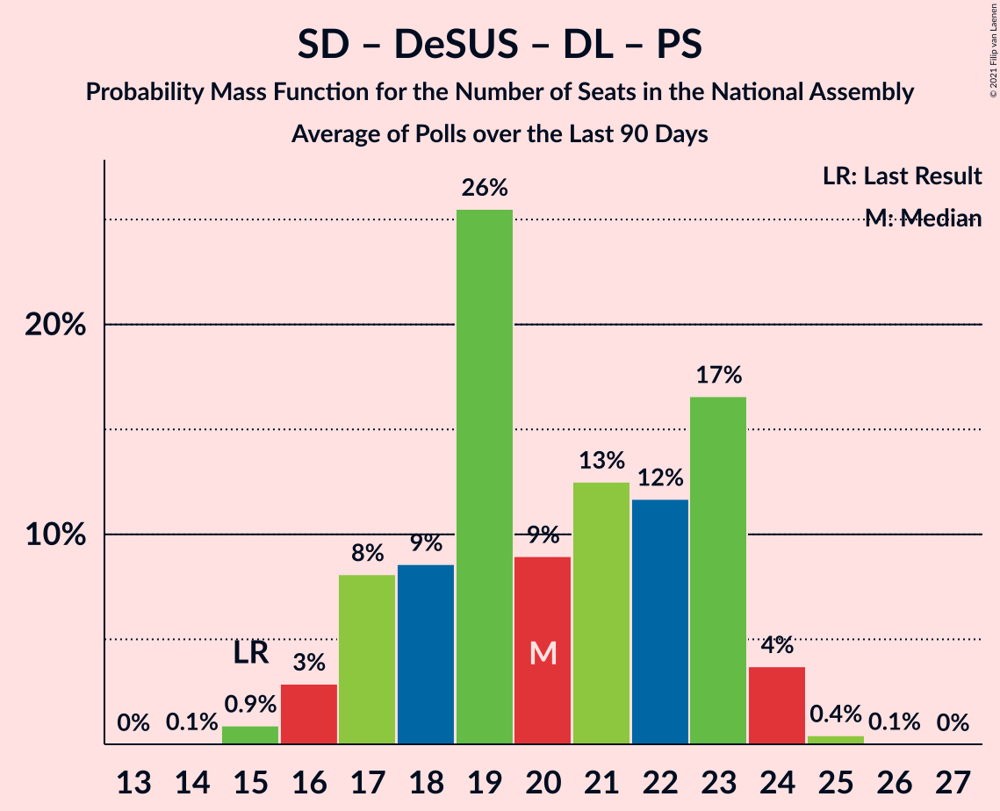

| Number of Seats | Probability | Accumulated | Special Marks |
|:---------------:|:-----------:|:-----------:|:-------------:|
| 15 | 0% | 100% | Last Result |
| 16 | 0.1% | 100% |  |
| 17 | 0.3% | 99.9% |  |
| 18 | 6% | 99.7% |  |
| 19 | 24% | 94% |  |
| 20 | 12% | 69% |  |
| 21 | 14% | 58% | Median |
| 22 | 11% | 44% |  |
| 23 | 29% | 33% |  |
| 24 | 3% | 4% |  |
| 25 | 0.4% | 0.5% |  |
| 26 | 0.1% | 0.1% |  |
| 27 | 0% | 0% |  |

### Socialni demokrati – Stranka modernega centra – Demokratična stranka upokojencev Slovenije

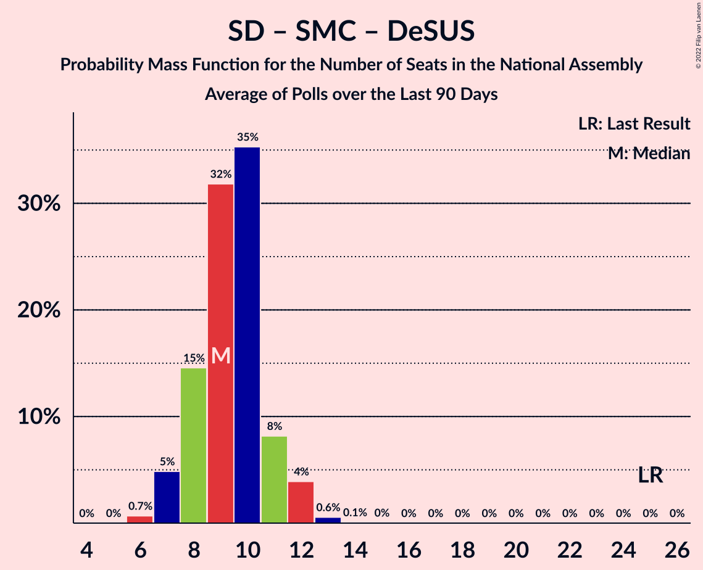

| Number of Seats | Probability | Accumulated | Special Marks |
|:---------------:|:-----------:|:-----------:|:-------------:|
| 16 | 0.1% | 100% |  |
| 17 | 0.3% | 99.9% |  |
| 18 | 6% | 99.7% |  |
| 19 | 24% | 94% |  |
| 20 | 12% | 69% |  |
| 21 | 14% | 58% | Median |
| 22 | 11% | 44% |  |
| 23 | 29% | 33% |  |
| 24 | 3% | 4% |  |
| 25 | 0.4% | 0.5% | Last Result |
| 26 | 0.1% | 0.1% |  |
| 27 | 0% | 0% |  |

### Socialni demokrati – Stranka modernega centra – Pozitivna Slovenija

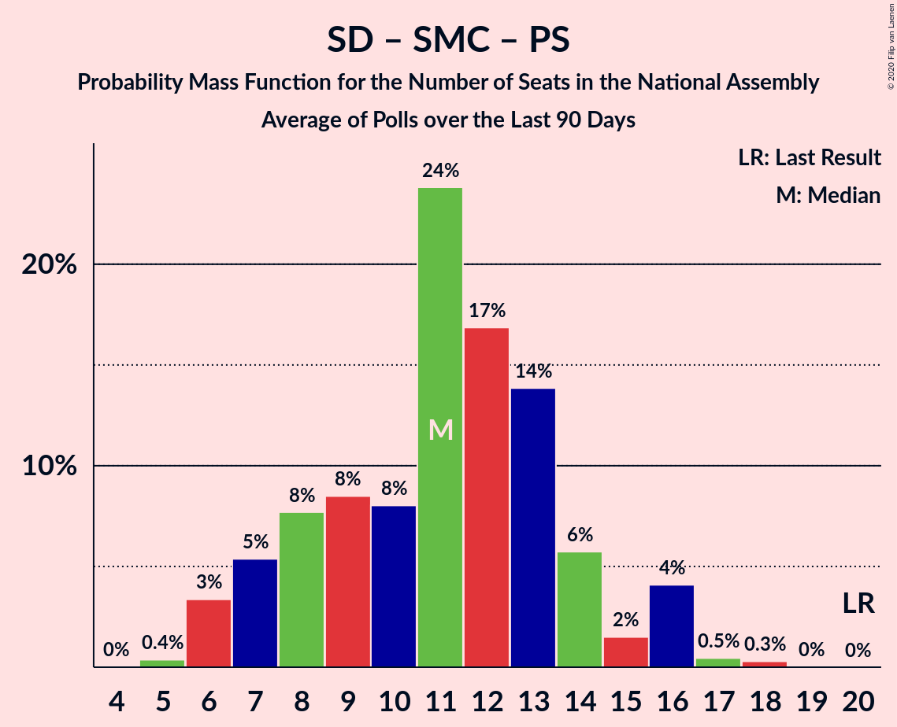

| Number of Seats | Probability | Accumulated | Special Marks |
|:---------------:|:-----------:|:-----------:|:-------------:|
| 16 | 0.1% | 100% |  |
| 17 | 0.3% | 99.9% |  |
| 18 | 6% | 99.7% |  |
| 19 | 25% | 93% |  |
| 20 | 12% | 69% | Last Result |
| 21 | 14% | 57% | Median |
| 22 | 10% | 43% |  |
| 23 | 29% | 33% |  |
| 24 | 3% | 4% |  |
| 25 | 0.4% | 0.5% |  |
| 26 | 0.1% | 0.1% |  |
| 27 | 0% | 0% |  |

## Technical Information

+ **Number of polls included in this average:** 3
+ **Lowest number of simulations done in a poll included in this average:** 1,048,576
+ **Total number of simulations done in the polls included in this average:** 3,145,728
+ **Error estimate:** 1.81%
