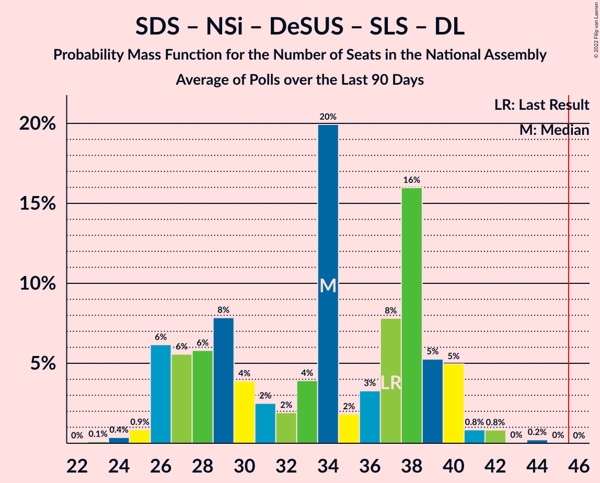

# Poll Average

<a href="#voting-intentions">Voting Intentions</a> | <a href="#seats">Seats</a> | <a href="#coalitions">Coalitions</a> | <a href="#technical-information">Technical Information</a>

## Summary

The table below lists the polls on which the average is based. They are the most recent polls (less than 90 days old) registered and analyzed so far.

| Period     | Polling firm/Commissioner(s) | SDS | LMŠ | SD | SMC | Levica | NSi | PAB | DeSUS | SNS | SLS | GOD–NLS | GOD | NLS | DL | PS | HIM |
|:----------:|:----------------------------:|:--:|:--:|:--:|:--:|:--:|:--:|:--:|:--:|:--:|:--:|:--:|:--:|:--:|:--:|:--:|:--:|
| 3 June 2018 | General Election | 24.9%   25 | 12.6%   13 | 9.9%   10 | 9.7%   10 | 9.3%   9 | 7.2%   7 | 5.1%   5 | 4.9%   5 | 4.2%   4 | 2.6%   0 | 0.2%   0 | 0.2%   0 | 0.2%   0 | 0.0%   0 | 0.0%   0 | 0.0%   2 |
| N/A | Poll Average | 25–35%   23–35 | 12–20%   11–20 | 14–20%   14–20 | 0–3%   0 | 8–14%   7–13 | 5–10%   5–10 | 3–6%   0–6 | 1–9%   0–8 | 2–7%   0–6 | 1–4%   0–4 | N/A   N/A | N/A   N/A | N/A   N/A | N/A   N/A | N/A   N/A | N/A   N/A |
| [2–4 November 2020](2020-11-04-Parsifal.html) | Parsifal   Nova 24TV | 29–36%   28–35 | 13–18%   12–18 | 14–20%   14–19 | 0–2%   0 | 7–11%   6–11 | 5–8%   4–8 | 2–5%   0–4 | 5–9%   5–9 | 2–5%   0–4 | 1–3%   0 | N/A   N/A | N/A   N/A | N/A   N/A | N/A   N/A | N/A   N/A | N/A   N/A |
| [1–25 October 2020](2020-10-25-Mediana.html) | Mediana   POP TV | 24–30%   23–29 | 11–16%   10–16 | 14–20%   14–19 | 1–3%   0 | 10–14%   9–13 | 6–10%   5–9 | 3–7%   0–6 | 2–4%   0–3 | 4–7%   0–7 | 1–3%   0 | N/A   N/A | N/A   N/A | N/A   N/A | N/A   N/A | N/A   N/A | N/A   N/A |
| [13–15 October 2020](2020-10-15-Ninamedia.html) | Ninamedia   Dnevnik, Večer | 26–33%   26–33 | 16–21%   15–21 | 15–21%   15–20 | 1–2%   0 | 9–14%   9–13 | 7–11%   6–10 | 3–6%   0–6 | 1–3%   0 | 2–4%   0–4 | 2–5%   0–4 | N/A   N/A | N/A   N/A | N/A   N/A | N/A   N/A | N/A   N/A | N/A   N/A |
| 3 June 2018 | General Election | 24.9%   25 | 12.6%   13 | 9.9%   10 | 9.7%   10 | 9.3%   9 | 7.2%   7 | 5.1%   5 | 4.9%   5 | 4.2%   4 | 2.6%   0 | 0.2%   0 | 0.2%   0 | 0.2%   0 | 0.0%   0 | 0.0%   0 | 0.0%   2 |

Only polls for which at least the sample size has been published are included in the table above.

**Legend:**
+ **Top half of each row:** Voting intentions (95% confidence interval)
+ **Bottom half of each row:** Seat projections for the National Assembly (95% confidence interval)
+ **SDS:** Slovenska demokratska stranka
+ **LMŠ:** Lista Marjana Šarca
+ **SD:** Socialni demokrati
+ **SMC:** Stranka modernega centra
+ **Levica:** Levica
+ **NSi:** Nova Slovenija–Krščanski demokrati
+ **PAB:** Stranka Alenke Bratušek
+ **DeSUS:** Demokratična stranka upokojencev Slovenije
+ **SNS:** Slovenska nacionalna stranka
+ **SLS:** Slovenska ljudska stranka
+ **GOD–NLS:** Glas za otroke in družine–Nova ljudska stranka Slovenije
+ **GOD:** Glas za otroke in družine
+ **NLS:** Nova ljudska stranka Slovenije
+ **DL:** Državljanska lista
+ **PS:** Pozitivna Slovenija
+ **HIM:** Hungarian and Italian minorities
+ **N/A (single party):** Party not included the published results
+ **N/A (entire row):** Calculation for this opinion poll not started yet

## Voting Intentions

### Confidence Intervals

| Party | Last Result | Median | 80% Confidence Interval | 90% Confidence Interval | 95% Confidence Interval | 99% Confidence Interval |
|:-----:|:-----------:|:------:|:-----------------------:|:-----------------------:|:-----------------------:|:-----------------------:|
| <a href="#slovenska-demokratska-stranka">Slovenska demokratska stranka</a> | 24.9% | 29.4% | 26.0–33.4% |25.2–34.3% | 24.6–35.0% | 23.4–36.3% |
| <a href="#lista-marjana-šarca">Lista Marjana Šarca</a> | 12.6% | 15.6% | 13.0–19.1% |12.4–19.9% | 12.0–20.5% | 11.1–21.7% |
| <a href="#socialni-demokrati">Socialni demokrati</a> | 9.9% | 17.3% | 15.4–19.3% |14.9–19.8% | 14.5–20.4% | 13.7–21.4% |
| <a href="#stranka-modernega-centra">Stranka modernega centra</a> | 9.7% | 1.3% | 0.7–2.1% |0.6–2.4% | 0.5–2.6% | 0.4–3.1% |
| <a href="#levica">Levica</a> | 9.3% | 10.8% | 8.5–12.9% |7.9–13.4% | 7.6–13.8% | 6.9–14.7% |
| <a href="#nova-slovenija–krščanski-demokrati">Nova Slovenija–Krščanski demokrati</a> | 7.2% | 7.6% | 5.9–9.4% |5.5–9.9% | 5.2–10.3% | 4.7–11.2% |
| <a href="#stranka-alenke-bratušek">Stranka Alenke Bratušek</a> | 5.1% | 4.4% | 3.2–5.6% |2.9–6.0% | 2.7–6.3% | 2.3–7.0% |
| <a href="#demokratična-stranka-upokojencev-slovenije">Demokratična stranka upokojencev Slovenije</a> | 4.9% | 2.8% | 1.5–7.7% |1.3–8.2% | 1.2–8.7% | 0.9–9.5% |
| <a href="#slovenska-nacionalna-stranka">Slovenska nacionalna stranka</a> | 4.2% | 3.5% | 2.4–5.9% |2.2–6.3% | 2.0–6.7% | 1.7–7.4% |
| <a href="#slovenska-ljudska-stranka">Slovenska ljudska stranka</a> | 2.6% | 2.1% | 1.3–3.6% |1.1–4.0% | 1.0–4.3% | 0.8–4.9% |
| <a href="#glas-za-otroke-in-družine–nova-ljudska-stranka-slovenije">Glas za otroke in družine–Nova ljudska stranka Slovenije</a> | 0.2% | N/A | N/A |N/A | N/A | N/A |
| <a href="#glas-za-otroke-in-družine">Glas za otroke in družine</a> | 0.2% | N/A | N/A |N/A | N/A | N/A |
| <a href="#nova-ljudska-stranka-slovenije">Nova ljudska stranka Slovenije</a> | 0.2% | N/A | N/A |N/A | N/A | N/A |
| <a href="#državljanska-lista">Državljanska lista</a> | 0.0% | N/A | N/A |N/A | N/A | N/A |
| <a href="#pozitivna-slovenija">Pozitivna Slovenija</a> | 0.0% | N/A | N/A |N/A | N/A | N/A |
| <a href="#hungarian-and-italian-minorities">Hungarian and Italian minorities</a> | 0.0% | N/A | N/A |N/A | N/A | N/A |

### Slovenska demokratska stranka

*For a full overview of the results for this party, see the [Slovenska demokratska stranka](party-slovenskademokratskastranka.html) page.*

| Voting Intentions | Probability | Accumulated | Special Marks |
|:-----------------:|:-----------:|:-----------:|:-------------:|
| 20.5–21.5% | 0% | 100% |  |
| 21.5–22.5% | 0.1% | 100% |  |
| 22.5–23.5% | 0.5% | 99.9% |  |
| 23.5–24.5% | 2% | 99.4% |  |
| 24.5–25.5% | 5% | 98% | Last Result |
| 25.5–26.5% | 8% | 93% |  |
| 26.5–27.5% | 11% | 85% |  |
| 27.5–28.5% | 12% | 73% |  |
| 28.5–29.5% | 12% | 61% | Median |
| 29.5–30.5% | 11% | 49% |  |
| 30.5–31.5% | 11% | 37% |  |
| 31.5–32.5% | 10% | 26% |  |
| 32.5–33.5% | 8% | 17% |  |
| 33.5–34.5% | 5% | 9% |  |
| 34.5–35.5% | 3% | 4% |  |
| 35.5–36.5% | 1.0% | 1.4% |  |
| 36.5–37.5% | 0.3% | 0.4% |  |
| 37.5–38.5% | 0.1% | 0.1% |  |
| 38.5–39.5% | 0% | 0% |  |

### Lista Marjana Šarca

*For a full overview of the results for this party, see the [Lista Marjana Šarca](party-listamarjanašarca.html) page.*

| Voting Intentions | Probability | Accumulated | Special Marks |
|:-----------------:|:-----------:|:-----------:|:-------------:|
| 8.5–9.5% | 0% | 100% |  |
| 9.5–10.5% | 0.1% | 100% |  |
| 10.5–11.5% | 1.1% | 99.9% |  |
| 11.5–12.5% | 5% | 98.8% |  |
| 12.5–13.5% | 11% | 94% | Last Result |
| 13.5–14.5% | 16% | 83% |  |
| 14.5–15.5% | 16% | 67% |  |
| 15.5–16.5% | 14% | 51% | Median |
| 16.5–17.5% | 11% | 37% |  |
| 17.5–18.5% | 11% | 26% |  |
| 18.5–19.5% | 8% | 15% |  |
| 19.5–20.5% | 5% | 7% |  |
| 20.5–21.5% | 2% | 2% |  |
| 21.5–22.5% | 0.5% | 0.6% |  |
| 22.5–23.5% | 0.1% | 0.1% |  |
| 23.5–24.5% | 0% | 0% |  |

### Socialni demokrati

*For a full overview of the results for this party, see the [Socialni demokrati](party-socialnidemokrati.html) page.*

| Voting Intentions | Probability | Accumulated | Special Marks |
|:-----------------:|:-----------:|:-----------:|:-------------:|
| 9.5–10.5% | 0% | 100% | Last Result |
| 10.5–11.5% | 0% | 100% |  |
| 11.5–12.5% | 0% | 100% |  |
| 12.5–13.5% | 0.3% | 100% |  |
| 13.5–14.5% | 2% | 99.7% |  |
| 14.5–15.5% | 9% | 97% |  |
| 15.5–16.5% | 19% | 89% |  |
| 16.5–17.5% | 26% | 69% | Median |
| 17.5–18.5% | 23% | 43% |  |
| 18.5–19.5% | 13% | 20% |  |
| 19.5–20.5% | 5% | 7% |  |
| 20.5–21.5% | 2% | 2% |  |
| 21.5–22.5% | 0.3% | 0.4% |  |
| 22.5–23.5% | 0% | 0% |  |
| 23.5–24.5% | 0% | 0% |  |

### Stranka modernega centra

*For a full overview of the results for this party, see the [Stranka modernega centra](party-strankamodernegacentra.html) page.*

| Voting Intentions | Probability | Accumulated | Special Marks |
|:-----------------:|:-----------:|:-----------:|:-------------:|
| 0.0–0.5% | 4% | 100% |  |
| 0.5–1.5% | 63% | 96% | Median |
| 1.5–2.5% | 30% | 33% |  |
| 2.5–3.5% | 3% | 3% |  |
| 3.5–4.5% | 0.1% | 0.1% |  |
| 4.5–5.5% | 0% | 0% |  |
| 5.5–6.5% | 0% | 0% |  |
| 6.5–7.5% | 0% | 0% |  |
| 7.5–8.5% | 0% | 0% |  |
| 8.5–9.5% | 0% | 0% |  |
| 9.5–10.5% | 0% | 0% | Last Result |

### Levica

*For a full overview of the results for this party, see the [Levica](party-levica.html) page.*

| Voting Intentions | Probability | Accumulated | Special Marks |
|:-----------------:|:-----------:|:-----------:|:-------------:|
| 4.5–5.5% | 0% | 100% |  |
| 5.5–6.5% | 0.2% | 100% |  |
| 6.5–7.5% | 2% | 99.8% |  |
| 7.5–8.5% | 9% | 98% |  |
| 8.5–9.5% | 15% | 89% | Last Result |
| 9.5–10.5% | 18% | 74% |  |
| 10.5–11.5% | 22% | 56% | Median |
| 11.5–12.5% | 19% | 33% |  |
| 12.5–13.5% | 10% | 14% |  |
| 13.5–14.5% | 3% | 4% |  |
| 14.5–15.5% | 0.6% | 0.7% |  |
| 15.5–16.5% | 0.1% | 0.1% |  |
| 16.5–17.5% | 0% | 0% |  |

### Nova Slovenija–Krščanski demokrati

*For a full overview of the results for this party, see the [Nova Slovenija–Krščanski demokrati](party-novaslovenija–krščanskidemokrati.html) page.*

| Voting Intentions | Probability | Accumulated | Special Marks |
|:-----------------:|:-----------:|:-----------:|:-------------:|
| 2.5–3.5% | 0% | 100% |  |
| 3.5–4.5% | 0.4% | 100% |  |
| 4.5–5.5% | 5% | 99.6% |  |
| 5.5–6.5% | 17% | 95% |  |
| 6.5–7.5% | 26% | 77% | Last Result |
| 7.5–8.5% | 26% | 51% | Median |
| 8.5–9.5% | 17% | 25% |  |
| 9.5–10.5% | 6% | 8% |  |
| 10.5–11.5% | 1.5% | 2% |  |
| 11.5–12.5% | 0.2% | 0.2% |  |
| 12.5–13.5% | 0% | 0% |  |

### Stranka Alenke Bratušek

*For a full overview of the results for this party, see the [Stranka Alenke Bratušek](party-strankaalenkebratušek.html) page.*

| Voting Intentions | Probability | Accumulated | Special Marks |
|:-----------------:|:-----------:|:-----------:|:-------------:|
| 0.5–1.5% | 0% | 100% |  |
| 1.5–2.5% | 1.4% | 100% |  |
| 2.5–3.5% | 17% | 98.6% |  |
| 3.5–4.5% | 38% | 82% | Median |
| 4.5–5.5% | 32% | 44% | Last Result |
| 5.5–6.5% | 10% | 12% |  |
| 6.5–7.5% | 1.4% | 1.4% |  |
| 7.5–8.5% | 0.1% | 0.1% |  |
| 8.5–9.5% | 0% | 0% |  |

### Demokratična stranka upokojencev Slovenije

*For a full overview of the results for this party, see the [Demokratična stranka upokojencev Slovenije](party-demokratičnastrankaupokojencevslovenije.html) page.*

| Voting Intentions | Probability | Accumulated | Special Marks |
|:-----------------:|:-----------:|:-----------:|:-------------:|
| 0.0–0.5% | 0% | 100% |  |
| 0.5–1.5% | 10% | 100% |  |
| 1.5–2.5% | 32% | 90% |  |
| 2.5–3.5% | 20% | 58% | Median |
| 3.5–4.5% | 4% | 37% |  |
| 4.5–5.5% | 1.3% | 34% | Last Result |
| 5.5–6.5% | 7% | 32% |  |
| 6.5–7.5% | 13% | 25% |  |
| 7.5–8.5% | 9% | 12% |  |
| 8.5–9.5% | 3% | 3% |  |
| 9.5–10.5% | 0.4% | 0.4% |  |
| 10.5–11.5% | 0% | 0% |  |

### Slovenska nacionalna stranka

*For a full overview of the results for this party, see the [Slovenska nacionalna stranka](party-slovenskanacionalnastranka.html) page.*

| Voting Intentions | Probability | Accumulated | Special Marks |
|:-----------------:|:-----------:|:-----------:|:-------------:|
| 0.0–0.5% | 0% | 100% |  |
| 0.5–1.5% | 0.2% | 100% |  |
| 1.5–2.5% | 15% | 99.8% |  |
| 2.5–3.5% | 38% | 85% | Median |
| 3.5–4.5% | 18% | 47% | Last Result |
| 4.5–5.5% | 15% | 30% |  |
| 5.5–6.5% | 11% | 14% |  |
| 6.5–7.5% | 3% | 3% |  |
| 7.5–8.5% | 0.4% | 0.4% |  |
| 8.5–9.5% | 0% | 0% |  |

### Slovenska ljudska stranka

*For a full overview of the results for this party, see the [Slovenska ljudska stranka](party-slovenskaljudskastranka.html) page.*

| Voting Intentions | Probability | Accumulated | Special Marks |
|:-----------------:|:-----------:|:-----------:|:-------------:|
| 0.0–0.5% | 0% | 100% |  |
| 0.5–1.5% | 25% | 100% |  |
| 1.5–2.5% | 42% | 75% | Median |
| 2.5–3.5% | 23% | 33% | Last Result |
| 3.5–4.5% | 10% | 11% |  |
| 4.5–5.5% | 1.2% | 1.3% |  |
| 5.5–6.5% | 0.1% | 0.1% |  |
| 6.5–7.5% | 0% | 0% |  |

## Seats

### Confidence Intervals

| Party | Last Result | Median | 80% Confidence Interval | 90% Confidence Interval | 95% Confidence Interval | 99% Confidence Interval |
|:-----:|:-----------:|:------:|:-----------------------:|:-----------------------:|:-----------------------:|:-----------------------:|
| <a href="#slovenska-demokratska-stranka">Slovenska demokratska stranka</a> | 25 | 29 | 25–33 |24–34 | 23–35 | 22–36 |
| <a href="#lista-marjana-šarca">Lista Marjana Šarca</a> | 13 | 15 | 12–18 |12–19 | 11–20 | 10–21 |
| <a href="#socialni-demokrati">Socialni demokrati</a> | 10 | 17 | 15–19 |14–19 | 14–20 | 13–21 |
| <a href="#stranka-modernega-centra">Stranka modernega centra</a> | 10 | 0 | 0 |0 | 0 | 0 |
| <a href="#levica">Levica</a> | 9 | 10 | 8–12 |7–13 | 7–13 | 6–14 |
| <a href="#nova-slovenija–krščanski-demokrati">Nova Slovenija–Krščanski demokrati</a> | 7 | 7 | 5–9 |5–9 | 5–10 | 4–11 |
| <a href="#stranka-alenke-bratušek">Stranka Alenke Bratušek</a> | 5 | 4 | 0–5 |0–6 | 0–6 | 0–6 |
| <a href="#demokratična-stranka-upokojencev-slovenije">Demokratična stranka upokojencev Slovenije</a> | 5 | 0 | 0–7 |0–8 | 0–8 | 0–9 |
| <a href="#slovenska-nacionalna-stranka">Slovenska nacionalna stranka</a> | 4 | 0 | 0–5 |0–6 | 0–6 | 0–7 |
| <a href="#slovenska-ljudska-stranka">Slovenska ljudska stranka</a> | 0 | 0 | 0 |0–4 | 0–4 | 0–4 |
| <a href="#glas-za-otroke-in-družine–nova-ljudska-stranka-slovenije">Glas za otroke in družine–Nova ljudska stranka Slovenije</a> | 0 | N/A | N/A |N/A | N/A | N/A |
| <a href="#glas-za-otroke-in-družine">Glas za otroke in družine</a> | 0 | N/A | N/A |N/A | N/A | N/A |
| <a href="#nova-ljudska-stranka-slovenije">Nova ljudska stranka Slovenije</a> | 0 | N/A | N/A |N/A | N/A | N/A |
| <a href="#državljanska-lista">Državljanska lista</a> | 0 | N/A | N/A |N/A | N/A | N/A |
| <a href="#pozitivna-slovenija">Pozitivna Slovenija</a> | 0 | N/A | N/A |N/A | N/A | N/A |
| <a href="#hungarian-and-italian-minorities">Hungarian and Italian minorities</a> | 2 | N/A | N/A |N/A | N/A | N/A |

### Slovenska demokratska stranka

*For a full overview of the results for this party, see the [Slovenska demokratska stranka](party-slovenskademokratskastranka.html) page.*

| Number of Seats | Probability | Accumulated | Special Marks |
|:---------------:|:-----------:|:-----------:|:-------------:|
| 21 | 0.2% | 100% |  |
| 22 | 0.5% | 99.8% |  |
| 23 | 2% | 99.3% |  |
| 24 | 6% | 97% |  |
| 25 | 8% | 92% | Last Result |
| 26 | 7% | 83% |  |
| 27 | 11% | 76% |  |
| 28 | 11% | 65% |  |
| 29 | 9% | 54% | Median |
| 30 | 16% | 45% |  |
| 31 | 11% | 29% |  |
| 32 | 6% | 18% |  |
| 33 | 7% | 12% |  |
| 34 | 2% | 5% |  |
| 35 | 2% | 3% |  |
| 36 | 0.6% | 0.8% |  |
| 37 | 0.2% | 0.3% |  |
| 38 | 0.1% | 0.1% |  |
| 39 | 0% | 0% |  |

### Lista Marjana Šarca

*For a full overview of the results for this party, see the [Lista Marjana Šarca](party-listamarjanašarca.html) page.*

| Number of Seats | Probability | Accumulated | Special Marks |
|:---------------:|:-----------:|:-----------:|:-------------:|
| 10 | 0.9% | 100% |  |
| 11 | 3% | 99.0% |  |
| 12 | 13% | 96% |  |
| 13 | 15% | 83% | Last Result |
| 14 | 13% | 68% |  |
| 15 | 11% | 55% | Median |
| 16 | 10% | 44% |  |
| 17 | 9% | 34% |  |
| 18 | 16% | 25% |  |
| 19 | 4% | 8% |  |
| 20 | 3% | 5% |  |
| 21 | 1.3% | 2% |  |
| 22 | 0.2% | 0.2% |  |
| 23 | 0.1% | 0.1% |  |
| 24 | 0% | 0% |  |

### Socialni demokrati

*For a full overview of the results for this party, see the [Socialni demokrati](party-socialnidemokrati.html) page.*

| Number of Seats | Probability | Accumulated | Special Marks |
|:---------------:|:-----------:|:-----------:|:-------------:|
| 10 | 0% | 100% | Last Result |
| 11 | 0% | 100% |  |
| 12 | 0.1% | 100% |  |
| 13 | 1.4% | 99.9% |  |
| 14 | 8% | 98% |  |
| 15 | 15% | 90% |  |
| 16 | 20% | 75% |  |
| 17 | 25% | 55% | Median |
| 18 | 17% | 30% |  |
| 19 | 9% | 13% |  |
| 20 | 3% | 4% |  |
| 21 | 0.6% | 1.0% |  |
| 22 | 0.4% | 0.4% |  |
| 23 | 0% | 0% |  |

### Stranka modernega centra

*For a full overview of the results for this party, see the [Stranka modernega centra](party-strankamodernegacentra.html) page.*

| Number of Seats | Probability | Accumulated | Special Marks |
|:---------------:|:-----------:|:-----------:|:-------------:|
| 0 | 100% | 100% | Median |
| 1 | 0% | 0% |  |
| 2 | 0% | 0% |  |
| 3 | 0% | 0% |  |
| 4 | 0% | 0% |  |
| 5 | 0% | 0% |  |
| 6 | 0% | 0% |  |
| 7 | 0% | 0% |  |
| 8 | 0% | 0% |  |
| 9 | 0% | 0% |  |
| 10 | 0% | 0% | Last Result |

### Levica

*For a full overview of the results for this party, see the [Levica](party-levica.html) page.*

| Number of Seats | Probability | Accumulated | Special Marks |
|:---------------:|:-----------:|:-----------:|:-------------:|
| 5 | 0.1% | 100% |  |
| 6 | 1.4% | 99.9% |  |
| 7 | 6% | 98.6% |  |
| 8 | 11% | 93% |  |
| 9 | 16% | 82% | Last Result |
| 10 | 27% | 66% | Median |
| 11 | 19% | 39% |  |
| 12 | 15% | 20% |  |
| 13 | 4% | 5% |  |
| 14 | 1.0% | 1.3% |  |
| 15 | 0.2% | 0.3% |  |
| 16 | 0% | 0% |  |

### Nova Slovenija–Krščanski demokrati

*For a full overview of the results for this party, see the [Nova Slovenija–Krščanski demokrati](party-novaslovenija–krščanskidemokrati.html) page.*

| Number of Seats | Probability | Accumulated | Special Marks |
|:---------------:|:-----------:|:-----------:|:-------------:|
| 3 | 0% | 100% |  |
| 4 | 2% | 99.9% |  |
| 5 | 11% | 98% |  |
| 6 | 23% | 87% |  |
| 7 | 28% | 64% | Last Result, Median |
| 8 | 24% | 37% |  |
| 9 | 9% | 13% |  |
| 10 | 4% | 4% |  |
| 11 | 0.6% | 0.7% |  |
| 12 | 0.1% | 0.1% |  |
| 13 | 0% | 0% |  |

### Stranka Alenke Bratušek

*For a full overview of the results for this party, see the [Stranka Alenke Bratušek](party-strankaalenkebratušek.html) page.*

| Number of Seats | Probability | Accumulated | Special Marks |
|:---------------:|:-----------:|:-----------:|:-------------:|
| 0 | 31% | 100% |  |
| 1 | 0% | 69% |  |
| 2 | 0% | 69% |  |
| 3 | 2% | 69% |  |
| 4 | 40% | 67% | Median |
| 5 | 22% | 27% | Last Result |
| 6 | 5% | 5% |  |
| 7 | 0.3% | 0.3% |  |
| 8 | 0% | 0% |  |

### Demokratična stranka upokojencev Slovenije

*For a full overview of the results for this party, see the [Demokratična stranka upokojencev Slovenije](party-demokratičnastrankaupokojencevslovenije.html) page.*

| Number of Seats | Probability | Accumulated | Special Marks |
|:---------------:|:-----------:|:-----------:|:-------------:|
| 0 | 65% | 100% | Median |
| 1 | 0% | 35% |  |
| 2 | 0% | 35% |  |
| 3 | 0.6% | 35% |  |
| 4 | 1.0% | 34% |  |
| 5 | 3% | 33% | Last Result |
| 6 | 12% | 30% |  |
| 7 | 12% | 18% |  |
| 8 | 5% | 7% |  |
| 9 | 1.2% | 2% |  |
| 10 | 0.4% | 0.4% |  |
| 11 | 0% | 0% |  |

### Slovenska nacionalna stranka

*For a full overview of the results for this party, see the [Slovenska nacionalna stranka](party-slovenskanacionalnastranka.html) page.*

| Number of Seats | Probability | Accumulated | Special Marks |
|:---------------:|:-----------:|:-----------:|:-------------:|
| 0 | 63% | 100% | Median |
| 1 | 0% | 37% |  |
| 2 | 0% | 37% |  |
| 3 | 0.7% | 37% |  |
| 4 | 13% | 36% | Last Result |
| 5 | 17% | 23% |  |
| 6 | 5% | 6% |  |
| 7 | 1.0% | 1.0% |  |
| 8 | 0% | 0% |  |

### Slovenska ljudska stranka

*For a full overview of the results for this party, see the [Slovenska ljudska stranka](party-slovenskaljudskastranka.html) page.*

| Number of Seats | Probability | Accumulated | Special Marks |
|:---------------:|:-----------:|:-----------:|:-------------:|
| 0 | 95% | 100% | Last Result, Median |
| 1 | 0% | 5% |  |
| 2 | 0% | 5% |  |
| 3 | 0.3% | 5% |  |
| 4 | 5% | 5% |  |
| 5 | 0.4% | 0.4% |  |
| 6 | 0% | 0% |  |

### Glas za otroke in družine–Nova ljudska stranka Slovenije

*For a full overview of the results for this party, see the [Glas za otroke in družine–Nova ljudska stranka Slovenije](party-glaszaotrokeindružine–novaljudskastrankaslovenije.html) page.*

### Glas za otroke in družine

*For a full overview of the results for this party, see the [Glas za otroke in družine](party-glaszaotrokeindružine.html) page.*

### Nova ljudska stranka Slovenije

*For a full overview of the results for this party, see the [Nova ljudska stranka Slovenije](party-novaljudskastrankaslovenije.html) page.*

### Državljanska lista

*For a full overview of the results for this party, see the [Državljanska lista](party-državljanskalista.html) page.*

### Pozitivna Slovenija

*For a full overview of the results for this party, see the [Pozitivna Slovenija](party-pozitivnaslovenija.html) page.*

### Hungarian and Italian minorities

*For a full overview of the results for this party, see the [Hungarian and Italian minorities](party-hungariananditalianminorities.html) page.*

## Coalitions

### Confidence Intervals

| Coalition | Last Result | Median | Majority? | 80% Confidence Interval | 90% Confidence Interval | 95% Confidence Interval | 99% Confidence Interval |
|:---------:|:-----------:|:------:|:---------:|:-----------------------:|:-----------------------:|:-----------------------:|:-----------------------:|
| Slovenska demokratska stranka – Lista Marjana Šarca – Demokratična stranka upokojencev Slovenije | 43 | 47 | 60% | 38–54 | 36–55 | 36–57 | 35–58 |
| Slovenska demokratska stranka – Lista Marjana Šarca | 38 | 45 | 47% | 37–49 | 36–50 | 36–51 | 35–52 |
| Lista Marjana Šarca – Socialni demokrati – Stranka modernega centra – Nova Slovenija–Krščanski demokrati – Stranka Alenke Bratušek – Demokratična stranka upokojencev Slovenije | 50 | 45 | 41% | 39–48 | 38–50 | 37–50 | 35–52 |
| Lista Marjana Šarca – Socialni demokrati – Nova Slovenija–Krščanski demokrati – Demokratična stranka upokojencev Slovenije | 35 | 42 | 14% | 35–46 | 34–47 | 33–48 | 32–50 |
| Lista Marjana Šarca – Socialni demokrati – Stranka modernega centra – Nova Slovenija–Krščanski demokrati – Demokratična stranka upokojencev Slovenije | 45 | 42 | 14% | 35–46 | 34–47 | 33–48 | 32–50 |
| Lista Marjana Šarca – Socialni demokrati – Nova Slovenija–Krščanski demokrati | 30 | 38 | 6% | 34–44 | 33–46 | 33–48 | 32–48 |
| Lista Marjana Šarca – Socialni demokrati – Stranka modernega centra – Nova Slovenija–Krščanski demokrati | 40 | 38 | 6% | 34–44 | 33–46 | 33–48 | 32–48 |
| Slovenska demokratska stranka – Nova Slovenija–Krščanski demokrati – Demokratična stranka upokojencev Slovenije – Slovenska ljudska stranka – Državljanska lista | 37 | 38 | 7% | 32–45 | 31–46 | 30–48 | 29–49 |
| Lista Marjana Šarca – Socialni demokrati – Stranka modernega centra – Stranka Alenke Bratušek – Demokratična stranka upokojencev Slovenije | 43 | 38 | 0.1% | 32–41 | 31–43 | 30–44 | 28–44 |
| Lista Marjana Šarca – Socialni demokrati – Demokratična stranka upokojencev Slovenije | 28 | 35 | 0% | 28–40 | 27–40 | 27–41 | 26–44 |
| Lista Marjana Šarca – Socialni demokrati – Stranka modernega centra – Demokratična stranka upokojencev Slovenije | 38 | 35 | 0% | 28–40 | 27–40 | 27–41 | 26–44 |
| Lista Marjana Šarca – Socialni demokrati | 23 | 31 | 0% | 28–37 | 27–37 | 26–39 | 25–40 |
| Lista Marjana Šarca – Socialni demokrati – Stranka modernega centra | 33 | 31 | 0% | 28–37 | 27–37 | 26–39 | 25–40 |
| Socialni demokrati – Demokratična stranka upokojencev Slovenije – Državljanska lista – Pozitivna Slovenija | 15 | 18 | 0% | 15–24 | 15–25 | 14–25 | 13–27 |
| Socialni demokrati – Stranka modernega centra – Demokratična stranka upokojencev Slovenije | 25 | 18 | 0% | 15–24 | 15–25 | 14–25 | 13–27 |
| Socialni demokrati – Stranka modernega centra – Pozitivna Slovenija | 20 | 17 | 0% | 15–19 | 14–19 | 14–20 | 13–21 |

### Slovenska demokratska stranka – Lista Marjana Šarca – Demokratična stranka upokojencev Slovenije

| Number of Seats | Probability | Accumulated | Special Marks |
|:---------------:|:-----------:|:-----------:|:-------------:|
| 34 | 0.2% | 100% |  |
| 35 | 0.8% | 99.7% |  |
| 36 | 5% | 98.9% |  |
| 37 | 4% | 94% |  |
| 38 | 7% | 90% |  |
| 39 | 8% | 83% |  |
| 40 | 3% | 75% |  |
| 41 | 2% | 72% |  |
| 42 | 2% | 70% |  |
| 43 | 2% | 68% | Last Result |
| 44 | 3% | 66% | Median |
| 45 | 2% | 63% |  |
| 46 | 5% | 60% | Majority |
| 47 | 6% | 55% |  |
| 48 | 10% | 49% |  |
| 49 | 4% | 38% |  |
| 50 | 3% | 35% |  |
| 51 | 6% | 32% |  |
| 52 | 7% | 26% |  |
| 53 | 3% | 19% |  |
| 54 | 8% | 16% |  |
| 55 | 3% | 8% |  |
| 56 | 2% | 5% |  |
| 57 | 2% | 3% |  |
| 58 | 1.0% | 1.3% |  |
| 59 | 0.1% | 0.3% |  |
| 60 | 0.2% | 0.2% |  |
| 61 | 0% | 0% |  |

### Slovenska demokratska stranka – Lista Marjana Šarca

| Number of Seats | Probability | Accumulated | Special Marks |
|:---------------:|:-----------:|:-----------:|:-------------:|
| 33 | 0.1% | 100% |  |
| 34 | 0.2% | 99.9% |  |
| 35 | 0.9% | 99.7% |  |
| 36 | 5% | 98.8% |  |
| 37 | 4% | 93% |  |
| 38 | 7% | 90% | Last Result |
| 39 | 8% | 83% |  |
| 40 | 3% | 75% |  |
| 41 | 2% | 71% |  |
| 42 | 3% | 69% |  |
| 43 | 4% | 66% |  |
| 44 | 6% | 62% | Median |
| 45 | 8% | 55% |  |
| 46 | 9% | 47% | Majority |
| 47 | 11% | 38% |  |
| 48 | 16% | 27% |  |
| 49 | 4% | 11% |  |
| 50 | 3% | 7% |  |
| 51 | 3% | 4% |  |
| 52 | 1.2% | 2% |  |
| 53 | 0.3% | 0.4% |  |
| 54 | 0.1% | 0.1% |  |
| 55 | 0% | 0% |  |

### Lista Marjana Šarca – Socialni demokrati – Stranka modernega centra – Nova Slovenija–Krščanski demokrati – Stranka Alenke Bratušek – Demokratična stranka upokojencev Slovenije

| Number of Seats | Probability | Accumulated | Special Marks |
|:---------------:|:-----------:|:-----------:|:-------------:|
| 34 | 0.2% | 100% |  |
| 35 | 0.4% | 99.8% |  |
| 36 | 0.4% | 99.3% |  |
| 37 | 1.5% | 98.9% |  |
| 38 | 5% | 97% |  |
| 39 | 5% | 93% |  |
| 40 | 5% | 87% |  |
| 41 | 6% | 82% |  |
| 42 | 9% | 76% |  |
| 43 | 6% | 66% | Median |
| 44 | 8% | 60% |  |
| 45 | 11% | 52% |  |
| 46 | 9% | 41% | Majority |
| 47 | 7% | 32% |  |
| 48 | 15% | 24% |  |
| 49 | 4% | 10% |  |
| 50 | 4% | 6% | Last Result |
| 51 | 1.4% | 2% |  |
| 52 | 0.5% | 0.6% |  |
| 53 | 0.1% | 0.1% |  |
| 54 | 0% | 0% |  |

### Lista Marjana Šarca – Socialni demokrati – Nova Slovenija–Krščanski demokrati – Demokratična stranka upokojencev Slovenije

| Number of Seats | Probability | Accumulated | Special Marks |
|:---------------:|:-----------:|:-----------:|:-------------:|
| 31 | 0.2% | 100% |  |
| 32 | 0.5% | 99.8% |  |
| 33 | 3% | 99.3% |  |
| 34 | 4% | 96% |  |
| 35 | 6% | 92% | Last Result |
| 36 | 6% | 87% |  |
| 37 | 3% | 81% |  |
| 38 | 7% | 77% |  |
| 39 | 4% | 70% | Median |
| 40 | 3% | 66% |  |
| 41 | 6% | 62% |  |
| 42 | 7% | 56% |  |
| 43 | 15% | 48% |  |
| 44 | 11% | 33% |  |
| 45 | 8% | 22% |  |
| 46 | 6% | 14% | Majority |
| 47 | 3% | 8% |  |
| 48 | 3% | 5% |  |
| 49 | 0.7% | 1.4% |  |
| 50 | 0.6% | 0.7% |  |
| 51 | 0.1% | 0.1% |  |
| 52 | 0% | 0% |  |

### Lista Marjana Šarca – Socialni demokrati – Stranka modernega centra – Nova Slovenija–Krščanski demokrati – Demokratična stranka upokojencev Slovenije

| Number of Seats | Probability | Accumulated | Special Marks |
|:---------------:|:-----------:|:-----------:|:-------------:|
| 31 | 0.2% | 100% |  |
| 32 | 0.5% | 99.8% |  |
| 33 | 3% | 99.3% |  |
| 34 | 4% | 96% |  |
| 35 | 6% | 92% |  |
| 36 | 6% | 87% |  |
| 37 | 3% | 81% |  |
| 38 | 7% | 77% |  |
| 39 | 4% | 70% | Median |
| 40 | 3% | 66% |  |
| 41 | 6% | 62% |  |
| 42 | 7% | 56% |  |
| 43 | 15% | 48% |  |
| 44 | 11% | 33% |  |
| 45 | 8% | 22% | Last Result |
| 46 | 6% | 14% | Majority |
| 47 | 3% | 8% |  |
| 48 | 3% | 5% |  |
| 49 | 0.7% | 1.4% |  |
| 50 | 0.6% | 0.7% |  |
| 51 | 0.1% | 0.1% |  |
| 52 | 0% | 0% |  |

### Lista Marjana Šarca – Socialni demokrati – Nova Slovenija–Krščanski demokrati

| Number of Seats | Probability | Accumulated | Special Marks |
|:---------------:|:-----------:|:-----------:|:-------------:|
| 30 | 0.1% | 100% | Last Result |
| 31 | 0.3% | 99.9% |  |
| 32 | 0.9% | 99.6% |  |
| 33 | 4% | 98.8% |  |
| 34 | 5% | 95% |  |
| 35 | 11% | 89% |  |
| 36 | 14% | 78% |  |
| 37 | 8% | 65% |  |
| 38 | 13% | 57% |  |
| 39 | 6% | 44% | Median |
| 40 | 5% | 38% |  |
| 41 | 4% | 33% |  |
| 42 | 2% | 29% |  |
| 43 | 10% | 27% |  |
| 44 | 7% | 17% |  |
| 45 | 3% | 9% |  |
| 46 | 2% | 6% | Majority |
| 47 | 1.2% | 4% |  |
| 48 | 2% | 3% |  |
| 49 | 0.2% | 0.3% |  |
| 50 | 0% | 0.1% |  |
| 51 | 0.1% | 0.1% |  |
| 52 | 0% | 0% |  |

### Lista Marjana Šarca – Socialni demokrati – Stranka modernega centra – Nova Slovenija–Krščanski demokrati

| Number of Seats | Probability | Accumulated | Special Marks |
|:---------------:|:-----------:|:-----------:|:-------------:|
| 30 | 0.1% | 100% |  |
| 31 | 0.3% | 99.9% |  |
| 32 | 0.9% | 99.6% |  |
| 33 | 4% | 98.8% |  |
| 34 | 5% | 95% |  |
| 35 | 11% | 89% |  |
| 36 | 14% | 78% |  |
| 37 | 8% | 65% |  |
| 38 | 13% | 57% |  |
| 39 | 6% | 44% | Median |
| 40 | 5% | 38% | Last Result |
| 41 | 4% | 33% |  |
| 42 | 2% | 29% |  |
| 43 | 10% | 27% |  |
| 44 | 7% | 17% |  |
| 45 | 3% | 9% |  |
| 46 | 2% | 6% | Majority |
| 47 | 1.2% | 4% |  |
| 48 | 2% | 3% |  |
| 49 | 0.2% | 0.3% |  |
| 50 | 0% | 0.1% |  |
| 51 | 0.1% | 0.1% |  |
| 52 | 0% | 0% |  |

### Slovenska demokratska stranka – Nova Slovenija–Krščanski demokrati – Demokratična stranka upokojencev Slovenije – Slovenska ljudska stranka – Državljanska lista

| Number of Seats | Probability | Accumulated | Special Marks |
|:---------------:|:-----------:|:-----------:|:-------------:|
| 27 | 0.1% | 100% |  |
| 28 | 0.1% | 99.9% |  |
| 29 | 0.5% | 99.8% |  |
| 30 | 3% | 99.3% |  |
| 31 | 4% | 96% |  |
| 32 | 9% | 92% |  |
| 33 | 5% | 83% |  |
| 34 | 7% | 78% |  |
| 35 | 8% | 72% |  |
| 36 | 5% | 64% | Median |
| 37 | 5% | 60% | Last Result |
| 38 | 9% | 55% |  |
| 39 | 6% | 46% |  |
| 40 | 4% | 41% |  |
| 41 | 4% | 36% |  |
| 42 | 7% | 32% |  |
| 43 | 5% | 25% |  |
| 44 | 4% | 20% |  |
| 45 | 9% | 16% |  |
| 46 | 3% | 7% | Majority |
| 47 | 2% | 4% |  |
| 48 | 1.1% | 3% |  |
| 49 | 1.2% | 2% |  |
| 50 | 0.2% | 0.3% |  |
| 51 | 0.1% | 0.1% |  |
| 52 | 0% | 0% |  |

### Lista Marjana Šarca – Socialni demokrati – Stranka modernega centra – Stranka Alenke Bratušek – Demokratična stranka upokojencev Slovenije

| Number of Seats | Probability | Accumulated | Special Marks |
|:---------------:|:-----------:|:-----------:|:-------------:|
| 27 | 0.4% | 100% |  |
| 28 | 0.2% | 99.6% |  |
| 29 | 0.7% | 99.4% |  |
| 30 | 2% | 98.7% |  |
| 31 | 3% | 97% |  |
| 32 | 7% | 94% |  |
| 33 | 6% | 87% |  |
| 34 | 7% | 82% |  |
| 35 | 9% | 74% |  |
| 36 | 6% | 66% | Median |
| 37 | 9% | 60% |  |
| 38 | 8% | 50% |  |
| 39 | 7% | 42% |  |
| 40 | 17% | 35% |  |
| 41 | 8% | 18% |  |
| 42 | 4% | 10% |  |
| 43 | 3% | 5% | Last Result |
| 44 | 2% | 3% |  |
| 45 | 0.3% | 0.4% |  |
| 46 | 0.1% | 0.1% | Majority |
| 47 | 0% | 0% |  |

### Lista Marjana Šarca – Socialni demokrati – Demokratična stranka upokojencev Slovenije

| Number of Seats | Probability | Accumulated | Special Marks |
|:---------------:|:-----------:|:-----------:|:-------------:|
| 24 | 0.1% | 100% |  |
| 25 | 0.3% | 99.9% |  |
| 26 | 2% | 99.6% |  |
| 27 | 4% | 98% |  |
| 28 | 7% | 93% | Last Result |
| 29 | 5% | 87% |  |
| 30 | 7% | 82% |  |
| 31 | 6% | 74% |  |
| 32 | 4% | 68% | Median |
| 33 | 5% | 64% |  |
| 34 | 5% | 60% |  |
| 35 | 12% | 55% |  |
| 36 | 9% | 43% |  |
| 37 | 11% | 34% |  |
| 38 | 7% | 22% |  |
| 39 | 5% | 16% |  |
| 40 | 6% | 10% |  |
| 41 | 2% | 4% |  |
| 42 | 0.9% | 2% |  |
| 43 | 0.6% | 1.2% |  |
| 44 | 0.6% | 0.6% |  |
| 45 | 0% | 0% |  |

### Lista Marjana Šarca – Socialni demokrati – Stranka modernega centra – Demokratična stranka upokojencev Slovenije

| Number of Seats | Probability | Accumulated | Special Marks |
|:---------------:|:-----------:|:-----------:|:-------------:|
| 24 | 0.1% | 100% |  |
| 25 | 0.3% | 99.9% |  |
| 26 | 2% | 99.6% |  |
| 27 | 4% | 98% |  |
| 28 | 7% | 93% |  |
| 29 | 5% | 87% |  |
| 30 | 7% | 82% |  |
| 31 | 6% | 74% |  |
| 32 | 4% | 68% | Median |
| 33 | 5% | 64% |  |
| 34 | 5% | 60% |  |
| 35 | 12% | 55% |  |
| 36 | 9% | 43% |  |
| 37 | 11% | 34% |  |
| 38 | 7% | 22% | Last Result |
| 39 | 5% | 16% |  |
| 40 | 6% | 10% |  |
| 41 | 2% | 4% |  |
| 42 | 0.9% | 2% |  |
| 43 | 0.6% | 1.2% |  |
| 44 | 0.6% | 0.6% |  |
| 45 | 0% | 0% |  |

### Lista Marjana Šarca – Socialni demokrati

| Number of Seats | Probability | Accumulated | Special Marks |
|:---------------:|:-----------:|:-----------:|:-------------:|
| 23 | 0% | 100% | Last Result |
| 24 | 0.1% | 100% |  |
| 25 | 0.4% | 99.9% |  |
| 26 | 2% | 99.5% |  |
| 27 | 5% | 97% |  |
| 28 | 10% | 92% |  |
| 29 | 8% | 82% |  |
| 30 | 15% | 74% |  |
| 31 | 11% | 59% |  |
| 32 | 8% | 48% | Median |
| 33 | 9% | 40% |  |
| 34 | 5% | 31% |  |
| 35 | 10% | 26% |  |
| 36 | 5% | 16% |  |
| 37 | 6% | 11% |  |
| 38 | 2% | 5% |  |
| 39 | 1.2% | 3% |  |
| 40 | 1.3% | 2% |  |
| 41 | 0.2% | 0.3% |  |
| 42 | 0% | 0.1% |  |
| 43 | 0% | 0% |  |

### Lista Marjana Šarca – Socialni demokrati – Stranka modernega centra

| Number of Seats | Probability | Accumulated | Special Marks |
|:---------------:|:-----------:|:-----------:|:-------------:|
| 24 | 0.1% | 100% |  |
| 25 | 0.4% | 99.9% |  |
| 26 | 2% | 99.5% |  |
| 27 | 5% | 97% |  |
| 28 | 10% | 92% |  |
| 29 | 8% | 82% |  |
| 30 | 15% | 74% |  |
| 31 | 11% | 59% |  |
| 32 | 8% | 48% | Median |
| 33 | 9% | 40% | Last Result |
| 34 | 5% | 31% |  |
| 35 | 10% | 26% |  |
| 36 | 5% | 16% |  |
| 37 | 6% | 11% |  |
| 38 | 2% | 5% |  |
| 39 | 1.2% | 3% |  |
| 40 | 1.3% | 2% |  |
| 41 | 0.2% | 0.3% |  |
| 42 | 0% | 0.1% |  |
| 43 | 0% | 0% |  |

### Socialni demokrati – Demokratična stranka upokojencev Slovenije – Državljanska lista – Pozitivna Slovenija

| Number of Seats | Probability | Accumulated | Special Marks |
|:---------------:|:-----------:|:-----------:|:-------------:|
| 13 | 0.7% | 100% |  |
| 14 | 4% | 99.3% |  |
| 15 | 8% | 95% | Last Result |
| 16 | 14% | 88% |  |
| 17 | 16% | 73% | Median |
| 18 | 12% | 57% |  |
| 19 | 8% | 45% |  |
| 20 | 5% | 37% |  |
| 21 | 7% | 31% |  |
| 22 | 4% | 24% |  |
| 23 | 6% | 20% |  |
| 24 | 5% | 14% |  |
| 25 | 6% | 9% |  |
| 26 | 2% | 2% |  |
| 27 | 0.7% | 0.9% |  |
| 28 | 0.1% | 0.2% |  |
| 29 | 0% | 0% |  |

### Socialni demokrati – Stranka modernega centra – Demokratična stranka upokojencev Slovenije

| Number of Seats | Probability | Accumulated | Special Marks |
|:---------------:|:-----------:|:-----------:|:-------------:|
| 13 | 0.7% | 100% |  |
| 14 | 4% | 99.3% |  |
| 15 | 8% | 95% |  |
| 16 | 14% | 88% |  |
| 17 | 16% | 73% | Median |
| 18 | 12% | 57% |  |
| 19 | 8% | 45% |  |
| 20 | 5% | 37% |  |
| 21 | 7% | 31% |  |
| 22 | 4% | 24% |  |
| 23 | 6% | 20% |  |
| 24 | 5% | 14% |  |
| 25 | 6% | 9% | Last Result |
| 26 | 2% | 2% |  |
| 27 | 0.7% | 0.9% |  |
| 28 | 0.1% | 0.2% |  |
| 29 | 0% | 0% |  |

### Socialni demokrati – Stranka modernega centra – Pozitivna Slovenija

| Number of Seats | Probability | Accumulated | Special Marks |
|:---------------:|:-----------:|:-----------:|:-------------:|
| 12 | 0.1% | 100% |  |
| 13 | 1.4% | 99.9% |  |
| 14 | 8% | 98% |  |
| 15 | 15% | 90% |  |
| 16 | 20% | 75% |  |
| 17 | 25% | 55% | Median |
| 18 | 17% | 30% |  |
| 19 | 9% | 13% |  |
| 20 | 3% | 4% | Last Result |
| 21 | 0.6% | 1.0% |  |
| 22 | 0.4% | 0.4% |  |
| 23 | 0% | 0% |  |

## Technical Information

+ **Number of polls included in this average:** 3
+ **Lowest number of simulations done in a poll included in this average:** 1,048,576
+ **Total number of simulations done in the polls included in this average:** 3,145,728
+ **Error estimate:** 2.67%
