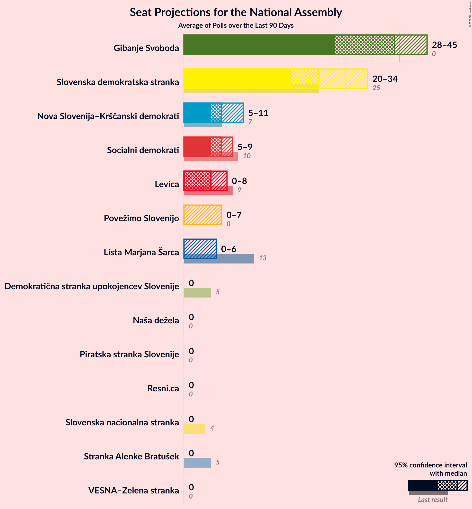

# Poll Average

<a href="#voting-intentions">Voting Intentions</a> | <a href="#seats">Seats</a> | <a href="#coalitions">Coalitions</a> | <a href="#technical-information">Technical Information</a>

## Summary

The table below lists the polls on which the average is based. They are the most recent polls (less than 90 days old) registered and analyzed so far.

| Period     | Polling firm/Commissioner(s) | SDS | LMŠ | SD | SMC | Levica | NSi | PAB | DeSUS | SNS | SLS | GOD–NLS | GOD | NLS | DL | PS | HIM |
|:----------:|:----------------------------:|:--:|:--:|:--:|:--:|:--:|:--:|:--:|:--:|:--:|:--:|:--:|:--:|:--:|:--:|:--:|:--:|
| 3 June 2018 | General Election | 24.9%   25 | 12.6%   13 | 9.9%   10 | 9.7%   10 | 9.3%   9 | 7.2%   7 | 5.1%   5 | 4.9%   5 | 4.2%   4 | 2.6%   0 | 0.2%   0 | 0.2%   0 | 0.2%   0 | 0.0%   0 | 0.0%   0 | 0.0%   2 |
| N/A | Poll Average | 23–35%   22–36 | 20–32%   19–31 | 6–14%   6–13 | 0–5%   0–5 | 7–13%   6–12 | 4–12%   4–11 | 1–3%   0 | 3–7%   0–7 | 3–6%   0–5 | 2–5%   0–4 | N/A   N/A | N/A   N/A | N/A   N/A | N/A   N/A | N/A   N/A | N/A   N/A |
| [25 February–4 March 2020](2020-03-04-Mediana.html) | Mediana   Delo | 28–34%   26–34 | 19–25%   19–24 | 9–13%   8–12 | 3–6%   0–5 | 9–13%   8–13 | 6–10%   5–9 | 1–3%   0 | 3–7%   0–6 | 3–6%   0–5 | 2–4%   0–4 | N/A   N/A | N/A   N/A | N/A   N/A | N/A   N/A | N/A   N/A | N/A   N/A |
| [19–20 February 2020](2020-02-20-Parsifal.html) | Parsifal   Nova 24TV | 29–36%   28–38 | 21–27%   20–27 | 6–10%   5–10 | 3–5%   0–5 | 6–10%   5–10 | 4–7%   0–7 | 1–2%   0 | 4–8%   4–7 | 3–6%   0–6 | 2–5%   0–4 | N/A   N/A | N/A   N/A | N/A   N/A | N/A   N/A | N/A   N/A | N/A   N/A |
| [14 January–16 February 2020](2020-02-16-Ninamedia.html) | Ninamedia   RTV SLO | 22–29%   21–28 | 26–33%   25–32 | 10–15%   9–14 | 0–1%   0 | 7–11%   7–11 | 8–12%   7–11 | 1–2%   0 | 3–6%   0–6 | 2–5%   0–4 | 2–5%   0–4 | N/A   N/A | N/A   N/A | N/A   N/A | N/A   N/A | N/A   N/A | N/A   N/A |
| 3 June 2018 | General Election | 24.9%   25 | 12.6%   13 | 9.9%   10 | 9.7%   10 | 9.3%   9 | 7.2%   7 | 5.1%   5 | 4.9%   5 | 4.2%   4 | 2.6%   0 | 0.2%   0 | 0.2%   0 | 0.2%   0 | 0.0%   0 | 0.0%   0 | 0.0%   2 |

Only polls for which at least the sample size has been published are included in the table above.

**Legend:**
+ **Top half of each row:** Voting intentions (95% confidence interval)
+ **Bottom half of each row:** Seat projections for the National Assembly (95% confidence interval)
+ **SDS:** Slovenska demokratska stranka
+ **LMŠ:** Lista Marjana Šarca
+ **SD:** Socialni demokrati
+ **SMC:** Stranka modernega centra
+ **Levica:** Levica
+ **NSi:** Nova Slovenija–Krščanski demokrati
+ **PAB:** Stranka Alenke Bratušek
+ **DeSUS:** Demokratična stranka upokojencev Slovenije
+ **SNS:** Slovenska nacionalna stranka
+ **SLS:** Slovenska ljudska stranka
+ **GOD–NLS:** Glas za otroke in družine–Nova ljudska stranka Slovenije
+ **GOD:** Glas za otroke in družine
+ **NLS:** Nova ljudska stranka Slovenije
+ **DL:** Državljanska lista
+ **PS:** Pozitivna Slovenija
+ **HIM:** Hungarian and Italian minorities
+ **N/A (single party):** Party not included the published results
+ **N/A (entire row):** Calculation for this opinion poll not started yet

## Voting Intentions

### Confidence Intervals

| Party | Last Result | Median | 80% Confidence Interval | 90% Confidence Interval | 95% Confidence Interval | 99% Confidence Interval |
|:-----:|:-----------:|:------:|:-----------------------:|:-----------------------:|:-----------------------:|:-----------------------:|
| <a href="#slovenska-demokratska-stranka">Slovenska demokratska stranka</a> | 24.9% | 30.6% | 24.5–34.0% |23.7–34.7% | 23.0–35.4% | 21.9–36.7% |
| <a href="#lista-marjana-šarca">Lista Marjana Šarca</a> | 12.6% | 24.0% | 20.9–30.1% |20.2–31.0% | 19.7–31.7% | 18.7–33.0% |
| <a href="#socialni-demokrati">Socialni demokrati</a> | 9.9% | 10.5% | 7.3–13.0% |6.9–13.6% | 6.5–14.1% | 5.9–15.1% |
| <a href="#stranka-modernega-centra">Stranka modernega centra</a> | 9.7% | 3.5% | 0.4–4.7% |0.3–5.1% | 0.2–5.4% | 0.1–5.9% |
| <a href="#levica">Levica</a> | 9.3% | 9.3% | 7.4–11.8% |6.9–12.4% | 6.6–12.8% | 6.0–13.7% |
| <a href="#nova-slovenija–krščanski-demokrati">Nova Slovenija–Krščanski demokrati</a> | 7.2% | 7.9% | 4.9–10.4% |4.5–11.0% | 4.2–11.5% | 3.7–12.4% |
| <a href="#stranka-alenke-bratušek">Stranka Alenke Bratušek</a> | 5.1% | 1.5% | 0.9–2.4% |0.8–2.6% | 0.7–2.8% | 0.5–3.3% |
| <a href="#demokratična-stranka-upokojencev-slovenije">Demokratična stranka upokojencev Slovenije</a> | 4.9% | 5.1% | 3.9–6.6% |3.6–7.0% | 3.4–7.4% | 3.0–8.2% |
| <a href="#slovenska-nacionalna-stranka">Slovenska nacionalna stranka</a> | 4.2% | 4.0% | 3.0–5.2% |2.8–5.5% | 2.6–5.8% | 2.2–6.5% |
| <a href="#slovenska-ljudska-stranka">Slovenska ljudska stranka</a> | 2.6% | 3.4% | 2.5–4.4% |2.3–4.7% | 2.2–5.0% | 1.9–5.5% |
| <a href="#glas-za-otroke-in-družine–nova-ljudska-stranka-slovenije">Glas za otroke in družine–Nova ljudska stranka Slovenije</a> | 0.2% | N/A | N/A |N/A | N/A | N/A |
| <a href="#glas-za-otroke-in-družine">Glas za otroke in družine</a> | 0.2% | N/A | N/A |N/A | N/A | N/A |
| <a href="#nova-ljudska-stranka-slovenije">Nova ljudska stranka Slovenije</a> | 0.2% | N/A | N/A |N/A | N/A | N/A |
| <a href="#državljanska-lista">Državljanska lista</a> | 0.0% | N/A | N/A |N/A | N/A | N/A |
| <a href="#pozitivna-slovenija">Pozitivna Slovenija</a> | 0.0% | N/A | N/A |N/A | N/A | N/A |
| <a href="#hungarian-and-italian-minorities">Hungarian and Italian minorities</a> | 0.0% | N/A | N/A |N/A | N/A | N/A |

### Slovenska demokratska stranka

*For a full overview of the results for this party, see the [Slovenska demokratska stranka](party-slovenskademokratskastranka.html) page.*

| Voting Intentions | Probability | Accumulated | Special Marks |
|:-----------------:|:-----------:|:-----------:|:-------------:|
| 19.5–20.5% | 0% | 100% |  |
| 20.5–21.5% | 0.2% | 100% |  |
| 21.5–22.5% | 1.1% | 99.7% |  |
| 22.5–23.5% | 3% | 98.6% |  |
| 23.5–24.5% | 6% | 96% |  |
| 24.5–25.5% | 8% | 89% | Last Result |
| 25.5–26.5% | 7% | 82% |  |
| 26.5–27.5% | 5% | 74% |  |
| 27.5–28.5% | 4% | 69% |  |
| 28.5–29.5% | 5% | 65% |  |
| 29.5–30.5% | 9% | 60% |  |
| 30.5–31.5% | 13% | 51% | Median |
| 31.5–32.5% | 14% | 38% |  |
| 32.5–33.5% | 11% | 25% |  |
| 33.5–34.5% | 8% | 14% |  |
| 34.5–35.5% | 4% | 6% |  |
| 35.5–36.5% | 2% | 2% |  |
| 36.5–37.5% | 0.5% | 0.6% |  |
| 37.5–38.5% | 0.1% | 0.1% |  |
| 38.5–39.5% | 0% | 0% |  |

### Lista Marjana Šarca

*For a full overview of the results for this party, see the [Lista Marjana Šarca](party-listamarjanašarca.html) page.*

| Voting Intentions | Probability | Accumulated | Special Marks |
|:-----------------:|:-----------:|:-----------:|:-------------:|
| 12.5–13.5% | 0% | 100% | Last Result |
| 13.5–14.5% | 0% | 100% |  |
| 14.5–15.5% | 0% | 100% |  |
| 15.5–16.5% | 0% | 100% |  |
| 16.5–17.5% | 0% | 100% |  |
| 17.5–18.5% | 0.3% | 100% |  |
| 18.5–19.5% | 2% | 99.6% |  |
| 19.5–20.5% | 5% | 98% |  |
| 20.5–21.5% | 10% | 93% |  |
| 21.5–22.5% | 14% | 83% |  |
| 22.5–23.5% | 14% | 69% |  |
| 23.5–24.5% | 11% | 55% | Median |
| 24.5–25.5% | 7% | 44% |  |
| 25.5–26.5% | 4% | 37% |  |
| 26.5–27.5% | 5% | 33% |  |
| 27.5–28.5% | 6% | 28% |  |
| 28.5–29.5% | 8% | 22% |  |
| 29.5–30.5% | 7% | 14% |  |
| 30.5–31.5% | 4% | 7% |  |
| 31.5–32.5% | 2% | 3% |  |
| 32.5–33.5% | 0.7% | 0.9% |  |
| 33.5–34.5% | 0.2% | 0.2% |  |
| 34.5–35.5% | 0% | 0% |  |

### Socialni demokrati

*For a full overview of the results for this party, see the [Socialni demokrati](party-socialnidemokrati.html) page.*

| Voting Intentions | Probability | Accumulated | Special Marks |
|:-----------------:|:-----------:|:-----------:|:-------------:|
| 3.5–4.5% | 0% | 100% |  |
| 4.5–5.5% | 0.2% | 100% |  |
| 5.5–6.5% | 3% | 99.8% |  |
| 6.5–7.5% | 10% | 97% |  |
| 7.5–8.5% | 13% | 87% |  |
| 8.5–9.5% | 11% | 74% |  |
| 9.5–10.5% | 14% | 63% | Last Result, Median |
| 10.5–11.5% | 18% | 48% |  |
| 11.5–12.5% | 16% | 30% |  |
| 12.5–13.5% | 10% | 15% |  |
| 13.5–14.5% | 4% | 5% |  |
| 14.5–15.5% | 1.0% | 1.2% |  |
| 15.5–16.5% | 0.2% | 0.2% |  |
| 16.5–17.5% | 0% | 0% |  |

### Stranka modernega centra

*For a full overview of the results for this party, see the [Stranka modernega centra](party-strankamodernegacentra.html) page.*

| Voting Intentions | Probability | Accumulated | Special Marks |
|:-----------------:|:-----------:|:-----------:|:-------------:|
| 0.0–0.5% | 18% | 100% |  |
| 0.5–1.5% | 15% | 82% |  |
| 1.5–2.5% | 1.0% | 67% |  |
| 2.5–3.5% | 18% | 66% | Median |
| 3.5–4.5% | 34% | 48% |  |
| 4.5–5.5% | 13% | 14% |  |
| 5.5–6.5% | 1.5% | 2% |  |
| 6.5–7.5% | 0.1% | 0.1% |  |
| 7.5–8.5% | 0% | 0% |  |
| 8.5–9.5% | 0% | 0% |  |
| 9.5–10.5% | 0% | 0% | Last Result |

### Levica

*For a full overview of the results for this party, see the [Levica](party-levica.html) page.*

| Voting Intentions | Probability | Accumulated | Special Marks |
|:-----------------:|:-----------:|:-----------:|:-------------:|
| 3.5–4.5% | 0% | 100% |  |
| 4.5–5.5% | 0.1% | 100% |  |
| 5.5–6.5% | 2% | 99.9% |  |
| 6.5–7.5% | 11% | 98% |  |
| 7.5–8.5% | 21% | 87% |  |
| 8.5–9.5% | 22% | 66% | Last Result, Median |
| 9.5–10.5% | 17% | 44% |  |
| 10.5–11.5% | 15% | 27% |  |
| 11.5–12.5% | 9% | 12% |  |
| 12.5–13.5% | 3% | 4% |  |
| 13.5–14.5% | 0.6% | 0.7% |  |
| 14.5–15.5% | 0.1% | 0.1% |  |
| 15.5–16.5% | 0% | 0% |  |

### Nova Slovenija–Krščanski demokrati

*For a full overview of the results for this party, see the [Nova Slovenija–Krščanski demokrati](party-novaslovenija–krščanskidemokrati.html) page.*

| Voting Intentions | Probability | Accumulated | Special Marks |
|:-----------------:|:-----------:|:-----------:|:-------------:|
| 1.5–2.5% | 0% | 100% |  |
| 2.5–3.5% | 0.2% | 100% |  |
| 3.5–4.5% | 5% | 99.8% |  |
| 4.5–5.5% | 14% | 95% |  |
| 5.5–6.5% | 13% | 80% |  |
| 6.5–7.5% | 12% | 67% | Last Result |
| 7.5–8.5% | 17% | 55% | Median |
| 8.5–9.5% | 17% | 38% |  |
| 9.5–10.5% | 13% | 21% |  |
| 10.5–11.5% | 6% | 9% |  |
| 11.5–12.5% | 2% | 2% |  |
| 12.5–13.5% | 0.3% | 0.4% |  |
| 13.5–14.5% | 0% | 0% |  |

### Stranka Alenke Bratušek

*For a full overview of the results for this party, see the [Stranka Alenke Bratušek](party-strankaalenkebratušek.html) page.*

| Voting Intentions | Probability | Accumulated | Special Marks |
|:-----------------:|:-----------:|:-----------:|:-------------:|
| 0.0–0.5% | 0.8% | 100% |  |
| 0.5–1.5% | 53% | 99.2% |  |
| 1.5–2.5% | 40% | 46% | Median |
| 2.5–3.5% | 6% | 6% |  |
| 3.5–4.5% | 0.2% | 0.2% |  |
| 4.5–5.5% | 0% | 0% | Last Result |

### Demokratična stranka upokojencev Slovenije

*For a full overview of the results for this party, see the [Demokratična stranka upokojencev Slovenije](party-demokratičnastrankaupokojencevslovenije.html) page.*

| Voting Intentions | Probability | Accumulated | Special Marks |
|:-----------------:|:-----------:|:-----------:|:-------------:|
| 1.5–2.5% | 0.1% | 100% |  |
| 2.5–3.5% | 4% | 99.9% |  |
| 3.5–4.5% | 26% | 96% |  |
| 4.5–5.5% | 36% | 70% | Last Result, Median |
| 5.5–6.5% | 23% | 34% |  |
| 6.5–7.5% | 9% | 11% |  |
| 7.5–8.5% | 2% | 2% |  |
| 8.5–9.5% | 0.2% | 0.2% |  |
| 9.5–10.5% | 0% | 0% |  |

### Slovenska nacionalna stranka

*For a full overview of the results for this party, see the [Slovenska nacionalna stranka](party-slovenskanacionalnastranka.html) page.*

| Voting Intentions | Probability | Accumulated | Special Marks |
|:-----------------:|:-----------:|:-----------:|:-------------:|
| 0.5–1.5% | 0% | 100% |  |
| 1.5–2.5% | 2% | 100% |  |
| 2.5–3.5% | 25% | 98% |  |
| 3.5–4.5% | 45% | 72% | Last Result, Median |
| 4.5–5.5% | 23% | 27% |  |
| 5.5–6.5% | 4% | 5% |  |
| 6.5–7.5% | 0.4% | 0.4% |  |
| 7.5–8.5% | 0% | 0% |  |

### Slovenska ljudska stranka

*For a full overview of the results for this party, see the [Slovenska ljudska stranka](party-slovenskaljudskastranka.html) page.*

| Voting Intentions | Probability | Accumulated | Special Marks |
|:-----------------:|:-----------:|:-----------:|:-------------:|
| 0.5–1.5% | 0.1% | 100% |  |
| 1.5–2.5% | 10% | 99.9% |  |
| 2.5–3.5% | 50% | 90% | Last Result, Median |
| 3.5–4.5% | 33% | 40% |  |
| 4.5–5.5% | 6% | 7% |  |
| 5.5–6.5% | 0.5% | 0.5% |  |
| 6.5–7.5% | 0% | 0% |  |

## Seats

### Confidence Intervals

| Party | Last Result | Median | 80% Confidence Interval | 90% Confidence Interval | 95% Confidence Interval | 99% Confidence Interval |
|:-----:|:-----------:|:------:|:-----------------------:|:-----------------------:|:-----------------------:|:-----------------------:|
| <a href="#slovenska-demokratska-stranka">Slovenska demokratska stranka</a> | 25 | 30 | 24–33 |23–35 | 22–36 | 21–38 |
| <a href="#lista-marjana-šarca">Lista Marjana Šarca</a> | 13 | 24 | 20–29 |19–30 | 19–31 | 18–32 |
| <a href="#socialni-demokrati">Socialni demokrati</a> | 10 | 10 | 7–12 |6–13 | 6–13 | 5–15 |
| <a href="#stranka-modernega-centra">Stranka modernega centra</a> | 10 | 0 | 0–4 |0–4 | 0–5 | 0–5 |
| <a href="#levica">Levica</a> | 9 | 9 | 7–11 |6–12 | 6–12 | 5–14 |
| <a href="#nova-slovenija–krščanski-demokrati">Nova Slovenija–Krščanski demokrati</a> | 7 | 8 | 4–10 |4–11 | 4–11 | 0–12 |
| <a href="#stranka-alenke-bratušek">Stranka Alenke Bratušek</a> | 5 | 0 | 0 |0 | 0 | 0 |
| <a href="#demokratična-stranka-upokojencev-slovenije">Demokratična stranka upokojencev Slovenije</a> | 5 | 4 | 0–6 |0–7 | 0–7 | 0–8 |
| <a href="#slovenska-nacionalna-stranka">Slovenska nacionalna stranka</a> | 4 | 0 | 0–5 |0–5 | 0–5 | 0–6 |
| <a href="#slovenska-ljudska-stranka">Slovenska ljudska stranka</a> | 0 | 0 | 0–4 |0–4 | 0–4 | 0–5 |
| <a href="#glas-za-otroke-in-družine–nova-ljudska-stranka-slovenije">Glas za otroke in družine–Nova ljudska stranka Slovenije</a> | 0 | N/A | N/A |N/A | N/A | N/A |
| <a href="#glas-za-otroke-in-družine">Glas za otroke in družine</a> | 0 | N/A | N/A |N/A | N/A | N/A |
| <a href="#nova-ljudska-stranka-slovenije">Nova ljudska stranka Slovenije</a> | 0 | N/A | N/A |N/A | N/A | N/A |
| <a href="#državljanska-lista">Državljanska lista</a> | 0 | N/A | N/A |N/A | N/A | N/A |
| <a href="#pozitivna-slovenija">Pozitivna Slovenija</a> | 0 | N/A | N/A |N/A | N/A | N/A |
| <a href="#hungarian-and-italian-minorities">Hungarian and Italian minorities</a> | 2 | N/A | N/A |N/A | N/A | N/A |

