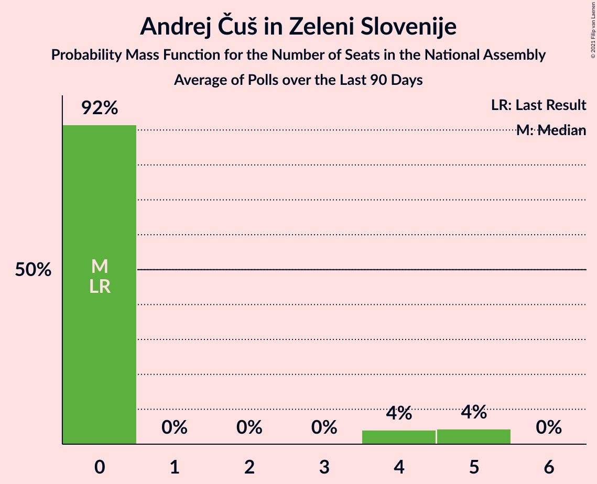

# Poll Average

<a href="#voting-intentions">Voting Intentions</a> | <a href="#seats">Seats</a> | <a href="#coalitions">Coalitions</a> | <a href="#technical-information">Technical Information</a>

## Summary

The table below lists the polls on which the average is based. They are the most recent polls (less than 90 days old) registered and analyzed so far.

| Period     | Polling firm/Commissioner(s) | SDS | LMŠ | SD | SMC | Levica | NSi | PAB | DeSUS | SNS | SLS | GOD–NLS | GOD | NLS | DL | PS | HIM | PSS | DD | AČZS |
|:----------:|:----------------------------:|:--:|:--:|:--:|:--:|:--:|:--:|:--:|:--:|:--:|:--:|:--:|:--:|:--:|:--:|:--:|:--:|:--:|:--:|:--:|
| 3 June 2018 | General Election | 24.9%   25 | 12.6%   13 | 9.9%   10 | 9.7%   10 | 9.3%   9 | 7.2%   7 | 5.1%   5 | 4.9%   5 | 4.2%   4 | 2.6%   0 | 0.2%   0 | 0.2%   0 | 0.2%   0 | 0.0%   0 | 0.0%   0 | 0.0%   2 | 2.2%   0 | 1.5%   0 | 1.1%   0 |
| N/A | Poll Average | 22–33%   21–32 | 10–25%   9–23 | 13–22%   13–21 | 0–3%   0 | 7–18%   6–17 | 6–13%   6–12 | 2–7%   0–7 | 1–6%   0–6 | 0–4%   0–4 | 1–3%   0 | N/A   N/A | N/A   N/A | N/A   N/A | N/A   N/A | N/A   N/A | N/A   N/A | 2–6%   0–6 | 0–4%   0 | 2–4%   0 |
| [13–15 July 2021](2021-07-15-Ninamedia.html) | Ninamedia   Dnevnik, Večer | 26–32%   25–31 | 12–17%   12–16 | 17–23%   17–22 | 0–1%   0 | 13–19%   12–17 | 6–10%   5–9 | 4–8%   4–7 | 1–2%   0 | 0–2%   0 | 1–3%   0 | N/A   N/A | N/A   N/A | N/A   N/A | N/A   N/A | N/A   N/A | N/A   N/A | N/A   N/A | N/A   N/A | N/A   N/A |
| [5–7 July 2021](2021-07-07-Mediana.html) | Mediana   Delo | 23–29%   22–29 | 9–14%   9–14 | 15–20%   14–21 | 0–1%   0 | 10–15%   10–16 | 7–11%   7–11 | 3–7%   0–6 | 4–7%   0–6 | 1–2%   0 | 1–3%   0 | N/A   N/A | N/A   N/A | N/A   N/A | N/A   N/A | N/A   N/A | N/A   N/A | 3–7%   0–6 | 2–4%   0–4 | 1–4%   0 |
| [10–15 June 2021](2021-06-15-Episcenter.html) | Episcenter   Domovina | 21–28%   20–26 | 19–26%   18–24 | 16–22%   15–21 | N/A   N/A | 9–14%   8–13 | 9–14%   8–13 | 4–8%   0–7 | N/A   N/A | N/A   N/A | N/A   N/A | N/A   N/A | N/A   N/A | N/A   N/A | N/A   N/A | N/A   N/A | N/A   N/A | 2–5%   0–4 | 1–4%   0 | N/A   N/A |
| [24–26 May 2021](2021-05-26-Parsifal.html) | Parsifal   Planet TV | 27–34%   28–34 | 13–18%   13–17 | 13–18%   12–17 | 1–3%   0 | 6–10%   6–10 | 6–10%   6–9 | 2–4%   0 | 3–5%   0–4 | 2–5%   0–4 | N/A   N/A | N/A   N/A | N/A   N/A | N/A   N/A | N/A   N/A | N/A   N/A | N/A   N/A | 2–4%   0 | 0–1%   0 | N/A   N/A |
| 3 June 2018 | General Election | 24.9%   25 | 12.6%   13 | 9.9%   10 | 9.7%   10 | 9.3%   9 | 7.2%   7 | 5.1%   5 | 4.9%   5 | 4.2%   4 | 2.6%   0 | 0.2%   0 | 0.2%   0 | 0.2%   0 | 0.0%   0 | 0.0%   0 | 0.0%   2 | 2.2%   0 | 1.5%   0 | 1.1%   0 |

Only polls for which at least the sample size has been published are included in the table above.

**Legend:**
+ **Top half of each row:** Voting intentions (95% confidence interval)
+ **Bottom half of each row:** Seat projections for the National Assembly (95% confidence interval)
+ **SDS:** Slovenska demokratska stranka
+ **LMŠ:** Lista Marjana Šarca
+ **SD:** Socialni demokrati
+ **SMC:** Stranka modernega centra
+ **Levica:** Levica
+ **NSi:** Nova Slovenija–Krščanski demokrati
+ **PAB:** Stranka Alenke Bratušek
+ **DeSUS:** Demokratična stranka upokojencev Slovenije
+ **SNS:** Slovenska nacionalna stranka
+ **SLS:** Slovenska ljudska stranka
+ **GOD–NLS:** Glas za otroke in družine–Nova ljudska stranka Slovenije
+ **GOD:** Glas za otroke in družine
+ **NLS:** Nova ljudska stranka Slovenije
+ **DL:** Državljanska lista
+ **PS:** Pozitivna Slovenija
+ **HIM:** Hungarian and Italian minorities
+ **PSS:** Piratska stranka Slovenije
+ **DD:** Dobra država
+ **AČZS:** Andrej Čuš in Zeleni Slovenije
+ **N/A (single party):** Party not included the published results
+ **N/A (entire row):** Calculation for this opinion poll not started yet

## Voting Intentions

### Confidence Intervals

| Party | Last Result | Median | 80% Confidence Interval | 90% Confidence Interval | 95% Confidence Interval | 99% Confidence Interval |
|:-----:|:-----------:|:------:|:-----------------------:|:-----------------------:|:-----------------------:|:-----------------------:|
| <a href="#slovenska-demokratska-stranka">Slovenska demokratska stranka</a> | 24.9% | 27.4% | 23.5–31.2% |22.7–32.0% | 22.1–32.6% | 20.8–33.8% |
| <a href="#lista-marjana-šarca">Lista Marjana Šarca</a> | 12.6% | 15.2% | 11.2–22.8% |10.5–23.8% | 10.0–24.6% | 9.2–26.0% |
| <a href="#socialni-demokrati">Socialni demokrati</a> | 9.9% | 18.1% | 14.6–21.1% |13.9–21.8% | 13.3–22.4% | 12.4–23.6% |
| <a href="#stranka-modernega-centra">Stranka modernega centra</a> | 9.7% | 0.9% | 0.4–2.1% |0.3–2.4% | 0.3–2.6% | 0.2–3.1% |
| <a href="#levica">Levica</a> | 9.3% | 11.9% | 7.8–16.4% |7.2–17.3% | 6.9–17.9% | 6.2–19.0% |
| <a href="#nova-slovenija–krščanski-demokrati">Nova Slovenija–Krščanski demokrati</a> | 7.2% | 8.5% | 6.9–11.6% |6.5–12.4% | 6.2–13.0% | 5.6–14.1% |
| <a href="#stranka-alenke-bratušek">Stranka Alenke Bratušek</a> | 5.1% | 5.1% | 2.5–6.6% |2.2–7.1% | 1.9–7.4% | 1.6–8.2% |
| <a href="#demokratična-stranka-upokojencev-slovenije">Demokratična stranka upokojencev Slovenije</a> | 4.9% | 3.9% | 1.0–5.6% |0.8–6.1% | 0.7–6.4% | 0.5–7.2% |
| <a href="#slovenska-nacionalna-stranka">Slovenska nacionalna stranka</a> | 4.2% | 1.5% | 0.7–3.5% |0.6–3.8% | 0.5–4.1% | 0.4–4.7% |
| <a href="#slovenska-ljudska-stranka">Slovenska ljudska stranka</a> | 2.6% | 1.9% | 1.3–2.6% |1.1–2.8% | 1.0–3.0% | 0.8–3.5% |
| <a href="#piratska-stranka-slovenije">Piratska stranka Slovenije</a> | 2.2% | 3.5% | 2.3–5.3% |2.0–5.8% | 1.8–6.1% | 1.5–6.8% |
| <a href="#dobra-država">Dobra država</a> | 1.5% | 2.3% | 0.3–3.5% |0.2–3.8% | 0.1–4.1% | 0.1–4.7% |
| <a href="#andrej-čuš-in-zeleni-slovenije">Andrej Čuš in Zeleni Slovenije</a> | 1.1% | 2.5% | 1.8–3.3% |1.6–3.6% | 1.5–3.8% | 1.3–4.3% |
| <a href="#glas-za-otroke-in-družine–nova-ljudska-stranka-slovenije">Glas za otroke in družine–Nova ljudska stranka Slovenije</a> | 0.2% | N/A | N/A |N/A | N/A | N/A |
| <a href="#glas-za-otroke-in-družine">Glas za otroke in družine</a> | 0.2% | N/A | N/A |N/A | N/A | N/A |
| <a href="#nova-ljudska-stranka-slovenije">Nova ljudska stranka Slovenije</a> | 0.2% | N/A | N/A |N/A | N/A | N/A |
| <a href="#državljanska-lista">Državljanska lista</a> | 0.0% | N/A | N/A |N/A | N/A | N/A |
| <a href="#pozitivna-slovenija">Pozitivna Slovenija</a> | 0.0% | N/A | N/A |N/A | N/A | N/A |
| <a href="#hungarian-and-italian-minorities">Hungarian and Italian minorities</a> | 0.0% | N/A | N/A |N/A | N/A | N/A |

### Slovenska demokratska stranka

*For a full overview of the results for this party, see the [Slovenska demokratska stranka](party-slovenskademokratskastranka.html) page.*

| Voting Intentions | Probability | Accumulated | Special Marks |
|:-----------------:|:-----------:|:-----------:|:-------------:|
| 18.5–19.5% | 0% | 100% |  |
| 19.5–20.5% | 0.3% | 99.9% |  |
| 20.5–21.5% | 1.0% | 99.7% |  |
| 21.5–22.5% | 3% | 98.7% |  |
| 22.5–23.5% | 6% | 96% |  |
| 23.5–24.5% | 9% | 90% |  |
| 24.5–25.5% | 11% | 81% | Last Result |
| 25.5–26.5% | 11% | 70% |  |
| 26.5–27.5% | 10% | 59% | Median |
| 27.5–28.5% | 10% | 48% |  |
| 28.5–29.5% | 12% | 38% |  |
| 29.5–30.5% | 11% | 26% |  |
| 30.5–31.5% | 8% | 15% |  |
| 31.5–32.5% | 5% | 7% |  |
| 32.5–33.5% | 2% | 3% |  |
| 33.5–34.5% | 0.6% | 0.8% |  |
| 34.5–35.5% | 0.1% | 0.2% |  |
| 35.5–36.5% | 0% | 0% |  |

### Lista Marjana Šarca

*For a full overview of the results for this party, see the [Lista Marjana Šarca](party-listamarjanašarca.html) page.*

| Voting Intentions | Probability | Accumulated | Special Marks |
|:-----------------:|:-----------:|:-----------:|:-------------:|
| 6.5–7.5% | 0% | 100% |  |
| 7.5–8.5% | 0.1% | 100% |  |
| 8.5–9.5% | 1.0% | 99.9% |  |
| 9.5–10.5% | 4% | 98.9% |  |
| 10.5–11.5% | 8% | 95% |  |
| 11.5–12.5% | 8% | 87% |  |
| 12.5–13.5% | 8% | 78% | Last Result |
| 13.5–14.5% | 11% | 70% |  |
| 14.5–15.5% | 14% | 59% | Median |
| 15.5–16.5% | 11% | 45% |  |
| 16.5–17.5% | 6% | 34% |  |
| 17.5–18.5% | 2% | 28% |  |
| 18.5–19.5% | 1.5% | 25% |  |
| 19.5–20.5% | 3% | 24% |  |
| 20.5–21.5% | 4% | 21% |  |
| 21.5–22.5% | 6% | 17% |  |
| 22.5–23.5% | 5% | 11% |  |
| 23.5–24.5% | 3% | 6% |  |
| 24.5–25.5% | 2% | 3% |  |
| 25.5–26.5% | 0.7% | 0.9% |  |
| 26.5–27.5% | 0.2% | 0.3% |  |
| 27.5–28.5% | 0% | 0.1% |  |
| 28.5–29.5% | 0% | 0% |  |

### Socialni demokrati

*For a full overview of the results for this party, see the [Socialni demokrati](party-socialnidemokrati.html) page.*

| Voting Intentions | Probability | Accumulated | Special Marks |
|:-----------------:|:-----------:|:-----------:|:-------------:|
| 9.5–10.5% | 0% | 100% | Last Result |
| 10.5–11.5% | 0.1% | 100% |  |
| 11.5–12.5% | 0.6% | 99.9% |  |
| 12.5–13.5% | 3% | 99.4% |  |
| 13.5–14.5% | 6% | 97% |  |
| 14.5–15.5% | 9% | 90% |  |
| 15.5–16.5% | 11% | 81% |  |
| 16.5–17.5% | 13% | 70% |  |
| 17.5–18.5% | 15% | 58% | Median |
| 18.5–19.5% | 15% | 43% |  |
| 19.5–20.5% | 13% | 28% |  |
| 20.5–21.5% | 9% | 15% |  |
| 21.5–22.5% | 4% | 6% |  |
| 22.5–23.5% | 2% | 2% |  |
| 23.5–24.5% | 0.4% | 0.5% |  |
| 24.5–25.5% | 0.1% | 0.1% |  |
| 25.5–26.5% | 0% | 0% |  |

### Stranka modernega centra

*For a full overview of the results for this party, see the [Stranka modernega centra](party-strankamodernegacentra.html) page.*

| Voting Intentions | Probability | Accumulated | Special Marks |
|:-----------------:|:-----------:|:-----------:|:-------------:|
| 0.0–0.5% | 23% | 100% |  |
| 0.5–1.5% | 52% | 77% | Median |
| 1.5–2.5% | 22% | 25% |  |
| 2.5–3.5% | 3% | 3% |  |
| 3.5–4.5% | 0.1% | 0.1% |  |
| 4.5–5.5% | 0% | 0% |  |
| 5.5–6.5% | 0% | 0% |  |
| 6.5–7.5% | 0% | 0% |  |
| 7.5–8.5% | 0% | 0% |  |
| 8.5–9.5% | 0% | 0% |  |
| 9.5–10.5% | 0% | 0% | Last Result |

### Levica

*For a full overview of the results for this party, see the [Levica](party-levica.html) page.*

| Voting Intentions | Probability | Accumulated | Special Marks |
|:-----------------:|:-----------:|:-----------:|:-------------:|
| 4.5–5.5% | 0.1% | 100% |  |
| 5.5–6.5% | 1.3% | 99.9% |  |
| 6.5–7.5% | 6% | 98.7% |  |
| 7.5–8.5% | 10% | 92% |  |
| 8.5–9.5% | 8% | 82% | Last Result |
| 9.5–10.5% | 8% | 74% |  |
| 10.5–11.5% | 11% | 67% |  |
| 11.5–12.5% | 13% | 55% | Median |
| 12.5–13.5% | 11% | 42% |  |
| 13.5–14.5% | 8% | 31% |  |
| 14.5–15.5% | 7% | 24% |  |
| 15.5–16.5% | 7% | 17% |  |
| 16.5–17.5% | 5% | 9% |  |
| 17.5–18.5% | 3% | 4% |  |
| 18.5–19.5% | 0.8% | 1.1% |  |
| 19.5–20.5% | 0.2% | 0.2% |  |
| 20.5–21.5% | 0% | 0% |  |

### Nova Slovenija–Krščanski demokrati

*For a full overview of the results for this party, see the [Nova Slovenija–Krščanski demokrati](party-novaslovenija–krščanskidemokrati.html) page.*

| Voting Intentions | Probability | Accumulated | Special Marks |
|:-----------------:|:-----------:|:-----------:|:-------------:|
| 3.5–4.5% | 0% | 100% |  |
| 4.5–5.5% | 0.4% | 100% |  |
| 5.5–6.5% | 5% | 99.6% |  |
| 6.5–7.5% | 19% | 95% | Last Result |
| 7.5–8.5% | 27% | 76% | Median |
| 8.5–9.5% | 19% | 48% |  |
| 9.5–10.5% | 11% | 29% |  |
| 10.5–11.5% | 8% | 19% |  |
| 11.5–12.5% | 6% | 10% |  |
| 12.5–13.5% | 3% | 4% |  |
| 13.5–14.5% | 1.0% | 1.2% |  |
| 14.5–15.5% | 0.2% | 0.2% |  |
| 15.5–16.5% | 0% | 0% |  |

### Stranka Alenke Bratušek

*For a full overview of the results for this party, see the [Stranka Alenke Bratušek](party-strankaalenkebratušek.html) page.*

| Voting Intentions | Probability | Accumulated | Special Marks |
|:-----------------:|:-----------:|:-----------:|:-------------:|
| 0.0–0.5% | 0% | 100% |  |
| 0.5–1.5% | 0.4% | 100% |  |
| 1.5–2.5% | 11% | 99.6% |  |
| 2.5–3.5% | 13% | 89% |  |
| 3.5–4.5% | 13% | 76% |  |
| 4.5–5.5% | 27% | 63% | Last Result, Median |
| 5.5–6.5% | 24% | 35% |  |
| 6.5–7.5% | 9% | 11% |  |
| 7.5–8.5% | 2% | 2% |  |
| 8.5–9.5% | 0.2% | 0.2% |  |
| 9.5–10.5% | 0% | 0% |  |

### Demokratična stranka upokojencev Slovenije

*For a full overview of the results for this party, see the [Demokratična stranka upokojencev Slovenije](party-demokratičnastrankaupokojencevslovenije.html) page.*

| Voting Intentions | Probability | Accumulated | Special Marks |
|:-----------------:|:-----------:|:-----------:|:-------------:|
| 0.0–0.5% | 0.6% | 100% |  |
| 0.5–1.5% | 25% | 99.4% |  |
| 1.5–2.5% | 8% | 75% |  |
| 2.5–3.5% | 10% | 66% |  |
| 3.5–4.5% | 24% | 57% | Median |
| 4.5–5.5% | 21% | 33% | Last Result |
| 5.5–6.5% | 9% | 11% |  |
| 6.5–7.5% | 2% | 2% |  |
| 7.5–8.5% | 0.2% | 0.2% |  |
| 8.5–9.5% | 0% | 0% |  |

### Slovenska nacionalna stranka

*For a full overview of the results for this party, see the [Slovenska nacionalna stranka](party-slovenskanacionalnastranka.html) page.*

| Voting Intentions | Probability | Accumulated | Special Marks |
|:-----------------:|:-----------:|:-----------:|:-------------:|
| 0.0–0.5% | 3% | 100% |  |
| 0.5–1.5% | 50% | 97% | Median |
| 1.5–2.5% | 19% | 47% |  |
| 2.5–3.5% | 20% | 29% |  |
| 3.5–4.5% | 8% | 9% | Last Result |
| 4.5–5.5% | 0.8% | 0.8% |  |
| 5.5–6.5% | 0% | 0% |  |

### Slovenska ljudska stranka

*For a full overview of the results for this party, see the [Slovenska ljudska stranka](party-slovenskaljudskastranka.html) page.*

| Voting Intentions | Probability | Accumulated | Special Marks |
|:-----------------:|:-----------:|:-----------:|:-------------:|
| 0.0–0.5% | 0% | 100% |  |
| 0.5–1.5% | 26% | 100% |  |
| 1.5–2.5% | 62% | 74% | Median |
| 2.5–3.5% | 11% | 11% | Last Result |
| 3.5–4.5% | 0.4% | 0.4% |  |
| 4.5–5.5% | 0% | 0% |  |

### Piratska stranka Slovenije

*For a full overview of the results for this party, see the [Piratska stranka Slovenije](party-piratskastrankaslovenije.html) page.*

| Voting Intentions | Probability | Accumulated | Special Marks |
|:-----------------:|:-----------:|:-----------:|:-------------:|
| 0.0–0.5% | 0% | 100% |  |
| 0.5–1.5% | 0.6% | 100% |  |
| 1.5–2.5% | 18% | 99.4% | Last Result |
| 2.5–3.5% | 32% | 82% |  |
| 3.5–4.5% | 25% | 50% | Median |
| 4.5–5.5% | 18% | 25% |  |
| 5.5–6.5% | 6% | 7% |  |
| 6.5–7.5% | 0.9% | 1.0% |  |
| 7.5–8.5% | 0.1% | 0.1% |  |
| 8.5–9.5% | 0% | 0% |  |

### Dobra država

*For a full overview of the results for this party, see the [Dobra država](party-dobradržava.html) page.*

| Voting Intentions | Probability | Accumulated | Special Marks |
|:-----------------:|:-----------:|:-----------:|:-------------:|
| 0.0–0.5% | 26% | 100% |  |
| 0.5–1.5% | 9% | 74% |  |
| 1.5–2.5% | 24% | 65% | Last Result, Median |
| 2.5–3.5% | 31% | 40% |  |
| 3.5–4.5% | 9% | 10% |  |
| 4.5–5.5% | 0.8% | 0.8% |  |
| 5.5–6.5% | 0% | 0% |  |

### Andrej Čuš in Zeleni Slovenije

*For a full overview of the results for this party, see the [Andrej Čuš in Zeleni Slovenije](party-andrejčušinzelenislovenije.html) page.*

| Voting Intentions | Probability | Accumulated | Special Marks |
|:-----------------:|:-----------:|:-----------:|:-------------:|
| 0.0–0.5% | 0% | 100% |  |
| 0.5–1.5% | 3% | 100% | Last Result |
| 1.5–2.5% | 51% | 97% | Median |
| 2.5–3.5% | 41% | 46% |  |
| 3.5–4.5% | 5% | 5% |  |
| 4.5–5.5% | 0.2% | 0.2% |  |
| 5.5–6.5% | 0% | 0% |  |

## Seats

### Confidence Intervals

| Party | Last Result | Median | 80% Confidence Interval | 90% Confidence Interval | 95% Confidence Interval | 99% Confidence Interval |
|:-----:|:-----------:|:------:|:-----------------------:|:-----------------------:|:-----------------------:|:-----------------------:|
| <a href="#slovenska-demokratska-stranka">Slovenska demokratska stranka</a> | 25 | 27 | 22–31 |21–32 | 21–32 | 19–34 |
| <a href="#lista-marjana-šarca">Lista Marjana Šarca</a> | 13 | 15 | 11–21 |9–22 | 9–23 | 9–25 |
| <a href="#socialni-demokrati">Socialni demokrati</a> | 10 | 17 | 14–20 |14–21 | 13–21 | 12–22 |
| <a href="#stranka-modernega-centra">Stranka modernega centra</a> | 10 | 0 | 0 |0 | 0 | 0 |
| <a href="#levica">Levica</a> | 9 | 11 | 7–16 |7–16 | 6–17 | 6–18 |
| <a href="#nova-slovenija–krščanski-demokrati">Nova Slovenija–Krščanski demokrati</a> | 7 | 8 | 6–11 |6–12 | 6–12 | 5–13 |
| <a href="#stranka-alenke-bratušek">Stranka Alenke Bratušek</a> | 5 | 4 | 0–6 |0–6 | 0–7 | 0–7 |
| <a href="#demokratična-stranka-upokojencev-slovenije">Demokratična stranka upokojencev Slovenije</a> | 5 | 4 | 0–5 |0–6 | 0–6 | 0–7 |
| <a href="#slovenska-nacionalna-stranka">Slovenska nacionalna stranka</a> | 4 | 0 | 0 |0–4 | 0–4 | 0–4 |
| <a href="#slovenska-ljudska-stranka">Slovenska ljudska stranka</a> | 0 | 0 | 0 |0 | 0 | 0 |
| <a href="#piratska-stranka-slovenije">Piratska stranka Slovenije</a> | 0 | 0 | 0–5 |0–6 | 0–6 | 0–6 |
| <a href="#dobra-država">Dobra država</a> | 0 | 0 | 0 |0 | 0 | 0–4 |
| <a href="#andrej-čuš-in-zeleni-slovenije">Andrej Čuš in Zeleni Slovenije</a> | 0 | 0 | 0 |0 | 0 | 0–4 |
| <a href="#glas-za-otroke-in-družine–nova-ljudska-stranka-slovenije">Glas za otroke in družine–Nova ljudska stranka Slovenije</a> | 0 | N/A | N/A |N/A | N/A | N/A |
| <a href="#glas-za-otroke-in-družine">Glas za otroke in družine</a> | 0 | N/A | N/A |N/A | N/A | N/A |
| <a href="#nova-ljudska-stranka-slovenije">Nova ljudska stranka Slovenije</a> | 0 | N/A | N/A |N/A | N/A | N/A |
| <a href="#državljanska-lista">Državljanska lista</a> | 0 | N/A | N/A |N/A | N/A | N/A |
| <a href="#pozitivna-slovenija">Pozitivna Slovenija</a> | 0 | N/A | N/A |N/A | N/A | N/A |
| <a href="#hungarian-and-italian-minorities">Hungarian and Italian minorities</a> | 2 | N/A | N/A |N/A | N/A | N/A |

### Slovenska demokratska stranka

*For a full overview of the results for this party, see the [Slovenska demokratska stranka](party-slovenskademokratskastranka.html) page.*

| Number of Seats | Probability | Accumulated | Special Marks |
|:---------------:|:-----------:|:-----------:|:-------------:|
| 18 | 0.1% | 100% |  |
| 19 | 0.5% | 99.9% |  |
| 20 | 2% | 99.4% |  |
| 21 | 3% | 98% |  |
| 22 | 7% | 95% |  |
| 23 | 6% | 87% |  |
| 24 | 9% | 82% |  |
| 25 | 8% | 73% | Last Result |
| 26 | 13% | 64% |  |
| 27 | 13% | 52% | Median |
| 28 | 6% | 39% |  |
| 29 | 8% | 33% |  |
| 30 | 14% | 25% |  |
| 31 | 5% | 11% |  |
| 32 | 3% | 6% |  |
| 33 | 2% | 2% |  |
| 34 | 0.8% | 0.9% |  |
| 35 | 0% | 0% |  |

### Lista Marjana Šarca

*For a full overview of the results for this party, see the [Lista Marjana Šarca](party-listamarjanašarca.html) page.*

| Number of Seats | Probability | Accumulated | Special Marks |
|:---------------:|:-----------:|:-----------:|:-------------:|
| 8 | 0.2% | 100% |  |
| 9 | 5% | 99.8% |  |
| 10 | 4% | 95% |  |
| 11 | 8% | 91% |  |
| 12 | 5% | 82% |  |
| 13 | 18% | 78% | Last Result |
| 14 | 9% | 60% |  |
| 15 | 13% | 51% | Median |
| 16 | 11% | 37% |  |
| 17 | 1.5% | 26% |  |
| 18 | 2% | 25% |  |
| 19 | 4% | 23% |  |
| 20 | 5% | 20% |  |
| 21 | 6% | 15% |  |
| 22 | 4% | 9% |  |
| 23 | 3% | 4% |  |
| 24 | 1.3% | 2% |  |
| 25 | 0.4% | 0.6% |  |
| 26 | 0.1% | 0.1% |  |
| 27 | 0% | 0% |  |

### Socialni demokrati

*For a full overview of the results for this party, see the [Socialni demokrati](party-socialnidemokrati.html) page.*

| Number of Seats | Probability | Accumulated | Special Marks |
|:---------------:|:-----------:|:-----------:|:-------------:|
| 10 | 0% | 100% | Last Result |
| 11 | 0.1% | 100% |  |
| 12 | 0.9% | 99.9% |  |
| 13 | 2% | 99.0% |  |
| 14 | 11% | 97% |  |
| 15 | 15% | 86% |  |
| 16 | 18% | 71% |  |
| 17 | 11% | 53% | Median |
| 18 | 12% | 42% |  |
| 19 | 15% | 30% |  |
| 20 | 8% | 15% |  |
| 21 | 5% | 7% |  |
| 22 | 1.2% | 1.5% |  |
| 23 | 0.3% | 0.3% |  |
| 24 | 0% | 0% |  |

### Stranka modernega centra

*For a full overview of the results for this party, see the [Stranka modernega centra](party-strankamodernegacentra.html) page.*

| Number of Seats | Probability | Accumulated | Special Marks |
|:---------------:|:-----------:|:-----------:|:-------------:|
| 0 | 100% | 100% | Median |
| 1 | 0% | 0% |  |
| 2 | 0% | 0% |  |
| 3 | 0% | 0% |  |
| 4 | 0% | 0% |  |
| 5 | 0% | 0% |  |
| 6 | 0% | 0% |  |
| 7 | 0% | 0% |  |
| 8 | 0% | 0% |  |
| 9 | 0% | 0% |  |
| 10 | 0% | 0% | Last Result |

### Levica

*For a full overview of the results for this party, see the [Levica](party-levica.html) page.*

| Number of Seats | Probability | Accumulated | Special Marks |
|:---------------:|:-----------:|:-----------:|:-------------:|
| 5 | 0.1% | 100% |  |
| 6 | 3% | 99.9% |  |
| 7 | 9% | 96% |  |
| 8 | 8% | 88% |  |
| 9 | 9% | 80% | Last Result |
| 10 | 10% | 70% |  |
| 11 | 11% | 60% | Median |
| 12 | 9% | 49% |  |
| 13 | 12% | 41% |  |
| 14 | 7% | 28% |  |
| 15 | 9% | 22% |  |
| 16 | 9% | 12% |  |
| 17 | 2% | 3% |  |
| 18 | 0.4% | 0.6% |  |
| 19 | 0.2% | 0.2% |  |
| 20 | 0% | 0% |  |

### Nova Slovenija–Krščanski demokrati

*For a full overview of the results for this party, see the [Nova Slovenija–Krščanski demokrati](party-novaslovenija–krščanskidemokrati.html) page.*

| Number of Seats | Probability | Accumulated | Special Marks |
|:---------------:|:-----------:|:-----------:|:-------------:|
| 4 | 0.1% | 100% |  |
| 5 | 1.0% | 99.9% |  |
| 6 | 15% | 98.9% |  |
| 7 | 23% | 84% | Last Result |
| 8 | 15% | 61% | Median |
| 9 | 18% | 46% |  |
| 10 | 15% | 28% |  |
| 11 | 8% | 13% |  |
| 12 | 4% | 5% |  |
| 13 | 1.1% | 1.3% |  |
| 14 | 0.2% | 0.2% |  |
| 15 | 0% | 0% |  |

### Stranka Alenke Bratušek

*For a full overview of the results for this party, see the [Stranka Alenke Bratušek](party-strankaalenkebratušek.html) page.*

| Number of Seats | Probability | Accumulated | Special Marks |
|:---------------:|:-----------:|:-----------:|:-------------:|
| 0 | 27% | 100% |  |
| 1 | 0% | 73% |  |
| 2 | 0% | 73% |  |
| 3 | 0.3% | 73% |  |
| 4 | 32% | 73% | Median |
| 5 | 18% | 41% | Last Result |
| 6 | 19% | 22% |  |
| 7 | 4% | 4% |  |
| 8 | 0.4% | 0.4% |  |
| 9 | 0% | 0% |  |

### Demokratična stranka upokojencev Slovenije

*For a full overview of the results for this party, see the [Demokratična stranka upokojencev Slovenije](party-demokratičnastrankaupokojencevslovenije.html) page.*

| Number of Seats | Probability | Accumulated | Special Marks |
|:---------------:|:-----------:|:-----------:|:-------------:|
| 0 | 47% | 100% |  |
| 1 | 0% | 53% |  |
| 2 | 0% | 53% |  |
| 3 | 0.2% | 53% |  |
| 4 | 35% | 53% | Median |
| 5 | 9% | 18% | Last Result |
| 6 | 8% | 9% |  |
| 7 | 0.6% | 0.8% |  |
| 8 | 0.2% | 0.2% |  |
| 9 | 0% | 0% |  |

### Slovenska nacionalna stranka

*For a full overview of the results for this party, see the [Slovenska nacionalna stranka](party-slovenskanacionalnastranka.html) page.*

| Number of Seats | Probability | Accumulated | Special Marks |
|:---------------:|:-----------:|:-----------:|:-------------:|
| 0 | 94% | 100% | Median |
| 1 | 0% | 6% |  |
| 2 | 0% | 6% |  |
| 3 | 0.1% | 6% |  |
| 4 | 6% | 6% | Last Result |
| 5 | 0.1% | 0.1% |  |
| 6 | 0% | 0% |  |

### Slovenska ljudska stranka

*For a full overview of the results for this party, see the [Slovenska ljudska stranka](party-slovenskaljudskastranka.html) page.*

| Number of Seats | Probability | Accumulated | Special Marks |
|:---------------:|:-----------:|:-----------:|:-------------:|
| 0 | 99.9% | 100% | Last Result, Median |
| 1 | 0% | 0.1% |  |
| 2 | 0% | 0.1% |  |
| 3 | 0% | 0.1% |  |
| 4 | 0% | 0% |  |

### Piratska stranka Slovenije

*For a full overview of the results for this party, see the [Piratska stranka Slovenije](party-piratskastrankaslovenije.html) page.*

| Number of Seats | Probability | Accumulated | Special Marks |
|:---------------:|:-----------:|:-----------:|:-------------:|
| 0 | 65% | 100% | Last Result, Median |
| 1 | 0% | 35% |  |
| 2 | 0% | 35% |  |
| 3 | 2% | 35% |  |
| 4 | 11% | 33% |  |
| 5 | 15% | 22% |  |
| 6 | 7% | 7% |  |
| 7 | 0.2% | 0.2% |  |
| 8 | 0% | 0% |  |

### Dobra država

*For a full overview of the results for this party, see the [Dobra država](party-dobradržava.html) page.*

| Number of Seats | Probability | Accumulated | Special Marks |
|:---------------:|:-----------:|:-----------:|:-------------:|
| 0 | 98% | 100% | Last Result, Median |
| 1 | 0% | 2% |  |
| 2 | 0% | 2% |  |
| 3 | 0.3% | 2% |  |
| 4 | 1.2% | 1.4% |  |
| 5 | 0.2% | 0.2% |  |
| 6 | 0% | 0% |  |

### Andrej Čuš in Zeleni Slovenije

*For a full overview of the results for this party, see the [Andrej Čuš in Zeleni Slovenije](party-andrejčušinzelenislovenije.html) page.*

| Number of Seats | Probability | Accumulated | Special Marks |
|:---------------:|:-----------:|:-----------:|:-------------:|
| 0 | 99.1% | 100% | Last Result, Median |
| 1 | 0% | 0.9% |  |
| 2 | 0% | 0.9% |  |
| 3 | 0% | 0.9% |  |
| 4 | 0.9% | 0.9% |  |
| 5 | 0% | 0% |  |

### Glas za otroke in družine–Nova ljudska stranka Slovenije

*For a full overview of the results for this party, see the [Glas za otroke in družine–Nova ljudska stranka Slovenije](party-glaszaotrokeindružine–novaljudskastrankaslovenije.html) page.*

### Glas za otroke in družine

*For a full overview of the results for this party, see the [Glas za otroke in družine](party-glaszaotrokeindružine.html) page.*

### Nova ljudska stranka Slovenije

*For a full overview of the results for this party, see the [Nova ljudska stranka Slovenije](party-novaljudskastrankaslovenije.html) page.*

### Državljanska lista

*For a full overview of the results for this party, see the [Državljanska lista](party-državljanskalista.html) page.*

### Pozitivna Slovenija

*For a full overview of the results for this party, see the [Pozitivna Slovenija](party-pozitivnaslovenija.html) page.*

### Hungarian and Italian minorities

*For a full overview of the results for this party, see the [Hungarian and Italian minorities](party-hungariananditalianminorities.html) page.*

## Coalitions

### Confidence Intervals

| Coalition | Last Result | Median | Majority? | 80% Confidence Interval | 90% Confidence Interval | 95% Confidence Interval | 99% Confidence Interval |
|:---------:|:-----------:|:------:|:---------:|:-----------------------:|:-----------------------:|:-----------------------:|:-----------------------:|
| Lista Marjana Šarca – Socialni demokrati – Stranka modernega centra – Nova Slovenija–Krščanski demokrati – Stranka Alenke Bratušek – Demokratična stranka upokojencev Slovenije | 50 | 45 | 46% | 39–55 | 38–56 | 37–57 | 35–58 |
| Lista Marjana Šarca – Socialni demokrati – Nova Slovenija–Krščanski demokrati – Demokratična stranka upokojencev Slovenije | 35 | 41 | 26% | 38–50 | 37–51 | 36–52 | 35–53 |
| Lista Marjana Šarca – Socialni demokrati – Stranka modernega centra – Nova Slovenija–Krščanski demokrati – Demokratična stranka upokojencev Slovenije | 45 | 41 | 26% | 38–50 | 37–51 | 36–52 | 35–53 |
| Lista Marjana Šarca – Socialni demokrati – Nova Slovenija–Krščanski demokrati | 30 | 39 | 23% | 35–50 | 35–51 | 35–52 | 33–53 |
| Lista Marjana Šarca – Socialni demokrati – Stranka modernega centra – Nova Slovenija–Krščanski demokrati | 40 | 39 | 23% | 35–50 | 35–51 | 35–52 | 33–53 |
| Slovenska demokratska stranka – Lista Marjana Šarca – Demokratična stranka upokojencev Slovenije | 43 | 43 | 30% | 40–50 | 39–50 | 39–50 | 37–51 |
| Slovenska demokratska stranka – Lista Marjana Šarca | 38 | 43 | 23% | 35–46 | 35–47 | 35–49 | 33–50 |
| Lista Marjana Šarca – Socialni demokrati – Stranka modernega centra – Stranka Alenke Bratušek – Demokratična stranka upokojencev Slovenije | 43 | 37 | 6% | 32–44 | 31–46 | 30–47 | 28–48 |
| Slovenska demokratska stranka – Nova Slovenija–Krščanski demokrati – Demokratična stranka upokojencev Slovenije – Slovenska ljudska stranka – Državljanska lista | 37 | 37 | 0% | 32–41 | 31–42 | 31–42 | 29–43 |
| Lista Marjana Šarca – Socialni demokrati – Demokratična stranka upokojencev Slovenije | 28 | 34 | 0% | 30–39 | 29–40 | 29–41 | 27–43 |
| Lista Marjana Šarca – Socialni demokrati – Stranka modernega centra – Demokratična stranka upokojencev Slovenije | 38 | 34 | 0% | 30–39 | 29–40 | 29–41 | 27–43 |
| Lista Marjana Šarca – Socialni demokrati | 23 | 32 | 0% | 26–39 | 25–40 | 25–41 | 25–43 |
| Lista Marjana Šarca – Socialni demokrati – Stranka modernega centra | 33 | 32 | 0% | 26–39 | 25–40 | 25–41 | 25–43 |
| Socialni demokrati – Demokratična stranka upokojencev Slovenije – Državljanska lista – Pozitivna Slovenija | 15 | 19 | 0% | 16–21 | 15–24 | 14–26 | 12–26 |
| Socialni demokrati – Stranka modernega centra – Demokratična stranka upokojencev Slovenije | 25 | 19 | 0% | 16–21 | 15–24 | 14–26 | 12–26 |
| Socialni demokrati – Stranka modernega centra – Pozitivna Slovenija | 20 | 17 | 0% | 14–20 | 14–21 | 13–21 | 12–22 |

### Lista Marjana Šarca – Socialni demokrati – Stranka modernega centra – Nova Slovenija–Krščanski demokrati – Stranka Alenke Bratušek – Demokratična stranka upokojencev Slovenije

| Number of Seats | Probability | Accumulated | Special Marks |
|:---------------:|:-----------:|:-----------:|:-------------:|
| 34 | 0.1% | 100% |  |
| 35 | 0.5% | 99.9% |  |
| 36 | 1.1% | 99.4% |  |
| 37 | 2% | 98% |  |
| 38 | 2% | 96% |  |
| 39 | 7% | 94% |  |
| 40 | 3% | 87% |  |
| 41 | 2% | 84% |  |
| 42 | 11% | 82% |  |
| 43 | 10% | 71% |  |
| 44 | 9% | 61% |  |
| 45 | 6% | 52% |  |
| 46 | 9% | 46% | Majority |
| 47 | 3% | 37% |  |
| 48 | 5% | 34% | Median |
| 49 | 2% | 29% |  |
| 50 | 2% | 28% | Last Result |
| 51 | 5% | 25% |  |
| 52 | 2% | 21% |  |
| 53 | 3% | 19% |  |
| 54 | 5% | 15% |  |
| 55 | 4% | 11% |  |
| 56 | 3% | 6% |  |
| 57 | 2% | 3% |  |
| 58 | 0.9% | 1.3% |  |
| 59 | 0.3% | 0.3% |  |
| 60 | 0.1% | 0.1% |  |
| 61 | 0% | 0% |  |

### Lista Marjana Šarca – Socialni demokrati – Nova Slovenija–Krščanski demokrati – Demokratična stranka upokojencev Slovenije

| Number of Seats | Probability | Accumulated | Special Marks |
|:---------------:|:-----------:|:-----------:|:-------------:|
| 34 | 0.2% | 100% |  |
| 35 | 0.8% | 99.8% | Last Result |
| 36 | 2% | 99.0% |  |
| 37 | 3% | 97% |  |
| 38 | 6% | 94% |  |
| 39 | 21% | 88% |  |
| 40 | 15% | 67% |  |
| 41 | 5% | 52% |  |
| 42 | 13% | 47% |  |
| 43 | 5% | 35% |  |
| 44 | 2% | 30% | Median |
| 45 | 2% | 28% |  |
| 46 | 2% | 26% | Majority |
| 47 | 5% | 24% |  |
| 48 | 4% | 19% |  |
| 49 | 4% | 15% |  |
| 50 | 5% | 11% |  |
| 51 | 3% | 6% |  |
| 52 | 2% | 3% |  |
| 53 | 0.9% | 1.3% |  |
| 54 | 0.3% | 0.4% |  |
| 55 | 0.1% | 0.1% |  |
| 56 | 0% | 0% |  |

### Lista Marjana Šarca – Socialni demokrati – Stranka modernega centra – Nova Slovenija–Krščanski demokrati – Demokratična stranka upokojencev Slovenije

| Number of Seats | Probability | Accumulated | Special Marks |
|:---------------:|:-----------:|:-----------:|:-------------:|
| 34 | 0.2% | 100% |  |
| 35 | 0.8% | 99.8% |  |
| 36 | 2% | 99.0% |  |
| 37 | 3% | 97% |  |
| 38 | 6% | 94% |  |
| 39 | 21% | 88% |  |
| 40 | 15% | 67% |  |
| 41 | 5% | 52% |  |
| 42 | 13% | 47% |  |
| 43 | 5% | 35% |  |
| 44 | 2% | 30% | Median |
| 45 | 2% | 28% | Last Result |
| 46 | 2% | 26% | Majority |
| 47 | 5% | 24% |  |
| 48 | 4% | 19% |  |
| 49 | 4% | 15% |  |
| 50 | 5% | 11% |  |
| 51 | 3% | 6% |  |
| 52 | 2% | 3% |  |
| 53 | 0.9% | 1.3% |  |
| 54 | 0.3% | 0.4% |  |
| 55 | 0.1% | 0.1% |  |
| 56 | 0% | 0% |  |

### Lista Marjana Šarca – Socialni demokrati – Nova Slovenija–Krščanski demokrati

| Number of Seats | Probability | Accumulated | Special Marks |
|:---------------:|:-----------:|:-----------:|:-------------:|
| 30 | 0% | 100% | Last Result |
| 31 | 0.2% | 100% |  |
| 32 | 0.1% | 99.8% |  |
| 33 | 0.6% | 99.7% |  |
| 34 | 0.7% | 99.1% |  |
| 35 | 15% | 98% |  |
| 36 | 8% | 84% |  |
| 37 | 8% | 76% |  |
| 38 | 14% | 67% |  |
| 39 | 10% | 53% |  |
| 40 | 8% | 43% | Median |
| 41 | 5% | 35% |  |
| 42 | 2% | 29% |  |
| 43 | 2% | 28% |  |
| 44 | 0.8% | 26% |  |
| 45 | 1.4% | 25% |  |
| 46 | 2% | 23% | Majority |
| 47 | 3% | 21% |  |
| 48 | 4% | 19% |  |
| 49 | 4% | 14% |  |
| 50 | 5% | 11% |  |
| 51 | 3% | 6% |  |
| 52 | 2% | 3% |  |
| 53 | 0.9% | 1.3% |  |
| 54 | 0.3% | 0.4% |  |
| 55 | 0.1% | 0.1% |  |
| 56 | 0% | 0% |  |

### Lista Marjana Šarca – Socialni demokrati – Stranka modernega centra – Nova Slovenija–Krščanski demokrati

| Number of Seats | Probability | Accumulated | Special Marks |
|:---------------:|:-----------:|:-----------:|:-------------:|
| 31 | 0.2% | 100% |  |
| 32 | 0.1% | 99.8% |  |
| 33 | 0.6% | 99.7% |  |
| 34 | 0.7% | 99.1% |  |
| 35 | 15% | 98% |  |
| 36 | 8% | 84% |  |
| 37 | 8% | 76% |  |
| 38 | 14% | 67% |  |
| 39 | 10% | 53% |  |
| 40 | 8% | 43% | Last Result, Median |
| 41 | 5% | 35% |  |
| 42 | 2% | 29% |  |
| 43 | 2% | 28% |  |
| 44 | 0.8% | 26% |  |
| 45 | 1.4% | 25% |  |
| 46 | 2% | 23% | Majority |
| 47 | 3% | 21% |  |
| 48 | 4% | 19% |  |
| 49 | 4% | 14% |  |
| 50 | 5% | 11% |  |
| 51 | 3% | 6% |  |
| 52 | 2% | 3% |  |
| 53 | 0.9% | 1.3% |  |
| 54 | 0.3% | 0.4% |  |
| 55 | 0.1% | 0.1% |  |
| 56 | 0% | 0% |  |

### Slovenska demokratska stranka – Lista Marjana Šarca – Demokratična stranka upokojencev Slovenije

| Number of Seats | Probability | Accumulated | Special Marks |
|:---------------:|:-----------:|:-----------:|:-------------:|
| 35 | 0.1% | 100% |  |
| 36 | 0.1% | 99.9% |  |
| 37 | 0.5% | 99.8% |  |
| 38 | 1.3% | 99.3% |  |
| 39 | 7% | 98% |  |
| 40 | 14% | 91% |  |
| 41 | 11% | 77% |  |
| 42 | 6% | 66% |  |
| 43 | 17% | 60% | Last Result |
| 44 | 7% | 42% |  |
| 45 | 5% | 35% |  |
| 46 | 6% | 30% | Median, Majority |
| 47 | 5% | 24% |  |
| 48 | 6% | 19% |  |
| 49 | 2% | 12% |  |
| 50 | 10% | 11% |  |
| 51 | 0.4% | 0.7% |  |
| 52 | 0.2% | 0.3% |  |
| 53 | 0.1% | 0.1% |  |
| 54 | 0% | 0% |  |

### Slovenska demokratska stranka – Lista Marjana Šarca

| Number of Seats | Probability | Accumulated | Special Marks |
|:---------------:|:-----------:|:-----------:|:-------------:|
| 31 | 0.1% | 100% |  |
| 32 | 0.1% | 99.9% |  |
| 33 | 0.5% | 99.8% |  |
| 34 | 2% | 99.3% |  |
| 35 | 8% | 98% |  |
| 36 | 2% | 90% |  |
| 37 | 8% | 88% |  |
| 38 | 2% | 80% | Last Result |
| 39 | 4% | 78% |  |
| 40 | 11% | 74% |  |
| 41 | 7% | 63% |  |
| 42 | 6% | 57% | Median |
| 43 | 12% | 51% |  |
| 44 | 11% | 39% |  |
| 45 | 5% | 28% |  |
| 46 | 15% | 23% | Majority |
| 47 | 4% | 8% |  |
| 48 | 2% | 4% |  |
| 49 | 1.4% | 3% |  |
| 50 | 0.9% | 1.1% |  |
| 51 | 0.3% | 0.3% |  |
| 52 | 0% | 0% |  |

### Lista Marjana Šarca – Socialni demokrati – Stranka modernega centra – Stranka Alenke Bratušek – Demokratična stranka upokojencev Slovenije

| Number of Seats | Probability | Accumulated | Special Marks |
|:---------------:|:-----------:|:-----------:|:-------------:|
| 26 | 0.1% | 100% |  |
| 27 | 0.2% | 99.9% |  |
| 28 | 0.9% | 99.7% |  |
| 29 | 0.7% | 98.8% |  |
| 30 | 1.1% | 98% |  |
| 31 | 5% | 97% |  |
| 32 | 4% | 92% |  |
| 33 | 11% | 88% |  |
| 34 | 4% | 77% |  |
| 35 | 16% | 73% |  |
| 36 | 3% | 57% |  |
| 37 | 5% | 55% |  |
| 38 | 9% | 50% |  |
| 39 | 7% | 41% |  |
| 40 | 6% | 34% | Median |
| 41 | 4% | 28% |  |
| 42 | 7% | 24% |  |
| 43 | 4% | 18% | Last Result |
| 44 | 4% | 14% |  |
| 45 | 4% | 9% |  |
| 46 | 3% | 6% | Majority |
| 47 | 2% | 3% |  |
| 48 | 0.6% | 0.9% |  |
| 49 | 0.2% | 0.2% |  |
| 50 | 0% | 0.1% |  |
| 51 | 0% | 0% |  |

### Slovenska demokratska stranka – Nova Slovenija–Krščanski demokrati – Demokratična stranka upokojencev Slovenije – Slovenska ljudska stranka – Državljanska lista

| Number of Seats | Probability | Accumulated | Special Marks |
|:---------------:|:-----------:|:-----------:|:-------------:|
| 28 | 0.2% | 100% |  |
| 29 | 0.6% | 99.8% |  |
| 30 | 2% | 99.2% |  |
| 31 | 3% | 98% |  |
| 32 | 7% | 94% |  |
| 33 | 8% | 88% |  |
| 34 | 13% | 80% |  |
| 35 | 6% | 67% |  |
| 36 | 7% | 61% |  |
| 37 | 7% | 54% | Last Result |
| 38 | 6% | 47% |  |
| 39 | 13% | 41% | Median |
| 40 | 12% | 29% |  |
| 41 | 8% | 16% |  |
| 42 | 8% | 9% |  |
| 43 | 0.6% | 1.0% |  |
| 44 | 0.3% | 0.4% |  |
| 45 | 0.1% | 0.2% |  |
| 46 | 0% | 0% | Majority |

### Lista Marjana Šarca – Socialni demokrati – Demokratična stranka upokojencev Slovenije

| Number of Seats | Probability | Accumulated | Special Marks |
|:---------------:|:-----------:|:-----------:|:-------------:|
| 26 | 0.2% | 100% |  |
| 27 | 0.3% | 99.8% |  |
| 28 | 1.2% | 99.5% | Last Result |
| 29 | 8% | 98% |  |
| 30 | 3% | 90% |  |
| 31 | 15% | 87% |  |
| 32 | 11% | 72% |  |
| 33 | 9% | 61% |  |
| 34 | 14% | 52% |  |
| 35 | 9% | 38% |  |
| 36 | 4% | 29% | Median |
| 37 | 5% | 25% |  |
| 38 | 6% | 20% |  |
| 39 | 6% | 14% |  |
| 40 | 4% | 9% |  |
| 41 | 2% | 5% |  |
| 42 | 1.3% | 2% |  |
| 43 | 0.6% | 0.8% |  |
| 44 | 0.2% | 0.3% |  |
| 45 | 0.1% | 0.1% |  |
| 46 | 0% | 0% | Majority |

### Lista Marjana Šarca – Socialni demokrati – Stranka modernega centra – Demokratična stranka upokojencev Slovenije

| Number of Seats | Probability | Accumulated | Special Marks |
|:---------------:|:-----------:|:-----------:|:-------------:|
| 26 | 0.2% | 100% |  |
| 27 | 0.3% | 99.8% |  |
| 28 | 1.2% | 99.5% |  |
| 29 | 8% | 98% |  |
| 30 | 3% | 90% |  |
| 31 | 15% | 87% |  |
| 32 | 11% | 72% |  |
| 33 | 9% | 61% |  |
| 34 | 14% | 52% |  |
| 35 | 9% | 38% |  |
| 36 | 4% | 29% | Median |
| 37 | 5% | 25% |  |
| 38 | 6% | 20% | Last Result |
| 39 | 6% | 14% |  |
| 40 | 4% | 9% |  |
| 41 | 2% | 5% |  |
| 42 | 1.3% | 2% |  |
| 43 | 0.6% | 0.8% |  |
| 44 | 0.2% | 0.3% |  |
| 45 | 0.1% | 0.1% |  |
| 46 | 0% | 0% | Majority |

### Lista Marjana Šarca – Socialni demokrati

| Number of Seats | Probability | Accumulated | Special Marks |
|:---------------:|:-----------:|:-----------:|:-------------:|
| 23 | 0% | 100% | Last Result |
| 24 | 0.3% | 99.9% |  |
| 25 | 7% | 99.7% |  |
| 26 | 4% | 92% |  |
| 27 | 5% | 89% |  |
| 28 | 7% | 84% |  |
| 29 | 6% | 77% |  |
| 30 | 5% | 71% |  |
| 31 | 15% | 66% |  |
| 32 | 12% | 51% | Median |
| 33 | 4% | 39% |  |
| 34 | 8% | 35% |  |
| 35 | 2% | 27% |  |
| 36 | 3% | 25% |  |
| 37 | 4% | 21% |  |
| 38 | 3% | 17% |  |
| 39 | 6% | 14% |  |
| 40 | 4% | 8% |  |
| 41 | 2% | 4% |  |
| 42 | 1.3% | 2% |  |
| 43 | 0.6% | 0.8% |  |
| 44 | 0.2% | 0.3% |  |
| 45 | 0.1% | 0.1% |  |
| 46 | 0% | 0% | Majority |

### Lista Marjana Šarca – Socialni demokrati – Stranka modernega centra

| Number of Seats | Probability | Accumulated | Special Marks |
|:---------------:|:-----------:|:-----------:|:-------------:|
| 23 | 0% | 100% |  |
| 24 | 0.3% | 99.9% |  |
| 25 | 7% | 99.7% |  |
| 26 | 4% | 92% |  |
| 27 | 5% | 89% |  |
| 28 | 7% | 84% |  |
| 29 | 6% | 77% |  |
| 30 | 5% | 71% |  |
| 31 | 15% | 66% |  |
| 32 | 12% | 51% | Median |
| 33 | 4% | 39% | Last Result |
| 34 | 8% | 35% |  |
| 35 | 2% | 27% |  |
| 36 | 3% | 25% |  |
| 37 | 4% | 21% |  |
| 38 | 3% | 17% |  |
| 39 | 6% | 14% |  |
| 40 | 4% | 8% |  |
| 41 | 2% | 4% |  |
| 42 | 1.3% | 2% |  |
| 43 | 0.6% | 0.8% |  |
| 44 | 0.2% | 0.3% |  |
| 45 | 0.1% | 0.1% |  |
| 46 | 0% | 0% | Majority |

### Socialni demokrati – Demokratična stranka upokojencev Slovenije – Državljanska lista – Pozitivna Slovenija

| Number of Seats | Probability | Accumulated | Special Marks |
|:---------------:|:-----------:|:-----------:|:-------------:|
| 12 | 0.8% | 100% |  |
| 13 | 0.6% | 99.2% |  |
| 14 | 1.4% | 98.6% |  |
| 15 | 3% | 97% | Last Result |
| 16 | 8% | 94% |  |
| 17 | 10% | 86% |  |
| 18 | 20% | 76% |  |
| 19 | 21% | 55% |  |
| 20 | 17% | 34% |  |
| 21 | 10% | 17% | Median |
| 22 | 1.4% | 8% |  |
| 23 | 0.8% | 6% |  |
| 24 | 2% | 6% |  |
| 25 | 0.5% | 3% |  |
| 26 | 2% | 3% |  |
| 27 | 0.3% | 0.5% |  |
| 28 | 0.1% | 0.1% |  |
| 29 | 0% | 0% |  |

### Socialni demokrati – Stranka modernega centra – Demokratična stranka upokojencev Slovenije

| Number of Seats | Probability | Accumulated | Special Marks |
|:---------------:|:-----------:|:-----------:|:-------------:|
| 12 | 0.8% | 100% |  |
| 13 | 0.6% | 99.2% |  |
| 14 | 1.4% | 98.6% |  |
| 15 | 3% | 97% |  |
| 16 | 8% | 94% |  |
| 17 | 10% | 86% |  |
| 18 | 20% | 76% |  |
| 19 | 21% | 55% |  |
| 20 | 17% | 34% |  |
| 21 | 10% | 17% | Median |
| 22 | 1.4% | 8% |  |
| 23 | 0.8% | 6% |  |
| 24 | 2% | 6% |  |
| 25 | 0.5% | 3% | Last Result |
| 26 | 2% | 3% |  |
| 27 | 0.3% | 0.5% |  |
| 28 | 0.1% | 0.1% |  |
| 29 | 0% | 0% |  |

### Socialni demokrati – Stranka modernega centra – Pozitivna Slovenija

| Number of Seats | Probability | Accumulated | Special Marks |
|:---------------:|:-----------:|:-----------:|:-------------:|
| 11 | 0.1% | 100% |  |
| 12 | 0.9% | 99.9% |  |
| 13 | 2% | 99.0% |  |
| 14 | 11% | 97% |  |
| 15 | 15% | 86% |  |
| 16 | 18% | 71% |  |
| 17 | 11% | 53% | Median |
| 18 | 12% | 42% |  |
| 19 | 15% | 30% |  |
| 20 | 8% | 15% | Last Result |
| 21 | 5% | 7% |  |
| 22 | 1.2% | 1.5% |  |
| 23 | 0.3% | 0.3% |  |
| 24 | 0% | 0% |  |

## Technical Information

+ **Number of polls included in this average:** 4
+ **Lowest number of simulations done in a poll included in this average:** 1,048,576
+ **Total number of simulations done in the polls included in this average:** 4,194,304
+ **Error estimate:** 3.12%
