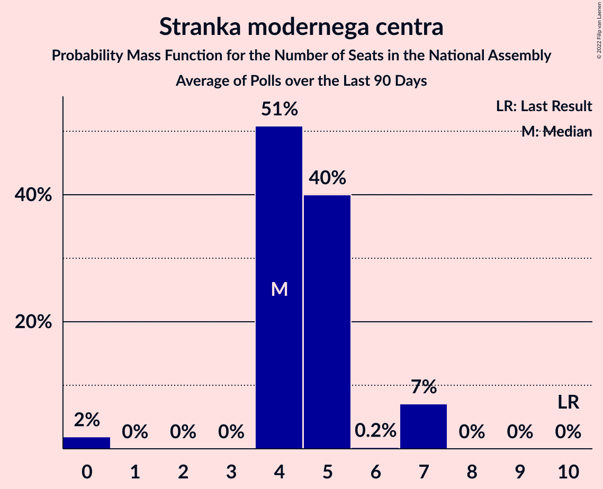

# Poll Average

<a href="#voting-intentions">Voting Intentions</a> | <a href="#seats">Seats</a> | <a href="#coalitions">Coalitions</a> | <a href="#technical-information">Technical Information</a>

## Summary

The table below lists the polls on which the average is based. They are the most recent polls (less than 90 days old) registered and analyzed so far.

| Period     | Polling firm/Commissioner(s) | SDS | LMŠ | SD | SMC | Levica | NSi | PAB | DeSUS | SNS | SLS | GOD–NLS | GOD | NLS | DL | PS | HIM |
|:----------:|:----------------------------:|:--:|:--:|:--:|:--:|:--:|:--:|:--:|:--:|:--:|:--:|:--:|:--:|:--:|:--:|:--:|:--:|
| 3 June 2018 | General Election | 24.9%   25 | 12.6%   13 | 9.9%   10 | 9.7%   10 | 9.3%   9 | 7.2%   7 | 5.1%   5 | 4.9%   5 | 4.2%   4 | 2.6%   0 | 0.2%   0 | 0.2%   0 | 0.2%   0 | 0.0%   0 | 0.0%   0 | 0.0%   2 |
| N/A | Poll Average | 22–31%   20–29 | 12–22%   11–20 | 9–20%   9–18 | 5–9%   4–8 | 7–12%   7–11 | 5–9%   5–8 | 3–8%   0–7 | 2–8%   0–7 | 2–4%   0–4 | 2–4%   0–4 | N/A   N/A | N/A   N/A | N/A   N/A | N/A   N/A | N/A   N/A | N/A   N/A |
| [9–11 October 2018](2018-10-11-Ninamedia.html) | Ninamedia | 21–27%   20–26 | 16–22%   15–21 | 14–20%   13–18 | 4–8%   4–7 | 8–12%   7–12 | 5–9%   5–8 | 3–6%   0–5 | 4–8%   4–7 | 2–5%   0–4 | N/A   N/A | N/A   N/A | N/A   N/A | N/A   N/A | N/A   N/A | N/A   N/A | N/A   N/A |
| [3–11 October 2018](2018-10-11-Mediana.html) | Mediana   Delo | 25–31%   24–30 | 12–17%   11–16 | 9–14%   9–12 | 5–9%   5–8 | 7–11%   6–9 | 5–9%   5–8 | 5–8%   4–7 | 2–5%   0–3 | N/A   N/A | 2–5%   0–4 | N/A   N/A | N/A   N/A | N/A   N/A | N/A   N/A | N/A   N/A | N/A   N/A |
| 3 June 2018 | General Election | 24.9%   25 | 12.6%   13 | 9.9%   10 | 9.7%   10 | 9.3%   9 | 7.2%   7 | 5.1%   5 | 4.9%   5 | 4.2%   4 | 2.6%   0 | 0.2%   0 | 0.2%   0 | 0.2%   0 | 0.0%   0 | 0.0%   0 | 0.0%   2 |

Only polls for which at least the sample size has been published are included in the table above.

**Legend:**
+ **Top half of each row:** Voting intentions (95% confidence interval)
+ **Bottom half of each row:** Seat projections for the National Assembly (95% confidence interval)
+ **SDS:** Slovenska demokratska stranka
+ **LMŠ:** Lista Marjana Šarca
+ **SD:** Socialni demokrati
+ **SMC:** Stranka modernega centra
+ **Levica:** Levica
+ **NSi:** Nova Slovenija–Krščanski demokrati
+ **PAB:** Stranka Alenke Bratušek
+ **DeSUS:** Demokratična stranka upokojencev Slovenije
+ **SNS:** Slovenska nacionalna stranka
+ **SLS:** Slovenska ljudska stranka
+ **GOD–NLS:** Glas za otroke in družine–Nova ljudska stranka Slovenije
+ **GOD:** Glas za otroke in družine
+ **NLS:** Nova ljudska stranka Slovenije
+ **DL:** Državljanska lista
+ **PS:** Pozitivna Slovenija
+ **HIM:** Hungarian and Italian minorities
+ **N/A (single party):** Party not included the published results
+ **N/A (entire row):** Calculation for this opinion poll not started yet

## Voting Intentions

### Confidence Intervals

| Party | Last Result | Median | 80% Confidence Interval | 90% Confidence Interval | 95% Confidence Interval | 99% Confidence Interval |
|:-----:|:-----------:|:------:|:-----------------------:|:-----------------------:|:-----------------------:|:-----------------------:|
| <a href="#slovenska-demokratska-stranka">Slovenska demokratska stranka</a> | 24.9% | 26.0% | 22.7–29.5% |22.0–30.2% | 21.5–30.8% | 20.4–32.0% |
| <a href="#lista-marjana-šarca">Lista Marjana Šarca</a> | 12.6% | 16.5% | 13.1–20.3% |12.5–21.0% | 12.1–21.6% | 11.3–22.7% |
| <a href="#socialni-demokrati">Socialni demokrati</a> | 9.9% | 14.0% | 10.1–18.3% |9.7–18.9% | 9.3–19.5% | 8.6–20.5% |
| <a href="#stranka-modernega-centra">Stranka modernega centra</a> | 9.7% | 6.6% | 5.3–8.0% |5.0–8.5% | 4.7–8.8% | 4.2–9.6% |
| <a href="#levica">Levica</a> | 9.3% | 9.5% | 8.1–11.2% |7.7–11.7% | 7.4–12.1% | 6.8–12.9% |
| <a href="#nova-slovenija–krščanski-demokrati">Nova Slovenija–Krščanski demokrati</a> | 7.2% | 7.1% | 5.9–8.4% |5.6–8.8% | 5.4–9.1% | 4.9–9.8% |
| <a href="#stranka-alenke-bratušek">Stranka Alenke Bratušek</a> | 5.1% | 5.1% | 3.5–6.9% |3.2–7.4% | 3.0–7.7% | 2.6–8.4% |
| <a href="#demokratična-stranka-upokojencev-slovenije">Demokratična stranka upokojencev Slovenije</a> | 4.9% | 4.5% | 2.6–6.9% |2.4–7.3% | 2.2–7.7% | 1.9–8.4% |
| <a href="#slovenska-nacionalna-stranka">Slovenska nacionalna stranka</a> | 4.2% | 3.1% | 2.3–4.0% |2.1–4.3% | 2.0–4.5% | 1.7–5.1% |
| <a href="#slovenska-ljudska-stranka">Slovenska ljudska stranka</a> | 2.6% | 3.1% | 2.4–4.0% |2.2–4.3% | 2.0–4.5% | 1.7–5.1% |
| <a href="#glas-za-otroke-in-družine–nova-ljudska-stranka-slovenije">Glas za otroke in družine–Nova ljudska stranka Slovenije</a> | 0.2% | N/A | N/A |N/A | N/A | N/A |
| <a href="#glas-za-otroke-in-družine">Glas za otroke in družine</a> | 0.2% | N/A | N/A |N/A | N/A | N/A |
| <a href="#nova-ljudska-stranka-slovenije">Nova ljudska stranka Slovenije</a> | 0.2% | N/A | N/A |N/A | N/A | N/A |
| <a href="#državljanska-lista">Državljanska lista</a> | 0.0% | N/A | N/A |N/A | N/A | N/A |
| <a href="#pozitivna-slovenija">Pozitivna Slovenija</a> | 0.0% | N/A | N/A |N/A | N/A | N/A |
| <a href="#hungarian-and-italian-minorities">Hungarian and Italian minorities</a> | 0.0% | N/A | N/A |N/A | N/A | N/A |

### Slovenska demokratska stranka

*For a full overview of the results for this party, see the [Slovenska demokratska stranka](party-slovenskademokratskastranka.html) page.*

| Voting Intentions | Probability | Accumulated | Special Marks |
|:-----------------:|:-----------:|:-----------:|:-------------:|
| 17.5–18.5% | 0% | 100% |  |
| 18.5–19.5% | 0.1% | 100% |  |
| 19.5–20.5% | 0.5% | 99.9% |  |
| 20.5–21.5% | 2% | 99.4% |  |
| 21.5–22.5% | 6% | 97% |  |
| 22.5–23.5% | 10% | 91% |  |
| 23.5–24.5% | 13% | 81% |  |
| 24.5–25.5% | 12% | 68% | Last Result |
| 25.5–26.5% | 12% | 56% | Median |
| 26.5–27.5% | 12% | 44% |  |
| 27.5–28.5% | 12% | 32% |  |
| 28.5–29.5% | 10% | 19% |  |
| 29.5–30.5% | 6% | 9% |  |
| 30.5–31.5% | 3% | 3% |  |
| 31.5–32.5% | 0.8% | 1.0% |  |
| 32.5–33.5% | 0.2% | 0.2% |  |
| 33.5–34.5% | 0% | 0% |  |

### Lista Marjana Šarca

*For a full overview of the results for this party, see the [Lista Marjana Šarca](party-listamarjanašarca.html) page.*

| Voting Intentions | Probability | Accumulated | Special Marks |
|:-----------------:|:-----------:|:-----------:|:-------------:|
| 9.5–10.5% | 0.1% | 100% |  |
| 10.5–11.5% | 0.8% | 99.9% |  |
| 11.5–12.5% | 4% | 99.1% |  |
| 12.5–13.5% | 11% | 95% | Last Result |
| 13.5–14.5% | 15% | 84% |  |
| 14.5–15.5% | 12% | 69% |  |
| 15.5–16.5% | 7% | 57% |  |
| 16.5–17.5% | 7% | 50% | Median |
| 17.5–18.5% | 11% | 43% |  |
| 18.5–19.5% | 13% | 32% |  |
| 19.5–20.5% | 10% | 18% |  |
| 20.5–21.5% | 6% | 8% |  |
| 21.5–22.5% | 2% | 3% |  |
| 22.5–23.5% | 0.5% | 0.6% |  |
| 23.5–24.5% | 0.1% | 0.1% |  |
| 24.5–25.5% | 0% | 0% |  |

### Socialni demokrati

*For a full overview of the results for this party, see the [Socialni demokrati](party-socialnidemokrati.html) page.*

| Voting Intentions | Probability | Accumulated | Special Marks |
|:-----------------:|:-----------:|:-----------:|:-------------:|
| 6.5–7.5% | 0% | 100% |  |
| 7.5–8.5% | 0.4% | 100% |  |
| 8.5–9.5% | 4% | 99.6% |  |
| 9.5–10.5% | 12% | 96% | Last Result |
| 10.5–11.5% | 17% | 84% |  |
| 11.5–12.5% | 12% | 68% |  |
| 12.5–13.5% | 5% | 56% |  |
| 13.5–14.5% | 2% | 51% | Median |
| 14.5–15.5% | 5% | 49% |  |
| 15.5–16.5% | 11% | 43% |  |
| 16.5–17.5% | 14% | 32% |  |
| 17.5–18.5% | 11% | 18% |  |
| 18.5–19.5% | 5% | 8% |  |
| 19.5–20.5% | 2% | 2% |  |
| 20.5–21.5% | 0.4% | 0.5% |  |
| 21.5–22.5% | 0.1% | 0.1% |  |
| 22.5–23.5% | 0% | 0% |  |

### Stranka modernega centra

*For a full overview of the results for this party, see the [Stranka modernega centra](party-strankamodernegacentra.html) page.*

| Voting Intentions | Probability | Accumulated | Special Marks |
|:-----------------:|:-----------:|:-----------:|:-------------:|
| 2.5–3.5% | 0% | 100% |  |
| 3.5–4.5% | 2% | 100% |  |
| 4.5–5.5% | 14% | 98% |  |
| 5.5–6.5% | 33% | 85% |  |
| 6.5–7.5% | 32% | 52% | Median |
| 7.5–8.5% | 15% | 20% |  |
| 8.5–9.5% | 4% | 4% |  |
| 9.5–10.5% | 0.5% | 0.5% | Last Result |
| 10.5–11.5% | 0% | 0% |  |

### Levica

*For a full overview of the results for this party, see the [Levica](party-levica.html) page.*

| Voting Intentions | Probability | Accumulated | Special Marks |
|:-----------------:|:-----------:|:-----------:|:-------------:|
| 4.5–5.5% | 0% | 100% |  |
| 5.5–6.5% | 0.3% | 100% |  |
| 6.5–7.5% | 4% | 99.7% |  |
| 7.5–8.5% | 16% | 96% |  |
| 8.5–9.5% | 30% | 80% | Last Result |
| 9.5–10.5% | 28% | 50% | Median |
| 10.5–11.5% | 15% | 21% |  |
| 11.5–12.5% | 5% | 6% |  |
| 12.5–13.5% | 1.0% | 1.1% |  |
| 13.5–14.5% | 0.1% | 0.1% |  |
| 14.5–15.5% | 0% | 0% |  |

### Nova Slovenija–Krščanski demokrati

*For a full overview of the results for this party, see the [Nova Slovenija–Krščanski demokrati](party-novaslovenija–krščanskidemokrati.html) page.*

| Voting Intentions | Probability | Accumulated | Special Marks |
|:-----------------:|:-----------:|:-----------:|:-------------:|
| 2.5–3.5% | 0% | 100% |  |
| 3.5–4.5% | 0.1% | 100% |  |
| 4.5–5.5% | 4% | 99.9% |  |
| 5.5–6.5% | 24% | 96% |  |
| 6.5–7.5% | 40% | 72% | Last Result, Median |
| 7.5–8.5% | 25% | 32% |  |
| 8.5–9.5% | 7% | 8% |  |
| 9.5–10.5% | 0.9% | 1.0% |  |
| 10.5–11.5% | 0.1% | 0.1% |  |
| 11.5–12.5% | 0% | 0% |  |

### Stranka Alenke Bratušek

*For a full overview of the results for this party, see the [Stranka Alenke Bratušek](party-strankaalenkebratušek.html) page.*

| Voting Intentions | Probability | Accumulated | Special Marks |
|:-----------------:|:-----------:|:-----------:|:-------------:|
| 0.5–1.5% | 0% | 100% |  |
| 1.5–2.5% | 0.4% | 100% |  |
| 2.5–3.5% | 11% | 99.6% |  |
| 3.5–4.5% | 26% | 89% |  |
| 4.5–5.5% | 23% | 62% | Last Result, Median |
| 5.5–6.5% | 23% | 40% |  |
| 6.5–7.5% | 13% | 17% |  |
| 7.5–8.5% | 3% | 4% |  |
| 8.5–9.5% | 0.4% | 0.4% |  |
| 9.5–10.5% | 0% | 0% |  |

### Demokratična stranka upokojencev Slovenije

*For a full overview of the results for this party, see the [Demokratična stranka upokojencev Slovenije](party-demokratičnastrankaupokojencevslovenije.html) page.*

| Voting Intentions | Probability | Accumulated | Special Marks |
|:-----------------:|:-----------:|:-----------:|:-------------:|
| 0.5–1.5% | 0.1% | 100% |  |
| 1.5–2.5% | 8% | 99.9% |  |
| 2.5–3.5% | 28% | 91% |  |
| 3.5–4.5% | 13% | 63% |  |
| 4.5–5.5% | 13% | 50% | Last Result, Median |
| 5.5–6.5% | 21% | 37% |  |
| 6.5–7.5% | 12% | 15% |  |
| 7.5–8.5% | 3% | 3% |  |
| 8.5–9.5% | 0.3% | 0.4% |  |
| 9.5–10.5% | 0% | 0% |  |

### Slovenska nacionalna stranka

*For a full overview of the results for this party, see the [Slovenska nacionalna stranka](party-slovenskanacionalnastranka.html) page.*

| Voting Intentions | Probability | Accumulated | Special Marks |
|:-----------------:|:-----------:|:-----------:|:-------------:|
| 0.0–0.5% | 0% | 100% |  |
| 0.5–1.5% | 0.2% | 100% |  |
| 1.5–2.5% | 19% | 99.8% |  |
| 2.5–3.5% | 56% | 81% | Median |
| 3.5–4.5% | 23% | 25% | Last Result |
| 4.5–5.5% | 2% | 2% |  |
| 5.5–6.5% | 0.1% | 0.1% |  |
| 6.5–7.5% | 0% | 0% |  |

### Slovenska ljudska stranka

*For a full overview of the results for this party, see the [Slovenska ljudska stranka](party-slovenskaljudskastranka.html) page.*

| Voting Intentions | Probability | Accumulated | Special Marks |
|:-----------------:|:-----------:|:-----------:|:-------------:|
| 0.0–0.5% | 0% | 100% |  |
| 0.5–1.5% | 0.1% | 100% |  |
| 1.5–2.5% | 17% | 99.9% |  |
| 2.5–3.5% | 57% | 83% | Last Result, Median |
| 3.5–4.5% | 24% | 26% |  |
| 4.5–5.5% | 2% | 2% |  |
| 5.5–6.5% | 0.1% | 0.1% |  |
| 6.5–7.5% | 0% | 0% |  |

## Seats

### Confidence Intervals

| Party | Last Result | Median | 80% Confidence Interval | 90% Confidence Interval | 95% Confidence Interval | 99% Confidence Interval |
|:-----:|:-----------:|:------:|:-----------------------:|:-----------------------:|:-----------------------:|:-----------------------:|
| <a href="#slovenska-demokratska-stranka">Slovenska demokratska stranka</a> | 25 | 25 | 21–27 |20–28 | 20–29 | 19–30 |
| <a href="#lista-marjana-šarca">Lista Marjana Šarca</a> | 13 | 16 | 12–18 |11–20 | 11–20 | 11–21 |
| <a href="#socialni-demokrati">Socialni demokrati</a> | 10 | 13 | 10–17 |9–18 | 9–18 | 8–19 |
| <a href="#stranka-modernega-centra">Stranka modernega centra</a> | 10 | 6 | 5–7 |4–8 | 4–8 | 4–9 |
| <a href="#levica">Levica</a> | 9 | 8 | 7–10 |7–11 | 7–11 | 6–12 |
| <a href="#nova-slovenija–krščanski-demokrati">Nova Slovenija–Krščanski demokrati</a> | 7 | 7 | 5–7 |5–8 | 5–8 | 4–9 |
| <a href="#stranka-alenke-bratušek">Stranka Alenke Bratušek</a> | 5 | 5 | 0–6 |0–7 | 0–7 | 0–7 |
| <a href="#demokratična-stranka-upokojencev-slovenije">Demokratična stranka upokojencev Slovenije</a> | 5 | 3 | 0–6 |0–6 | 0–7 | 0–8 |
| <a href="#slovenska-nacionalna-stranka">Slovenska nacionalna stranka</a> | 4 | 0 | 0 |0–4 | 0–4 | 0–4 |
| <a href="#slovenska-ljudska-stranka">Slovenska ljudska stranka</a> | 0 | 0 | 0 |0–4 | 0–4 | 0–4 |
| <a href="#glas-za-otroke-in-družine–nova-ljudska-stranka-slovenije">Glas za otroke in družine–Nova ljudska stranka Slovenije</a> | 0 | N/A | N/A |N/A | N/A | N/A |
| <a href="#glas-za-otroke-in-družine">Glas za otroke in družine</a> | 0 | N/A | N/A |N/A | N/A | N/A |
| <a href="#nova-ljudska-stranka-slovenije">Nova ljudska stranka Slovenije</a> | 0 | N/A | N/A |N/A | N/A | N/A |
| <a href="#državljanska-lista">Državljanska lista</a> | 0 | N/A | N/A |N/A | N/A | N/A |
| <a href="#pozitivna-slovenija">Pozitivna Slovenija</a> | 0 | N/A | N/A |N/A | N/A | N/A |
| <a href="#hungarian-and-italian-minorities">Hungarian and Italian minorities</a> | 2 | N/A | N/A |N/A | N/A | N/A |

### Slovenska demokratska stranka

*For a full overview of the results for this party, see the [Slovenska demokratska stranka](party-slovenskademokratskastranka.html) page.*

| Number of Seats | Probability | Accumulated | Special Marks |
|:---------------:|:-----------:|:-----------:|:-------------:|
| 18 | 0.4% | 100% |  |
| 19 | 0.3% | 99.6% |  |
| 20 | 5% | 99.2% |  |
| 21 | 4% | 94% |  |
| 22 | 16% | 90% |  |
| 23 | 12% | 74% |  |
| 24 | 7% | 62% |  |
| 25 | 11% | 54% | Last Result, Median |
| 26 | 17% | 43% |  |
| 27 | 20% | 26% |  |
| 28 | 4% | 6% |  |
| 29 | 0.8% | 3% |  |
| 30 | 2% | 2% |  |
| 31 | 0.2% | 0.2% |  |
| 32 | 0.1% | 0.1% |  |
| 33 | 0% | 0% |  |

### Lista Marjana Šarca

*For a full overview of the results for this party, see the [Lista Marjana Šarca](party-listamarjanašarca.html) page.*

| Number of Seats | Probability | Accumulated | Special Marks |
|:---------------:|:-----------:|:-----------:|:-------------:|
| 10 | 0.4% | 100% |  |
| 11 | 5% | 99.6% |  |
| 12 | 29% | 94% |  |
| 13 | 7% | 66% | Last Result |
| 14 | 0.9% | 59% |  |
| 15 | 7% | 58% |  |
| 16 | 16% | 50% | Median |
| 17 | 7% | 34% |  |
| 18 | 18% | 27% |  |
| 19 | 2% | 9% |  |
| 20 | 5% | 7% |  |
| 21 | 1.2% | 2% |  |
| 22 | 0.3% | 0.4% |  |
| 23 | 0% | 0.1% |  |
| 24 | 0% | 0% |  |

### Socialni demokrati

*For a full overview of the results for this party, see the [Socialni demokrati](party-socialnidemokrati.html) page.*

| Number of Seats | Probability | Accumulated | Special Marks |
|:---------------:|:-----------:|:-----------:|:-------------:|
| 7 | 0.1% | 100% |  |
| 8 | 0.8% | 99.9% |  |
| 9 | 5% | 99.2% |  |
| 10 | 17% | 94% | Last Result |
| 11 | 25% | 77% |  |
| 12 | 1.3% | 52% |  |
| 13 | 2% | 51% | Median |
| 14 | 3% | 49% |  |
| 15 | 5% | 46% |  |
| 16 | 12% | 41% |  |
| 17 | 22% | 29% |  |
| 18 | 6% | 7% |  |
| 19 | 0.7% | 0.9% |  |
| 20 | 0.1% | 0.2% |  |
| 21 | 0.1% | 0.1% |  |
| 22 | 0% | 0% |  |

### Stranka modernega centra

*For a full overview of the results for this party, see the [Stranka modernega centra](party-strankamodernegacentra.html) page.*

| Number of Seats | Probability | Accumulated | Special Marks |
|:---------------:|:-----------:|:-----------:|:-------------:|
| 0 | 0.2% | 100% |  |
| 1 | 0% | 99.8% |  |
| 2 | 0% | 99.8% |  |
| 3 | 0% | 99.8% |  |
| 4 | 6% | 99.7% |  |
| 5 | 21% | 94% |  |
| 6 | 26% | 73% | Median |
| 7 | 38% | 46% |  |
| 8 | 8% | 8% |  |
| 9 | 0.5% | 0.6% |  |
| 10 | 0.1% | 0.1% | Last Result |
| 11 | 0% | 0% |  |

### Levica

*For a full overview of the results for this party, see the [Levica](party-levica.html) page.*

| Number of Seats | Probability | Accumulated | Special Marks |
|:---------------:|:-----------:|:-----------:|:-------------:|
| 6 | 2% | 100% |  |
| 7 | 9% | 98% |  |
| 8 | 44% | 90% | Median |
| 9 | 34% | 45% | Last Result |
| 10 | 6% | 11% |  |
| 11 | 4% | 5% |  |
| 12 | 0.9% | 1.4% |  |
| 13 | 0.4% | 0.4% |  |
| 14 | 0% | 0% |  |

### Nova Slovenija–Krščanski demokrati

*For a full overview of the results for this party, see the [Nova Slovenija–Krščanski demokrati](party-novaslovenija–krščanskidemokrati.html) page.*

| Number of Seats | Probability | Accumulated | Special Marks |
|:---------------:|:-----------:|:-----------:|:-------------:|
| 4 | 1.3% | 100% |  |
| 5 | 10% | 98.7% |  |
| 6 | 37% | 88% |  |
| 7 | 43% | 51% | Last Result, Median |
| 8 | 7% | 8% |  |
| 9 | 1.0% | 1.2% |  |
| 10 | 0.2% | 0.2% |  |
| 11 | 0% | 0% |  |

### Stranka Alenke Bratušek

*For a full overview of the results for this party, see the [Stranka Alenke Bratušek](party-strankaalenkebratušek.html) page.*

| Number of Seats | Probability | Accumulated | Special Marks |
|:---------------:|:-----------:|:-----------:|:-------------:|
| 0 | 22% | 100% |  |
| 1 | 0% | 78% |  |
| 2 | 0% | 78% |  |
| 3 | 1.1% | 78% |  |
| 4 | 26% | 77% |  |
| 5 | 31% | 51% | Last Result, Median |
| 6 | 12% | 20% |  |
| 7 | 8% | 8% |  |
| 8 | 0.3% | 0.3% |  |
| 9 | 0% | 0% |  |

### Demokratična stranka upokojencev Slovenije

*For a full overview of the results for this party, see the [Demokratična stranka upokojencev Slovenije](party-demokratičnastrankaupokojencevslovenije.html) page.*

| Number of Seats | Probability | Accumulated | Special Marks |
|:---------------:|:-----------:|:-----------:|:-------------:|
| 0 | 43% | 100% |  |
| 1 | 0% | 57% |  |
| 2 | 0% | 57% |  |
| 3 | 7% | 57% | Median |
| 4 | 6% | 50% |  |
| 5 | 22% | 44% | Last Result |
| 6 | 18% | 22% |  |
| 7 | 4% | 5% |  |
| 8 | 0.6% | 0.7% |  |
| 9 | 0% | 0% |  |

### Slovenska nacionalna stranka

*For a full overview of the results for this party, see the [Slovenska nacionalna stranka](party-slovenskanacionalnastranka.html) page.*

| Number of Seats | Probability | Accumulated | Special Marks |
|:---------------:|:-----------:|:-----------:|:-------------:|
| 0 | 90% | 100% | Median |
| 1 | 0% | 10% |  |
| 2 | 0% | 10% |  |
| 3 | 2% | 10% |  |
| 4 | 7% | 8% | Last Result |
| 5 | 0.5% | 0.5% |  |
| 6 | 0% | 0% |  |

### Slovenska ljudska stranka

*For a full overview of the results for this party, see the [Slovenska ljudska stranka](party-slovenskaljudskastranka.html) page.*

| Number of Seats | Probability | Accumulated | Special Marks |
|:---------------:|:-----------:|:-----------:|:-------------:|
| 0 | 92% | 100% | Last Result, Median |
| 1 | 0% | 8% |  |
| 2 | 0% | 8% |  |
| 3 | 1.2% | 8% |  |
| 4 | 7% | 7% |  |
| 5 | 0.1% | 0.1% |  |
| 6 | 0% | 0% |  |

## Coalitions

### Confidence Intervals

| Coalition | Last Result | Median | Majority? | 80% Confidence Interval | 90% Confidence Interval | 95% Confidence Interval | 99% Confidence Interval |
|:---------:|:-----------:|:------:|:---------:|:-----------------------:|:-----------------------:|:-----------------------:|:-----------------------:|
| Lista Marjana Šarca – Socialni demokrati – Stranka modernega centra – Nova Slovenija–Krščanski demokrati – Stranka Alenke Bratušek – Demokratična stranka upokojencev Slovenije | 50 | 47 | 51% | 42–56 | 40–57 | 38–58 | 38–59 |
| Lista Marjana Šarca – Socialni demokrati – Stranka modernega centra – Nova Slovenija–Krščanski demokrati – Demokratična stranka upokojencev Slovenije | 45 | 43 | 50% | 36–53 | 35–55 | 33–56 | 32–58 |
| Lista Marjana Šarca – Socialni demokrati – Stranka modernega centra – Stranka Alenke Bratušek – Demokratična stranka upokojencev Slovenije | 43 | 41 | 43% | 35–49 | 33–50 | 33–51 | 31–52 |
| Lista Marjana Šarca – Socialni demokrati – Stranka modernega centra – Nova Slovenija–Krščanski demokrati | 40 | 40 | 31% | 35–48 | 34–49 | 33–50 | 32–52 |
| Lista Marjana Šarca – Socialni demokrati – Nova Slovenija–Krščanski demokrati – Demokratična stranka upokojencev Slovenije | 35 | 37 | 31% | 28–48 | 28–49 | 27–50 | 26–52 |
| Slovenska demokratska stranka – Lista Marjana Šarca – Demokratična stranka upokojencev Slovenije | 43 | 42 | 17% | 38–48 | 37–49 | 36–49 | 36–51 |
| Lista Marjana Šarca – Socialni demokrati – Stranka modernega centra – Demokratična stranka upokojencev Slovenije | 38 | 36 | 21% | 29–47 | 28–47 | 28–49 | 26–51 |
| Lista Marjana Šarca – Socialni demokrati – Nova Slovenija–Krščanski demokrati | 30 | 34 | 0.7% | 28–42 | 28–43 | 27–45 | 26–46 |
| Slovenska demokratska stranka – Lista Marjana Šarca | 38 | 39 | 0.8% | 38–42 | 37–43 | 36–44 | 35–46 |
| Lista Marjana Šarca – Socialni demokrati – Demokratična stranka upokojencev Slovenije | 28 | 31 | 0.5% | 22–41 | 22–42 | 21–44 | 20–46 |
| Lista Marjana Šarca – Socialni demokrati – Stranka modernega centra | 33 | 34 | 0.1% | 28–42 | 28–42 | 27–43 | 26–44 |
| Slovenska demokratska stranka – Nova Slovenija–Krščanski demokrati – Demokratična stranka upokojencev Slovenije – Slovenska ljudska stranka – Državljanska lista | 37 | 34 | 0% | 31–37 | 31–38 | 30–39 | 29–39 |
| Lista Marjana Šarca – Socialni demokrati | 23 | 28 | 0% | 22–35 | 21–36 | 21–38 | 20–39 |
| Socialni demokrati – Stranka modernega centra – Demokratična stranka upokojencev Slovenije | 25 | 21 | 0% | 16–29 | 16–29 | 15–30 | 14–32 |
| Socialni demokrati – Stranka modernega centra – Pozitivna Slovenija | 20 | 19 | 0% | 16–24 | 16–24 | 15–24 | 14–25 |
| Socialni demokrati – Demokratična stranka upokojencev Slovenije – Državljanska lista – Pozitivna Slovenija | 15 | 16 | 0% | 10–23 | 9–23 | 9–24 | 8–26 |

### Lista Marjana Šarca – Socialni demokrati – Stranka modernega centra – Nova Slovenija–Krščanski demokrati – Stranka Alenke Bratušek – Demokratična stranka upokojencev Slovenije

| Number of Seats | Probability | Accumulated | Special Marks |
|:---------------:|:-----------:|:-----------:|:-------------:|
| 36 | 0% | 100% |  |
| 37 | 0.4% | 99.9% |  |
| 38 | 2% | 99.6% |  |
| 39 | 1.3% | 97% |  |
| 40 | 3% | 96% |  |
| 41 | 2% | 93% |  |
| 42 | 24% | 92% |  |
| 43 | 7% | 68% |  |
| 44 | 7% | 62% |  |
| 45 | 4% | 54% |  |
| 46 | 0.7% | 51% | Majority |
| 47 | 0.3% | 50% |  |
| 48 | 0.7% | 50% |  |
| 49 | 0.8% | 49% |  |
| 50 | 2% | 48% | Last Result, Median |
| 51 | 3% | 47% |  |
| 52 | 4% | 44% |  |
| 53 | 19% | 40% |  |
| 54 | 4% | 21% |  |
| 55 | 2% | 17% |  |
| 56 | 8% | 14% |  |
| 57 | 3% | 6% |  |
| 58 | 2% | 4% |  |
| 59 | 1.4% | 1.5% |  |
| 60 | 0.1% | 0.1% |  |
| 61 | 0% | 0% |  |

### Lista Marjana Šarca – Socialni demokrati – Stranka modernega centra – Nova Slovenija–Krščanski demokrati – Demokratična stranka upokojencev Slovenije

| Number of Seats | Probability | Accumulated | Special Marks |
|:---------------:|:-----------:|:-----------:|:-------------:|
| 31 | 0.2% | 100% |  |
| 32 | 0.8% | 99.8% |  |
| 33 | 3% | 99.1% |  |
| 34 | 1.2% | 96% |  |
| 35 | 5% | 95% |  |
| 36 | 8% | 90% |  |
| 37 | 18% | 83% |  |
| 38 | 6% | 65% |  |
| 39 | 5% | 58% |  |
| 40 | 3% | 53% |  |
| 41 | 0.3% | 50% |  |
| 42 | 0.1% | 50% |  |
| 43 | 0% | 50% |  |
| 44 | 0.1% | 50% |  |
| 45 | 0.1% | 50% | Last Result, Median |
| 46 | 1.1% | 50% | Majority |
| 47 | 2% | 49% |  |
| 48 | 3% | 47% |  |
| 49 | 9% | 44% |  |
| 50 | 3% | 36% |  |
| 51 | 4% | 32% |  |
| 52 | 8% | 28% |  |
| 53 | 14% | 20% |  |
| 54 | 1.1% | 6% |  |
| 55 | 2% | 5% |  |
| 56 | 0.4% | 3% |  |
| 57 | 1.5% | 2% |  |
| 58 | 0.6% | 0.7% |  |
| 59 | 0.1% | 0.1% |  |
| 60 | 0% | 0% |  |

### Lista Marjana Šarca – Socialni demokrati – Stranka modernega centra – Stranka Alenke Bratušek – Demokratična stranka upokojencev Slovenije

| Number of Seats | Probability | Accumulated | Special Marks |
|:---------------:|:-----------:|:-----------:|:-------------:|
| 30 | 0.1% | 100% |  |
| 31 | 0.5% | 99.9% |  |
| 32 | 1.2% | 99.4% |  |
| 33 | 4% | 98% |  |
| 34 | 2% | 95% |  |
| 35 | 14% | 92% |  |
| 36 | 14% | 78% |  |
| 37 | 6% | 64% |  |
| 38 | 5% | 58% |  |
| 39 | 3% | 54% |  |
| 40 | 0.5% | 51% |  |
| 41 | 0.3% | 50% |  |
| 42 | 0.9% | 50% |  |
| 43 | 1.5% | 49% | Last Result, Median |
| 44 | 1.3% | 47% |  |
| 45 | 3% | 46% |  |
| 46 | 7% | 43% | Majority |
| 47 | 16% | 35% |  |
| 48 | 3% | 19% |  |
| 49 | 8% | 16% |  |
| 50 | 4% | 8% |  |
| 51 | 3% | 4% |  |
| 52 | 1.1% | 1.2% |  |
| 53 | 0.1% | 0.1% |  |
| 54 | 0% | 0% |  |

### Lista Marjana Šarca – Socialni demokrati – Stranka modernega centra – Nova Slovenija–Krščanski demokrati

| Number of Seats | Probability | Accumulated | Special Marks |
|:---------------:|:-----------:|:-----------:|:-------------:|
| 31 | 0.2% | 100% |  |
| 32 | 0.9% | 99.8% |  |
| 33 | 3% | 98.8% |  |
| 34 | 5% | 96% |  |
| 35 | 6% | 91% |  |
| 36 | 9% | 85% |  |
| 37 | 15% | 76% |  |
| 38 | 5% | 61% |  |
| 39 | 4% | 56% |  |
| 40 | 2% | 52% | Last Result |
| 41 | 1.0% | 50% |  |
| 42 | 1.4% | 49% | Median |
| 43 | 7% | 47% |  |
| 44 | 6% | 41% |  |
| 45 | 4% | 35% |  |
| 46 | 8% | 31% | Majority |
| 47 | 3% | 22% |  |
| 48 | 13% | 19% |  |
| 49 | 2% | 6% |  |
| 50 | 2% | 4% |  |
| 51 | 0.6% | 1.1% |  |
| 52 | 0.3% | 0.5% |  |
| 53 | 0.1% | 0.2% |  |
| 54 | 0.1% | 0.1% |  |
| 55 | 0% | 0% |  |

### Lista Marjana Šarca – Socialni demokrati – Nova Slovenija–Krščanski demokrati – Demokratična stranka upokojencev Slovenije

| Number of Seats | Probability | Accumulated | Special Marks |
|:---------------:|:-----------:|:-----------:|:-------------:|
| 25 | 0.2% | 100% |  |
| 26 | 1.1% | 99.8% |  |
| 27 | 2% | 98.7% |  |
| 28 | 9% | 97% |  |
| 29 | 4% | 88% |  |
| 30 | 18% | 84% |  |
| 31 | 2% | 66% |  |
| 32 | 7% | 63% |  |
| 33 | 5% | 57% |  |
| 34 | 2% | 52% |  |
| 35 | 0.2% | 50% | Last Result |
| 36 | 0% | 50% |  |
| 37 | 0% | 50% |  |
| 38 | 0% | 50% |  |
| 39 | 0% | 50% | Median |
| 40 | 0.2% | 50% |  |
| 41 | 1.1% | 50% |  |
| 42 | 1.4% | 49% |  |
| 43 | 7% | 47% |  |
| 44 | 6% | 40% |  |
| 45 | 3% | 34% |  |
| 46 | 17% | 31% | Majority |
| 47 | 4% | 14% |  |
| 48 | 5% | 10% |  |
| 49 | 2% | 5% |  |
| 50 | 0.5% | 3% |  |
| 51 | 0.1% | 2% |  |
| 52 | 2% | 2% |  |
| 53 | 0.2% | 0.2% |  |
| 54 | 0% | 0% |  |

### Slovenska demokratska stranka – Lista Marjana Šarca – Demokratična stranka upokojencev Slovenije

| Number of Seats | Probability | Accumulated | Special Marks |
|:---------------:|:-----------:|:-----------:|:-------------:|
| 34 | 0% | 100% |  |
| 35 | 0.1% | 99.9% |  |
| 36 | 3% | 99.8% |  |
| 37 | 2% | 97% |  |
| 38 | 7% | 95% |  |
| 39 | 18% | 88% |  |
| 40 | 6% | 70% |  |
| 41 | 5% | 64% |  |
| 42 | 11% | 59% |  |
| 43 | 6% | 48% | Last Result |
| 44 | 6% | 43% | Median |
| 45 | 20% | 37% |  |
| 46 | 4% | 17% | Majority |
| 47 | 3% | 13% |  |
| 48 | 4% | 10% |  |
| 49 | 4% | 6% |  |
| 50 | 0.8% | 2% |  |
| 51 | 0.9% | 1.3% |  |
| 52 | 0.3% | 0.4% |  |
| 53 | 0.1% | 0.1% |  |
| 54 | 0% | 0% |  |

### Lista Marjana Šarca – Socialni demokrati – Stranka modernega centra – Demokratična stranka upokojencev Slovenije

| Number of Seats | Probability | Accumulated | Special Marks |
|:---------------:|:-----------:|:-----------:|:-------------:|
| 24 | 0.1% | 100% |  |
| 25 | 0.1% | 99.9% |  |
| 26 | 1.4% | 99.8% |  |
| 27 | 0.8% | 98% |  |
| 28 | 4% | 98% |  |
| 29 | 7% | 93% |  |
| 30 | 16% | 87% |  |
| 31 | 9% | 70% |  |
| 32 | 5% | 61% |  |
| 33 | 4% | 56% |  |
| 34 | 1.4% | 52% |  |
| 35 | 0.2% | 50% |  |
| 36 | 0.1% | 50% |  |
| 37 | 0% | 50% |  |
| 38 | 0% | 50% | Last Result, Median |
| 39 | 0.3% | 50% |  |
| 40 | 0.8% | 50% |  |
| 41 | 0.8% | 49% |  |
| 42 | 8% | 48% |  |
| 43 | 6% | 40% |  |
| 44 | 2% | 34% |  |
| 45 | 11% | 32% |  |
| 46 | 4% | 21% | Majority |
| 47 | 13% | 17% |  |
| 48 | 1.4% | 4% |  |
| 49 | 0.7% | 3% |  |
| 50 | 2% | 2% |  |
| 51 | 0.1% | 0.6% |  |
| 52 | 0.4% | 0.4% |  |
| 53 | 0% | 0% |  |

### Lista Marjana Šarca – Socialni demokrati – Nova Slovenija–Krščanski demokrati

| Number of Seats | Probability | Accumulated | Special Marks |
|:---------------:|:-----------:|:-----------:|:-------------:|
| 25 | 0.2% | 100% |  |
| 26 | 1.2% | 99.8% |  |
| 27 | 2% | 98.6% |  |
| 28 | 10% | 96% |  |
| 29 | 8% | 86% |  |
| 30 | 20% | 78% | Last Result |
| 31 | 1.0% | 59% |  |
| 32 | 3% | 58% |  |
| 33 | 3% | 54% |  |
| 34 | 1.5% | 51% |  |
| 35 | 0.6% | 50% |  |
| 36 | 0.7% | 49% | Median |
| 37 | 3% | 49% |  |
| 38 | 9% | 46% |  |
| 39 | 1.3% | 36% |  |
| 40 | 10% | 35% |  |
| 41 | 13% | 25% |  |
| 42 | 2% | 12% |  |
| 43 | 6% | 10% |  |
| 44 | 0.9% | 3% |  |
| 45 | 2% | 3% |  |
| 46 | 0.4% | 0.7% | Majority |
| 47 | 0.2% | 0.3% |  |
| 48 | 0% | 0.1% |  |
| 49 | 0.1% | 0.1% |  |
| 50 | 0% | 0% |  |

### Slovenska demokratska stranka – Lista Marjana Šarca

| Number of Seats | Probability | Accumulated | Special Marks |
|:---------------:|:-----------:|:-----------:|:-------------:|
| 34 | 0.1% | 100% |  |
| 35 | 0.6% | 99.9% |  |
| 36 | 4% | 99.3% |  |
| 37 | 5% | 95% |  |
| 38 | 15% | 90% | Last Result |
| 39 | 31% | 75% |  |
| 40 | 19% | 44% |  |
| 41 | 8% | 25% | Median |
| 42 | 10% | 17% |  |
| 43 | 4% | 7% |  |
| 44 | 1.5% | 3% |  |
| 45 | 1.0% | 2% |  |
| 46 | 0.5% | 0.8% | Majority |
| 47 | 0.2% | 0.3% |  |
| 48 | 0% | 0% |  |

### Lista Marjana Šarca – Socialni demokrati – Demokratična stranka upokojencev Slovenije

| Number of Seats | Probability | Accumulated | Special Marks |
|:---------------:|:-----------:|:-----------:|:-------------:|
| 19 | 0.4% | 100% |  |
| 20 | 0.5% | 99.6% |  |
| 21 | 4% | 99.1% |  |
| 22 | 10% | 95% |  |
| 23 | 18% | 85% |  |
| 24 | 2% | 67% |  |
| 25 | 2% | 65% |  |
| 26 | 9% | 64% |  |
| 27 | 4% | 54% |  |
| 28 | 0.1% | 50% | Last Result |
| 29 | 0% | 50% |  |
| 30 | 0.1% | 50% |  |
| 31 | 0% | 50% |  |
| 32 | 0% | 50% | Median |
| 33 | 0.2% | 50% |  |
| 34 | 0% | 50% |  |
| 35 | 0.7% | 50% |  |
| 36 | 2% | 49% |  |
| 37 | 10% | 47% |  |
| 38 | 4% | 36% |  |
| 39 | 8% | 33% |  |
| 40 | 14% | 25% |  |
| 41 | 5% | 11% |  |
| 42 | 3% | 6% |  |
| 43 | 0.7% | 3% |  |
| 44 | 0.6% | 3% |  |
| 45 | 1.4% | 2% |  |
| 46 | 0.4% | 0.5% | Majority |
| 47 | 0.1% | 0.1% |  |
| 48 | 0% | 0% |  |

### Lista Marjana Šarca – Socialni demokrati – Stranka modernega centra

| Number of Seats | Probability | Accumulated | Special Marks |
|:---------------:|:-----------:|:-----------:|:-------------:|
| 24 | 0.1% | 100% |  |
| 25 | 0.2% | 99.9% |  |
| 26 | 2% | 99.8% |  |
| 27 | 0.9% | 98% |  |
| 28 | 8% | 97% |  |
| 29 | 7% | 89% |  |
| 30 | 18% | 82% |  |
| 31 | 6% | 64% |  |
| 32 | 5% | 58% |  |
| 33 | 2% | 53% | Last Result |
| 34 | 0.8% | 50% |  |
| 35 | 0.5% | 50% | Median |
| 36 | 5% | 49% |  |
| 37 | 4% | 44% |  |
| 38 | 5% | 40% |  |
| 39 | 11% | 35% |  |
| 40 | 3% | 24% |  |
| 41 | 6% | 20% |  |
| 42 | 11% | 14% |  |
| 43 | 2% | 4% |  |
| 44 | 1.2% | 2% |  |
| 45 | 0.2% | 0.4% |  |
| 46 | 0.1% | 0.1% | Majority |
| 47 | 0% | 0% |  |

### Slovenska demokratska stranka – Nova Slovenija–Krščanski demokrati – Demokratična stranka upokojencev Slovenije – Slovenska ljudska stranka – Državljanska lista

| Number of Seats | Probability | Accumulated | Special Marks |
|:---------------:|:-----------:|:-----------:|:-------------:|
| 28 | 0.3% | 100% |  |
| 29 | 0.4% | 99.7% |  |
| 30 | 3% | 99.2% |  |
| 31 | 8% | 96% |  |
| 32 | 9% | 89% |  |
| 33 | 25% | 80% |  |
| 34 | 19% | 56% |  |
| 35 | 6% | 37% | Median |
| 36 | 20% | 31% |  |
| 37 | 5% | 11% | Last Result |
| 38 | 3% | 6% |  |
| 39 | 3% | 3% |  |
| 40 | 0.3% | 0.4% |  |
| 41 | 0% | 0.1% |  |
| 42 | 0% | 0% |  |

### Lista Marjana Šarca – Socialni demokrati

| Number of Seats | Probability | Accumulated | Special Marks |
|:---------------:|:-----------:|:-----------:|:-------------:|
| 19 | 0.5% | 100% |  |
| 20 | 0.6% | 99.5% |  |
| 21 | 4% | 98.9% |  |
| 22 | 10% | 95% |  |
| 23 | 23% | 84% | Last Result |
| 24 | 4% | 62% |  |
| 25 | 1.0% | 58% |  |
| 26 | 5% | 57% |  |
| 27 | 2% | 52% |  |
| 28 | 0.2% | 50% |  |
| 29 | 0.2% | 50% | Median |
| 30 | 1.1% | 50% |  |
| 31 | 5% | 49% |  |
| 32 | 9% | 44% |  |
| 33 | 7% | 35% |  |
| 34 | 4% | 28% |  |
| 35 | 17% | 24% |  |
| 36 | 3% | 8% |  |
| 37 | 2% | 5% |  |
| 38 | 3% | 3% |  |
| 39 | 0.3% | 0.5% |  |
| 40 | 0.2% | 0.2% |  |
| 41 | 0% | 0.1% |  |
| 42 | 0% | 0% |  |

### Socialni demokrati – Stranka modernega centra – Demokratična stranka upokojencev Slovenije

| Number of Seats | Probability | Accumulated | Special Marks |
|:---------------:|:-----------:|:-----------:|:-------------:|
| 13 | 0.2% | 100% |  |
| 14 | 1.2% | 99.8% |  |
| 15 | 2% | 98.6% |  |
| 16 | 8% | 97% |  |
| 17 | 8% | 89% |  |
| 18 | 18% | 80% |  |
| 19 | 9% | 62% |  |
| 20 | 2% | 54% |  |
| 21 | 1.5% | 51% |  |
| 22 | 0.7% | 50% | Median |
| 23 | 0.6% | 49% |  |
| 24 | 2% | 49% |  |
| 25 | 4% | 47% | Last Result |
| 26 | 5% | 43% |  |
| 27 | 12% | 38% |  |
| 28 | 5% | 26% |  |
| 29 | 17% | 21% |  |
| 30 | 2% | 3% |  |
| 31 | 0.4% | 0.9% |  |
| 32 | 0.5% | 0.5% |  |
| 33 | 0% | 0% |  |

### Socialni demokrati – Stranka modernega centra – Pozitivna Slovenija

| Number of Seats | Probability | Accumulated | Special Marks |
|:---------------:|:-----------:|:-----------:|:-------------:|
| 13 | 0.3% | 100% |  |
| 14 | 1.4% | 99.7% |  |
| 15 | 2% | 98% |  |
| 16 | 12% | 96% |  |
| 17 | 11% | 84% |  |
| 18 | 19% | 73% |  |
| 19 | 7% | 55% | Median |
| 20 | 4% | 48% | Last Result |
| 21 | 13% | 44% |  |
| 22 | 7% | 31% |  |
| 23 | 11% | 24% |  |
| 24 | 12% | 13% |  |
| 25 | 0.4% | 0.6% |  |
| 26 | 0.1% | 0.2% |  |
| 27 | 0.1% | 0.1% |  |
| 28 | 0% | 0% |  |

### Socialni demokrati – Demokratična stranka upokojencev Slovenije – Državljanska lista – Pozitivna Slovenija

| Number of Seats | Probability | Accumulated | Special Marks |
|:---------------:|:-----------:|:-----------:|:-------------:|
| 7 | 0.1% | 100% |  |
| 8 | 0.6% | 99.9% |  |
| 9 | 5% | 99.3% |  |
| 10 | 15% | 95% |  |
| 11 | 20% | 79% |  |
| 12 | 2% | 59% |  |
| 13 | 2% | 58% |  |
| 14 | 6% | 56% |  |
| 15 | 0.3% | 50% | Last Result |
| 16 | 0.1% | 50% | Median |
| 17 | 0.8% | 50% |  |
| 18 | 0.7% | 49% |  |
| 19 | 1.3% | 48% |  |
| 20 | 6% | 47% |  |
| 21 | 7% | 41% |  |
| 22 | 18% | 34% |  |
| 23 | 13% | 16% |  |
| 24 | 1.2% | 3% |  |
| 25 | 2% | 2% |  |
| 26 | 0.5% | 0.6% |  |
| 27 | 0% | 0.1% |  |
| 28 | 0% | 0% |  |

## Technical Information

+ **Number of polls included in this average:** 2
+ **Lowest number of simulations done in a poll included in this average:** 131,072
+ **Total number of simulations done in the polls included in this average:** 262,144
+ **Error estimate:** 2.03%
