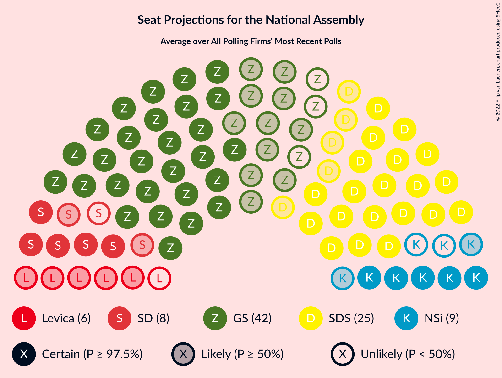

# Poll Average

<a href="#voting-intentions">Voting Intentions</a> | <a href="#seats">Seats</a> | <a href="#coalitions">Coalitions</a> | <a href="#technical-information">Technical Information</a>

## Summary

The table below lists the polls on which the average is based. They are the most recent polls (less than 90 days old) registered and analyzed so far.

| Period     | Polling firm/Commissioner(s) | SDS | LMŠ | SD | SMC | Levica | NSi | PAB | DeSUS | SNS | SLS | GOD–NLS | GOD | NLS | DL | PS | HIM |
|:----------:|:----------------------------:|:--:|:--:|:--:|:--:|:--:|:--:|:--:|:--:|:--:|:--:|:--:|:--:|:--:|:--:|:--:|:--:|
| 3 June 2018 | General Election | 24.9%   25 | 12.6%   13 | 9.9%   10 | 9.7%   10 | 9.3%   9 | 7.2%   7 | 5.1%   5 | 4.9%   5 | 4.2%   4 | 2.6%   0 | 0.2%   0 | 0.2%   0 | 0.2%   0 | 0.0%   0 | 0.0%   0 | 0.0%   2 |
| N/A | Poll Average | 24–30%   23–28 | 14–19%   13–18 | 11–16%   10–15 | N/A   N/A | 12–17%   11–16 | 6–10%   6–9 | 2–4%   0–4 | 6–9%   5–9 | 4–8%   4–7 | 2–5%   0–4 | N/A   N/A | N/A   N/A | N/A   N/A | N/A   N/A | N/A   N/A | N/A   N/A |
| [1–28 June 2020](2020-06-28-Mediana.html) | Mediana   POPTV | 24–30%   23–28 | 14–19%   13–18 | 11–16%   10–15 | N/A   N/A | 12–17%   11–16 | 6–10%   6–9 | 2–4%   0–4 | 6–9%   5–9 | 4–8%   4–7 | 2–5%   0–4 | N/A   N/A | N/A   N/A | N/A   N/A | N/A   N/A | N/A   N/A | N/A   N/A |
| [15–17 June 2020](2020-06-17-Parsifal.html) | Parsifal   Nova 24TV | N/A   N/A | N/A   N/A | N/A   N/A | N/A   N/A | N/A   N/A | N/A   N/A | N/A   N/A | N/A   N/A | N/A   N/A | N/A   N/A | N/A   N/A | N/A   N/A | N/A   N/A | N/A   N/A | N/A   N/A | N/A   N/A |
| [9–11 June 2020](2020-06-11-Ninamedia.html) | Ninamedia   Dnevnik, Večer | N/A   N/A | N/A   N/A | N/A   N/A | N/A   N/A | N/A   N/A | N/A   N/A | N/A   N/A | N/A   N/A | N/A   N/A | N/A   N/A | N/A   N/A | N/A   N/A | N/A   N/A | N/A   N/A | N/A   N/A | N/A   N/A |
| 3 June 2018 | General Election | 24.9%   25 | 12.6%   13 | 9.9%   10 | 9.7%   10 | 9.3%   9 | 7.2%   7 | 5.1%   5 | 4.9%   5 | 4.2%   4 | 2.6%   0 | 0.2%   0 | 0.2%   0 | 0.2%   0 | 0.0%   0 | 0.0%   0 | 0.0%   2 |

Only polls for which at least the sample size has been published are included in the table above.

**Legend:**
+ **Top half of each row:** Voting intentions (95% confidence interval)
+ **Bottom half of each row:** Seat projections for the National Assembly (95% confidence interval)
+ **SDS:** Slovenska demokratska stranka
+ **LMŠ:** Lista Marjana Šarca
+ **SD:** Socialni demokrati
+ **SMC:** Stranka modernega centra
+ **Levica:** Levica
+ **NSi:** Nova Slovenija–Krščanski demokrati
+ **PAB:** Stranka Alenke Bratušek
+ **DeSUS:** Demokratična stranka upokojencev Slovenije
+ **SNS:** Slovenska nacionalna stranka
+ **SLS:** Slovenska ljudska stranka
+ **GOD–NLS:** Glas za otroke in družine–Nova ljudska stranka Slovenije
+ **GOD:** Glas za otroke in družine
+ **NLS:** Nova ljudska stranka Slovenije
+ **DL:** Državljanska lista
+ **PS:** Pozitivna Slovenija
+ **HIM:** Hungarian and Italian minorities
+ **N/A (single party):** Party not included the published results
+ **N/A (entire row):** Calculation for this opinion poll not started yet

## Voting Intentions

### Confidence Intervals

| Party | Last Result | Median | 80% Confidence Interval | 90% Confidence Interval | 95% Confidence Interval | 99% Confidence Interval |
|:-----:|:-----------:|:------:|:-----------------------:|:-----------------------:|:-----------------------:|:-----------------------:|
| <a href="#slovenska-demokratska-stranka">Slovenska demokratska stranka</a> | 24.9% | 26.8% | 24.7–29.0% |24.2–29.6% | 23.7–30.1% | 22.7–31.2% |
| <a href="#lista-marjana-šarca">Lista Marjana Šarca</a> | 12.6% | 16.4% | 14.7–18.2% |14.2–18.7% | 13.8–19.2% | 13.0–20.1% |
| <a href="#socialni-demokrati">Socialni demokrati</a> | 9.9% | 13.3% | 11.7–15.0% |11.3–15.5% | 11.0–15.9% | 10.3–16.8% |
| <a href="#stranka-modernega-centra">Stranka modernega centra</a> | 9.7% | N/A | N/A |N/A | N/A | N/A |
| <a href="#levica">Levica</a> | 9.3% | 14.3% | 12.7–16.0% |12.2–16.5% | 11.9–17.0% | 11.1–17.9% |
| <a href="#nova-slovenija–krščanski-demokrati">Nova Slovenija–Krščanski demokrati</a> | 7.2% | 7.8% | 6.5–9.1% |6.2–9.5% | 6.0–9.9% | 5.4–10.6% |
| <a href="#stranka-alenke-bratušek">Stranka Alenke Bratušek</a> | 5.1% | 3.0% | 2.3–3.9% |2.1–4.2% | 1.9–4.4% | 1.7–4.9% |
| <a href="#demokratična-stranka-upokojencev-slovenije">Demokratična stranka upokojencev Slovenije</a> | 4.9% | 7.3% | 6.2–8.6% |5.8–9.0% | 5.6–9.4% | 5.1–10.1% |
| <a href="#slovenska-nacionalna-stranka">Slovenska nacionalna stranka</a> | 4.2% | 5.9% | 4.9–7.1% |4.6–7.5% | 4.4–7.8% | 3.9–8.5% |
| <a href="#slovenska-ljudska-stranka">Slovenska ljudska stranka</a> | 2.6% | 3.3% | 2.5–4.2% |2.3–4.5% | 2.2–4.8% | 1.9–5.3% |
| <a href="#glas-za-otroke-in-družine–nova-ljudska-stranka-slovenije">Glas za otroke in družine–Nova ljudska stranka Slovenije</a> | 0.2% | N/A | N/A |N/A | N/A | N/A |
| <a href="#glas-za-otroke-in-družine">Glas za otroke in družine</a> | 0.2% | N/A | N/A |N/A | N/A | N/A |
| <a href="#nova-ljudska-stranka-slovenije">Nova ljudska stranka Slovenije</a> | 0.2% | N/A | N/A |N/A | N/A | N/A |
| <a href="#državljanska-lista">Državljanska lista</a> | 0.0% | N/A | N/A |N/A | N/A | N/A |
| <a href="#pozitivna-slovenija">Pozitivna Slovenija</a> | 0.0% | N/A | N/A |N/A | N/A | N/A |
| <a href="#hungarian-and-italian-minorities">Hungarian and Italian minorities</a> | 0.0% | N/A | N/A |N/A | N/A | N/A |

### Slovenska demokratska stranka

*For a full overview of the results for this party, see the [Slovenska demokratska stranka](party-slovenskademokratskastranka.html) page.*

| Voting Intentions | Probability | Accumulated | Special Marks |
|:-----------------:|:-----------:|:-----------:|:-------------:|
| 20.5–21.5% | 0% | 100% |  |
| 21.5–22.5% | 0.3% | 100% |  |
| 22.5–23.5% | 2% | 99.6% |  |
| 23.5–24.5% | 6% | 98% |  |
| 24.5–25.5% | 14% | 92% | Last Result |
| 25.5–26.5% | 22% | 78% |  |
| 26.5–27.5% | 24% | 57% | Median |
| 27.5–28.5% | 18% | 33% |  |
| 28.5–29.5% | 10% | 15% |  |
| 29.5–30.5% | 4% | 5% |  |
| 30.5–31.5% | 1.1% | 1.4% |  |
| 31.5–32.5% | 0.2% | 0.3% |  |
| 32.5–33.5% | 0% | 0% |  |

### Lista Marjana Šarca

*For a full overview of the results for this party, see the [Lista Marjana Šarca](party-listamarjanašarca.html) page.*

| Voting Intentions | Probability | Accumulated | Special Marks |
|:-----------------:|:-----------:|:-----------:|:-------------:|
| 10.5–11.5% | 0% | 100% |  |
| 11.5–12.5% | 0.1% | 100% |  |
| 12.5–13.5% | 1.4% | 99.9% | Last Result |
| 13.5–14.5% | 7% | 98% |  |
| 14.5–15.5% | 18% | 91% |  |
| 15.5–16.5% | 28% | 73% | Median |
| 16.5–17.5% | 25% | 45% |  |
| 17.5–18.5% | 14% | 20% |  |
| 18.5–19.5% | 5% | 6% |  |
| 19.5–20.5% | 1.2% | 1.4% |  |
| 20.5–21.5% | 0.2% | 0.2% |  |
| 21.5–22.5% | 0% | 0% |  |

### Socialni demokrati

*For a full overview of the results for this party, see the [Socialni demokrati](party-socialnidemokrati.html) page.*

| Voting Intentions | Probability | Accumulated | Special Marks |
|:-----------------:|:-----------:|:-----------:|:-------------:|
| 8.5–9.5% | 0.1% | 100% |  |
| 9.5–10.5% | 0.9% | 99.9% | Last Result |
| 10.5–11.5% | 6% | 99.0% |  |
| 11.5–12.5% | 19% | 93% |  |
| 12.5–13.5% | 31% | 73% | Median |
| 13.5–14.5% | 26% | 43% |  |
| 14.5–15.5% | 12% | 17% |  |
| 15.5–16.5% | 4% | 5% |  |
| 16.5–17.5% | 0.7% | 0.8% |  |
| 17.5–18.5% | 0.1% | 0.1% |  |
| 18.5–19.5% | 0% | 0% |  |

### Levica

*For a full overview of the results for this party, see the [Levica](party-levica.html) page.*

| Voting Intentions | Probability | Accumulated | Special Marks |
|:-----------------:|:-----------:|:-----------:|:-------------:|
| 8.5–9.5% | 0% | 100% | Last Result |
| 9.5–10.5% | 0.1% | 100% |  |
| 10.5–11.5% | 1.2% | 99.9% |  |
| 11.5–12.5% | 7% | 98.7% |  |
| 12.5–13.5% | 20% | 92% |  |
| 13.5–14.5% | 30% | 72% | Median |
| 14.5–15.5% | 25% | 42% |  |
| 15.5–16.5% | 13% | 17% |  |
| 16.5–17.5% | 4% | 5% |  |
| 17.5–18.5% | 0.8% | 0.9% |  |
| 18.5–19.5% | 0.1% | 0.1% |  |
| 19.5–20.5% | 0% | 0% |  |

### Nova Slovenija–Krščanski demokrati

*For a full overview of the results for this party, see the [Nova Slovenija–Krščanski demokrati](party-novaslovenija–krščanskidemokrati.html) page.*

| Voting Intentions | Probability | Accumulated | Special Marks |
|:-----------------:|:-----------:|:-----------:|:-------------:|
| 3.5–4.5% | 0% | 100% |  |
| 4.5–5.5% | 0.7% | 100% |  |
| 5.5–6.5% | 10% | 99.3% |  |
| 6.5–7.5% | 31% | 90% | Last Result |
| 7.5–8.5% | 36% | 58% | Median |
| 8.5–9.5% | 17% | 22% |  |
| 9.5–10.5% | 4% | 4% |  |
| 10.5–11.5% | 0.5% | 0.5% |  |
| 11.5–12.5% | 0% | 0% |  |

### Stranka Alenke Bratušek

*For a full overview of the results for this party, see the [Stranka Alenke Bratušek](party-strankaalenkebratušek.html) page.*

| Voting Intentions | Probability | Accumulated | Special Marks |
|:-----------------:|:-----------:|:-----------:|:-------------:|
| 0.0–0.5% | 0% | 100% |  |
| 0.5–1.5% | 0.2% | 100% |  |
| 1.5–2.5% | 22% | 99.8% |  |
| 2.5–3.5% | 57% | 78% | Median |
| 3.5–4.5% | 20% | 21% |  |
| 4.5–5.5% | 2% | 2% | Last Result |
| 5.5–6.5% | 0.1% | 0.1% |  |
| 6.5–7.5% | 0% | 0% |  |

### Demokratična stranka upokojencev Slovenije

*For a full overview of the results for this party, see the [Demokratična stranka upokojencev Slovenije](party-demokratičnastrankaupokojencevslovenije.html) page.*

| Voting Intentions | Probability | Accumulated | Special Marks |
|:-----------------:|:-----------:|:-----------:|:-------------:|
| 3.5–4.5% | 0% | 100% |  |
| 4.5–5.5% | 2% | 100% | Last Result |
| 5.5–6.5% | 18% | 98% |  |
| 6.5–7.5% | 38% | 80% | Median |
| 7.5–8.5% | 30% | 41% |  |
| 8.5–9.5% | 10% | 12% |  |
| 9.5–10.5% | 2% | 2% |  |
| 10.5–11.5% | 0.1% | 0.2% |  |
| 11.5–12.5% | 0% | 0% |  |

### Slovenska nacionalna stranka

*For a full overview of the results for this party, see the [Slovenska nacionalna stranka](party-slovenskanacionalnastranka.html) page.*

| Voting Intentions | Probability | Accumulated | Special Marks |
|:-----------------:|:-----------:|:-----------:|:-------------:|
| 2.5–3.5% | 0.1% | 100% |  |
| 3.5–4.5% | 4% | 99.9% | Last Result |
| 4.5–5.5% | 28% | 96% |  |
| 5.5–6.5% | 43% | 68% | Median |
| 6.5–7.5% | 20% | 25% |  |
| 7.5–8.5% | 4% | 5% |  |
| 8.5–9.5% | 0.4% | 0.4% |  |
| 9.5–10.5% | 0% | 0% |  |

### Slovenska ljudska stranka

*For a full overview of the results for this party, see the [Slovenska ljudska stranka](party-slovenskaljudskastranka.html) page.*

| Voting Intentions | Probability | Accumulated | Special Marks |
|:-----------------:|:-----------:|:-----------:|:-------------:|
| 0.5–1.5% | 0.1% | 100% |  |
| 1.5–2.5% | 11% | 99.9% |  |
| 2.5–3.5% | 54% | 89% | Last Result, Median |
| 3.5–4.5% | 31% | 35% |  |
| 4.5–5.5% | 4% | 4% |  |
| 5.5–6.5% | 0.2% | 0.2% |  |
| 6.5–7.5% | 0% | 0% |  |

## Seats

### Confidence Intervals

| Party | Last Result | Median | 80% Confidence Interval | 90% Confidence Interval | 95% Confidence Interval | 99% Confidence Interval |
|:-----:|:-----------:|:------:|:-----------------------:|:-----------------------:|:-----------------------:|:-----------------------:|
| <a href="#slovenska-demokratska-stranka">Slovenska demokratska stranka</a> | 25 | 26 | 24–28 |23–28 | 23–28 | 22–29 |
| <a href="#lista-marjana-šarca">Lista Marjana Šarca</a> | 13 | 16 | 14–17 |13–18 | 13–18 | 12–19 |
| <a href="#socialni-demokrati">Socialni demokrati</a> | 10 | 13 | 12–14 |11–14 | 10–15 | 10–16 |
| <a href="#stranka-modernega-centra">Stranka modernega centra</a> | 10 | N/A | N/A |N/A | N/A | N/A |
| <a href="#levica">Levica</a> | 9 | 13 | 12–15 |12–16 | 11–16 | 11–17 |
| <a href="#nova-slovenija–krščanski-demokrati">Nova Slovenija–Krščanski demokrati</a> | 7 | 7 | 6–8 |6–8 | 6–9 | 5–10 |
| <a href="#stranka-alenke-bratušek">Stranka Alenke Bratušek</a> | 5 | 0 | 0 |0–3 | 0–4 | 0–4 |
| <a href="#demokratična-stranka-upokojencev-slovenije">Demokratična stranka upokojencev Slovenije</a> | 5 | 7 | 6–8 |5–8 | 5–9 | 4–9 |
| <a href="#slovenska-nacionalna-stranka">Slovenska nacionalna stranka</a> | 4 | 6 | 4–6 |4–7 | 4–7 | 4–8 |
| <a href="#slovenska-ljudska-stranka">Slovenska ljudska stranka</a> | 0 | 0 | 0–3 |0–4 | 0–4 | 0–5 |
| <a href="#glas-za-otroke-in-družine–nova-ljudska-stranka-slovenije">Glas za otroke in družine–Nova ljudska stranka Slovenije</a> | 0 | N/A | N/A |N/A | N/A | N/A |
| <a href="#glas-za-otroke-in-družine">Glas za otroke in družine</a> | 0 | N/A | N/A |N/A | N/A | N/A |
| <a href="#nova-ljudska-stranka-slovenije">Nova ljudska stranka Slovenije</a> | 0 | N/A | N/A |N/A | N/A | N/A |
| <a href="#državljanska-lista">Državljanska lista</a> | 0 | N/A | N/A |N/A | N/A | N/A |
| <a href="#pozitivna-slovenija">Pozitivna Slovenija</a> | 0 | N/A | N/A |N/A | N/A | N/A |
| <a href="#hungarian-and-italian-minorities">Hungarian and Italian minorities</a> | 2 | N/A | N/A |N/A | N/A | N/A |

### Slovenska demokratska stranka

*For a full overview of the results for this party, see the [Slovenska demokratska stranka](party-slovenskademokratskastranka.html) page.*

| Number of Seats | Probability | Accumulated | Special Marks |
|:---------------:|:-----------:|:-----------:|:-------------:|
| 21 | 0.4% | 100% |  |
| 22 | 1.0% | 99.6% |  |
| 23 | 4% | 98.6% |  |
| 24 | 27% | 95% |  |
| 25 | 8% | 68% | Last Result |
| 26 | 30% | 60% | Median |
| 27 | 9% | 29% |  |
| 28 | 19% | 21% |  |
| 29 | 2% | 2% |  |
| 30 | 0.3% | 0.5% |  |
| 31 | 0.2% | 0.2% |  |
| 32 | 0% | 0% |  |

### Lista Marjana Šarca

*For a full overview of the results for this party, see the [Lista Marjana Šarca](party-listamarjanašarca.html) page.*

| Number of Seats | Probability | Accumulated | Special Marks |
|:---------------:|:-----------:|:-----------:|:-------------:|
| 11 | 0.1% | 100% |  |
| 12 | 0.5% | 99.9% |  |
| 13 | 5% | 99.4% | Last Result |
| 14 | 13% | 95% |  |
| 15 | 18% | 81% |  |
| 16 | 48% | 64% | Median |
| 17 | 10% | 16% |  |
| 18 | 3% | 6% |  |
| 19 | 2% | 2% |  |
| 20 | 0.4% | 0.4% |  |
| 21 | 0% | 0% |  |

### Socialni demokrati

*For a full overview of the results for this party, see the [Socialni demokrati](party-socialnidemokrati.html) page.*

| Number of Seats | Probability | Accumulated | Special Marks |
|:---------------:|:-----------:|:-----------:|:-------------:|
| 9 | 0.3% | 100% |  |
| 10 | 5% | 99.7% | Last Result |
| 11 | 5% | 95% |  |
| 12 | 34% | 90% |  |
| 13 | 30% | 56% | Median |
| 14 | 22% | 26% |  |
| 15 | 2% | 4% |  |
| 16 | 2% | 2% |  |
| 17 | 0.1% | 0.1% |  |
| 18 | 0% | 0% |  |

### Stranka modernega centra

*For a full overview of the results for this party, see the [Stranka modernega centra](party-strankamodernegacentra.html) page.*

### Levica

*For a full overview of the results for this party, see the [Levica](party-levica.html) page.*

| Number of Seats | Probability | Accumulated | Special Marks |
|:---------------:|:-----------:|:-----------:|:-------------:|
| 9 | 0% | 100% | Last Result |
| 10 | 0.5% | 100% |  |
| 11 | 2% | 99.5% |  |
| 12 | 26% | 97% |  |
| 13 | 24% | 71% | Median |
| 14 | 10% | 46% |  |
| 15 | 31% | 36% |  |
| 16 | 4% | 5% |  |
| 17 | 0.4% | 0.8% |  |
| 18 | 0.5% | 0.5% |  |
| 19 | 0% | 0% |  |

### Nova Slovenija–Krščanski demokrati

*For a full overview of the results for this party, see the [Nova Slovenija–Krščanski demokrati](party-novaslovenija–krščanskidemokrati.html) page.*

| Number of Seats | Probability | Accumulated | Special Marks |
|:---------------:|:-----------:|:-----------:|:-------------:|
| 4 | 0.3% | 100% |  |
| 5 | 2% | 99.7% |  |
| 6 | 16% | 98% |  |
| 7 | 45% | 82% | Last Result, Median |
| 8 | 34% | 38% |  |
| 9 | 2% | 3% |  |
| 10 | 1.0% | 1.1% |  |
| 11 | 0.1% | 0.1% |  |
| 12 | 0% | 0% |  |

### Stranka Alenke Bratušek

*For a full overview of the results for this party, see the [Stranka Alenke Bratušek](party-strankaalenkebratušek.html) page.*

| Number of Seats | Probability | Accumulated | Special Marks |
|:---------------:|:-----------:|:-----------:|:-------------:|
| 0 | 95% | 100% | Median |
| 1 | 0% | 5% |  |
| 2 | 0% | 5% |  |
| 3 | 2% | 5% |  |
| 4 | 3% | 3% |  |
| 5 | 0.1% | 0.1% | Last Result |
| 6 | 0% | 0% |  |

### Demokratična stranka upokojencev Slovenije

*For a full overview of the results for this party, see the [Demokratična stranka upokojencev Slovenije](party-demokratičnastrankaupokojencevslovenije.html) page.*

| Number of Seats | Probability | Accumulated | Special Marks |
|:---------------:|:-----------:|:-----------:|:-------------:|
| 4 | 0.7% | 100% |  |
| 5 | 8% | 99.3% | Last Result |
| 6 | 17% | 92% |  |
| 7 | 51% | 74% | Median |
| 8 | 20% | 24% |  |
| 9 | 3% | 3% |  |
| 10 | 0.3% | 0.4% |  |
| 11 | 0.1% | 0.1% |  |
| 12 | 0% | 0% |  |

### Slovenska nacionalna stranka

*For a full overview of the results for this party, see the [Slovenska nacionalna stranka](party-slovenskanacionalnastranka.html) page.*

| Number of Seats | Probability | Accumulated | Special Marks |
|:---------------:|:-----------:|:-----------:|:-------------:|
| 0 | 0.3% | 100% |  |
| 1 | 0% | 99.7% |  |
| 2 | 0% | 99.7% |  |
| 3 | 0.1% | 99.7% |  |
| 4 | 17% | 99.6% | Last Result |
| 5 | 24% | 82% |  |
| 6 | 52% | 59% | Median |
| 7 | 6% | 7% |  |
| 8 | 0.6% | 0.6% |  |
| 9 | 0% | 0% |  |

### Slovenska ljudska stranka

*For a full overview of the results for this party, see the [Slovenska ljudska stranka](party-slovenskaljudskastranka.html) page.*

| Number of Seats | Probability | Accumulated | Special Marks |
|:---------------:|:-----------:|:-----------:|:-------------:|
| 0 | 88% | 100% | Last Result, Median |
| 1 | 0% | 12% |  |
| 2 | 0% | 12% |  |
| 3 | 3% | 12% |  |
| 4 | 9% | 9% |  |
| 5 | 0.5% | 0.5% |  |
| 6 | 0% | 0% |  |

### Glas za otroke in družine–Nova ljudska stranka Slovenije

*For a full overview of the results for this party, see the [Glas za otroke in družine–Nova ljudska stranka Slovenije](party-glaszaotrokeindružine–novaljudskastrankaslovenije.html) page.*

### Glas za otroke in družine

*For a full overview of the results for this party, see the [Glas za otroke in družine](party-glaszaotrokeindružine.html) page.*

### Nova ljudska stranka Slovenije

*For a full overview of the results for this party, see the [Nova ljudska stranka Slovenije](party-novaljudskastrankaslovenije.html) page.*

### Državljanska lista

*For a full overview of the results for this party, see the [Državljanska lista](party-državljanskalista.html) page.*

### Pozitivna Slovenija

*For a full overview of the results for this party, see the [Pozitivna Slovenija](party-pozitivnaslovenija.html) page.*

### Hungarian and Italian minorities

*For a full overview of the results for this party, see the [Hungarian and Italian minorities](party-hungariananditalianminorities.html) page.*

## Coalitions

### Confidence Intervals

| Coalition | Last Result | Median | Majority? | 80% Confidence Interval | 90% Confidence Interval | 95% Confidence Interval | 99% Confidence Interval |
|:---------:|:-----------:|:------:|:---------:|:-----------------------:|:-----------------------:|:-----------------------:|:-----------------------:|
| Slovenska demokratska stranka – Lista Marjana Šarca – Demokratična stranka upokojencev Slovenije | 43 | 48 | 91% | 46–50 | 45–51 | 44–52 | 43–53 |
| Lista Marjana Šarca – Socialni demokrati – Stranka modernega centra – Nova Slovenija–Krščanski demokrati – Stranka Alenke Bratušek – Demokratična stranka upokojencev Slovenije | 50 | 43 | 5% | 40–44 | 40–46 | 39–46 | 38–47 |
| Lista Marjana Šarca – Socialni demokrati – Nova Slovenija–Krščanski demokrati – Demokratična stranka upokojencev Slovenije | 35 | 43 | 3% | 40–44 | 40–45 | 38–46 | 37–47 |
| Lista Marjana Šarca – Socialni demokrati – Stranka modernega centra – Nova Slovenija–Krščanski demokrati – Demokratična stranka upokojencev Slovenije | 45 | 43 | 3% | 40–44 | 40–45 | 38–46 | 37–47 |
| Slovenska demokratska stranka – Lista Marjana Šarca | 38 | 42 | 0.8% | 39–43 | 38–44 | 38–45 | 36–46 |
| Slovenska demokratska stranka – Nova Slovenija–Krščanski demokrati – Demokratična stranka upokojencev Slovenije – Slovenska ljudska stranka – Državljanska lista | 37 | 41 | 0.3% | 38–43 | 37–45 | 37–45 | 35–45 |
| Lista Marjana Šarca – Socialni demokrati – Demokratična stranka upokojencev Slovenije | 28 | 36 | 0% | 32–37 | 32–38 | 32–39 | 30–40 |
| Lista Marjana Šarca – Socialni demokrati – Stranka modernega centra – Stranka Alenke Bratušek – Demokratična stranka upokojencev Slovenije | 43 | 36 | 0% | 33–37 | 32–39 | 32–39 | 31–40 |
| Lista Marjana Šarca – Socialni demokrati – Stranka modernega centra – Demokratična stranka upokojencev Slovenije | 38 | 36 | 0% | 32–37 | 32–38 | 32–39 | 30–40 |
| Lista Marjana Šarca – Socialni demokrati – Nova Slovenija–Krščanski demokrati | 30 | 36 | 0% | 34–37 | 33–38 | 32–39 | 31–39 |
| Lista Marjana Šarca – Socialni demokrati – Stranka modernega centra – Nova Slovenija–Krščanski demokrati | 40 | 36 | 0% | 34–37 | 33–38 | 32–39 | 31–39 |
| Lista Marjana Šarca – Socialni demokrati | 23 | 29 | 0% | 26–30 | 26–31 | 25–31 | 24–33 |
| Lista Marjana Šarca – Socialni demokrati – Stranka modernega centra | 33 | 29 | 0% | 26–30 | 26–31 | 25–31 | 24–33 |
| Socialni demokrati – Demokratična stranka upokojencev Slovenije – Državljanska lista – Pozitivna Slovenija | 15 | 20 | 0% | 17–21 | 17–22 | 17–22 | 15–23 |
| Socialni demokrati – Stranka modernega centra – Demokratična stranka upokojencev Slovenije | 25 | 20 | 0% | 17–21 | 17–22 | 17–22 | 15–23 |
| Socialni demokrati – Stranka modernega centra – Pozitivna Slovenija | 20 | 13 | 0% | 12–14 | 11–14 | 10–15 | 10–16 |

### Slovenska demokratska stranka – Lista Marjana Šarca – Demokratična stranka upokojencev Slovenije

| Number of Seats | Probability | Accumulated | Special Marks |
|:---------------:|:-----------:|:-----------:|:-------------:|
| 42 | 0.3% | 100% |  |
| 43 | 0.4% | 99.7% | Last Result |
| 44 | 4% | 99.3% |  |
| 45 | 5% | 96% |  |
| 46 | 3% | 91% | Majority |
| 47 | 33% | 88% |  |
| 48 | 8% | 54% |  |
| 49 | 6% | 47% | Median |
| 50 | 31% | 41% |  |
| 51 | 7% | 10% |  |
| 52 | 2% | 3% |  |
| 53 | 0.5% | 0.7% |  |
| 54 | 0.1% | 0.2% |  |
| 55 | 0% | 0% |  |

### Lista Marjana Šarca – Socialni demokrati – Stranka modernega centra – Nova Slovenija–Krščanski demokrati – Stranka Alenke Bratušek – Demokratična stranka upokojencev Slovenije

| Number of Seats | Probability | Accumulated | Special Marks |
|:---------------:|:-----------:|:-----------:|:-------------:|
| 36 | 0.1% | 100% |  |
| 37 | 0.2% | 99.9% |  |
| 38 | 2% | 99.7% |  |
| 39 | 2% | 98% |  |
| 40 | 7% | 96% |  |
| 41 | 11% | 89% |  |
| 42 | 11% | 78% |  |
| 43 | 39% | 67% | Median |
| 44 | 21% | 28% |  |
| 45 | 3% | 8% |  |
| 46 | 4% | 5% | Majority |
| 47 | 1.0% | 1.4% |  |
| 48 | 0.3% | 0.4% |  |
| 49 | 0.1% | 0.1% |  |
| 50 | 0% | 0% | Last Result |

### Lista Marjana Šarca – Socialni demokrati – Nova Slovenija–Krščanski demokrati – Demokratična stranka upokojencev Slovenije

| Number of Seats | Probability | Accumulated | Special Marks |
|:---------------:|:-----------:|:-----------:|:-------------:|
| 35 | 0.1% | 100% | Last Result |
| 36 | 0.1% | 99.9% |  |
| 37 | 0.4% | 99.8% |  |
| 38 | 2% | 99.4% |  |
| 39 | 2% | 97% |  |
| 40 | 9% | 95% |  |
| 41 | 10% | 86% |  |
| 42 | 13% | 76% |  |
| 43 | 37% | 63% | Median |
| 44 | 20% | 26% |  |
| 45 | 3% | 6% |  |
| 46 | 2% | 3% | Majority |
| 47 | 0.8% | 0.9% |  |
| 48 | 0.1% | 0.2% |  |
| 49 | 0% | 0% |  |

### Lista Marjana Šarca – Socialni demokrati – Stranka modernega centra – Nova Slovenija–Krščanski demokrati – Demokratična stranka upokojencev Slovenije

| Number of Seats | Probability | Accumulated | Special Marks |
|:---------------:|:-----------:|:-----------:|:-------------:|
| 35 | 0.1% | 100% |  |
| 36 | 0.1% | 99.9% |  |
| 37 | 0.4% | 99.8% |  |
| 38 | 2% | 99.4% |  |
| 39 | 2% | 97% |  |
| 40 | 9% | 95% |  |
| 41 | 10% | 86% |  |
| 42 | 13% | 76% |  |
| 43 | 37% | 63% | Median |
| 44 | 20% | 26% |  |
| 45 | 3% | 6% | Last Result |
| 46 | 2% | 3% | Majority |
| 47 | 0.8% | 0.9% |  |
| 48 | 0.1% | 0.2% |  |
| 49 | 0% | 0% |  |

### Slovenska demokratska stranka – Lista Marjana Šarca

| Number of Seats | Probability | Accumulated | Special Marks |
|:---------------:|:-----------:|:-----------:|:-------------:|
| 35 | 0.1% | 100% |  |
| 36 | 0.5% | 99.9% |  |
| 37 | 0.8% | 99.4% |  |
| 38 | 4% | 98.7% | Last Result |
| 39 | 7% | 95% |  |
| 40 | 27% | 88% |  |
| 41 | 11% | 61% |  |
| 42 | 21% | 51% | Median |
| 43 | 20% | 30% |  |
| 44 | 7% | 10% |  |
| 45 | 2% | 3% |  |
| 46 | 0.4% | 0.8% | Majority |
| 47 | 0.4% | 0.4% |  |
| 48 | 0% | 0% |  |

### Slovenska demokratska stranka – Nova Slovenija–Krščanski demokrati – Demokratična stranka upokojencev Slovenije – Slovenska ljudska stranka – Državljanska lista

| Number of Seats | Probability | Accumulated | Special Marks |
|:---------------:|:-----------:|:-----------:|:-------------:|
| 35 | 2% | 100% |  |
| 36 | 0.7% | 98% |  |
| 37 | 3% | 98% | Last Result |
| 38 | 25% | 95% |  |
| 39 | 11% | 70% |  |
| 40 | 7% | 58% | Median |
| 41 | 10% | 51% |  |
| 42 | 31% | 41% |  |
| 43 | 3% | 10% |  |
| 44 | 2% | 7% |  |
| 45 | 5% | 6% |  |
| 46 | 0.2% | 0.3% | Majority |
| 47 | 0.1% | 0.1% |  |
| 48 | 0% | 0% |  |

### Lista Marjana Šarca – Socialni demokrati – Demokratična stranka upokojencev Slovenije

| Number of Seats | Probability | Accumulated | Special Marks |
|:---------------:|:-----------:|:-----------:|:-------------:|
| 28 | 0% | 100% | Last Result |
| 29 | 0.1% | 100% |  |
| 30 | 0.6% | 99.9% |  |
| 31 | 1.5% | 99.4% |  |
| 32 | 8% | 98% |  |
| 33 | 5% | 90% |  |
| 34 | 10% | 85% |  |
| 35 | 14% | 75% |  |
| 36 | 50% | 61% | Median |
| 37 | 5% | 11% |  |
| 38 | 3% | 6% |  |
| 39 | 1.4% | 3% |  |
| 40 | 2% | 2% |  |
| 41 | 0.1% | 0.1% |  |
| 42 | 0% | 0% |  |

### Lista Marjana Šarca – Socialni demokrati – Stranka modernega centra – Stranka Alenke Bratušek – Demokratična stranka upokojencev Slovenije

| Number of Seats | Probability | Accumulated | Special Marks |
|:---------------:|:-----------:|:-----------:|:-------------:|
| 29 | 0.1% | 100% |  |
| 30 | 0.4% | 99.9% |  |
| 31 | 1.0% | 99.6% |  |
| 32 | 6% | 98.6% |  |
| 33 | 4% | 92% |  |
| 34 | 9% | 88% |  |
| 35 | 15% | 78% |  |
| 36 | 50% | 63% | Median |
| 37 | 5% | 13% |  |
| 38 | 3% | 8% |  |
| 39 | 3% | 5% |  |
| 40 | 2% | 2% |  |
| 41 | 0.2% | 0.4% |  |
| 42 | 0.2% | 0.2% |  |
| 43 | 0% | 0% | Last Result |

### Lista Marjana Šarca – Socialni demokrati – Stranka modernega centra – Demokratična stranka upokojencev Slovenije

| Number of Seats | Probability | Accumulated | Special Marks |
|:---------------:|:-----------:|:-----------:|:-------------:|
| 29 | 0.1% | 100% |  |
| 30 | 0.6% | 99.9% |  |
| 31 | 1.5% | 99.4% |  |
| 32 | 8% | 98% |  |
| 33 | 5% | 90% |  |
| 34 | 10% | 85% |  |
| 35 | 14% | 75% |  |
| 36 | 50% | 61% | Median |
| 37 | 5% | 11% |  |
| 38 | 3% | 6% | Last Result |
| 39 | 1.4% | 3% |  |
| 40 | 2% | 2% |  |
| 41 | 0.1% | 0.1% |  |
| 42 | 0% | 0% |  |

### Lista Marjana Šarca – Socialni demokrati – Nova Slovenija–Krščanski demokrati

| Number of Seats | Probability | Accumulated | Special Marks |
|:---------------:|:-----------:|:-----------:|:-------------:|
| 29 | 0.1% | 100% |  |
| 30 | 0.3% | 99.9% | Last Result |
| 31 | 0.8% | 99.6% |  |
| 32 | 3% | 98.7% |  |
| 33 | 3% | 96% |  |
| 34 | 16% | 93% |  |
| 35 | 9% | 77% |  |
| 36 | 54% | 68% | Median |
| 37 | 7% | 15% |  |
| 38 | 4% | 7% |  |
| 39 | 3% | 4% |  |
| 40 | 0.2% | 0.4% |  |
| 41 | 0.2% | 0.2% |  |
| 42 | 0% | 0% |  |

### Lista Marjana Šarca – Socialni demokrati – Stranka modernega centra – Nova Slovenija–Krščanski demokrati

| Number of Seats | Probability | Accumulated | Special Marks |
|:---------------:|:-----------:|:-----------:|:-------------:|
| 29 | 0.1% | 100% |  |
| 30 | 0.3% | 99.9% |  |
| 31 | 0.8% | 99.6% |  |
| 32 | 3% | 98.7% |  |
| 33 | 3% | 96% |  |
| 34 | 16% | 93% |  |
| 35 | 9% | 77% |  |
| 36 | 54% | 68% | Median |
| 37 | 7% | 15% |  |
| 38 | 4% | 7% |  |
| 39 | 3% | 4% |  |
| 40 | 0.2% | 0.4% | Last Result |
| 41 | 0.2% | 0.2% |  |
| 42 | 0% | 0% |  |

### Lista Marjana Šarca – Socialni demokrati

| Number of Seats | Probability | Accumulated | Special Marks |
|:---------------:|:-----------:|:-----------:|:-------------:|
| 23 | 0.2% | 100% | Last Result |
| 24 | 0.4% | 99.7% |  |
| 25 | 2% | 99.4% |  |
| 26 | 11% | 97% |  |
| 27 | 8% | 86% |  |
| 28 | 27% | 79% |  |
| 29 | 38% | 51% | Median |
| 30 | 5% | 13% |  |
| 31 | 6% | 8% |  |
| 32 | 0.3% | 2% |  |
| 33 | 2% | 2% |  |
| 34 | 0.1% | 0.1% |  |
| 35 | 0% | 0% |  |

### Lista Marjana Šarca – Socialni demokrati – Stranka modernega centra

| Number of Seats | Probability | Accumulated | Special Marks |
|:---------------:|:-----------:|:-----------:|:-------------:|
| 23 | 0.2% | 100% |  |
| 24 | 0.4% | 99.7% |  |
| 25 | 2% | 99.4% |  |
| 26 | 11% | 97% |  |
| 27 | 8% | 86% |  |
| 28 | 27% | 79% |  |
| 29 | 38% | 51% | Median |
| 30 | 5% | 13% |  |
| 31 | 6% | 8% |  |
| 32 | 0.3% | 2% |  |
| 33 | 2% | 2% | Last Result |
| 34 | 0.1% | 0.1% |  |
| 35 | 0% | 0% |  |

### Socialni demokrati – Demokratična stranka upokojencev Slovenije – Državljanska lista – Pozitivna Slovenija

| Number of Seats | Probability | Accumulated | Special Marks |
|:---------------:|:-----------:|:-----------:|:-------------:|
| 15 | 0.6% | 100% | Last Result |
| 16 | 0.9% | 99.4% |  |
| 17 | 9% | 98% |  |
| 18 | 10% | 90% |  |
| 19 | 13% | 80% |  |
| 20 | 43% | 67% | Median |
| 21 | 18% | 24% |  |
| 22 | 4% | 6% |  |
| 23 | 2% | 2% |  |
| 24 | 0.1% | 0.2% |  |
| 25 | 0.1% | 0.1% |  |
| 26 | 0% | 0% |  |

### Socialni demokrati – Stranka modernega centra – Demokratična stranka upokojencev Slovenije

| Number of Seats | Probability | Accumulated | Special Marks |
|:---------------:|:-----------:|:-----------:|:-------------:|
| 15 | 0.6% | 100% |  |
| 16 | 0.9% | 99.4% |  |
| 17 | 9% | 98% |  |
| 18 | 10% | 90% |  |
| 19 | 13% | 80% |  |
| 20 | 43% | 67% | Median |
| 21 | 18% | 24% |  |
| 22 | 4% | 6% |  |
| 23 | 2% | 2% |  |
| 24 | 0.1% | 0.2% |  |
| 25 | 0.1% | 0.1% | Last Result |
| 26 | 0% | 0% |  |

### Socialni demokrati – Stranka modernega centra – Pozitivna Slovenija

| Number of Seats | Probability | Accumulated | Special Marks |
|:---------------:|:-----------:|:-----------:|:-------------:|
| 9 | 0.3% | 100% |  |
| 10 | 5% | 99.7% |  |
| 11 | 5% | 95% |  |
| 12 | 34% | 90% |  |
| 13 | 30% | 56% | Median |
| 14 | 22% | 26% |  |
| 15 | 2% | 4% |  |
| 16 | 2% | 2% |  |
| 17 | 0.1% | 0.1% |  |
| 18 | 0% | 0% |  |
| 19 | 0% | 0% |  |
| 20 | 0% | 0% | Last Result |

## Technical Information

+ **Number of polls included in this average:** 3
+ **Lowest number of simulations done in a poll included in this average:** 0
+ **Total number of simulations done in the polls included in this average:** 131,072
+ **Error estimate:** 2.48%
