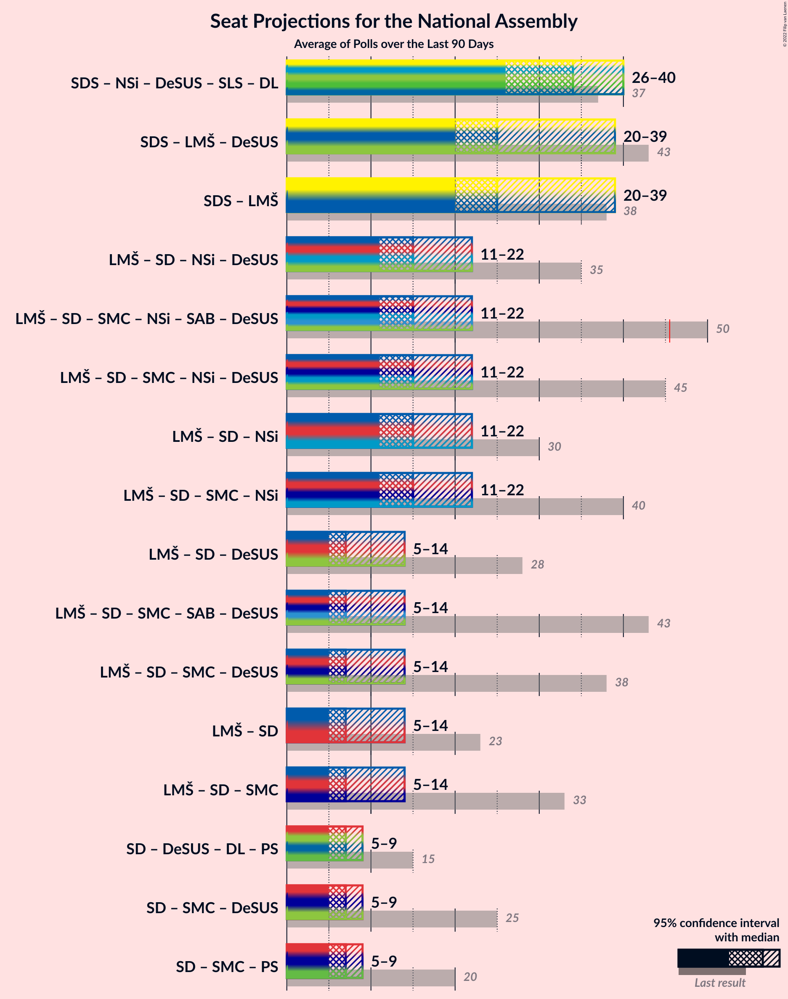
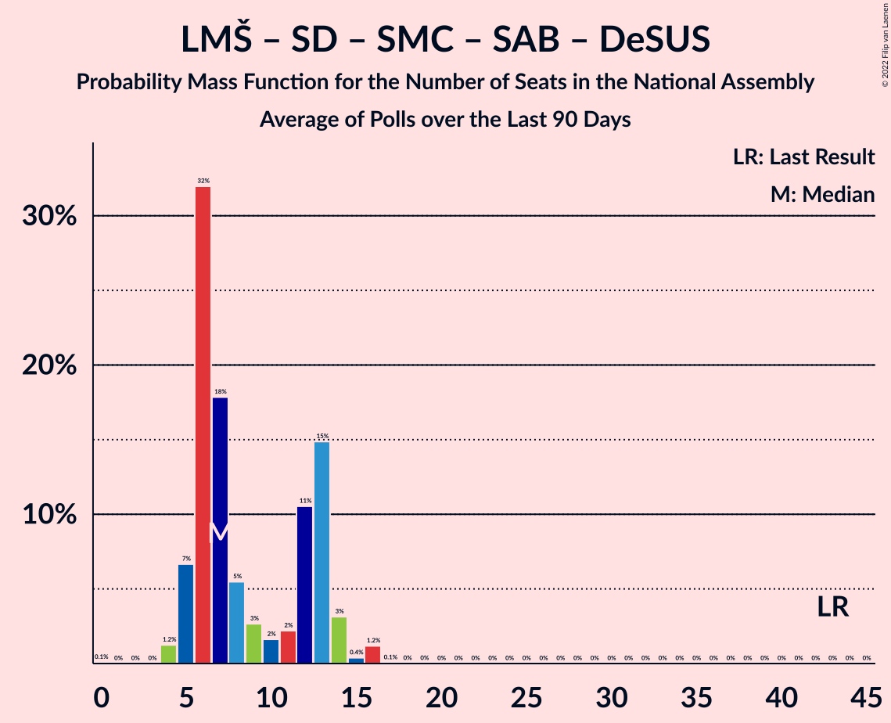

# Poll Average

<a href="#voting-intentions">Voting Intentions</a> | <a href="#seats">Seats</a> | <a href="#coalitions">Coalitions</a> | <a href="#technical-information">Technical Information</a>

## Summary

The table below lists the polls on which the average is based. They are the most recent polls (less than 90 days old) registered and analyzed so far.

| Period     | Polling firm/Commissioner(s) | SDS | LMŠ | SD | SMC | Levica | NSi | SAB | DeSUS | SNS | SLS | GOD–NLS | GOD | NLS | DL | PS | HIM | PSS | DD | ZS | ND | LRG | GS | K | PoS | LIDE | Res | VESNA |
|:----------:|:----------------------------:|:--:|:--:|:--:|:--:|:--:|:--:|:--:|:--:|:--:|:--:|:--:|:--:|:--:|:--:|:--:|:--:|:--:|:--:|:--:|:--:|:--:|:--:|:--:|:--:|:--:|:--:|:--:|
| 3 June 2018 | General Election | 24.9%   25 | 12.6%   13 | 9.9%   10 | 9.7%   10 | 9.3%   9 | 7.2%   7 | 5.1%   5 | 4.9%   5 | 4.2%   4 | 2.6%   0 | 0.2%   0 | 0.2%   0 | 0.2%   0 | 0.0%   0 | 0.0%   0 | 0.0%   2 | 2.2%   0 | 1.5%   0 | 1.1%   0 | 0.0%   0 | 0.0%   0 | 0.0%   0 | 0.0%   0 | 0.0%   0 | 0.0%   0 | 0.0%   0 | 0.0%   0 |
| N/A | Poll Average | 20–34%   24–32 | 5–9%   5–8 | 8–13%   7–13 | N/A   N/A | 6–11%   6–10 | 4–8%   0–7 | 2–6%   0–5 | 0–2%   0 | 1–3%   0 | N/A   N/A | N/A   N/A | N/A   N/A | N/A   N/A | N/A   N/A | N/A   N/A | N/A   N/A | 1–3%   0 | 0–1%   0 | N/A   N/A | 2–4%   0–3 | N/A   N/A | 16–27%   15–28 | N/A   N/A | 2–7%   0–7 | 1–2%   0 | 2–4%   0 | 1–4%   0 |
| [28 February–3 March 2022](2022-03-03-Mediana.html) | Mediana   RTV SLO | 21–26%   25 | 6–9%   7–8 | 8–12%   10–11 | N/A   N/A | 6–9%   7–8 | 6–9%   7–8 | 4–7%   4–5 | 1–2%   0 | 1–3%   0 | N/A   N/A | N/A   N/A | N/A   N/A | N/A   N/A | N/A   N/A | N/A   N/A | N/A   N/A | 1–2%   0 | 0–1%   0 | N/A   N/A | 2–4%   0 | N/A   N/A | 20–25%   25–26 | N/A   N/A | 2–4%   0 | N/A   N/A | 2–4%   0 | 2–4%   0 |
| [23–25 February 2022](2022-02-25-Parsifal.html) | Parsifal   Planet TV | 28–35%   26–33 | 5–9%   5–9 | 7–12%   7–11 | N/A   N/A | 6–10%   5–9 | 4–7%   0–6 | 2–4%   0–4 | N/A   N/A | N/A   N/A | N/A   N/A | N/A   N/A | N/A   N/A | N/A   N/A | N/A   N/A | N/A   N/A | N/A   N/A | N/A   N/A | N/A   N/A | N/A   N/A | 2–5%   0–4 | N/A   N/A | 15–21%   14–20 | N/A   N/A | 4–8%   4–7 | N/A   N/A | N/A   N/A | N/A   N/A |
| [21–23 February 2022](2022-02-23-Ninamedia.html) | Ninamedia   Dnvnk, Včr, PrmNvc, Svt24 | 20–25%   23–24 | 5–8%   5–8 | 10–14%   11–13 | N/A   N/A | 8–11%   9–11 | 4–6%   0–5 | 3–5%   0–5 | 0–1%   0 | 1–2%   0 | N/A   N/A | N/A   N/A | N/A   N/A | N/A   N/A | N/A   N/A | N/A   N/A | N/A   N/A | 1–3%   0 | 0–1%   0 | N/A   N/A | 2–4%   0 | N/A   N/A | 22–28%   27–30 | N/A   N/A | 3–5%   0–4 | 1–2%   0 | 2–4%   0 | 1–2%   0 |
| 3 June 2018 | General Election | 24.9%   25 | 12.6%   13 | 9.9%   10 | 9.7%   10 | 9.3%   9 | 7.2%   7 | 5.1%   5 | 4.9%   5 | 4.2%   4 | 2.6%   0 | 0.2%   0 | 0.2%   0 | 0.2%   0 | 0.0%   0 | 0.0%   0 | 0.0%   2 | 2.2%   0 | 1.5%   0 | 1.1%   0 | 0.0%   0 | 0.0%   0 | 0.0%   0 | 0.0%   0 | 0.0%   0 | 0.0%   0 | 0.0%   0 | 0.0%   0 |

Only polls for which at least the sample size has been published are included in the table above.

**Legend:**
+ **Top half of each row:** Voting intentions (95% confidence interval)
+ **Bottom half of each row:** Seat projections for the National Assembly (95% confidence interval)
+ **SDS:** Slovenska demokratska stranka
+ **LMŠ:** Lista Marjana Šarca
+ **SD:** Socialni demokrati
+ **SMC:** Stranka modernega centra
+ **Levica:** Levica
+ **NSi:** Nova Slovenija–Krščanski demokrati
+ **SAB:** Stranka Alenke Bratušek
+ **DeSUS:** Demokratična stranka upokojencev Slovenije
+ **SNS:** Slovenska nacionalna stranka
+ **SLS:** Slovenska ljudska stranka
+ **GOD–NLS:** Glas za otroke in družine–Nova ljudska stranka Slovenije
+ **GOD:** Glas za otroke in družine
+ **NLS:** Nova ljudska stranka Slovenije
+ **DL:** Državljanska lista
+ **PS:** Pozitivna Slovenija
+ **HIM:** Hungarian and Italian minorities
+ **PSS:** Piratska stranka Slovenije
+ **DD:** Dobra država
+ **ZS:** Zeleni Slovenije
+ **ND:** Naša dežela
+ **LRG:** Lista Roberta Goloba
+ **GS:** Gibanje Svoboda
+ **K:** Konkretno
+ **PoS:** Povežimo Slovenijo
+ **LIDE:** Liberalni demokrati
+ **Res:** Resni.ca
+ **VESNA:** VESNA–Zelena stranka
+ **N/A (single party):** Party not included the published results
+ **N/A (entire row):** Calculation for this opinion poll not started yet

## Voting Intentions

### Confidence Intervals

| Party | Last Result | Median | 80% Confidence Interval | 90% Confidence Interval | 95% Confidence Interval | 99% Confidence Interval |
|:-----:|:-----------:|:------:|:-----------------------:|:-----------------------:|:-----------------------:|:-----------------------:|
| <a href="#slovenska-demokratska-stranka">Slovenska demokratska stranka</a> | 24.9% | 23.7% | 21.4–32.0% |20.9–33.0% | 20.5–33.7% | 19.6–35.1% |
| <a href="#lista-marjana-šarca">Lista Marjana Šarca</a> | 12.6% | 7.0% | 5.9–8.3% |5.6–8.6% | 5.4–9.0% | 4.9–9.7% |
| <a href="#socialni-demokrati">Socialni demokrati</a> | 9.9% | 10.2% | 8.5–12.2% |8.1–12.7% | 7.8–13.2% | 7.1–13.9% |
| <a href="#stranka-modernega-centra">Stranka modernega centra</a> | 9.7% | N/A | N/A |N/A | N/A | N/A |
| <a href="#levica">Levica</a> | 9.3% | 8.0% | 6.5–9.9% |6.2–10.3% | 5.9–10.7% | 5.4–11.4% |
| <a href="#nova-slovenija–krščanski-demokrati">Nova Slovenija–Krščanski demokrati</a> | 7.2% | 5.6% | 4.3–7.5% |4.0–7.9% | 3.8–8.3% | 3.4–8.9% |
| <a href="#stranka-alenke-bratušek">Stranka Alenke Bratušek</a> | 5.1% | 4.2% | 2.6–5.6% |2.4–6.0% | 2.1–6.3% | 1.8–6.8% |
| <a href="#demokratična-stranka-upokojencev-slovenije">Demokratična stranka upokojencev Slovenije</a> | 4.9% | 0.9% | 0.5–1.5% |0.4–1.6% | 0.4–1.8% | 0.3–2.1% |
| <a href="#slovenska-nacionalna-stranka">Slovenska nacionalna stranka</a> | 4.2% | 1.8% | 1.0–2.7% |0.9–2.9% | 0.8–3.1% | 0.6–3.5% |
| <a href="#slovenska-ljudska-stranka">Slovenska ljudska stranka</a> | 2.6% | N/A | N/A |N/A | N/A | N/A |
| <a href="#piratska-stranka-slovenije">Piratska stranka Slovenije</a> | 2.2% | 1.6% | 1.0–2.3% |0.9–2.5% | 0.8–2.6% | 0.7–3.0% |
| <a href="#dobra-država">Dobra država</a> | 1.5% | 0.5% | 0.3–0.9% |0.3–1.0% | 0.2–1.1% | 0.1–1.3% |
| <a href="#zeleni-slovenije">Zeleni Slovenije</a> | 1.1% | N/A | N/A |N/A | N/A | N/A |
| <a href="#glas-za-otroke-in-družine–nova-ljudska-stranka-slovenije">Glas za otroke in družine–Nova ljudska stranka Slovenije</a> | 0.2% | N/A | N/A |N/A | N/A | N/A |
| <a href="#glas-za-otroke-in-družine">Glas za otroke in družine</a> | 0.2% | N/A | N/A |N/A | N/A | N/A |
| <a href="#nova-ljudska-stranka-slovenije">Nova ljudska stranka Slovenije</a> | 0.2% | N/A | N/A |N/A | N/A | N/A |
| <a href="#državljanska-lista">Državljanska lista</a> | 0.0% | N/A | N/A |N/A | N/A | N/A |
| <a href="#pozitivna-slovenija">Pozitivna Slovenija</a> | 0.0% | N/A | N/A |N/A | N/A | N/A |
| <a href="#hungarian-and-italian-minorities">Hungarian and Italian minorities</a> | 0.0% | N/A | N/A |N/A | N/A | N/A |
| <a href="#naša-dežela">Naša dežela</a> | 0.0% | 3.0% | 2.3–3.9% |2.2–4.1% | 2.0–4.4% | 1.8–4.9% |
| <a href="#lista-roberta-goloba">Lista Roberta Goloba</a> | 0.0% | N/A | N/A |N/A | N/A | N/A |
| <a href="#gibanje-svoboda">Gibanje Svoboda</a> | 0.0% | 22.7% | 17.0–25.7% |16.2–26.3% | 15.6–26.8% | 14.7–27.9% |
| <a href="#konkretno">Konkretno</a> | 0.0% | N/A | N/A |N/A | N/A | N/A |
| <a href="#povežimo-slovenijo">Povežimo Slovenijo</a> | 0.0% | 3.7% | 2.3–6.5% |2.1–7.0% | 1.9–7.4% | 1.7–8.3% |
| <a href="#liberalni-demokrati">Liberalni demokrati</a> | 0.0% | 1.4% | 1.0–1.9% |0.9–2.1% | 0.8–2.2% | 0.7–2.5% |
| <a href="#resni.ca">Resni.ca</a> | 0.0% | 3.0% | 2.4–3.8% |2.2–4.1% | 2.0–4.3% | 1.8–4.7% |
| <a href="#vesna–zelena-stranka">VESNA–Zelena stranka</a> | 0.0% | 2.0% | 0.9–3.4% |0.8–3.7% | 0.7–3.9% | 0.6–4.4% |

### Slovenska demokratska stranka

*For a full overview of the results for this party, see the [Slovenska demokratska stranka](party-slovenskademokratskastranka.html) page.*

| Voting Intentions | Probability | Accumulated | Special Marks |
|:-----------------:|:-----------:|:-----------:|:-------------:|
| 17.5–18.5% | 0% | 100% |  |
| 18.5–19.5% | 0.4% | 100% |  |
| 19.5–20.5% | 2% | 99.6% |  |
| 20.5–21.5% | 9% | 97% |  |
| 21.5–22.5% | 17% | 88% |  |
| 22.5–23.5% | 19% | 72% |  |
| 23.5–24.5% | 13% | 53% | Median |
| 24.5–25.5% | 5% | 40% | Last Result |
| 25.5–26.5% | 2% | 35% |  |
| 26.5–27.5% | 0.8% | 33% |  |
| 27.5–28.5% | 2% | 33% |  |
| 28.5–29.5% | 4% | 31% |  |
| 29.5–30.5% | 6% | 27% |  |
| 30.5–31.5% | 7% | 21% |  |
| 31.5–32.5% | 6% | 13% |  |
| 32.5–33.5% | 4% | 7% |  |
| 33.5–34.5% | 2% | 3% |  |
| 34.5–35.5% | 0.7% | 1.0% |  |
| 35.5–36.5% | 0.2% | 0.3% |  |
| 36.5–37.5% | 0% | 0.1% |  |
| 37.5–38.5% | 0% | 0% |  |

### Lista Marjana Šarca

*For a full overview of the results for this party, see the [Lista Marjana Šarca](party-listamarjanašarca.html) page.*

| Voting Intentions | Probability | Accumulated | Special Marks |
|:-----------------:|:-----------:|:-----------:|:-------------:|
| 2.5–3.5% | 0% | 100% |  |
| 3.5–4.5% | 0.1% | 100% |  |
| 4.5–5.5% | 4% | 99.9% |  |
| 5.5–6.5% | 27% | 96% |  |
| 6.5–7.5% | 41% | 68% | Median |
| 7.5–8.5% | 22% | 28% |  |
| 8.5–9.5% | 5% | 6% |  |
| 9.5–10.5% | 0.7% | 0.7% |  |
| 10.5–11.5% | 0.1% | 0.1% |  |
| 11.5–12.5% | 0% | 0% |  |
| 12.5–13.5% | 0% | 0% | Last Result |

### Socialni demokrati

*For a full overview of the results for this party, see the [Socialni demokrati](party-socialnidemokrati.html) page.*

| Voting Intentions | Probability | Accumulated | Special Marks |
|:-----------------:|:-----------:|:-----------:|:-------------:|
| 4.5–5.5% | 0% | 100% |  |
| 5.5–6.5% | 0.1% | 100% |  |
| 6.5–7.5% | 2% | 99.9% |  |
| 7.5–8.5% | 9% | 98% |  |
| 8.5–9.5% | 23% | 89% |  |
| 9.5–10.5% | 26% | 67% | Last Result, Median |
| 10.5–11.5% | 21% | 41% |  |
| 11.5–12.5% | 14% | 20% |  |
| 12.5–13.5% | 6% | 7% |  |
| 13.5–14.5% | 1.1% | 1.2% |  |
| 14.5–15.5% | 0.1% | 0.1% |  |
| 15.5–16.5% | 0% | 0% |  |

### Levica

*For a full overview of the results for this party, see the [Levica](party-levica.html) page.*

| Voting Intentions | Probability | Accumulated | Special Marks |
|:-----------------:|:-----------:|:-----------:|:-------------:|
| 3.5–4.5% | 0% | 100% |  |
| 4.5–5.5% | 0.8% | 100% |  |
| 5.5–6.5% | 10% | 99.2% |  |
| 6.5–7.5% | 26% | 89% |  |
| 7.5–8.5% | 27% | 63% | Median |
| 8.5–9.5% | 22% | 37% | Last Result |
| 9.5–10.5% | 12% | 15% |  |
| 10.5–11.5% | 3% | 3% |  |
| 11.5–12.5% | 0.3% | 0.3% |  |
| 12.5–13.5% | 0% | 0% |  |

### Nova Slovenija–Krščanski demokrati

*For a full overview of the results for this party, see the [Nova Slovenija–Krščanski demokrati](party-novaslovenija–krščanskidemokrati.html) page.*

| Voting Intentions | Probability | Accumulated | Special Marks |
|:-----------------:|:-----------:|:-----------:|:-------------:|
| 1.5–2.5% | 0% | 100% |  |
| 2.5–3.5% | 0.8% | 100% |  |
| 3.5–4.5% | 15% | 99.2% |  |
| 4.5–5.5% | 33% | 84% |  |
| 5.5–6.5% | 23% | 51% | Median |
| 6.5–7.5% | 18% | 28% | Last Result |
| 7.5–8.5% | 8% | 9% |  |
| 8.5–9.5% | 1.2% | 1.2% |  |
| 9.5–10.5% | 0.1% | 0.1% |  |
| 10.5–11.5% | 0% | 0% |  |

### Stranka Alenke Bratušek

*For a full overview of the results for this party, see the [Stranka Alenke Bratušek](party-strankaalenkebratušek.html) page.*

| Voting Intentions | Probability | Accumulated | Special Marks |
|:-----------------:|:-----------:|:-----------:|:-------------:|
| 0.0–0.5% | 0% | 100% |  |
| 0.5–1.5% | 0.1% | 100% |  |
| 1.5–2.5% | 8% | 99.9% |  |
| 2.5–3.5% | 23% | 92% |  |
| 3.5–4.5% | 31% | 69% | Median |
| 4.5–5.5% | 26% | 37% | Last Result |
| 5.5–6.5% | 10% | 11% |  |
| 6.5–7.5% | 1.1% | 1.2% |  |
| 7.5–8.5% | 0% | 0% |  |
| 8.5–9.5% | 0% | 0% |  |

### Demokratična stranka upokojencev Slovenije

*For a full overview of the results for this party, see the [Demokratična stranka upokojencev Slovenije](party-demokratičnastrankaupokojencevslovenije.html) page.*

| Voting Intentions | Probability | Accumulated | Special Marks |
|:-----------------:|:-----------:|:-----------:|:-------------:|
| 0.0–0.5% | 12% | 100% |  |
| 0.5–1.5% | 82% | 88% | Median |
| 1.5–2.5% | 6% | 7% |  |
| 2.5–3.5% | 0% | 0% |  |
| 3.5–4.5% | 0% | 0% |  |
| 4.5–5.5% | 0% | 0% | Last Result |

### Slovenska nacionalna stranka

*For a full overview of the results for this party, see the [Slovenska nacionalna stranka](party-slovenskanacionalnastranka.html) page.*

| Voting Intentions | Probability | Accumulated | Special Marks |
|:-----------------:|:-----------:|:-----------:|:-------------:|
| 0.0–0.5% | 0.1% | 100% |  |
| 0.5–1.5% | 39% | 99.9% |  |
| 1.5–2.5% | 45% | 60% | Median |
| 2.5–3.5% | 15% | 15% |  |
| 3.5–4.5% | 0.5% | 0.5% | Last Result |
| 4.5–5.5% | 0% | 0% |  |

### Piratska stranka Slovenije

*For a full overview of the results for this party, see the [Piratska stranka Slovenije](party-piratskastrankaslovenije.html) page.*

| Voting Intentions | Probability | Accumulated | Special Marks |
|:-----------------:|:-----------:|:-----------:|:-------------:|
| 0.0–0.5% | 0.1% | 100% |  |
| 0.5–1.5% | 47% | 99.9% |  |
| 1.5–2.5% | 49% | 53% | Last Result, Median |
| 2.5–3.5% | 4% | 4% |  |
| 3.5–4.5% | 0% | 0% |  |

### Dobra država

*For a full overview of the results for this party, see the [Dobra država](party-dobradržava.html) page.*

| Voting Intentions | Probability | Accumulated | Special Marks |
|:-----------------:|:-----------:|:-----------:|:-------------:|
| 0.0–0.5% | 51% | 100% |  |
| 0.5–1.5% | 49% | 49% | Median |
| 1.5–2.5% | 0.1% | 0.1% | Last Result |
| 2.5–3.5% | 0% | 0% |  |

### Povežimo Slovenijo

*For a full overview of the results for this party, see the [Povežimo Slovenijo](party-povežimoslovenijo.html) page.*

| Voting Intentions | Probability | Accumulated | Special Marks |
|:-----------------:|:-----------:|:-----------:|:-------------:|
| 0.0–0.5% | 0% | 100% | Last Result |
| 0.5–1.5% | 0.2% | 100% |  |
| 1.5–2.5% | 16% | 99.8% |  |
| 2.5–3.5% | 30% | 84% |  |
| 3.5–4.5% | 20% | 54% | Median |
| 4.5–5.5% | 11% | 35% |  |
| 5.5–6.5% | 14% | 23% |  |
| 6.5–7.5% | 8% | 10% |  |
| 7.5–8.5% | 2% | 2% |  |
| 8.5–9.5% | 0.2% | 0.2% |  |
| 9.5–10.5% | 0% | 0% |  |

### Gibanje Svoboda

*For a full overview of the results for this party, see the [Gibanje Svoboda](party-gibanjesvoboda.html) page.*

| Voting Intentions | Probability | Accumulated | Special Marks |
|:-----------------:|:-----------:|:-----------:|:-------------:|
| 0.0–0.5% | 0% | 100% | Last Result |
| 0.5–1.5% | 0% | 100% |  |
| 1.5–2.5% | 0% | 100% |  |
| 2.5–3.5% | 0% | 100% |  |
| 3.5–4.5% | 0% | 100% |  |
| 4.5–5.5% | 0% | 100% |  |
| 5.5–6.5% | 0% | 100% |  |
| 6.5–7.5% | 0% | 100% |  |
| 7.5–8.5% | 0% | 100% |  |
| 8.5–9.5% | 0% | 100% |  |
| 9.5–10.5% | 0% | 100% |  |
| 10.5–11.5% | 0% | 100% |  |
| 11.5–12.5% | 0% | 100% |  |
| 12.5–13.5% | 0% | 100% |  |
| 13.5–14.5% | 0.4% | 100% |  |
| 14.5–15.5% | 2% | 99.6% |  |
| 15.5–16.5% | 5% | 98% |  |
| 16.5–17.5% | 8% | 93% |  |
| 17.5–18.5% | 9% | 85% |  |
| 18.5–19.5% | 6% | 76% |  |
| 19.5–20.5% | 4% | 70% |  |
| 20.5–21.5% | 5% | 67% |  |
| 21.5–22.5% | 10% | 61% |  |
| 22.5–23.5% | 14% | 52% | Median |
| 23.5–24.5% | 15% | 38% |  |
| 24.5–25.5% | 12% | 23% |  |
| 25.5–26.5% | 7% | 11% |  |
| 26.5–27.5% | 3% | 4% |  |
| 27.5–28.5% | 0.7% | 0.8% |  |
| 28.5–29.5% | 0.1% | 0.1% |  |
| 29.5–30.5% | 0% | 0% |  |

### Naša dežela

*For a full overview of the results for this party, see the [Naša dežela](party-našadežela.html) page.*

| Voting Intentions | Probability | Accumulated | Special Marks |
|:-----------------:|:-----------:|:-----------:|:-------------:|
| 0.0–0.5% | 0% | 100% | Last Result |
| 0.5–1.5% | 0.1% | 100% |  |
| 1.5–2.5% | 19% | 99.9% |  |
| 2.5–3.5% | 61% | 81% | Median |
| 3.5–4.5% | 19% | 20% |  |
| 4.5–5.5% | 1.4% | 1.5% |  |
| 5.5–6.5% | 0.1% | 0.1% |  |
| 6.5–7.5% | 0% | 0% |  |

### Resni.ca

*For a full overview of the results for this party, see the [Resni.ca](party-resnica.html) page.*

| Voting Intentions | Probability | Accumulated | Special Marks |
|:-----------------:|:-----------:|:-----------:|:-------------:|
| 0.0–0.5% | 0% | 100% | Last Result |
| 0.5–1.5% | 0.1% | 100% |  |
| 1.5–2.5% | 18% | 99.9% |  |
| 2.5–3.5% | 62% | 82% | Median |
| 3.5–4.5% | 19% | 20% |  |
| 4.5–5.5% | 1.0% | 1.0% |  |
| 5.5–6.5% | 0% | 0% |  |

### VESNA–Zelena stranka

*For a full overview of the results for this party, see the [VESNA–Zelena stranka](party-vesna–zelenastranka.html) page.*

| Voting Intentions | Probability | Accumulated | Special Marks |
|:-----------------:|:-----------:|:-----------:|:-------------:|
| 0.0–0.5% | 0.3% | 100% | Last Result |
| 0.5–1.5% | 41% | 99.7% |  |
| 1.5–2.5% | 18% | 58% | Median |
| 2.5–3.5% | 33% | 40% |  |
| 3.5–4.5% | 7% | 7% |  |
| 4.5–5.5% | 0.2% | 0.2% |  |
| 5.5–6.5% | 0% | 0% |  |

### Liberalni demokrati

*For a full overview of the results for this party, see the [Liberalni demokrati](party-liberalnidemokrati.html) page.*

| Voting Intentions | Probability | Accumulated | Special Marks |
|:-----------------:|:-----------:|:-----------:|:-------------:|
| 0.0–0.5% | 0.1% | 100% | Last Result |
| 0.5–1.5% | 66% | 99.9% | Median |
| 1.5–2.5% | 33% | 33% |  |
| 2.5–3.5% | 0.5% | 0.5% |  |
| 3.5–4.5% | 0% | 0% |  |

## Seats

### Confidence Intervals

| Party | Last Result | Median | 80% Confidence Interval | 90% Confidence Interval | 95% Confidence Interval | 99% Confidence Interval |
|:-----:|:-----------:|:------:|:-----------------------:|:-----------------------:|:-----------------------:|:-----------------------:|
| <a href="#slovenska-demokratska-stranka">Slovenska demokratska stranka</a> | 25 | 25 | 24–31 |24–32 | 24–32 | 23–34 |
| <a href="#lista-marjana-šarca">Lista Marjana Šarca</a> | 13 | 8 | 6–8 |5–8 | 5–8 | 4–9 |
| <a href="#socialni-demokrati">Socialni demokrati</a> | 10 | 11 | 8–13 |7–13 | 7–13 | 6–14 |
| <a href="#stranka-modernega-centra">Stranka modernega centra</a> | 10 | N/A | N/A |N/A | N/A | N/A |
| <a href="#levica">Levica</a> | 9 | 7 | 7–10 |6–10 | 6–10 | 5–11 |
| <a href="#nova-slovenija–krščanski-demokrati">Nova Slovenija–Krščanski demokrati</a> | 7 | 5 | 0–7 |0–7 | 0–7 | 0–8 |
| <a href="#stranka-alenke-bratušek">Stranka Alenke Bratušek</a> | 5 | 5 | 0–5 |0–5 | 0–5 | 0–5 |
| <a href="#demokratična-stranka-upokojencev-slovenije">Demokratična stranka upokojencev Slovenije</a> | 5 | 0 | 0 |0 | 0 | 0 |
| <a href="#slovenska-nacionalna-stranka">Slovenska nacionalna stranka</a> | 4 | 0 | 0 |0 | 0 | 0 |
| <a href="#slovenska-ljudska-stranka">Slovenska ljudska stranka</a> | 0 | N/A | N/A |N/A | N/A | N/A |
| <a href="#piratska-stranka-slovenije">Piratska stranka Slovenije</a> | 0 | 0 | 0 |0 | 0 | 0 |
| <a href="#dobra-država">Dobra država</a> | 0 | 0 | 0 |0 | 0 | 0 |
| <a href="#zeleni-slovenije">Zeleni Slovenije</a> | 0 | N/A | N/A |N/A | N/A | N/A |
| <a href="#glas-za-otroke-in-družine–nova-ljudska-stranka-slovenije">Glas za otroke in družine–Nova ljudska stranka Slovenije</a> | 0 | N/A | N/A |N/A | N/A | N/A |
| <a href="#glas-za-otroke-in-družine">Glas za otroke in družine</a> | 0 | N/A | N/A |N/A | N/A | N/A |
| <a href="#nova-ljudska-stranka-slovenije">Nova ljudska stranka Slovenije</a> | 0 | N/A | N/A |N/A | N/A | N/A |
| <a href="#državljanska-lista">Državljanska lista</a> | 0 | N/A | N/A |N/A | N/A | N/A |
| <a href="#pozitivna-slovenija">Pozitivna Slovenija</a> | 0 | N/A | N/A |N/A | N/A | N/A |
| <a href="#hungarian-and-italian-minorities">Hungarian and Italian minorities</a> | 2 | N/A | N/A |N/A | N/A | N/A |
| <a href="#naša-dežela">Naša dežela</a> | 0 | 0 | 0 |0 | 0–3 | 0–4 |
| <a href="#lista-roberta-goloba">Lista Roberta Goloba</a> | 0 | N/A | N/A |N/A | N/A | N/A |
| <a href="#gibanje-svoboda">Gibanje Svoboda</a> | 0 | 25 | 16–28 |15–28 | 15–28 | 13–30 |
| <a href="#konkretno">Konkretno</a> | 0 | N/A | N/A |N/A | N/A | N/A |
| <a href="#povežimo-slovenijo">Povežimo Slovenijo</a> | 0 | 0 | 0–6 |0–7 | 0–7 | 0–8 |
| <a href="#liberalni-demokrati">Liberalni demokrati</a> | 0 | 0 | 0 |0 | 0 | 0 |
| <a href="#resni.ca">Resni.ca</a> | 0 | 0 | 0 |0 | 0 | 0 |
| <a href="#vesna–zelena-stranka">VESNA–Zelena stranka</a> | 0 | 0 | 0 |0 | 0 | 0 |

### Slovenska demokratska stranka

*For a full overview of the results for this party, see the [Slovenska demokratska stranka](party-slovenskademokratskastranka.html) page.*

| Number of Seats | Probability | Accumulated | Special Marks |
|:---------------:|:-----------:|:-----------:|:-------------:|
| 21 | 0% | 100% |  |
| 22 | 0.2% | 99.9% |  |
| 23 | 2% | 99.7% |  |
| 24 | 31% | 98% |  |
| 25 | 33% | 67% | Last Result, Median |
| 26 | 2% | 33% |  |
| 27 | 3% | 32% |  |
| 28 | 6% | 28% |  |
| 29 | 6% | 23% |  |
| 30 | 7% | 17% |  |
| 31 | 5% | 10% |  |
| 32 | 4% | 5% |  |
| 33 | 1.0% | 2% |  |
| 34 | 0.4% | 0.5% |  |
| 35 | 0.1% | 0.1% |  |
| 36 | 0% | 0% |  |

### Lista Marjana Šarca

*For a full overview of the results for this party, see the [Lista Marjana Šarca](party-listamarjanašarca.html) page.*

| Number of Seats | Probability | Accumulated | Special Marks |
|:---------------:|:-----------:|:-----------:|:-------------:|
| 4 | 0.6% | 100% |  |
| 5 | 7% | 99.4% |  |
| 6 | 12% | 92% |  |
| 7 | 11% | 80% |  |
| 8 | 67% | 68% | Median |
| 9 | 1.2% | 1.4% |  |
| 10 | 0.1% | 0.2% |  |
| 11 | 0% | 0% |  |
| 12 | 0% | 0% |  |
| 13 | 0% | 0% | Last Result |

### Socialni demokrati

*For a full overview of the results for this party, see the [Socialni demokrati](party-socialnidemokrati.html) page.*

| Number of Seats | Probability | Accumulated | Special Marks |
|:---------------:|:-----------:|:-----------:|:-------------:|
| 6 | 0.7% | 100% |  |
| 7 | 5% | 99.3% |  |
| 8 | 12% | 94% |  |
| 9 | 10% | 82% |  |
| 10 | 6% | 73% | Last Result |
| 11 | 35% | 67% | Median |
| 12 | 0.5% | 32% |  |
| 13 | 31% | 32% |  |
| 14 | 0.2% | 0.5% |  |
| 15 | 0.3% | 0.4% |  |
| 16 | 0% | 0% |  |

### Stranka modernega centra

*For a full overview of the results for this party, see the [Stranka modernega centra](party-strankamodernegacentra.html) page.*

### Levica

*For a full overview of the results for this party, see the [Levica](party-levica.html) page.*

| Number of Seats | Probability | Accumulated | Special Marks |
|:---------------:|:-----------:|:-----------:|:-------------:|
| 4 | 0.1% | 100% |  |
| 5 | 2% | 99.9% |  |
| 6 | 7% | 98% |  |
| 7 | 45% | 91% | Median |
| 8 | 9% | 46% |  |
| 9 | 4% | 37% | Last Result |
| 10 | 31% | 33% |  |
| 11 | 1.4% | 1.4% |  |
| 12 | 0% | 0% |  |

### Nova Slovenija–Krščanski demokrati

*For a full overview of the results for this party, see the [Nova Slovenija–Krščanski demokrati](party-novaslovenija–krščanskidemokrati.html) page.*

| Number of Seats | Probability | Accumulated | Special Marks |
|:---------------:|:-----------:|:-----------:|:-------------:|
| 0 | 33% | 100% |  |
| 1 | 0% | 67% |  |
| 2 | 0% | 67% |  |
| 3 | 0.4% | 67% |  |
| 4 | 13% | 67% |  |
| 5 | 13% | 53% | Median |
| 6 | 6% | 40% |  |
| 7 | 33% | 34% | Last Result |
| 8 | 0.6% | 0.9% |  |
| 9 | 0.3% | 0.3% |  |
| 10 | 0% | 0% |  |

### Stranka Alenke Bratušek

*For a full overview of the results for this party, see the [Stranka Alenke Bratušek](party-strankaalenkebratušek.html) page.*

| Number of Seats | Probability | Accumulated | Special Marks |
|:---------------:|:-----------:|:-----------:|:-------------:|
| 0 | 34% | 100% |  |
| 1 | 0% | 66% |  |
| 2 | 0% | 66% |  |
| 3 | 0.3% | 66% |  |
| 4 | 2% | 66% |  |
| 5 | 63% | 63% | Last Result, Median |
| 6 | 0.1% | 0.1% |  |
| 7 | 0% | 0% |  |

### Demokratična stranka upokojencev Slovenije

*For a full overview of the results for this party, see the [Demokratična stranka upokojencev Slovenije](party-demokratičnastrankaupokojencevslovenije.html) page.*

| Number of Seats | Probability | Accumulated | Special Marks |
|:---------------:|:-----------:|:-----------:|:-------------:|
| 0 | 100% | 100% | Median |
| 1 | 0% | 0% |  |
| 2 | 0% | 0% |  |
| 3 | 0% | 0% |  |
| 4 | 0% | 0% |  |
| 5 | 0% | 0% | Last Result |

### Slovenska nacionalna stranka

*For a full overview of the results for this party, see the [Slovenska nacionalna stranka](party-slovenskanacionalnastranka.html) page.*

| Number of Seats | Probability | Accumulated | Special Marks |
|:---------------:|:-----------:|:-----------:|:-------------:|
| 0 | 100% | 100% | Median |
| 1 | 0% | 0% |  |
| 2 | 0% | 0% |  |
| 3 | 0% | 0% |  |
| 4 | 0% | 0% | Last Result |

### Slovenska ljudska stranka

*For a full overview of the results for this party, see the [Slovenska ljudska stranka](party-slovenskaljudskastranka.html) page.*

### Piratska stranka Slovenije

*For a full overview of the results for this party, see the [Piratska stranka Slovenije](party-piratskastrankaslovenije.html) page.*

| Number of Seats | Probability | Accumulated | Special Marks |
|:---------------:|:-----------:|:-----------:|:-------------:|
| 0 | 100% | 100% | Last Result, Median |

### Dobra država

*For a full overview of the results for this party, see the [Dobra država](party-dobradržava.html) page.*

| Number of Seats | Probability | Accumulated | Special Marks |
|:---------------:|:-----------:|:-----------:|:-------------:|
| 0 | 100% | 100% | Last Result, Median |

### Zeleni Slovenije

*For a full overview of the results for this party, see the [Zeleni Slovenije](party-zelenislovenije.html) page.*

### Glas za otroke in družine–Nova ljudska stranka Slovenije

*For a full overview of the results for this party, see the [Glas za otroke in družine–Nova ljudska stranka Slovenije](party-glaszaotrokeindružine–novaljudskastrankaslovenije.html) page.*

### Glas za otroke in družine

*For a full overview of the results for this party, see the [Glas za otroke in družine](party-glaszaotrokeindružine.html) page.*

### Nova ljudska stranka Slovenije

*For a full overview of the results for this party, see the [Nova ljudska stranka Slovenije](party-novaljudskastrankaslovenije.html) page.*

### Državljanska lista

*For a full overview of the results for this party, see the [Državljanska lista](party-državljanskalista.html) page.*

### Pozitivna Slovenija

*For a full overview of the results for this party, see the [Pozitivna Slovenija](party-pozitivnaslovenija.html) page.*

### Hungarian and Italian minorities

*For a full overview of the results for this party, see the [Hungarian and Italian minorities](party-hungariananditalianminorities.html) page.*

### Naša dežela

*For a full overview of the results for this party, see the [Naša dežela](party-našadežela.html) page.*

| Number of Seats | Probability | Accumulated | Special Marks |
|:---------------:|:-----------:|:-----------:|:-------------:|
| 0 | 96% | 100% | Last Result, Median |
| 1 | 0% | 4% |  |
| 2 | 0% | 4% |  |
| 3 | 2% | 4% |  |
| 4 | 2% | 2% |  |
| 5 | 0.1% | 0.1% |  |
| 6 | 0% | 0% |  |

### Lista Roberta Goloba

*For a full overview of the results for this party, see the [Lista Roberta Goloba](party-listarobertagoloba.html) page.*

### Gibanje Svoboda

*For a full overview of the results for this party, see the [Gibanje Svoboda](party-gibanjesvoboda.html) page.*

| Number of Seats | Probability | Accumulated | Special Marks |
|:---------------:|:-----------:|:-----------:|:-------------:|
| 0 | 0% | 100% | Last Result |
| 1 | 0% | 100% |  |
| 2 | 0% | 100% |  |
| 3 | 0% | 100% |  |
| 4 | 0% | 100% |  |
| 5 | 0% | 100% |  |
| 6 | 0% | 100% |  |
| 7 | 0% | 100% |  |
| 8 | 0% | 100% |  |
| 9 | 0% | 100% |  |
| 10 | 0% | 100% |  |
| 11 | 0% | 100% |  |
| 12 | 0.1% | 100% |  |
| 13 | 0.5% | 99.9% |  |
| 14 | 2% | 99.4% |  |
| 15 | 5% | 98% |  |
| 16 | 9% | 93% |  |
| 17 | 7% | 84% |  |
| 18 | 6% | 77% |  |
| 19 | 3% | 71% |  |
| 20 | 1.0% | 68% |  |
| 21 | 0.2% | 67% |  |
| 22 | 0.1% | 67% |  |
| 23 | 0.4% | 67% |  |
| 24 | 0.2% | 66% |  |
| 25 | 32% | 66% | Median |
| 26 | 0.8% | 34% |  |
| 27 | 0.5% | 33% |  |
| 28 | 31% | 33% |  |
| 29 | 0.2% | 2% |  |
| 30 | 1.3% | 1.4% |  |
| 31 | 0% | 0% |  |

### Konkretno

*For a full overview of the results for this party, see the [Konkretno](party-konkretno.html) page.*

### Povežimo Slovenijo

*For a full overview of the results for this party, see the [Povežimo Slovenijo](party-povežimoslovenijo.html) page.*

| Number of Seats | Probability | Accumulated | Special Marks |
|:---------------:|:-----------:|:-----------:|:-------------:|
| 0 | 65% | 100% | Last Result, Median |
| 1 | 0% | 35% |  |
| 2 | 0% | 35% |  |
| 3 | 0.3% | 35% |  |
| 4 | 8% | 35% |  |
| 5 | 14% | 27% |  |
| 6 | 7% | 12% |  |
| 7 | 5% | 5% |  |
| 8 | 0.7% | 0.7% |  |
| 9 | 0% | 0% |  |

### Liberalni demokrati

*For a full overview of the results for this party, see the [Liberalni demokrati](party-liberalnidemokrati.html) page.*

| Number of Seats | Probability | Accumulated | Special Marks |
|:---------------:|:-----------:|:-----------:|:-------------:|
| 0 | 100% | 100% | Last Result, Median |

### Resni.ca

*For a full overview of the results for this party, see the [Resni.ca](party-resnica.html) page.*

| Number of Seats | Probability | Accumulated | Special Marks |
|:---------------:|:-----------:|:-----------:|:-------------:|
| 0 | 99.9% | 100% | Last Result, Median |
| 1 | 0% | 0.1% |  |
| 2 | 0% | 0.1% |  |
| 3 | 0% | 0.1% |  |
| 4 | 0.1% | 0.1% |  |
| 5 | 0% | 0% |  |

### VESNA–Zelena stranka

*For a full overview of the results for this party, see the [VESNA–Zelena stranka](party-vesna–zelenastranka.html) page.*

| Number of Seats | Probability | Accumulated | Special Marks |
|:---------------:|:-----------:|:-----------:|:-------------:|
| 0 | 100% | 100% | Last Result, Median |

## Coalitions

### Confidence Intervals

| Coalition | Last Result | Median | Majority? | 80% Confidence Interval | 90% Confidence Interval | 95% Confidence Interval | 99% Confidence Interval |
|:---------:|:-----------:|:------:|:---------:|:-----------------------:|:-----------------------:|:-----------------------:|:-----------------------:|
| Slovenska demokratska stranka – Lista Marjana Šarca – Demokratična stranka upokojencev Slovenije | 43 | 33 | 0% | 32–37 | 32–38 | 31–39 | 28–41 |
| Slovenska demokratska stranka – Lista Marjana Šarca | 38 | 33 | 0% | 32–37 | 32–38 | 31–39 | 28–41 |
| Slovenska demokratska stranka – Nova Slovenija–Krščanski demokrati – Demokratična stranka upokojencev Slovenije – Slovenska ljudska stranka – Državljanska lista | 37 | 32 | 0% | 24–35 | 24–36 | 24–37 | 24–38 |
| Lista Marjana Šarca – Socialni demokrati – Stranka modernega centra – Nova Slovenija–Krščanski demokrati – Stranka Alenke Bratušek – Demokratična stranka upokojencev Slovenije | 50 | 26 | 0% | 19–31 | 17–31 | 17–31 | 15–31 |
| Lista Marjana Šarca – Socialni demokrati – Nova Slovenija–Krščanski demokrati – Demokratična stranka upokojencev Slovenije | 35 | 21 | 0% | 19–26 | 17–26 | 17–26 | 15–26 |
| Lista Marjana Šarca – Socialni demokrati – Stranka modernega centra – Nova Slovenija–Krščanski demokrati – Demokratična stranka upokojencev Slovenije | 45 | 21 | 0% | 19–26 | 17–26 | 17–26 | 15–26 |
| Lista Marjana Šarca – Socialni demokrati – Nova Slovenija–Krščanski demokrati | 30 | 21 | 0% | 19–26 | 17–26 | 17–26 | 15–26 |
| Lista Marjana Šarca – Socialni demokrati – Stranka modernega centra – Nova Slovenija–Krščanski demokrati | 40 | 21 | 0% | 19–26 | 17–26 | 17–26 | 15–26 |
| Lista Marjana Šarca – Socialni demokrati – Stranka modernega centra – Stranka Alenke Bratušek – Demokratična stranka upokojencev Slovenije | 43 | 24 | 0% | 14–26 | 13–26 | 13–26 | 12–26 |
| Lista Marjana Šarca – Socialni demokrati – Demokratična stranka upokojencev Slovenije | 28 | 19 | 0% | 14–21 | 13–21 | 13–21 | 12–21 |
| Lista Marjana Šarca – Socialni demokrati – Stranka modernega centra – Demokratična stranka upokojencev Slovenije | 38 | 19 | 0% | 14–21 | 13–21 | 13–21 | 12–21 |
| Lista Marjana Šarca – Socialni demokrati | 23 | 19 | 0% | 14–21 | 13–21 | 13–21 | 12–21 |
| Lista Marjana Šarca – Socialni demokrati – Stranka modernega centra | 33 | 19 | 0% | 14–21 | 13–21 | 13–21 | 12–21 |
| Socialni demokrati – Demokratična stranka upokojencev Slovenije – Državljanska lista – Pozitivna Slovenija | 15 | 11 | 0% | 8–13 | 7–13 | 7–13 | 6–14 |
| Socialni demokrati – Stranka modernega centra – Demokratična stranka upokojencev Slovenije | 25 | 11 | 0% | 8–13 | 7–13 | 7–13 | 6–14 |
| Socialni demokrati – Stranka modernega centra – Pozitivna Slovenija | 20 | 11 | 0% | 8–13 | 7–13 | 7–13 | 6–14 |

### Slovenska demokratska stranka – Lista Marjana Šarca – Demokratična stranka upokojencev Slovenije

| Number of Seats | Probability | Accumulated | Special Marks |
|:---------------:|:-----------:|:-----------:|:-------------:|
| 28 | 1.4% | 100% |  |
| 29 | 0.5% | 98.6% |  |
| 30 | 0.6% | 98% |  |
| 31 | 0.5% | 98% |  |
| 32 | 33% | 97% |  |
| 33 | 33% | 64% | Median |
| 34 | 5% | 31% |  |
| 35 | 8% | 26% |  |
| 36 | 4% | 18% |  |
| 37 | 7% | 13% |  |
| 38 | 4% | 7% |  |
| 39 | 2% | 3% |  |
| 40 | 0.8% | 2% |  |
| 41 | 0.6% | 0.8% |  |
| 42 | 0.1% | 0.2% |  |
| 43 | 0% | 0% | Last Result |

### Slovenska demokratska stranka – Lista Marjana Šarca

| Number of Seats | Probability | Accumulated | Special Marks |
|:---------------:|:-----------:|:-----------:|:-------------:|
| 28 | 1.4% | 100% |  |
| 29 | 0.5% | 98.6% |  |
| 30 | 0.6% | 98% |  |
| 31 | 0.5% | 98% |  |
| 32 | 33% | 97% |  |
| 33 | 33% | 64% | Median |
| 34 | 5% | 31% |  |
| 35 | 8% | 26% |  |
| 36 | 4% | 18% |  |
| 37 | 7% | 13% |  |
| 38 | 4% | 7% | Last Result |
| 39 | 2% | 3% |  |
| 40 | 0.8% | 2% |  |
| 41 | 0.6% | 0.8% |  |
| 42 | 0.1% | 0.2% |  |
| 43 | 0% | 0% |  |

### Slovenska demokratska stranka – Nova Slovenija–Krščanski demokrati – Demokratična stranka upokojencev Slovenije – Slovenska ljudska stranka – Državljanska lista

| Number of Seats | Probability | Accumulated | Special Marks |
|:---------------:|:-----------:|:-----------:|:-------------:|
| 24 | 31% | 100% |  |
| 25 | 0% | 69% |  |
| 26 | 0% | 69% |  |
| 27 | 2% | 69% |  |
| 28 | 0.6% | 68% |  |
| 29 | 0.7% | 67% |  |
| 30 | 2% | 66% | Median |
| 31 | 2% | 65% |  |
| 32 | 36% | 63% |  |
| 33 | 6% | 26% |  |
| 34 | 6% | 20% |  |
| 35 | 6% | 14% |  |
| 36 | 4% | 8% |  |
| 37 | 3% | 4% | Last Result |
| 38 | 0.8% | 1.1% |  |
| 39 | 0.2% | 0.2% |  |
| 40 | 0.1% | 0.1% |  |
| 41 | 0% | 0% |  |

### Lista Marjana Šarca – Socialni demokrati – Stranka modernega centra – Nova Slovenija–Krščanski demokrati – Stranka Alenke Bratušek – Demokratična stranka upokojencev Slovenije

| Number of Seats | Probability | Accumulated | Special Marks |
|:---------------:|:-----------:|:-----------:|:-------------:|
| 12 | 0.1% | 100% |  |
| 13 | 0% | 99.9% |  |
| 14 | 0.2% | 99.9% |  |
| 15 | 0.4% | 99.7% |  |
| 16 | 0.7% | 99.3% |  |
| 17 | 4% | 98.6% |  |
| 18 | 3% | 95% |  |
| 19 | 7% | 92% |  |
| 20 | 8% | 84% |  |
| 21 | 5% | 76% |  |
| 22 | 3% | 71% |  |
| 23 | 2% | 68% |  |
| 24 | 0.9% | 66% |  |
| 25 | 0.2% | 65% |  |
| 26 | 31% | 65% |  |
| 27 | 0.2% | 34% |  |
| 28 | 0.3% | 33% |  |
| 29 | 0.2% | 33% | Median |
| 30 | 1.3% | 33% |  |
| 31 | 32% | 32% |  |
| 32 | 0% | 0.1% |  |
| 33 | 0% | 0.1% |  |
| 34 | 0% | 0% |  |
| 35 | 0% | 0% |  |
| 36 | 0% | 0% |  |
| 37 | 0% | 0% |  |
| 38 | 0% | 0% |  |
| 39 | 0% | 0% |  |
| 40 | 0% | 0% |  |
| 41 | 0% | 0% |  |
| 42 | 0% | 0% |  |
| 43 | 0% | 0% |  |
| 44 | 0% | 0% |  |
| 45 | 0% | 0% |  |
| 46 | 0% | 0% | Majority |
| 47 | 0% | 0% |  |
| 48 | 0% | 0% |  |
| 49 | 0% | 0% |  |
| 50 | 0% | 0% | Last Result |

### Lista Marjana Šarca – Socialni demokrati – Nova Slovenija–Krščanski demokrati – Demokratična stranka upokojencev Slovenije

| Number of Seats | Probability | Accumulated | Special Marks |
|:---------------:|:-----------:|:-----------:|:-------------:|
| 12 | 0.1% | 100% |  |
| 13 | 0.1% | 99.9% |  |
| 14 | 0.2% | 99.9% |  |
| 15 | 0.5% | 99.7% |  |
| 16 | 0.8% | 99.2% |  |
| 17 | 4% | 98% |  |
| 18 | 3% | 95% |  |
| 19 | 8% | 91% |  |
| 20 | 8% | 83% |  |
| 21 | 36% | 75% |  |
| 22 | 3% | 39% |  |
| 23 | 1.5% | 36% |  |
| 24 | 1.1% | 34% | Median |
| 25 | 0.6% | 33% |  |
| 26 | 33% | 33% |  |
| 27 | 0.1% | 0.1% |  |
| 28 | 0% | 0.1% |  |
| 29 | 0% | 0% |  |
| 30 | 0% | 0% |  |
| 31 | 0% | 0% |  |
| 32 | 0% | 0% |  |
| 33 | 0% | 0% |  |
| 34 | 0% | 0% |  |
| 35 | 0% | 0% | Last Result |

### Lista Marjana Šarca – Socialni demokrati – Stranka modernega centra – Nova Slovenija–Krščanski demokrati – Demokratična stranka upokojencev Slovenije

| Number of Seats | Probability | Accumulated | Special Marks |
|:---------------:|:-----------:|:-----------:|:-------------:|
| 12 | 0.1% | 100% |  |
| 13 | 0.1% | 99.9% |  |
| 14 | 0.2% | 99.9% |  |
| 15 | 0.5% | 99.7% |  |
| 16 | 0.8% | 99.2% |  |
| 17 | 4% | 98% |  |
| 18 | 3% | 95% |  |
| 19 | 8% | 91% |  |
| 20 | 8% | 83% |  |
| 21 | 36% | 75% |  |
| 22 | 3% | 39% |  |
| 23 | 1.5% | 36% |  |
| 24 | 1.1% | 34% | Median |
| 25 | 0.6% | 33% |  |
| 26 | 33% | 33% |  |
| 27 | 0.1% | 0.1% |  |
| 28 | 0% | 0.1% |  |
| 29 | 0% | 0% |  |
| 30 | 0% | 0% |  |
| 31 | 0% | 0% |  |
| 32 | 0% | 0% |  |
| 33 | 0% | 0% |  |
| 34 | 0% | 0% |  |
| 35 | 0% | 0% |  |
| 36 | 0% | 0% |  |
| 37 | 0% | 0% |  |
| 38 | 0% | 0% |  |
| 39 | 0% | 0% |  |
| 40 | 0% | 0% |  |
| 41 | 0% | 0% |  |
| 42 | 0% | 0% |  |
| 43 | 0% | 0% |  |
| 44 | 0% | 0% |  |
| 45 | 0% | 0% | Last Result |

### Lista Marjana Šarca – Socialni demokrati – Nova Slovenija–Krščanski demokrati

| Number of Seats | Probability | Accumulated | Special Marks |
|:---------------:|:-----------:|:-----------:|:-------------:|
| 12 | 0.1% | 100% |  |
| 13 | 0.1% | 99.9% |  |
| 14 | 0.2% | 99.9% |  |
| 15 | 0.5% | 99.7% |  |
| 16 | 0.8% | 99.2% |  |
| 17 | 4% | 98% |  |
| 18 | 3% | 95% |  |
| 19 | 8% | 91% |  |
| 20 | 8% | 83% |  |
| 21 | 36% | 75% |  |
| 22 | 3% | 39% |  |
| 23 | 1.5% | 36% |  |
| 24 | 1.1% | 34% | Median |
| 25 | 0.6% | 33% |  |
| 26 | 33% | 33% |  |
| 27 | 0.1% | 0.1% |  |
| 28 | 0% | 0.1% |  |
| 29 | 0% | 0% |  |
| 30 | 0% | 0% | Last Result |

### Lista Marjana Šarca – Socialni demokrati – Stranka modernega centra – Nova Slovenija–Krščanski demokrati

| Number of Seats | Probability | Accumulated | Special Marks |
|:---------------:|:-----------:|:-----------:|:-------------:|
| 12 | 0.1% | 100% |  |
| 13 | 0.1% | 99.9% |  |
| 14 | 0.2% | 99.9% |  |
| 15 | 0.5% | 99.7% |  |
| 16 | 0.8% | 99.2% |  |
| 17 | 4% | 98% |  |
| 18 | 3% | 95% |  |
| 19 | 8% | 91% |  |
| 20 | 8% | 83% |  |
| 21 | 36% | 75% |  |
| 22 | 3% | 39% |  |
| 23 | 1.5% | 36% |  |
| 24 | 1.1% | 34% | Median |
| 25 | 0.6% | 33% |  |
| 26 | 33% | 33% |  |
| 27 | 0.1% | 0.1% |  |
| 28 | 0% | 0.1% |  |
| 29 | 0% | 0% |  |
| 30 | 0% | 0% |  |
| 31 | 0% | 0% |  |
| 32 | 0% | 0% |  |
| 33 | 0% | 0% |  |
| 34 | 0% | 0% |  |
| 35 | 0% | 0% |  |
| 36 | 0% | 0% |  |
| 37 | 0% | 0% |  |
| 38 | 0% | 0% |  |
| 39 | 0% | 0% |  |
| 40 | 0% | 0% | Last Result |

### Lista Marjana Šarca – Socialni demokrati – Stranka modernega centra – Stranka Alenke Bratušek – Demokratična stranka upokojencev Slovenije

| Number of Seats | Probability | Accumulated | Special Marks |
|:---------------:|:-----------:|:-----------:|:-------------:|
| 11 | 0.1% | 100% |  |
| 12 | 0.9% | 99.9% |  |
| 13 | 5% | 99.0% |  |
| 14 | 8% | 94% |  |
| 15 | 7% | 87% |  |
| 16 | 7% | 79% |  |
| 17 | 5% | 73% |  |
| 18 | 2% | 68% |  |
| 19 | 1.0% | 66% |  |
| 20 | 0.3% | 65% |  |
| 21 | 0.9% | 65% |  |
| 22 | 0.6% | 64% |  |
| 23 | 0.8% | 63% |  |
| 24 | 31% | 62% | Median |
| 25 | 0.2% | 31% |  |
| 26 | 31% | 31% |  |
| 27 | 0% | 0% |  |
| 28 | 0% | 0% |  |
| 29 | 0% | 0% |  |
| 30 | 0% | 0% |  |
| 31 | 0% | 0% |  |
| 32 | 0% | 0% |  |
| 33 | 0% | 0% |  |
| 34 | 0% | 0% |  |
| 35 | 0% | 0% |  |
| 36 | 0% | 0% |  |
| 37 | 0% | 0% |  |
| 38 | 0% | 0% |  |
| 39 | 0% | 0% |  |
| 40 | 0% | 0% |  |
| 41 | 0% | 0% |  |
| 42 | 0% | 0% |  |
| 43 | 0% | 0% | Last Result |

### Lista Marjana Šarca – Socialni demokrati – Demokratična stranka upokojencev Slovenije

| Number of Seats | Probability | Accumulated | Special Marks |
|:---------------:|:-----------:|:-----------:|:-------------:|
| 11 | 0.2% | 100% |  |
| 12 | 1.0% | 99.8% |  |
| 13 | 5% | 98.9% |  |
| 14 | 8% | 94% |  |
| 15 | 8% | 86% |  |
| 16 | 7% | 78% |  |
| 17 | 5% | 71% |  |
| 18 | 2% | 66% |  |
| 19 | 33% | 64% | Median |
| 20 | 0.2% | 31% |  |
| 21 | 31% | 31% |  |
| 22 | 0% | 0.1% |  |
| 23 | 0% | 0% |  |
| 24 | 0% | 0% |  |
| 25 | 0% | 0% |  |
| 26 | 0% | 0% |  |
| 27 | 0% | 0% |  |
| 28 | 0% | 0% | Last Result |

### Lista Marjana Šarca – Socialni demokrati – Stranka modernega centra – Demokratična stranka upokojencev Slovenije

| Number of Seats | Probability | Accumulated | Special Marks |
|:---------------:|:-----------:|:-----------:|:-------------:|
| 11 | 0.2% | 100% |  |
| 12 | 1.0% | 99.8% |  |
| 13 | 5% | 98.9% |  |
| 14 | 8% | 94% |  |
| 15 | 8% | 86% |  |
| 16 | 7% | 78% |  |
| 17 | 5% | 71% |  |
| 18 | 2% | 66% |  |
| 19 | 33% | 64% | Median |
| 20 | 0.2% | 31% |  |
| 21 | 31% | 31% |  |
| 22 | 0% | 0.1% |  |
| 23 | 0% | 0% |  |
| 24 | 0% | 0% |  |
| 25 | 0% | 0% |  |
| 26 | 0% | 0% |  |
| 27 | 0% | 0% |  |
| 28 | 0% | 0% |  |
| 29 | 0% | 0% |  |
| 30 | 0% | 0% |  |
| 31 | 0% | 0% |  |
| 32 | 0% | 0% |  |
| 33 | 0% | 0% |  |
| 34 | 0% | 0% |  |
| 35 | 0% | 0% |  |
| 36 | 0% | 0% |  |
| 37 | 0% | 0% |  |
| 38 | 0% | 0% | Last Result |

### Lista Marjana Šarca – Socialni demokrati

| Number of Seats | Probability | Accumulated | Special Marks |
|:---------------:|:-----------:|:-----------:|:-------------:|
| 11 | 0.2% | 100% |  |
| 12 | 1.0% | 99.8% |  |
| 13 | 5% | 98.9% |  |
| 14 | 8% | 94% |  |
| 15 | 8% | 86% |  |
| 16 | 7% | 78% |  |
| 17 | 5% | 71% |  |
| 18 | 2% | 66% |  |
| 19 | 33% | 64% | Median |
| 20 | 0.2% | 31% |  |
| 21 | 31% | 31% |  |
| 22 | 0% | 0.1% |  |
| 23 | 0% | 0% | Last Result |

### Lista Marjana Šarca – Socialni demokrati – Stranka modernega centra

| Number of Seats | Probability | Accumulated | Special Marks |
|:---------------:|:-----------:|:-----------:|:-------------:|
| 11 | 0.2% | 100% |  |
| 12 | 1.0% | 99.8% |  |
| 13 | 5% | 98.9% |  |
| 14 | 8% | 94% |  |
| 15 | 8% | 86% |  |
| 16 | 7% | 78% |  |
| 17 | 5% | 71% |  |
| 18 | 2% | 66% |  |
| 19 | 33% | 64% | Median |
| 20 | 0.2% | 31% |  |
| 21 | 31% | 31% |  |
| 22 | 0% | 0.1% |  |
| 23 | 0% | 0% |  |
| 24 | 0% | 0% |  |
| 25 | 0% | 0% |  |
| 26 | 0% | 0% |  |
| 27 | 0% | 0% |  |
| 28 | 0% | 0% |  |
| 29 | 0% | 0% |  |
| 30 | 0% | 0% |  |
| 31 | 0% | 0% |  |
| 32 | 0% | 0% |  |
| 33 | 0% | 0% | Last Result |

### Socialni demokrati – Demokratična stranka upokojencev Slovenije – Državljanska lista – Pozitivna Slovenija

| Number of Seats | Probability | Accumulated | Special Marks |
|:---------------:|:-----------:|:-----------:|:-------------:|
| 6 | 0.7% | 100% |  |
| 7 | 5% | 99.3% |  |
| 8 | 12% | 94% |  |
| 9 | 10% | 82% |  |
| 10 | 6% | 73% |  |
| 11 | 35% | 67% | Median |
| 12 | 0.5% | 32% |  |
| 13 | 31% | 32% |  |
| 14 | 0.2% | 0.5% |  |
| 15 | 0.3% | 0.4% | Last Result |
| 16 | 0% | 0% |  |

### Socialni demokrati – Stranka modernega centra – Demokratična stranka upokojencev Slovenije

| Number of Seats | Probability | Accumulated | Special Marks |
|:---------------:|:-----------:|:-----------:|:-------------:|
| 6 | 0.7% | 100% |  |
| 7 | 5% | 99.3% |  |
| 8 | 12% | 94% |  |
| 9 | 10% | 82% |  |
| 10 | 6% | 73% |  |
| 11 | 35% | 67% | Median |
| 12 | 0.5% | 32% |  |
| 13 | 31% | 32% |  |
| 14 | 0.2% | 0.5% |  |
| 15 | 0.3% | 0.4% |  |
| 16 | 0% | 0% |  |
| 17 | 0% | 0% |  |
| 18 | 0% | 0% |  |
| 19 | 0% | 0% |  |
| 20 | 0% | 0% |  |
| 21 | 0% | 0% |  |
| 22 | 0% | 0% |  |
| 23 | 0% | 0% |  |
| 24 | 0% | 0% |  |
| 25 | 0% | 0% | Last Result |

### Socialni demokrati – Stranka modernega centra – Pozitivna Slovenija

| Number of Seats | Probability | Accumulated | Special Marks |
|:---------------:|:-----------:|:-----------:|:-------------:|
| 6 | 0.7% | 100% |  |
| 7 | 5% | 99.3% |  |
| 8 | 12% | 94% |  |
| 9 | 10% | 82% |  |
| 10 | 6% | 73% |  |
| 11 | 35% | 67% | Median |
| 12 | 0.5% | 32% |  |
| 13 | 31% | 32% |  |
| 14 | 0.2% | 0.5% |  |
| 15 | 0.3% | 0.4% |  |
| 16 | 0% | 0% |  |
| 17 | 0% | 0% |  |
| 18 | 0% | 0% |  |
| 19 | 0% | 0% |  |
| 20 | 0% | 0% | Last Result |

## Technical Information

+ **Number of polls included in this average:** 3
+ **Lowest number of simulations done in a poll included in this average:** 1,048,576
+ **Total number of simulations done in the polls included in this average:** 3,145,728
+ **Error estimate:** 2.96%
