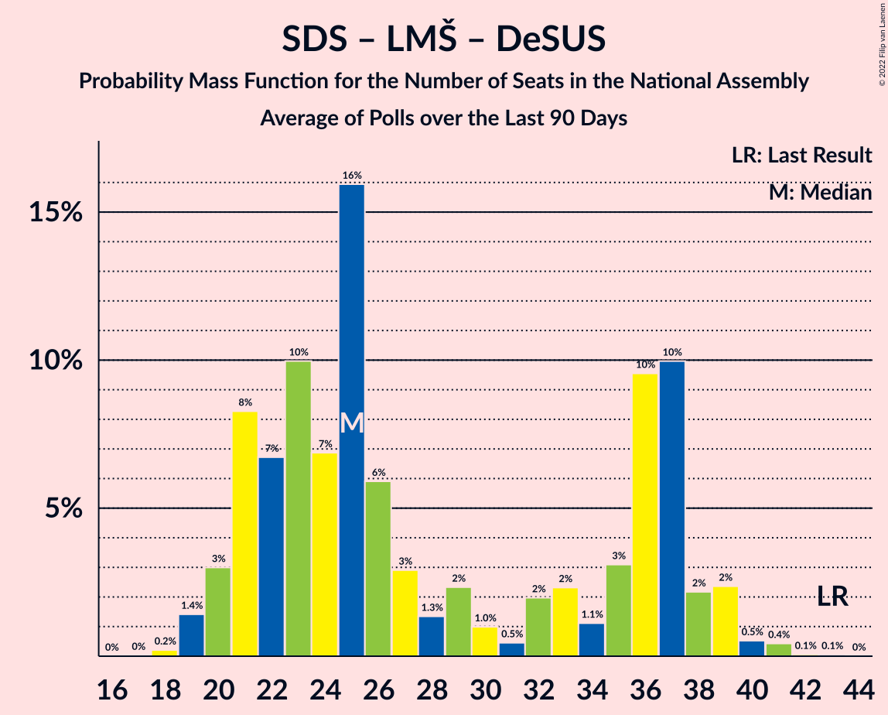

# Poll Average

<a href="#voting-intentions">Voting Intentions</a> | <a href="#seats">Seats</a> | <a href="#coalitions">Coalitions</a> | <a href="#technical-information">Technical Information</a>

## Summary

The table below lists the polls on which the average is based. They are the most recent polls (less than 90 days old) registered and analyzed so far.

| Period     | Polling firm/Commissioner(s) | SDS | LMŠ | SD | SMC | Levica | NSi | SAB | DeSUS | SNS | SLS | GOD–NLS | GOD | NLS | DL | PS | HIM | PSS | DD | AČZS | ND | GS | Z.DEJ | K | PoS | LIDE | Res | VESNA |
|:----------:|:----------------------------:|:--:|:--:|:--:|:--:|:--:|:--:|:--:|:--:|:--:|:--:|:--:|:--:|:--:|:--:|:--:|:--:|:--:|:--:|:--:|:--:|:--:|:--:|:--:|:--:|:--:|:--:|:--:|
| 3 June 2018 | General Election | 24.9%   25 | 12.6%   13 | 9.9%   10 | 9.7%   10 | 9.3%   9 | 7.2%   7 | 5.1%   5 | 4.9%   5 | 4.2%   4 | 2.6%   0 | 0.2%   0 | 0.2%   0 | 0.2%   0 | 0.0%   0 | 0.0%   0 | 0.0%   2 | 2.2%   0 | 1.5%   0 | 1.1%   0 | 0.0%   0 | 0.0%   0 | 0.0%   0 | 0.0%   0 | 0.0%   0 | 0.0%   0 | 0.0%   0 | 0.0%   0 |
| N/A | Poll Average | 17–34%   16–33 | 4–9%   0–9 | 8–12%   7–12 | N/A   N/A | 6–10%   5–11 | 3–8%   0–9 | 1–5%   0–5 | 0–2%   0 | 1–4%   0 | N/A   N/A | N/A   N/A | N/A   N/A | N/A   N/A | N/A   N/A | N/A   N/A | N/A   N/A | 0–4%   0–4 | 1–2%   0 | N/A   N/A | 2–6%   0–6 | 16–29%   16–31 | N/A   N/A | N/A   N/A | 3–6%   0–6 | N/A   N/A | N/A   N/A | N/A   N/A |
| [14–16 February 2022](2022-02-16-Parsifal.html) | Parsifal   Nova24TV | 28–35%   27–34 | 5–8%   4–7 | 8–13%   8–12 | N/A   N/A | 7–11%   7–10 | 3–6%   0–5 | 1–3%   0 | 0–2%   0 | 1–4%   0 | N/A   N/A | N/A   N/A | N/A   N/A | N/A   N/A | N/A   N/A | N/A   N/A | N/A   N/A | 1–4%   0 | 1–2%   0 | N/A   N/A | 3–5%   0–5 | 15–21%   16–21 | N/A   N/A | N/A   N/A | 3–6%   0–6 | N/A   N/A | N/A   N/A | N/A   N/A |
| [7–10 February 2022](2022-02-10-Ninamedia.html) | Ninamedia   Dnvnk, Včr, PrmNvc, Svt24 | 22–27%   21–28 | 6–9%   6–9 | 8–11%   7–11 | N/A   N/A | 7–10%   7–11 | 4–7%   0–6 | 3–5%   0–5 | 1–2%   0 | 0–2%   0 | N/A   N/A | N/A   N/A | N/A   N/A | N/A   N/A | N/A   N/A | N/A   N/A | N/A   N/A | 0–2%   0 | 1–2%   0 | N/A   N/A | 2–4%   0 | 25–30%   24–31 | N/A   N/A | N/A   N/A | 3–5%   0–4 | N/A   N/A | N/A   N/A | N/A   N/A |
| [7–10 February 2022](2022-02-10-Mediana.html) | Mediana   Delo | 16–22%   16–24 | 3–7%   0–7 | 7–12%   7–12 | N/A   N/A | 5–9%   5–9 | 5–9%   4–10 | 2–5%   0–5 | 1–2%   0 | 1–4%   0 | N/A   N/A | N/A   N/A | N/A   N/A | N/A   N/A | N/A   N/A | N/A   N/A | N/A   N/A | 2–5%   0–5 | 1–2%   0 | N/A   N/A | 3–6%   0–6 | 23–29%   22–31 | N/A   N/A | N/A   N/A | 3–7%   0–6 | N/A   N/A | N/A   N/A | N/A   N/A |
| 3 June 2018 | General Election | 24.9%   25 | 12.6%   13 | 9.9%   10 | 9.7%   10 | 9.3%   9 | 7.2%   7 | 5.1%   5 | 4.9%   5 | 4.2%   4 | 2.6%   0 | 0.2%   0 | 0.2%   0 | 0.2%   0 | 0.0%   0 | 0.0%   0 | 0.0%   2 | 2.2%   0 | 1.5%   0 | 1.1%   0 | 0.0%   0 | 0.0%   0 | 0.0%   0 | 0.0%   0 | 0.0%   0 | 0.0%   0 | 0.0%   0 | 0.0%   0 |

Only polls for which at least the sample size has been published are included in the table above.

**Legend:**
+ **Top half of each row:** Voting intentions (95% confidence interval)
+ **Bottom half of each row:** Seat projections for the National Assembly (95% confidence interval)
+ **SDS:** Slovenska demokratska stranka
+ **LMŠ:** Lista Marjana Šarca
+ **SD:** Socialni demokrati
+ **SMC:** Stranka modernega centra
+ **Levica:** Levica
+ **NSi:** Nova Slovenija–Krščanski demokrati
+ **SAB:** Stranka Alenke Bratušek
+ **DeSUS:** Demokratična stranka upokojencev Slovenije
+ **SNS:** Slovenska nacionalna stranka
+ **SLS:** Slovenska ljudska stranka
+ **GOD–NLS:** Glas za otroke in družine–Nova ljudska stranka Slovenije
+ **GOD:** Glas za otroke in družine
+ **NLS:** Nova ljudska stranka Slovenije
+ **DL:** Državljanska lista
+ **PS:** Pozitivna Slovenija
+ **HIM:** Hungarian and Italian minorities
+ **PSS:** Piratska stranka Slovenije
+ **DD:** Dobra država
+ **AČZS:** Andrej Čuš in Zeleni Slovenije
+ **ND:** Naša dežela
+ **GS:** Gibanje Svoboda
+ **Z.DEJ:** Zelena dejanja
+ **K:** Konkretno
+ **PoS:** Povežimo Slovenijo
+ **LIDE:** Liberalni demokrati
+ **Res:** Resni.ca
+ **VESNA:** VESNA–Zelena stranka
+ **N/A (single party):** Party not included the published results
+ **N/A (entire row):** Calculation for this opinion poll not started yet

## Voting Intentions

### Confidence Intervals

| Party | Last Result | Median | 80% Confidence Interval | 90% Confidence Interval | 95% Confidence Interval | 99% Confidence Interval |
|:-----:|:-----------:|:------:|:-----------------------:|:-----------------------:|:-----------------------:|:-----------------------:|
| <a href="#slovenska-demokratska-stranka">Slovenska demokratska stranka</a> | 24.9% | 24.1% | 18.4–32.0% |17.7–32.9% | 17.2–33.6% | 16.1–34.9% |
| <a href="#lista-marjana-šarca">Lista Marjana Šarca</a> | 12.6% | 6.2% | 4.4–8.2% |4.1–8.6% | 3.8–8.9% | 3.3–9.6% |
| <a href="#socialni-demokrati">Socialni demokrati</a> | 9.9% | 9.6% | 8.2–11.2% |7.9–11.7% | 7.6–12.1% | 7.0–13.0% |
| <a href="#stranka-modernega-centra">Stranka modernega centra</a> | 9.7% | N/A | N/A |N/A | N/A | N/A |
| <a href="#levica">Levica</a> | 9.3% | 8.2% | 6.6–9.6% |6.2–10.1% | 5.8–10.4% | 5.2–11.2% |
| <a href="#nova-slovenija–krščanski-demokrati">Nova Slovenija–Krščanski demokrati</a> | 7.2% | 5.6% | 3.7–7.4% |3.3–7.9% | 3.1–8.3% | 2.6–9.1% |
| <a href="#stranka-alenke-bratušek">Stranka Alenke Bratušek</a> | 5.1% | 3.4% | 1.7–4.5% |1.4–4.8% | 1.3–5.1% | 1.0–5.6% |
| <a href="#demokratična-stranka-upokojencev-slovenije">Demokratična stranka upokojencev Slovenije</a> | 4.9% | 1.0% | 0.6–1.7% |0.5–1.9% | 0.4–2.1% | 0.3–2.5% |
| <a href="#slovenska-nacionalna-stranka">Slovenska nacionalna stranka</a> | 4.2% | 2.0% | 0.8–3.1% |0.6–3.3% | 0.6–3.6% | 0.4–4.1% |
| <a href="#slovenska-ljudska-stranka">Slovenska ljudska stranka</a> | 2.6% | N/A | N/A |N/A | N/A | N/A |
| <a href="#piratska-stranka-slovenije">Piratska stranka Slovenije</a> | 2.2% | 2.3% | 0.7–3.6% |0.6–3.9% | 0.5–4.2% | 0.4–4.8% |
| <a href="#dobra-država">Dobra država</a> | 1.5% | 1.2% | 0.7–1.8% |0.6–2.0% | 0.6–2.2% | 0.4–2.6% |
| <a href="#andrej-čuš-in-zeleni-slovenije">Andrej Čuš in Zeleni Slovenije</a> | 1.1% | N/A | N/A |N/A | N/A | N/A |
| <a href="#glas-za-otroke-in-družine–nova-ljudska-stranka-slovenije">Glas za otroke in družine–Nova ljudska stranka Slovenije</a> | 0.2% | N/A | N/A |N/A | N/A | N/A |
| <a href="#glas-za-otroke-in-družine">Glas za otroke in družine</a> | 0.2% | N/A | N/A |N/A | N/A | N/A |
| <a href="#nova-ljudska-stranka-slovenije">Nova ljudska stranka Slovenije</a> | 0.2% | N/A | N/A |N/A | N/A | N/A |
| <a href="#državljanska-lista">Državljanska lista</a> | 0.0% | N/A | N/A |N/A | N/A | N/A |
| <a href="#pozitivna-slovenija">Pozitivna Slovenija</a> | 0.0% | N/A | N/A |N/A | N/A | N/A |
| <a href="#hungarian-and-italian-minorities">Hungarian and Italian minorities</a> | 0.0% | N/A | N/A |N/A | N/A | N/A |
| <a href="#naša-dežela">Naša dežela</a> | 0.0% | 3.7% | 2.2–5.1% |2.0–5.5% | 1.8–5.9% | 1.5–6.5% |
| <a href="#gibanje-svoboda">Gibanje Svoboda</a> | 0.0% | 25.4% | 17.2–28.3% |16.4–28.9% | 15.9–29.4% | 14.9–30.4% |
| <a href="#zelena-dejanja">Zelena dejanja</a> | 0.0% | N/A | N/A |N/A | N/A | N/A |
| <a href="#konkretno">Konkretno</a> | 0.0% | N/A | N/A |N/A | N/A | N/A |
| <a href="#povežimo-slovenijo">Povežimo Slovenijo</a> | 0.0% | 4.4% | 3.5–5.6% |3.3–6.0% | 3.1–6.3% | 2.7–6.9% |
| <a href="#liberalni-demokrati">Liberalni demokrati</a> | 0.0% | N/A | N/A |N/A | N/A | N/A |
| <a href="#resni.ca">Resni.ca</a> | 0.0% | N/A | N/A |N/A | N/A | N/A |
| <a href="#vesna–zelena-stranka">VESNA–Zelena stranka</a> | 0.0% | N/A | N/A |N/A | N/A | N/A |

### Slovenska demokratska stranka

*For a full overview of the results for this party, see the [Slovenska demokratska stranka](party-slovenskademokratskastranka.html) page.*

| Voting Intentions | Probability | Accumulated | Special Marks |
|:-----------------:|:-----------:|:-----------:|:-------------:|
| 13.5–14.5% | 0% | 100% |  |
| 14.5–15.5% | 0.1% | 100% |  |
| 15.5–16.5% | 0.9% | 99.9% |  |
| 16.5–17.5% | 3% | 99.0% |  |
| 17.5–18.5% | 7% | 96% |  |
| 18.5–19.5% | 9% | 89% |  |
| 19.5–20.5% | 7% | 80% |  |
| 20.5–21.5% | 5% | 73% |  |
| 21.5–22.5% | 5% | 68% |  |
| 22.5–23.5% | 8% | 63% |  |
| 23.5–24.5% | 10% | 56% | Median |
| 24.5–25.5% | 8% | 46% | Last Result |
| 25.5–26.5% | 4% | 38% |  |
| 26.5–27.5% | 2% | 34% |  |
| 27.5–28.5% | 2% | 33% |  |
| 28.5–29.5% | 4% | 31% |  |
| 29.5–30.5% | 6% | 27% |  |
| 30.5–31.5% | 8% | 21% |  |
| 31.5–32.5% | 6% | 13% |  |
| 32.5–33.5% | 4% | 7% |  |
| 33.5–34.5% | 2% | 3% |  |
| 34.5–35.5% | 0.6% | 0.8% |  |
| 35.5–36.5% | 0.2% | 0.2% |  |
| 36.5–37.5% | 0% | 0% |  |

### Lista Marjana Šarca

*For a full overview of the results for this party, see the [Lista Marjana Šarca](party-listamarjanašarca.html) page.*

| Voting Intentions | Probability | Accumulated | Special Marks |
|:-----------------:|:-----------:|:-----------:|:-------------:|
| 1.5–2.5% | 0% | 100% |  |
| 2.5–3.5% | 1.2% | 100% |  |
| 3.5–4.5% | 11% | 98.8% |  |
| 4.5–5.5% | 22% | 88% |  |
| 5.5–6.5% | 23% | 65% | Median |
| 6.5–7.5% | 21% | 42% |  |
| 7.5–8.5% | 16% | 21% |  |
| 8.5–9.5% | 5% | 5% |  |
| 9.5–10.5% | 0.5% | 0.5% |  |
| 10.5–11.5% | 0% | 0% |  |
| 11.5–12.5% | 0% | 0% |  |
| 12.5–13.5% | 0% | 0% | Last Result |

### Socialni demokrati

*For a full overview of the results for this party, see the [Socialni demokrati](party-socialnidemokrati.html) page.*

| Voting Intentions | Probability | Accumulated | Special Marks |
|:-----------------:|:-----------:|:-----------:|:-------------:|
| 4.5–5.5% | 0% | 100% |  |
| 5.5–6.5% | 0.1% | 100% |  |
| 6.5–7.5% | 2% | 99.9% |  |
| 7.5–8.5% | 14% | 98% |  |
| 8.5–9.5% | 32% | 83% |  |
| 9.5–10.5% | 30% | 51% | Last Result, Median |
| 10.5–11.5% | 15% | 22% |  |
| 11.5–12.5% | 5% | 6% |  |
| 12.5–13.5% | 1.1% | 1.2% |  |
| 13.5–14.5% | 0.1% | 0.2% |  |
| 14.5–15.5% | 0% | 0% |  |

### Levica

*For a full overview of the results for this party, see the [Levica](party-levica.html) page.*

| Voting Intentions | Probability | Accumulated | Special Marks |
|:-----------------:|:-----------:|:-----------:|:-------------:|
| 3.5–4.5% | 0% | 100% |  |
| 4.5–5.5% | 1.3% | 100% |  |
| 5.5–6.5% | 8% | 98.7% |  |
| 6.5–7.5% | 21% | 90% |  |
| 7.5–8.5% | 32% | 69% | Median |
| 8.5–9.5% | 26% | 37% | Last Result |
| 9.5–10.5% | 9% | 11% |  |
| 10.5–11.5% | 2% | 2% |  |
| 11.5–12.5% | 0.2% | 0.2% |  |
| 12.5–13.5% | 0% | 0% |  |

### Nova Slovenija–Krščanski demokrati

*For a full overview of the results for this party, see the [Nova Slovenija–Krščanski demokrati](party-novaslovenija–krščanskidemokrati.html) page.*

| Voting Intentions | Probability | Accumulated | Special Marks |
|:-----------------:|:-----------:|:-----------:|:-------------:|
| 0.5–1.5% | 0% | 100% |  |
| 1.5–2.5% | 0.3% | 100% |  |
| 2.5–3.5% | 8% | 99.7% |  |
| 3.5–4.5% | 18% | 92% |  |
| 4.5–5.5% | 22% | 73% |  |
| 5.5–6.5% | 26% | 51% | Median |
| 6.5–7.5% | 17% | 25% | Last Result |
| 7.5–8.5% | 7% | 8% |  |
| 8.5–9.5% | 1.4% | 2% |  |
| 9.5–10.5% | 0.2% | 0.2% |  |
| 10.5–11.5% | 0% | 0% |  |

### Stranka Alenke Bratušek

*For a full overview of the results for this party, see the [Stranka Alenke Bratušek](party-strankaalenkebratušek.html) page.*

| Voting Intentions | Probability | Accumulated | Special Marks |
|:-----------------:|:-----------:|:-----------:|:-------------:|
| 0.0–0.5% | 0% | 100% |  |
| 0.5–1.5% | 8% | 100% |  |
| 1.5–2.5% | 23% | 92% |  |
| 2.5–3.5% | 26% | 69% | Median |
| 3.5–4.5% | 34% | 43% |  |
| 4.5–5.5% | 9% | 9% | Last Result |
| 5.5–6.5% | 0.6% | 0.6% |  |
| 6.5–7.5% | 0% | 0% |  |

### Demokratična stranka upokojencev Slovenije

*For a full overview of the results for this party, see the [Demokratična stranka upokojencev Slovenije](party-demokratičnastrankaupokojencevslovenije.html) page.*

| Voting Intentions | Probability | Accumulated | Special Marks |
|:-----------------:|:-----------:|:-----------:|:-------------:|
| 0.0–0.5% | 8% | 100% |  |
| 0.5–1.5% | 78% | 92% | Median |
| 1.5–2.5% | 14% | 14% |  |
| 2.5–3.5% | 0.5% | 0.5% |  |
| 3.5–4.5% | 0% | 0% |  |
| 4.5–5.5% | 0% | 0% | Last Result |

### Slovenska nacionalna stranka

*For a full overview of the results for this party, see the [Slovenska nacionalna stranka](party-slovenskanacionalnastranka.html) page.*

| Voting Intentions | Probability | Accumulated | Special Marks |
|:-----------------:|:-----------:|:-----------:|:-------------:|
| 0.0–0.5% | 2% | 100% |  |
| 0.5–1.5% | 33% | 98% |  |
| 1.5–2.5% | 38% | 65% | Median |
| 2.5–3.5% | 25% | 27% |  |
| 3.5–4.5% | 3% | 3% | Last Result |
| 4.5–5.5% | 0.1% | 0.1% |  |
| 5.5–6.5% | 0% | 0% |  |

### Piratska stranka Slovenije

*For a full overview of the results for this party, see the [Piratska stranka Slovenije](party-piratskastrankaslovenije.html) page.*

| Voting Intentions | Probability | Accumulated | Special Marks |
|:-----------------:|:-----------:|:-----------:|:-------------:|
| 0.0–0.5% | 4% | 100% |  |
| 0.5–1.5% | 30% | 96% |  |
| 1.5–2.5% | 25% | 65% | Last Result, Median |
| 2.5–3.5% | 30% | 40% |  |
| 3.5–4.5% | 10% | 11% |  |
| 4.5–5.5% | 1.0% | 1.1% |  |
| 5.5–6.5% | 0% | 0% |  |
| 6.5–7.5% | 0% | 0% |  |

### Dobra država

*For a full overview of the results for this party, see the [Dobra država](party-dobradržava.html) page.*

| Voting Intentions | Probability | Accumulated | Special Marks |
|:-----------------:|:-----------:|:-----------:|:-------------:|
| 0.0–0.5% | 2% | 100% |  |
| 0.5–1.5% | 77% | 98% | Median |
| 1.5–2.5% | 20% | 21% | Last Result |
| 2.5–3.5% | 0.7% | 0.7% |  |
| 3.5–4.5% | 0% | 0% |  |

### Gibanje Svoboda

*For a full overview of the results for this party, see the [Gibanje Svoboda](party-gibanjesvoboda.html) page.*

| Voting Intentions | Probability | Accumulated | Special Marks |
|:-----------------:|:-----------:|:-----------:|:-------------:|
| 0.0–0.5% | 0% | 100% | Last Result |
| 0.5–1.5% | 0% | 100% |  |
| 1.5–2.5% | 0% | 100% |  |
| 2.5–3.5% | 0% | 100% |  |
| 3.5–4.5% | 0% | 100% |  |
| 4.5–5.5% | 0% | 100% |  |
| 5.5–6.5% | 0% | 100% |  |
| 6.5–7.5% | 0% | 100% |  |
| 7.5–8.5% | 0% | 100% |  |
| 8.5–9.5% | 0% | 100% |  |
| 9.5–10.5% | 0% | 100% |  |
| 10.5–11.5% | 0% | 100% |  |
| 11.5–12.5% | 0% | 100% |  |
| 12.5–13.5% | 0% | 100% |  |
| 13.5–14.5% | 0.2% | 100% |  |
| 14.5–15.5% | 1.3% | 99.8% |  |
| 15.5–16.5% | 4% | 98.5% |  |
| 16.5–17.5% | 8% | 94% |  |
| 17.5–18.5% | 9% | 87% |  |
| 18.5–19.5% | 7% | 78% |  |
| 19.5–20.5% | 3% | 71% |  |
| 20.5–21.5% | 1.1% | 68% |  |
| 21.5–22.5% | 0.9% | 67% |  |
| 22.5–23.5% | 2% | 66% |  |
| 23.5–24.5% | 6% | 64% |  |
| 24.5–25.5% | 10% | 58% | Median |
| 25.5–26.5% | 14% | 48% |  |
| 26.5–27.5% | 15% | 33% |  |
| 27.5–28.5% | 11% | 18% |  |
| 28.5–29.5% | 5% | 7% |  |
| 29.5–30.5% | 2% | 2% |  |
| 30.5–31.5% | 0.3% | 0.4% |  |
| 31.5–32.5% | 0% | 0.1% |  |
| 32.5–33.5% | 0% | 0% |  |

### Povežimo Slovenijo

*For a full overview of the results for this party, see the [Povežimo Slovenijo](party-povežimoslovenijo.html) page.*

| Voting Intentions | Probability | Accumulated | Special Marks |
|:-----------------:|:-----------:|:-----------:|:-------------:|
| 0.0–0.5% | 0% | 100% | Last Result |
| 0.5–1.5% | 0% | 100% |  |
| 1.5–2.5% | 0.2% | 100% |  |
| 2.5–3.5% | 12% | 99.8% |  |
| 3.5–4.5% | 44% | 88% | Median |
| 4.5–5.5% | 33% | 45% |  |
| 5.5–6.5% | 10% | 11% |  |
| 6.5–7.5% | 1.3% | 1.4% |  |
| 7.5–8.5% | 0.1% | 0.1% |  |
| 8.5–9.5% | 0% | 0% |  |

### Naša dežela

*For a full overview of the results for this party, see the [Naša dežela](party-našadežela.html) page.*

| Voting Intentions | Probability | Accumulated | Special Marks |
|:-----------------:|:-----------:|:-----------:|:-------------:|
| 0.0–0.5% | 0% | 100% | Last Result |
| 0.5–1.5% | 0.5% | 100% |  |
| 1.5–2.5% | 20% | 99.5% |  |
| 2.5–3.5% | 26% | 80% |  |
| 3.5–4.5% | 31% | 54% | Median |
| 4.5–5.5% | 19% | 23% |  |
| 5.5–6.5% | 4% | 5% |  |
| 6.5–7.5% | 0.4% | 0.5% |  |
| 7.5–8.5% | 0% | 0% |  |

## Seats

### Confidence Intervals

| Party | Last Result | Median | 80% Confidence Interval | 90% Confidence Interval | 95% Confidence Interval | 99% Confidence Interval |
|:-----:|:-----------:|:------:|:-----------------------:|:-----------------------:|:-----------------------:|:-----------------------:|
| <a href="#slovenska-demokratska-stranka">Slovenska demokratska stranka</a> | 25 | 23 | 17–33 |16–33 | 16–33 | 16–35 |
| <a href="#lista-marjana-šarca">Lista Marjana Šarca</a> | 13 | 6 | 4–7 |4–8 | 0–9 | 0–9 |
| <a href="#socialni-demokrati">Socialni demokrati</a> | 10 | 9 | 8–11 |7–11 | 7–12 | 6–13 |
| <a href="#stranka-modernega-centra">Stranka modernega centra</a> | 10 | N/A | N/A |N/A | N/A | N/A |
| <a href="#levica">Levica</a> | 9 | 8 | 6–9 |6–10 | 5–11 | 5–11 |
| <a href="#nova-slovenija–krščanski-demokrati">Nova Slovenija–Krščanski demokrati</a> | 7 | 5 | 4–7 |0–8 | 0–9 | 0–10 |
| <a href="#stranka-alenke-bratušek">Stranka Alenke Bratušek</a> | 5 | 0 | 0–4 |0–5 | 0–5 | 0–5 |
| <a href="#demokratična-stranka-upokojencev-slovenije">Demokratična stranka upokojencev Slovenije</a> | 5 | 0 | 0 |0 | 0 | 0 |
| <a href="#slovenska-nacionalna-stranka">Slovenska nacionalna stranka</a> | 4 | 0 | 0 |0 | 0 | 0 |
| <a href="#slovenska-ljudska-stranka">Slovenska ljudska stranka</a> | 0 | N/A | N/A |N/A | N/A | N/A |
| <a href="#piratska-stranka-slovenije">Piratska stranka Slovenije</a> | 0 | 0 | 0 |0 | 0–4 | 0–5 |
| <a href="#dobra-država">Dobra država</a> | 0 | 0 | 0 |0 | 0 | 0 |
| <a href="#andrej-čuš-in-zeleni-slovenije">Andrej Čuš in Zeleni Slovenije</a> | 0 | N/A | N/A |N/A | N/A | N/A |
| <a href="#glas-za-otroke-in-družine–nova-ljudska-stranka-slovenije">Glas za otroke in družine–Nova ljudska stranka Slovenije</a> | 0 | N/A | N/A |N/A | N/A | N/A |
| <a href="#glas-za-otroke-in-družine">Glas za otroke in družine</a> | 0 | N/A | N/A |N/A | N/A | N/A |
| <a href="#nova-ljudska-stranka-slovenije">Nova ljudska stranka Slovenije</a> | 0 | N/A | N/A |N/A | N/A | N/A |
| <a href="#državljanska-lista">Državljanska lista</a> | 0 | N/A | N/A |N/A | N/A | N/A |
| <a href="#pozitivna-slovenija">Pozitivna Slovenija</a> | 0 | N/A | N/A |N/A | N/A | N/A |
| <a href="#hungarian-and-italian-minorities">Hungarian and Italian minorities</a> | 2 | N/A | N/A |N/A | N/A | N/A |
| <a href="#naša-dežela">Naša dežela</a> | 0 | 0 | 0–5 |0–5 | 0–6 | 0–6 |
| <a href="#gibanje-svoboda">Gibanje Svoboda</a> | 0 | 25 | 17–30 |17–30 | 16–31 | 15–31 |
| <a href="#zelena-dejanja">Zelena dejanja</a> | 0 | N/A | N/A |N/A | N/A | N/A |
| <a href="#konkretno">Konkretno</a> | 0 | N/A | N/A |N/A | N/A | N/A |
| <a href="#povežimo-slovenijo">Povežimo Slovenijo</a> | 0 | 4 | 0–6 |0–6 | 0–6 | 0–7 |
| <a href="#liberalni-demokrati">Liberalni demokrati</a> | 0 | N/A | N/A |N/A | N/A | N/A |
| <a href="#resni.ca">Resni.ca</a> | 0 | N/A | N/A |N/A | N/A | N/A |
| <a href="#vesna–zelena-stranka">VESNA–Zelena stranka</a> | 0 | N/A | N/A |N/A | N/A | N/A |

### Slovenska demokratska stranka

*For a full overview of the results for this party, see the [Slovenska demokratska stranka](party-slovenskademokratskastranka.html) page.*

| Number of Seats | Probability | Accumulated | Special Marks |
|:---------------:|:-----------:|:-----------:|:-------------:|
| 15 | 0.2% | 100% |  |
| 16 | 6% | 99.8% |  |
| 17 | 4% | 94% |  |
| 18 | 5% | 90% |  |
| 19 | 3% | 85% |  |
| 20 | 5% | 82% |  |
| 21 | 4% | 77% |  |
| 22 | 6% | 74% |  |
| 23 | 19% | 68% | Median |
| 24 | 3% | 49% |  |
| 25 | 6% | 46% | Last Result |
| 26 | 4% | 41% |  |
| 27 | 2% | 37% |  |
| 28 | 4% | 35% |  |
| 29 | 2% | 31% |  |
| 30 | 13% | 29% |  |
| 31 | 3% | 16% |  |
| 32 | 2% | 13% |  |
| 33 | 9% | 11% |  |
| 34 | 1.1% | 2% |  |
| 35 | 0.4% | 0.8% |  |
| 36 | 0.1% | 0.4% |  |
| 37 | 0.1% | 0.3% |  |
| 38 | 0.1% | 0.3% |  |
| 39 | 0.2% | 0.2% |  |
| 40 | 0% | 0% |  |

### Lista Marjana Šarca

*For a full overview of the results for this party, see the [Lista Marjana Šarca](party-listamarjanašarca.html) page.*

| Number of Seats | Probability | Accumulated | Special Marks |
|:---------------:|:-----------:|:-----------:|:-------------:|
| 0 | 5% | 100% |  |
| 1 | 0% | 95% |  |
| 2 | 0% | 95% |  |
| 3 | 0% | 95% |  |
| 4 | 9% | 95% |  |
| 5 | 23% | 86% |  |
| 6 | 21% | 63% | Median |
| 7 | 36% | 43% |  |
| 8 | 3% | 7% |  |
| 9 | 4% | 4% |  |
| 10 | 0.2% | 0.5% |  |
| 11 | 0.3% | 0.3% |  |
| 12 | 0% | 0% |  |
| 13 | 0% | 0% | Last Result |

### Socialni demokrati

*For a full overview of the results for this party, see the [Socialni demokrati](party-socialnidemokrati.html) page.*

| Number of Seats | Probability | Accumulated | Special Marks |
|:---------------:|:-----------:|:-----------:|:-------------:|
| 6 | 0.7% | 100% |  |
| 7 | 5% | 99.3% |  |
| 8 | 15% | 94% |  |
| 9 | 32% | 80% | Median |
| 10 | 35% | 48% | Last Result |
| 11 | 8% | 13% |  |
| 12 | 4% | 5% |  |
| 13 | 0.6% | 0.7% |  |
| 14 | 0.1% | 0.1% |  |
| 15 | 0% | 0% |  |

### Stranka modernega centra

*For a full overview of the results for this party, see the [Stranka modernega centra](party-strankamodernegacentra.html) page.*

### Levica

*For a full overview of the results for this party, see the [Levica](party-levica.html) page.*

| Number of Seats | Probability | Accumulated | Special Marks |
|:---------------:|:-----------:|:-----------:|:-------------:|
| 4 | 0.1% | 100% |  |
| 5 | 5% | 99.9% |  |
| 6 | 6% | 95% |  |
| 7 | 20% | 89% |  |
| 8 | 36% | 69% | Median |
| 9 | 23% | 32% | Last Result |
| 10 | 6% | 9% |  |
| 11 | 3% | 3% |  |
| 12 | 0.1% | 0.1% |  |
| 13 | 0% | 0% |  |

### Nova Slovenija–Krščanski demokrati

*For a full overview of the results for this party, see the [Nova Slovenija–Krščanski demokrati](party-novaslovenija–krščanskidemokrati.html) page.*

| Number of Seats | Probability | Accumulated | Special Marks |
|:---------------:|:-----------:|:-----------:|:-------------:|
| 0 | 8% | 100% |  |
| 1 | 0% | 92% |  |
| 2 | 0% | 92% |  |
| 3 | 0% | 92% |  |
| 4 | 17% | 92% |  |
| 5 | 28% | 75% | Median |
| 6 | 31% | 47% |  |
| 7 | 7% | 15% | Last Result |
| 8 | 5% | 8% |  |
| 9 | 2% | 4% |  |
| 10 | 1.4% | 1.4% |  |
| 11 | 0% | 0% |  |

### Stranka Alenke Bratušek

*For a full overview of the results for this party, see the [Stranka Alenke Bratušek](party-strankaalenkebratušek.html) page.*

| Number of Seats | Probability | Accumulated | Special Marks |
|:---------------:|:-----------:|:-----------:|:-------------:|
| 0 | 82% | 100% | Median |
| 1 | 0% | 18% |  |
| 2 | 0% | 18% |  |
| 3 | 0% | 18% |  |
| 4 | 10% | 18% |  |
| 5 | 8% | 8% | Last Result |
| 6 | 0.1% | 0.1% |  |
| 7 | 0% | 0% |  |

### Demokratična stranka upokojencev Slovenije

*For a full overview of the results for this party, see the [Demokratična stranka upokojencev Slovenije](party-demokratičnastrankaupokojencevslovenije.html) page.*

| Number of Seats | Probability | Accumulated | Special Marks |
|:---------------:|:-----------:|:-----------:|:-------------:|
| 0 | 100% | 100% | Median |
| 1 | 0% | 0% |  |
| 2 | 0% | 0% |  |
| 3 | 0% | 0% |  |
| 4 | 0% | 0% |  |
| 5 | 0% | 0% | Last Result |

### Slovenska nacionalna stranka

*For a full overview of the results for this party, see the [Slovenska nacionalna stranka](party-slovenskanacionalnastranka.html) page.*

| Number of Seats | Probability | Accumulated | Special Marks |
|:---------------:|:-----------:|:-----------:|:-------------:|
| 0 | 99.5% | 100% | Median |
| 1 | 0% | 0.5% |  |
| 2 | 0% | 0.5% |  |
| 3 | 0% | 0.5% |  |
| 4 | 0.5% | 0.5% | Last Result |
| 5 | 0% | 0% |  |

### Slovenska ljudska stranka

*For a full overview of the results for this party, see the [Slovenska ljudska stranka](party-slovenskaljudskastranka.html) page.*

### Piratska stranka Slovenije

*For a full overview of the results for this party, see the [Piratska stranka Slovenije](party-piratskastrankaslovenije.html) page.*

| Number of Seats | Probability | Accumulated | Special Marks |
|:---------------:|:-----------:|:-----------:|:-------------:|
| 0 | 96% | 100% | Last Result, Median |
| 1 | 0% | 4% |  |
| 2 | 0% | 4% |  |
| 3 | 0% | 4% |  |
| 4 | 3% | 4% |  |
| 5 | 0.9% | 0.9% |  |
| 6 | 0% | 0% |  |

### Dobra država

*For a full overview of the results for this party, see the [Dobra država](party-dobradržava.html) page.*

| Number of Seats | Probability | Accumulated | Special Marks |
|:---------------:|:-----------:|:-----------:|:-------------:|
| 0 | 100% | 100% | Last Result, Median |

### Andrej Čuš in Zeleni Slovenije

*For a full overview of the results for this party, see the [Andrej Čuš in Zeleni Slovenije](party-andrejčušinzelenislovenije.html) page.*

### Glas za otroke in družine–Nova ljudska stranka Slovenije

*For a full overview of the results for this party, see the [Glas za otroke in družine–Nova ljudska stranka Slovenije](party-glaszaotrokeindružine–novaljudskastrankaslovenije.html) page.*

### Glas za otroke in družine

*For a full overview of the results for this party, see the [Glas za otroke in družine](party-glaszaotrokeindružine.html) page.*

### Nova ljudska stranka Slovenije

*For a full overview of the results for this party, see the [Nova ljudska stranka Slovenije](party-novaljudskastrankaslovenije.html) page.*

### Državljanska lista

*For a full overview of the results for this party, see the [Državljanska lista](party-državljanskalista.html) page.*

### Pozitivna Slovenija

*For a full overview of the results for this party, see the [Pozitivna Slovenija](party-pozitivnaslovenija.html) page.*

### Hungarian and Italian minorities

*For a full overview of the results for this party, see the [Hungarian and Italian minorities](party-hungariananditalianminorities.html) page.*

### Naša dežela

*For a full overview of the results for this party, see the [Naša dežela](party-našadežela.html) page.*

| Number of Seats | Probability | Accumulated | Special Marks |
|:---------------:|:-----------:|:-----------:|:-------------:|
| 0 | 66% | 100% | Last Result, Median |
| 1 | 0% | 34% |  |
| 2 | 0% | 34% |  |
| 3 | 0.1% | 34% |  |
| 4 | 17% | 34% |  |
| 5 | 13% | 17% |  |
| 6 | 4% | 4% |  |
| 7 | 0.4% | 0.4% |  |
| 8 | 0% | 0% |  |

### Gibanje Svoboda

*For a full overview of the results for this party, see the [Gibanje Svoboda](party-gibanjesvoboda.html) page.*

| Number of Seats | Probability | Accumulated | Special Marks |
|:---------------:|:-----------:|:-----------:|:-------------:|
| 0 | 0% | 100% | Last Result |
| 1 | 0% | 100% |  |
| 2 | 0% | 100% |  |
| 3 | 0% | 100% |  |
| 4 | 0% | 100% |  |
| 5 | 0% | 100% |  |
| 6 | 0% | 100% |  |
| 7 | 0% | 100% |  |
| 8 | 0% | 100% |  |
| 9 | 0% | 100% |  |
| 10 | 0% | 100% |  |
| 11 | 0% | 100% |  |
| 12 | 0% | 100% |  |
| 13 | 0% | 100% |  |
| 14 | 0.2% | 100% |  |
| 15 | 0.6% | 99.8% |  |
| 16 | 4% | 99.2% |  |
| 17 | 11% | 95% |  |
| 18 | 2% | 84% |  |
| 19 | 13% | 81% |  |
| 20 | 0.9% | 69% |  |
| 21 | 0.9% | 68% |  |
| 22 | 0.9% | 67% |  |
| 23 | 6% | 66% |  |
| 24 | 2% | 60% |  |
| 25 | 10% | 58% | Median |
| 26 | 6% | 48% |  |
| 27 | 9% | 42% |  |
| 28 | 5% | 33% |  |
| 29 | 10% | 28% |  |
| 30 | 14% | 18% |  |
| 31 | 3% | 3% |  |
| 32 | 0.2% | 0.3% |  |
| 33 | 0.1% | 0.1% |  |
| 34 | 0% | 0% |  |

### Zelena dejanja

*For a full overview of the results for this party, see the [Zelena dejanja](party-zelenadejanja.html) page.*

### Konkretno

*For a full overview of the results for this party, see the [Konkretno](party-konkretno.html) page.*

### Povežimo Slovenijo

*For a full overview of the results for this party, see the [Povežimo Slovenijo](party-povežimoslovenijo.html) page.*

| Number of Seats | Probability | Accumulated | Special Marks |
|:---------------:|:-----------:|:-----------:|:-------------:|
| 0 | 25% | 100% | Last Result |
| 1 | 0% | 75% |  |
| 2 | 0% | 75% |  |
| 3 | 0% | 75% |  |
| 4 | 47% | 75% | Median |
| 5 | 15% | 27% |  |
| 6 | 12% | 12% |  |
| 7 | 0.8% | 0.8% |  |
| 8 | 0% | 0.1% |  |
| 9 | 0% | 0% |  |

### Liberalni demokrati

*For a full overview of the results for this party, see the [Liberalni demokrati](party-liberalnidemokrati.html) page.*

### Resni.ca

*For a full overview of the results for this party, see the [Resni.ca](party-resnica.html) page.*

### VESNA–Zelena stranka

*For a full overview of the results for this party, see the [VESNA–Zelena stranka](party-vesna–zelenastranka.html) page.*

## Coalitions

### Confidence Intervals

| Coalition | Last Result | Median | Majority? | 80% Confidence Interval | 90% Confidence Interval | 95% Confidence Interval | 99% Confidence Interval |
|:---------:|:-----------:|:------:|:---------:|:-----------------------:|:-----------------------:|:-----------------------:|:-----------------------:|
| Slovenska demokratska stranka – Lista Marjana Šarca – Demokratična stranka upokojencev Slovenije | 43 | 30 | 0.1% | 21–38 | 21–39 | 20–39 | 18–41 |
| Slovenska demokratska stranka – Lista Marjana Šarca | 38 | 30 | 0.1% | 21–38 | 21–39 | 20–39 | 18–41 |
| Slovenska demokratska stranka – Nova Slovenija–Krščanski demokrati – Demokratična stranka upokojencev Slovenije – Slovenska ljudska stranka – Državljanska lista | 37 | 29 | 0% | 24–36 | 21–37 | 21–38 | 21–39 |
| Lista Marjana Šarca – Socialni demokrati – Stranka modernega centra – Nova Slovenija–Krščanski demokrati – Stranka Alenke Bratušek – Demokratična stranka upokojencev Slovenije | 50 | 21 | 0% | 18–25 | 16–25 | 15–26 | 15–28 |
| Lista Marjana Šarca – Socialni demokrati – Nova Slovenija–Krščanski demokrati – Demokratična stranka upokojencev Slovenije | 35 | 21 | 0% | 17–23 | 16–24 | 15–25 | 14–25 |
| Lista Marjana Šarca – Socialni demokrati – Stranka modernega centra – Nova Slovenija–Krščanski demokrati – Demokratična stranka upokojencev Slovenije | 45 | 21 | 0% | 17–23 | 16–24 | 15–25 | 14–25 |
| Lista Marjana Šarca – Socialni demokrati – Nova Slovenija–Krščanski demokrati | 30 | 21 | 0% | 17–23 | 16–24 | 15–25 | 14–25 |
| Lista Marjana Šarca – Socialni demokrati – Stranka modernega centra – Nova Slovenija–Krščanski demokrati | 40 | 21 | 0% | 17–23 | 16–24 | 15–25 | 14–25 |
| Lista Marjana Šarca – Socialni demokrati – Stranka modernega centra – Stranka Alenke Bratušek – Demokratična stranka upokojencev Slovenije | 43 | 16 | 0% | 13–19 | 12–20 | 10–20 | 9–22 |
| Lista Marjana Šarca – Socialni demokrati – Demokratična stranka upokojencev Slovenije | 28 | 16 | 0% | 13–18 | 11–18 | 10–19 | 9–20 |
| Lista Marjana Šarca – Socialni demokrati – Stranka modernega centra – Demokratična stranka upokojencev Slovenije | 38 | 16 | 0% | 13–18 | 11–18 | 10–19 | 9–20 |
| Lista Marjana Šarca – Socialni demokrati | 23 | 16 | 0% | 13–18 | 11–18 | 10–19 | 9–20 |
| Lista Marjana Šarca – Socialni demokrati – Stranka modernega centra | 33 | 16 | 0% | 13–18 | 11–18 | 10–19 | 9–20 |
| Socialni demokrati – Demokratična stranka upokojencev Slovenije – Državljanska lista – Pozitivna Slovenija | 15 | 9 | 0% | 8–11 | 7–11 | 7–12 | 6–13 |
| Socialni demokrati – Stranka modernega centra – Demokratična stranka upokojencev Slovenije | 25 | 9 | 0% | 8–11 | 7–11 | 7–12 | 6–13 |
| Socialni demokrati – Stranka modernega centra – Pozitivna Slovenija | 20 | 9 | 0% | 8–11 | 7–11 | 7–12 | 6–13 |

### Slovenska demokratska stranka – Lista Marjana Šarca – Demokratična stranka upokojencev Slovenije

| Number of Seats | Probability | Accumulated | Special Marks |
|:---------------:|:-----------:|:-----------:|:-------------:|
| 16 | 0.1% | 100% |  |
| 17 | 0.1% | 99.9% |  |
| 18 | 1.1% | 99.8% |  |
| 19 | 0.4% | 98.7% |  |
| 20 | 3% | 98% |  |
| 21 | 6% | 96% |  |
| 22 | 4% | 89% |  |
| 23 | 3% | 85% |  |
| 24 | 3% | 82% |  |
| 25 | 1.0% | 79% |  |
| 26 | 4% | 78% |  |
| 27 | 4% | 74% |  |
| 28 | 4% | 70% |  |
| 29 | 2% | 66% | Median |
| 30 | 16% | 64% |  |
| 31 | 1.1% | 48% |  |
| 32 | 6% | 47% |  |
| 33 | 2% | 41% |  |
| 34 | 3% | 39% |  |
| 35 | 7% | 36% |  |
| 36 | 9% | 30% |  |
| 37 | 6% | 20% |  |
| 38 | 8% | 14% |  |
| 39 | 4% | 6% |  |
| 40 | 0.6% | 2% |  |
| 41 | 0.5% | 0.9% |  |
| 42 | 0.2% | 0.5% |  |
| 43 | 0.1% | 0.3% | Last Result |
| 44 | 0.1% | 0.2% |  |
| 45 | 0% | 0.1% |  |
| 46 | 0.1% | 0.1% | Majority |
| 47 | 0% | 0% |  |

### Slovenska demokratska stranka – Lista Marjana Šarca

| Number of Seats | Probability | Accumulated | Special Marks |
|:---------------:|:-----------:|:-----------:|:-------------:|
| 16 | 0.1% | 100% |  |
| 17 | 0.1% | 99.9% |  |
| 18 | 1.1% | 99.8% |  |
| 19 | 0.4% | 98.7% |  |
| 20 | 3% | 98% |  |
| 21 | 6% | 96% |  |
| 22 | 4% | 89% |  |
| 23 | 3% | 85% |  |
| 24 | 3% | 82% |  |
| 25 | 1.0% | 79% |  |
| 26 | 4% | 78% |  |
| 27 | 4% | 74% |  |
| 28 | 4% | 70% |  |
| 29 | 2% | 66% | Median |
| 30 | 16% | 64% |  |
| 31 | 1.1% | 48% |  |
| 32 | 6% | 47% |  |
| 33 | 2% | 41% |  |
| 34 | 3% | 39% |  |
| 35 | 7% | 36% |  |
| 36 | 9% | 30% |  |
| 37 | 6% | 20% |  |
| 38 | 8% | 14% | Last Result |
| 39 | 4% | 6% |  |
| 40 | 0.6% | 2% |  |
| 41 | 0.5% | 0.9% |  |
| 42 | 0.2% | 0.5% |  |
| 43 | 0.1% | 0.3% |  |
| 44 | 0.1% | 0.2% |  |
| 45 | 0% | 0.1% |  |
| 46 | 0.1% | 0.1% | Majority |
| 47 | 0% | 0% |  |

### Slovenska demokratska stranka – Nova Slovenija–Krščanski demokrati – Demokratična stranka upokojencev Slovenije – Slovenska ljudska stranka – Državljanska lista

| Number of Seats | Probability | Accumulated | Special Marks |
|:---------------:|:-----------:|:-----------:|:-------------:|
| 20 | 0.1% | 100% |  |
| 21 | 6% | 99.9% |  |
| 22 | 2% | 94% |  |
| 23 | 1.3% | 92% |  |
| 24 | 3% | 91% |  |
| 25 | 2% | 88% |  |
| 26 | 6% | 86% |  |
| 27 | 6% | 80% |  |
| 28 | 7% | 74% | Median |
| 29 | 19% | 67% |  |
| 30 | 4% | 48% |  |
| 31 | 12% | 44% |  |
| 32 | 2% | 32% |  |
| 33 | 2% | 30% |  |
| 34 | 8% | 28% |  |
| 35 | 9% | 20% |  |
| 36 | 1.4% | 11% |  |
| 37 | 6% | 10% | Last Result |
| 38 | 3% | 4% |  |
| 39 | 0.5% | 0.6% |  |
| 40 | 0.1% | 0.1% |  |
| 41 | 0% | 0% |  |

### Lista Marjana Šarca – Socialni demokrati – Stranka modernega centra – Nova Slovenija–Krščanski demokrati – Stranka Alenke Bratušek – Demokratična stranka upokojencev Slovenije

| Number of Seats | Probability | Accumulated | Special Marks |
|:---------------:|:-----------:|:-----------:|:-------------:|
| 12 | 0% | 100% |  |
| 13 | 0.1% | 99.9% |  |
| 14 | 0.2% | 99.8% |  |
| 15 | 3% | 99.5% |  |
| 16 | 3% | 97% |  |
| 17 | 1.4% | 94% |  |
| 18 | 11% | 92% |  |
| 19 | 8% | 81% |  |
| 20 | 7% | 73% | Median |
| 21 | 19% | 66% |  |
| 22 | 8% | 47% |  |
| 23 | 21% | 39% |  |
| 24 | 7% | 19% |  |
| 25 | 9% | 11% |  |
| 26 | 2% | 3% |  |
| 27 | 0.4% | 0.9% |  |
| 28 | 0.5% | 0.6% |  |
| 29 | 0.1% | 0.1% |  |
| 30 | 0% | 0% |  |
| 31 | 0% | 0% |  |
| 32 | 0% | 0% |  |
| 33 | 0% | 0% |  |
| 34 | 0% | 0% |  |
| 35 | 0% | 0% |  |
| 36 | 0% | 0% |  |
| 37 | 0% | 0% |  |
| 38 | 0% | 0% |  |
| 39 | 0% | 0% |  |
| 40 | 0% | 0% |  |
| 41 | 0% | 0% |  |
| 42 | 0% | 0% |  |
| 43 | 0% | 0% |  |
| 44 | 0% | 0% |  |
| 45 | 0% | 0% |  |
| 46 | 0% | 0% | Majority |
| 47 | 0% | 0% |  |
| 48 | 0% | 0% |  |
| 49 | 0% | 0% |  |
| 50 | 0% | 0% | Last Result |

### Lista Marjana Šarca – Socialni demokrati – Nova Slovenija–Krščanski demokrati – Demokratična stranka upokojencev Slovenije

| Number of Seats | Probability | Accumulated | Special Marks |
|:---------------:|:-----------:|:-----------:|:-------------:|
| 12 | 0.1% | 100% |  |
| 13 | 0.3% | 99.9% |  |
| 14 | 1.3% | 99.7% |  |
| 15 | 3% | 98% |  |
| 16 | 3% | 95% |  |
| 17 | 2% | 92% |  |
| 18 | 11% | 90% |  |
| 19 | 9% | 79% |  |
| 20 | 16% | 70% | Median |
| 21 | 20% | 53% |  |
| 22 | 8% | 33% |  |
| 23 | 20% | 25% |  |
| 24 | 3% | 6% |  |
| 25 | 2% | 3% |  |
| 26 | 0.2% | 0.4% |  |
| 27 | 0% | 0.2% |  |
| 28 | 0.1% | 0.1% |  |
| 29 | 0% | 0% |  |
| 30 | 0% | 0% |  |
| 31 | 0% | 0% |  |
| 32 | 0% | 0% |  |
| 33 | 0% | 0% |  |
| 34 | 0% | 0% |  |
| 35 | 0% | 0% | Last Result |

### Lista Marjana Šarca – Socialni demokrati – Stranka modernega centra – Nova Slovenija–Krščanski demokrati – Demokratična stranka upokojencev Slovenije

| Number of Seats | Probability | Accumulated | Special Marks |
|:---------------:|:-----------:|:-----------:|:-------------:|
| 12 | 0.1% | 100% |  |
| 13 | 0.3% | 99.9% |  |
| 14 | 1.3% | 99.7% |  |
| 15 | 3% | 98% |  |
| 16 | 3% | 95% |  |
| 17 | 2% | 92% |  |
| 18 | 11% | 90% |  |
| 19 | 9% | 79% |  |
| 20 | 16% | 70% | Median |
| 21 | 20% | 53% |  |
| 22 | 8% | 33% |  |
| 23 | 20% | 25% |  |
| 24 | 3% | 6% |  |
| 25 | 2% | 3% |  |
| 26 | 0.2% | 0.4% |  |
| 27 | 0% | 0.2% |  |
| 28 | 0.1% | 0.1% |  |
| 29 | 0% | 0% |  |
| 30 | 0% | 0% |  |
| 31 | 0% | 0% |  |
| 32 | 0% | 0% |  |
| 33 | 0% | 0% |  |
| 34 | 0% | 0% |  |
| 35 | 0% | 0% |  |
| 36 | 0% | 0% |  |
| 37 | 0% | 0% |  |
| 38 | 0% | 0% |  |
| 39 | 0% | 0% |  |
| 40 | 0% | 0% |  |
| 41 | 0% | 0% |  |
| 42 | 0% | 0% |  |
| 43 | 0% | 0% |  |
| 44 | 0% | 0% |  |
| 45 | 0% | 0% | Last Result |

### Lista Marjana Šarca – Socialni demokrati – Nova Slovenija–Krščanski demokrati

| Number of Seats | Probability | Accumulated | Special Marks |
|:---------------:|:-----------:|:-----------:|:-------------:|
| 12 | 0.1% | 100% |  |
| 13 | 0.3% | 99.9% |  |
| 14 | 1.3% | 99.7% |  |
| 15 | 3% | 98% |  |
| 16 | 3% | 95% |  |
| 17 | 2% | 92% |  |
| 18 | 11% | 90% |  |
| 19 | 9% | 79% |  |
| 20 | 16% | 70% | Median |
| 21 | 20% | 53% |  |
| 22 | 8% | 33% |  |
| 23 | 20% | 25% |  |
| 24 | 3% | 6% |  |
| 25 | 2% | 3% |  |
| 26 | 0.2% | 0.4% |  |
| 27 | 0% | 0.2% |  |
| 28 | 0.1% | 0.1% |  |
| 29 | 0% | 0% |  |
| 30 | 0% | 0% | Last Result |

### Lista Marjana Šarca – Socialni demokrati – Stranka modernega centra – Nova Slovenija–Krščanski demokrati

| Number of Seats | Probability | Accumulated | Special Marks |
|:---------------:|:-----------:|:-----------:|:-------------:|
| 12 | 0.1% | 100% |  |
| 13 | 0.3% | 99.9% |  |
| 14 | 1.3% | 99.7% |  |
| 15 | 3% | 98% |  |
| 16 | 3% | 95% |  |
| 17 | 2% | 92% |  |
| 18 | 11% | 90% |  |
| 19 | 9% | 79% |  |
| 20 | 16% | 70% | Median |
| 21 | 20% | 53% |  |
| 22 | 8% | 33% |  |
| 23 | 20% | 25% |  |
| 24 | 3% | 6% |  |
| 25 | 2% | 3% |  |
| 26 | 0.2% | 0.4% |  |
| 27 | 0% | 0.2% |  |
| 28 | 0.1% | 0.1% |  |
| 29 | 0% | 0% |  |
| 30 | 0% | 0% |  |
| 31 | 0% | 0% |  |
| 32 | 0% | 0% |  |
| 33 | 0% | 0% |  |
| 34 | 0% | 0% |  |
| 35 | 0% | 0% |  |
| 36 | 0% | 0% |  |
| 37 | 0% | 0% |  |
| 38 | 0% | 0% |  |
| 39 | 0% | 0% |  |
| 40 | 0% | 0% | Last Result |

### Lista Marjana Šarca – Socialni demokrati – Stranka modernega centra – Stranka Alenke Bratušek – Demokratična stranka upokojencev Slovenije

| Number of Seats | Probability | Accumulated | Special Marks |
|:---------------:|:-----------:|:-----------:|:-------------:|
| 8 | 0.1% | 100% |  |
| 9 | 0.6% | 99.9% |  |
| 10 | 2% | 99.3% |  |
| 11 | 0.7% | 97% |  |
| 12 | 2% | 97% |  |
| 13 | 7% | 94% |  |
| 14 | 13% | 88% |  |
| 15 | 10% | 74% | Median |
| 16 | 21% | 64% |  |
| 17 | 18% | 43% |  |
| 18 | 11% | 24% |  |
| 19 | 4% | 13% |  |
| 20 | 7% | 9% |  |
| 21 | 1.2% | 2% |  |
| 22 | 0.5% | 0.6% |  |
| 23 | 0.1% | 0.1% |  |
| 24 | 0% | 0% |  |
| 25 | 0% | 0% |  |
| 26 | 0% | 0% |  |
| 27 | 0% | 0% |  |
| 28 | 0% | 0% |  |
| 29 | 0% | 0% |  |
| 30 | 0% | 0% |  |
| 31 | 0% | 0% |  |
| 32 | 0% | 0% |  |
| 33 | 0% | 0% |  |
| 34 | 0% | 0% |  |
| 35 | 0% | 0% |  |
| 36 | 0% | 0% |  |
| 37 | 0% | 0% |  |
| 38 | 0% | 0% |  |
| 39 | 0% | 0% |  |
| 40 | 0% | 0% |  |
| 41 | 0% | 0% |  |
| 42 | 0% | 0% |  |
| 43 | 0% | 0% | Last Result |

### Lista Marjana Šarca – Socialni demokrati – Demokratična stranka upokojencev Slovenije

| Number of Seats | Probability | Accumulated | Special Marks |
|:---------------:|:-----------:|:-----------:|:-------------:|
| 6 | 0.1% | 100% |  |
| 7 | 0.1% | 99.9% |  |
| 8 | 0.3% | 99.8% |  |
| 9 | 1.2% | 99.6% |  |
| 10 | 3% | 98% |  |
| 11 | 0.9% | 95% |  |
| 12 | 3% | 95% |  |
| 13 | 8% | 92% |  |
| 14 | 14% | 83% |  |
| 15 | 18% | 69% | Median |
| 16 | 21% | 50% |  |
| 17 | 18% | 29% |  |
| 18 | 8% | 11% |  |
| 19 | 2% | 3% |  |
| 20 | 0.5% | 0.7% |  |
| 21 | 0.2% | 0.2% |  |
| 22 | 0% | 0% |  |
| 23 | 0% | 0% |  |
| 24 | 0% | 0% |  |
| 25 | 0% | 0% |  |
| 26 | 0% | 0% |  |
| 27 | 0% | 0% |  |
| 28 | 0% | 0% | Last Result |

### Lista Marjana Šarca – Socialni demokrati – Stranka modernega centra – Demokratična stranka upokojencev Slovenije

| Number of Seats | Probability | Accumulated | Special Marks |
|:---------------:|:-----------:|:-----------:|:-------------:|
| 6 | 0.1% | 100% |  |
| 7 | 0.1% | 99.9% |  |
| 8 | 0.3% | 99.8% |  |
| 9 | 1.2% | 99.6% |  |
| 10 | 3% | 98% |  |
| 11 | 0.9% | 95% |  |
| 12 | 3% | 95% |  |
| 13 | 8% | 92% |  |
| 14 | 14% | 83% |  |
| 15 | 18% | 69% | Median |
| 16 | 21% | 50% |  |
| 17 | 18% | 29% |  |
| 18 | 8% | 11% |  |
| 19 | 2% | 3% |  |
| 20 | 0.5% | 0.7% |  |
| 21 | 0.2% | 0.2% |  |
| 22 | 0% | 0% |  |
| 23 | 0% | 0% |  |
| 24 | 0% | 0% |  |
| 25 | 0% | 0% |  |
| 26 | 0% | 0% |  |
| 27 | 0% | 0% |  |
| 28 | 0% | 0% |  |
| 29 | 0% | 0% |  |
| 30 | 0% | 0% |  |
| 31 | 0% | 0% |  |
| 32 | 0% | 0% |  |
| 33 | 0% | 0% |  |
| 34 | 0% | 0% |  |
| 35 | 0% | 0% |  |
| 36 | 0% | 0% |  |
| 37 | 0% | 0% |  |
| 38 | 0% | 0% | Last Result |

### Lista Marjana Šarca – Socialni demokrati

| Number of Seats | Probability | Accumulated | Special Marks |
|:---------------:|:-----------:|:-----------:|:-------------:|
| 6 | 0.1% | 100% |  |
| 7 | 0.1% | 99.9% |  |
| 8 | 0.3% | 99.8% |  |
| 9 | 1.2% | 99.6% |  |
| 10 | 3% | 98% |  |
| 11 | 0.9% | 95% |  |
| 12 | 3% | 95% |  |
| 13 | 8% | 92% |  |
| 14 | 14% | 83% |  |
| 15 | 18% | 69% | Median |
| 16 | 21% | 50% |  |
| 17 | 18% | 29% |  |
| 18 | 8% | 11% |  |
| 19 | 2% | 3% |  |
| 20 | 0.5% | 0.7% |  |
| 21 | 0.2% | 0.2% |  |
| 22 | 0% | 0% |  |
| 23 | 0% | 0% | Last Result |

### Lista Marjana Šarca – Socialni demokrati – Stranka modernega centra

| Number of Seats | Probability | Accumulated | Special Marks |
|:---------------:|:-----------:|:-----------:|:-------------:|
| 6 | 0.1% | 100% |  |
| 7 | 0.1% | 99.9% |  |
| 8 | 0.3% | 99.8% |  |
| 9 | 1.2% | 99.6% |  |
| 10 | 3% | 98% |  |
| 11 | 0.9% | 95% |  |
| 12 | 3% | 95% |  |
| 13 | 8% | 92% |  |
| 14 | 14% | 83% |  |
| 15 | 18% | 69% | Median |
| 16 | 21% | 50% |  |
| 17 | 18% | 29% |  |
| 18 | 8% | 11% |  |
| 19 | 2% | 3% |  |
| 20 | 0.5% | 0.7% |  |
| 21 | 0.2% | 0.2% |  |
| 22 | 0% | 0% |  |
| 23 | 0% | 0% |  |
| 24 | 0% | 0% |  |
| 25 | 0% | 0% |  |
| 26 | 0% | 0% |  |
| 27 | 0% | 0% |  |
| 28 | 0% | 0% |  |
| 29 | 0% | 0% |  |
| 30 | 0% | 0% |  |
| 31 | 0% | 0% |  |
| 32 | 0% | 0% |  |
| 33 | 0% | 0% | Last Result |

### Socialni demokrati – Demokratična stranka upokojencev Slovenije – Državljanska lista – Pozitivna Slovenija

| Number of Seats | Probability | Accumulated | Special Marks |
|:---------------:|:-----------:|:-----------:|:-------------:|
| 6 | 0.7% | 100% |  |
| 7 | 5% | 99.3% |  |
| 8 | 15% | 94% |  |
| 9 | 32% | 80% | Median |
| 10 | 35% | 48% |  |
| 11 | 8% | 13% |  |
| 12 | 4% | 5% |  |
| 13 | 0.6% | 0.7% |  |
| 14 | 0.1% | 0.1% |  |
| 15 | 0% | 0% | Last Result |

### Socialni demokrati – Stranka modernega centra – Demokratična stranka upokojencev Slovenije

| Number of Seats | Probability | Accumulated | Special Marks |
|:---------------:|:-----------:|:-----------:|:-------------:|
| 6 | 0.7% | 100% |  |
| 7 | 5% | 99.3% |  |
| 8 | 15% | 94% |  |
| 9 | 32% | 80% | Median |
| 10 | 35% | 48% |  |
| 11 | 8% | 13% |  |
| 12 | 4% | 5% |  |
| 13 | 0.6% | 0.7% |  |
| 14 | 0.1% | 0.1% |  |
| 15 | 0% | 0% |  |
| 16 | 0% | 0% |  |
| 17 | 0% | 0% |  |
| 18 | 0% | 0% |  |
| 19 | 0% | 0% |  |
| 20 | 0% | 0% |  |
| 21 | 0% | 0% |  |
| 22 | 0% | 0% |  |
| 23 | 0% | 0% |  |
| 24 | 0% | 0% |  |
| 25 | 0% | 0% | Last Result |

### Socialni demokrati – Stranka modernega centra – Pozitivna Slovenija

| Number of Seats | Probability | Accumulated | Special Marks |
|:---------------:|:-----------:|:-----------:|:-------------:|
| 6 | 0.7% | 100% |  |
| 7 | 5% | 99.3% |  |
| 8 | 15% | 94% |  |
| 9 | 32% | 80% | Median |
| 10 | 35% | 48% |  |
| 11 | 8% | 13% |  |
| 12 | 4% | 5% |  |
| 13 | 0.6% | 0.7% |  |
| 14 | 0.1% | 0.1% |  |
| 15 | 0% | 0% |  |
| 16 | 0% | 0% |  |
| 17 | 0% | 0% |  |
| 18 | 0% | 0% |  |
| 19 | 0% | 0% |  |
| 20 | 0% | 0% | Last Result |

## Technical Information

+ **Number of polls included in this average:** 3
+ **Lowest number of simulations done in a poll included in this average:** 1,048,576
+ **Total number of simulations done in the polls included in this average:** 3,145,728
+ **Error estimate:** 4.08%
