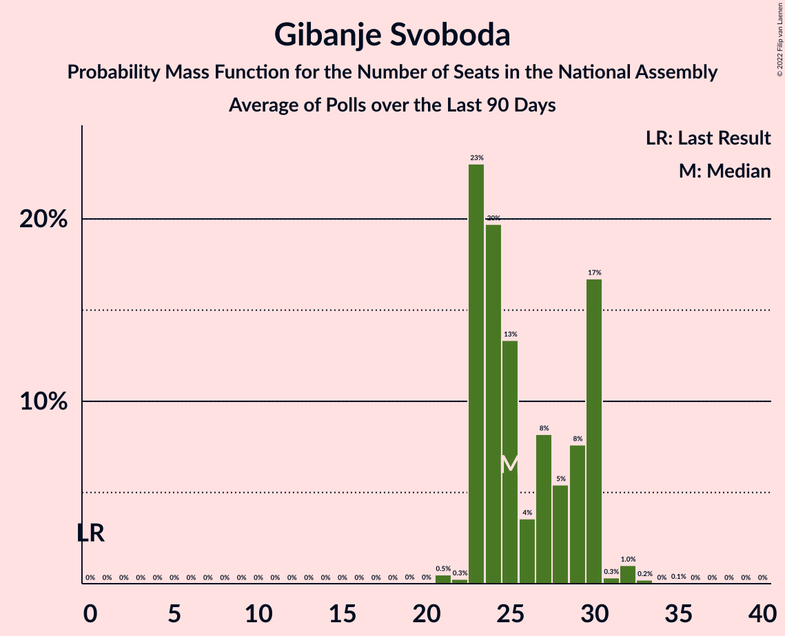

# Gibanje Svoboda

<a href="#voting-intentions">Voting Intentions</a> | <a href="#seats">Seats</a>

## Voting Intentions

Last result: **0.0%** (General Election of 3 June 2018)

### Confidence Intervals

| Period     | Polling firm/Commissioner(s) | Median | 80% Confidence Interval | 90% Confidence Interval | 95% Confidence Interval | 99% Confidence Interval |
|:----------:|:----------------:|:-----------:|:-----------------------:|:-----------------------:|:-----------------------:|:-----------------------:|
| N/A | [Poll Average](average.html) | 27.6% | 25.6–29.7% | 25.1–30.3% | 24.6–30.8% | 23.8–31.8% |
| [20–22 April 2022](2022-04-22-Ninamedia.html) | Ninamedia   Dnevnik, Večer | 27.7% | 25.8–29.6% | 25.3–30.2% | 24.8–30.7% | 24.0–31.6% |
| [19–21 April 2022](2022-04-21-Mediana.html) | Mediana   Delo, POP TV | 26.8% | 25.1–28.6% | 24.6–29.1% | 24.2–29.6% | 23.4–30.5% |
| [14–19 April 2022](2022-04-19-Parsifal.html) | Parsifal   TS media | 28.4% | 26.6–30.3% | 26.1–30.9% | 25.6–31.4% | 24.8–32.3% |
| [13–15 April 2022](2022-04-15-Ninamedia.html) | Ninamedia   Dnevnik, Večer | 27.7% | N/A | N/A | N/A | N/A |
| [4–7 April 2022](2022-04-07-Ninamedia.html) | Ninamedia   Dnvnk, Včr, PrmNvc, Svt24 | 26.9% | 25.1–28.7% | 24.7–29.2% | 24.3–29.6% | 23.5–30.5% |
| [4–7 April 2022](2022-04-07-Mediana.html) | Mediana   Delo, POP TV | 24.5% | 22.9–26.3% | 22.4–26.8% | 22.0–27.3% | 21.2–28.1% |
| [1–5 April 2022](2022-04-05-Parsifal.html) | Parsifal   Nova24TV | 22.7% | 21.0–24.6% | 20.5–25.1% | 20.1–25.6% | 19.2–26.5% |
| [30–31 March 2022](2022-03-31-Mediana.html) | Mediana   RTV SLO | 24.7% | 23.0–26.5% | 22.5–27.0% | 22.1–27.4% | 21.4–28.3% |
| [22–24 March 2022](2022-03-24-Parsifal.html) | Parsifal   Planet TV | 20.6% | 19.1–22.3% | 18.6–22.8% | 18.2–23.2% | 17.5–24.1% |
| [21–24 March 2022](2022-03-24-Ninamedia.html) | Ninamedia   Dnvnk, Včr, PrmNvc, Svt24 | 25.7% | 24.0–27.5% | 23.6–28.0% | 23.2–28.5% | 22.4–29.3% |
| [7–10 March 2022](2022-03-10-Ninamedia.html) | Ninamedia   Dnevnik, Večer | 24.6% | N/A | N/A | N/A | N/A |
| [7–10 March 2022](2022-03-10-Mediana.html) | Mediana   Delo | 23.6% | N/A | N/A | N/A | N/A |
| [28 February–3 March 2022](2022-03-03-Mediana.html) | Mediana   RTV SLO | 22.8% | 21.2–24.5% | 20.7–25.0% | 20.3–25.5% | 19.6–26.3% |
| [23–25 February 2022](2022-02-25-Parsifal.html) | Parsifal   Planet TV | 17.7% | 15.9–19.7% | 15.4–20.3% | 14.9–20.8% | 14.1–21.8% |
| [21–24 February 2022](2022-02-24-Mediana.html) | Mediana   POP TV | 22.9% | 20.9–25.1% | 20.4–25.8% | 19.9–26.3% | 19.0–27.4% |
| [21–23 February 2022](2022-02-23-Ninamedia.html) | Ninamedia   Dnvnk, Včr, PrmNvc, Svt24 | 24.9% | 23.2–26.6% | 22.7–27.1% | 22.3–27.6% | 21.6–28.4% |
| [14 March–17 February 2022](2022-02-17-Parsifal.html) | Parsifal   Nova24TV | 25.8% | N/A | N/A | N/A | N/A |
| [14–16 February 2022](2022-02-16-Parsifal.html) | Parsifal   Nova24TV | 17.8% | 16.1–19.8% | 15.6–20.3% | 15.2–20.8% | 14.4–21.8% |
| [7–10 February 2022](2022-02-10-Ninamedia.html) | Ninamedia   Dnvnk, Včr, PrmNvc, Svt24 | 27.2% | N/A | N/A | N/A | N/A |
| [7–10 February 2022](2022-02-10-Mediana.html) | Mediana   Delo | 25.6% | 23.6–27.8% | 23.0–28.4% | 22.6–29.0% | 21.6–30.0% |
| [31 January–3 February 2022](2022-02-03-Mediana.html) | Mediana   RTV SLO | 0.0% | N/A | N/A | N/A | N/A |
| [1–30 January 2022](2022-01-30-Parsifal.html) | Parsifal   Planet TV | 0.0% | N/A | N/A | N/A | N/A |
| [25–27 January 2022](2022-01-27-Ninamedia.html) | Ninamedia   Dnvnk, Včr, PrmNvc, Svt24 | 0.0% | N/A | N/A | N/A | N/A |
| [17–19 January 2022](2022-01-19-Mediana.html) | Mediana   POP TV | 0.0% | N/A | N/A | N/A | N/A |
| [11–14 January 2022](2022-01-14-Ninamedia.html) | Ninamedia   Dnevnik, Večer | 0.0% | N/A | N/A | N/A | N/A |
| [11–13 January 2022](2022-01-13-Ninamedia.html) | Ninamedia   Dnevnik, Večer | 0.0% | N/A | N/A | N/A | N/A |
| [4–6 January 2022](2022-01-06-Parsifal.html) | Parsifal   Planet TV | 0.4% | N/A | N/A | N/A | N/A |
| [27–29 December 2021](2021-12-29-Mediana.html) | Mediana   RTV SLO | 2.5% | N/A | N/A | N/A | N/A |
| [20–23 December 2021](2021-12-23-Mediana.html) | Mediana   POP TV | 0.0% | N/A | N/A | N/A | N/A |
| [13–16 December 2021](2021-12-16-Parsifal.html) | Parsifal   Nova 24TV | 1.0% | N/A | N/A | N/A | N/A |
| [14–16 December 2021](2021-12-16-Ninamedia.html) | Ninamedia   Dnevnik, Večer | 0.0% | N/A | N/A | N/A | N/A |
| [6–9 December 2021](2021-12-09-Mediana.html) | Mediana   Delo | 0.0% | N/A | N/A | N/A | N/A |
| [2–7 December 2021](2021-12-07-Ninamedia.html) | Ninamedia   Dnevnik, Večer | 0.0% | N/A | N/A | N/A | N/A |
| [29 November–2 December 2021](2021-12-02-Mediana.html) | Mediana   RTV SLO | 6.4% | N/A | N/A | N/A | N/A |
| [1–28 November 2021](2021-11-28-Mediana.html) | Mediana   POP TV | 0.0% | N/A | N/A | N/A | N/A |
| [9–11 November 2021](2021-11-11-Ninamedia.html) | Ninamedia   Dnevnik, Večer | 0.0% | N/A | N/A | N/A | N/A |
| [20 September–4 November 2021](2021-11-04-Parsifal.html) | Parsifal   Nova 24TV | 0.0% | N/A | N/A | N/A | N/A |
| [2–4 November 2021](2021-11-04-Mediana.html) | Mediana   Delo | 0.0% | N/A | N/A | N/A | N/A |
| [1–24 October 2021](2021-10-24-Mediana.html) | Mediana   POP TV | 0.0% | N/A | N/A | N/A | N/A |
| [12–14 October 2021](2021-10-14-Ninamedia.html) | Ninamedia   Dnevnik, Večer | 0.0% | N/A | N/A | N/A | N/A |
| [4–7 October 2021](2021-10-07-Mediana.html) | Mediana   Delo | 0.0% | N/A | N/A | N/A | N/A |
| [1–26 September 2021](2021-09-26-Mediana.html) | Mediana   POP TV | 0.0% | N/A | N/A | N/A | N/A |
| [14–16 September 2021](2021-09-16-Ninamedia.html) | Ninamedia   Dnevnik, Večer | 0.0% | N/A | N/A | N/A | N/A |
| [6–9 September 2021](2021-09-09-Mediana.html) | Mediana   Delo | 0.0% | N/A | N/A | N/A | N/A |
| [30 August–2 September 2021](2021-09-02-Parsifal.html) | Parsifal   Nova 24TV | 0.0% | N/A | N/A | N/A | N/A |
| [1–22 August 2021](2021-08-22-Mediana.html) | Mediana   POP TV | 0.0% | N/A | N/A | N/A | N/A |
| [10–12 August 2021](2021-08-12-Ninamedia.html) | Ninamedia   Dnevnik, Večer | 0.0% | N/A | N/A | N/A | N/A |
| [2–5 August 2021](2021-08-05-Mediana.html) | Mediana   Delo | 0.0% | N/A | N/A | N/A | N/A |
| [1–25 July 2021](2021-07-25-Mediana.html) | Mediana   POP TV | 0.0% | N/A | N/A | N/A | N/A |
| [13–15 July 2021](2021-07-15-Ninamedia.html) | Ninamedia   Dnevnik, Večer | 0.0% | N/A | N/A | N/A | N/A |
| [5–7 July 2021](2021-07-07-Mediana.html) | Mediana   Delo | 0.0% | N/A | N/A | N/A | N/A |
| [1–28 June 2021](2021-06-28-Mediana.html) | Mediana   POP TV | 0.0% | N/A | N/A | N/A | N/A |
| [15–17 June 2021](2021-06-17-Ninamedia.html) | Ninamedia   Dnevnik, Večer | 0.0% | N/A | N/A | N/A | N/A |
| [10–15 June 2021](2021-06-15-Episcenter.html) | Episcenter   Domovina | 0.0% | N/A | N/A | N/A | N/A |
| [7–10 June 2021](2021-06-10-Mediana.html) | Mediana   Delo | 0.0% | N/A | N/A | N/A | N/A |
| [24–26 May 2021](2021-05-26-Parsifal.html) | Parsifal   Planet TV | 0.0% | N/A | N/A | N/A | N/A |
| [1–23 May 2021](2021-05-23-Mediana.html) | Mediana   POP TV | 0.0% | N/A | N/A | N/A | N/A |
| [10–13 May 2021](2021-05-13-Parsifal.html) | Parsifal   Nova 24TV | 0.0% | N/A | N/A | N/A | N/A |
| [11–13 May 2021](2021-05-13-Ninamedia.html) | Ninamedia   Dnevnik, Večer | 0.0% | N/A | N/A | N/A | N/A |
| [3–6 May 2021](2021-05-06-Mediana.html) | Mediana   Delo | 0.0% | N/A | N/A | N/A | N/A |
| [1–25 April 2021](2021-04-25-Mediana.html) | Mediana   POP TV | 0.0% | N/A | N/A | N/A | N/A |
| [13–15 April 2021](2021-04-15-Ninamedia.html) | Ninamedia   Dnevnik, Večer | 0.0% | N/A | N/A | N/A | N/A |
| [12–14 April 2021](2021-04-14-Parsifal.html) | Parsifal   Nova 24TV | 0.0% | N/A | N/A | N/A | N/A |
| [1–28 March 2021](2021-03-28-Mediana.html) | Mediana   POP TV | 0.0% | N/A | N/A | N/A | N/A |
| [8–12 March 2021](2021-03-12-Mediana.html) | Mediana   Delo | 0.0% | N/A | N/A | N/A | N/A |
| [9–11 March 2021](2021-03-11-Ninamedia.html) | Ninamedia   Dnevnik, Večer | 0.0% | N/A | N/A | N/A | N/A |
| [1–4 March 2021](2021-03-04-Parsifal.html) | Parsifal   Nova 24TV | 0.0% | N/A | N/A | N/A | N/A |
| [1–28 February 2021](2021-02-28-Mediana.html) | Mediana   POP TV | 0.0% | N/A | N/A | N/A | N/A |
| [9–11 February 2021](2021-02-11-Ninamedia.html) | Ninamedia   Dnevnik, Večer | 0.0% | N/A | N/A | N/A | N/A |
| [9–11 February 2021](2021-02-11-Mediana.html) | Mediana   Delo | 0.0% | N/A | N/A | N/A | N/A |
| [25–28 January 2021](2021-01-28-Parsifal.html) | Parsifal   Nova 24TV | 0.0% | N/A | N/A | N/A | N/A |
| [8–25 January 2021](2021-01-25-Mediana.html) | Mediana   Delo | 0.0% | N/A | N/A | N/A | N/A |
| [12–14 January 2021](2021-01-14-Ninamedia.html) | Ninamedia   Dnevnik | 0.0% | N/A | N/A | N/A | N/A |
| [4–7 January 2021](2021-01-07-Mediana.html) | Mediana   Delo | 0.0% | N/A | N/A | N/A | N/A |
| [1–30 December 2020](2020-12-30-CRJM.html) | CRJM   Delo | 0.0% | N/A | N/A | N/A | N/A |
| [1–28 December 2020](2020-12-28-Mediana.html) | Mediana   Delo | 0.0% | N/A | N/A | N/A | N/A |
| [21–23 December 2020](2020-12-23-Parsifal.html) | Parsifal   Nova 24TV | 0.0% | N/A | N/A | N/A | N/A |
| [15–17 December 2020](2020-12-17-Ninamedia.html) | Ninamedia   Dnevnik | 0.0% | N/A | N/A | N/A | N/A |
| [7–9 December 2020](2020-12-09-Parsifal.html) | Parsifal   Nova 24TV | 0.0% | N/A | N/A | N/A | N/A |
| [7–9 December 2020](2020-12-09-Mediana.html) | Mediana   Delo | 0.0% | N/A | N/A | N/A | N/A |
| [1–23 November 2020](2020-11-23-Mediana.html) | Mediana   POP TV | 0.0% | N/A | N/A | N/A | N/A |
| [10–12 November 2020](2020-11-12-Ninamedia.html) | Ninamedia   Dnevnik, Večer | 0.0% | N/A | N/A | N/A | N/A |
| [2–5 November 2020](2020-11-05-Mediana.html) | Mediana   Delo | 0.0% | N/A | N/A | N/A | N/A |
| [2–4 November 2020](2020-11-04-Parsifal.html) | Parsifal   Nova 24TV | 0.0% | N/A | N/A | N/A | N/A |
| [1–25 October 2020](2020-10-25-Mediana.html) | Mediana   POP TV | 0.0% | N/A | N/A | N/A | N/A |
| [13–15 October 2020](2020-10-15-Ninamedia.html) | Ninamedia   Dnevnik, Večer | 0.0% | N/A | N/A | N/A | N/A |
| [1–8 October 2020](2020-10-08-Mediana.html) | Mediana   POP TV | 0.0% | N/A | N/A | N/A | N/A |
| [1–27 September 2020](2020-09-27-Mediana.html) | Mediana   POP TV | 0.0% | N/A | N/A | N/A | N/A |
| [1 June–18 September 2020](2020-09-18-Parsifal.html) | Parsifal   Nova 24TV | 0.0% | N/A | N/A | N/A | N/A |
| [15–17 September 2020](2020-09-17-Ninamedia.html) | Ninamedia   Dnevnik, Večer | 0.0% | N/A | N/A | N/A | N/A |
| [7–10 September 2020](2020-09-10-Mediana.html) | Mediana   Delo | 0.0% | N/A | N/A | N/A | N/A |
| [1–31 August 2020](2020-08-31-Mediana.html) | Mediana   POPTV | 0.0% | N/A | N/A | N/A | N/A |
| [11–13 August 2020](2020-08-13-Ninamedia.html) | Ninamedia   Dnevnik, Večer | 0.0% | N/A | N/A | N/A | N/A |
| [3–6 August 2020](2020-08-06-Mediana.html) | Mediana   POPTV | 0.0% | N/A | N/A | N/A | N/A |
| [1–26 July 2020](2020-07-26-Mediana.html) | Mediana   POPTV | 0.0% | N/A | N/A | N/A | N/A |
| [6–9 July 2020](2020-07-09-Mediana.html) | Mediana   POPTV | 0.0% | N/A | N/A | N/A | N/A |
| [29 June–2 July 2020](2020-07-02-Parsifal.html) | Parsifal   Nova 24TV | 0.0% | N/A | N/A | N/A | N/A |
| [1–28 June 2020](2020-06-28-Mediana.html) | Mediana   POP TV | 0.0% | N/A | N/A | N/A | N/A |
| [15–17 June 2020](2020-06-17-Parsifal.html) | Parsifal   Nova 24TV | 0.0% | N/A | N/A | N/A | N/A |
| [9–11 June 2020](2020-06-11-Ninamedia.html) | Ninamedia   Dnevnik, Večer | 0.0% | N/A | N/A | N/A | N/A |
| [18–21 May 2020](2020-05-21-Mediana.html) | Mediana   POP TV | 0.0% | N/A | N/A | N/A | N/A |
| [12–13 May 2020](2020-05-13-Ninamedia.html) | Ninamedia   Dnevnik, Večer | 0.0% | N/A | N/A | N/A | N/A |
| [6–8 May 2020](2020-05-08-Parsifal.html) | Parsifal   Nova 24TV | 0.0% | N/A | N/A | N/A | N/A |
| [4–8 May 2020](2020-05-08-Mediana.html) | Mediana   Delo | 0.0% | N/A | N/A | N/A | N/A |
| [26 April 2020](2020-04-26-Mediana.html) | Mediana   POPTV | 0.0% | N/A | N/A | N/A | N/A |
| [14–16 April 2020](2020-04-16-Ninamedia.html) | Ninamedia   Dnevnik, Večer | 0.0% | N/A | N/A | N/A | N/A |
| [6–9 April 2020](2020-04-09-Mediana.html) | Mediana   Delo | 0.0% | N/A | N/A | N/A | N/A |
| [10–12 March 2020](2020-03-12-Ninamedia.html) | Ninamedia   Dnevnik, Večer | 0.0% | N/A | N/A | N/A | N/A |
| [25 February–4 March 2020](2020-03-04-Mediana.html) | Mediana   Delo | 0.0% | N/A | N/A | N/A | N/A |
| [19–20 February 2020](2020-02-20-Parsifal.html) | Parsifal   Nova 24TV | 0.0% | N/A | N/A | N/A | N/A |
| [14 January–16 February 2020](2020-02-16-Ninamedia.html) | Ninamedia   RTV SLO | 0.0% | N/A | N/A | N/A | N/A |
| [12–13 February 2020](2020-02-13-Parsifal.html) | Parsifal   Nova 24 | 0.0% | N/A | N/A | N/A | N/A |
| [11–13 February 2020](2020-02-13-Ninamedia.html) | Ninamedia   RTV SLO | 0.0% | N/A | N/A | N/A | N/A |
| [3–5 February 2020](2020-02-05-Parsifal.html) | Parsifal   Nova 24 | 0.0% | N/A | N/A | N/A | N/A |
| [28 January–3 February 2020](2020-02-03-Mediana.html) | Mediana   Delo | 0.0% | N/A | N/A | N/A | N/A |
| [27–29 January 2020](2020-01-29-Parsifal.html) | Parsifal | 0.0% | N/A | N/A | N/A | N/A |
| [1–26 January 2020](2020-01-26-Mediana.html) | Mediana   POP TV | 0.0% | N/A | N/A | N/A | N/A |
| [3–9 January 2020](2020-01-09-Mediana.html) | Mediana   Delo | 0.0% | N/A | N/A | N/A | N/A |
| [10–12 December 2019](2019-12-12-Ninamedia.html) | Ninamedia   RTV SLO | 0.0% | N/A | N/A | N/A | N/A |
| [1–26 November 2019](2019-11-26-Mediana.html) | Mediana   POP TV | 0.0% | N/A | N/A | N/A | N/A |
| [12–14 November 2019](2019-11-14-Ninamedia.html) | Ninamedia   RTV SLO | 0.0% | N/A | N/A | N/A | N/A |
| [28 October–7 November 2019](2019-11-07-Mediana.html) | Mediana   Delo | 0.0% | N/A | N/A | N/A | N/A |
| [15–17 October 2019](2019-10-17-Ninamedia.html) | Ninamedia   RTV SLO | 0.0% | N/A | N/A | N/A | N/A |
| [1–22 September 2019](2019-09-22-Mediana.html) | Mediana   POP TV | 0.0% | N/A | N/A | N/A | N/A |
| [10–12 September 2019](2019-09-12-Ninamedia.html) | Ninamedia   RTV SLO | 0.0% | N/A | N/A | N/A | N/A |
| [28 August–5 September 2019](2019-09-05-Mediana.html) | Mediana   Delo | 0.0% | N/A | N/A | N/A | N/A |
| [1–25 August 2019](2019-08-25-Mediana.html) | Mediana   POP TV | 0.0% | N/A | N/A | N/A | N/A |
| [12–14 August 2019](2019-08-14-Ninamedia.html) | Ninamedia   RTV SLO and Dnevnik | 0.0% | N/A | N/A | N/A | N/A |
| [31 July–8 August 2019](2019-08-08-Mediana.html) | Mediana   Delo | 0.0% | N/A | N/A | N/A | N/A |
| [11–13 July 2019](2019-07-13-Ninamedia.html) | Ninamedia   RTV SLO and Dnevnik | 0.0% | N/A | N/A | N/A | N/A |
| [1–23 June 2019](2019-06-23-Mediana.html) | Mediana   POP TV | 0.0% | N/A | N/A | N/A | N/A |
| [11–13 June 2019](2019-06-13-Ninamedia.html) | Ninamedia   Dnevnik and Večer | 0.0% | N/A | N/A | N/A | N/A |
| [28 May–6 June 2019](2019-06-06-Mediana.html) | Mediana   POP TV | 0.0% | N/A | N/A | N/A | N/A |
| [14–16 May 2019](2019-05-16-Ninamedia.html) | Ninamedia   Dnevnik and RTV Slovenija | 0.0% | N/A | N/A | N/A | N/A |
| [8–15 May 2019](2019-05-15-Mediana.html) | Mediana   POP TV and Delo | 0.0% | N/A | N/A | N/A | N/A |
| [28 April 2019](2019-04-28-Mediana.html) | Mediana   POP TV | 0.0% | N/A | N/A | N/A | N/A |
| [9–11 April 2019](2019-04-11-Ninamedia.html) | Ninamedia   Dnevnik and RTV Slovenija | 0.0% | N/A | N/A | N/A | N/A |
| [1–4 April 2019](2019-04-04-ParsifalSC.html) | Parsifal SC   Nova24TV | 0.0% | N/A | N/A | N/A | N/A |
| [24 March 2019](2019-03-24-Mediana.html) | Mediana   POP TV | 0.0% | N/A | N/A | N/A | N/A |
| [12–14 March 2019](2019-03-14-Ninamedia.html) | Ninamedia   Dnevnik and RTV Slovenija | 0.0% | N/A | N/A | N/A | N/A |
| [26 February–7 March 2019](2019-03-07-Mediana.html) | Mediana   Delo | 0.0% | N/A | N/A | N/A | N/A |
| [24 February 2019](2019-02-24-Mediana.html) | Mediana   POP TV | 0.0% | N/A | N/A | N/A | N/A |
| [12–14 February 2019](2019-02-14-Ninamedia.html) | Ninamedia   Dnevnik and RTV Slovenija | 0.0% | N/A | N/A | N/A | N/A |
| [29 January–6 February 2019](2019-02-06-Ninamedia.html) | Ninamedia   MMC and RTV Slovenija | 0.0% | N/A | N/A | N/A | N/A |
| [8–10 January 2019](2019-01-10-Ninamedia.html) | Ninamedia   MMC and RTV Slovenija | 0.0% | N/A | N/A | N/A | N/A |
| [11–13 December 2018](2018-12-13-Ninamedia.html) | Ninamedia | 0.0% | N/A | N/A | N/A | N/A |
| [4–7 December 2018](2018-12-07-ParsifalSC.html) | Parsifal SC | 0.0% | N/A | N/A | N/A | N/A |
| [25 November 2018](2018-11-25-Mediana.html) | Mediana   POP TV | 0.0% | N/A | N/A | N/A | N/A |
| [19–20 November 2018](2018-11-20-Ninamedia.html) | Ninamedia   Dnevnik and RTV Slovenija | 0.0% | N/A | N/A | N/A | N/A |
| [7 November 2018](2018-11-07-ParsifalSC.html) | Parsifal SC | 0.0% | N/A | N/A | N/A | N/A |
| [1 November 2018](2018-11-01-Mediana.html) | Mediana | 0.0% | N/A | N/A | N/A | N/A |
| [9–11 October 2018](2018-10-11-Ninamedia.html) | Ninamedia | 0.0% | N/A | N/A | N/A | N/A |
| [3–11 October 2018](2018-10-11-Mediana.html) | Mediana   Delo | 0.0% | N/A | N/A | N/A | N/A |
| [11–13 September 2018](2018-09-13-Ninamedia.html) | Ninamedia | 0.0% | N/A | N/A | N/A | N/A |
| [30 August–6 September 2018](2018-09-06-Mediana.html) | Mediana   Delo | 0.0% | N/A | N/A | N/A | N/A |
| [26 August 2018](2018-08-26-Mediana.html) | Mediana   POP TV | 0.0% | N/A | N/A | N/A | N/A |
| [13–15 August 2018](2018-08-15-Ninamedia.html) | Ninamedia   Dnevnik and RTV Slovenija | 0.0% | N/A | N/A | N/A | N/A |
| [29 July 2018](2018-07-29-Mediana.html) | Mediana   POP TV | 0.0% | N/A | N/A | N/A | N/A |
| [10–12 July 2018](2018-07-12-Ninamedia.html) | Ninamedia   Dnevnik and RTV Slovenija | 0.0% | N/A | N/A | N/A | N/A |
| [1–23 June 2018](2018-06-23-Mediana.html) | Mediana   POP TV | 0.0% | N/A | N/A | N/A | N/A |
| [12–14 June 2018](2018-06-14-Ninamedia.html) | Ninamedia   Dnevnik and RTV Slovenija | 0.0% | N/A | N/A | N/A | N/A |
| [5–6 June 2018](2018-06-06-ParsifalSC.html) | Parsifal SC   Nova24TV | 0.0% | N/A | N/A | N/A | N/A |

### Probability Mass Function

The following table shows the probability mass function per percentage block of voting intentions for the [poll average](average.html) for Gibanje Svoboda.

| Voting Intentions | Probability | Accumulated | Special Marks |
|:-----------------:|:-----------:|:-----------:|:-------------:|
| 0.0–0.5% | 0% | 100% | Last Result |
| 0.5–1.5% | 0% | 100% |  |
| 1.5–2.5% | 0% | 100% |  |
| 2.5–3.5% | 0% | 100% |  |
| 3.5–4.5% | 0% | 100% |  |
| 4.5–5.5% | 0% | 100% |  |
| 5.5–6.5% | 0% | 100% |  |
| 6.5–7.5% | 0% | 100% |  |
| 7.5–8.5% | 0% | 100% |  |
| 8.5–9.5% | 0% | 100% |  |
| 9.5–10.5% | 0% | 100% |  |
| 10.5–11.5% | 0% | 100% |  |
| 11.5–12.5% | 0% | 100% |  |
| 12.5–13.5% | 0% | 100% |  |
| 13.5–14.5% | 0% | 100% |  |
| 14.5–15.5% | 0% | 100% |  |
| 15.5–16.5% | 0% | 100% |  |
| 16.5–17.5% | 0% | 100% |  |
| 17.5–18.5% | 0% | 100% |  |
| 18.5–19.5% | 0% | 100% |  |
| 19.5–20.5% | 0% | 100% |  |
| 20.5–21.5% | 0% | 100% |  |
| 21.5–22.5% | 0% | 100% |  |
| 22.5–23.5% | 0.3% | 100% |  |
| 23.5–24.5% | 2% | 99.7% |  |
| 24.5–25.5% | 7% | 98% |  |
| 25.5–26.5% | 16% | 91% |  |
| 26.5–27.5% | 23% | 75% |  |
| 27.5–28.5% | 23% | 52% | Median |
| 28.5–29.5% | 17% | 29% |  |
| 29.5–30.5% | 8% | 12% |  |
| 30.5–31.5% | 3% | 4% |  |
| 31.5–32.5% | 0.7% | 0.8% |  |
| 32.5–33.5% | 0.1% | 0.1% |  |
| 33.5–34.5% | 0% | 0% |  |

## Seats

Last result: **0** seats (General Election of 3 June 2018)

### Confidence Intervals

| Period     | Polling firm/Commissioner(s) | Median | 80% Confidence Interval | 90% Confidence Interval | 95% Confidence Interval | 99% Confidence Interval |
|:----------:|:----------------:|:------:|:-----------------------:|:-----------------------:|:-----------------------:|:-----------------------:|
| N/A | [Poll Average](average.html) | 30 | 28–33 | 28–34 | 27–34 | 25–35 |
| [20–22 April 2022](2022-04-22-Ninamedia.html) | Ninamedia   Dnevnik, Večer | 31 | 28–34 | 28–34 | 27–34 | 26–35 |
| [19–21 April 2022](2022-04-21-Mediana.html) | Mediana   Delo, POP TV | 29 | 28–30 | 27–30 | 26–31 | 25–32 |
| [14–19 April 2022](2022-04-19-Parsifal.html) | Parsifal   TS media | 30 | 28–32 | 28–34 | 28–35 | 27–35 |
| [13–15 April 2022](2022-04-15-Ninamedia.html) | Ninamedia   Dnevnik, Večer |  |  |  |  |  |
| [4–7 April 2022](2022-04-07-Ninamedia.html) | Ninamedia   Dnvnk, Včr, PrmNvc, Svt24 | 29 | 23–30 | 23–30 | 23–30 | 23–33 |
| [4–7 April 2022](2022-04-07-Mediana.html) | Mediana   Delo, POP TV | 26 | 24–30 | 24–30 | 24–32 | 23–32 |
| [1–5 April 2022](2022-04-05-Parsifal.html) | Parsifal   Nova24TV | 24 | 23–25 | 23–27 | 23–27 | 21–30 |
| [30–31 March 2022](2022-03-31-Mediana.html) | Mediana   RTV SLO | 27 | 24–28 | 24–28 | 24–29 | 23–31 |
| [22–24 March 2022](2022-03-24-Parsifal.html) | Parsifal   Planet TV | 21 | 19–22 | 19–23 | 17–25 | 17–26 |
| [21–24 March 2022](2022-03-24-Ninamedia.html) | Ninamedia   Dnvnk, Včr, PrmNvc, Svt24 | 24 | 22–26 | 22–26 | 21–27 | 20–28 |
| [7–10 March 2022](2022-03-10-Ninamedia.html) | Ninamedia   Dnevnik, Večer |  |  |  |  |  |
| [7–10 March 2022](2022-03-10-Mediana.html) | Mediana   Delo |  |  |  |  |  |
| [28 February–3 March 2022](2022-03-03-Mediana.html) | Mediana   RTV SLO | 25 | 25 | 25 | 25–26 | 24–28 |
| [23–25 February 2022](2022-02-25-Parsifal.html) | Parsifal   Planet TV | 17 | 15–19 | 14–19 | 14–20 | 13–21 |
| [21–24 February 2022](2022-02-24-Mediana.html) | Mediana   POP TV | 25 | 22–28 | 21–28 | 21–28 | 20–28 |
| [21–23 February 2022](2022-02-23-Ninamedia.html) | Ninamedia   Dnvnk, Včr, PrmNvc, Svt24 | 28 | 28 | 28 | 27–30 | 23–30 |
| [14 March–17 February 2022](2022-02-17-Parsifal.html) | Parsifal   Nova24TV |  |  |  |  |  |
| [14–16 February 2022](2022-02-16-Parsifal.html) | Parsifal   Nova24TV | 18 | 16–19 | 16–20 | 16–21 | 14–22 |
| [7–10 February 2022](2022-02-10-Ninamedia.html) | Ninamedia   Dnvnk, Včr, PrmNvc, Svt24 |  |  |  |  |  |
| [7–10 February 2022](2022-02-10-Mediana.html) | Mediana   Delo | 25 | 23–30 | 23–31 | 22–31 | 21–32 |
| [31 January–3 February 2022](2022-02-03-Mediana.html) | Mediana   RTV SLO |  |  |  |  |  |
| [1–30 January 2022](2022-01-30-Parsifal.html) | Parsifal   Planet TV |  |  |  |  |  |
| [25–27 January 2022](2022-01-27-Ninamedia.html) | Ninamedia   Dnvnk, Včr, PrmNvc, Svt24 |  |  |  |  |  |
| [17–19 January 2022](2022-01-19-Mediana.html) | Mediana   POP TV |  |  |  |  |  |
| [11–14 January 2022](2022-01-14-Ninamedia.html) | Ninamedia   Dnevnik, Večer |  |  |  |  |  |
| [11–13 January 2022](2022-01-13-Ninamedia.html) | Ninamedia   Dnevnik, Večer |  |  |  |  |  |
| [4–6 January 2022](2022-01-06-Parsifal.html) | Parsifal   Planet TV |  |  |  |  |  |
| [27–29 December 2021](2021-12-29-Mediana.html) | Mediana   RTV SLO |  |  |  |  |  |
| [20–23 December 2021](2021-12-23-Mediana.html) | Mediana   POP TV |  |  |  |  |  |
| [13–16 December 2021](2021-12-16-Parsifal.html) | Parsifal   Nova 24TV |  |  |  |  |  |
| [14–16 December 2021](2021-12-16-Ninamedia.html) | Ninamedia   Dnevnik, Večer |  |  |  |  |  |
| [6–9 December 2021](2021-12-09-Mediana.html) | Mediana   Delo |  |  |  |  |  |
| [2–7 December 2021](2021-12-07-Ninamedia.html) | Ninamedia   Dnevnik, Večer |  |  |  |  |  |
| [29 November–2 December 2021](2021-12-02-Mediana.html) | Mediana   RTV SLO |  |  |  |  |  |
| [1–28 November 2021](2021-11-28-Mediana.html) | Mediana   POP TV |  |  |  |  |  |
| [9–11 November 2021](2021-11-11-Ninamedia.html) | Ninamedia   Dnevnik, Večer |  |  |  |  |  |
| [20 September–4 November 2021](2021-11-04-Parsifal.html) | Parsifal   Nova 24TV |  |  |  |  |  |
| [2–4 November 2021](2021-11-04-Mediana.html) | Mediana   Delo |  |  |  |  |  |
| [1–24 October 2021](2021-10-24-Mediana.html) | Mediana   POP TV |  |  |  |  |  |
| [12–14 October 2021](2021-10-14-Ninamedia.html) | Ninamedia   Dnevnik, Večer |  |  |  |  |  |
| [4–7 October 2021](2021-10-07-Mediana.html) | Mediana   Delo |  |  |  |  |  |
| [1–26 September 2021](2021-09-26-Mediana.html) | Mediana   POP TV |  |  |  |  |  |
| [14–16 September 2021](2021-09-16-Ninamedia.html) | Ninamedia   Dnevnik, Večer |  |  |  |  |  |
| [6–9 September 2021](2021-09-09-Mediana.html) | Mediana   Delo |  |  |  |  |  |
| [30 August–2 September 2021](2021-09-02-Parsifal.html) | Parsifal   Nova 24TV |  |  |  |  |  |
| [1–22 August 2021](2021-08-22-Mediana.html) | Mediana   POP TV |  |  |  |  |  |
| [10–12 August 2021](2021-08-12-Ninamedia.html) | Ninamedia   Dnevnik, Večer |  |  |  |  |  |
| [2–5 August 2021](2021-08-05-Mediana.html) | Mediana   Delo |  |  |  |  |  |
| [1–25 July 2021](2021-07-25-Mediana.html) | Mediana   POP TV |  |  |  |  |  |
| [13–15 July 2021](2021-07-15-Ninamedia.html) | Ninamedia   Dnevnik, Večer |  |  |  |  |  |
| [5–7 July 2021](2021-07-07-Mediana.html) | Mediana   Delo |  |  |  |  |  |
| [1–28 June 2021](2021-06-28-Mediana.html) | Mediana   POP TV |  |  |  |  |  |
| [15–17 June 2021](2021-06-17-Ninamedia.html) | Ninamedia   Dnevnik, Večer |  |  |  |  |  |
| [10–15 June 2021](2021-06-15-Episcenter.html) | Episcenter   Domovina |  |  |  |  |  |
| [7–10 June 2021](2021-06-10-Mediana.html) | Mediana   Delo |  |  |  |  |  |
| [24–26 May 2021](2021-05-26-Parsifal.html) | Parsifal   Planet TV |  |  |  |  |  |
| [1–23 May 2021](2021-05-23-Mediana.html) | Mediana   POP TV |  |  |  |  |  |
| [10–13 May 2021](2021-05-13-Parsifal.html) | Parsifal   Nova 24TV |  |  |  |  |  |
| [11–13 May 2021](2021-05-13-Ninamedia.html) | Ninamedia   Dnevnik, Večer |  |  |  |  |  |
| [3–6 May 2021](2021-05-06-Mediana.html) | Mediana   Delo |  |  |  |  |  |
| [1–25 April 2021](2021-04-25-Mediana.html) | Mediana   POP TV |  |  |  |  |  |
| [13–15 April 2021](2021-04-15-Ninamedia.html) | Ninamedia   Dnevnik, Večer |  |  |  |  |  |
| [12–14 April 2021](2021-04-14-Parsifal.html) | Parsifal   Nova 24TV |  |  |  |  |  |
| [1–28 March 2021](2021-03-28-Mediana.html) | Mediana   POP TV |  |  |  |  |  |
| [8–12 March 2021](2021-03-12-Mediana.html) | Mediana   Delo |  |  |  |  |  |
| [9–11 March 2021](2021-03-11-Ninamedia.html) | Ninamedia   Dnevnik, Večer |  |  |  |  |  |
| [1–4 March 2021](2021-03-04-Parsifal.html) | Parsifal   Nova 24TV |  |  |  |  |  |
| [1–28 February 2021](2021-02-28-Mediana.html) | Mediana   POP TV |  |  |  |  |  |
| [9–11 February 2021](2021-02-11-Ninamedia.html) | Ninamedia   Dnevnik, Večer |  |  |  |  |  |
| [9–11 February 2021](2021-02-11-Mediana.html) | Mediana   Delo |  |  |  |  |  |
| [25–28 January 2021](2021-01-28-Parsifal.html) | Parsifal   Nova 24TV |  |  |  |  |  |
| [8–25 January 2021](2021-01-25-Mediana.html) | Mediana   Delo |  |  |  |  |  |
| [12–14 January 2021](2021-01-14-Ninamedia.html) | Ninamedia   Dnevnik |  |  |  |  |  |
| [4–7 January 2021](2021-01-07-Mediana.html) | Mediana   Delo |  |  |  |  |  |
| [1–30 December 2020](2020-12-30-CRJM.html) | CRJM   Delo |  |  |  |  |  |
| [1–28 December 2020](2020-12-28-Mediana.html) | Mediana   Delo |  |  |  |  |  |
| [21–23 December 2020](2020-12-23-Parsifal.html) | Parsifal   Nova 24TV |  |  |  |  |  |
| [15–17 December 2020](2020-12-17-Ninamedia.html) | Ninamedia   Dnevnik |  |  |  |  |  |
| [7–9 December 2020](2020-12-09-Parsifal.html) | Parsifal   Nova 24TV |  |  |  |  |  |
| [7–9 December 2020](2020-12-09-Mediana.html) | Mediana   Delo |  |  |  |  |  |
| [1–23 November 2020](2020-11-23-Mediana.html) | Mediana   POP TV |  |  |  |  |  |
| [10–12 November 2020](2020-11-12-Ninamedia.html) | Ninamedia   Dnevnik, Večer |  |  |  |  |  |
| [2–5 November 2020](2020-11-05-Mediana.html) | Mediana   Delo |  |  |  |  |  |
| [2–4 November 2020](2020-11-04-Parsifal.html) | Parsifal   Nova 24TV |  |  |  |  |  |
| [1–25 October 2020](2020-10-25-Mediana.html) | Mediana   POP TV |  |  |  |  |  |
| [13–15 October 2020](2020-10-15-Ninamedia.html) | Ninamedia   Dnevnik, Večer |  |  |  |  |  |
| [1–8 October 2020](2020-10-08-Mediana.html) | Mediana   POP TV |  |  |  |  |  |
| [1–27 September 2020](2020-09-27-Mediana.html) | Mediana   POP TV |  |  |  |  |  |
| [1 June–18 September 2020](2020-09-18-Parsifal.html) | Parsifal   Nova 24TV |  |  |  |  |  |
| [15–17 September 2020](2020-09-17-Ninamedia.html) | Ninamedia   Dnevnik, Večer |  |  |  |  |  |
| [7–10 September 2020](2020-09-10-Mediana.html) | Mediana   Delo |  |  |  |  |  |
| [1–31 August 2020](2020-08-31-Mediana.html) | Mediana   POPTV |  |  |  |  |  |
| [11–13 August 2020](2020-08-13-Ninamedia.html) | Ninamedia   Dnevnik, Večer |  |  |  |  |  |
| [3–6 August 2020](2020-08-06-Mediana.html) | Mediana   POPTV |  |  |  |  |  |
| [1–26 July 2020](2020-07-26-Mediana.html) | Mediana   POPTV |  |  |  |  |  |
| [6–9 July 2020](2020-07-09-Mediana.html) | Mediana   POPTV |  |  |  |  |  |
| [29 June–2 July 2020](2020-07-02-Parsifal.html) | Parsifal   Nova 24TV |  |  |  |  |  |
| [1–28 June 2020](2020-06-28-Mediana.html) | Mediana   POP TV |  |  |  |  |  |
| [15–17 June 2020](2020-06-17-Parsifal.html) | Parsifal   Nova 24TV |  |  |  |  |  |
| [9–11 June 2020](2020-06-11-Ninamedia.html) | Ninamedia   Dnevnik, Večer |  |  |  |  |  |
| [18–21 May 2020](2020-05-21-Mediana.html) | Mediana   POP TV |  |  |  |  |  |
| [12–13 May 2020](2020-05-13-Ninamedia.html) | Ninamedia   Dnevnik, Večer |  |  |  |  |  |
| [6–8 May 2020](2020-05-08-Parsifal.html) | Parsifal   Nova 24TV |  |  |  |  |  |
| [4–8 May 2020](2020-05-08-Mediana.html) | Mediana   Delo |  |  |  |  |  |
| [26 April 2020](2020-04-26-Mediana.html) | Mediana   POPTV |  |  |  |  |  |
| [14–16 April 2020](2020-04-16-Ninamedia.html) | Ninamedia   Dnevnik, Večer |  |  |  |  |  |
| [6–9 April 2020](2020-04-09-Mediana.html) | Mediana   Delo |  |  |  |  |  |
| [10–12 March 2020](2020-03-12-Ninamedia.html) | Ninamedia   Dnevnik, Večer |  |  |  |  |  |
| [25 February–4 March 2020](2020-03-04-Mediana.html) | Mediana   Delo |  |  |  |  |  |
| [19–20 February 2020](2020-02-20-Parsifal.html) | Parsifal   Nova 24TV |  |  |  |  |  |
| [14 January–16 February 2020](2020-02-16-Ninamedia.html) | Ninamedia   RTV SLO |  |  |  |  |  |
| [12–13 February 2020](2020-02-13-Parsifal.html) | Parsifal   Nova 24 |  |  |  |  |  |
| [11–13 February 2020](2020-02-13-Ninamedia.html) | Ninamedia   RTV SLO |  |  |  |  |  |
| [3–5 February 2020](2020-02-05-Parsifal.html) | Parsifal   Nova 24 |  |  |  |  |  |
| [28 January–3 February 2020](2020-02-03-Mediana.html) | Mediana   Delo |  |  |  |  |  |
| [27–29 January 2020](2020-01-29-Parsifal.html) | Parsifal |  |  |  |  |  |
| [1–26 January 2020](2020-01-26-Mediana.html) | Mediana   POP TV |  |  |  |  |  |
| [3–9 January 2020](2020-01-09-Mediana.html) | Mediana   Delo |  |  |  |  |  |
| [10–12 December 2019](2019-12-12-Ninamedia.html) | Ninamedia   RTV SLO |  |  |  |  |  |
| [1–26 November 2019](2019-11-26-Mediana.html) | Mediana   POP TV |  |  |  |  |  |
| [12–14 November 2019](2019-11-14-Ninamedia.html) | Ninamedia   RTV SLO |  |  |  |  |  |
| [28 October–7 November 2019](2019-11-07-Mediana.html) | Mediana   Delo |  |  |  |  |  |
| [15–17 October 2019](2019-10-17-Ninamedia.html) | Ninamedia   RTV SLO |  |  |  |  |  |
| [1–22 September 2019](2019-09-22-Mediana.html) | Mediana   POP TV |  |  |  |  |  |
| [10–12 September 2019](2019-09-12-Ninamedia.html) | Ninamedia   RTV SLO |  |  |  |  |  |
| [28 August–5 September 2019](2019-09-05-Mediana.html) | Mediana   Delo |  |  |  |  |  |
| [1–25 August 2019](2019-08-25-Mediana.html) | Mediana   POP TV |  |  |  |  |  |
| [12–14 August 2019](2019-08-14-Ninamedia.html) | Ninamedia   RTV SLO and Dnevnik |  |  |  |  |  |
| [31 July–8 August 2019](2019-08-08-Mediana.html) | Mediana   Delo |  |  |  |  |  |
| [11–13 July 2019](2019-07-13-Ninamedia.html) | Ninamedia   RTV SLO and Dnevnik |  |  |  |  |  |
| [1–23 June 2019](2019-06-23-Mediana.html) | Mediana   POP TV |  |  |  |  |  |
| [11–13 June 2019](2019-06-13-Ninamedia.html) | Ninamedia   Dnevnik and Večer |  |  |  |  |  |
| [28 May–6 June 2019](2019-06-06-Mediana.html) | Mediana   POP TV |  |  |  |  |  |
| [14–16 May 2019](2019-05-16-Ninamedia.html) | Ninamedia   Dnevnik and RTV Slovenija |  |  |  |  |  |
| [8–15 May 2019](2019-05-15-Mediana.html) | Mediana   POP TV and Delo |  |  |  |  |  |
| [28 April 2019](2019-04-28-Mediana.html) | Mediana   POP TV |  |  |  |  |  |
| [9–11 April 2019](2019-04-11-Ninamedia.html) | Ninamedia   Dnevnik and RTV Slovenija |  |  |  |  |  |
| [1–4 April 2019](2019-04-04-ParsifalSC.html) | Parsifal SC   Nova24TV |  |  |  |  |  |
| [24 March 2019](2019-03-24-Mediana.html) | Mediana   POP TV |  |  |  |  |  |
| [12–14 March 2019](2019-03-14-Ninamedia.html) | Ninamedia   Dnevnik and RTV Slovenija |  |  |  |  |  |
| [26 February–7 March 2019](2019-03-07-Mediana.html) | Mediana   Delo |  |  |  |  |  |
| [24 February 2019](2019-02-24-Mediana.html) | Mediana   POP TV |  |  |  |  |  |
| [12–14 February 2019](2019-02-14-Ninamedia.html) | Ninamedia   Dnevnik and RTV Slovenija |  |  |  |  |  |
| [29 January–6 February 2019](2019-02-06-Ninamedia.html) | Ninamedia   MMC and RTV Slovenija |  |  |  |  |  |
| [8–10 January 2019](2019-01-10-Ninamedia.html) | Ninamedia   MMC and RTV Slovenija |  |  |  |  |  |
| [11–13 December 2018](2018-12-13-Ninamedia.html) | Ninamedia |  |  |  |  |  |
| [4–7 December 2018](2018-12-07-ParsifalSC.html) | Parsifal SC |  |  |  |  |  |
| [25 November 2018](2018-11-25-Mediana.html) | Mediana   POP TV |  |  |  |  |  |
| [19–20 November 2018](2018-11-20-Ninamedia.html) | Ninamedia   Dnevnik and RTV Slovenija |  |  |  |  |  |
| [7 November 2018](2018-11-07-ParsifalSC.html) | Parsifal SC |  |  |  |  |  |
| [1 November 2018](2018-11-01-Mediana.html) | Mediana |  |  |  |  |  |
| [9–11 October 2018](2018-10-11-Ninamedia.html) | Ninamedia |  |  |  |  |  |
| [3–11 October 2018](2018-10-11-Mediana.html) | Mediana   Delo |  |  |  |  |  |
| [11–13 September 2018](2018-09-13-Ninamedia.html) | Ninamedia |  |  |  |  |  |
| [30 August–6 September 2018](2018-09-06-Mediana.html) | Mediana   Delo |  |  |  |  |  |
| [26 August 2018](2018-08-26-Mediana.html) | Mediana   POP TV |  |  |  |  |  |
| [13–15 August 2018](2018-08-15-Ninamedia.html) | Ninamedia   Dnevnik and RTV Slovenija |  |  |  |  |  |
| [29 July 2018](2018-07-29-Mediana.html) | Mediana   POP TV |  |  |  |  |  |
| [10–12 July 2018](2018-07-12-Ninamedia.html) | Ninamedia   Dnevnik and RTV Slovenija |  |  |  |  |  |
| [1–23 June 2018](2018-06-23-Mediana.html) | Mediana   POP TV |  |  |  |  |  |
| [12–14 June 2018](2018-06-14-Ninamedia.html) | Ninamedia   Dnevnik and RTV Slovenija |  |  |  |  |  |
| [5–6 June 2018](2018-06-06-ParsifalSC.html) | Parsifal SC   Nova24TV |  |  |  |  |  |

### Probability Mass Function

The following table shows the probability mass function per seat for the [poll average](average.html) for Gibanje Svoboda.

| Number of Seats | Probability | Accumulated | Special Marks |
|:---------------:|:-----------:|:-----------:|:-------------:|
| 0 | 0% | 100% | Last Result |
| 1 | 0% | 100% |  |
| 2 | 0% | 100% |  |
| 3 | 0% | 100% |  |
| 4 | 0% | 100% |  |
| 5 | 0% | 100% |  |
| 6 | 0% | 100% |  |
| 7 | 0% | 100% |  |
| 8 | 0% | 100% |  |
| 9 | 0% | 100% |  |
| 10 | 0% | 100% |  |
| 11 | 0% | 100% |  |
| 12 | 0% | 100% |  |
| 13 | 0% | 100% |  |
| 14 | 0% | 100% |  |
| 15 | 0% | 100% |  |
| 16 | 0% | 100% |  |
| 17 | 0% | 100% |  |
| 18 | 0% | 100% |  |
| 19 | 0% | 100% |  |
| 20 | 0% | 100% |  |
| 21 | 0% | 100% |  |
| 22 | 0% | 100% |  |
| 23 | 0.1% | 100% |  |
| 24 | 0.1% | 99.9% |  |
| 25 | 0.7% | 99.8% |  |
| 26 | 0.7% | 99.1% |  |
| 27 | 3% | 98% |  |
| 28 | 16% | 96% |  |
| 29 | 24% | 80% |  |
| 30 | 21% | 56% | Median |
| 31 | 12% | 35% |  |
| 32 | 12% | 23% |  |
| 33 | 2% | 11% |  |
| 34 | 7% | 9% |  |
| 35 | 1.3% | 2% |  |
| 36 | 0.1% | 0.2% |  |
| 37 | 0.1% | 0.1% |  |
| 38 | 0% | 0% |  |

