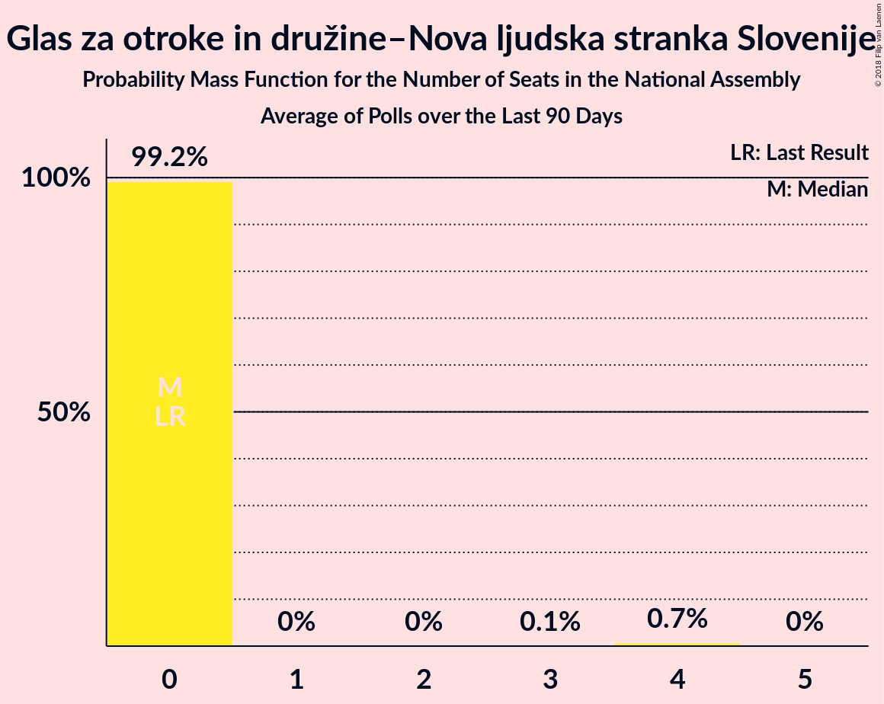

# Glas za otroke in družine–Nova ljudska stranka Slovenije

<a href="#voting-intentions">Voting Intentions</a> | <a href="#seats">Seats</a>

## Voting Intentions

Last result: **0.0%** (General Election of 13 July 2014)

### Confidence Intervals

| Period     | Polling firm/Commissioner(s) | Median | 80% Confidence Interval | 90% Confidence Interval | 95% Confidence Interval | 99% Confidence Interval |
|:----------:|:----------------:|:-----------:|:-----------------------:|:-----------------------:|:-----------------------:|:-----------------------:|
| N/A | [Poll Average](average.html) | 0.9% | 0.4–1.6% | 0.4–1.8% | 0.3–2.1% | 0.2–2.6% |
| [11–19 April 2018](2018-04-19-Mediana.html) | Mediana   POP TV | 0.9% | 0.5–1.8% | 0.4–2.1% | 0.4–2.3% | 0.2–2.9% |
| [25 March 2018](2018-03-25-Mediana.html) | Mediana   POP TV | 1.8% | 1.2–3.0% | 1.1–3.3% | 0.9–3.6% | 0.7–4.2% |
| [13–15 March 2018](2018-03-15-Ninamedia.html) | Ninamedia   RTV Slovenija–Dnevnik | 0.0% | N/A | N/A | N/A | N/A |
| [10–14 March 2018](2018-03-14-ParsifalSC.html) | Parsifal SC   Nova24TV | 0.6% | 0.4–1.2% | 0.3–1.3% | 0.3–1.5% | 0.2–1.8% |
| [1–8 March 2018](2018-03-08-DeloStik.html) | Delo Stik   Delo | 0.0% | N/A | N/A | N/A | N/A |

### Probability Mass Function

The following table shows the probability mass function per percentage block of voting intentions for the [poll average](average.html) for Glas za otroke in družine–Nova ljudska stranka Slovenije.

| Voting Intentions | Probability | Accumulated | Special Marks |
|:-----------------:|:-----------:|:-----------:|:-------------:|
| 0.0–0.5% | 18% | 100% | Last Result |
| 0.5–1.5% | 72% | 82% | Median |
| 1.5–2.5% | 10% | 10% |  |
| 2.5–3.5% | 0.6% | 0.6% |  |
| 3.5–4.5% | 0% | 0% |  |

## Seats

Last result: **0** seats (General Election of 13 July 2014)

### Confidence Intervals

| Period     | Polling firm/Commissioner(s) | Median | 80% Confidence Interval | 90% Confidence Interval | 95% Confidence Interval | 99% Confidence Interval |
|:----------:|:----------------:|:------:|:-----------------------:|:-----------------------:|:-----------------------:|:-----------------------:|
| N/A | [Poll Average](average.html) | 0 | 0 | 0 | 0 | 0 |
| [11–19 April 2018](2018-04-19-Mediana.html) | Mediana   POP TV | 0 | 0 | 0 | 0 | 0 |
| [25 March 2018](2018-03-25-Mediana.html) | Mediana   POP TV | 0 | 0 | 0–4 | 0–4 | 0–4 |
| [13–15 March 2018](2018-03-15-Ninamedia.html) | Ninamedia   RTV Slovenija–Dnevnik |  |  |  |  |  |
| [10–14 March 2018](2018-03-14-ParsifalSC.html) | Parsifal SC   Nova24TV | 0 | 0 | 0 | 0 | 0 |
| [1–8 March 2018](2018-03-08-DeloStik.html) | Delo Stik   Delo |  |  |  |  |  |

### Probability Mass Function

The following table shows the probability mass function per seat for the [poll average](average.html) for Glas za otroke in družine–Nova ljudska stranka Slovenije.

| Number of Seats | Probability | Accumulated | Special Marks |
|:---------------:|:-----------:|:-----------:|:-------------:|
| 0 | 100% | 100% | Last Result, Median |

