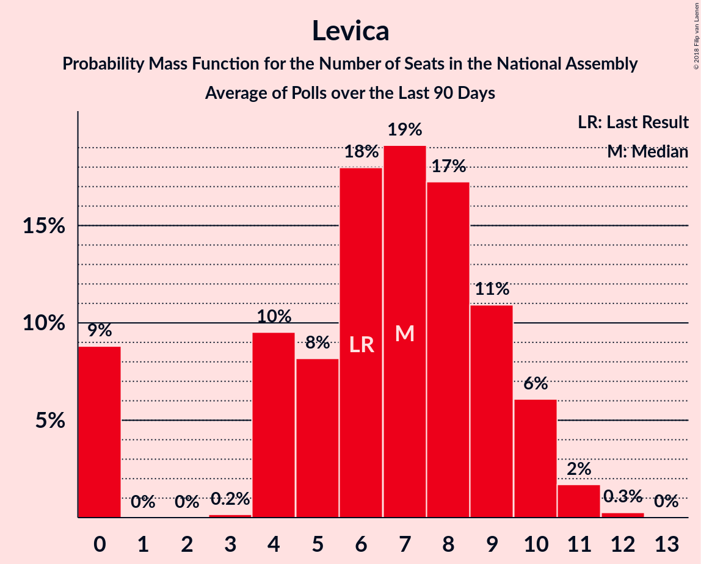

# Levica

<a href="#voting-intentions">Voting Intentions</a> | <a href="#seats">Seats</a>

## Voting Intentions

Last result: **9.3%** (General Election of 3 June 2018)

### Confidence Intervals

| Period     | Polling firm/Commissioner(s) | Median | 80% Confidence Interval | 90% Confidence Interval | 95% Confidence Interval | 99% Confidence Interval |
|:----------:|:----------------:|:-----------:|:-----------------------:|:-----------------------:|:-----------------------:|:-----------------------:|
| N/A | [Poll Average](average.html) | 12.0% | 8.0–15.0% | 7.5–15.7% | 7.1–16.3% | 6.4–17.3% |
| [1–28 June 2020](2020-06-28-Mediana.html) | Mediana   POPTV | 14.2% | 12.7–16.0% | 12.2–16.5% | 11.9–17.0% | 11.1–17.9% |
| [15–17 June 2020](2020-06-17-Parsifal.html) | Parsifal   Nova 24TV | 8.4% | 7.2–9.9% | 6.9–10.3% | 6.6–10.7% | 6.1–11.4% |
| [9–11 June 2020](2020-06-11-Ninamedia.html) | Ninamedia   Dnevnik, Večer | 12.0% | 10.5–13.7% | 10.1–14.2% | 9.8–14.6% | 9.1–15.5% |
| [18–21 May 2020](2020-05-21-Mediana.html) | Mediana   POPTV | 12.1% | 10.7–13.8% | 10.3–14.3% | 9.9–14.7% | 9.3–15.6% |
| [12–13 May 2020](2020-05-13-Ninamedia.html) | Ninamedia   Dnevnik, Večer | 9.9% | 8.5–11.4% | 8.2–11.9% | 7.9–12.3% | 7.3–13.1% |
| [6–8 May 2020](2020-05-08-Parsifal.html) | Parsifal   Nova 24TV | 9.5% | 8.3–11.0% | 8.0–11.4% | 7.7–11.8% | 7.1–12.6% |
| [4–8 May 2020](2020-05-08-Mediana.html) | Mediana   Delo | 12.4% | 10.9–14.1% | 10.5–14.6% | 10.1–15.0% | 9.5–15.9% |
| [26 April 2020](2020-04-26-Mediana.html) | Mediana   POPTV | 12.3% | 10.9–14.0% | 10.5–14.4% | 10.1–14.8% | 9.5–15.7% |
| [14–16 April 2020](2020-04-16-Ninamedia.html) | Ninamedia   Dnevnik, Večer | 10.1% | 8.8–11.8% | 8.4–12.2% | 8.1–12.6% | 7.5–13.4% |
| [6–9 April 2020](2020-04-09-Mediana.html) | Mediana   Delo | 10.4% | 9.0–11.9% | 8.7–12.4% | 8.3–12.8% | 7.7–13.6% |
| [10–12 March 2020](2020-03-12-Ninamedia.html) | Ninamedia   Dnevnik, Večer | 9.3% | 8.0–10.8% | 7.7–11.3% | 7.3–11.7% | 6.8–12.5% |
| [25 February–4 March 2020](2020-03-04-Mediana.html) | Mediana   Delo | 11.1% | 9.7–12.6% | 9.4–13.1% | 9.1–13.5% | 8.4–14.3% |
| [19–20 February 2020](2020-02-20-Parsifal.html) | Parsifal   Nova 24TV | 7.9% | 6.8–9.4% | 6.4–9.8% | 6.2–10.1% | 5.6–10.9% |
| [14 January–16 February 2020](2020-02-16-Ninamedia.html) | Ninamedia   RTV SLO | 9.0% | 7.7–10.5% | 7.4–11.0% | 7.1–11.4% | 6.5–12.1% |
| [12–13 February 2020](2020-02-13-Parsifal.html) | Parsifal   Nova 24 | 7.5% | 6.3–8.9% | 6.0–9.3% | 5.8–9.6% | 5.3–10.3% |
| [11–13 February 2020](2020-02-13-Ninamedia.html) | Ninamedia   RTV SLO | 7.9% | 6.7–9.3% | 6.4–9.7% | 6.1–10.1% | 5.6–10.8% |
| [3–5 February 2020](2020-02-05-Parsifal.html) | Parsifal   Nova 24 | 7.4% | 6.3–8.8% | 6.0–9.2% | 5.7–9.6% | 5.2–10.3% |
| [28 January–3 February 2020](2020-02-03-Mediana.html) | Mediana   Delo | 11.3% | 10.0–12.9% | 9.6–13.4% | 9.3–13.7% | 8.7–14.5% |
| [27–29 January 2020](2020-01-29-Parsifal.html) | Parsifal | 7.2% | 6.3–8.4% | 6.0–8.8% | 5.8–9.1% | 5.3–9.7% |
| [1–26 January 2020](2020-01-26-Mediana.html) | Mediana   POP TV | 11.9% | 10.5–13.5% | 10.1–13.9% | 9.8–14.4% | 9.1–15.2% |
| [3–9 January 2020](2020-01-09-Mediana.html) | Mediana   Delo | 11.2% | 9.8–12.8% | 9.4–13.3% | 9.1–13.7% | 8.5–14.5% |
| [10–12 December 2019](2019-12-12-Ninamedia.html) | Ninamedia   RTV SLO | 9.6% | 8.3–11.1% | 7.9–11.6% | 7.6–12.0% | 7.0–12.8% |
| [1–26 November 2019](2019-11-26-Mediana.html) | Mediana   POP TV | 14.3% | 12.8–16.1% | 12.4–16.6% | 12.0–17.1% | 11.3–18.0% |
| [12–14 November 2019](2019-11-14-Ninamedia.html) | Ninamedia   RTV SLO | 10.1% | 8.8–11.8% | 8.4–12.2% | 8.1–12.6% | 7.5–13.4% |
| [28 October–7 November 2019](2019-11-07-Mediana.html) | Mediana   Delo | 16.6% | 14.9–18.5% | 14.5–19.0% | 14.1–19.5% | 13.3–20.4% |
| [15–17 October 2019](2019-10-17-Ninamedia.html) | Ninamedia   RTV SLO | 9.6% | 8.3–11.1% | 7.9–11.6% | 7.6–12.0% | 7.0–12.8% |
| [1–22 September 2019](2019-09-22-Mediana.html) | Mediana   POP TV | 12.3% | 10.9–14.0% | 10.4–14.5% | 10.1–14.9% | 9.4–15.8% |
| [10–12 September 2019](2019-09-12-Ninamedia.html) | Ninamedia   RTV SLO | 9.6% | 8.3–11.1% | 7.9–11.6% | 7.6–12.0% | 7.0–12.8% |
| [28 August–5 September 2019](2019-09-05-Mediana.html) | Mediana   Delo | 10.3% | 9.0–11.9% | 8.6–12.3% | 8.3–12.7% | 7.7–13.5% |
| [1–25 August 2019](2019-08-25-Mediana.html) | Mediana   POP TV | 7.3% | 6.2–8.7% | 5.9–9.1% | 5.7–9.5% | 5.2–10.2% |
| [12–14 August 2019](2019-08-14-Ninamedia.html) | Ninamedia   RTV SLO and Dnevnik | 9.1% | 7.9–10.7% | 7.5–11.1% | 7.2–11.5% | 6.7–12.3% |
| [31 July–8 August 2019](2019-08-08-Mediana.html) | Mediana   Delo | 9.4% | 8.1–10.9% | 7.8–11.3% | 7.5–11.7% | 6.9–12.5% |
| [11–13 July 2019](2019-07-13-Ninamedia.html) | Ninamedia   RTV SLO and Dnevnik | 8.7% | 7.5–10.2% | 7.1–10.7% | 6.8–11.1% | 6.3–11.8% |
| [1–23 June 2019](2019-06-23-Mediana.html) | Mediana   POP TV | 9.5% | 8.2–11.0% | 7.8–11.5% | 7.5–11.8% | 7.0–12.6% |
| [11–13 June 2019](2019-06-13-Ninamedia.html) | Ninamedia   Dnevnik and Večer | 7.6% | 6.4–9.0% | 6.1–9.4% | 5.8–9.8% | 5.3–10.5% |
| [28 May–6 June 2019](2019-06-06-Mediana.html) | Mediana   POP TV | 9.5% | 8.3–11.1% | 7.9–11.5% | 7.6–11.9% | 7.1–12.6% |
| [14–16 May 2019](2019-05-16-Ninamedia.html) | Ninamedia   Dnevnik and RTV Slovenija | 8.0% | 6.8–9.5% | 6.5–9.9% | 6.2–10.3% | 5.7–11.0% |
| [8–15 May 2019](2019-05-15-Mediana.html) | Mediana   POP TV and Delo | 12.2% | 10.7–13.8% | 10.3–14.3% | 10.0–14.7% | 9.3–15.6% |
| [28 April 2019](2019-04-28-Mediana.html) | Mediana   POP TV | 9.3% | 7.9–11.0% | 7.5–11.5% | 7.2–11.9% | 6.6–12.8% |
| [9–11 April 2019](2019-04-11-Ninamedia.html) | Ninamedia   Dnevnik and RTV Slovenija | 9.0% | 7.5–10.8% | 7.1–11.4% | 6.8–11.8% | 6.1–12.8% |
| [1–4 April 2019](2019-04-04-ParsifalSC.html) | Parsifal SC   Nova24TV | 6.9% | 5.6–8.6% | 5.2–9.1% | 4.9–9.5% | 4.4–10.4% |
| [24 March 2019](2019-03-24-Mediana.html) | Mediana   POP TV | 9.4% | 8.0–11.2% | 7.6–11.7% | 7.3–12.1% | 6.7–13.0% |
| [12–14 March 2019](2019-03-14-Ninamedia.html) | Ninamedia   Dnevnik and RTV Slovenija | 8.2% | 6.9–10.0% | 6.5–10.5% | 6.2–10.9% | 5.6–11.8% |
| [26 February–7 March 2019](2019-03-07-Mediana.html) | Mediana   Delo | 11.8% | 10.2–13.8% | 9.7–14.4% | 9.3–14.9% | 8.6–15.9% |
| [24 February 2019](2019-02-24-Mediana.html) | Mediana   POP TV | 9.5% | 8.0–11.4% | 7.6–11.9% | 7.3–12.3% | 6.6–13.3% |
| [12–14 February 2019](2019-02-14-Ninamedia.html) | Ninamedia   Dnevnik and RTV Slovenija | 8.1% | 6.8–9.9% | 6.4–10.3% | 6.1–10.8% | 5.5–11.7% |
| [29 January–6 February 2019](2019-02-06-Ninamedia.html) | Ninamedia   MMC and RTV Slovenija | 5.4% | 4.4–6.8% | 4.1–7.1% | 3.9–7.5% | 3.5–8.2% |
| [8–10 January 2019](2019-01-10-Ninamedia.html) | Ninamedia   MMC and RTV Slovenija | 10.0% | 8.5–12.0% | 8.1–12.5% | 7.7–13.0% | 7.0–14.0% |
| [11–13 December 2018](2018-12-13-Ninamedia.html) | Ninamedia | 10.0% | 8.7–11.6% | 8.3–12.1% | 8.0–12.5% | 7.4–13.3% |
| [4–7 December 2018](2018-12-07-ParsifalSC.html) | Parsifal SC | 6.0% | 5.0–7.3% | 4.8–7.7% | 4.5–8.0% | 4.1–8.7% |
| [25 November 2018](2018-11-25-Mediana.html) | Mediana   POP TV | 9.0% | 7.6–10.8% | 7.2–11.3% | 6.8–11.8% | 6.2–12.7% |
| [19–20 November 2018](2018-11-20-Ninamedia.html) | Ninamedia   Dnevnik and RTV Slovenija | 10.6% | 9.1–12.5% | 8.7–13.1% | 8.3–13.5% | 7.6–14.5% |
| [7 November 2018](2018-11-07-ParsifalSC.html) | Parsifal SC | 5.9% | 5.0–7.3% | 4.7–7.6% | 4.4–8.0% | 4.0–8.6% |
| [1 November 2018](2018-11-01-Mediana.html) | Mediana | 10.1% | 8.8–11.6% | 8.4–12.1% | 8.1–12.5% | 7.5–13.3% |
| [9–11 October 2018](2018-10-11-Ninamedia.html) | Ninamedia | 10.0% | 8.7–11.6% | 8.3–12.1% | 8.0–12.5% | 7.4–13.3% |
| [3–11 October 2018](2018-10-11-Mediana.html) | Mediana   Delo | 9.0% | 7.7–10.5% | 7.4–10.9% | 7.1–11.3% | 6.5–12.0% |
| [11–13 September 2018](2018-09-13-Ninamedia.html) | Ninamedia | 8.4% | 7.0–10.1% | 6.7–10.5% | 6.4–11.0% | 5.8–11.8% |
| [30 August–6 September 2018](2018-09-06-Mediana.html) | Mediana   Delo | 10.3% | 8.7–12.2% | 8.2–12.8% | 7.8–13.3% | 7.1–14.3% |
| [26 August 2018](2018-08-26-Mediana.html) | Mediana   POP TV | 9.5% | 8.0–11.4% | 7.6–11.9% | 7.2–12.4% | 6.6–13.4% |
| [13–15 August 2018](2018-08-15-Ninamedia.html) | Ninamedia   Dnevnik and RTV Slovenija | 8.5% | 7.2–10.2% | 6.8–10.7% | 6.5–11.2% | 5.9–12.0% |
| [29 July 2018](2018-07-29-Mediana.html) | Mediana   POP TV | 10.8% | 9.2–12.7% | 8.8–13.2% | 8.4–13.7% | 7.7–14.7% |
| [10–12 July 2018](2018-07-12-Ninamedia.html) | Ninamedia   Dnevnik and RTV Slovenija | 8.8% | 7.4–10.4% | 7.1–10.9% | 6.8–11.3% | 6.2–12.1% |
| [1–23 June 2018](2018-06-23-Mediana.html) | Mediana   POP TV | 10.9% | 9.4–12.7% | 9.0–13.2% | 8.6–13.7% | 8.0–14.6% |
| [12–14 June 2018](2018-06-14-Ninamedia.html) | Ninamedia   Dnevnik and RTV Slovenija | 10.3% | 8.9–12.1% | 8.5–12.6% | 8.1–13.0% | 7.5–13.9% |
| [5–6 June 2018](2018-06-06-ParsifalSC.html) | Parsifal SC   Nova24TV | 10.3% | 8.7–12.2% | 8.3–12.7% | 7.9–13.2% | 7.2–14.2% |

### Probability Mass Function

The following table shows the probability mass function per percentage block of voting intentions for the [poll average](average.html) for Levica.

| Voting Intentions | Probability | Accumulated | Special Marks |
|:-----------------:|:-----------:|:-----------:|:-------------:|
| 4.5–5.5% | 0% | 100% |  |
| 5.5–6.5% | 0.7% | 100% |  |
| 6.5–7.5% | 5% | 99.3% |  |
| 7.5–8.5% | 12% | 94% |  |
| 8.5–9.5% | 11% | 83% | Last Result |
| 9.5–10.5% | 7% | 72% |  |
| 10.5–11.5% | 9% | 64% |  |
| 11.5–12.5% | 13% | 55% | Median |
| 12.5–13.5% | 14% | 42% |  |
| 13.5–14.5% | 13% | 28% |  |
| 14.5–15.5% | 9% | 15% |  |
| 15.5–16.5% | 4% | 6% |  |
| 16.5–17.5% | 1.3% | 2% |  |
| 17.5–18.5% | 0.3% | 0.3% |  |
| 18.5–19.5% | 0% | 0% |  |

## Seats

Last result: **9** seats (General Election of 3 June 2018)

### Confidence Intervals

| Period     | Polling firm/Commissioner(s) | Median | 80% Confidence Interval | 90% Confidence Interval | 95% Confidence Interval | 99% Confidence Interval |
|:----------:|:----------------:|:------:|:-----------------------:|:-----------------------:|:-----------------------:|:-----------------------:|
| N/A | [Poll Average](average.html) | 11 | 7–14 | 7–15 | 7–15 | 6–16 |
| [1–28 June 2020](2020-06-28-Mediana.html) | Mediana   POPTV | 14 | 12–15 | 12–16 | 11–16 | 10–17 |
| [15–17 June 2020](2020-06-17-Parsifal.html) | Parsifal   Nova 24TV | 8 | 7–10 | 6–10 | 6–10 | 5–11 |
| [9–11 June 2020](2020-06-11-Ninamedia.html) | Ninamedia   Dnevnik, Večer | 11 | 10–13 | 9–14 | 9–14 | 8–15 |
| [18–21 May 2020](2020-05-21-Mediana.html) | Mediana   POPTV | 11 | 10–13 | 9–14 | 9–14 | 8–15 |
| [12–13 May 2020](2020-05-13-Ninamedia.html) | Ninamedia   Dnevnik, Večer | 9 | 8–11 | 7–11 | 7–12 | 7–13 |
| [6–8 May 2020](2020-05-08-Parsifal.html) | Parsifal   Nova 24TV | 9 | 8–10 | 7–11 | 7–11 | 7–12 |
| [4–8 May 2020](2020-05-08-Mediana.html) | Mediana   Delo | 12 | 10–13 | 9–14 | 9–14 | 9–15 |
| [26 April 2020](2020-04-26-Mediana.html) | Mediana   POPTV | 12 | 10–13 | 10–13 | 9–14 | 9–14 |
| [14–16 April 2020](2020-04-16-Ninamedia.html) | Ninamedia   Dnevnik, Večer | 9 | 8–12 | 7–12 | 7–12 | 6–12 |
| [6–9 April 2020](2020-04-09-Mediana.html) | Mediana   Delo | 10 | 8–11 | 8–11 | 7–12 | 7–13 |
| [10–12 March 2020](2020-03-12-Ninamedia.html) | Ninamedia   Dnevnik, Večer | 8 | 8–10 | 7–10 | 7–11 | 6–12 |
| [25 February–4 March 2020](2020-03-04-Mediana.html) | Mediana   Delo | 10 | 9–12 | 9–12 | 8–13 | 8–14 |
| [19–20 February 2020](2020-02-20-Parsifal.html) | Parsifal   Nova 24TV | 8 | 6–9 | 6–9 | 5–10 | 5–11 |
| [14 January–16 February 2020](2020-02-16-Ninamedia.html) | Ninamedia   RTV SLO | 9 | 8–10 | 7–10 | 7–11 | 6–12 |
| [12–13 February 2020](2020-02-13-Parsifal.html) | Parsifal   Nova 24 | 7 | 6–8 | 5–9 | 5–9 | 5–10 |
| [11–13 February 2020](2020-02-13-Ninamedia.html) | Ninamedia   RTV SLO | 8 | 6–9 | 6–9 | 6–10 | 5–10 |
| [3–5 February 2020](2020-02-05-Parsifal.html) | Parsifal   Nova 24 | 7 | 6–8 | 5–9 | 5–9 | 5–10 |
| [28 January–3 February 2020](2020-02-03-Mediana.html) | Mediana   Delo | 11 | 10–13 | 9–14 | 9–14 | 8–14 |
| [27–29 January 2020](2020-01-29-Parsifal.html) | Parsifal | 7 | 6–8 | 5–8 | 5–9 | 5–9 |
| [1–26 January 2020](2020-01-26-Mediana.html) | Mediana   POP TV | 12 | 10–13 | 9–14 | 9–14 | 8–14 |
| [3–9 January 2020](2020-01-09-Mediana.html) | Mediana   Delo | 11 | 10–13 | 9–13 | 9–13 | 8–14 |
| [10–12 December 2019](2019-12-12-Ninamedia.html) | Ninamedia   RTV SLO | 9 | 8–10 | 7–11 | 7–11 | 6–12 |
| [1–26 November 2019](2019-11-26-Mediana.html) | Mediana   POP TV | 13 | 12–15 | 11–15 | 11–16 | 10–17 |
| [12–14 November 2019](2019-11-14-Ninamedia.html) | Ninamedia   RTV SLO | 10 | 9–11 | 8–11 | 7–11 | 7–13 |
| [28 October–7 November 2019](2019-11-07-Mediana.html) | Mediana   Delo | 16 | 16–17 | 15–18 | 14–19 | 13–21 |
| [15–17 October 2019](2019-10-17-Ninamedia.html) | Ninamedia   RTV SLO | 11 | 9–11 | 8–11 | 8–11 | 7–12 |
| [1–22 September 2019](2019-09-22-Mediana.html) | Mediana   POP TV | 12 | 10–13 | 10–14 | 9–14 | 9–15 |
| [10–12 September 2019](2019-09-12-Ninamedia.html) | Ninamedia   RTV SLO | 9 | 8–10 | 8–11 | 7–12 | 6–12 |
| [28 August–5 September 2019](2019-09-05-Mediana.html) | Mediana   Delo | 10 | 10 | 9–10 | 8–11 | 8–13 |
| [1–25 August 2019](2019-08-25-Mediana.html) | Mediana   POP TV | 7 | 6–8 | 6–9 | 5–9 | 5–9 |
| [12–14 August 2019](2019-08-14-Ninamedia.html) | Ninamedia   RTV SLO and Dnevnik | 9 | 8–10 | 8–10 | 7–11 | 7–12 |
| [31 July–8 August 2019](2019-08-08-Mediana.html) | Mediana   Delo | 10 | 8–11 | 7–11 | 7–11 | 7–11 |
| [11–13 July 2019](2019-07-13-Ninamedia.html) | Ninamedia   RTV SLO and Dnevnik | 9 | 7–10 | 7–10 | 6–11 | 6–11 |
| [1–23 June 2019](2019-06-23-Mediana.html) | Mediana   POP TV | 9 | 8–11 | 7–11 | 7–12 | 6–13 |
| [11–13 June 2019](2019-06-13-Ninamedia.html) | Ninamedia   Dnevnik and Večer | 7 | 6–8 | 5–9 | 5–9 | 5–10 |
| [28 May–6 June 2019](2019-06-06-Mediana.html) | Mediana   POP TV | 9 | 8–11 | 7–11 | 7–11 | 7–12 |
| [14–16 May 2019](2019-05-16-Ninamedia.html) | Ninamedia   Dnevnik and RTV Slovenija | 8 | 6–9 | 6–10 | 6–10 | 5–11 |
| [8–15 May 2019](2019-05-15-Mediana.html) | Mediana   POP TV and Delo | 12 | 10–13 | 10–13 | 9–14 | 9–15 |
| [28 April 2019](2019-04-28-Mediana.html) | Mediana   POP TV | 9 | 8–10 | 7–11 | 7–11 | 6–12 |
| [9–11 April 2019](2019-04-11-Ninamedia.html) | Ninamedia   Dnevnik and RTV Slovenija | 8 | 7–10 | 6–11 | 6–11 | 5–12 |
| [1–4 April 2019](2019-04-04-ParsifalSC.html) | Parsifal SC   Nova24TV | 6 | 5–8 | 4–8 | 4–9 | 4–10 |
| [24 March 2019](2019-03-24-Mediana.html) | Mediana   POP TV | 9 | 7–10 | 7–11 | 7–11 | 6–12 |
| [12–14 March 2019](2019-03-14-Ninamedia.html) | Ninamedia   Dnevnik and RTV Slovenija | 8 | 6–9 | 6–10 | 6–10 | 5–11 |
| [26 February–7 March 2019](2019-03-07-Mediana.html) | Mediana   Delo | 12 | 10–14 | 9–14 | 9–15 | 8–15 |
| [24 February 2019](2019-02-24-Mediana.html) | Mediana   POP TV | 9 | 7–11 | 7–11 | 7–11 | 6–13 |
| [12–14 February 2019](2019-02-14-Ninamedia.html) | Ninamedia   Dnevnik and RTV Slovenija | 8 | 7–10 | 6–11 | 6–11 | 5–12 |
| [29 January–6 February 2019](2019-02-06-Ninamedia.html) | Ninamedia   MMC and RTV Slovenija | 5 | 4–6 | 4–7 | 0–7 | 0–8 |
| [8–10 January 2019](2019-01-10-Ninamedia.html) | Ninamedia   MMC and RTV Slovenija | 11 | 7–12 | 7–13 | 6–13 | 6–14 |
| [11–13 December 2018](2018-12-13-Ninamedia.html) | Ninamedia | 9 | 8–11 | 8–11 | 7–12 | 7–13 |
| [4–7 December 2018](2018-12-07-ParsifalSC.html) | Parsifal SC | 6 | 4–7 | 4–7 | 4–7 | 4–8 |
| [25 November 2018](2018-11-25-Mediana.html) | Mediana   POP TV | 8 | 7–10 | 6–10 | 6–10 | 5–12 |
| [19–20 November 2018](2018-11-20-Ninamedia.html) | Ninamedia   Dnevnik and RTV Slovenija | 10 | 8–12 | 8–12 | 7–13 | 7–14 |
| [7 November 2018](2018-11-07-ParsifalSC.html) | Parsifal SC | 6 | 4–6 | 4–7 | 4–7 | 4–8 |
| [1 November 2018](2018-11-01-Mediana.html) | Mediana | 9 | 8–11 | 8–11 | 8–12 | 7–12 |
| [9–11 October 2018](2018-10-11-Ninamedia.html) | Ninamedia | 9 | 8–11 | 7–11 | 7–12 | 6–13 |
| [3–11 October 2018](2018-10-11-Mediana.html) | Mediana   Delo | 8 | 7–9 | 7–10 | 6–10 | 6–11 |
| [11–13 September 2018](2018-09-13-Ninamedia.html) | Ninamedia | 8 | 6–9 | 6–10 | 6–10 | 5–11 |
| [30 August–6 September 2018](2018-09-06-Mediana.html) | Mediana   Delo | 9 | 8–11 | 7–11 | 7–12 | 6–13 |
| [26 August 2018](2018-08-26-Mediana.html) | Mediana   POP TV | 8 | 8–10 | 7–11 | 6–11 | 6–12 |
| [13–15 August 2018](2018-08-15-Ninamedia.html) | Ninamedia   Dnevnik and RTV Slovenija | 8 | 7–10 | 6–10 | 6–11 | 5–11 |
| [29 July 2018](2018-07-29-Mediana.html) | Mediana   POP TV | 10 | 9–12 | 8–13 | 8–13 | 7–14 |
| [10–12 July 2018](2018-07-12-Ninamedia.html) | Ninamedia   Dnevnik and RTV Slovenija | 8 | 7–9 | 6–10 | 6–11 | 6–11 |
| [1–23 June 2018](2018-06-23-Mediana.html) | Mediana   POP TV | 10 | 9–12 | 8–12 | 8–13 | 7–14 |
| [12–14 June 2018](2018-06-14-Ninamedia.html) | Ninamedia   Dnevnik and RTV Slovenija | 10 | 8–11 | 8–12 | 7–12 | 7–14 |
| [5–6 June 2018](2018-06-06-ParsifalSC.html) | Parsifal SC   Nova24TV | 9 | 8–11 | 7–12 | 7–12 | 6–13 |

### Probability Mass Function

The following table shows the probability mass function per seat for the [poll average](average.html) for Levica.

| Number of Seats | Probability | Accumulated | Special Marks |
|:---------------:|:-----------:|:-----------:|:-------------:|
| 5 | 0.2% | 100% |  |
| 6 | 2% | 99.8% |  |
| 7 | 10% | 98% |  |
| 8 | 12% | 88% |  |
| 9 | 8% | 75% | Last Result |
| 10 | 13% | 68% |  |
| 11 | 8% | 55% | Median |
| 12 | 12% | 47% |  |
| 13 | 15% | 35% |  |
| 14 | 11% | 20% |  |
| 15 | 7% | 9% |  |
| 16 | 1.4% | 2% |  |
| 17 | 0.4% | 0.5% |  |
| 18 | 0.1% | 0.1% |  |
| 19 | 0% | 0% |  |

