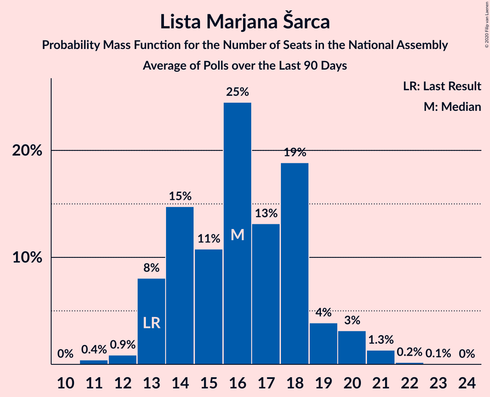

# Lista Marjana Šarca

<a href="#voting-intentions">Voting Intentions</a> | <a href="#seats">Seats</a>

## Voting Intentions

Last result: **12.6%** (General Election of 3 June 2018)

### Confidence Intervals

| Period     | Polling firm/Commissioner(s) | Median | 80% Confidence Interval | 90% Confidence Interval | 95% Confidence Interval | 99% Confidence Interval |
|:----------:|:----------------:|:-----------:|:-----------------------:|:-----------------------:|:-----------------------:|:-----------------------:|
| N/A | [Poll Average](average.html) | 15.5% | 13.3–21.6% | 12.8–22.4% | 12.4–23.0% | 11.6–24.2% |
| [1–31 August 2020](2020-08-31-Mediana.html) | Mediana   POPTV | 14.6% | 13.0–16.4% | 12.5–16.9% | 12.2–17.3% | 11.4–18.3% |
| [11–13 August 2020](2020-08-13-Ninamedia.html) | Ninamedia   Dnevnik, Večer | 14.6% | 13.0–16.4% | 12.5–16.9% | 12.1–17.4% | 11.4–18.3% |
| [3–6 August 2020](2020-08-06-Mediana.html) | Mediana   POPTV | 14.8% | 13.5–16.9% | 13.0–17.5% | 12.7–17.9% | 11.9–18.8% |
| [1–26 July 2020](2020-07-26-Mediana.html) | Mediana   POPTV | 12.3% | 10.8–14.0% | 10.4–14.5% | 10.1–14.9% | 9.4–15.7% |
| [6–9 July 2020](2020-07-09-Mediana.html) | Mediana   POPTV | 18.3% | 16.6–20.3% | 16.1–20.9% | 15.7–21.3% | 14.9–22.3% |
| [29 June–2 July 2020](2020-07-02-Parsifal.html) | Parsifal   Nova 24TV | 20.7% | 18.9–22.7% | 18.3–23.3% | 17.9–23.8% | 17.0–24.8% |
| [1–28 June 2020](2020-06-28-Mediana.html) | Mediana   POP TV | 16.3% | 14.7–18.2% | 14.2–18.7% | 13.8–19.2% | 13.0–20.1% |
| [15–17 June 2020](2020-06-17-Parsifal.html) | Parsifal   Nova 24TV | 18.0% | 16.2–19.9% | 15.8–20.5% | 15.3–21.0% | 14.6–21.9% |
| [9–11 June 2020](2020-06-11-Ninamedia.html) | Ninamedia   Dnevnik, Večer | 15.9% | 14.2–17.8% | 13.7–18.3% | 13.3–18.8% | 12.6–19.7% |
| [18–21 May 2020](2020-05-21-Mediana.html) | Mediana   POP TV | 23.3% | 21.3–25.4% | 20.8–26.0% | 20.3–26.5% | 19.4–27.5% |
| [12–13 May 2020](2020-05-13-Ninamedia.html) | Ninamedia   Dnevnik, Večer | 19.6% | 17.8–21.6% | 17.2–22.2% | 16.8–22.7% | 16.0–23.7% |
| [6–8 May 2020](2020-05-08-Parsifal.html) | Parsifal   Nova 24TV | 17.9% | 16.2–19.8% | 15.8–20.3% | 15.4–20.8% | 14.6–21.7% |
| [4–8 May 2020](2020-05-08-Mediana.html) | Mediana   Delo | 21.8% | 19.9–23.9% | 19.3–24.4% | 18.9–25.0% | 18.0–26.0% |
| [26 April 2020](2020-04-26-Mediana.html) | Mediana   POPTV | 18.8% | 17.0–20.7% | 16.5–21.2% | 16.1–21.7% | 15.3–22.7% |
| [14–16 April 2020](2020-04-16-Ninamedia.html) | Ninamedia   Dnevnik, Večer | 16.1% | 14.5–18.0% | 14.0–18.6% | 13.6–19.1% | 12.8–20.0% |
| [6–9 April 2020](2020-04-09-Mediana.html) | Mediana   Delo | 18.4% | 16.6–20.3% | 16.1–20.9% | 15.7–21.4% | 14.9–22.3% |
| [10–12 March 2020](2020-03-12-Ninamedia.html) | Ninamedia   Dnevnik, Večer | 21.9% | 20.0–24.0% | 19.4–24.6% | 18.9–25.1% | 18.1–26.1% |
| [25 February–4 March 2020](2020-03-04-Mediana.html) | Mediana   Delo | 21.8% | 19.9–23.7% | 19.4–24.3% | 19.0–24.8% | 18.2–25.8% |
| [19–20 February 2020](2020-02-20-Parsifal.html) | Parsifal   Nova 24TV | 23.6% | 21.7–25.7% | 21.1–26.3% | 20.7–26.9% | 19.8–27.9% |
| [14 January–16 February 2020](2020-02-16-Ninamedia.html) | Ninamedia   RTV SLO | 29.1% | 27.0–31.4% | 26.4–32.1% | 25.9–32.6% | 24.9–33.7% |
| [12–13 February 2020](2020-02-13-Parsifal.html) | Parsifal   Nova 24 | 19.6% | 17.8–21.6% | 17.3–22.2% | 16.9–22.7% | 16.1–23.7% |
| [11–13 February 2020](2020-02-13-Ninamedia.html) | Ninamedia   RTV SLO | 25.6% | 23.5–27.8% | 23.0–28.4% | 22.5–28.9% | 21.5–30.0% |
| [3–5 February 2020](2020-02-05-Parsifal.html) | Parsifal   Nova 24 | 24.5% | 22.5–26.7% | 21.9–27.3% | 21.5–27.8% | 20.5–28.9% |
| [28 January–3 February 2020](2020-02-03-Mediana.html) | Mediana   Delo | 22.3% | 20.4–24.3% | 19.9–24.8% | 19.5–25.3% | 18.6–26.3% |
| [27–29 January 2020](2020-01-29-Parsifal.html) | Parsifal | 27.1% | 25.3–29.0% | 24.8–29.6% | 24.4–30.0% | 23.5–30.9% |
| [1–26 January 2020](2020-01-26-Mediana.html) | Mediana   POP TV | 24.6% | 22.7–26.7% | 22.2–27.3% | 21.7–27.8% | 20.8–28.8% |
| [3–9 January 2020](2020-01-09-Mediana.html) | Mediana   Delo | 22.3% | 20.4–24.4% | 19.8–24.9% | 19.4–25.5% | 18.5–26.5% |
| [10–12 December 2019](2019-12-12-Ninamedia.html) | Ninamedia   RTV SLO | 29.6% | 27.4–31.9% | 26.8–32.5% | 26.3–33.1% | 25.3–34.2% |
| [1–26 November 2019](2019-11-26-Mediana.html) | Mediana   POP TV | 22.5% | 20.7–24.6% | 20.1–25.2% | 19.7–25.7% | 18.8–26.7% |
| [12–14 November 2019](2019-11-14-Ninamedia.html) | Ninamedia   RTV SLO | 33.1% | 30.9–35.5% | 30.3–36.2% | 29.8–36.7% | 28.7–37.9% |
| [28 October–7 November 2019](2019-11-07-Mediana.html) | Mediana   Delo | 22.9% | 21.0–24.9% | 20.4–25.5% | 20.0–26.0% | 19.1–27.1% |
| [15–17 October 2019](2019-10-17-Ninamedia.html) | Ninamedia   RTV SLO | 30.9% | 28.7–33.2% | 28.1–33.8% | 27.5–34.4% | 26.5–35.5% |
| [1–22 September 2019](2019-09-22-Mediana.html) | Mediana   POP TV | 26.4% | 24.4–28.6% | 23.8–29.2% | 23.3–29.8% | 22.4–30.9% |
| [10–12 September 2019](2019-09-12-Ninamedia.html) | Ninamedia   RTV SLO | 32.3% | 30.1–34.6% | 29.5–35.3% | 28.9–35.8% | 27.9–37.0% |
| [28 August–5 September 2019](2019-09-05-Mediana.html) | Mediana   Delo | 30.4% | 28.2–32.6% | 27.6–33.2% | 27.1–33.8% | 26.1–34.9% |
| [1–25 August 2019](2019-08-25-Mediana.html) | Mediana   POP TV | 28.5% | 26.4–30.8% | 25.9–31.4% | 25.3–31.9% | 24.4–33.0% |
| [12–14 August 2019](2019-08-14-Ninamedia.html) | Ninamedia   RTV SLO and Dnevnik | 32.9% | 30.6–35.2% | 30.0–35.8% | 29.5–36.4% | 28.4–37.6% |
| [31 July–8 August 2019](2019-08-08-Mediana.html) | Mediana   Delo | 24.5% | 22.5–26.6% | 22.0–27.2% | 21.5–27.7% | 20.6–28.7% |
| [11–13 July 2019](2019-07-13-Ninamedia.html) | Ninamedia   RTV SLO and Dnevnik | 29.9% | 27.7–32.1% | 27.1–32.8% | 26.6–33.4% | 25.6–34.5% |
| [1–23 June 2019](2019-06-23-Mediana.html) | Mediana   POP TV | 26.9% | 24.8–29.1% | 24.2–29.7% | 23.8–30.3% | 22.8–31.3% |
| [11–13 June 2019](2019-06-13-Ninamedia.html) | Ninamedia   Dnevnik and Večer | 29.6% | 27.4–31.9% | 26.8–32.5% | 26.3–33.1% | 25.3–34.2% |
| [28 May–6 June 2019](2019-06-06-Mediana.html) | Mediana   POP TV | 28.6% | 26.5–30.8% | 26.0–31.4% | 25.5–31.9% | 24.5–33.0% |
| [14–16 May 2019](2019-05-16-Ninamedia.html) | Ninamedia   Dnevnik and RTV Slovenija | 32.0% | 29.8–34.3% | 29.2–35.0% | 28.6–35.6% | 27.6–36.7% |
| [8–15 May 2019](2019-05-15-Mediana.html) | Mediana   POP TV and Delo | 24.0% | 22.1–26.2% | 21.6–26.7% | 21.1–27.3% | 20.2–28.3% |
| [28 April 2019](2019-04-28-Mediana.html) | Mediana   POP TV | 27.1% | 24.8–29.6% | 24.2–30.3% | 23.6–30.9% | 22.6–32.1% |
| [9–11 April 2019](2019-04-11-Ninamedia.html) | Ninamedia   Dnevnik and RTV Slovenija | 36.5% | 33.8–39.4% | 33.1–40.1% | 32.4–40.8% | 31.2–42.2% |
| [1–4 April 2019](2019-04-04-ParsifalSC.html) | Parsifal SC   Nova24TV | 24.6% | 22.2–27.2% | 21.5–28.0% | 20.9–28.6% | 19.8–29.9% |
| [24 March 2019](2019-03-24-Mediana.html) | Mediana   POP TV | 23.9% | 21.7–26.3% | 21.1–27.0% | 20.6–27.6% | 19.6–28.7% |
| [12–14 March 2019](2019-03-14-Ninamedia.html) | Ninamedia   Dnevnik and RTV Slovenija | 37.5% | 34.9–40.3% | 34.1–41.1% | 33.5–41.8% | 32.2–43.1% |
| [26 February–7 March 2019](2019-03-07-Mediana.html) | Mediana   Delo | 28.2% | 25.8–30.9% | 25.1–31.6% | 24.5–32.3% | 23.4–33.6% |
| [24 February 2019](2019-02-24-Mediana.html) | Mediana   POP TV | 29.3% | 26.8–31.9% | 26.1–32.7% | 25.5–33.3% | 24.3–34.6% |
| [12–14 February 2019](2019-02-14-Ninamedia.html) | Ninamedia   Dnevnik and RTV Slovenija | 41.2% | 38.5–44.0% | 37.7–44.8% | 37.1–45.5% | 35.8–46.8% |
| [29 January–6 February 2019](2019-02-06-Ninamedia.html) | Ninamedia   MMC and RTV Slovenija | 22.4% | 20.4–24.7% | 19.8–25.3% | 19.3–25.8% | 18.4–26.9% |
| [8–10 January 2019](2019-01-10-Ninamedia.html) | Ninamedia   MMC and RTV Slovenija | 25.3% | 22.9–27.9% | 22.3–28.7% | 21.7–29.3% | 20.6–30.6% |
| [11–13 December 2018](2018-12-13-Ninamedia.html) | Ninamedia | 18.0% | 16.2–20.0% | 15.7–20.5% | 15.3–21.0% | 14.5–22.0% |
| [4–7 December 2018](2018-12-07-ParsifalSC.html) | Parsifal SC | 16.0% | 14.4–17.9% | 13.9–18.4% | 13.5–18.9% | 12.7–19.8% |
| [25 November 2018](2018-11-25-Mediana.html) | Mediana   POP TV | 10.2% | 8.6–12.1% | 8.2–12.6% | 7.9–13.1% | 7.2–14.0% |
| [19–20 November 2018](2018-11-20-Ninamedia.html) | Ninamedia   Dnevnik and RTV Slovenija | 16.0% | 14.2–18.2% | 13.6–18.9% | 13.2–19.4% | 12.3–20.5% |
| [7 November 2018](2018-11-07-ParsifalSC.html) | Parsifal SC | 18.0% | 16.2–20.0% | 15.7–20.5% | 15.3–21.0% | 14.5–22.0% |
| [1 November 2018](2018-11-01-Mediana.html) | Mediana | 13.0% | 11.5–14.7% | 11.1–15.2% | 10.7–15.6% | 10.0–16.5% |
| [9–11 October 2018](2018-10-11-Ninamedia.html) | Ninamedia | 19.0% | 17.2–21.0% | 16.7–21.6% | 16.3–22.1% | 15.4–23.1% |
| [3–11 October 2018](2018-10-11-Mediana.html) | Mediana   Delo | 14.1% | 12.5–15.9% | 12.1–16.4% | 11.7–16.8% | 11.0–17.7% |
| [11–13 September 2018](2018-09-13-Ninamedia.html) | Ninamedia | 13.9% | 12.2–15.9% | 11.7–16.5% | 11.3–17.0% | 10.5–18.0% |
| [30 August–6 September 2018](2018-09-06-Mediana.html) | Mediana   Delo | 10.7% | 9.1–12.7% | 8.6–13.3% | 8.2–13.8% | 7.5–14.8% |
| [26 August 2018](2018-08-26-Mediana.html) | Mediana   POP TV | 13.3% | 11.5–15.5% | 11.1–16.1% | 10.6–16.6% | 9.8–17.7% |
| [13–15 August 2018](2018-08-15-Ninamedia.html) | Ninamedia   Dnevnik and RTV Slovenija | 12.6% | 11.0–14.6% | 10.5–15.1% | 10.1–15.7% | 9.4–16.6% |
| [29 July 2018](2018-07-29-Mediana.html) | Mediana   POP TV | 15.1% | 13.3–17.3% | 12.8–17.9% | 12.3–18.4% | 11.5–19.5% |
| [10–12 July 2018](2018-07-12-Ninamedia.html) | Ninamedia   Dnevnik and RTV Slovenija | 12.4% | 10.8–14.3% | 10.4–14.8% | 10.0–15.3% | 9.3–16.2% |
| [1–23 June 2018](2018-06-23-Mediana.html) | Mediana   POP TV | 13.1% | 11.4–15.0% | 11.0–15.5% | 10.6–16.0% | 9.9–17.0% |
| [12–14 June 2018](2018-06-14-Ninamedia.html) | Ninamedia   Dnevnik and RTV Slovenija | 13.5% | 11.9–15.4% | 11.4–16.0% | 11.0–16.5% | 10.2–17.5% |
| [5–6 June 2018](2018-06-06-ParsifalSC.html) | Parsifal SC   Nova24TV | 16.6% | 14.6–18.9% | 14.1–19.5% | 13.6–20.1% | 12.7–21.2% |

### Probability Mass Function

The following table shows the probability mass function per percentage block of voting intentions for the [poll average](average.html) for Lista Marjana Šarca.

| Voting Intentions | Probability | Accumulated | Special Marks |
|:-----------------:|:-----------:|:-----------:|:-------------:|
| 9.5–10.5% | 0% | 100% |  |
| 10.5–11.5% | 0.4% | 100% |  |
| 11.5–12.5% | 3% | 99.6% |  |
| 12.5–13.5% | 10% | 97% | Last Result |
| 13.5–14.5% | 18% | 87% |  |
| 14.5–15.5% | 18% | 68% |  |
| 15.5–16.5% | 11% | 50% | Median |
| 16.5–17.5% | 5% | 39% |  |
| 17.5–18.5% | 3% | 34% |  |
| 18.5–19.5% | 5% | 31% |  |
| 19.5–20.5% | 8% | 26% |  |
| 20.5–21.5% | 8% | 18% |  |
| 21.5–22.5% | 6% | 10% |  |
| 22.5–23.5% | 3% | 4% |  |
| 23.5–24.5% | 1.0% | 1.2% |  |
| 24.5–25.5% | 0.2% | 0.3% |  |
| 25.5–26.5% | 0% | 0% |  |

## Seats

Last result: **13** seats (General Election of 3 June 2018)

### Confidence Intervals

| Period     | Polling firm/Commissioner(s) | Median | 80% Confidence Interval | 90% Confidence Interval | 95% Confidence Interval | 99% Confidence Interval |
|:----------:|:----------------:|:------:|:-----------------------:|:-----------------------:|:-----------------------:|:-----------------------:|
| N/A | [Poll Average](average.html) | 15 | 12–20 | 12–22 | 12–23 | 11–24 |
| [1–31 August 2020](2020-08-31-Mediana.html) | Mediana   POPTV | 14 | 12–16 | 12–17 | 11–17 | 11–18 |
| [11–13 August 2020](2020-08-13-Ninamedia.html) | Ninamedia   Dnevnik, Večer | 14 | 13–15 | 12–16 | 12–17 | 10–17 |
| [3–6 August 2020](2020-08-06-Mediana.html) | Mediana   POPTV | 15 | 13–17 | 13–17 | 12–18 | 11–19 |
| [1–26 July 2020](2020-07-26-Mediana.html) | Mediana   POPTV | 12 | 10–14 | 10–15 | 10–15 | 9–15 |
| [6–9 July 2020](2020-07-09-Mediana.html) | Mediana   POPTV | 18 | 16–20 | 16–21 | 16–21 | 15–22 |
| [29 June–2 July 2020](2020-07-02-Parsifal.html) | Parsifal   Nova 24TV | 20 | 18–22 | 17–23 | 17–23 | 16–25 |
| [1–28 June 2020](2020-06-28-Mediana.html) | Mediana   POP TV | 16 | 14–17 | 13–18 | 13–18 | 12–20 |
| [15–17 June 2020](2020-06-17-Parsifal.html) | Parsifal   Nova 24TV | 17 | 15–19 | 15–20 | 15–20 | 14–22 |
| [9–11 June 2020](2020-06-11-Ninamedia.html) | Ninamedia   Dnevnik, Večer | 15 | 14–17 | 13–17 | 12–18 | 12–19 |
| [18–21 May 2020](2020-05-21-Mediana.html) | Mediana   POP TV | 22 | 20–24 | 19–24 | 19–26 | 18–27 |
| [12–13 May 2020](2020-05-13-Ninamedia.html) | Ninamedia   Dnevnik, Večer | 19 | 17–21 | 16–21 | 16–22 | 15–23 |
| [6–8 May 2020](2020-05-08-Parsifal.html) | Parsifal   Nova 24TV | 17 | 15–19 | 15–19 | 14–20 | 14–21 |
| [4–8 May 2020](2020-05-08-Mediana.html) | Mediana   Delo | 20 | 19–22 | 18–23 | 18–24 | 17–25 |
| [26 April 2020](2020-04-26-Mediana.html) | Mediana   POPTV | 18 | 16–19 | 15–20 | 15–21 | 14–21 |
| [14–16 April 2020](2020-04-16-Ninamedia.html) | Ninamedia   Dnevnik, Večer | 15 | 14–17 | 13–18 | 13–18 | 12–18 |
| [6–9 April 2020](2020-04-09-Mediana.html) | Mediana   Delo | 17 | 16–19 | 15–20 | 15–20 | 14–22 |
| [10–12 March 2020](2020-03-12-Ninamedia.html) | Ninamedia   Dnevnik, Večer | 20 | 19–23 | 18–23 | 18–24 | 17–25 |
| [25 February–4 March 2020](2020-03-04-Mediana.html) | Mediana   Delo | 22 | 19–24 | 19–24 | 19–24 | 18–25 |
| [19–20 February 2020](2020-02-20-Parsifal.html) | Parsifal   Nova 24TV | 23 | 21–25 | 20–26 | 20–27 | 19–28 |
| [14 January–16 February 2020](2020-02-16-Ninamedia.html) | Ninamedia   RTV SLO | 28 | 27–31 | 25–31 | 25–32 | 24–33 |
| [12–13 February 2020](2020-02-13-Parsifal.html) | Parsifal   Nova 24 | 19 | 18–21 | 17–21 | 16–22 | 15–23 |
| [11–13 February 2020](2020-02-13-Ninamedia.html) | Ninamedia   RTV SLO | 26 | 23–28 | 22–29 | 22–29 | 21–31 |
| [3–5 February 2020](2020-02-05-Parsifal.html) | Parsifal   Nova 24 | 24 | 22–26 | 21–27 | 21–28 | 20–29 |
| [28 January–3 February 2020](2020-02-03-Mediana.html) | Mediana   Delo | 22 | 20–24 | 19–25 | 19–25 | 18–27 |
| [27–29 January 2020](2020-01-29-Parsifal.html) | Parsifal | 27 | 26–29 | 25–30 | 24–31 | 23–31 |
| [1–26 January 2020](2020-01-26-Mediana.html) | Mediana   POP TV | 25 | 22–27 | 21–27 | 21–28 | 20–28 |
| [3–9 January 2020](2020-01-09-Mediana.html) | Mediana   Delo | 20 | 20–22 | 19–24 | 19–24 | 17–26 |
| [10–12 December 2019](2019-12-12-Ninamedia.html) | Ninamedia   RTV SLO | 28 | 25–30 | 25–31 | 25–32 | 24–34 |
| [1–26 November 2019](2019-11-26-Mediana.html) | Mediana   POP TV | 21 | 19–23 | 19–23 | 18–24 | 17–25 |
| [12–14 November 2019](2019-11-14-Ninamedia.html) | Ninamedia   RTV SLO | 32 | 30–35 | 30–37 | 29–37 | 28–37 |
| [28 October–7 November 2019](2019-11-07-Mediana.html) | Mediana   Delo | 23 | 21–25 | 20–26 | 19–26 | 19–28 |
| [15–17 October 2019](2019-10-17-Ninamedia.html) | Ninamedia   RTV SLO | 30 | 29–30 | 29–31 | 29–32 | 27–34 |
| [1–22 September 2019](2019-09-22-Mediana.html) | Mediana   POP TV | 26 | 23–28 | 23–29 | 22–29 | 21–31 |
| [10–12 September 2019](2019-09-12-Ninamedia.html) | Ninamedia   RTV SLO | 32 | 30–34 | 29–35 | 29–36 | 28–37 |
| [28 August–5 September 2019](2019-09-05-Mediana.html) | Mediana   Delo | 28 | 27–33 | 27–34 | 26–34 | 25–36 |
| [1–25 August 2019](2019-08-25-Mediana.html) | Mediana   POP TV | 27 | 25–31 | 25–32 | 25–32 | 24–33 |
| [12–14 August 2019](2019-08-14-Ninamedia.html) | Ninamedia   RTV SLO and Dnevnik | 32 | 30–34 | 30–36 | 29–36 | 28–37 |
| [31 July–8 August 2019](2019-08-08-Mediana.html) | Mediana   Delo | 24 | 22–26 | 21–27 | 21–27 | 20–29 |
| [11–13 July 2019](2019-07-13-Ninamedia.html) | Ninamedia   RTV SLO and Dnevnik | 30 | 27–32 | 27–33 | 26–34 | 25–35 |
| [1–23 June 2019](2019-06-23-Mediana.html) | Mediana   POP TV | 27 | 24–28 | 23–29 | 23–30 | 22–32 |
| [11–13 June 2019](2019-06-13-Ninamedia.html) | Ninamedia   Dnevnik and Večer | 28 | 26–31 | 25–32 | 25–32 | 24–33 |
| [28 May–6 June 2019](2019-06-06-Mediana.html) | Mediana   POP TV | 29 | 26–30 | 25–31 | 25–31 | 23–32 |
| [14–16 May 2019](2019-05-16-Ninamedia.html) | Ninamedia   Dnevnik and RTV Slovenija | 32 | 29–34 | 28–35 | 27–36 | 26–37 |
| [8–15 May 2019](2019-05-15-Mediana.html) | Mediana   POP TV and Delo | 23 | 21–26 | 21–26 | 20–27 | 19–28 |
| [28 April 2019](2019-04-28-Mediana.html) | Mediana   POP TV | 27 | 24–28 | 23–29 | 23–30 | 22–31 |
| [9–11 April 2019](2019-04-11-Ninamedia.html) | Ninamedia   Dnevnik and RTV Slovenija | 35 | 32–38 | 31–39 | 31–40 | 30–41 |
| [1–4 April 2019](2019-04-04-ParsifalSC.html) | Parsifal SC   Nova24TV | 24 | 21–27 | 21–28 | 20–28 | 19–29 |
| [24 March 2019](2019-03-24-Mediana.html) | Mediana   POP TV | 23 | 20–25 | 20–26 | 19–27 | 18–29 |
| [12–14 March 2019](2019-03-14-Ninamedia.html) | Ninamedia   Dnevnik and RTV Slovenija | 37 | 35–40 | 34–40 | 33–41 | 32–43 |
| [26 February–7 March 2019](2019-03-07-Mediana.html) | Mediana   Delo | 27 | 25–31 | 25–31 | 24–32 | 23–34 |
| [24 February 2019](2019-02-24-Mediana.html) | Mediana   POP TV | 28 | 26–31 | 25–32 | 24–33 | 23–35 |
| [12–14 February 2019](2019-02-14-Ninamedia.html) | Ninamedia   Dnevnik and RTV Slovenija | 44 | 39–47 | 37–47 | 37–49 | 35–50 |
| [29 January–6 February 2019](2019-02-06-Ninamedia.html) | Ninamedia   MMC and RTV Slovenija | 22 | 20–24 | 19–24 | 19–25 | 18–27 |
| [8–10 January 2019](2019-01-10-Ninamedia.html) | Ninamedia   MMC and RTV Slovenija | 25 | 22–28 | 21–28 | 20–28 | 19–30 |
| [11–13 December 2018](2018-12-13-Ninamedia.html) | Ninamedia | 17 | 16–19 | 15–20 | 14–20 | 14–22 |
| [4–7 December 2018](2018-12-07-ParsifalSC.html) | Parsifal SC | 15 | 14–18 | 13–19 | 13–19 | 12–19 |
| [25 November 2018](2018-11-25-Mediana.html) | Mediana   POP TV | 9 | 8–11 | 7–11 | 7–12 | 6–13 |
| [19–20 November 2018](2018-11-20-Ninamedia.html) | Ninamedia   Dnevnik and RTV Slovenija | 15 | 13–17 | 13–18 | 12–18 | 11–19 |
| [7 November 2018](2018-11-07-ParsifalSC.html) | Parsifal SC | 17 | 16–19 | 15–20 | 15–20 | 14–21 |
| [1 November 2018](2018-11-01-Mediana.html) | Mediana | 12 | 11–14 | 10–14 | 10–15 | 9–16 |
| [9–11 October 2018](2018-10-11-Ninamedia.html) | Ninamedia | 18 | 16–20 | 15–21 | 15–22 | 14–22 |
| [3–11 October 2018](2018-10-11-Mediana.html) | Mediana   Delo | 12 | 11–16 | 11–16 | 10–16 | 10–17 |
| [11–13 September 2018](2018-09-13-Ninamedia.html) | Ninamedia | 13 | 11–15 | 11–16 | 10–16 | 10–17 |
| [30 August–6 September 2018](2018-09-06-Mediana.html) | Mediana   Delo | 9 | 8–11 | 7–12 | 7–12 | 7–13 |
| [26 August 2018](2018-08-26-Mediana.html) | Mediana   POP TV | 12 | 11–14 | 10–15 | 10–15 | 9–16 |
| [13–15 August 2018](2018-08-15-Ninamedia.html) | Ninamedia   Dnevnik and RTV Slovenija | 12 | 10–14 | 10–14 | 9–15 | 9–16 |
| [29 July 2018](2018-07-29-Mediana.html) | Mediana   POP TV | 14 | 12–16 | 12–17 | 11–18 | 10–18 |
| [10–12 July 2018](2018-07-12-Ninamedia.html) | Ninamedia   Dnevnik and RTV Slovenija | 12 | 10–13 | 10–14 | 9–14 | 8–15 |
| [1–23 June 2018](2018-06-23-Mediana.html) | Mediana   POP TV | 12 | 11–14 | 10–15 | 10–16 | 9–17 |
| [12–14 June 2018](2018-06-14-Ninamedia.html) | Ninamedia   Dnevnik and RTV Slovenija | 13 | 11–15 | 10–15 | 10–16 | 9–17 |
| [5–6 June 2018](2018-06-06-ParsifalSC.html) | Parsifal SC   Nova24TV | 15 | 13–18 | 13–18 | 12–18 | 11–20 |

### Probability Mass Function

The following table shows the probability mass function per seat for the [poll average](average.html) for Lista Marjana Šarca.

| Number of Seats | Probability | Accumulated | Special Marks |
|:---------------:|:-----------:|:-----------:|:-------------:|
| 10 | 0.3% | 100% |  |
| 11 | 1.3% | 99.7% |  |
| 12 | 9% | 98% |  |
| 13 | 14% | 90% | Last Result |
| 14 | 22% | 76% |  |
| 15 | 14% | 53% | Median |
| 16 | 4% | 39% |  |
| 17 | 3% | 35% |  |
| 18 | 4% | 32% |  |
| 19 | 9% | 28% |  |
| 20 | 9% | 19% |  |
| 21 | 4% | 10% |  |
| 22 | 3% | 5% |  |
| 23 | 2% | 3% |  |
| 24 | 0.5% | 0.7% |  |
| 25 | 0.2% | 0.2% |  |
| 26 | 0% | 0% |  |

