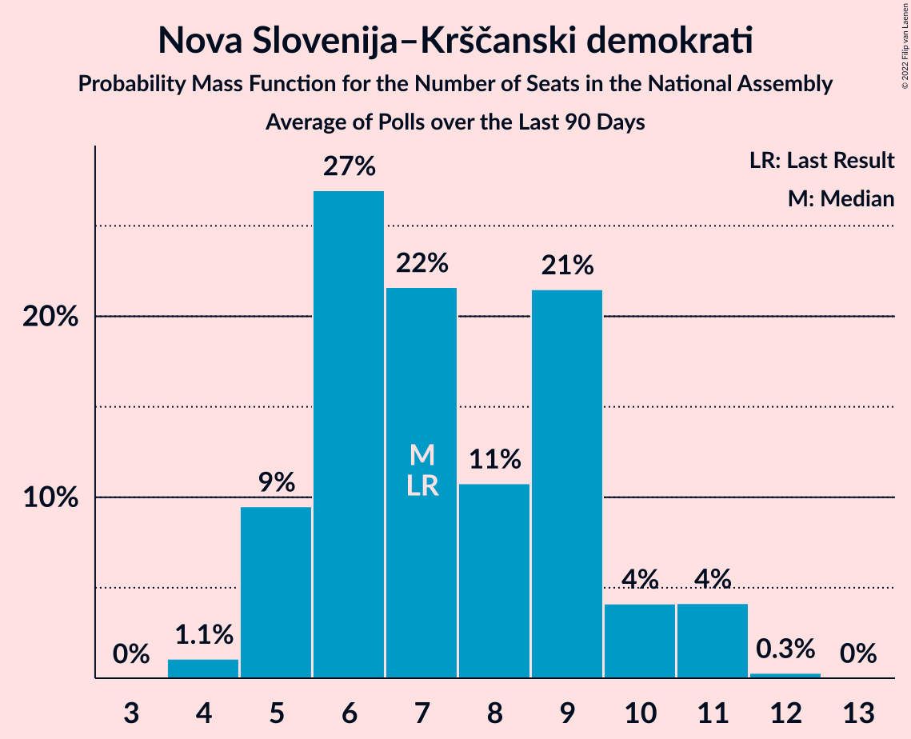

# Nova Slovenija–Krščanski demokrati

<a href="#voting-intentions">Voting Intentions</a> | <a href="#seats">Seats</a>

## Voting Intentions

Last result: **7.2%** (General Election of 3 June 2018)

### Confidence Intervals

| Period     | Polling firm/Commissioner(s) | Median | 80% Confidence Interval | 90% Confidence Interval | 95% Confidence Interval | 99% Confidence Interval |
|:----------:|:----------------:|:-----------:|:-----------------------:|:-----------------------:|:-----------------------:|:-----------------------:|
| N/A | [Poll Average](average.html) | 7.5% | 5.5–9.4% | 5.1–10.0% | 4.8–10.4% | 4.3–11.3% |
| [25 November 2018](2018-11-25-Mediana.html) | Mediana   POP TV | 8.1% | 6.7–9.8% | 6.3–10.3% | 6.0–10.7% | 5.4–11.6% |
| [19–20 November 2018](2018-11-20-Ninamedia.html) | Ninamedia   Dnevnik and RTV Slovenija | 8.0% | 6.7–9.7% | 6.3–10.2% | 6.0–10.6% | 5.4–11.5% |
| [7 November 2018](2018-11-07-ParsifalSC.html) | Parsifal SC | 5.9% | 5.0–7.3% | 4.7–7.6% | 4.4–8.0% | 4.0–8.6% |
| [1 November 2018](2018-11-01-Mediana.html) | Mediana | 8.0% | 6.8–9.4% | 6.5–9.8% | 6.2–10.2% | 5.7–10.9% |
| [9–11 October 2018](2018-10-11-Ninamedia.html) | Ninamedia | 7.0% | 5.9–8.4% | 5.6–8.8% | 5.3–9.1% | 4.8–9.8% |
| [3–11 October 2018](2018-10-11-Mediana.html) | Mediana   Delo | 7.0% | 5.9–8.4% | 5.6–8.8% | 5.4–9.1% | 4.9–9.8% |
| [11–13 September 2018](2018-09-13-Ninamedia.html) | Ninamedia | 8.4% | 7.0–10.1% | 6.7–10.5% | 6.4–11.0% | 5.8–11.8% |
| [30 August–6 September 2018](2018-09-06-Mediana.html) | Mediana   Delo | 7.1% | 5.8–8.9% | 5.4–9.3% | 5.1–9.8% | 4.6–10.7% |
| [26 August 2018](2018-08-26-Mediana.html) | Mediana   POP TV | 6.5% | 5.2–8.1% | 4.9–8.6% | 4.6–9.0% | 4.1–9.8% |
| [13–15 August 2018](2018-08-15-Ninamedia.html) | Ninamedia   Dnevnik and RTV Slovenija | 6.0% | 4.9–7.5% | 4.6–8.0% | 4.4–8.3% | 3.9–9.1% |
| [29 July 2018](2018-07-29-Mediana.html) | Mediana   POP TV | 7.4% | 6.1–9.0% | 5.7–9.5% | 5.4–9.9% | 4.9–10.8% |
| [10–12 July 2018](2018-07-12-Ninamedia.html) | Ninamedia   Dnevnik and RTV Slovenija | 5.6% | 4.6–7.0% | 4.3–7.4% | 4.1–7.8% | 3.6–8.5% |
| [1–23 June 2018](2018-06-23-Mediana.html) | Mediana   POP TV | 6.0% | 4.9–7.5% | 4.6–7.9% | 4.4–8.2% | 3.9–9.0% |
| [12–14 June 2018](2018-06-14-Ninamedia.html) | Ninamedia   Dnevnik and RTV Slovenija | 3.7% | 2.9–4.9% | 2.6–5.2% | 2.4–5.5% | 2.1–6.1% |
| [5–6 June 2018](2018-06-06-ParsifalSC.html) | Parsifal SC   Nova24TV | 5.9% | 4.8–7.5% | 4.5–7.9% | 4.2–8.3% | 3.7–9.1% |

### Probability Mass Function

The following table shows the probability mass function per percentage block of voting intentions for the [poll average](average.html) for Nova Slovenija–Krščanski demokrati.

| Voting Intentions | Probability | Accumulated | Special Marks |
|:-----------------:|:-----------:|:-----------:|:-------------:|
| 2.5–3.5% | 0% | 100% |  |
| 3.5–4.5% | 1.2% | 100% |  |
| 4.5–5.5% | 9% | 98.8% |  |
| 5.5–6.5% | 19% | 90% |  |
| 6.5–7.5% | 23% | 71% | Last Result, Median |
| 7.5–8.5% | 24% | 48% |  |
| 8.5–9.5% | 16% | 25% |  |
| 9.5–10.5% | 7% | 9% |  |
| 10.5–11.5% | 2% | 2% |  |
| 11.5–12.5% | 0.3% | 0.3% |  |
| 12.5–13.5% | 0% | 0% |  |

## Seats

Last result: **7** seats (General Election of 3 June 2018)

### Confidence Intervals

| Period     | Polling firm/Commissioner(s) | Median | 80% Confidence Interval | 90% Confidence Interval | 95% Confidence Interval | 99% Confidence Interval |
|:----------:|:----------------:|:------:|:-----------------------:|:-----------------------:|:-----------------------:|:-----------------------:|
| N/A | [Poll Average](average.html) | 7 | 5–9 | 5–9 | 4–10 | 4–10 |
| [25 November 2018](2018-11-25-Mediana.html) | Mediana   POP TV | 7 | 6–9 | 5–9 | 5–10 | 5–10 |
| [19–20 November 2018](2018-11-20-Ninamedia.html) | Ninamedia   Dnevnik and RTV Slovenija | 7 | 6–9 | 5–10 | 5–10 | 5–11 |
| [7 November 2018](2018-11-07-ParsifalSC.html) | Parsifal SC | 6 | 5–7 | 4–7 | 4–7 | 4–7 |
| [1 November 2018](2018-11-01-Mediana.html) | Mediana | 7 | 6–9 | 6–9 | 6–9 | 5–10 |
| [9–11 October 2018](2018-10-11-Ninamedia.html) | Ninamedia | 6 | 5–8 | 5–8 | 5–8 | 4–9 |
| [3–11 October 2018](2018-10-11-Mediana.html) | Mediana   Delo | 6 | 5–8 | 5–8 | 5–8 | 4–9 |
| [11–13 September 2018](2018-09-13-Ninamedia.html) | Ninamedia | 8 | 6–9 | 6–10 | 6–10 | 5–11 |
| [30 August–6 September 2018](2018-09-06-Mediana.html) | Mediana   Delo | 6 | 5–8 | 5–8 | 5–9 | 4–10 |
| [26 August 2018](2018-08-26-Mediana.html) | Mediana   POP TV | 6 | 5–7 | 4–7 | 4–8 | 3–9 |
| [13–15 August 2018](2018-08-15-Ninamedia.html) | Ninamedia   Dnevnik and RTV Slovenija | 6 | 4–7 | 4–7 | 4–8 | 0–8 |
| [29 July 2018](2018-07-29-Mediana.html) | Mediana   POP TV | 6 | 5–8 | 5–9 | 5–9 | 4–10 |
| [10–12 July 2018](2018-07-12-Ninamedia.html) | Ninamedia   Dnevnik and RTV Slovenija | 5 | 4–6 | 4–7 | 4–7 | 0–8 |
| [1–23 June 2018](2018-06-23-Mediana.html) | Mediana   POP TV | 6 | 5–7 | 4–7 | 4–7 | 0–9 |
| [12–14 June 2018](2018-06-14-Ninamedia.html) | Ninamedia   Dnevnik and RTV Slovenija | 0 | 0–4 | 0–4 | 0–4 | 0–5 |
| [5–6 June 2018](2018-06-06-ParsifalSC.html) | Parsifal SC   Nova24TV | 5 | 4–6 | 4–7 | 3–7 | 0–8 |

### Probability Mass Function

The following table shows the probability mass function per seat for the [poll average](average.html) for Nova Slovenija–Krščanski demokrati.

| Number of Seats | Probability | Accumulated | Special Marks |
|:---------------:|:-----------:|:-----------:|:-------------:|
| 3 | 0.1% | 100% |  |
| 4 | 3% | 99.9% |  |
| 5 | 12% | 97% |  |
| 6 | 30% | 85% |  |
| 7 | 30% | 55% | Last Result, Median |
| 8 | 14% | 25% |  |
| 9 | 9% | 12% |  |
| 10 | 3% | 3% |  |
| 11 | 0.4% | 0.4% |  |
| 12 | 0.1% | 0.1% |  |
| 13 | 0% | 0% |  |

