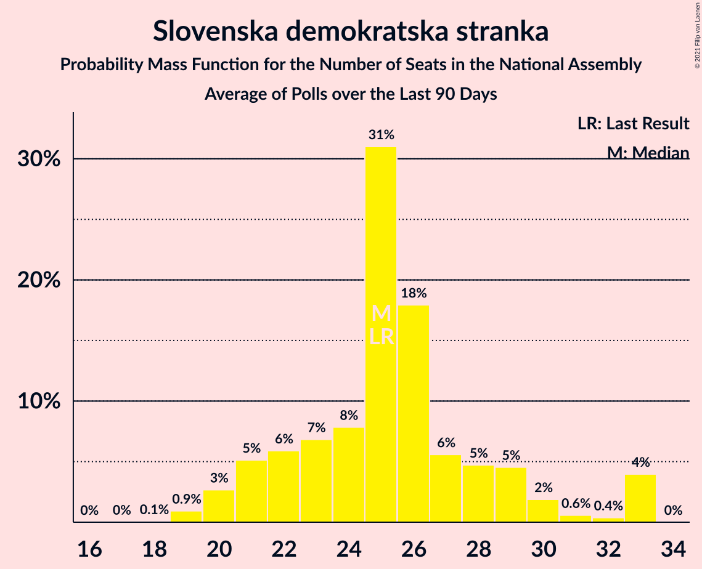

# Slovenska demokratska stranka

<a href="#voting-intentions">Voting Intentions</a> | <a href="#seats">Seats</a>

## Voting Intentions

Last result: **24.9%** (General Election of 3 June 2018)

### Confidence Intervals

| Period     | Polling firm/Commissioner(s) | Median | 80% Confidence Interval | 90% Confidence Interval | 95% Confidence Interval | 99% Confidence Interval |
|:----------:|:----------------:|:-----------:|:-----------------------:|:-----------------------:|:-----------------------:|:-----------------------:|
| N/A | [Poll Average](average.html) | 31.2% | 26.9–36.8% | 26.1–37.8% | 25.4–38.5% | 24.2–39.9% |
| [1–31 August 2020](2020-08-31-Mediana.html) | Mediana   POPTV | 27.7% | 25.7–30.0% | 25.1–30.6% | 24.6–31.1% | 23.6–32.2% |
| [11–13 August 2020](2020-08-13-Ninamedia.html) | Ninamedia   Dnevnik, Večer | 35.9% | 33.6–38.2% | 32.9–38.9% | 32.4–39.5% | 31.3–40.6% |
| [3–6 August 2020](2020-08-06-Mediana.html) | Mediana   POPTV | 29.8% | 28.2–32.6% | 27.6–33.3% | 27.1–33.8% | 26.1–34.9% |
| [1–26 July 2020](2020-07-26-Mediana.html) | Mediana   POPTV | 26.5% | 24.5–28.7% | 23.9–29.3% | 23.4–29.9% | 22.5–30.9% |
| [6–9 July 2020](2020-07-09-Mediana.html) | Mediana   POPTV | 27.2% | 25.1–29.4% | 24.6–30.0% | 24.1–30.5% | 23.1–31.6% |
| [29 June–2 July 2020](2020-07-02-Parsifal.html) | Parsifal   Nova 24TV | 31.0% | 28.9–33.3% | 28.3–34.0% | 27.8–34.5% | 26.7–35.7% |
| [1–28 June 2020](2020-06-28-Mediana.html) | Mediana   POP TV | 26.8% | 24.7–29.0% | 24.2–29.6% | 23.7–30.1% | 22.7–31.2% |
| [15–17 June 2020](2020-06-17-Parsifal.html) | Parsifal   Nova 24TV | 32.8% | 30.6–35.1% | 30.0–35.7% | 29.4–36.3% | 28.4–37.4% |
| [9–11 June 2020](2020-06-11-Ninamedia.html) | Ninamedia   Dnevnik, Večer | 33.1% | 30.9–35.5% | 30.3–36.2% | 29.8–36.7% | 28.7–37.9% |
| [18–21 May 2020](2020-05-21-Mediana.html) | Mediana   POP TV | 30.8% | 28.6–33.1% | 28.0–33.7% | 27.5–34.3% | 26.5–35.4% |
| [12–13 May 2020](2020-05-13-Ninamedia.html) | Ninamedia   Dnevnik, Večer | 35.6% | 33.3–37.9% | 32.7–38.6% | 32.1–39.2% | 31.0–40.3% |
| [6–8 May 2020](2020-05-08-Parsifal.html) | Parsifal   Nova 24TV | 30.5% | 28.5–32.7% | 27.9–33.3% | 27.4–33.9% | 26.4–34.9% |
| [4–8 May 2020](2020-05-08-Mediana.html) | Mediana   Delo | 25.3% | 23.3–27.4% | 22.7–28.1% | 22.2–28.6% | 21.3–29.7% |
| [26 April 2020](2020-04-26-Mediana.html) | Mediana   POPTV | 30.5% | 28.4–32.7% | 27.8–33.4% | 27.3–33.9% | 26.3–35.0% |
| [14–16 April 2020](2020-04-16-Ninamedia.html) | Ninamedia   Dnevnik, Večer | 37.3% | 35.0–39.7% | 34.3–40.3% | 33.8–40.9% | 32.7–42.1% |
| [6–9 April 2020](2020-04-09-Mediana.html) | Mediana   Delo | 29.1% | 27.0–31.4% | 26.5–32.0% | 25.9–32.6% | 25.0–33.7% |
| [10–12 March 2020](2020-03-12-Ninamedia.html) | Ninamedia   Dnevnik, Večer | 34.1% | 31.9–36.5% | 31.3–37.2% | 30.7–37.7% | 29.7–38.9% |
| [25 February–4 March 2020](2020-03-04-Mediana.html) | Mediana   Delo | 31.0% | 28.9–33.2% | 28.4–33.8% | 27.9–34.4% | 26.9–35.4% |
| [19–20 February 2020](2020-02-20-Parsifal.html) | Parsifal   Nova 24TV | 32.8% | 30.6–35.1% | 30.0–35.7% | 29.4–36.3% | 28.4–37.4% |
| [14 January–16 February 2020](2020-02-16-Ninamedia.html) | Ninamedia   RTV SLO | 25.3% | 23.3–27.5% | 22.7–28.1% | 22.2–28.6% | 21.3–29.7% |
| [12–13 February 2020](2020-02-13-Parsifal.html) | Parsifal   Nova 24 | 30.8% | 28.7–33.1% | 28.1–33.8% | 27.6–34.3% | 26.6–35.4% |
| [11–13 February 2020](2020-02-13-Ninamedia.html) | Ninamedia   RTV SLO | 29.3% | 27.1–31.6% | 26.6–32.2% | 26.0–32.8% | 25.0–33.9% |
| [3–5 February 2020](2020-02-05-Parsifal.html) | Parsifal   Nova 24 | 26.1% | 24.0–28.3% | 23.4–28.9% | 23.0–29.4% | 22.0–30.5% |
| [28 January–3 February 2020](2020-02-03-Mediana.html) | Mediana   Delo | 26.0% | 24.1–28.1% | 23.5–28.7% | 23.0–29.2% | 22.1–30.2% |
| [27–29 January 2020](2020-01-29-Parsifal.html) | Parsifal | 27.2% | 25.4–29.1% | 24.9–29.7% | 24.5–30.1% | 23.6–31.1% |
| [1–26 January 2020](2020-01-26-Mediana.html) | Mediana   POP TV | 22.9% | 21.1–25.0% | 20.6–25.6% | 20.1–26.1% | 19.2–27.1% |
| [3–9 January 2020](2020-01-09-Mediana.html) | Mediana   Delo | 21.2% | 19.3–23.2% | 18.8–23.8% | 18.3–24.3% | 17.5–25.3% |
| [10–12 December 2019](2019-12-12-Ninamedia.html) | Ninamedia   RTV SLO | 24.3% | 22.3–26.5% | 21.7–27.1% | 21.2–27.6% | 20.3–28.7% |
| [1–26 November 2019](2019-11-26-Mediana.html) | Mediana   POP TV | 25.1% | 23.2–27.3% | 22.6–27.9% | 22.1–28.4% | 21.2–29.5% |
| [12–14 November 2019](2019-11-14-Ninamedia.html) | Ninamedia   RTV SLO | 21.0% | 19.1–23.1% | 18.6–23.7% | 18.1–24.2% | 17.3–25.2% |
| [28 October–7 November 2019](2019-11-07-Mediana.html) | Mediana   Delo | 22.6% | 20.7–24.7% | 20.2–25.2% | 19.7–25.8% | 18.8–26.8% |
| [15–17 October 2019](2019-10-17-Ninamedia.html) | Ninamedia   RTV SLO | 22.6% | 20.6–24.7% | 20.1–25.3% | 19.6–25.8% | 18.7–26.9% |
| [1–22 September 2019](2019-09-22-Mediana.html) | Mediana   POP TV | 24.3% | 22.4–26.5% | 21.8–27.1% | 21.3–27.6% | 20.4–28.7% |
| [10–12 September 2019](2019-09-12-Ninamedia.html) | Ninamedia   RTV SLO | 21.4% | 19.5–23.5% | 19.0–24.1% | 18.5–24.6% | 17.7–25.7% |
| [28 August–5 September 2019](2019-09-05-Mediana.html) | Mediana   Delo | 23.5% | 21.6–25.6% | 21.0–26.2% | 20.5–26.7% | 19.6–27.7% |
| [1–25 August 2019](2019-08-25-Mediana.html) | Mediana   POP TV | 23.7% | 21.7–25.8% | 21.2–26.4% | 20.7–26.9% | 19.8–28.0% |
| [12–14 August 2019](2019-08-14-Ninamedia.html) | Ninamedia   RTV SLO and Dnevnik | 23.0% | 21.0–25.1% | 20.5–25.7% | 20.0–26.3% | 19.1–27.3% |
| [31 July–8 August 2019](2019-08-08-Mediana.html) | Mediana   Delo | 20.7% | 18.8–22.7% | 18.3–23.2% | 17.9–23.7% | 17.0–24.7% |
| [11–13 July 2019](2019-07-13-Ninamedia.html) | Ninamedia   RTV SLO and Dnevnik | 25.1% | 23.1–27.3% | 22.6–28.0% | 22.1–28.5% | 21.1–29.6% |
| [1–23 June 2019](2019-06-23-Mediana.html) | Mediana   POP TV | 24.2% | 22.3–26.4% | 21.7–27.0% | 21.2–27.5% | 20.3–28.5% |
| [11–13 June 2019](2019-06-13-Ninamedia.html) | Ninamedia   Dnevnik and Večer | 22.3% | 20.4–24.4% | 19.8–25.0% | 19.4–25.5% | 18.5–26.6% |
| [28 May–6 June 2019](2019-06-06-Mediana.html) | Mediana   POP TV | 23.1% | 21.2–25.2% | 20.7–25.7% | 20.2–26.3% | 19.3–27.3% |
| [14–16 May 2019](2019-05-16-Ninamedia.html) | Ninamedia   Dnevnik and RTV Slovenija | 24.0% | 22.0–26.2% | 21.5–26.8% | 21.0–27.3% | 20.1–28.4% |
| [8–15 May 2019](2019-05-15-Mediana.html) | Mediana   POP TV and Delo | 22.0% | 20.1–24.1% | 19.6–24.6% | 19.1–25.1% | 18.3–26.2% |
| [28 April 2019](2019-04-28-Mediana.html) | Mediana   POP TV | 22.5% | 20.4–24.8% | 19.8–25.5% | 19.3–26.0% | 18.3–27.2% |
| [9–11 April 2019](2019-04-11-Ninamedia.html) | Ninamedia   Dnevnik and RTV Slovenija | 19.8% | 17.6–22.2% | 17.0–22.9% | 16.5–23.5% | 15.5–24.7% |
| [1–4 April 2019](2019-04-04-ParsifalSC.html) | Parsifal SC   Nova24TV | 27.7% | 25.2–30.4% | 24.5–31.2% | 23.9–31.9% | 22.7–33.2% |
| [24 March 2019](2019-03-24-Mediana.html) | Mediana   POP TV | 22.9% | 20.7–25.2% | 20.1–25.9% | 19.6–26.5% | 18.6–27.6% |
| [12–14 March 2019](2019-03-14-Ninamedia.html) | Ninamedia   Dnevnik and RTV Slovenija | 18.4% | 16.4–20.7% | 15.8–21.4% | 15.3–21.9% | 14.4–23.1% |
| [26 February–7 March 2019](2019-03-07-Mediana.html) | Mediana   Delo | 23.2% | 21.0–25.7% | 20.3–26.4% | 19.8–27.1% | 18.7–28.3% |
| [24 February 2019](2019-02-24-Mediana.html) | Mediana   POP TV | 22.9% | 20.6–25.4% | 20.0–26.1% | 19.4–26.7% | 18.4–27.9% |
| [12–14 February 2019](2019-02-14-Ninamedia.html) | Ninamedia   Dnevnik and RTV Slovenija | 15.3% | 13.5–17.5% | 12.9–18.1% | 12.5–18.6% | 11.6–19.7% |
| [29 January–6 February 2019](2019-02-06-Ninamedia.html) | Ninamedia   MMC and RTV Slovenija | 15.1% | 13.4–17.1% | 12.9–17.6% | 12.5–18.1% | 11.7–19.1% |
| [8–10 January 2019](2019-01-10-Ninamedia.html) | Ninamedia   MMC and RTV Slovenija | 23.7% | 21.4–26.3% | 20.7–27.0% | 20.2–27.6% | 19.1–28.9% |
| [11–13 December 2018](2018-12-13-Ninamedia.html) | Ninamedia | 26.0% | 24.0–28.2% | 23.4–28.8% | 22.9–29.4% | 21.9–30.5% |
| [4–7 December 2018](2018-12-07-ParsifalSC.html) | Parsifal SC | 27.9% | 25.9–30.2% | 25.3–30.8% | 24.8–31.4% | 23.8–32.4% |
| [25 November 2018](2018-11-25-Mediana.html) | Mediana   POP TV | 26.9% | 24.5–29.5% | 23.8–30.2% | 23.2–30.8% | 22.1–32.1% |
| [19–20 November 2018](2018-11-20-Ninamedia.html) | Ninamedia   Dnevnik and RTV Slovenija | 23.7% | 21.5–26.2% | 20.8–26.9% | 20.3–27.5% | 19.2–28.7% |
| [7 November 2018](2018-11-07-ParsifalSC.html) | Parsifal SC | 29.0% | 26.9–31.3% | 26.3–31.9% | 25.8–32.5% | 24.8–33.6% |
| [1 November 2018](2018-11-01-Mediana.html) | Mediana | 31.0% | 28.9–33.3% | 28.3–33.9% | 27.8–34.5% | 26.8–35.6% |
| [9–11 October 2018](2018-10-11-Ninamedia.html) | Ninamedia | 24.0% | 22.0–26.2% | 21.5–26.8% | 21.0–27.3% | 20.1–28.4% |
| [3–11 October 2018](2018-10-11-Mediana.html) | Mediana   Delo | 28.0% | 25.9–30.2% | 25.3–30.8% | 24.8–31.4% | 23.9–32.5% |
| [11–13 September 2018](2018-09-13-Ninamedia.html) | Ninamedia | 32.3% | 29.8–34.9% | 29.1–35.6% | 28.5–36.2% | 27.4–37.5% |
| [30 August–6 September 2018](2018-09-06-Mediana.html) | Mediana   Delo | 26.8% | 24.3–29.5% | 23.6–30.3% | 23.0–30.9% | 21.9–32.3% |
| [26 August 2018](2018-08-26-Mediana.html) | Mediana   POP TV | 30.9% | 28.3–33.7% | 27.6–34.4% | 27.0–35.1% | 25.8–36.5% |
| [13–15 August 2018](2018-08-15-Ninamedia.html) | Ninamedia   Dnevnik and RTV Slovenija | 29.9% | 27.5–32.5% | 26.8–33.2% | 26.2–33.8% | 25.1–35.1% |
| [29 July 2018](2018-07-29-Mediana.html) | Mediana   POP TV | 29.1% | 26.7–31.7% | 26.0–32.5% | 25.4–33.1% | 24.3–34.4% |
| [10–12 July 2018](2018-07-12-Ninamedia.html) | Ninamedia   Dnevnik and RTV Slovenija | 29.3% | 27.0–31.7% | 26.3–32.4% | 25.8–33.0% | 24.7–34.2% |
| [1–23 June 2018](2018-06-23-Mediana.html) | Mediana   POP TV | 32.2% | 29.8–34.7% | 29.1–35.4% | 28.5–36.0% | 27.4–37.3% |
| [12–14 June 2018](2018-06-14-Ninamedia.html) | Ninamedia   Dnevnik and RTV Slovenija | 29.3% | 27.0–31.8% | 26.4–32.5% | 25.8–33.1% | 24.8–34.3% |
| [5–6 June 2018](2018-06-06-ParsifalSC.html) | Parsifal SC   Nova24TV | 31.2% | 28.6–33.9% | 27.9–34.7% | 27.3–35.3% | 26.1–36.7% |

### Probability Mass Function

The following table shows the probability mass function per percentage block of voting intentions for the [poll average](average.html) for Slovenska demokratska stranka.

| Voting Intentions | Probability | Accumulated | Special Marks |
|:-----------------:|:-----------:|:-----------:|:-------------:|
| 21.5–22.5% | 0% | 100% |  |
| 22.5–23.5% | 0.1% | 100% |  |
| 23.5–24.5% | 0.7% | 99.9% |  |
| 24.5–25.5% | 2% | 99.2% | Last Result |
| 25.5–26.5% | 5% | 97% |  |
| 26.5–27.5% | 8% | 92% |  |
| 27.5–28.5% | 9% | 84% |  |
| 28.5–29.5% | 10% | 75% |  |
| 29.5–30.5% | 10% | 65% |  |
| 30.5–31.5% | 9% | 56% | Median |
| 31.5–32.5% | 8% | 47% |  |
| 32.5–33.5% | 6% | 39% |  |
| 33.5–34.5% | 6% | 33% |  |
| 34.5–35.5% | 7% | 26% |  |
| 35.5–36.5% | 7% | 19% |  |
| 36.5–37.5% | 6% | 12% |  |
| 37.5–38.5% | 4% | 6% |  |
| 38.5–39.5% | 2% | 2% |  |
| 39.5–40.5% | 0.6% | 0.8% |  |
| 40.5–41.5% | 0.2% | 0.2% |  |
| 41.5–42.5% | 0% | 0% |  |

## Seats

Last result: **25** seats (General Election of 3 June 2018)

### Confidence Intervals

| Period     | Polling firm/Commissioner(s) | Median | 80% Confidence Interval | 90% Confidence Interval | 95% Confidence Interval | 99% Confidence Interval |
|:----------:|:----------------:|:------:|:-----------------------:|:-----------------------:|:-----------------------:|:-----------------------:|
| N/A | [Poll Average](average.html) | 30 | 26–36 | 25–37 | 25–37 | 23–38 |
| [1–31 August 2020](2020-08-31-Mediana.html) | Mediana   POPTV | 27 | 25–30 | 24–30 | 24–30 | 22–31 |
| [11–13 August 2020](2020-08-13-Ninamedia.html) | Ninamedia   Dnevnik, Večer | 35 | 33–37 | 32–38 | 31–38 | 30–39 |
| [3–6 August 2020](2020-08-06-Mediana.html) | Mediana   POPTV | 31 | 28–33 | 28–33 | 27–34 | 26–35 |
| [1–26 July 2020](2020-07-26-Mediana.html) | Mediana   POPTV | 26 | 24–29 | 23–29 | 23–30 | 22–31 |
| [6–9 July 2020](2020-07-09-Mediana.html) | Mediana   POPTV | 27 | 25–29 | 24–30 | 24–30 | 23–33 |
| [29 June–2 July 2020](2020-07-02-Parsifal.html) | Parsifal   Nova 24TV | 30 | 28–33 | 27–34 | 27–35 | 26–35 |
| [1–28 June 2020](2020-06-28-Mediana.html) | Mediana   POP TV | 26 | 24–28 | 23–29 | 23–29 | 22–30 |
| [15–17 June 2020](2020-06-17-Parsifal.html) | Parsifal   Nova 24TV | 32 | 29–35 | 29–36 | 28–37 | 28–37 |
| [9–11 June 2020](2020-06-11-Ninamedia.html) | Ninamedia   Dnevnik, Večer | 32 | 30–34 | 29–35 | 28–36 | 28–37 |
| [18–21 May 2020](2020-05-21-Mediana.html) | Mediana   POP TV | 30 | 27–32 | 26–32 | 25–33 | 24–34 |
| [12–13 May 2020](2020-05-13-Ninamedia.html) | Ninamedia   Dnevnik, Večer | 35 | 33–37 | 32–38 | 31–39 | 30–40 |
| [6–8 May 2020](2020-05-08-Parsifal.html) | Parsifal   Nova 24TV | 29 | 27–32 | 27–33 | 26–33 | 25–34 |
| [4–8 May 2020](2020-05-08-Mediana.html) | Mediana   Delo | 24 | 22–26 | 21–27 | 21–27 | 20–29 |
| [26 April 2020](2020-04-26-Mediana.html) | Mediana   POPTV | 29 | 27–31 | 26–31 | 26–33 | 25–34 |
| [14–16 April 2020](2020-04-16-Ninamedia.html) | Ninamedia   Dnevnik, Večer | 35 | 32–37 | 32–38 | 31–38 | 31–40 |
| [6–9 April 2020](2020-04-09-Mediana.html) | Mediana   Delo | 28 | 25–30 | 25–31 | 25–32 | 24–33 |
| [10–12 March 2020](2020-03-12-Ninamedia.html) | Ninamedia   Dnevnik, Večer | 32 | 30–35 | 30–37 | 29–37 | 28–38 |
| [25 February–4 March 2020](2020-03-04-Mediana.html) | Mediana   Delo | 31 | 28–33 | 28–33 | 26–34 | 26–35 |
| [19–20 February 2020](2020-02-20-Parsifal.html) | Parsifal   Nova 24TV | 31 | 30–35 | 29–37 | 28–38 | 27–38 |
| [14 January–16 February 2020](2020-02-16-Ninamedia.html) | Ninamedia   RTV SLO | 25 | 22–27 | 22–27 | 21–28 | 20–29 |
| [12–13 February 2020](2020-02-13-Parsifal.html) | Parsifal   Nova 24 | 31 | 28–33 | 27–33 | 26–34 | 25–35 |
| [11–13 February 2020](2020-02-13-Ninamedia.html) | Ninamedia   RTV SLO | 29 | 27–31 | 26–32 | 26–33 | 25–34 |
| [3–5 February 2020](2020-02-05-Parsifal.html) | Parsifal   Nova 24 | 25 | 24–28 | 23–29 | 22–30 | 21–31 |
| [28 January–3 February 2020](2020-02-03-Mediana.html) | Mediana   Delo | 26 | 23–28 | 23–29 | 23–30 | 22–31 |
| [27–29 January 2020](2020-01-29-Parsifal.html) | Parsifal | 28 | 25–29 | 24–30 | 24–30 | 23–32 |
| [1–26 January 2020](2020-01-26-Mediana.html) | Mediana   POP TV | 22 | 20–25 | 20–25 | 19–26 | 18–26 |
| [3–9 January 2020](2020-01-09-Mediana.html) | Mediana   Delo | 20 | 18–22 | 18–23 | 17–24 | 17–25 |
| [10–12 December 2019](2019-12-12-Ninamedia.html) | Ninamedia   RTV SLO | 23 | 21–25 | 21–26 | 20–27 | 19–28 |
| [1–26 November 2019](2019-11-26-Mediana.html) | Mediana   POP TV | 23 | 22–25 | 21–26 | 21–27 | 20–27 |
| [12–14 November 2019](2019-11-14-Ninamedia.html) | Ninamedia   RTV SLO | 20 | 18–22 | 18–23 | 17–23 | 17–24 |
| [28 October–7 November 2019](2019-11-07-Mediana.html) | Mediana   Delo | 23 | 20–24 | 20–25 | 19–26 | 19–27 |
| [15–17 October 2019](2019-10-17-Ninamedia.html) | Ninamedia   RTV SLO | 22 | 20–23 | 20–23 | 19–24 | 18–27 |
| [1–22 September 2019](2019-09-22-Mediana.html) | Mediana   POP TV | 23 | 21–26 | 21–26 | 20–27 | 19–28 |
| [10–12 September 2019](2019-09-12-Ninamedia.html) | Ninamedia   RTV SLO | 22 | 19–22 | 19–24 | 18–25 | 17–26 |
| [28 August–5 September 2019](2019-09-05-Mediana.html) | Mediana   Delo | 23 | 21–26 | 19–27 | 19–27 | 19–28 |
| [1–25 August 2019](2019-08-25-Mediana.html) | Mediana   POP TV | 23 | 21–26 | 21–26 | 20–26 | 20–28 |
| [12–14 August 2019](2019-08-14-Ninamedia.html) | Ninamedia   RTV SLO and Dnevnik | 22 | 21–24 | 20–25 | 20–25 | 18–27 |
| [31 July–8 August 2019](2019-08-08-Mediana.html) | Mediana   Delo | 20 | 18–22 | 18–23 | 17–24 | 17–25 |
| [11–13 July 2019](2019-07-13-Ninamedia.html) | Ninamedia   RTV SLO and Dnevnik | 25 | 23–27 | 22–28 | 21–28 | 21–29 |
| [1–23 June 2019](2019-06-23-Mediana.html) | Mediana   POP TV | 23 | 22–26 | 20–27 | 20–28 | 20–29 |
| [11–13 June 2019](2019-06-13-Ninamedia.html) | Ninamedia   Dnevnik and Večer | 21 | 19–24 | 19–24 | 18–25 | 17–26 |
| [28 May–6 June 2019](2019-06-06-Mediana.html) | Mediana   POP TV | 22 | 20–24 | 20–25 | 19–26 | 18–27 |
| [14–16 May 2019](2019-05-16-Ninamedia.html) | Ninamedia   Dnevnik and RTV Slovenija | 24 | 22–26 | 21–27 | 20–27 | 19–28 |
| [8–15 May 2019](2019-05-15-Mediana.html) | Mediana   POP TV and Delo | 22 | 19–23 | 19–24 | 18–24 | 17–26 |
| [28 April 2019](2019-04-28-Mediana.html) | Mediana   POP TV | 22 | 20–24 | 19–25 | 19–25 | 18–27 |
| [9–11 April 2019](2019-04-11-Ninamedia.html) | Ninamedia   Dnevnik and RTV Slovenija | 19 | 16–21 | 16–22 | 15–22 | 14–24 |
| [1–4 April 2019](2019-04-04-ParsifalSC.html) | Parsifal SC   Nova24TV | 27 | 24–29 | 23–31 | 23–31 | 21–33 |
| [24 March 2019](2019-03-24-Mediana.html) | Mediana   POP TV | 21 | 19–24 | 18–25 | 18–26 | 17–28 |
| [12–14 March 2019](2019-03-14-Ninamedia.html) | Ninamedia   Dnevnik and RTV Slovenija | 18 | 16–21 | 15–22 | 15–22 | 14–22 |
| [26 February–7 March 2019](2019-03-07-Mediana.html) | Mediana   Delo | 23 | 20–25 | 20–26 | 19–27 | 18–28 |
| [24 February 2019](2019-02-24-Mediana.html) | Mediana   POP TV | 21 | 20–25 | 19–26 | 19–27 | 18–29 |
| [12–14 February 2019](2019-02-14-Ninamedia.html) | Ninamedia   Dnevnik and RTV Slovenija | 16 | 13–17 | 13–17 | 12–18 | 11–19 |
| [29 January–6 February 2019](2019-02-06-Ninamedia.html) | Ninamedia   MMC and RTV Slovenija | 15 | 13–17 | 13–17 | 12–18 | 11–19 |
| [8–10 January 2019](2019-01-10-Ninamedia.html) | Ninamedia   MMC and RTV Slovenija | 23 | 21–26 | 20–26 | 19–28 | 18–29 |
| [11–13 December 2018](2018-12-13-Ninamedia.html) | Ninamedia | 25 | 23–28 | 22–28 | 22–29 | 21–30 |
| [4–7 December 2018](2018-12-07-ParsifalSC.html) | Parsifal SC | 28 | 25–30 | 25–30 | 24–31 | 23–32 |
| [25 November 2018](2018-11-25-Mediana.html) | Mediana   POP TV | 25 | 22–28 | 22–28 | 21–28 | 20–30 |
| [19–20 November 2018](2018-11-20-Ninamedia.html) | Ninamedia   Dnevnik and RTV Slovenija | 22 | 20–25 | 19–26 | 19–27 | 18–29 |
| [7 November 2018](2018-11-07-ParsifalSC.html) | Parsifal SC | 29 | 26–31 | 26–31 | 25–32 | 24–33 |
| [1 November 2018](2018-11-01-Mediana.html) | Mediana | 30 | 28–32 | 27–33 | 27–33 | 25–34 |
| [9–11 October 2018](2018-10-11-Ninamedia.html) | Ninamedia | 23 | 21–25 | 20–26 | 19–27 | 18–28 |
| [3–11 October 2018](2018-10-11-Mediana.html) | Mediana   Delo | 26 | 25–29 | 24–29 | 24–30 | 23–31 |
| [11–13 September 2018](2018-09-13-Ninamedia.html) | Ninamedia | 30 | 28–33 | 27–34 | 27–36 | 25–36 |
| [30 August–6 September 2018](2018-09-06-Mediana.html) | Mediana   Delo | 24 | 23–27 | 22–28 | 21–29 | 19–30 |
| [26 August 2018](2018-08-26-Mediana.html) | Mediana   POP TV | 29 | 26–31 | 26–32 | 25–33 | 24–35 |
| [13–15 August 2018](2018-08-15-Ninamedia.html) | Ninamedia   Dnevnik and RTV Slovenija | 29 | 26–31 | 26–32 | 25–33 | 24–35 |
| [29 July 2018](2018-07-29-Mediana.html) | Mediana   POP TV | 27 | 25–30 | 24–31 | 23–31 | 22–34 |
| [10–12 July 2018](2018-07-12-Ninamedia.html) | Ninamedia   Dnevnik and RTV Slovenija | 28 | 26–30 | 25–31 | 24–32 | 23–34 |
| [1–23 June 2018](2018-06-23-Mediana.html) | Mediana   POP TV | 31 | 28–34 | 28–35 | 27–37 | 26–38 |
| [12–14 June 2018](2018-06-14-Ninamedia.html) | Ninamedia   Dnevnik and RTV Slovenija | 28 | 26–31 | 25–32 | 24–33 | 23–34 |
| [5–6 June 2018](2018-06-06-ParsifalSC.html) | Parsifal SC   Nova24TV | 28 | 26–32 | 26–33 | 25–33 | 24–35 |

### Probability Mass Function

The following table shows the probability mass function per seat for the [poll average](average.html) for Slovenska demokratska stranka.

| Number of Seats | Probability | Accumulated | Special Marks |
|:---------------:|:-----------:|:-----------:|:-------------:|
| 22 | 0.2% | 100% |  |
| 23 | 0.6% | 99.8% |  |
| 24 | 1.4% | 99.2% |  |
| 25 | 5% | 98% | Last Result |
| 26 | 6% | 93% |  |
| 27 | 9% | 87% |  |
| 28 | 10% | 78% |  |
| 29 | 11% | 68% |  |
| 30 | 9% | 57% | Median |
| 31 | 7% | 48% |  |
| 32 | 6% | 41% |  |
| 33 | 9% | 35% |  |
| 34 | 5% | 26% |  |
| 35 | 10% | 21% |  |
| 36 | 3% | 11% |  |
| 37 | 6% | 8% |  |
| 38 | 2% | 2% |  |
| 39 | 0.2% | 0.3% |  |
| 40 | 0.1% | 0.1% |  |
| 41 | 0% | 0% |  |

