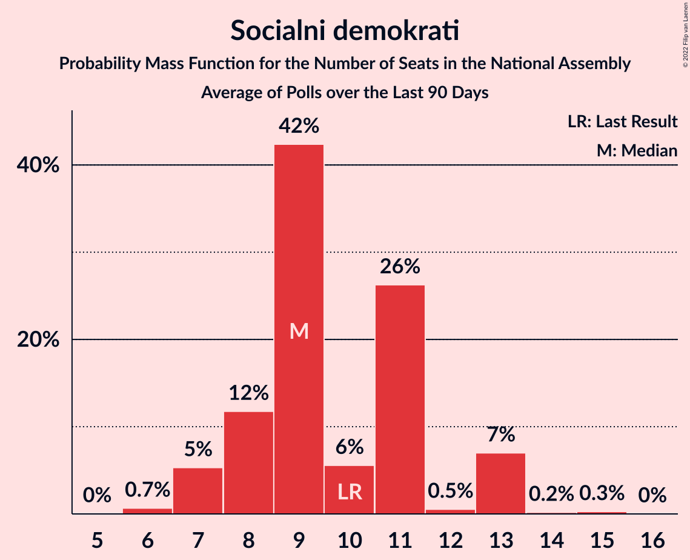

# Socialni demokrati

<a href="#voting-intentions">Voting Intentions</a> | <a href="#seats">Seats</a>

## Voting Intentions

Last result: **9.9%** (General Election of 3 June 2018)

### Confidence Intervals

| Period     | Polling firm/Commissioner(s) | Median | 80% Confidence Interval | 90% Confidence Interval | 95% Confidence Interval | 99% Confidence Interval |
|:----------:|:----------------:|:-----------:|:-----------------------:|:-----------------------:|:-----------------------:|:-----------------------:|
| N/A | [Poll Average](average.html) | 11.2% | 9.1–15.8% | 8.6–16.5% | 8.3–17.1% | 7.6–18.1% |
| [14–16 May 2019](2019-05-16-Ninamedia.html) | Ninamedia   Dnevnik and RTV Slovenija | 15.0% | 13.4–16.9% | 12.9–17.4% | 12.5–17.8% | 11.8–18.8% |
| [8–15 May 2019](2019-05-15-Mediana.html) | Mediana   POP TV and Delo | 10.1% | 8.8–11.7% | 8.4–12.1% | 8.1–12.5% | 7.5–13.3% |
| [28 April 2019](2019-04-28-Mediana.html) | Mediana   POP TV | 10.1% | 8.7–11.9% | 8.3–12.4% | 7.9–12.8% | 7.3–13.7% |
| [9–11 April 2019](2019-04-11-Ninamedia.html) | Ninamedia   Dnevnik and RTV Slovenija | 13.4% | 11.6–15.5% | 11.1–16.1% | 10.7–16.6% | 9.9–17.7% |
| [1–4 April 2019](2019-04-04-ParsifalSC.html) | Parsifal SC   Nova24TV | 10.4% | 8.8–12.4% | 8.4–13.0% | 8.0–13.5% | 7.3–14.5% |
| [24 March 2019](2019-03-24-Mediana.html) | Mediana   POP TV | 8.2% | 6.9–9.9% | 6.5–10.3% | 6.2–10.7% | 5.7–11.6% |
| [12–14 March 2019](2019-03-14-Ninamedia.html) | Ninamedia   Dnevnik and RTV Slovenija | 10.9% | 9.3–12.9% | 8.9–13.4% | 8.5–13.9% | 7.8–14.9% |
| [26 February–7 March 2019](2019-03-07-Mediana.html) | Mediana   Delo | 9.7% | 8.2–11.5% | 7.8–12.1% | 7.4–12.5% | 6.8–13.5% |
| [24 February 2019](2019-02-24-Mediana.html) | Mediana   POP TV | 7.8% | 6.4–9.5% | 6.1–10.0% | 5.7–10.4% | 5.2–11.3% |
| [12–14 February 2019](2019-02-14-Ninamedia.html) | Ninamedia   Dnevnik and RTV Slovenija | 11.7% | 10.1–13.7% | 9.6–14.3% | 9.3–14.8% | 8.5–15.7% |
| [29 January–6 February 2019](2019-02-06-Ninamedia.html) | Ninamedia   MMC and RTV Slovenija | 5.7% | 4.7–7.1% | 4.4–7.5% | 4.2–7.8% | 3.7–8.5% |
| [8–10 January 2019](2019-01-10-Ninamedia.html) | Ninamedia   MMC and RTV Slovenija | 16.5% | 14.5–18.8% | 13.9–19.4% | 13.5–20.0% | 12.6–21.1% |
| [11–13 December 2018](2018-12-13-Ninamedia.html) | Ninamedia | 17.0% | 15.3–18.9% | 14.8–19.5% | 14.4–20.0% | 13.6–20.9% |
| [4–7 December 2018](2018-12-07-ParsifalSC.html) | Parsifal SC | 16.0% | 14.4–17.9% | 13.9–18.4% | 13.5–18.9% | 12.7–19.8% |
| [25 November 2018](2018-11-25-Mediana.html) | Mediana   POP TV | 13.1% | 11.3–15.1% | 10.8–15.7% | 10.4–16.2% | 9.6–17.3% |
| [19–20 November 2018](2018-11-20-Ninamedia.html) | Ninamedia   Dnevnik and RTV Slovenija | 19.4% | 17.3–21.7% | 16.8–22.4% | 16.3–23.0% | 15.3–24.1% |
| [7 November 2018](2018-11-07-ParsifalSC.html) | Parsifal SC | 15.0% | 13.4–16.9% | 13.0–17.4% | 12.6–17.8% | 11.8–18.8% |
| [1 November 2018](2018-11-01-Mediana.html) | Mediana | 11.0% | 9.7–12.7% | 9.3–13.1% | 8.9–13.5% | 8.3–14.3% |
| [9–11 October 2018](2018-10-11-Ninamedia.html) | Ninamedia | 17.0% | 15.3–18.9% | 14.8–19.5% | 14.4–20.0% | 13.6–20.9% |
| [3–11 October 2018](2018-10-11-Mediana.html) | Mediana   Delo | 11.0% | 9.7–12.7% | 9.3–13.1% | 8.9–13.5% | 8.3–14.3% |
| [11–13 September 2018](2018-09-13-Ninamedia.html) | Ninamedia | 13.4% | 11.7–15.4% | 11.2–15.9% | 10.8–16.4% | 10.0–17.5% |
| [30 August–6 September 2018](2018-09-06-Mediana.html) | Mediana   Delo | 9.8% | 8.3–11.8% | 7.8–12.3% | 7.5–12.8% | 6.8–13.8% |
| [26 August 2018](2018-08-26-Mediana.html) | Mediana   POP TV | 10.1% | 8.6–12.0% | 8.1–12.6% | 7.7–13.1% | 7.1–14.1% |
| [13–15 August 2018](2018-08-15-Ninamedia.html) | Ninamedia   Dnevnik and RTV Slovenija | 12.6% | 11.0–14.6% | 10.5–15.1% | 10.1–15.7% | 9.4–16.6% |
| [29 July 2018](2018-07-29-Mediana.html) | Mediana   POP TV | 10.2% | 8.7–12.1% | 8.3–12.6% | 7.9–13.1% | 7.2–14.0% |
| [10–12 July 2018](2018-07-12-Ninamedia.html) | Ninamedia   Dnevnik and RTV Slovenija | 10.2% | 8.8–12.0% | 8.4–12.5% | 8.1–12.9% | 7.4–13.8% |
| [1–23 June 2018](2018-06-23-Mediana.html) | Mediana   POP TV | 10.7% | 9.3–12.5% | 8.8–13.0% | 8.5–13.5% | 7.8–14.4% |
| [12–14 June 2018](2018-06-14-Ninamedia.html) | Ninamedia   Dnevnik and RTV Slovenija | 10.7% | 9.2–12.5% | 8.8–13.0% | 8.4–13.4% | 7.8–14.3% |
| [5–6 June 2018](2018-06-06-ParsifalSC.html) | Parsifal SC   Nova24TV | 12.0% | 10.3–14.1% | 9.9–14.6% | 9.5–15.2% | 8.7–16.2% |

### Probability Mass Function

The following table shows the probability mass function per percentage block of voting intentions for the [poll average](average.html) for Socialni demokrati.

| Voting Intentions | Probability | Accumulated | Special Marks |
|:-----------------:|:-----------:|:-----------:|:-------------:|
| 5.5–6.5% | 0% | 100% |  |
| 6.5–7.5% | 0.5% | 100% |  |
| 7.5–8.5% | 4% | 99.5% |  |
| 8.5–9.5% | 13% | 96% |  |
| 9.5–10.5% | 20% | 83% | Last Result |
| 10.5–11.5% | 17% | 62% | Median |
| 11.5–12.5% | 9% | 45% |  |
| 12.5–13.5% | 6% | 36% |  |
| 13.5–14.5% | 8% | 30% |  |
| 14.5–15.5% | 10% | 22% |  |
| 15.5–16.5% | 7% | 12% |  |
| 16.5–17.5% | 3% | 5% |  |
| 17.5–18.5% | 1.1% | 1.3% |  |
| 18.5–19.5% | 0.2% | 0.2% |  |
| 19.5–20.5% | 0% | 0% |  |

## Seats

Last result: **10** seats (General Election of 3 June 2018)

### Confidence Intervals

| Period     | Polling firm/Commissioner(s) | Median | 80% Confidence Interval | 90% Confidence Interval | 95% Confidence Interval | 99% Confidence Interval |
|:----------:|:----------------:|:------:|:-----------------------:|:-----------------------:|:-----------------------:|:-----------------------:|
| N/A | [Poll Average](average.html) | 10 | 8–16 | 8–17 | 8–17 | 7–18 |
| [14–16 May 2019](2019-05-16-Ninamedia.html) | Ninamedia   Dnevnik and RTV Slovenija | 15 | 13–17 | 12–17 | 12–18 | 11–19 |
| [8–15 May 2019](2019-05-15-Mediana.html) | Mediana   POP TV and Delo | 10 | 8–11 | 8–11 | 7–12 | 7–13 |
| [28 April 2019](2019-04-28-Mediana.html) | Mediana   POP TV | 10 | 8–11 | 8–12 | 7–13 | 7–13 |
| [9–11 April 2019](2019-04-11-Ninamedia.html) | Ninamedia   Dnevnik and RTV Slovenija | 12 | 11–14 | 10–16 | 10–16 | 9–17 |
| [1–4 April 2019](2019-04-04-ParsifalSC.html) | Parsifal SC   Nova24TV | 10 | 8–12 | 8–12 | 7–13 | 7–14 |
| [24 March 2019](2019-03-24-Mediana.html) | Mediana   POP TV | 8 | 6–9 | 6–10 | 6–10 | 5–11 |
| [12–14 March 2019](2019-03-14-Ninamedia.html) | Ninamedia   Dnevnik and RTV Slovenija | 9 | 9–13 | 8–13 | 8–14 | 7–14 |
| [26 February–7 March 2019](2019-03-07-Mediana.html) | Mediana   Delo | 10 | 8–12 | 7–12 | 7–13 | 6–13 |
| [24 February 2019](2019-02-24-Mediana.html) | Mediana   POP TV | 7 | 6–8 | 6–9 | 5–9 | 5–10 |
| [12–14 February 2019](2019-02-14-Ninamedia.html) | Ninamedia   Dnevnik and RTV Slovenija | 14 | 11–14 | 10–15 | 9–16 | 8–17 |
| [29 January–6 February 2019](2019-02-06-Ninamedia.html) | Ninamedia   MMC and RTV Slovenija | 4 | 4–6 | 0–7 | 0–8 | 0–9 |
| [8–10 January 2019](2019-01-10-Ninamedia.html) | Ninamedia   MMC and RTV Slovenija | 15 | 13–18 | 13–19 | 13–20 | 11–20 |
| [11–13 December 2018](2018-12-13-Ninamedia.html) | Ninamedia | 17 | 14–19 | 14–19 | 14–19 | 13–21 |
| [4–7 December 2018](2018-12-07-ParsifalSC.html) | Parsifal SC | 16 | 14–18 | 13–18 | 13–18 | 12–19 |
| [25 November 2018](2018-11-25-Mediana.html) | Mediana   POP TV | 12 | 10–14 | 10–14 | 9–15 | 9–16 |
| [19–20 November 2018](2018-11-20-Ninamedia.html) | Ninamedia   Dnevnik and RTV Slovenija | 19 | 16–21 | 15–21 | 15–22 | 14–23 |
| [7 November 2018](2018-11-07-ParsifalSC.html) | Parsifal SC | 14 | 13–16 | 12–17 | 12–17 | 11–18 |
| [1 November 2018](2018-11-01-Mediana.html) | Mediana | 10 | 9–12 | 8–12 | 8–13 | 8–13 |
| [9–11 October 2018](2018-10-11-Ninamedia.html) | Ninamedia | 16 | 14–18 | 14–19 | 13–19 | 13–20 |
| [3–11 October 2018](2018-10-11-Mediana.html) | Mediana   Delo | 10 | 9–12 | 9–12 | 8–13 | 7–13 |
| [11–13 September 2018](2018-09-13-Ninamedia.html) | Ninamedia | 13 | 10–14 | 10–15 | 10–16 | 9–16 |
| [30 August–6 September 2018](2018-09-06-Mediana.html) | Mediana   Delo | 9 | 7–11 | 7–11 | 7–12 | 6–13 |
| [26 August 2018](2018-08-26-Mediana.html) | Mediana   POP TV | 9 | 8–11 | 7–11 | 7–12 | 6–13 |
| [13–15 August 2018](2018-08-15-Ninamedia.html) | Ninamedia   Dnevnik and RTV Slovenija | 12 | 10–14 | 10–15 | 9–15 | 9–16 |
| [29 July 2018](2018-07-29-Mediana.html) | Mediana   POP TV | 9 | 8–11 | 7–12 | 7–12 | 6–13 |
| [10–12 July 2018](2018-07-12-Ninamedia.html) | Ninamedia   Dnevnik and RTV Slovenija | 10 | 8–11 | 8–11 | 7–12 | 7–13 |
| [1–23 June 2018](2018-06-23-Mediana.html) | Mediana   POP TV | 10 | 9–12 | 8–12 | 8–13 | 7–14 |
| [12–14 June 2018](2018-06-14-Ninamedia.html) | Ninamedia   Dnevnik and RTV Slovenija | 10 | 9–12 | 8–12 | 8–13 | 7–14 |
| [5–6 June 2018](2018-06-06-ParsifalSC.html) | Parsifal SC   Nova24TV | 11 | 9–13 | 9–13 | 8–14 | 8–15 |

### Probability Mass Function

The following table shows the probability mass function per seat for the [poll average](average.html) for Socialni demokrati.

| Number of Seats | Probability | Accumulated | Special Marks |
|:---------------:|:-----------:|:-----------:|:-------------:|
| 6 | 0.1% | 100% |  |
| 7 | 2% | 99.9% |  |
| 8 | 11% | 98% |  |
| 9 | 18% | 87% |  |
| 10 | 21% | 69% | Last Result, Median |
| 11 | 9% | 48% |  |
| 12 | 6% | 39% |  |
| 13 | 4% | 33% |  |
| 14 | 8% | 29% |  |
| 15 | 9% | 21% |  |
| 16 | 4% | 12% |  |
| 17 | 6% | 8% |  |
| 18 | 1.1% | 2% |  |
| 19 | 0.3% | 0.4% |  |
| 20 | 0.1% | 0.1% |  |
| 21 | 0% | 0% |  |

