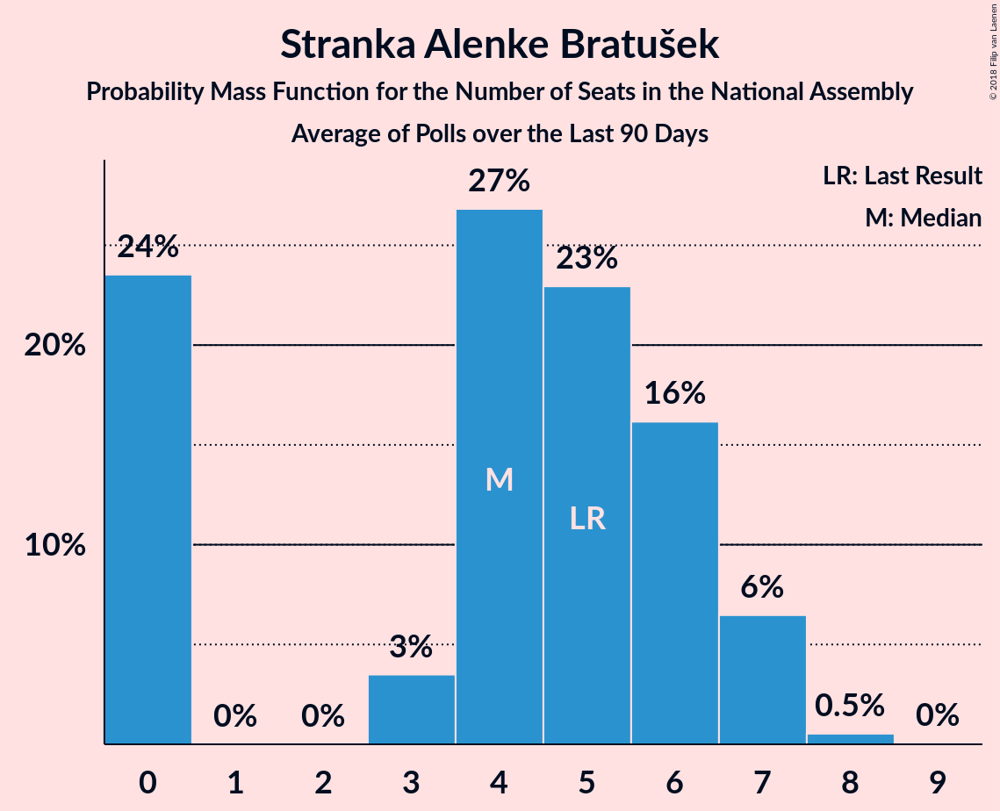

# Stranka Alenke Bratušek

<a href="#voting-intentions">Voting Intentions</a> | <a href="#seats">Seats</a>

## Voting Intentions

Last result: **5.1%** (General Election of 3 June 2018)

### Confidence Intervals

| Period     | Polling firm/Commissioner(s) | Median | 80% Confidence Interval | 90% Confidence Interval | 95% Confidence Interval | 99% Confidence Interval |
|:----------:|:----------------:|:-----------:|:-----------------------:|:-----------------------:|:-----------------------:|:-----------------------:|
| N/A | [Poll Average](average.html) | 2.1% | 1.1–4.2% | 0.9–4.6% | 0.8–5.0% | 0.6–5.6% |
| [1–26 July 2020](2020-07-26-Mediana.html) | Mediana   POPTV | 3.8% | 3.0–4.8% | 2.8–5.2% | 2.6–5.4% | 2.3–6.0% |
| [6–9 July 2020](2020-07-09-Mediana.html) | Mediana   POPTV | 2.3% | 1.8–3.2% | 1.6–3.5% | 1.5–3.7% | 1.2–4.2% |
| [29 June–2 July 2020](2020-07-02-Parsifal.html) | Parsifal   Nova 24TV | 1.3% | 0.9–2.0% | 0.7–2.2% | 0.7–2.4% | 0.5–2.8% |
| [1–28 June 2020](2020-06-28-Mediana.html) | Mediana   POPTV | 2.9% | 2.3–3.9% | 2.1–4.2% | 1.9–4.5% | 1.6–5.0% |
| [15–17 June 2020](2020-06-17-Parsifal.html) | Parsifal   Nova 24TV | 2.2% | 1.6–3.1% | 1.5–3.3% | 1.4–3.6% | 1.1–4.0% |
| [9–11 June 2020](2020-06-11-Ninamedia.html) | Ninamedia   Dnevnik, Večer | 1.9% | 1.3–2.7% | 1.2–2.9% | 1.1–3.2% | 0.9–3.6% |
| [18–21 May 2020](2020-05-21-Mediana.html) | Mediana   POPTV | 4.0% | 3.2–5.2% | 3.0–5.5% | 2.8–5.7% | 2.5–6.3% |
| [12–13 May 2020](2020-05-13-Ninamedia.html) | Ninamedia   Dnevnik, Večer | 1.7% | 1.2–2.5% | 1.1–2.8% | 1.0–3.0% | 0.8–3.4% |
| [6–8 May 2020](2020-05-08-Parsifal.html) | Parsifal   Nova 24TV | 3.7% | 3.0–4.8% | 2.8–5.1% | 2.6–5.3% | 2.3–5.9% |
| [4–8 May 2020](2020-05-08-Mediana.html) | Mediana   Delo | 1.4% | 1.0–2.2% | 0.9–2.4% | 0.8–2.6% | 0.6–3.0% |
| [26 April 2020](2020-04-26-Mediana.html) | Mediana   POPTV | 4.9% | 4.0–6.0% | 3.7–6.4% | 3.5–6.7% | 3.2–7.3% |
| [14–16 April 2020](2020-04-16-Ninamedia.html) | Ninamedia   Dnevnik, Večer | 1.0% | 0.7–1.7% | 0.6–1.9% | 0.5–2.1% | 0.4–2.4% |
| [6–9 April 2020](2020-04-09-Mediana.html) | Mediana   Delo | 4.0% | 3.2–5.1% | 3.0–5.4% | 2.8–5.7% | 2.5–6.3% |
| [10–12 March 2020](2020-03-12-Ninamedia.html) | Ninamedia   Dnevnik, Večer | 1.0% | 0.7–1.7% | 0.6–1.9% | 0.5–2.1% | 0.4–2.4% |
| [25 February–4 March 2020](2020-03-04-Mediana.html) | Mediana   Delo | 1.9% | 1.4–2.7% | 1.3–3.0% | 1.2–3.2% | 1.0–3.6% |
| [19–20 February 2020](2020-02-20-Parsifal.html) | Parsifal   Nova 24TV | 1.2% | 0.9–2.0% | 0.7–2.2% | 0.7–2.4% | 0.5–2.8% |
| [14 January–16 February 2020](2020-02-16-Ninamedia.html) | Ninamedia   RTV SLO | 1.1% | 0.8–1.9% | 0.7–2.1% | 0.6–2.2% | 0.4–2.6% |
| [12–13 February 2020](2020-02-13-Parsifal.html) | Parsifal   Nova 24 | 1.8% | 1.3–2.6% | 1.2–2.9% | 1.1–3.1% | 0.9–3.5% |
| [11–13 February 2020](2020-02-13-Ninamedia.html) | Ninamedia   RTV SLO | 1.4% | 1.0–2.2% | 0.9–2.4% | 0.8–2.6% | 0.6–3.0% |
| [3–5 February 2020](2020-02-05-Parsifal.html) | Parsifal   Nova 24 | 2.8% | 2.2–3.8% | 2.0–4.1% | 1.8–4.4% | 1.6–4.9% |
| [28 January–3 February 2020](2020-02-03-Mediana.html) | Mediana   Delo | 2.8% | 2.2–3.8% | 2.0–4.0% | 1.9–4.3% | 1.6–4.7% |
| [27–29 January 2020](2020-01-29-Parsifal.html) | Parsifal | 3.4% | 2.7–4.2% | 2.5–4.5% | 2.4–4.7% | 2.1–5.2% |
| [1–26 January 2020](2020-01-26-Mediana.html) | Mediana   POP TV | 2.9% | 2.2–3.8% | 2.0–4.1% | 1.9–4.3% | 1.6–4.8% |
| [3–9 January 2020](2020-01-09-Mediana.html) | Mediana   Delo | 3.2% | 2.5–4.2% | 2.3–4.5% | 2.1–4.7% | 1.8–5.3% |
| [10–12 December 2019](2019-12-12-Ninamedia.html) | Ninamedia   RTV SLO | 1.0% | 0.7–1.7% | 0.6–1.9% | 0.5–2.1% | 0.4–2.4% |
| [1–26 November 2019](2019-11-26-Mediana.html) | Mediana   POP TV | 2.0% | 1.5–2.9% | 1.4–3.1% | 1.2–3.4% | 1.0–3.8% |
| [12–14 November 2019](2019-11-14-Ninamedia.html) | Ninamedia   RTV SLO | 1.4% | 1.0–2.2% | 0.9–2.4% | 0.8–2.6% | 0.6–3.0% |
| [28 October–7 November 2019](2019-11-07-Mediana.html) | Mediana   Delo | 3.4% | 2.7–4.4% | 2.5–4.7% | 2.3–5.0% | 2.0–5.5% |
| [15–17 October 2019](2019-10-17-Ninamedia.html) | Ninamedia   RTV SLO | 1.6% | 1.1–2.4% | 1.0–2.6% | 0.9–2.8% | 0.7–3.2% |
| [1–22 September 2019](2019-09-22-Mediana.html) | Mediana   POP TV | 2.7% | 2.0–3.6% | 1.8–3.9% | 1.7–4.1% | 1.4–4.6% |
| [10–12 September 2019](2019-09-12-Ninamedia.html) | Ninamedia   RTV SLO | 2.6% | 2.0–3.5% | 1.8–3.8% | 1.6–4.0% | 1.4–4.5% |
| [28 August–5 September 2019](2019-09-05-Mediana.html) | Mediana   Delo | 3.4% | 2.7–4.5% | 2.5–4.8% | 2.3–5.0% | 2.0–5.6% |
| [1–25 August 2019](2019-08-25-Mediana.html) | Mediana   POP TV | 3.6% | 2.9–4.7% | 2.6–5.0% | 2.5–5.2% | 2.1–5.8% |
| [12–14 August 2019](2019-08-14-Ninamedia.html) | Ninamedia   RTV SLO and Dnevnik | 3.6% | 2.8–4.6% | 2.6–5.0% | 2.4–5.2% | 2.1–5.8% |
| [31 July–8 August 2019](2019-08-08-Mediana.html) | Mediana   Delo | 2.6% | 2.0–3.5% | 1.8–3.8% | 1.7–4.0% | 1.4–4.5% |
| [11–13 July 2019](2019-07-13-Ninamedia.html) | Ninamedia   RTV SLO and Dnevnik | 1.6% | 1.1–2.4% | 1.0–2.6% | 0.9–2.8% | 0.7–3.2% |
| [1–23 June 2019](2019-06-23-Mediana.html) | Mediana   POP TV | 3.2% | 2.5–4.2% | 2.3–4.5% | 2.1–4.8% | 1.8–5.3% |
| [11–13 June 2019](2019-06-13-Ninamedia.html) | Ninamedia   Dnevnik and Večer | 1.6% | 1.1–2.4% | 1.0–2.6% | 0.9–2.8% | 0.7–3.2% |
| [28 May–6 June 2019](2019-06-06-Mediana.html) | Mediana   POP TV | 3.1% | 2.4–4.1% | 2.2–4.3% | 2.1–4.6% | 1.8–5.1% |
| [14–16 May 2019](2019-05-16-Ninamedia.html) | Ninamedia   Dnevnik and RTV Slovenija | 2.0% | 1.5–2.9% | 1.3–3.1% | 1.2–3.3% | 1.0–3.8% |
| [8–15 May 2019](2019-05-15-Mediana.html) | Mediana   POP TV and Delo | 3.1% | 2.5–4.1% | 2.3–4.4% | 2.1–4.7% | 1.8–5.2% |
| [28 April 2019](2019-04-28-Mediana.html) | Mediana   POP TV | 2.1% | 1.5–3.0% | 1.3–3.3% | 1.2–3.6% | 1.0–4.1% |
| [9–11 April 2019](2019-04-11-Ninamedia.html) | Ninamedia   Dnevnik and RTV Slovenija | 2.6% | 1.9–3.8% | 1.7–4.1% | 1.5–4.4% | 1.2–5.0% |
| [1–4 April 2019](2019-04-04-ParsifalSC.html) | Parsifal SC   Nova24TV | 3.1% | 2.3–4.4% | 2.1–4.8% | 1.9–5.1% | 1.6–5.8% |
| [24 March 2019](2019-03-24-Mediana.html) | Mediana   POP TV | 5.1% | 4.1–6.4% | 3.8–6.8% | 3.6–7.2% | 3.1–7.9% |
| [12–14 March 2019](2019-03-14-Ninamedia.html) | Ninamedia   Dnevnik and RTV Slovenija | 2.5% | 1.8–3.6% | 1.6–3.9% | 1.5–4.2% | 1.2–4.8% |
| [26 February–7 March 2019](2019-03-07-Mediana.html) | Mediana   Delo | 2.1% | 1.5–3.2% | 1.3–3.5% | 1.2–3.8% | 0.9–4.4% |
| [24 February 2019](2019-02-24-Mediana.html) | Mediana   POP TV | 4.7% | 3.7–6.1% | 3.4–6.5% | 3.1–6.8% | 2.7–7.6% |
| [12–14 February 2019](2019-02-14-Ninamedia.html) | Ninamedia   Dnevnik and RTV Slovenija | 3.8% | 2.9–5.1% | 2.7–5.4% | 2.5–5.8% | 2.1–6.5% |
| [29 January–6 February 2019](2019-02-06-Ninamedia.html) | Ninamedia   MMC and RTV Slovenija | 2.4% | 1.8–3.4% | 1.6–3.6% | 1.4–3.9% | 1.2–4.4% |
| [8–10 January 2019](2019-01-10-Ninamedia.html) | Ninamedia   MMC and RTV Slovenija | 3.4% | 2.6–4.7% | 2.3–5.1% | 2.1–5.4% | 1.8–6.1% |
| [11–13 December 2018](2018-12-13-Ninamedia.html) | Ninamedia | 3.0% | 2.3–4.0% | 2.1–4.3% | 2.0–4.6% | 1.7–5.1% |
| [4–7 December 2018](2018-12-07-ParsifalSC.html) | Parsifal SC | 3.9% | 3.1–5.0% | 2.9–5.3% | 2.7–5.6% | 2.4–6.2% |
| [25 November 2018](2018-11-25-Mediana.html) | Mediana   POP TV | 4.6% | 3.6–6.0% | 3.3–6.4% | 3.1–6.8% | 2.7–7.5% |
| [19–20 November 2018](2018-11-20-Ninamedia.html) | Ninamedia   Dnevnik and RTV Slovenija | 3.0% | 2.2–4.2% | 2.0–4.5% | 1.8–4.8% | 1.5–5.4% |
| [7 November 2018](2018-11-07-ParsifalSC.html) | Parsifal SC | 3.0% | 2.3–4.0% | 2.1–4.3% | 2.0–4.5% | 1.7–5.0% |
| [1 November 2018](2018-11-01-Mediana.html) | Mediana | 5.0% | 4.1–6.2% | 3.8–6.5% | 3.6–6.8% | 3.2–7.4% |
| [9–11 October 2018](2018-10-11-Ninamedia.html) | Ninamedia | 4.0% | 3.2–5.1% | 3.0–5.4% | 2.8–5.7% | 2.4–6.3% |
| [3–11 October 2018](2018-10-11-Mediana.html) | Mediana   Delo | 6.1% | 5.1–7.4% | 4.8–7.7% | 4.6–8.1% | 4.1–8.7% |
| [11–13 September 2018](2018-09-13-Ninamedia.html) | Ninamedia | 5.0% | 4.0–6.4% | 3.7–6.8% | 3.5–7.1% | 3.0–7.8% |
| [30 August–6 September 2018](2018-09-06-Mediana.html) | Mediana   Delo | 4.8% | 3.8–6.3% | 3.5–6.7% | 3.2–7.1% | 2.8–7.9% |
| [26 August 2018](2018-08-26-Mediana.html) | Mediana   POP TV | 4.6% | 3.6–6.1% | 3.4–6.5% | 3.1–6.9% | 2.7–7.7% |
| [13–15 August 2018](2018-08-15-Ninamedia.html) | Ninamedia   Dnevnik and RTV Slovenija | 2.1% | 1.5–3.2% | 1.4–3.4% | 1.2–3.7% | 1.0–4.3% |
| [29 July 2018](2018-07-29-Mediana.html) | Mediana   POP TV | 5.5% | 4.4–7.0% | 4.1–7.4% | 3.8–7.8% | 3.4–8.5% |
| [10–12 July 2018](2018-07-12-Ninamedia.html) | Ninamedia   Dnevnik and RTV Slovenija | 3.5% | 2.7–4.6% | 2.5–5.0% | 2.3–5.3% | 2.0–5.9% |
| [1–23 June 2018](2018-06-23-Mediana.html) | Mediana   POP TV | 4.5% | 3.6–5.8% | 3.3–6.2% | 3.1–6.5% | 2.7–7.2% |
| [12–14 June 2018](2018-06-14-Ninamedia.html) | Ninamedia   Dnevnik and RTV Slovenija | 4.5% | 3.6–5.8% | 3.3–6.1% | 3.1–6.5% | 2.7–7.1% |
| [5–6 June 2018](2018-06-06-ParsifalSC.html) | Parsifal SC   Nova24TV | 4.7% | 3.7–6.2% | 3.4–6.6% | 3.2–7.0% | 2.8–7.7% |

### Probability Mass Function

The following table shows the probability mass function per percentage block of voting intentions for the [poll average](average.html) for Stranka Alenke Bratušek.

| Voting Intentions | Probability | Accumulated | Special Marks |
|:-----------------:|:-----------:|:-----------:|:-------------:|
| 0.0–0.5% | 0.2% | 100% |  |
| 0.5–1.5% | 29% | 99.8% |  |
| 1.5–2.5% | 33% | 71% | Median |
| 2.5–3.5% | 16% | 38% |  |
| 3.5–4.5% | 17% | 22% |  |
| 4.5–5.5% | 5% | 6% | Last Result |
| 5.5–6.5% | 0.6% | 0.6% |  |
| 6.5–7.5% | 0% | 0% |  |

## Seats

Last result: **5** seats (General Election of 3 June 2018)

### Confidence Intervals

| Period     | Polling firm/Commissioner(s) | Median | 80% Confidence Interval | 90% Confidence Interval | 95% Confidence Interval | 99% Confidence Interval |
|:----------:|:----------------:|:------:|:-----------------------:|:-----------------------:|:-----------------------:|:-----------------------:|
| N/A | [Poll Average](average.html) | 0 | 0–4 | 0–4 | 0–4 | 0–5 |
| [1–26 July 2020](2020-07-26-Mediana.html) | Mediana   POPTV | 0 | 0–4 | 0–4 | 0–5 | 0–5 |
| [6–9 July 2020](2020-07-09-Mediana.html) | Mediana   POPTV | 0 | 0 | 0 | 0 | 0–4 |
| [29 June–2 July 2020](2020-07-02-Parsifal.html) | Parsifal   Nova 24TV | 0 | 0 | 0 | 0 | 0 |
| [1–28 June 2020](2020-06-28-Mediana.html) | Mediana   POPTV | 0 | 0 | 0–3 | 0–4 | 0–4 |
| [15–17 June 2020](2020-06-17-Parsifal.html) | Parsifal   Nova 24TV | 0 | 0 | 0 | 0 | 0 |
| [9–11 June 2020](2020-06-11-Ninamedia.html) | Ninamedia   Dnevnik, Večer | 0 | 0 | 0 | 0 | 0 |
| [18–21 May 2020](2020-05-21-Mediana.html) | Mediana   POPTV | 0 | 0–4 | 0–5 | 0–5 | 0–6 |
| [12–13 May 2020](2020-05-13-Ninamedia.html) | Ninamedia   Dnevnik, Večer | 0 | 0 | 0 | 0 | 0 |
| [6–8 May 2020](2020-05-08-Parsifal.html) | Parsifal   Nova 24TV | 0 | 0–4 | 0–4 | 0–5 | 0–5 |
| [4–8 May 2020](2020-05-08-Mediana.html) | Mediana   Delo | 0 | 0 | 0 | 0 | 0 |
| [26 April 2020](2020-04-26-Mediana.html) | Mediana   POPTV | 4 | 0–5 | 0–6 | 0–6 | 0–6 |
| [14–16 April 2020](2020-04-16-Ninamedia.html) | Ninamedia   Dnevnik, Večer | 0 | 0 | 0 | 0 | 0 |
| [6–9 April 2020](2020-04-09-Mediana.html) | Mediana   Delo | 4 | 0–4 | 0–5 | 0–5 | 0–6 |
| [10–12 March 2020](2020-03-12-Ninamedia.html) | Ninamedia   Dnevnik, Večer | 0 | 0 | 0 | 0 | 0 |
| [25 February–4 March 2020](2020-03-04-Mediana.html) | Mediana   Delo | 0 | 0 | 0 | 0 | 0 |
| [19–20 February 2020](2020-02-20-Parsifal.html) | Parsifal   Nova 24TV | 0 | 0 | 0 | 0 | 0 |
| [14 January–16 February 2020](2020-02-16-Ninamedia.html) | Ninamedia   RTV SLO | 0 | 0 | 0 | 0 | 0 |
| [12–13 February 2020](2020-02-13-Parsifal.html) | Parsifal   Nova 24 | 0 | 0 | 0 | 0 | 0 |
| [11–13 February 2020](2020-02-13-Ninamedia.html) | Ninamedia   RTV SLO | 0 | 0 | 0 | 0 | 0 |
| [3–5 February 2020](2020-02-05-Parsifal.html) | Parsifal   Nova 24 | 0 | 0 | 0–4 | 0–4 | 0–4 |
| [28 January–3 February 2020](2020-02-03-Mediana.html) | Mediana   Delo | 0 | 0 | 0–4 | 0–4 | 0–4 |
| [27–29 January 2020](2020-01-29-Parsifal.html) | Parsifal | 0 | 0–4 | 0–4 | 0–4 | 0–4 |
| [1–26 January 2020](2020-01-26-Mediana.html) | Mediana   POP TV | 0 | 0 | 0–4 | 0–4 | 0–4 |
| [3–9 January 2020](2020-01-09-Mediana.html) | Mediana   Delo | 0 | 0–4 | 0–4 | 0–4 | 0–4 |
| [10–12 December 2019](2019-12-12-Ninamedia.html) | Ninamedia   RTV SLO | 0 | 0 | 0 | 0 | 0 |
| [1–26 November 2019](2019-11-26-Mediana.html) | Mediana   POP TV | 0 | 0 | 0 | 0 | 0 |
| [12–14 November 2019](2019-11-14-Ninamedia.html) | Ninamedia   RTV SLO | 0 | 0 | 0 | 0 | 0 |
| [28 October–7 November 2019](2019-11-07-Mediana.html) | Mediana   Delo | 0 | 0–4 | 0–4 | 0–5 | 0–5 |
| [15–17 October 2019](2019-10-17-Ninamedia.html) | Ninamedia   RTV SLO | 0 | 0 | 0 | 0 | 0 |
| [1–22 September 2019](2019-09-22-Mediana.html) | Mediana   POP TV | 0 | 0 | 0 | 0–4 | 0–4 |
| [10–12 September 2019](2019-09-12-Ninamedia.html) | Ninamedia   RTV SLO | 0 | 0 | 0 | 0 | 0–4 |
| [28 August–5 September 2019](2019-09-05-Mediana.html) | Mediana   Delo | 0 | 0 | 0 | 0–4 | 0–5 |
| [1–25 August 2019](2019-08-25-Mediana.html) | Mediana   POP TV | 0 | 0–4 | 0–4 | 0–4 | 0–5 |
| [12–14 August 2019](2019-08-14-Ninamedia.html) | Ninamedia   RTV SLO and Dnevnik | 0 | 0–4 | 0–4 | 0–4 | 0–5 |
| [31 July–8 August 2019](2019-08-08-Mediana.html) | Mediana   Delo | 0 | 0 | 0 | 0 | 0–4 |
| [11–13 July 2019](2019-07-13-Ninamedia.html) | Ninamedia   RTV SLO and Dnevnik | 0 | 0 | 0 | 0 | 0 |
| [1–23 June 2019](2019-06-23-Mediana.html) | Mediana   POP TV | 0 | 0–4 | 0–4 | 0–4 | 0–5 |
| [11–13 June 2019](2019-06-13-Ninamedia.html) | Ninamedia   Dnevnik and Večer | 0 | 0 | 0 | 0 | 0 |
| [28 May–6 June 2019](2019-06-06-Mediana.html) | Mediana   POP TV | 0 | 0–4 | 0–4 | 0–4 | 0–5 |
| [14–16 May 2019](2019-05-16-Ninamedia.html) | Ninamedia   Dnevnik and RTV Slovenija | 0 | 0 | 0 | 0 | 0 |
| [8–15 May 2019](2019-05-15-Mediana.html) | Mediana   POP TV and Delo | 0 | 0–3 | 0–4 | 0–4 | 0–5 |
| [28 April 2019](2019-04-28-Mediana.html) | Mediana   POP TV | 0 | 0 | 0 | 0 | 0–3 |
| [9–11 April 2019](2019-04-11-Ninamedia.html) | Ninamedia   Dnevnik and RTV Slovenija | 0 | 0 | 0 | 0–4 | 0–4 |
| [1–4 April 2019](2019-04-04-ParsifalSC.html) | Parsifal SC   Nova24TV | 0 | 0–4 | 0–4 | 0–5 | 0–5 |
| [24 March 2019](2019-03-24-Mediana.html) | Mediana   POP TV | 4 | 4–6 | 0–6 | 0–6 | 0–7 |
| [12–14 March 2019](2019-03-14-Ninamedia.html) | Ninamedia   Dnevnik and RTV Slovenija | 0 | 0 | 0–3 | 0–4 | 0–4 |
| [26 February–7 March 2019](2019-03-07-Mediana.html) | Mediana   Delo | 0 | 0 | 0 | 0 | 0–4 |
| [24 February 2019](2019-02-24-Mediana.html) | Mediana   POP TV | 5 | 4–5 | 0–5 | 0–6 | 0–7 |
| [12–14 February 2019](2019-02-14-Ninamedia.html) | Ninamedia   Dnevnik and RTV Slovenija | 4 | 0–5 | 0–5 | 0–5 | 0–6 |
| [29 January–6 February 2019](2019-02-06-Ninamedia.html) | Ninamedia   MMC and RTV Slovenija | 0 | 0 | 0 | 0 | 0–4 |
| [8–10 January 2019](2019-01-10-Ninamedia.html) | Ninamedia   MMC and RTV Slovenija | 0 | 0–5 | 0–5 | 0–5 | 0–5 |
| [11–13 December 2018](2018-12-13-Ninamedia.html) | Ninamedia | 0 | 0 | 0–3 | 0–4 | 0–5 |
| [4–7 December 2018](2018-12-07-ParsifalSC.html) | Parsifal SC | 0 | 0–4 | 0–5 | 0–5 | 0–6 |
| [25 November 2018](2018-11-25-Mediana.html) | Mediana   POP TV | 4 | 0–5 | 0–5 | 0–6 | 0–6 |
| [19–20 November 2018](2018-11-20-Ninamedia.html) | Ninamedia   Dnevnik and RTV Slovenija | 0 | 0–3 | 0–4 | 0–4 | 0–5 |
| [7 November 2018](2018-11-07-ParsifalSC.html) | Parsifal SC | 0 | 0 | 0 | 0–4 | 0–4 |
| [1 November 2018](2018-11-01-Mediana.html) | Mediana | 4 | 4–6 | 0–6 | 0–6 | 0–7 |
| [9–11 October 2018](2018-10-11-Ninamedia.html) | Ninamedia | 3 | 0–5 | 0–5 | 0–5 | 0–6 |
| [3–11 October 2018](2018-10-11-Mediana.html) | Mediana   Delo | 5 | 4–7 | 4–7 | 4–7 | 4–8 |
| [11–13 September 2018](2018-09-13-Ninamedia.html) | Ninamedia | 4 | 0–6 | 0–6 | 0–6 | 0–7 |
| [30 August–6 September 2018](2018-09-06-Mediana.html) | Mediana   Delo | 4 | 0–5 | 0–6 | 0–6 | 0–7 |
| [26 August 2018](2018-08-26-Mediana.html) | Mediana   POP TV | 4 | 0–5 | 0–5 | 0–6 | 0–7 |
| [13–15 August 2018](2018-08-15-Ninamedia.html) | Ninamedia   Dnevnik and RTV Slovenija | 0 | 0 | 0 | 0 | 0–4 |
| [29 July 2018](2018-07-29-Mediana.html) | Mediana   POP TV | 5 | 4–6 | 4–7 | 0–7 | 0–8 |
| [10–12 July 2018](2018-07-12-Ninamedia.html) | Ninamedia   Dnevnik and RTV Slovenija | 0 | 0–4 | 0–4 | 0–5 | 0–5 |
| [1–23 June 2018](2018-06-23-Mediana.html) | Mediana   POP TV | 4 | 0–5 | 0–6 | 0–6 | 0–6 |
| [12–14 June 2018](2018-06-14-Ninamedia.html) | Ninamedia   Dnevnik and RTV Slovenija | 4 | 0–5 | 0–5 | 0–6 | 0–6 |
| [5–6 June 2018](2018-06-06-ParsifalSC.html) | Parsifal SC   Nova24TV | 4 | 0–5 | 0–6 | 0–6 | 0–7 |

### Probability Mass Function

The following table shows the probability mass function per seat for the [poll average](average.html) for Stranka Alenke Bratušek.

| Number of Seats | Probability | Accumulated | Special Marks |
|:---------------:|:-----------:|:-----------:|:-------------:|
| 0 | 86% | 100% | Median |
| 1 | 0% | 14% |  |
| 2 | 0% | 14% |  |
| 3 | 0.7% | 14% |  |
| 4 | 12% | 13% |  |
| 5 | 1.4% | 1.5% | Last Result |
| 6 | 0.1% | 0.1% |  |
| 7 | 0% | 0% |  |

