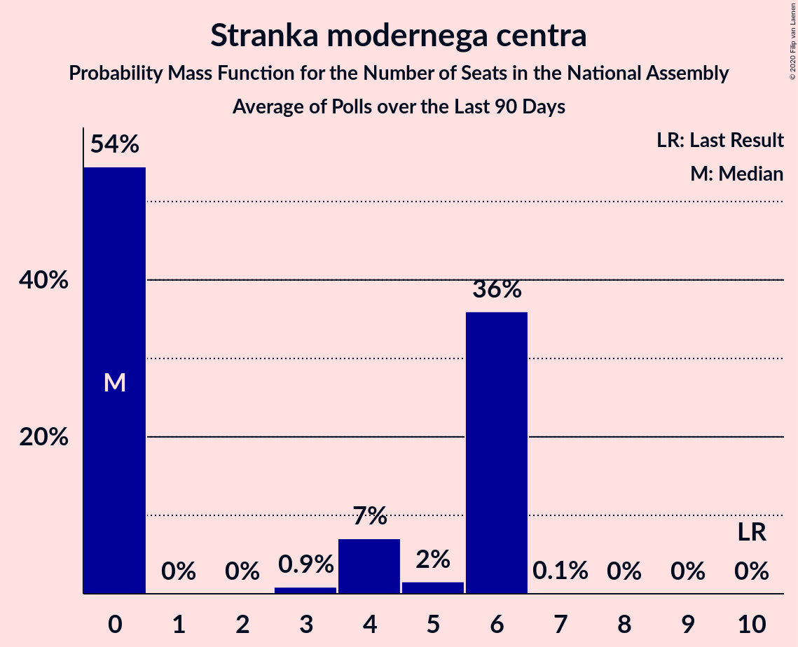

# Stranka modernega centra

<a href="#voting-intentions">Voting Intentions</a> | <a href="#seats">Seats</a>

## Voting Intentions

Last result: **9.7%** (General Election of 3 June 2018)

### Confidence Intervals

| Period     | Polling firm/Commissioner(s) | Median | 80% Confidence Interval | 90% Confidence Interval | 95% Confidence Interval | 99% Confidence Interval |
|:----------:|:----------------:|:-----------:|:-----------------------:|:-----------------------:|:-----------------------:|:-----------------------:|
| N/A | [Poll Average](average.html) | 8.1% | 6.2–11.0% | 5.8–11.7% | 5.4–12.2% | 4.8–13.2% |
| [29 July 2018](2018-07-29-Mediana.html) | Mediana   POP TV | 7.0% | 5.8–8.6% | 5.4–9.1% | 5.1–9.5% | 4.6–10.3% |
| [10–12 July 2018](2018-07-12-Ninamedia.html) | Ninamedia   Dnevnik and RTV Slovenija | 10.2% | 8.8–12.0% | 8.4–12.5% | 8.1–12.9% | 7.4–13.8% |
| [1–23 June 2018](2018-06-23-Mediana.html) | Mediana   POP TV | 7.2% | 6.0–8.7% | 5.7–9.2% | 5.4–9.6% | 4.9–10.4% |
| [12–14 June 2018](2018-06-14-Ninamedia.html) | Ninamedia   Dnevnik and RTV Slovenija | 10.7% | 9.2–12.5% | 8.8–13.0% | 8.4–13.4% | 7.8–14.3% |
| [5–6 June 2018](2018-06-06-ParsifalSC.html) | Parsifal SC   Nova24TV | 7.5% | 6.2–9.2% | 5.8–9.7% | 5.5–10.1% | 4.9–11.0% |

### Probability Mass Function

The following table shows the probability mass function per percentage block of voting intentions for the [poll average](average.html) for Stranka modernega centra.

| Voting Intentions | Probability | Accumulated | Special Marks |
|:-----------------:|:-----------:|:-----------:|:-------------:|
| 2.5–3.5% | 0% | 100% |  |
| 3.5–4.5% | 0.2% | 100% |  |
| 4.5–5.5% | 3% | 99.8% |  |
| 5.5–6.5% | 13% | 97% |  |
| 6.5–7.5% | 22% | 84% |  |
| 7.5–8.5% | 20% | 62% | Median |
| 8.5–9.5% | 15% | 42% |  |
| 9.5–10.5% | 13% | 27% | Last Result |
| 10.5–11.5% | 9% | 15% |  |
| 11.5–12.5% | 4% | 6% |  |
| 12.5–13.5% | 1.3% | 2% |  |
| 13.5–14.5% | 0.2% | 0.3% |  |
| 14.5–15.5% | 0% | 0% |  |

## Seats

Last result: **10** seats (General Election of 3 June 2018)

### Confidence Intervals

| Period     | Polling firm/Commissioner(s) | Median | 80% Confidence Interval | 90% Confidence Interval | 95% Confidence Interval | 99% Confidence Interval |
|:----------:|:----------------:|:------:|:-----------------------:|:-----------------------:|:-----------------------:|:-----------------------:|
| N/A | [Poll Average](average.html) | 7 | 5–10 | 5–11 | 5–11 | 4–13 |
| [29 July 2018](2018-07-29-Mediana.html) | Mediana   POP TV | 6 | 5–8 | 5–8 | 4–9 | 4–10 |
| [10–12 July 2018](2018-07-12-Ninamedia.html) | Ninamedia   Dnevnik and RTV Slovenija | 9 | 8–11 | 8–12 | 7–13 | 7–14 |
| [1–23 June 2018](2018-06-23-Mediana.html) | Mediana   POP TV | 7 | 5–8 | 5–9 | 5–9 | 4–10 |
| [12–14 June 2018](2018-06-14-Ninamedia.html) | Ninamedia   Dnevnik and RTV Slovenija | 10 | 8–12 | 8–12 | 8–13 | 7–14 |
| [5–6 June 2018](2018-06-06-ParsifalSC.html) | Parsifal SC   Nova24TV | 7 | 5–8 | 5–8 | 5–9 | 4–10 |

### Probability Mass Function

The following table shows the probability mass function per seat for the [poll average](average.html) for Stranka modernega centra.

| Number of Seats | Probability | Accumulated | Special Marks |
|:---------------:|:-----------:|:-----------:|:-------------:|
| 3 | 0% | 100% |  |
| 4 | 2% | 99.9% |  |
| 5 | 10% | 98% |  |
| 6 | 23% | 89% |  |
| 7 | 20% | 65% | Median |
| 8 | 18% | 46% |  |
| 9 | 14% | 28% |  |
| 10 | 7% | 14% | Last Result |
| 11 | 5% | 7% |  |
| 12 | 1.4% | 2% |  |
| 13 | 0.6% | 0.9% |  |
| 14 | 0.3% | 0.3% |  |
| 15 | 0% | 0% |  |

